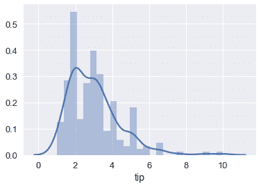
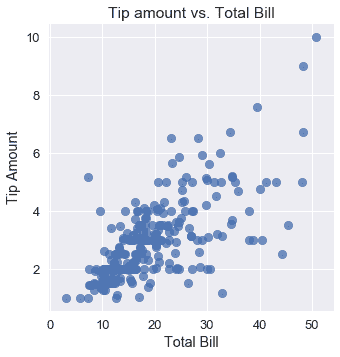

# 预测小费金额

> 原文：[https://www.bookbookmark.ds100.org/ch/13/linear_tips.html](https://www.bookbookmark.ds100.org/ch/13/linear_tips.html)

```
# HIDDEN
# Clear previously defined variables
%reset -f

# Set directory for data loading to work properly
import os
os.chdir(os.path.expanduser('~/notebooks/13'))

```

```
# HIDDEN
import warnings
# Ignore numpy dtype warnings. These warnings are caused by an interaction
# between numpy and Cython and can be safely ignored.
# Reference: https://stackoverflow.com/a/40846742
warnings.filterwarnings("ignore", message="numpy.dtype size changed")
warnings.filterwarnings("ignore", message="numpy.ufunc size changed")

import numpy as np
import matplotlib.pyplot as plt
import pandas as pd
import seaborn as sns
%matplotlib inline
import ipywidgets as widgets
from ipywidgets import interact, interactive, fixed, interact_manual
import nbinteract as nbi

sns.set()
sns.set_context('talk')
np.set_printoptions(threshold=20, precision=2, suppress=True)
pd.options.display.max_rows = 7
pd.options.display.max_columns = 8
pd.set_option('precision', 2)
# This option stops scientific notation for pandas
# pd.set_option('display.float_format', '{:.2f}'.format)

```

以前，我们使用一个数据集，该数据集包含一个服务生一周内提供的每个表的一行。我们的服务员收集了这些数据，以便预测他将来从一张桌子上能收到的小费金额。

```
tips = sns.load_dataset('tips')
tips.head()

```

|  | 账单合计 | 提示 | 性别 | 吸烟者 | 白天 | 时间 | 大小 |
| --- | --- | --- | --- | --- | --- | --- | --- |
| 零 | 十六点九九 | 1.01 年 | 女性 | 不 | 太阳 | 晚餐 | 二 |
| --- | --- | --- | --- | --- | --- | --- | --- |
| 1 个 | 十点三四 | 一点六六 | 男性 | No | Sun | Dinner | 三 |
| --- | --- | --- | --- | --- | --- | --- | --- |
| 二 | 二十一点零一 | 3.50 美元 | Male | No | Sun | Dinner | 3 |
| --- | --- | --- | --- | --- | --- | --- | --- |
| 三 | 二十三点六八 | 三点三一 | Male | No | Sun | Dinner | 2 |
| --- | --- | --- | --- | --- | --- | --- | --- |
| 四 | 二十四点五九 | 三点六一 | Female | No | Sun | Dinner | 四 |
| --- | --- | --- | --- | --- | --- | --- | --- |

```
sns.distplot(tips['tip'], bins=25);

```



如前所述，如果我们选择一个常数模型和均方误差成本，我们的模型将预测尖端数量的平均值：

```
np.mean(tips['tip'])

```

```
2.9982786885245902
```

这意味着，如果一个新的聚会点了一顿饭，服务员问我们他可能会收到多少小费，我们会说“大约 3 美元”，不管桌子有多大，或者他们的总帐单有多少。

然而，观察数据集中的其他变量，我们发现如果我们将它们合并到我们的模型中，我们可能能够做出更准确的预测。例如，下面的小费金额与总账单的图表显示了一个正关联。

```
# HIDDEN
sns.lmplot(x='total_bill', y='tip', data=tips, fit_reg=False)
plt.title('Tip amount vs. Total Bill')
plt.xlabel('Total Bill')
plt.ylabel('Tip Amount');

```



虽然小费的平均金额是 3 美元，但如果一张桌子订购价值 40 美元的食物，我们肯定会期望服务员收到超过 3 美元的小费。因此，我们希望改变我们的模型，使其基于数据集中的变量进行预测，而不是盲目地预测平均尖端量。为此，我们使用线性模型而不是常量模型。

让我们简要回顾一下我们当前的建模和估计工具箱，并定义一些新的表示法，以便更好地表示线性模型所具有的额外复杂性。

## 定义简单线性模型

我们有兴趣根据一张表的总帐单来预测小费金额。让$Y$代表小费金额，这是我们试图预测的变量。让$x$代表总账单，我们将其合并用于预测的变量。

我们定义了一个线性模型$f_ \boldSymbol\theta^*$依赖于$x$：

$$ f_\boldsymbol\theta^* (x) = \theta_1^* x + \theta_0^* $$

我们将$f_u \boldsymbol\theta^*（x）$作为生成数据的基础函数。

$F_u \boldsymbol\theta^*（x）$假设实际上，$Y$与$X$具有完全线性关系。然而，由于一些随机噪声，我们的观测数据并没有完全沿着直线移动。在数学上，我们通过添加一个噪声项来解释这一点：

$$ y = f_\boldsymbol\theta^* (x) + \epsilon $$

如果假设$Y$与$X$的关系是完全线性的，并且我们能够以某种方式找到$\theta_1^*$和$\theta_0^*$的精确值，并且我们神奇地没有随机噪声，那么我们就能够完美地预测服务员为所有桌子得到的小费的数量，永远。当然，在实践中我们不能完全满足这些标准中的任何一个。相反，我们将使用我们的数据集来估计$\theta_1^*$和$\theta_0^*$以使我们的预测尽可能准确。

### 线性模型估计

由于我们找不到确切的$\Theta_1^*$和$\Theta_0^*$数据，因此我们假设数据集近似于我们的总体，并使用数据集来估计这些参数。我们用$\theta_$和$\theta_$表示我们的估计，用$\hat \theta_ 和$\hat \theta_ 表示我们的拟合估计，我们的模型为：

$$ f_\boldsymbol\theta (x) = \theta_1 x + \theta_0 $$

有时，您会看到$H（x）$而不是$F \BoldSymbol\Theta（x）$的书写，$H$代表假设，因为$F \BoldSymbol\Theta（x）$是我们对$F \BoldSymbol\Theta ^*（x）$的假设。

为了确定$\hat \theta 1 和$\hat \theta 0 美元，我们选择了一个成本函数，并使用梯度下降将其最小化。