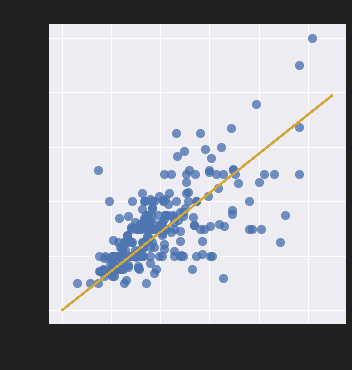

# 用梯度下降拟合线性模型

> 原文：[https://www.textbook.ds100.org/ch/13/linear_grad.html](https://www.textbook.ds100.org/ch/13/linear_grad.html)

```
# HIDDEN
# Clear previously defined variables
%reset -f

# Set directory for data loading to work properly
import os
os.chdir(os.path.expanduser('~/notebooks/13'))

```

```
# HIDDEN
import warnings
# Ignore numpy dtype warnings. These warnings are caused by an interaction
# between numpy and Cython and can be safely ignored.
# Reference: https://stackoverflow.com/a/40846742
warnings.filterwarnings("ignore", message="numpy.dtype size changed")
warnings.filterwarnings("ignore", message="numpy.ufunc size changed")

import numpy as np
import matplotlib.pyplot as plt
import pandas as pd
import seaborn as sns
%matplotlib inline
import ipywidgets as widgets
from ipywidgets import interact, interactive, fixed, interact_manual
import nbinteract as nbi

sns.set()
sns.set_context('talk')
np.set_printoptions(threshold=20, precision=2, suppress=True)
pd.options.display.max_rows = 7
pd.options.display.max_columns = 8
pd.set_option('precision', 2)
# This option stops scientific notation for pandas
# pd.set_option('display.float_format', '{:.2f}'.format)

```

```
# HIDDEN
tips = sns.load_dataset('tips')

```

```
# HIDDEN
def minimize(loss_fn, grad_loss_fn, x_vals, y_vals,
             alpha=0.0005, progress=True):
    '''
    Uses gradient descent to minimize loss_fn. Returns the minimizing value of
    theta once the loss changes less than 0.0001 between iterations.
    '''
    theta = np.array([0., 0.])
    loss = loss_fn(theta, x_vals, y_vals)
    while True:
        if progress:
            print(f'theta: {theta} | loss: {loss}')
        gradient = grad_loss_fn(theta, x_vals, y_vals)
        new_theta = theta - alpha * gradient
        new_loss = loss_fn(new_theta, x_vals, y_vals)

        if abs(new_loss - loss) < 0.0001:
            return new_theta

        theta = new_theta
        loss = new_loss

```

我们希望拟合一个线性模型，该模型根据表中的总账单预测小费金额：

$$ f_\boldsymbol\theta (x) = \theta_1 x + \theta_0 $$

为了优化$\Theta_1$和$\Theta_0$，我们需要首先选择一个损失函数。我们将选择均方误差损失函数：

$$ \begin{aligned} L(\boldsymbol\theta, \textbf{x}, \textbf{y}) &= \frac{1}{n} \sum_{i = 1}^{n}(y_i - f_\boldsymbol\theta (x_i))^2\\ \end{aligned} $$

请注意，我们已经修改了损失函数，以反映在新模型中添加的解释变量。现在，$\textbf x$是一个包含单个总账单的向量，$\textbf y$是一个包含单个小费金额的向量，$\boldsymbol\theta$是一个向量：$\boldsymbol\theta=[\theta\u 1，\theta\u 0]$。

使用带平方误差的线性模型也可以用最小二乘线性回归的名称。我们可以使用渐变下降来找到能将损失最小化的$\BoldSymbol\Theta$。

**关于使用相关性的旁白**

如果您以前见过最小二乘线性回归，您可能会认识到我们可以计算相关系数，并用它来确定$\theta_1$和$\theta_0$。对于这个特定的问题，这比使用梯度下降法计算更简单、更快，类似于计算平均值比使用梯度下降法拟合常量模型更简单。不管怎样，我们都会使用梯度下降，因为它是一种通用的损失最小化方法，当我们稍后引入没有解析解的模型时仍然有效。事实上，在许多现实场景中，即使存在分析解，我们也会使用梯度下降，因为计算分析解比梯度下降要花更长的时间，尤其是在大型数据集上。

## MSE 损失的导数[¶](#Derivative-of-the-MSE-Loss)

为了使用梯度下降，我们必须计算 MSE 损失相对于$\BoldSymbol\Theta$的导数。既然$\BoldSymbol\Theta$是长度为 2 的向量，而不是标量，$\nabla \BoldSymbol\Theta l（\BoldSymbol\Theta、\textbf x、\textbf y）$也将是长度为 2 的向量。

$$ \begin{aligned} \nabla_{\boldsymbol\theta} L(\boldsymbol\theta, \textbf{x}, \textbf{y}) &= \nabla_{\boldsymbol\theta} \left[ \frac{1}{n} \sum_{i = 1}^{n}(y_i - f_\boldsymbol\theta (x_i))^2 \right] \\ &= \frac{1}{n} \sum_{i = 1}^{n}2 (y_i - f_\boldsymbol\theta (x_i))(- \nabla_{\boldsymbol\theta} f_\boldsymbol\theta (x_i))\\ &= -\frac{2}{n} \sum_{i = 1}^{n}(y_i - f_\boldsymbol\theta (x_i))(\nabla_{\boldsymbol\theta} f_\boldsymbol\theta (x_i))\\ \end{aligned} $$

我们知道：

$$ f_\boldsymbol\theta (x) = \theta_1 x + \theta_0 $$

我们现在需要计算$\nabla_ \boldsymbol\theta_f UuBoldsymbol\theta（x_i）$这是一个长度为 2 的向量。

$$ \begin{aligned} \nabla_{\boldsymbol\theta} f_\boldsymbol\theta (x_i) &= \begin{bmatrix} \frac{\partial}{\partial \theta_0} f_\boldsymbol\theta (x_i)\\ \frac{\partial}{\partial \theta_1} f_\boldsymbol\theta (x_i) \end{bmatrix} \\ &= \begin{bmatrix} \frac{\partial}{\partial \theta_0} [\theta_1 x_i + \theta_0]\\ \frac{\partial}{\partial \theta_1} [\theta_1 x_i + \theta_0] \end{bmatrix} \\ &= \begin{bmatrix} 1 \\ x_i \end{bmatrix} \\ \end{aligned} $$

最后，我们再回到上面的公式中，得到

$$ \begin{aligned} \nabla_{\boldsymbol\theta} L(\theta, \textbf{x}, \textbf{y}) &= -\frac{2}{n} \sum_{i = 1}^{n}(y_i - f_\boldsymbol\theta (x_i))(\nabla_{\boldsymbol\theta} f_\boldsymbol\theta (x_i))\\ &= -\frac{2}{n} \sum_{i = 1}^{n} (y_i - f_\boldsymbol\theta (x_i)) \begin{bmatrix} 1 \\ x_i \end{bmatrix} \\ &= -\frac{2}{n} \sum_{i = 1}^{n} \begin{bmatrix} (y_i - f_\boldsymbol\theta (x_i)) \\ (y_i - f_\boldsymbol\theta (x_i)) x_i \end{bmatrix} \\ \end{aligned} $$

这是一个长度为 2 的向量，因为$（y_i-f_uuBoldSymbol\theta（x_i））$是标量。

## 运行梯度下降

现在，让我们在 tip s 数据集上拟合一个线性模型，从总表账单中预测 tip 金额。

首先，我们定义一个 python 函数来计算损失：

```
def simple_linear_model(thetas, x_vals):
    '''Returns predictions by a linear model on x_vals.'''
    return thetas[0] + thetas[1] * x_vals

def mse_loss(thetas, x_vals, y_vals):
    return np.mean((y_vals - simple_linear_model(thetas, x_vals)) ** 2)

```

然后，我们定义一个函数来计算损失的梯度：

```
def grad_mse_loss(thetas, x_vals, y_vals):
    n = len(x_vals)
    grad_0 = y_vals - simple_linear_model(thetas, x_vals)
    grad_1 = (y_vals - simple_linear_model(thetas, x_vals)) * x_vals
    return -2 / n * np.array([np.sum(grad_0), np.sum(grad_1)])

```

```
# HIDDEN
thetas = np.array([1, 1])
x_vals = np.array([3, 4])
y_vals = np.array([4, 5])
assert np.allclose(grad_mse_loss(thetas, x_vals, y_vals), [0, 0])

```

我们将使用前面定义的`minimize`函数，它运行梯度下降，解释新的解释变量。它具有函数签名（省略正文）：

```
minimize(loss_fn, grad_loss_fn, x_vals, y_vals)

```

最后，我们进行梯度下降！

```
%%time

thetas = minimize(mse_loss, grad_mse_loss, tips['total_bill'], tips['tip'])

```

```
theta: [0\. 0.] | cost: 10.896283606557377
theta: [0\.   0.07] | cost: 3.8937622006094705
theta: [0\.  0.1] | cost: 1.9359443267168215
theta: [0.01 0.12] | cost: 1.388538448286097
theta: [0.01 0.13] | cost: 1.235459416905535
theta: [0.01 0.14] | cost: 1.1926273731479433
theta: [0.01 0.14] | cost: 1.1806184944517062
theta: [0.01 0.14] | cost: 1.177227251696266
theta: [0.01 0.14] | cost: 1.1762453624313751
theta: [0.01 0.14] | cost: 1.1759370980989148
theta: [0.01 0.14] | cost: 1.175817178966766
CPU times: user 272 ms, sys: 67.3 ms, total: 339 ms
Wall time: 792 ms

```

我们可以看到梯度下降收敛到θ的值，即，θ0=0.01 美元，θ1=0.14 美元。我们的线性模型是：

$$y = 0.14x + 0.01$$

我们可以使用我们的估计θ，在原始数据点的旁边做出和绘制预测。

```
# HIDDEN
x_vals = np.array([0, 55])
sns.lmplot(x='total_bill', y='tip', data=tips, fit_reg=False)
plt.plot(x_vals, simple_linear_model(thetas, x_vals), c='goldenrod')
plt.title('Tip amount vs. Total Bill')
plt.xlabel('Total Bill')
plt.ylabel('Tip Amount');

```



我们可以看到，如果一张桌子的帐单是 10 美元，我们的模型将预测服务员得到大约 1.50 美元的小费。同样，如果一张表的帐单是 40 美元，我们的模型将预测大约 6 美元的小费。