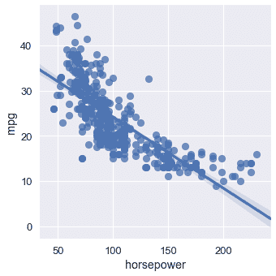
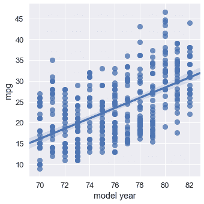
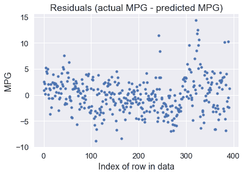
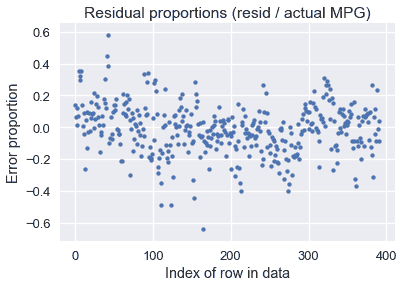
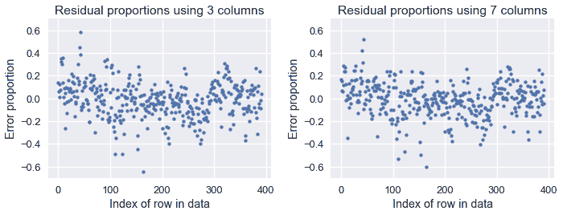

# 多元线性回归

> 原文：[https://www.bookbookmark.ds100.org/ch/13/linear_multiple.html](https://www.bookbookmark.ds100.org/ch/13/linear_multiple.html)

```
# HIDDEN
# Clear previously defined variables
%reset -f

# Set directory for data loading to work properly
import os
os.chdir(os.path.expanduser('~/notebooks/13'))

```

```
# HIDDEN
import warnings
# Ignore numpy dtype warnings. These warnings are caused by an interaction
# between numpy and Cython and can be safely ignored.
# Reference: https://stackoverflow.com/a/40846742
warnings.filterwarnings("ignore", message="numpy.dtype size changed")
warnings.filterwarnings("ignore", message="numpy.ufunc size changed")

import numpy as np
import matplotlib.pyplot as plt
import pandas as pd
import seaborn as sns
%matplotlib inline
import ipywidgets as widgets
from ipywidgets import interact, interactive, fixed, interact_manual
import nbinteract as nbi

sns.set()
sns.set_context('talk')
np.set_printoptions(threshold=20, precision=2, suppress=True)
pd.options.display.max_rows = 7
pd.options.display.max_columns = 8
pd.set_option('precision', 2)
# This option stops scientific notation for pandas
# pd.set_option('display.float_format', '{:.2f}'.format)

```

```
# HIDDEN
def df_interact(df, nrows=7, ncols=7):
    '''
    Outputs sliders that show rows and columns of df
    '''
    def peek(row=0, col=0):
        return df.iloc[row:row + nrows, col:col + ncols]
    if len(df.columns) <= ncols:
        interact(peek, row=(0, len(df) - nrows, nrows), col=fixed(0))
    else:
        interact(peek,
                 row=(0, len(df) - nrows, nrows),
                 col=(0, len(df.columns) - ncols))
    print('({} rows, {} columns) total'.format(df.shape[0], df.shape[1]))

```

```
# HIDDEN
from scipy.optimize import minimize as sci_min
def minimize(loss_fn, grad_loss_fn, X, y, progress=True):
    '''
    Uses scipy.minimize to minimize loss_fn using a form of gradient descent.
    '''
    theta = np.zeros(X.shape[1])
    iters = 0

    def objective(theta):
        return loss_fn(theta, X, y)
    def gradient(theta):
        return grad_loss_fn(theta, X, y)
    def print_theta(theta):
        nonlocal iters
        if progress and iters % progress == 0:
            print(f'theta: {theta} | loss: {loss_fn(theta, X, y):.2f}')
        iters += 1

    print_theta(theta)
    return sci_min(
        objective, theta, method='BFGS', jac=gradient, callback=print_theta,
        tol=1e-7
    ).x

```

与常量模型相比，我们的简单线性模型有一个关键优势：它在进行预测时使用数据。然而，由于简单的线性模型在我们的数据集中只使用一个变量，所以它仍然相当有限。许多数据集都有许多潜在的有用变量，多元线性回归可以利用这一点。例如，考虑以下有关车型及其每加仑里程（mpg）的数据集：

```
mpg = pd.read_csv('mpg.csv').dropna().reset_index(drop=True)
mpg

```

|  | MPG | 气缸 | 取代 | …… | 车型年份 | 起源 | 车名 |
| --- | --- | --- | --- | --- | --- | --- | --- |
| 零 | 18.0 条 | 8 个 | 三百零七 | …… | 70 个 | 1 个 | 雪佛兰 Chevelle Malibu |
| --- | --- | --- | --- | --- | --- | --- | --- |
| 1 个 | 15.0 条 | 8 | 三百五十 | ... | 70 | 1 | 别克云雀 320 |
| --- | --- | --- | --- | --- | --- | --- | --- |
| 二 | 18.0 | 8 | 三百一十八 | ... | 70 | 1 | 普利茅斯卫星 |
| --- | --- | --- | --- | --- | --- | --- | --- |
| ... | ... | ... | ... | ... | ... | ... | ... |
| --- | --- | --- | --- | --- | --- | --- | --- |
| 三百八十九 | 32.0 美元 | 四 | 一百三十五 | ... | 八十二 | 1 | 躲避暴行 |
| --- | --- | --- | --- | --- | --- | --- | --- |
| 三百九十 | 二十八 | 4 | 一百二十 | ... | 82 | 1 | 福特漫游者 |
| --- | --- | --- | --- | --- | --- | --- | --- |
| 391 个 | 三十一 | 4 | 一百一十九 | ... | 82 | 1 | 雪佛兰 S-10 |
| --- | --- | --- | --- | --- | --- | --- | --- |

392 行×9 列

汽车模型的多个属性似乎会影响其 MPG。例如，MPG 似乎随着马力的增加而降低：

```
# HIDDEN
sns.lmplot(x='horsepower', y='mpg', data=mpg);

```



然而，稍后发布的汽车通常比旧款汽车具有更好的 MPG：

```
sns.lmplot(x='model year', y='mpg', data=mpg);

```



如果我们能在预测 MPG 时同时考虑马力和车型年份，我们就有可能得到更精确的模型。事实上，最好的模型可能会考虑到数据集中的所有数值变量。我们可以扩展单变量线性回归，以允许基于任意数量的属性进行预测。

我们陈述了以下模型：

$$ f_\boldsymbol\theta (\textbf{x}) = \theta_0 + \theta_1 x_1 + \ldots + \theta_p x_p $$

其中，$\textbf x$现在表示包含单个汽车$p$属性的向量。上面的模型说，“取一辆车的多个属性，乘以一些权重，然后将它们相加，对 MPG 做出预测。”

例如，如果我们使用“马力”、“重量”和“车型年”列对数据集中的第一辆车进行预测，那么向量$\textbf x$

```
# HIDDEN
mpg.loc[0:0, ['horsepower', 'weight', 'model year']]

```

|  | 马力 | 重量 | model year |
| --- | --- | --- | --- |
| 0 | 一百三十 | 三千五百零四 | 70 |
| --- | --- | --- | --- |

在这里的例子中，为了清晰起见，我们保留了列名，但要记住，$\textbf x$只包含上表的数值：$\textbf x=[130.0，3504.0，70]$。

现在，我们将执行一个符号技巧，它将大大简化后面的公式。我们将在向量$\textbf x 中预先设置$1$的值，这样我们就可以为$\textbf x 获得以下向量：

```
# HIDDEN
mpg_mat = mpg.assign(bias=1)
mpg_mat.loc[0:0, ['bias', 'horsepower', 'weight', 'model year']]

```

|  | 偏倚 | horsepower | weight | model year |
| --- | --- | --- | --- | --- |
| 0 | 1 | 130.0 | 3504.0 | 70 |
| --- | --- | --- | --- | --- |

现在，观察我们模型的公式发生了什么：

$$ \begin{aligned} f_\boldsymbol\theta (\textbf{x}) &= \theta_0 + \theta_1 x_1 + \ldots + \theta_p x_p \\ &= \theta_0 (1) + \theta_1 x_1 + \ldots + \theta_p x_p \\ &= \theta_0 x_0 + \theta_1 x_1 + \ldots + \theta_p x_p \\ f_\boldsymbol\theta (\textbf{x}) &= \boldsymbol\theta \cdot \textbf{x} \end{aligned} $$

其中，$\boldSymbol\theta\cdot\textbf x$是$\boldSymbol\theta$和$\textbf x$的矢量点积。矢量和矩阵表示法被设计成简洁地写线性组合，因此非常适合我们的线性模型。但是，从现在开始你必须记住，$\BoldSymbol\Theta\CDOT\textBF x$是矢量点积。如果有疑问，可以将点积展开为简单的乘法和加法。

现在，我们将矩阵$\textbf x 定义为包含每个车型的矩阵，作为一行和第一列偏差。例如，下面是前五行$\textbf x$：

```
# HIDDEN
mpg_mat = mpg.assign(bias=1)
mpg_mat.loc[0:4, ['bias', 'horsepower', 'weight', 'model year']]

```

|  | bias | horsepower | weight | model year |
| --- | --- | --- | --- | --- |
| 0 | 1 | 130.0 | 3504.0 | 70 |
| --- | --- | --- | --- | --- |
| 1 | 1 | 一百六十五 | 三千六百九十三 | 70 |
| --- | --- | --- | --- | --- |
| 2 | 1 | 一百五十 | 三千四百三十六 | 70 |
| --- | --- | --- | --- | --- |
| 三 | 1 | 150.0 | 三千四百三十三 | 70 |
| --- | --- | --- | --- | --- |
| 四 | 1 | 一百四十 | 三千四百四十九 | 70 |
| --- | --- | --- | --- | --- |

同样，请记住，实际矩阵$\textbf x$只包含上表的数值。

注意，$\textbf x$由多个叠加在一起的$\textbf x$向量组成。为了保持符号清晰，我们定义了$\textbf x i$以引用索引为$i$的行向量，索引为$i$of$\textbf x$。我们定义$x_i，j$以引用索引为$j$的元素，索引为$i$的行的索引为$textbf x$。因此，$\textbf x u i$是一个$p$维向量，$x i，j$是一个标量。$\textbf x$是一个$n \乘以 p$矩阵，其中$n$是我们拥有的汽车示例数量，$p$是我们拥有的单个汽车的属性数量。

例如，从上表中，我们有$\textbf x u 4=[1，140，3449，70]$和$x 4，1=140$。当我们定义损失函数时，这个符号变得很重要，因为我们需要输入值的矩阵$\textbf x$，以及 MPG 的向量$\textbf y$。

## MSE 损耗及其梯度

均方误差损失函数采用一个权重为$\BoldSymbol\Theta$的向量、一个输入矩阵$\textbf x 和一个观察到的 mpgs 的向量$\textbf y：

$$ \begin{aligned} L(\boldsymbol\theta, \textbf{X}, \textbf{y}) &= \frac{1}{n} \sum_{i}(y_i - f_\boldsymbol\theta (\textbf{X}_i))^2\\ \end{aligned} $$

我们之前已经推导了 mse 损失相对于$\BoldSymbol\Theta$的梯度：

$$ \begin{aligned} \nabla_{\boldsymbol\theta} L(\boldsymbol\theta, \textbf{X}, \textbf{y}) &= -\frac{2}{n} \sum_{i}(y_i - f_\boldsymbol\theta (\textbf{X}_i))(\nabla_{\boldsymbol\theta} f_\boldsymbol\theta (\textbf{X}_i))\\ \end{aligned} $$

我们知道：

$$ \begin{aligned} f_\boldsymbol\theta (\textbf{x}) &= \boldsymbol\theta \cdot \textbf{x} \\ \end{aligned} $$

现在让我们计算$\nabla_ \boldsymbol\theta_f_boldsymbol\theta（\textbf_x）$。结果是非常简单的，因为$\boldsymbol\theta\cdot\textbf x；=\theta x _0+\ldots+\theta p x _p$和因此\frac \ \部分 \ \部分\theta（\boldsy \\theta\cdot\textbf x）=x 美元，$\frac \ \ \ \部分部分\ \\theta（（\boldsy 符号 theta\cdot\textbf x）=x_1$等在。

$$ \begin{aligned} \nabla_{\boldsymbol\theta} f_\boldsymbol\theta (\textbf{x}) &= \nabla_{\boldsymbol\theta} [ \boldsymbol\theta \cdot \textbf{x} ] \\ &= \begin{bmatrix} \frac{\partial}{\partial \theta_0} (\boldsymbol\theta \cdot \textbf{x}) \\ \frac{\partial}{\partial \theta_1} (\boldsymbol\theta \cdot \textbf{x}) \\ \vdots \\ \frac{\partial}{\partial \theta_p} (\boldsymbol\theta \cdot \textbf{x}) \\ \end{bmatrix} \\ &= \begin{bmatrix} x_0 \\ x_1 \\ \vdots \\ x_p \end{bmatrix} \\ \nabla_{\boldsymbol\theta} f_\boldsymbol\theta (\textbf{x}) &= \textbf{x} \end{aligned} $$

最后，我们将此结果插入到我们的梯度计算中：

$$ \begin{aligned} \nabla_{\boldsymbol\theta} L(\boldsymbol\theta, \textbf{X}, \textbf{y}) &= -\frac{2}{n} \sum_{i}(y_i - f_\boldsymbol\theta (\textbf{X}_i))(\nabla_{\boldsymbol\theta} f_\boldsymbol\theta (\textbf{X}_i))\\ &= -\frac{2}{n} \sum_{i}(y_i - \boldsymbol\theta \cdot \textbf{X}_i)(\textbf{X}_i)\\ \end{aligned} $$

请记住，既然$y_i-\boldsymbol\theta\cdot\textbf x u i$是一个标量，而$textbf x u i$是一个$p$维向量，那么梯度$nabla \boldsymbol\theta l（\boldsymbol\theta、\textbf x、\textbf y）是一个$p$维向量。

当我们计算单变量线性回归的梯度时，我们看到了相同类型的结果，发现它是二维的，因为$\BoldSymbol\Theta$是二维的。

## 用梯度下降法拟合模型

我们现在可以把损失及其导数代入梯度下降。和往常一样，我们将在 python 中定义模型、损失和渐变损失。

```
def linear_model(thetas, X):
    '''Returns predictions by a linear model on x_vals.'''
    return  \textbf{X} @ thetas

def mse_loss(thetas, X, y):
    return np.mean((y - linear_model(thetas, X)) ** 2)

def grad_mse_loss(thetas, X, y):
    n = len(X)
    return -2 / n * (X.T @ \textbf{y}  - X.T @  \textbf{X} @ thetas)

```

```
# HIDDEN
thetas = np.array([1, 1, 1, 1])
 \textbf{X} = np.array([[2, 1, 0, 1], [1, 2, 3, 4]])
y = np.array([3, 9])
assert np.allclose(linear_model(thetas, X), [4, 10])
assert np.allclose(mse_loss(thetas, X, y), 1.0)
assert np.allclose(grad_mse_loss(thetas, X, y), [ 3.,  3.,  3.,  5.])
assert np.allclose(grad_mse_loss(thetas,  \textbf{X} + 1, y), [ 25.,  25.,  25.,  35.])

```

现在，我们可以简单地将函数插入梯度下降最小化器：

```
# HIDDEN
 \textbf{X} = (mpg_mat
     .loc[:, ['bias', 'horsepower', 'weight', 'model year']]
     .as_matrix())
y = mpg_mat['mpg'].as_matrix()

```

```
%%time 

thetas = minimize(mse_loss, grad_mse_loss, X, y)
print(f'theta: {thetas} | loss: {mse_loss(thetas, X, y):.2f}')

```

```
theta: [ 0\.  0\.  0\.  0.] | cost: 610.47
theta: [ 0\.    0\.    0.01  0\.  ] | cost: 178.95
theta: [ 0.01 -0.11 -0\.    0.55] | cost: 15.78
theta: [ 0.01 -0.01 -0.01  0.58] | cost: 11.97
theta: [-4\.   -0.01 -0.01  0.63] | cost: 11.81
theta: [-13.72  -0\.    -0.01   0.75] | cost: 11.65
theta: [-13.72  -0\.    -0.01   0.75] | cost: 11.65
CPU times: user 8.81 ms, sys: 3.11 ms, total: 11.9 ms
Wall time: 9.22 ms

```

根据梯度下降，我们的线性模型是：

$Y=-13.72-0.01x_2+0.75x_3$

## 可视化我们的预测

我们的模型怎么样？我们可以看到损失大幅下降（从 610 下降到 11.6）。我们可以显示模型的预测值以及原始值：

```
# HIDDEN
reordered = ['predicted_mpg', 'mpg', 'horsepower', 'weight', 'model year']
with_predictions = (
    mpg
    .assign(predicted_mpg=linear_model(thetas, X))
    .loc[:, reordered]
)
with_predictions

```

|  | 预测值 | mpg | horsepower | weight | model year |
| --- | --- | --- | --- | --- | --- |
| 0 | 15.447125 | 18.0 | 130.0 | 3504.0 | 70 |
| --- | --- | --- | --- | --- | --- |
| 1 | 14.053509 年 | 15.0 | 165.0 | 3693.0 | 70 |
| --- | --- | --- | --- | --- | --- |
| 2 | 15.785576 个 | 18.0 | 150.0 | 3436.0 | 70 |
| --- | --- | --- | --- | --- | --- |
| ... | ... | ... | ... | ... | ... |
| --- | --- | --- | --- | --- | --- |
| 389 | 32.456900 | 32.0 | 八十四 | 二千二百九十五 | 82 |
| --- | --- | --- | --- | --- | --- |
| 390 | 30.354143 号 | 28.0 | 79.0 美元 | 二千六百二十五 | 82 |
| --- | --- | --- | --- | --- | --- |
| 391 | 29.726608 | 31.0 | 八十二 | 二千七百二十 | 82 |
| --- | --- | --- | --- | --- | --- |

392 行×5 列

由于我们从梯度下降中找到了$\BoldSymbol\Theta$数据，因此我们可以验证第一行数据的$\BoldSymbol\Theta\CDOT\textbf x u 0$与我们上面的预测相匹配：

```
print(f'Prediction for first row: '
      f'{thetas[0] + thetas[1] * 130 + thetas[2] * 3504 + thetas[3] * 70:.2f}')

```

```
Prediction for first row: 15.45

```

我们在下面包含了一个小部件来浏览预测和用于进行预测的数据：

```
# HIDDEN
df_interact(with_predictions)

```

<button class="js-nbinteract-widget">Loading widgets...</button>

```
(392 rows, 5 columns) total

```

我们还可以绘制预测的残差（实际值-预测值）：

```
resid = \textbf{y} - linear_model(thetas, X)
plt.scatter(np.arange(len(resid)), resid, s=15)
plt.title('Residuals (actual MPG - predicted MPG)')
plt.xlabel('Index of row in data')
plt.ylabel('MPG');

```



看起来我们的模型对许多车型做出了合理的预测，尽管有一些预测超过了每加仑 10 英里（有些车型低于每加仑 10 英里）。。也许我们对预测的 MPG 值和实际的 MPG 值之间的百分比误差更感兴趣：

```
resid_prop = resid / with_predictions['mpg']
plt.scatter(np.arange(len(resid_prop)), resid_prop, s=15)
plt.title('Residual proportions (resid / actual MPG)')
plt.xlabel('Index of row in data')
plt.ylabel('Error proportion');

```



看起来我们模型的预测值通常与实际 MPG 值相差 20%以内。

## 使用所有数据[¶](#Using-All-the-Data)

请注意，到目前为止，我们的示例中，$\textbf x$矩阵有四列：一列是所有列中的一列，马力、重量和车型年份。但是，模型允许我们处理任意数量的列：

$$ \begin{aligned} f_\boldsymbol\theta (\textbf{x}) &= \boldsymbol\theta \cdot \textbf{x} \end{aligned} $$

当我们在数据矩阵中包含更多的列时，我们扩展了$\BoldSymbol\Theta$以便它在$\textbf x$中为每一列都有一个参数。与其只选择三个数值列进行预测，为什么不全部使用这七个数值列呢？

```
# HIDDEN
cols = ['bias', 'cylinders', 'displacement', 'horsepower',
        'weight', 'acceleration', 'model year', 'origin']
 \textbf{X} = mpg_mat[cols].as_matrix()
mpg_mat[cols]

```

|  | bias | cylinders | displacement | ... | 加快 | model year | origin |
| --- | --- | --- | --- | --- | --- | --- | --- |
| 0 | 1 | 8 | 307.0 | ... | 十二 | 70 | 1 |
| --- | --- | --- | --- | --- | --- | --- | --- |
| 1 | 1 | 8 | 350.0 | ... | 十一点五 | 70 | 1 |
| --- | --- | --- | --- | --- | --- | --- | --- |
| 2 | 1 | 8 | 318.0 | ... | 11.0 条 | 70 | 1 |
| --- | --- | --- | --- | --- | --- | --- | --- |
| ... | ... | ... | ... | ... | ... | ... | ... |
| --- | --- | --- | --- | --- | --- | --- | --- |
| 389 | 1 | 4 | 135.0 | ... | 十一点六 | 82 | 1 |
| --- | --- | --- | --- | --- | --- | --- | --- |
| 390 | 1 | 4 | 120.0 | ... | 十八点六 | 82 | 1 |
| --- | --- | --- | --- | --- | --- | --- | --- |
| 391 | 1 | 4 | 119.0 | ... | 十九点四 | 82 | 1 |
| --- | --- | --- | --- | --- | --- | --- | --- |

392 行×8 列

```
%%time 

thetas_all = minimize(mse_loss, grad_mse_loss, X, y, progress=10)
print(f'theta: {thetas_all} | loss: {mse_loss(thetas_all, X, y):.2f}')

```

```
theta: [ 0\.  0\.  0\.  0\.  0\.  0\.  0\.  0.] | cost: 610.47
theta: [-0.5  -0.81  0.02 -0.04 -0.01 -0.07  0.59  1.3 ] | cost: 11.22
theta: [-17.23  -0.49   0.02  -0.02  -0.01   0.08   0.75   1.43] | cost: 10.85
theta: [-17.22  -0.49   0.02  -0.02  -0.01   0.08   0.75   1.43] | cost: 10.85
CPU times: user 10.9 ms, sys: 3.51 ms, total: 14.4 ms
Wall time: 11.7 ms

```

According to gradient descent, our linear model is:

$Y=-17.22-0.49x_1+0.02x_2-0.02x_3-0.01x_4+0.08X_5+0.75x_6+1.43x_7$

我们发现，当使用数据集的所有七个数值列时，我们的损失已经从数据集的三列 11.6 减少到了 10.85。我们在下面显示旧预测和新预测的比例误差图：

```
# HIDDEN
resid_prop_all = (y - linear_model(thetas_all, X)) / with_predictions['mpg']
plt.figure(figsize=(10, 4))
plt.subplot(121)
plt.scatter(np.arange(len(resid_prop)), resid_prop, s=15)
plt.title('Residual proportions using 3 columns')
plt.xlabel('Index of row in data')
plt.ylabel('Error proportion')
plt.ylim(-0.7, 0.7)

plt.subplot(122)
plt.scatter(np.arange(len(resid_prop_all)), resid_prop_all, s=15)
plt.title('Residual proportions using 7 columns')
plt.xlabel('Index of row in data')
plt.ylabel('Error proportion')
plt.ylim(-0.7, 0.7)

plt.tight_layout();

```



虽然差异很小，但与使用三列相比，使用七列时的错误要低一些。两种模型都比使用常量模型要好得多，如下图所示：

```
# HIDDEN
constant_resid_prop = (y - with_predictions['mpg'].mean()) / with_predictions['mpg']
plt.scatter(np.arange(len(constant_resid_prop)), constant_resid_prop, s=15)
plt.title('Residual proportions using constant model')
plt.xlabel('Index of row in data')
plt.ylabel('Error proportion')
plt.ylim(-1, 1);

```


使用一个恒定的模型会导致许多汽车 MPG 超过 75%的误差！

## 摘要[¶](#Summary)

我们引入了回归的线性模型。与常数模型不同，线性回归模型在进行预测时考虑了数据的特征，这使得当我们的数据变量之间存在相关性时，线性回归模型更加有用。

模型与数据的拟合过程现在应该非常熟悉了：

1.  选择一个模型。
2.  选择损失函数。
3.  使用梯度下降最小化损失函数。

知道我们通常可以在不更改其他组件的情况下调整其中一个组件是很有用的。在这一部分中，我们引入了线性模型，没有改变我们的损失函数或使用不同的最小化算法。虽然建模会变得复杂，但通常通过一次只关注一个组件，然后根据实际需要将不同的部分组合在一起，更容易学习。