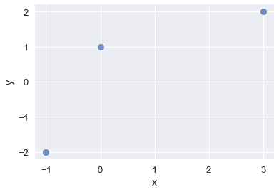
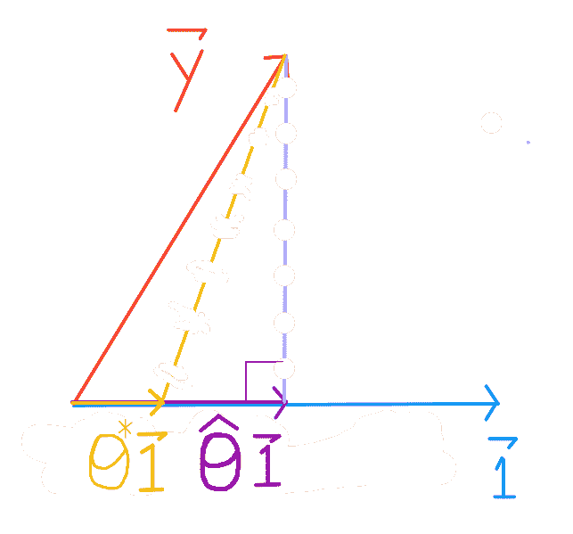
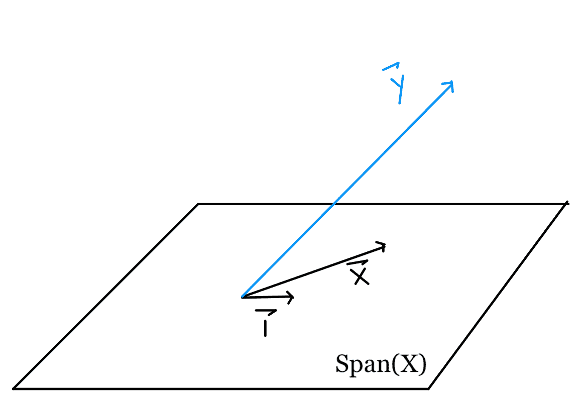
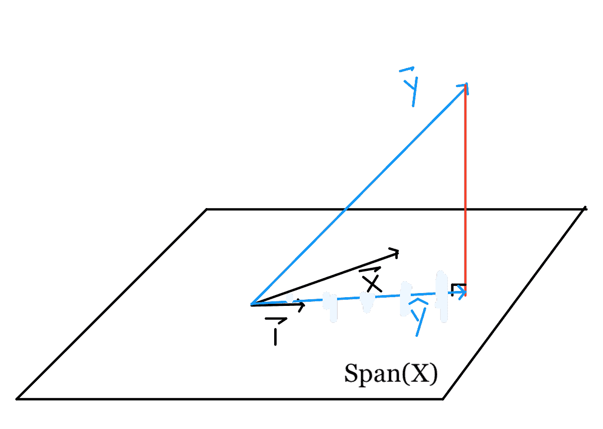
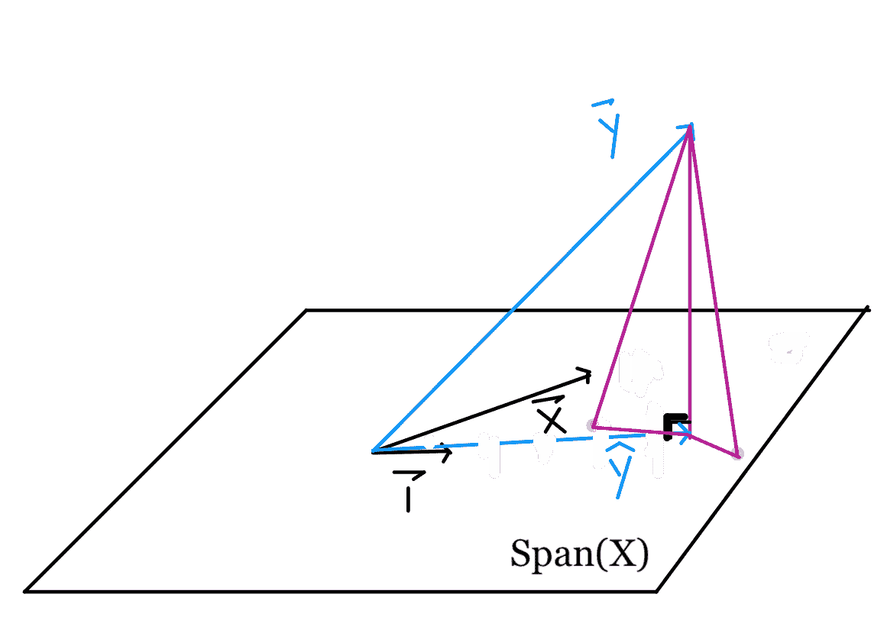
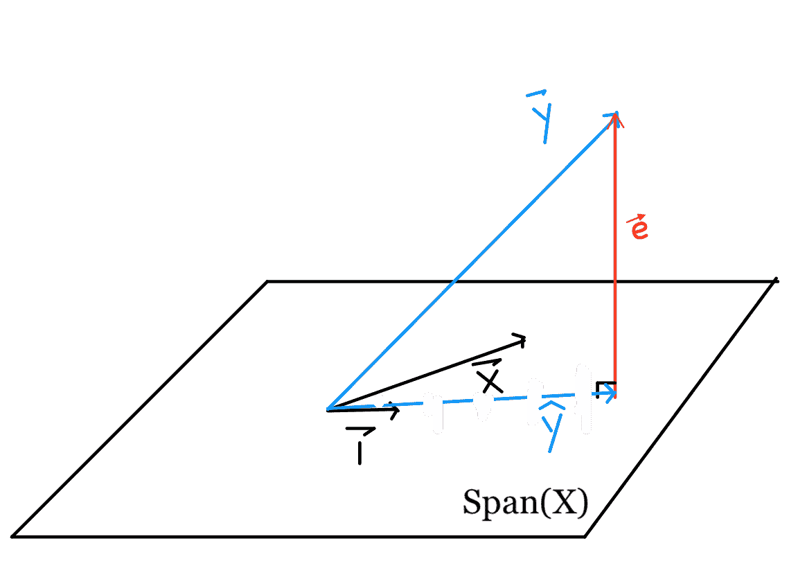
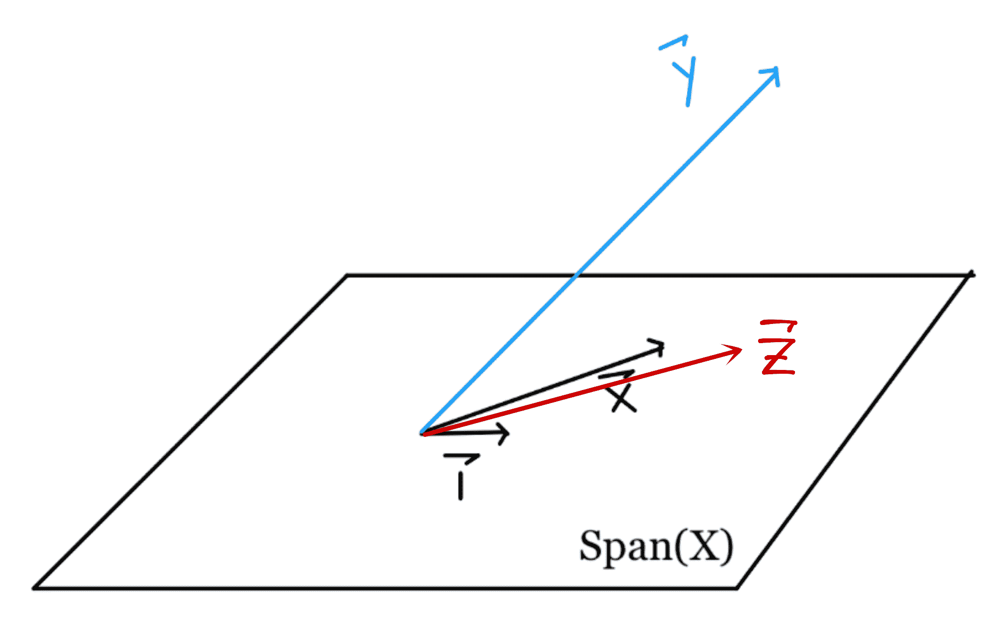

# 最小二乘-几何透视

> 原文：[https://www.textbook.ds100.org/ch/13/linear_projection.html](https://www.textbook.ds100.org/ch/13/linear_projection.html)

```
# HIDDEN
# Clear previously defined variables
%reset -f

# Set directory for data loading to work properly
import os
os.chdir(os.path.expanduser('~/notebooks/13'))

```

```
# HIDDEN
import warnings
# Ignore numpy dtype warnings. These warnings are caused by an interaction
# between numpy and Cython and can be safely ignored.
# Reference: https://stackoverflow.com/a/40846742
warnings.filterwarnings("ignore", message="numpy.dtype size changed")
warnings.filterwarnings("ignore", message="numpy.ufunc size changed")

import numpy as np
import matplotlib.pyplot as plt
import pandas as pd
import seaborn as sns
%matplotlib inline
import ipywidgets as widgets
from ipywidgets import interact, interactive, fixed, interact_manual
import nbinteract as nbi

sns.set()
sns.set_context('talk')
np.set_printoptions(threshold=20, precision=2, suppress=True)
pd.options.display.max_rows = 7
pd.options.display.max_columns = 8
pd.set_option('precision', 2)
# This option stops scientific notation for pandas
# pd.set_option('display.float_format', '{:.2f}'.format)

```

通过对线性模型的损失函数进行梯度下降优化，得到了线性模型的最优系数。我们还提到，最小二乘线性回归可以用解析法求解。虽然梯度下降是可行的，但这种几何视角将提供对线性回归的更深入的理解。

附录中包括矢量空间审查。我们假设熟悉向量算法、1 向量、向量集合的跨度和投影。

## 案例研究

我们的任务是为数据找到一个好的线性模型：

| X | 是 |
| --- | --- |
| 三 | 二 |
| 零 | 1 个 |
| - 1 | - 2 |

```
# HIDDEN
data = pd.DataFrame(
    [
        [3,2],
        [0,1],
        [-1,-2]
    ],
    columns=['x', 'y']
)

sns.regplot(x='x', y='y', data=data, ci=None, fit_reg=False);

```



假设最佳模型是误差最小的模型，最小二乘误差是可接受的度量。

### 最小二乘法：常数模型[¶](#Least-Squares:-Constant-Model)

就像我们对 Tips 数据集所做的那样，让我们从常量模型开始：这个模型只预测一个数字。

$$ \theta = C$$

因此，我们只处理$Y$值。

| y |
| --- |
| 2 |
| 1 |
| -2 |

我们的目标是找到导致平方损失最小的那一行的$\theta$

$$ L(\theta, \textbf{y}) = \sum_{i = 1}^{n}(y_i - \theta)^2\\ $$

回想一下，对于常量模型，MSE 的最小化$\theta$是$\bar \textbf y$，是$\textbf y 值的平均值。微积分推导可在“建模和估计”一章的“损失函数”一课中找到。关于线性代数推导，请参阅附录中的向量空间回顾。

注意我们的损失函数是平方和。向量的 _l2_-范数也是平方和，但具有平方根：

$$\Vert \textbf{v} \Vert = \sqrt{v_1^2 + v_2^2 + \dots + v_n^2}$$

如果我们让$y_i-\theta=v_i$：

$$ \begin{aligned} L(\theta, \textbf{y}) &= v_1^2 + v_2^2 + \dots + v_n^2 \\ &= \Vert \textbf{v} \Vert^2 \end{aligned} $$

这意味着我们的损失可以表示为一些向量的 _l2_-范数$\textbf v，$的平方。我们可以用[1，n]$将所有 i 的$v_i$表示为$y_i-\theta\quad\，这样用笛卡尔符号表示，

$$ \begin{aligned} \textbf{v} \quad &= \quad \begin{bmatrix} y_1 - \theta \\ y_2 - \theta \\ \vdots \\ y_n - \theta \end{bmatrix} \\ &= \quad \begin{bmatrix} y_1 \\ y_2 \\ \vdots \\ y_n \end{bmatrix} \quad - \quad \begin{bmatrix} \theta \\ \theta \\ \vdots \\ \theta \end{bmatrix} \\ &= \quad \begin{bmatrix} y_1 \\ y_2 \\ \vdots \\ y_n \end{bmatrix} \quad - \quad \theta \begin{bmatrix} 1 \\ 1 \\ \vdots \\ 1 \end{bmatrix} \end{aligned} $$

因此，我们的损失函数可以写为：

$$ \begin{aligned} L(\theta, \textbf{y}) \quad &= \quad \left \Vert \qquad \begin{bmatrix} y_1 \\ y_2 \\ \vdots \\ y_n \end{bmatrix} \quad - \quad \theta \begin{bmatrix} 1 \\ 1 \\ \vdots \\ 1 \end{bmatrix} \qquad \right \Vert ^2 \\ \quad &= \quad \left \Vert \qquad \textbf{y} \quad - \quad \hat{\textbf{y}} \qquad \right \Vert ^2 \\ \end{aligned} $$

表达式$\theta\begin bmatrix 1\\1\\vdots\\1\end bmatrix$是$\textbf 1 矢量列的标量倍数，是我们预测的结果，表示为$\hat \textbf y。

这就为我们提供了一个新的视角来理解最小化最小二乘误差意味着什么。

$\textbf y 和$\textbf 1 是固定的，但$\theta$可以具有任何值，因此$\hat \textbf y 可以是$\textbf 1 的任何标量倍数。我们希望找到$\theta$以便$\theta\textbf 1$尽可能接近$\textbf y$。我们使用$\hat \theta$来表示这个最适合的$\theta$。



将$\textbf y$投影到$\textbf 1$上，保证是最接近的矢量（参见附录中的“矢量空间回顾”）。

### 最小二乘法：简单线性模型

现在，让我们看看简单的线性回归模型。这与常数模型推导非常相似，但是要注意这些差异，并考虑如何推广到多重线性回归。

简单的线性模型是：

$$ \begin{aligned} f_\boldsymbol\theta (x_i) &= \theta_0 + \theta_1 x_i \\ \end{aligned} $$

我们的目标是找到导致最小平方误差行的$\BoldSymbol\Theta$：

$$ \begin{aligned} L(\boldsymbol\theta, \textbf{x}, \textbf{y}) &= \sum_{i = 1}^{n}(y_i - f_\boldsymbol\theta (x_i))^2\\ &= \sum_{i = 1}^{n}(y_i - \theta_0 - \theta_1 x_i)^2\\ &= \sum_{i = 1}^{n}(y_i - \begin{bmatrix} 1 & x_i \end{bmatrix} \begin{bmatrix} \theta_0 \\ \theta_1 \end{bmatrix} ) ^2 \end{aligned} $$

为了帮助我们将损失求和转换为矩阵形式，让我们用$n=3$展开损失。

$$ \begin{aligned} L(\boldsymbol{\theta}, \textbf{x}, \textbf{y}) &= (y_1 - \begin{bmatrix} 1 & x_1 \end{bmatrix} \begin{bmatrix} \theta_0 \\ \theta_1 \end{bmatrix})^2 \\ &+ (y_2 - \begin{bmatrix} 1 & x_2 \end{bmatrix} \begin{bmatrix} \theta_0 \\ \theta_1 \end{bmatrix})^2 \\ &+ (y_3 - \begin{bmatrix} 1 & x_3 \end{bmatrix} \begin{bmatrix} \theta_0 \\ \theta_1 \end{bmatrix})^2 \\ \end{aligned} $$

同样，我们的损失函数是平方和，向量的 _l2_-范数是平方和的平方根：

$$\Vert \textbf{v} \Vert = \sqrt{v_1^2 + v_2^2 + \dots + v_n^2}$$

如果我们让$y_i-\ begin bmatrix 1&x_u i \ end bmatrix \ begin bmatrix \ theta 0 \ theta end bmatrix=v i$：

$$ \begin{aligned} L(\boldsymbol{\theta}, \textbf{x}, \textbf{y}) &= v_1^2 + v_2^2 + \dots + v_n^2 \\ &= \Vert \textbf{v} \Vert^2 \end{aligned} $$

和以前一样，我们的损失可以表示为一些向量的 _l2_-范数$\textbf v$，平方。对于[1,3]中所有 i 的组件$v_i=y_i-\ begin bmatrix 1&x_i \ end bmatrix begin bmatrix \ theta \ theta end bmatrix quad \

$$ \begin{aligned} L(\boldsymbol{\theta}, \textbf{x}, \textbf{y}) &= \left \Vert \qquad \begin{bmatrix} y_1 \\ y_2 \\ y_3 \end{bmatrix} \quad - \quad \begin{bmatrix} 1 & x_1 \\ 1 & x_2 \\ 1 & x_3 \end{bmatrix} \begin{bmatrix} \theta_0 \\ \theta_1 \end{bmatrix} \qquad \right \Vert ^2 \\ &= \left \Vert \qquad \textbf{y} \quad - \quad \textbf{X} \begin{bmatrix} \theta_0 \\ \theta_1 \end{bmatrix} \qquad \right \Vert ^2 \\ &= \left \Vert \qquad \textbf{y} \quad - \quad f_\boldsymbol\theta(\textbf{x}) \qquad \right \Vert ^2 \\ &= \left \Vert \qquad \textbf{y} \quad - \quad \hat{\textbf{y}} \qquad \right \Vert ^2 \\ \end{aligned} $$

矩阵乘法$\ Begin BMatrix 1&x U 1 \ \\1&x U 2 \ \\1&x U 3 \ \端；BMatrix BMatrix \ Theta \ \ \\Theta U 1 \ \ \ \ \端；BMatrix；$是$\textbf x；$列的线性组合：每一个\\theta _i$只有一次乘一列的$\textbf x 123; x；$X；$的一列的-这汗 CTIVE 向我们展示了$F_u \boldSymbol\theta$是我们数据特征的线性组合。

$\textbf x 和$\textbf y 是固定的，但是$\theta 0$和$\theta 1$可以接受任何值，因此$\that \textbf y 可以接受$\textbf x 列的任意无限线性组合。为了获得最小的损失，我们要选择$\BoldSymbol\Theta$使$\Hat \textbf y 美元尽可能接近$\textbf y 美元，表示为$\Hat \BoldSymbol\Theta 美元。

## 几何直觉

现在，让我们发展一种直觉，来解释为什么$\hat \textbf y$仅限于$\textbf x 列的线性组合。虽然任意向量集的跨度包含无限多的线性组合，但无穷并不意味着任何线性组合都受到基向量的限制。

作为提醒，这里是我们的损失函数和散点图：

$$L(\boldsymbol{\theta}, \textbf{x}, \textbf{y}) \quad = \quad \left \Vert \quad \textbf{y} \quad - \quad \textbf{X} \boldsymbol\theta \quad \right \Vert ^2$$

```
# HIDDEN
sns.regplot(x='x', y='y', data=data, ci=None, fit_reg=False);

```


通过查看我们的散点图，我们发现没有一条线能够完美地匹配我们的点，因此我们无法实现 0 损失。因此，我们知道$\textbf y 不在由$\textbf x 和$\textbf 1 所跨越的平面内，下面用一个平行四边形表示。



因为我们的损失是基于距离的，所以我们可以看到，为了尽量减少$L（\boldsymbol\theta、\textbf x、\textbf y）=\left\vert\textbf-\textbf x \boldsymbol\theta\right\vert^2$，我们希望$\textbf x \boldsymbol\theta$接近$textbf y。

从数学上来说，我们正在寻找$\textbf y 到由$\textbf x 列所跨越的向量空间的投影，因为任何向量的投影都是$SPAN（\textbf x）$中最接近该向量的点。因此，选择$\BoldSymbol\Theta$使$\Hat \textbf y=\textbf x \BoldSymbol\Theta=$Proj$SPAN（\textbf x）$$\textbf y 是最佳解决方案。

要了解原因，请考虑向量空间上的其他点（紫色）。

根据毕达哥拉斯定理，平面上的任何其他点都离$\textbf y 远于$\hat \textbf y is。与$\hat \textbf y$对应的垂线长度表示最小平方误差。

## 线性代数

因为我们已经学习了很多线性代数概念，剩下的就是解出$\hat \boldSymbol\theta$得到我们想要的$\hat \textbf y$。

需要注意的几点：



*   $\hat \textbf y+\textbf e=\textbf y$
*   $\textbf e 与$\textbf x 和$\textbf 1 垂直$
*   $\hat \textbf y=\textbf x \hat \boldsymbol\theta$是最接近\textbf y$的向量空间，该向量空间由$\textbf x 和$\textbf 1 所跨越。$

因此，我们得出如下方程：

$$\textbf{X} \hat{\boldsymbol\theta} + \textbf{e} = \textbf{y}$$

左乘两边的$\textbf x ^t$：

$$\textbf{X}^T \textbf{X} \hat{\boldsymbol\theta} + \textbf{X}^T \textbf{e} = \textbf{X}^T \textbf{y}$$

因为$\textbf e$垂直于$\textbf x$，$\textbf x ^t\textbf e$的列向量。因此，我们得出了正态方程：

$$\textbf{X}^T \textbf{X} \hat{\boldsymbol\theta} = \textbf{X}^T \textbf{y}$$

从这里，我们可以很容易地解出$\Hat \BoldSymbol\Theta$乘以两边的$（\textbf x ^t\textbf x）^-1$：

$$\hat{\boldsymbol\theta} = (\textbf{X}^T \textbf{X})^{-1} \textbf{X}^T \textbf{y}$$

注：我们可以通过向量微积分的最小化得到同样的解，但是在最小二乘损失的情况下，向量微积分是不必要的。对于其他的损失函数，我们需要用向量演算得到解析解。

## 完成案例研究

让我们回到我们的案例研究，应用我们学到的知识，并解释为什么我们的解决方案是合理的。

$$ \textbf{y} = \begin{bmatrix} 2 \\ 1 \\ -2 \end{bmatrix} \qquad \textbf{X} = \begin{bmatrix} 1 & 3 \\ 1 & 0 \\ 1 & -1 \end{bmatrix} $$ $$ \begin{align} \hat{\boldsymbol\theta} &= \left( \begin{bmatrix} 1 & 1 & 1 \\ 3 & 0 & -1 \end{bmatrix} \begin{bmatrix} 1 & 3 \\ 1 & 0 \\ 1 & -1 \end{bmatrix} \right)^{-1} \begin{bmatrix} 1 & 1 & 1 \\ 3 & 0 & -1 \end{bmatrix} \begin{bmatrix} 2 \\ 1 \\ -2 \end{bmatrix} \\ &= \left( \begin{bmatrix} 3 & 2\\ 2 & 10 \end{bmatrix} \right)^{-1} \begin{bmatrix} 1 \\ 8 \end{bmatrix} \\ &= \frac{1}{30-4} \begin{bmatrix} 10 & -2\\ -2 & 3 \end{bmatrix} \begin{bmatrix} 1 \\ 8 \end{bmatrix} \\ &= \frac{1}{26} \begin{bmatrix} -6 \\ 22 \end{bmatrix}\\ &= \begin{bmatrix} - \frac{3}{13} \\ \frac{11}{13} \end{bmatrix} \end{align} $$

我们分析发现，最小二乘回归的最佳模型是$F_BoldSymbol \BoldSymbol\Theta（x_i）=-\frac 3 13+frac 11 13 x_i$。我们知道，我们对$\BoldSymbol\Theta$的选择是合理的，其数学性质是，将$\textbf y$投影到$\textbf x$列的跨度上，会生成矢量空间中最接近于$\textbf y 的点。在使用最小二乘损失的线性约束下，通过采用投影求解$\hat \boldsymbol\theta$可以确保我们获得最佳解。

## 当变量线性相关时[¶](#When-Variables-are-Linearly-Dependent)

对于每个附加变量，我们将向$\textbf x$添加一列。$\textbf x$列的跨度是列向量的线性组合，因此添加列仅在其与所有现有列线性无关时更改跨度。

当添加的列是线性相关的时，它可以表示为其他列的线性组合，因此不会向子空间引入新的任何向量。

回想一下，$\textbf x 的跨度很重要，因为它是我们要将$\textbf y 投影到的子空间。如果子空间不改变，投影就不会改变。

例如，当我们将$\textbf x 引入常量模型以得到简单的线性模型时，我们引入了一个自变量。$\textbf x=\ begin bmatrix 3\\0\-1 \ end bmatrix 不能表示为\ begin bmatrix 1\\1 \ end bmatrix 的标量。因此，我们从查找$\textbf y 的投影转移到一行：


要查找$\textbf y 到平面上的投影：


现在，让我们引入另一个变量，$\textbf z$，并显式地写出 bias 列：

| **Z** | **1** | **X** | **Y** |
| --- | --- | --- | --- |
| 四 | 1 | 3 | 2 |
| 1 | 1 | 0 | 1 |
| 0 | 1 | -1 | -2 |

请注意，$\textbf z=\textbf 1+\textbf x$。由于$\textbf z 是$\textbf 1 和$\textbf x 的线性组合，因此它位于原始的$span（\textbf x）中。从形式上讲，$\textbf z$与$\ \textbf 1$，$\textbf x$线性相关，并且不会更改$SPAN（\textbf x）$。因此，将$\textbf y$投影到由$\textbf 1$、$\textbf x$、和$\textbf z$所跨越的子空间上，与将$\textbf y$投影到由$\textbf 1 和$\textbf x 所跨越的子空间上相同。



我们也可以通过最小化损失函数来观察这一点：

$$ \begin{aligned} L(\boldsymbol\theta, \textbf{d}, \textbf{y}) &= \left \Vert \qquad \begin{bmatrix} y_1 \\ y_2 \\ y_3 \end{bmatrix} \quad - \quad \begin{bmatrix} 1 & x_1 & z_1 \\ 1 & x_2 & z_2\\ 1 & x_3 & z_3\end{bmatrix} \begin{bmatrix} \theta_0 \\ \theta_1 \\ \theta_2 \end{bmatrix} \qquad \right \Vert ^2 \end{aligned} $$

我们可能的解决方案如下表：$\Theta_0\textbf 1+\Theta_1\textbf x+Theta_2\textbf z$。

由于$\textbf z=\textbf 1+textbf x$，无论\theta 0$、$\theta 1$和\theta 2$如何，可能的值都可以重写为：

$$ \begin{aligned} \theta_0 \textbf{1} + \theta_1 \textbf{x} + \theta_2 (\textbf{1} + \textbf{x}) &= (\theta_0 + \theta_2) \textbf{1} + (\theta_1 + \theta_2) \textbf{x} \\ \end{aligned} $$

因此添加$\textbf z$根本不会改变问题。唯一的区别是，我们可以用多种方式表达这个投影。回想一下，我们发现$\textbf y 在由$\textbf 1 和$\textbf x 所横跨的平面上的投影为：

$$ \begin{bmatrix} \textbf{1} & \textbf{x} \end{bmatrix} \begin{bmatrix} - \frac{3}{13} \\ \frac{11}{13} \end{bmatrix} = - \frac{3}{13} \textbf{1} + \frac{11}{13} \textbf{x}$$

然而，随着$\textbf z 的引入，我们有更多的方法来表达这个相同的投影向量。

由于$\textbf 1=\textbf z-\textbf x，$\hat \textbf y$也可以表示为：

$$ - \frac{3}{13} (\textbf{z} - \textbf{x}) + \frac{11}{13} \textbf{x} = - \frac{3}{13} \textbf{z} + \frac{14}{13} \textbf{x} $$

由于$\textbf x=\textbf z+textbf 1，$\hat \textbf y$也可以表示为：

$$ - \frac{3}{13} \textbf{1} + \frac{11}{13} (\textbf{z} + \textbf{1}) = \frac{8}{13} \textbf{1} + \frac{11}{13} \textbf{z} $$

但这三个表达式都表示相同的投影。

总之，将线性相关列添加到$\textbf x$不会更改$SPAN（\textbf x）$，因此不会更改投影和最小二乘问题的解决方案。

## 两个学派

我们在这节课中把散点图包括了两次。第一条提醒我们，像以前一样，我们正在为数据寻找最合适的行。第二个结果显示，没有一条线可以适合所有的点。除了这两种情况外，我们还试图用散点图来破坏我们的矢量空间图。这是因为散点图符合最小二乘问题的行空间透视图：查看每个数据点，并尝试最小化预测与每个数据之间的距离。在本课中，我们研究了列空间透视图：每个特征都是一个向量，构建了一个可能的解空间（投影）。

这两种观点都是有效的，并且有助于理解，我们希望你看到最小二乘问题的两面都很有趣！