# 线性回归案例研究

> 原文：[https://www.bookbookmark.ds100.org/ch/13/linear_case_study.html](https://www.bookbookmark.ds100.org/ch/13/linear_case_study.html)

```
# HIDDEN
# Clear previously defined variables
%reset -f

# Set directory for data loading to work properly
import os
os.chdir(os.path.expanduser('~/notebooks/13'))

```

```
# HIDDEN
import warnings
# Ignore numpy dtype warnings. These warnings are caused by an interaction
# between numpy and Cython and can be safely ignored.
# Reference: https://stackoverflow.com/a/40846742
warnings.filterwarnings("ignore", message="numpy.dtype size changed")
warnings.filterwarnings("ignore", message="numpy.ufunc size changed")

import numpy as np
import matplotlib.pyplot as plt
import pandas as pd
import seaborn as sns
%matplotlib inline
import ipywidgets as widgets
from ipywidgets import interact, interactive, fixed, interact_manual
import nbinteract as nbi

sns.set()
sns.set_context('talk')
np.set_printoptions(threshold=20, precision=2, suppress=True)
pd.options.display.max_rows = 7
pd.options.display.max_columns = 8
pd.set_option('precision', 2)
# This option stops scientific notation for pandas
# pd.set_option('display.float_format', '{:.2f}'.format)

```

```
# HIDDEN
from scipy.optimize import minimize as sci_min

def minimize(cost_fn, grad_cost_fn, X, y, progress=True):
    '''
    Uses scipy.minimize to minimize cost_fn using a form of gradient descent.
    '''
    theta = np.zeros(X.shape[1])
    iters = 0

    def objective(theta):
        return cost_fn(theta, X, y)
    def gradient(theta):
        return grad_cost_fn(theta, X, y)
    def print_theta(theta):
        nonlocal iters
        if progress and iters % progress == 0:
            print(f'theta: {theta} | cost: {cost_fn(theta, X, y):.2f}')
        iters += 1

    print_theta(theta)
    return sci_min(
        objective, theta, method='BFGS', jac=gradient, callback=print_theta,
        tol=1e-7
    ).x

```

在本节中，我们将执行一个将线性回归模型应用到数据集的端到端案例研究。我们将使用的数据集具有各种属性，例如驴的长度和周长。

我们的任务是用线性回归预测一头驴的体重。

## 初步数据概述

我们将从读取数据集开始，并快速查看其内容。

```
donkeys = pd.read_csv("donkeys.csv")
donkeys.head()

```

|  | 基站控制系统 | 年龄 | 性 | …… | 高度 | 重量 | 权重 alt |
| --- | --- | --- | --- | --- | --- | --- | --- |
| 零 | 三 | lt；2 | 种马 | …… | 九十 | 七十七 | 南 |
| --- | --- | --- | --- | --- | --- | --- | --- |
| 1 个 | 2.5 条 | &lt;2 | stallion | ... | 94 岁 | 100 个 | NaN |
| --- | --- | --- | --- | --- | --- | --- | --- |
| 二 | 1.5 条 | &lt;2 | stallion | ... | 九十五 | 七十四 | NaN |
| --- | --- | --- | --- | --- | --- | --- | --- |
| 三 | 3.0 | &lt;2 | 女性的 | ... | 九十六 | 一百一十六 | NaN |
| --- | --- | --- | --- | --- | --- | --- | --- |
| 四 | 2.5 | &lt;2 | female | ... | 91 岁 | 91 | NaN |
| --- | --- | --- | --- | --- | --- | --- | --- |

5 行×8 列

通过查看数据集的维度，查看 _ 我们有多少 _ 数据总是一个好主意。如果我们有大量的观察结果，打印出整个数据帧可能会使我们的笔记本崩溃。

```
donkeys.shape

```

```
(544, 8)
```

数据集相对较小，只有 544 行观察值和 8 列。让我们看看哪些列对我们可用。

```
donkeys.columns.values

```

```
array(['BCS', 'Age', 'Sex', 'Length', 'Girth', 'Height', 'Weight',
       'WeightAlt'], dtype=object)
```

对数据的良好理解可以指导我们的分析，因此我们应该理解这些列中的每一列代表什么。其中一些列是不言自明的，但其他的则需要更多的解释：

*   【HTG0】：身体状况评分（身体健康等级）
*   【HTG0】：驴中间的测量
*   【HTG0】：第二次称重（我们数据中 31 头驴称重两次，以检查天平的精度）

确定哪些变量是定量的，哪些是分类的也是一个好主意。

定量：【HTG0】、【HTG1】、【HTG2】、【HTG3】、【HTG4】

分类：【HTG0】、【HTG1】、【HTG2】

## 数据清理

在本节中，我们将检查数据中是否存在需要处理的异常情况。

通过更仔细地检查`WeightAlt`，我们可以通过测量两种不同称重之间的差异并绘制它们来确保磅秤的准确度。

```
difference = donkeys['WeightAlt'] - donkeys['Weight']
sns.distplot(difference.dropna());

```

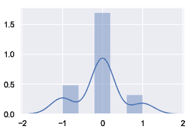

测量值都在 1 公斤以内，这似乎是合理的。

接下来，我们可以查找可能指示错误或其他问题的异常值。我们可以使用分位数函数来检测异常值。

```
donkeys.quantile([0.005, 0.995])

```

|  | BCS | 长度 | 周长 | Height | Weight | WeightAlt |
| --- | --- | --- | --- | --- | --- | --- |
| 零点零零五 | 1.5 | 七十一点一四五 | 九十 | 八十九 | 七十一点七一五 | 九十八点七五 |
| --- | --- | --- | --- | --- | --- | --- |
| 零点九九五 | 四 | 111.000 个 | 131.285 美元 | 一百一十二 | 214.000 美元 | 一百九十二点八零 |
| --- | --- | --- | --- | --- | --- | --- |

对于这些数值列中的每一列，我们可以查看哪些行位于这些分位数之外，以及它们所具有的值。考虑到我们希望我们的模型只适用于健康和成熟的驴。

首先，让我们看看`BCS`列。

```
donkeys[(donkeys['BCS'] < 1.5) | (donkeys['BCS'] > 4)]['BCS']

```

```
291    4.5
445    1.0
Name: BCS, dtype: float64
```

还可以查看`BCS`的条形图：

```
plt.hist(donkeys['BCS'], density=True)
plt.xlabel('BCS');

```

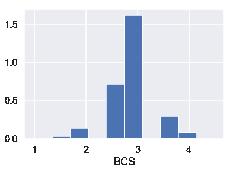

考虑到`BCS`是一头驴健康的标志，1 的`BCS`代表一头极度消瘦的驴，4.5 的`BCS`代表一头超重的驴。同样看一下条形码，似乎只有两头驴有这样的边远值（htg3）。这样，我们就把这两只驴移走了。

* * *

现在，让我们来看一下`Length`、`Girth`和`Height`。

```
donkeys[(donkeys['Length'] < 71.145) | (donkeys['Length'] > 111)]['Length']

```

```
8       46
22      68
26      69
216    112
Name: Length, dtype: int64
```

```
donkeys[(donkeys['Girth'] < 90) | (donkeys['Girth'] > 131.285)]['Girth']

```

```
8       66
239    132
283    134
523    134
Name: Girth, dtype: int64
```

```
donkeys[(donkeys['Height'] < 89) | (donkeys['Height'] > 112)]['Height']

```

```
8       71
22      86
244    113
523    116
Name: Height, dtype: int64
```

对于这三列，第 8 行中的驴的值似乎比截止值小得多，而其他异常驴则接近截止值，可能不需要移除。

* * *

最后，让我们来看一下`Weight`。

```
donkeys[(donkeys['Weight'] < 71.715) | (donkeys['Weight'] > 214)]['Weight']

```

```
8       27
26      65
50      71
291    227
523    230
Name: Weight, dtype: int64
```

列表中的前 2 头和最后 2 头驴与截止日期相差甚远，最有可能被移除。中间的驴可以包括在内。

* * *

由于`WeightAlt`与`Weight`密切对应，因此我们跳过检查此列是否有异常。总结我们所学到的，下面是我们如何过滤我们的驴：

*   保持驴子和`BCS`在 1.5 和 4 范围内
*   把驴子和`Weight`放在 71 到 214 之间

```
donkeys_c = donkeys[(donkeys['BCS'] >= 1.5) & (donkeys['BCS'] <= 4) &
                         (donkeys['Weight'] >= 71) & (donkeys['Weight'] <= 214)]

```

## 列车试验段

在进行数据分析之前，我们将数据分成 80/20 个部分，使用 80%的数据来培训模型，并留出 20%用于评估模型。

```
X_train, X_test, y_train, y_test = train_test_split(donkeys_c.drop(['Weight'], axis=1),
                                                    donkeys_c['Weight'],
                                                    test_size=0.2,
                                                   random_state=42)
X_train.shape, X_test.shape

```

```
((431, 7), (108, 7))
```

让我们还创建一个函数来评估对测试集的预测。我们用均方误差。

```
def mse_test_set(predictions):
    return float(np.sum((predictions - y_test) ** 2))

```

## 探索性数据分析与可视化

像往常一样，我们将在尝试将模型与之匹配之前探索我们的数据。

首先，我们将用箱线图检查分类变量。

```
# HIDDEN
sns.boxplot(x=X_train['BCS'], y=y_train);

```

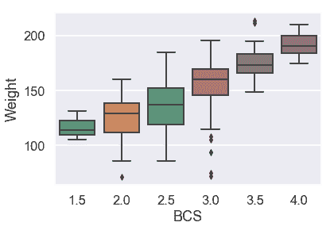

似乎体重中位数随 BCS 增加而增加，但不是线性增加。

```
# HIDDEN
sns.boxplot(x=X_train['Sex'], y=y_train,
            order = ['female', 'stallion', 'gelding']);

```

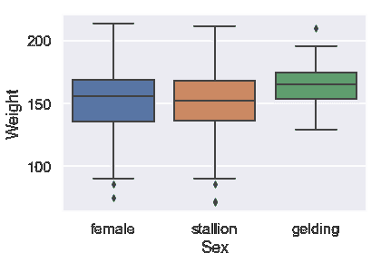

看来驴的性别似乎并没有引起体重的很大差异。

```
# HIDDEN
sns.boxplot(x=X_train['Age'], y=y_train, 
            order = ['<2', '2-5', '5-10', '10-15', '15-20', '>20']);

```

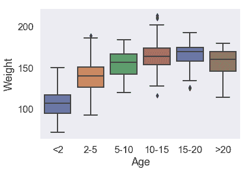

对于 5 岁以上的驴，体重分布没有太大差异。

现在，让我们来看看定量变量。我们可以根据目标变量绘制它们中的每一个。

```
# HIDDEN
X_train['Weight'] = y_train
sns.regplot('Length', 'Weight', X_train, fit_reg=False);

```

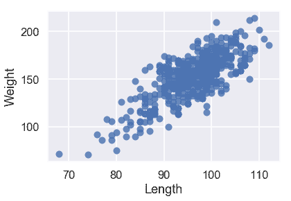

```
# HIDDEN
sns.regplot('Girth', 'Weight', X_train, fit_reg=False);

```

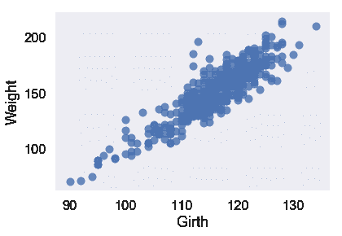

```
# HIDDEN
sns.regplot('Height', 'Weight', X_train, fit_reg=False);

```

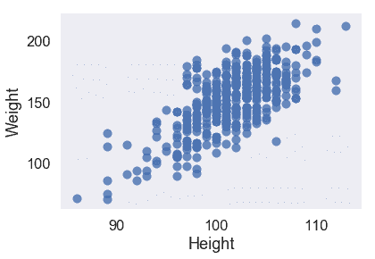

我们的三个定量特征都与目标变量`Weight`呈线性关系，因此我们不必对输入数据执行任何转换。

看看我们的特性是否是线性的也是一个好主意。我们在下面绘制两个图：

```
# HIDDEN
sns.regplot('Height', 'Length', X_train, fit_reg=False);

```

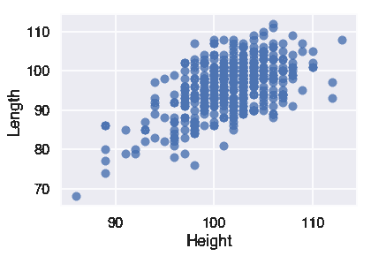

```
# HIDDEN
sns.regplot('Height', 'Girth', X_train, fit_reg=False);

```

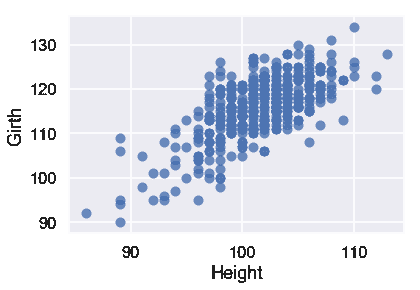

从这些图中，我们可以看到预测变量之间也有很强的线性关系。这使得我们的模型更难解释，所以我们应该在创建模型之后记住这一点。

## 简单线性模型

我们不要一次使用所有数据，而是先尝试将线性模型拟合到一个或两个变量。

下面是仅使用一个定量变量的三个简单线性回归模型。哪一款似乎是最好的？

```
# HIDDEN
sns.regplot('Length', 'Weight', X_train, fit_reg=True);

```

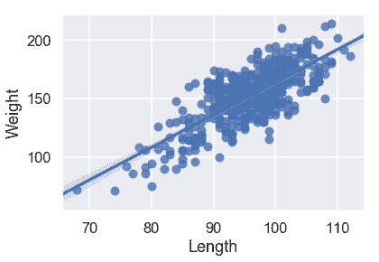

```
# HIDDEN
model = LinearRegression()
model.fit(X_train[['Length']], X_train['Weight'])
predictions = model.predict(X_test[['Length']])
print("MSE:", mse_test_set(predictions))

```

```
MSE: 26052.58007702549

```

```
sns.regplot('Girth', 'Weight', X_train, fit_reg=True);

```

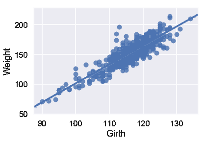

```
# HIDDEN
model = LinearRegression()
model.fit(X_train[['Girth']], X_train['Weight'])
predictions = model.predict(X_test[['Girth']])
print("MSE:", mse_test_set(predictions))

```

```
MSE: 13248.814105932383

```

```
sns.regplot('Height', 'Weight', X_train, fit_reg=True);

```

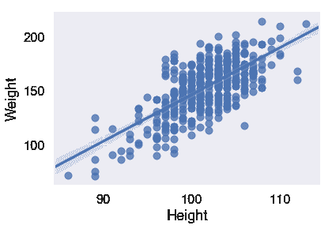

```
# HIDDEN
model = LinearRegression()
model.fit(X_train[['Height']], X_train['Weight'])
predictions = model.predict(X_test[['Height']])
print("MSE:", mse_test_set(predictions))

```

```
MSE: 36343.308584306134

```

从散点图和均方误差来看，似乎`Girth`是`Weight`的最佳唯一预测因子，因为它与`Weight`具有最强的线性关系，最小的均方误差。

我们能用两个变量做得更好吗？让我们尝试使用`Girth`和`Length`来拟合线性模型。虽然这个模型不容易可视化，但是我们仍然可以看到这个模型的 MSE。

```
# HIDDEN
model = LinearRegression()
model.fit(X_train[['Girth', 'Length']], X_train['Weight'])
predictions = model.predict(X_test[['Girth', 'Length']])
print("MSE:", mse_test_set(predictions))

```

```
MSE: 9680.902423377258

```

真的！看来我们的 MSE 从 13000 年左右的单用`Girth`下降到 10000 年的单用`Girth`和`Length`。使用包含第二个变量改进了我们的模型。

我们也可以在模型中使用分类变量。现在我们来看一个使用分类变量`Age`的线性模型。这是`Age`与`Weight`的关系图：

```
# HIDDEN
sns.stripplot(x='Age', y='Weight', data=X_train, order=['<2', '2-5', '5-10', '10-15', '15-20', '>20']);

```

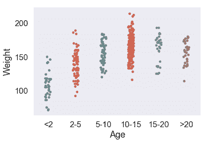

考虑到`Age`是一个分类变量，我们需要引入虚拟变量以生成线性回归模型。

```
# HIDDEN
just_age_and_weight = X_train[['Age', 'Weight']]
with_age_dummies = pd.get_dummies(just_age_and_weight, columns=['Age'])
model = LinearRegression()
model.fit(with_age_dummies.drop('Weight', axis=1), with_age_dummies['Weight'])

just_age_and_weight_test = X_test[['Age']]
with_age_dummies_test = pd.get_dummies(just_age_and_weight_test, columns=['Age'])
predictions = model.predict(with_age_dummies_test)
print("MSE:", mse_test_set(predictions))

```

```
MSE: 41398.515625

```

大约 40000 毫秒比我们使用任何一个定量变量都要差，但是这个变量在我们的线性模型中仍然有用。

让我们来解释这个线性模型。请注意，每个属于年龄类别的驴，例如 2-5 岁，将收到相同的预测，因为它们共享输入值：1 在列中对应 2-5 岁，0 在所有其他列中。因此，我们可以将分类变量解释为简单地改变模型中的常数，因为分类变量将驴分为组，并对该组中的所有驴进行一次预测。

下一步是使用分类变量和多个定量变量创建最终模型。

## 转换变量[¶](#Transforming-Variables)

回想一下我们的箱线图`Sex`不是一个有用的变量，所以我们将删除它。我们还将删除`WeightAlt`列，因为我们只有 31 头驴的值。最后，我们使用`get_dummies`将分类变量`BCS`和`Age`转换为虚拟变量，以便将它们包含在模型中。

```
# HIDDEN
X_train.drop('Weight', axis=1, inplace=True)

```

```
# HIDDEN
pd.set_option('max_columns', 15)

```

```
X_train.drop(['Sex', 'WeightAlt'], axis=1, inplace=True)
X_train = pd.get_dummies(X_train, columns=['BCS', 'Age'])
X_train.head()

```

|  | Length | Girth | Height | 密件抄送 1.5 | BCS_2.0 | 密件抄送 2.5 | 密件抄送 3.0 | 密件抄送 3.5 | BCS_4.0 | 年龄\10-15 | 年龄 15-20 | 年龄\2-5 | 年龄\5-10 | 年龄 2 | 年龄 20 岁 |
| --- | --- | --- | --- | --- | --- | --- | --- | --- | --- | --- | --- | --- | --- | --- | --- |
| 四百六十五 | 98 岁 | 一百一十三 | 九十九 | 零 | 0 | 0 | 1 个 | 0 | 0 | 0 | 0 | 1 | 0 | 0 | 0 |
| --- | --- | --- | --- | --- | --- | --- | --- | --- | --- | --- | --- | --- | --- | --- | --- |
| 233 个 | 101 个 | 一百一十九 | 101 | 0 | 0 | 0 | 1 | 0 | 0 | 1 | 0 | 0 | 0 | 0 | 0 |
| --- | --- | --- | --- | --- | --- | --- | --- | --- | --- | --- | --- | --- | --- | --- | --- |
| 450 个 | 106 个 | 一百二十五 | 103 个 | 0 | 0 | 1 | 0 | 0 | 0 | 1 | 0 | 0 | 0 | 0 | 0 |
| --- | --- | --- | --- | --- | --- | --- | --- | --- | --- | --- | --- | --- | --- | --- | --- |
| 四百五十三 | 九十三 | 一百二十 | 100 | 0 | 0 | 1 | 0 | 0 | 0 | 0 | 0 | 1 | 0 | 0 | 0 |
| --- | --- | --- | --- | --- | --- | --- | --- | --- | --- | --- | --- | --- | --- | --- | --- |
| 452 个 | 98 | 120 | 108 个 | 0 | 0 | 1 | 0 | 0 | 0 | 0 | 0 | 0 | 1 | 0 | 0 |
| --- | --- | --- | --- | --- | --- | --- | --- | --- | --- | --- | --- | --- | --- | --- | --- |

回想一下，我们注意到 5 岁以上的驴的体重分布并没有太大的不同。因此，让我们将列`Age_10-15`、`Age_15-20`和`Age_&gt;20`组合为一列。

```
age_over_10 = X_train['Age_10-15'] | X_train['Age_15-20'] | X_train['Age_>20']
X_train['Age_>10'] = age_over_10
X_train.drop(['Age_10-15', 'Age_15-20', 'Age_>20'], axis=1, inplace=True)

```

因为我们不希望矩阵过度参数化，我们应该从`BCS`和`Age`假人中删除一个类别。

```
X_train.drop(['BCS_3.0', 'Age_5-10'], axis=1, inplace=True)
X_train.head()

```

|  | Length | Girth | Height | BCS_1.5 | BCS_2.0 | BCS_2.5 | BCS_3.5 | BCS_4.0 | Age_2-5 | Age_&lt;2 | 年龄 10 岁 |
| --- | --- | --- | --- | --- | --- | --- | --- | --- | --- | --- | --- |
| 465 | 98 | 113 | 99 | 0 | 0 | 0 | 0 | 0 | 1 | 0 | 0 |
| --- | --- | --- | --- | --- | --- | --- | --- | --- | --- | --- | --- |
| 233 | 101 | 119 | 101 | 0 | 0 | 0 | 0 | 0 | 0 | 0 | 1 |
| --- | --- | --- | --- | --- | --- | --- | --- | --- | --- | --- | --- |
| 450 | 106 | 125 | 103 | 0 | 0 | 1 | 0 | 0 | 0 | 0 | 1 |
| --- | --- | --- | --- | --- | --- | --- | --- | --- | --- | --- | --- |
| 453 | 93 | 120 | 100 | 0 | 0 | 1 | 0 | 0 | 1 | 0 | 0 |
| --- | --- | --- | --- | --- | --- | --- | --- | --- | --- | --- | --- |
| 452 | 98 | 120 | 108 | 0 | 0 | 1 | 0 | 0 | 0 | 0 | 0 |
| --- | --- | --- | --- | --- | --- | --- | --- | --- | --- | --- | --- |

为了在我们的模型中有一个常数项，我们还应该添加一列偏差。

```
X_train = X_train.assign(bias=1)

```

```
# HIDDEN
X_train = X_train.reindex(columns=['bias'] + list(X_train.columns[:-1]))

```

```
X_train.head()

```

|  | 偏倚 | Length | Girth | Height | BCS_1.5 | BCS_2.0 | BCS_2.5 | BCS_3.5 | BCS_4.0 | Age_2-5 | Age_&lt;2 | Age_&gt;10 |
| --- | --- | --- | --- | --- | --- | --- | --- | --- | --- | --- | --- | --- |
| 465 | 1 | 98 | 113 | 99 | 0 | 0 | 0 | 0 | 0 | 1 | 0 | 0 |
| --- | --- | --- | --- | --- | --- | --- | --- | --- | --- | --- | --- | --- |
| 233 | 1 | 101 | 119 | 101 | 0 | 0 | 0 | 0 | 0 | 0 | 0 | 1 |
| --- | --- | --- | --- | --- | --- | --- | --- | --- | --- | --- | --- | --- |
| 450 | 1 | 106 | 125 | 103 | 0 | 0 | 1 | 0 | 0 | 0 | 0 | 1 |
| --- | --- | --- | --- | --- | --- | --- | --- | --- | --- | --- | --- | --- |
| 453 | 1 | 93 | 120 | 100 | 0 | 0 | 1 | 0 | 0 | 1 | 0 | 0 |
| --- | --- | --- | --- | --- | --- | --- | --- | --- | --- | --- | --- | --- |
| 452 | 1 | 98 | 120 | 108 | 0 | 0 | 1 | 0 | 0 | 0 | 0 | 0 |
| --- | --- | --- | --- | --- | --- | --- | --- | --- | --- | --- | --- | --- |

## 多元线性回归模型

我们终于准备好将我们的模型与我们认为重要的所有变量相匹配，并转换成适当的形式。

我们的模型如下：

$$ f_\theta (\textbf{x}) = \theta_0 + \theta_1 (Length) + \theta_2 (Girth) + \theta_3 (Height) + ... + \theta_{11} (Age_>10) $$

下面是我们在多元线性回归课程中定义的函数，我们将再次使用这些函数：

```
def linear_model(thetas, X):
    '''Returns predictions by a linear model on x_vals.'''
    return X @ thetas

def mse_cost(thetas, X, y):
    return np.mean((y - linear_model(thetas, X)) ** 2)

def grad_mse_cost(thetas, X, y):
    n = len(X)
    return -2 / n * (X.T @ y  - X.T @ X @ thetas)

```

为了使用上述函数，我们需要`X`和`y`。这些都可以从我们的数据帧中获得。记住`X`和`y`必须是 numpy 矩阵，才能用`@`符号将它们相乘。

```
X_train = X_train.values

```

```
y_train = y_train.values

```

现在我们只需要调用在前一节中定义的`minimize`函数。

```
thetas = minimize(mse_cost, grad_mse_cost, X_train, y_train)

```

```
theta: [0\. 0\. 0\. 0\. 0\. 0\. 0\. 0\. 0\. 0\. 0\. 0.] | cost: 23979.72
theta: [0.01 0.53 0.65 0.56 0\.   0\.   0\.   0\.   0\.   0\.   0\.   0\.  ] | cost: 1214.03
theta: [-0.07  1.84  2.55 -2.87 -0.02 -0.13 -0.34  0.19  0.07 -0.22 -0.3   0.43] | cost: 1002.46
theta: [-0.25 -0.76  4.81 -3.06 -0.08 -0.38 -1.11  0.61  0.24 -0.66 -0.93  1.27] | cost: 815.50
theta: [-0.44 -0.33  4.08 -2.7  -0.14 -0.61 -1.89  1.02  0.4  -1.06 -1.57  2.09] | cost: 491.91
theta: [-1.52  0.85  2\.   -1.58 -0.52 -2.22 -5.63  3.29  1.42 -2.59 -5.14  5.54] | cost: 140.86
theta: [-2.25  0.9   1.72 -1.3  -0.82 -3.52 -7.25  4.64  2.16 -2.95 -7.32  6.61] | cost: 130.33
theta: [ -4.16   0.84   1.32  -0.78  -1.65  -7.09 -10.4    7.82   4.18  -3.44
 -12.61   8.24] | cost: 116.92
theta: [ -5.89   0.75   1.17  -0.5   -2.45 -10.36 -11.81  10.04   6.08  -3.6
 -16.65   8.45] | cost: 110.37
theta: [ -7.75   0.67   1.13  -0.35  -3.38 -13.76 -11.84  11.55   8.2   -3.8
 -20\.     7.55] | cost: 105.74
theta: [ -9.41   0.64   1.15  -0.31  -4.26 -16.36 -10.81  11.97  10.12  -4.33
 -21.88   6.15] | cost: 102.82
theta: [-11.08   0.66   1.17  -0.32  -5.18 -18.28  -9.43  11.61  11.99  -5.37
 -22.77   4.69] | cost: 100.70
theta: [-12.59   0.69   1.16  -0.32  -6.02 -19.17  -8.53  10.86  13.54  -6.65
 -22.89   3.73] | cost: 99.34
theta: [-14.2    0.72   1.14  -0.3   -6.89 -19.35  -8.29  10.03  14.98  -7.99
 -22.74   3.14] | cost: 98.30
theta: [-16.14   0.73   1.11  -0.26  -7.94 -19.03  -8.65   9.3   16.47  -9.18
 -22.59   2.76] | cost: 97.35
theta: [-18.68   0.73   1.1   -0.21  -9.27 -18.29  -9.42   8.76  18.14 -10.04
 -22.55   2.39] | cost: 96.38
theta: [-21.93   0.72   1.1   -0.17 -10.94 -17.19 -10.25   8.5   19.92 -10.36
 -22.66   1.99] | cost: 95.35
theta: [-26.08   0.7    1.13  -0.14 -13.03 -15.78 -10.79   8.54  21.78 -10.05
 -22.83   1.59] | cost: 94.18
theta: [-31.35   0.69   1.17  -0.13 -15.59 -14.12 -10.69   8.9   23.61  -9.19
 -22.93   1.32] | cost: 92.84
theta: [-37.51   0.7    1.21  -0.13 -18.44 -12.47  -9.79   9.52  25.14  -8.06
 -22.78   1.38] | cost: 91.40
theta: [-43.57   0.72   1.23  -0.12 -21.06 -11.3   -8.4   10.2   25.98  -7.16
 -22.24   1.87] | cost: 90.06
theta: [-48.96   0.74   1.23  -0.1  -23.13 -10.82  -7.13  10.76  26.06  -6.79
 -21.34   2.6 ] | cost: 88.89
theta: [-54.87   0.76   1.22  -0.05 -25.11 -10.88  -6.25  11.22  25.55  -6.8
 -20.04   3.41] | cost: 87.62
theta: [-63.83   0.78   1.21   0.02 -27.82 -11.42  -5.83  11.68  24.36  -6.96
 -17.97   4.26] | cost: 85.79
theta: [-77.9    0.8    1.22   0.13 -31.81 -12.47  -6.17  12.03  22.29  -6.98
 -14.93   4.9 ] | cost: 83.19
theta: [-94.94   0.81   1.26   0.23 -36.3  -13.73  -7.37  11.98  19.65  -6.47
 -11.73   4.88] | cost: 80.40
theta: [-108.1     0.81    1.34    0.28  -39.34  -14.55   -8.72   11.32   17.48
   -5.47   -9.92    4.21] | cost: 78.34
theta: [-115.07    0.81    1.4     0.29  -40.38  -14.75   -9.46   10.3    16.16
   -4.47   -9.7     3.5 ] | cost: 77.07
theta: [-119.8     0.81    1.44    0.28  -40.43  -14.6    -9.61    9.02   15.09
   -3.67  -10.25    3.05] | cost: 76.03
theta: [-125.16    0.82    1.47    0.3   -40.01  -14.23   -9.3     7.48   13.79
   -3.14  -11.09    2.94] | cost: 74.96
theta: [-131.24    0.83    1.48    0.33  -39.39  -13.76   -8.71    6.21   12.41
   -3.16  -11.79    3.17] | cost: 74.03
theta: [-137.42    0.84    1.48    0.39  -38.62  -13.25   -8.11    5.57   11.18
   -3.67  -12.11    3.47] | cost: 73.23
theta: [-144.82    0.85    1.47    0.46  -37.36  -12.53   -7.56    5.47    9.93
   -4.57  -12.23    3.56] | cost: 72.28
theta: [-155.48    0.86    1.48    0.54  -34.88  -11.3    -6.98    5.95    8.38
   -5.92  -12.27    3.13] | cost: 70.91
theta: [-167.86    0.88    1.52    0.62  -31.01   -9.63   -6.53    7.03    6.9
   -7.3   -12.29    1.91] | cost: 69.33
theta: [-176.09    0.89    1.57    0.64  -27.32   -8.32   -6.41    8.07    6.31
   -7.84  -12.29    0.44] | cost: 68.19
theta: [-178.63    0.9     1.6     0.62  -25.15   -7.88   -6.5     8.52    6.6
   -7.51  -12.19   -0.39] | cost: 67.59
theta: [-179.83    0.91    1.63    0.6   -23.4    -7.84   -6.6     8.61    7.27
   -6.83  -11.89   -0.72] | cost: 67.08
theta: [-182.79    0.91    1.66    0.58  -20.55   -8.01   -6.68    8.49    8.44
   -5.7   -11.11   -0.69] | cost: 66.27
theta: [-190.23    0.93    1.68    0.6   -15.62   -8.38   -6.68    8.1    10.26
   -4.1    -9.46    0.01] | cost: 65.11
theta: [-199.13    0.93    1.69    0.67  -11.37   -8.7    -6.55    7.67   11.53
   -3.17   -7.81    1.13] | cost: 64.28
theta: [-203.85    0.93    1.68    0.72  -10.03   -8.78   -6.42    7.5    11.68
   -3.25   -7.13    1.86] | cost: 64.01
theta: [-204.24    0.93    1.67    0.74  -10.33   -8.74   -6.39    7.52   11.46
   -3.52   -7.17    1.97] | cost: 63.98
theta: [-204.06    0.93    1.67    0.74  -10.48   -8.72   -6.39    7.54   11.39
   -3.59   -7.22    1.95] | cost: 63.98
theta: [-204.03    0.93    1.67    0.74  -10.5    -8.72   -6.39    7.54   11.39
   -3.6    -7.22    1.95] | cost: 63.98
theta: [-204.03    0.93    1.67    0.74  -10.5    -8.72   -6.39    7.54   11.39
   -3.6    -7.22    1.95] | cost: 63.98
theta: [-204.03    0.93    1.67    0.74  -10.5    -8.72   -6.39    7.54   11.39
   -3.6    -7.22    1.95] | cost: 63.98
theta: [-204.03    0.93    1.67    0.74  -10.5    -8.72   -6.39    7.54   11.39
   -3.6    -7.22    1.95] | cost: 63.98
theta: [-204.03    0.93    1.67    0.74  -10.5    -8.72   -6.39    7.54   11.39
   -3.6    -7.22    1.95] | cost: 63.98
theta: [-204.03    0.93    1.67    0.74  -10.5    -8.72   -6.39    7.54   11.39
   -3.6    -7.22    1.95] | cost: 63.98

```

我们的线性模型是：

$Y=-204.03+0.93x_1+…-7.22 倍 9+1.95 倍 11$

让我们将我们得到的这个方程与我们使用`sklearn`的线性回归模型得到的方程进行比较。

```
model = LinearRegression(fit_intercept=False) # We already accounted for it with the bias column
model.fit(X_train[:, :14], y_train)
print("Coefficients", model.coef_)

```

```
Coefficients [-204.03    0.93    1.67    0.74  -10.5    -8.72   -6.39    7.54   11.39
   -3.6    -7.22    1.95]

```

系数看起来完全一样！我们自制的函数创建了与已建立的 python 包相同的模型！

我们成功地将线性模型与我们的驴子数据相匹配！尼斯！

## 评估我们的模型[¶](#Evaluating-our-Model)

我们的下一步是在测试集中评估模型的性能。我们需要对测试集执行与培训集相同的数据预处理步骤，然后才能将其传递到我们的模型中。

```
X_test.drop(['Sex', 'WeightAlt'], axis=1, inplace=True)
X_test = pd.get_dummies(X_test, columns=['BCS', 'Age'])
age_over_10 = X_test['Age_10-15'] | X_test['Age_15-20'] | X_test['Age_>20']
X_test['Age_>10'] = age_over_10
X_test.drop(['Age_10-15', 'Age_15-20', 'Age_>20'], axis=1, inplace=True)
X_test.drop(['BCS_3.0', 'Age_5-10'], axis=1, inplace=True)
X_test = X_test.assign(bias=1)

```

```
# HIDDEN
X_test = X_test.reindex(columns=['bias'] + list(X_test.columns[:-1]))

```

```
X_test

```

|  | bias | Length | Girth | Height | BCS_1.5 | BCS_2.0 | BCS_2.5 | BCS_3.5 | BCS_4.0 | Age_2-5 | Age_&lt;2 | Age_&gt;10 |
| --- | --- | --- | --- | --- | --- | --- | --- | --- | --- | --- | --- | --- |
| 490 个 | 1 | 98 | 119 | 103 | 0 | 0 | 1 | 0 | 0 | 0 | 0 | 1 |
| --- | --- | --- | --- | --- | --- | --- | --- | --- | --- | --- | --- | --- |
| 75 岁 | 1 | 86 岁 | 一百一十四 | 一百零五 | 0 | 0 | 0 | 0 | 0 | 1 | 0 | 0 |
| --- | --- | --- | --- | --- | --- | --- | --- | --- | --- | --- | --- | --- |
| 三百五十二 | 1 | 94 | 114 | 101 | 0 | 0 | 0 | 0 | 0 | 0 | 0 | 1 |
| --- | --- | --- | --- | --- | --- | --- | --- | --- | --- | --- | --- | --- |
| ... | ... | ... | ... | ... | ... | ... | ... | ... | ... | ... | ... | ... |
| --- | --- | --- | --- | --- | --- | --- | --- | --- | --- | --- | --- | --- |
| 一百八十二 | 1 | 94 | 114 | 一百零二 | 0 | 0 | 0 | 0 | 0 | 1 | 0 | 0 |
| --- | --- | --- | --- | --- | --- | --- | --- | --- | --- | --- | --- | --- |
| 三百三十四 | 1 | 一百零四 | 113 | 105 | 0 | 0 | 1 | 0 | 0 | 0 | 0 | 0 |
| --- | --- | --- | --- | --- | --- | --- | --- | --- | --- | --- | --- | --- |
| 五百四十三 | 1 | 104 | 一百二十四 | 一百一十 | 0 | 0 | 0 | 0 | 0 | 0 | 0 | 0 |
| --- | --- | --- | --- | --- | --- | --- | --- | --- | --- | --- | --- | --- |

108 行×12 列

我们将`X_test`传递到我们的`LinearRegression`模型的`predict`中：

```
X_test = X_test.values
predictions = model.predict(X_test)

```

让我们看看均方误差：

```
mse_test_set(predictions)

```

```
7261.974205350604
```

通过这些预测，我们还可以绘制一个残差图：

```
# HIDDEN
y_test = y_test.values
resid = y_test - predictions
resid_prop = resid / y_test
plt.scatter(np.arange(len(resid_prop)), resid_prop, s=15)
plt.axhline(0)
plt.title('Residual proportions (resid / actual Weight)')
plt.xlabel('Index of row in data')
plt.ylabel('Error proportion');

```

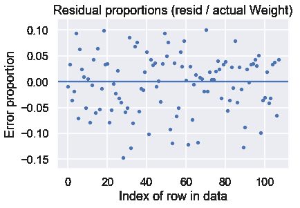

看起来我们的模型做得很好！剩余比例表明，我们的预测大多在正确值的 15%以内。