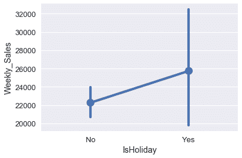
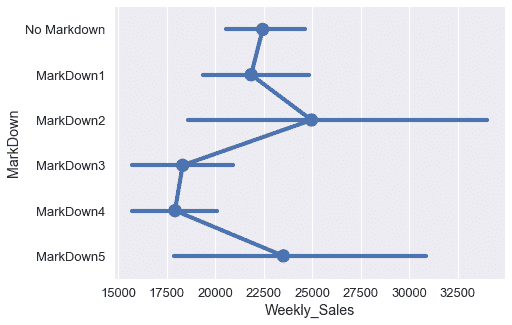
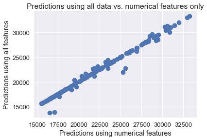

# 沃尔玛数据集

> 原文：[https://www.textbook.ds100.org/ch/14/feature ou one_hot.html](https://www.textbook.ds100.org/ch/14/feature ou one_hot.html)

```
# HIDDEN
# Clear previously defined variables
%reset -f

# Set directory for data loading to work properly
import os
os.chdir(os.path.expanduser('~/notebooks/14'))

```

```
# HIDDEN
import warnings
# Ignore numpy dtype warnings. These warnings are caused by an interaction
# between numpy and Cython and can be safely ignored.
# Reference: https://stackoverflow.com/a/40846742
warnings.filterwarnings("ignore", message="numpy.dtype size changed")
warnings.filterwarnings("ignore", message="numpy.ufunc size changed")

import numpy as np
import matplotlib.pyplot as plt
import pandas as pd
import seaborn as sns
%matplotlib inline
import ipywidgets as widgets
from ipywidgets import interact, interactive, fixed, interact_manual
import nbinteract as nbi

sns.set()
sns.set_context('talk')
np.set_printoptions(threshold=20, precision=2, suppress=True)
pd.options.display.max_rows = 7
pd.options.display.max_columns = 8
pd.set_option('precision', 2)
# This option stops scientific notation for pandas
# pd.set_option('display.float_format', '{:.2f}'.format)

```

2014 年，沃尔玛发布了一些销售数据，作为预测其商店每周销售额的竞争的一部分。我们已经获取了他们数据的一个子集，并将其加载到下面。

```
walmart = pd.read_csv('walmart.csv')
walmart

```

|  | 日期 | 每周销售 | 伊索利德 | 温度 | 燃料价格 | 失业 | 降价 |
| --- | --- | --- | --- | --- | --- | --- | --- |
| 零 | 2010 年 2 月 5 日 | 24924.50 美元 | 不 | 四十二点三一 | 二点五七二 | 八点一零六 | 无降价 |
| --- | --- | --- | --- | --- | --- | --- | --- |
| 1 个 | 2010 年 2 月 12 日 | 46039.49 元 | 是的 | 三十八点五一 | 二点五四八 | 8.106 | No Markdown |
| --- | --- | --- | --- | --- | --- | --- | --- |
| 二 | 2010 年 2 月 19 日 | 41595.55 美元 | No | 三十九点九三 | 二点五一四 | 8.106 | No Markdown |
| --- | --- | --- | --- | --- | --- | --- | --- |
| …… | …… | ... | ... | ... | ... | ... | ... |
| --- | --- | --- | --- | --- | --- | --- | --- |
| 一百四十 | 2012 年 10 月 12 日 | 22764.01 年 | No | 六十二点九九 | 三点六零一 | 六点五七三 | 降价 2 |
| --- | --- | --- | --- | --- | --- | --- | --- |
| 一百四十一 | 2012 年 10 月 19 日 | 24185.27 美元 | No | 六十七点九七 | 三点五九四 | 6.573 | MarkDown2 |
| --- | --- | --- | --- | --- | --- | --- | --- |
| 一百四十二 | 2012 年 10 月 26 日 | 27390.81 元 | No | 六十九点一六 | 三点五零六 | 6.573 | 降价 1 |
| --- | --- | --- | --- | --- | --- | --- | --- |

143 行×7 列

这些数据包含几个有趣的特性，包括一周是否包含假日（`IsHoliday`）、那周的失业率（`Unemployment`），以及商店在那一周提供哪些特价商品（`MarkDown`）。

我们的目标是创建一个模型，使用数据中的其他变量预测`Weekly_Sales`变量。使用线性回归模型，我们可以直接使用`Temperature`、`Fuel_Price`和`Unemployment`列，因为它们包含数值数据。

## 使用 SciKit Learn[¶](#Fitting-a-Model-Using-Scikit-Learn)拟合模型

在前面的部分中，我们已经了解了如何获取成本函数的梯度，并使用梯度下降来拟合模型。为此，我们必须为模型定义 python 函数、成本函数、成本函数的梯度和梯度下降算法。虽然这对于演示概念如何工作很重要，但在本节中，我们将使用名为[`scikit-learn`](http://scikit-learn.org/)的机器学习库，它允许我们用更少的代码来适应模型。

例如，为了使用沃尔玛数据集中的数值列来拟合多重线性回归模型，我们首先创建一个包含用于预测的变量的二维 numpy 数组和一个包含我们想要预测的值的一维数组：

```
numerical_columns = ['Temperature', 'Fuel_Price', 'Unemployment']
X = walmart[numerical_columns].as_matrix()
X

```

```
array([[ 42.31,   2.57,   8.11],
       [ 38.51,   2.55,   8.11],
       [ 39.93,   2.51,   8.11],
       ..., 
       [ 62.99,   3.6 ,   6.57],
       [ 67.97,   3.59,   6.57],
       [ 69.16,   3.51,   6.57]])
```

```
y = walmart['Weekly_Sales'].as_matrix()
y

```

```
array([ 24924.5 ,  46039.49,  41595.55, ...,  22764.01,  24185.27,
        27390.81])
```

然后，我们从`scikit-learn`（[docs](http://scikit-learn.org/stable/modules/generated/sklearn.linear_model.LinearRegression.html#sklearn.linear_model.LinearRegression)）导入`LinearRegression`类，实例化它，并使用`X`调用`fit`方法来预测`y`。

请注意，以前我们必须手动将所有$1$的列添加到`X`矩阵中，以便进行截距线性回归。这一次，`scikit-learn`将在幕后处理截获列，为我们节省一些工作。

```
from sklearn.linear_model import LinearRegression

simple_classifier = LinearRegression()
simple_classifier.fit(X, y)

```

```
LinearRegression(copy_X=True, fit_intercept=True, n_jobs=1, normalize=False)
```

我们完了！当我们调用`.fit`时，`scikit-learn`找到线性回归参数，使最小二乘成本函数最小化。我们可以看到以下参数：

```
simple_classifier.coef_, simple_classifier.intercept_

```

```
(array([ -332.22,  1626.63,  1356.87]), 29642.700510138635)
```

为了计算均方成本，我们可以要求分类器对输入数据`X`进行预测，并将预测值与实际值`y`进行比较。

```
predictions = simple_classifier.predict(X)
np.mean((predictions - y) ** 2)

```

```
74401210.603607252
```

平均平方误差看起来相当高。这很可能是因为我们的变量（温度、燃料价格和失业率）与每周销售的相关性很弱。

我们的数据中还有两个变量可能对预测更有用：列`IsHoliday`和列`MarkDown`。下面的框线图显示假日可能与周销售额有一定关系。

```
sns.pointplot(x='IsHoliday', y='Weekly_Sales', data=walmart);

```



不同的降价类别似乎与不同的周销售额密切相关。

```
markdowns = ['No Markdown', 'MarkDown1', 'MarkDown2', 'MarkDown3', 'MarkDown4', 'MarkDown5']
plt.figure(figsize=(7, 5))
sns.pointplot(x='Weekly_Sales', y='MarkDown', data=walmart, order=markdowns);

```



然而，`IsHoliday`和`MarkDown`列都包含分类数据，而不是数字数据，因此我们不能像回归那样使用它们。

## 一个热编码

幸运的是，我们可以对这些分类变量执行**一次热编码**转换，将它们转换为数字变量。转换的工作方式如下：为类别变量中的每个唯一值创建一个新列。如果变量最初具有相应的值，则该列包含$1$，否则该列包含$0$。例如，下面的`MarkDown`列包含以下值：

```
# HIDDEN
walmart[['MarkDown']]

```

|  | MarkDown |
| --- | --- |
| 0 | No Markdown |
| --- | --- |
| 1 | No Markdown |
| --- | --- |
| 2 | No Markdown |
| --- | --- |
| ... | ... |
| --- | --- |
| 140 | MarkDown2 |
| --- | --- |
| 141 | MarkDown2 |
| --- | --- |
| 142 | MarkDown1 |
| --- | --- |

143 行×1 列

此变量包含六个不同的唯一值：“no markdown”、“markdown1”、“markdown2”、“markdown3”、“markdown4”和“markdown5”。我们为每个值创建一列，以获得总共六列。然后，我们按照上面描述的方案用零和一填充列。

```
# HIDDEN
from sklearn.feature_extraction import DictVectorizer

items = walmart[['MarkDown']].to_dict(orient='records')
encoder = DictVectorizer(sparse=False)
pd.DataFrame(
    data=encoder.fit_transform(items),
    columns=encoder.feature_names_
)

```

|  | markdown=降价 1 | markdown=降价 2 | markdown=降价 3 | markdown=降价 4 | markdown=降价 5 | 降价=无降价 |
| --- | --- | --- | --- | --- | --- | --- |
| 0 | 零 | 0.0 | 0.0 | 0.0 | 0.0 | 1.0 条 |
| --- | --- | --- | --- | --- | --- | --- |
| 1 | 0.0 | 0.0 | 0.0 | 0.0 | 0.0 | 1.0 |
| --- | --- | --- | --- | --- | --- | --- |
| 2 | 0.0 | 0.0 | 0.0 | 0.0 | 0.0 | 1.0 |
| --- | --- | --- | --- | --- | --- | --- |
| ... | ... | ... | ... | ... | ... | ... |
| --- | --- | --- | --- | --- | --- | --- |
| 140 | 0.0 | 1.0 | 0.0 | 0.0 | 0.0 | 0.0 |
| --- | --- | --- | --- | --- | --- | --- |
| 141 | 0.0 | 1.0 | 0.0 | 0.0 | 0.0 | 0.0 |
| --- | --- | --- | --- | --- | --- | --- |
| 142 | 1.0 | 0.0 | 0.0 | 0.0 | 0.0 | 0.0 |
| --- | --- | --- | --- | --- | --- | --- |

143 行×6 列

请注意，数据中的第一个值是“无降价”，因此只有转换表中第一行的最后一列标记为$1$。此外，数据中的最后一个值是“markdown1”，这导致第 142 行的第一列标记为$1$。

结果表的每一行将包含一个包含$1$的列；其余的将包含$0$的列。名称“one hot”反映了这样一个事实：只有一列是“hot”（标记为$1$）。

## SciKit 学习[¶](#One-Hot-Encoding-in-Scikit-Learn)中的一个热编码

要执行一个热编码，我们可以使用`scikit-learn`的[`DictVectorizer`](http://scikit-learn.org/stable/modules/generated/sklearn.feature_extraction.DictVectorizer.html)类。要使用这个类，我们必须将数据框架转换为字典列表。dictvectorizer 类自动对分类数据（需要是字符串）进行一次热编码，并保持数字数据不变。

```
from sklearn.feature_extraction import DictVectorizer

all_columns = ['Temperature', 'Fuel_Price', 'Unemployment', 'IsHoliday',
               'MarkDown']

records = walmart[all_columns].to_dict(orient='records')
encoder = DictVectorizer(sparse=False)
encoded_X = encoder.fit_transform(records)
encoded_X

```

```
array([[  2.57,   1\.  ,   0\.  , ...,   1\.  ,  42.31,   8.11],
       [  2.55,   0\.  ,   1\.  , ...,   1\.  ,  38.51,   8.11],
       [  2.51,   1\.  ,   0\.  , ...,   1\.  ,  39.93,   8.11],
       ..., 
       [  3.6 ,   1\.  ,   0\.  , ...,   0\.  ,  62.99,   6.57],
       [  3.59,   1\.  ,   0\.  , ...,   0\.  ,  67.97,   6.57],
       [  3.51,   1\.  ,   0\.  , ...,   0\.  ,  69.16,   6.57]])
```

为了更好地理解转换后的数据，我们可以用列名显示它：

```
pd.DataFrame(data=encoded_X, columns=encoder.feature_names_)

```

|  | Fuel_Price | isholiday=否 | isholiday=是 | MarkDown=MarkDown1 | ... | MarkDown=MarkDown5 | MarkDown=No Markdown | Temperature | Unemployment |
| --- | --- | --- | --- | --- | --- | --- | --- | --- | --- |
| 0 | 2.572 | 1.0 | 0.0 | 0.0 | ... | 0.0 | 1.0 | 42.31 | 8.106 |
| --- | --- | --- | --- | --- | --- | --- | --- | --- | --- |
| 1 | 2.548 | 0.0 | 1.0 | 0.0 | ... | 0.0 | 1.0 | 38.51 | 8.106 |
| --- | --- | --- | --- | --- | --- | --- | --- | --- | --- |
| 2 | 2.514 | 1.0 | 0.0 | 0.0 | ... | 0.0 | 1.0 | 39.93 | 8.106 |
| --- | --- | --- | --- | --- | --- | --- | --- | --- | --- |
| ... | ... | ... | ... | ... | ... | ... | ... | ... | ... |
| --- | --- | --- | --- | --- | --- | --- | --- | --- | --- |
| 140 | 3.601 | 1.0 | 0.0 | 0.0 | ... | 0.0 | 0.0 | 62.99 | 6.573 |
| --- | --- | --- | --- | --- | --- | --- | --- | --- | --- |
| 141 | 3.594 | 1.0 | 0.0 | 0.0 | ... | 0.0 | 0.0 | 67.97 | 6.573 |
| --- | --- | --- | --- | --- | --- | --- | --- | --- | --- |
| 142 | 3.506 | 1.0 | 0.0 | 1.0 | ... | 0.0 | 0.0 | 69.16 | 6.573 |
| --- | --- | --- | --- | --- | --- | --- | --- | --- | --- |

143 行×11 列

数值变量（燃油价格、温度和失业率）保留为数字。分类变量（假日和降价）是一个热编码。当我们使用新的数据矩阵来拟合线性回归模型时，我们将为每列数据生成一个参数。因为这个数据矩阵包含 11 列，所以模型将有 12 个参数，因为我们为截距项设置了额外的参数。

## 用转换后的数据拟合模型

我们现在可以使用`encoded_X`变量进行线性回归。

```
clf = LinearRegression()
clf.fit(encoded_X, y)

```

```
LinearRegression(copy_X=True, fit_intercept=True, n_jobs=1, normalize=False)
```

如前所述，我们有十一个列参数和一个截距参数。

```
clf.coef_, clf.intercept_

```

```
(array([ 1622.11,    -2.04,     2.04,   962.91,  1805.06, -1748.48,
        -2336.8 ,   215.06,  1102.25,  -330.91,  1205.56]), 29723.135729284979)
```

我们可以比较两个分类器的一些预测，看看两者之间是否有很大的区别。

```
walmart[['Weekly_Sales']].assign(
    pred_numeric=simple_classifier.predict(X),
    pred_both=clf.predict(encoded_X)
)

```

|  | Weekly_Sales | pred 数字 | 两者皆可预测 |
| --- | --- | --- | --- |
| 0 | 24924.50 | 30768.878035 | 30766.790214 年 |
| --- | --- | --- | --- |
| 1 | 46039.49 | 31992.279504 | 31989.410395 年 |
| --- | --- | --- | --- |
| 2 | 41595.55 | 31465.220158 号 | 31460.280008 个 |
| --- | --- | --- | --- |
| ... | ... | ... | ... |
| --- | --- | --- | --- |
| 140 | 22764.01 | 23492.262649 | 24447.348979 个 |
| --- | --- | --- | --- |
| 141 | 24185.27 | 21826.414794 个 | 22788.049554 个 |
| --- | --- | --- | --- |
| 142 | 27390.81 | 21287.928537 | 21409.367463 号 |
| --- | --- | --- | --- |

143 行×3 列

这两个模型的预测似乎非常相似。两组预测的散点图证实了这一点。

```
plt.scatter(simple_classifier.predict(X), clf.predict(encoded_X))
plt.title('Predictions using all data vs. numerical features only')
plt.xlabel('Predictions using numerical features')
plt.ylabel('Predictions using all features');

```



## 模型诊断

为什么会这样？我们可以检查两个模型学习的参数。下表显示了分类器所获得的权重，该分类器只使用数值变量而不使用一个热编码：

```
# HIDDEN
def clf_params(names, clf):
    weights = (
        np.append(clf.coef_, clf.intercept_)
    )
    return pd.DataFrame(weights, names + ['Intercept'])

clf_params(numerical_columns, simple_classifier)

```

|  | 0 |
| --- | --- |
| Temperature | -332.221180 个 |
| --- | --- |
| Fuel_Price | 1626.625604 年 |
| --- | --- |
| Unemployment | 1356.868319 号 |
| --- | --- |
| 拦截 | 29642.700510 个 |
| --- | --- |

下表显示了使用一个热编码的分类器学习的权重。

```
# HIDDEN
pd.options.display.max_rows = 13
display(clf_params(encoder.feature_names_, clf))
pd.options.display.max_rows = 7

```

|  | 0 |
| --- | --- |
| Fuel_Price | 1622.106239 年 |
| --- | --- |
| IsHoliday=No | -2.041451 年 |
| --- | --- |
| IsHoliday=Yes | 2.041451 年 |
| --- | --- |
| MarkDown=MarkDown1 | 962.908849 号 |
| --- | --- |
| MarkDown=MarkDown2 | 1805.059613 年 |
| --- | --- |
| MarkDown=MarkDown3 | -1748.475046 年 |
| --- | --- |
| MarkDown=MarkDown4 | -2336.799791 |
| --- | --- |
| MarkDown=MarkDown5 | 215.060616 年 |
| --- | --- |
| MarkDown=No Markdown | 1102.245760 号 |
| --- | --- |
| Temperature | -330.912587 号 |
| --- | --- |
| Unemployment | 1205.564331 年 |
| --- | --- |
| Intercept | 29723.135729 个 |
| --- | --- |

我们可以看到，即使我们使用一个热编码列来拟合线性回归模型，燃油价格、温度和失业率的权重也与以前的值非常相似。与截距项相比，所有权重都很小，这意味着大多数变量仍然与实际销售额略有关联。事实上，`IsHoliday`变量的模型权重非常低，以至于在预测日期是否为假日时几乎没有区别。尽管一些`MarkDown`权重相当大，但许多降价事件在数据集中只出现几次。

```
walmart['MarkDown'].value_counts()

```

```
No Markdown    92
MarkDown1      25
MarkDown2      13
MarkDown5       9
MarkDown4       2
MarkDown3       2
Name: MarkDown, dtype: int64
```

这表明我们可能需要收集更多的数据，以便模型更好地利用降价事件对销售额的影响。（实际上，这里显示的数据集是沃尔玛发布的[大得多的数据集](https://www.kaggle.com/c/walmart-recruiting-store-sales-forecasting)的一个子集。使用整个数据集而不是一个子集训练模型将是一个有用的练习。）

## 摘要[¶](#Summary)

我们已经学会了使用一种热编码，这是一种对分类数据进行线性回归的有用技术。尽管在这个特定的例子中，转换对我们的模型没有太大的影响，但在实际中，这种技术在处理分类数据时得到了广泛的应用。一个热编码还说明了特征工程的一般原理，它采用原始数据矩阵，并将其转换为一个潜在的更有用的矩阵。