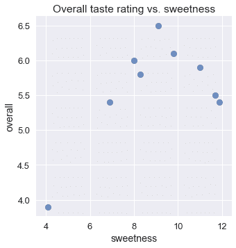
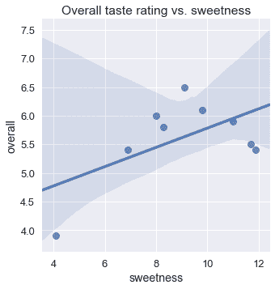
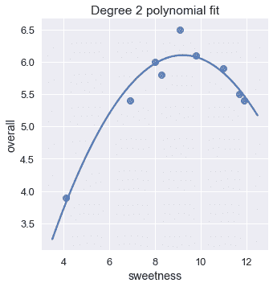
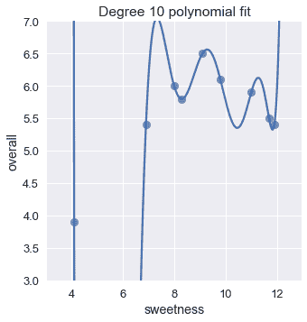
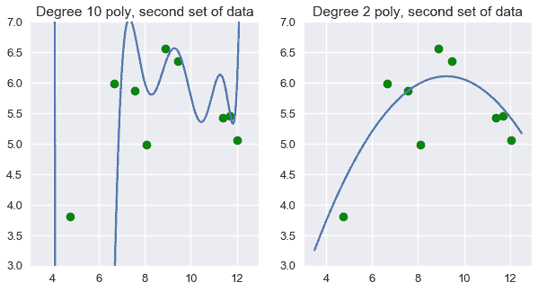

# 预测冰淇淋评级

> 原文：[https://www.textbook.ds100.org/ch/14/feature_polynomy.html](https://www.textbook.ds100.org/ch/14/feature_polynomy.html)

```
# HIDDEN
# Clear previously defined variables
%reset -f

# Set directory for data loading to work properly
import os
os.chdir(os.path.expanduser('~/notebooks/14'))

```

```
# HIDDEN
import warnings
# Ignore numpy dtype warnings. These warnings are caused by an interaction
# between numpy and Cython and can be safely ignored.
# Reference: https://stackoverflow.com/a/40846742
warnings.filterwarnings("ignore", message="numpy.dtype size changed")
warnings.filterwarnings("ignore", message="numpy.ufunc size changed")

import numpy as np
import matplotlib.pyplot as plt
import pandas as pd
import seaborn as sns
%matplotlib inline
import ipywidgets as widgets
from ipywidgets import interact, interactive, fixed, interact_manual
import nbinteract as nbi

sns.set()
sns.set_context('talk')
np.set_printoptions(threshold=20, precision=2, suppress=True)
pd.options.display.max_rows = 7
pd.options.display.max_columns = 8
pd.set_option('precision', 2)
# This option stops scientific notation for pandas
# pd.set_option('display.float_format', '{:.2f}'.format)

```

```
# HIDDEN
def df_interact(df, nrows=7, ncols=7):
    '''
    Outputs sliders that show rows and columns of df
    '''
    def peek(row=0, col=0):
        return df.iloc[row:row + nrows, col:col + ncols]
    if len(df.columns) <= ncols:
        interact(peek, row=(0, len(df) - nrows, nrows), col=fixed(0))
    else:
        interact(peek,
                 row=(0, len(df) - nrows, nrows),
                 col=(0, len(df.columns) - ncols))
    print('({} rows, {} columns) total'.format(df.shape[0], df.shape[1]))

```

```
# HIDDEN
# To determine which columns to regress
# ice_orig = pd.read_csv('icecream_orig.csv')
# cols = ['aerated', 'afterfeel', 'almond', 'buttery', 'color', 'cooling',
#        'creamy', 'doughy', 'eggy', 'fat', 'fat_level', 'fatty', 'hardness',
#        'ice_crystals', 'id', 'liking_flavor', 'liking_texture', 'melt_rate',
#        'melting_rate', 'milky', 'sugar', 'sugar_level', 'sweetness',
#        'tackiness', 'vanilla']

# melted = ice_orig.melt(id_vars='overall', value_vars=cols, var_name='type')
# sns.lmplot(x='value', y='overall', col='type', col_wrap=5, data=melted,
#            sharex=False, fit_reg=False)

```

假设我们正在尝试创造新的，流行的冰淇淋口味。我们对以下回归问题很感兴趣：考虑到冰淇淋的甜味，预测它的总体口味等级为 7。

```
ice = pd.read_csv('icecream.csv')
ice

```

|  | 甜度 | 总体的 |
| --- | --- | --- |
| 零 | 第 4.1 条 | 三点九 |
| --- | --- | --- |
| 1 个 | 六点九 | 五点四 |
| --- | --- | --- |
| 二 | 八点三 | 五点八 |
| --- | --- | --- |
| …… | …… | ... |
| --- | --- | --- |
| 六 | 11.0 条 | 五点九 |
| --- | --- | --- |
| 七 | 十一点七 | 第 5.5 条 |
| --- | --- | --- |
| 8 个 | 十一点九 | 5.4 |
| --- | --- | --- |

9 行×2 列

虽然我们预计不够甜的冰淇淋口味将获得较低的评级，但我们也预计过于甜的冰淇淋口味也将获得较低的评级。这反映在整体评分和甜度的散点图中：

```
# HIDDEN
sns.lmplot(x='sweetness', y='overall', data=ice, fit_reg=False)
plt.title('Overall taste rating vs. sweetness');

```



不幸的是，仅仅一个线性模型不能考虑这种增加然后减少的行为；在一个线性模型中，整体评级只能随着甜度单调地增加或减少。我们可以看到，使用线性回归会导致拟合不良。

```
# HIDDEN
sns.lmplot(x='sweetness', y='overall', data=ice)
plt.title('Overall taste rating vs. sweetness');

```



对于这个问题，一个有用的方法是拟合多项式曲线而不是直线。这样一条曲线可以让我们模拟这样一个事实：总体评分随着甜味的增加而增加，直到某一点，然后随着甜味的增加而降低。

使用特征工程技术，我们可以简单地在数据中添加新的列，以使用线性模型进行多项式回归。

## 多项式特征

回想一下，在线性回归中，我们为数据矩阵$x$的每一列拟合一个权重。在这种情况下，我们的矩阵$X$包含两列：一列所有列和甜度。

```
# HIDDEN
from sklearn.preprocessing import PolynomialFeatures

first_X = PolynomialFeatures(degree=1).fit_transform(ice[['sweetness']])
pd.DataFrame(data=first_X, columns=['bias', 'sweetness'])

```

|  | 偏倚 | sweetness |
| --- | --- | --- |
| 0 | 1.0 条 | 4.1 |
| --- | --- | --- |
| 1 | 1.0 | 6.9 |
| --- | --- | --- |
| 2 | 1.0 | 8.3 |
| --- | --- | --- |
| ... | ... | ... |
| --- | --- | --- |
| 6 | 1.0 | 11.0 |
| --- | --- | --- |
| 7 | 1.0 | 11.7 |
| --- | --- | --- |
| 8 | 1.0 | 11.9 |
| --- | --- | --- |

9 rows × 2 columns

因此，我们的模型是：

$$ f_\hat{\theta} (x) = \hat{\theta_0} + \hat{\theta_1} \cdot \text{sweetness} $$

我们可以用$x$创建一个新列，其中包含甜度的平方值。

```
# HIDDEN
second_X = PolynomialFeatures(degree=2).fit_transform(ice[['sweetness']])
pd.DataFrame(data=second_X, columns=['bias', 'sweetness', 'sweetness^2'])

```

|  | bias | sweetness | 甜度^2 |
| --- | --- | --- | --- |
| 0 | 1.0 | 4.1 | 16.81 元 |
| --- | --- | --- | --- |
| 1 | 1.0 | 6.9 | 四十七点六一 |
| --- | --- | --- | --- |
| 2 | 1.0 | 8.3 | 六十八点八九 |
| --- | --- | --- | --- |
| ... | ... | ... | ... |
| --- | --- | --- | --- |
| 6 | 1.0 | 11.0 | 一百二十一 |
| --- | --- | --- | --- |
| 7 | 1.0 | 11.7 | 一百三十六点八九 |
| --- | --- | --- | --- |
| 8 | 1.0 | 11.9 | 一百四十一点六一 |
| --- | --- | --- | --- |

9 行×3 列

由于我们的模型为其输入矩阵的每列学习一个权重，因此我们的模型将成为：

$$ f_\hat{\theta} (x) = \hat{\theta_0} + \hat{\theta_1} \cdot \text{sweetness} + \hat{\theta_2} \cdot \text{sweetness}^2 $$

我们的模型现在与我们的数据拟合二次多项式。我们可以通过为“$\text sweetness ^3$”、“$\text sweetness ^4$”等添加列来轻松适应更高程度的多项式。

注意，这个模型仍然是一个线性模型，因为它的参数是**线性的，每个$\hat \theta i$都是一个阶数的标量值。但是，该模型在其特性**中是**多项式，因为其输入数据包含另一列的多项式转换列。**

## 多项式回归

为了进行多项式回归，我们使用具有多项式特征的线性模型。因此，我们从`scikit-learn`导入[`LinearRegression`](http://scikit-learn.org/stable/modules/generated/sklearn.linear_model.LinearRegression.html#sklearn.linear_model.LinearRegression)模型和[`PolynomialFeatures`](http://scikit-learn.org/stable/modules/generated/sklearn.preprocessing.PolynomialFeatures.html#sklearn.preprocessing.PolynomialFeatures)转换。

```
from sklearn.linear_model import LinearRegression
from sklearn.preprocessing import PolynomialFeatures

```

我们的原始数据矩阵$x$包含以下值。请记住，我们包含的列和行标签仅供参考；实际的$x$矩阵仅包含下表中的数字数据。

```
ice[['sweetness']]

```

|  | sweetness |
| --- | --- |
| 0 | 4.1 |
| --- | --- |
| 1 | 6.9 |
| --- | --- |
| 2 | 8.3 |
| --- | --- |
| ... | ... |
| --- | --- |
| 6 | 11.0 |
| --- | --- |
| 7 | 11.7 |
| --- | --- |
| 8 | 11.9 |
| --- | --- |

9 行×1 列

我们首先使用`PolynomialFeatures`类来转换数据，添加 2 次的多项式特征。

```
transformer = PolynomialFeatures(degree=2)
X = transformer.fit_transform(ice[['sweetness']])
X

```

```
array([[  1\.  ,   4.1 ,  16.81],
       [  1\.  ,   6.9 ,  47.61],
       [  1\.  ,   8.3 ,  68.89],
       ...,
       [  1\.  ,  11\.  , 121\.  ],
       [  1\.  ,  11.7 , 136.89],
       [  1\.  ,  11.9 , 141.61]])
```

现在，我们将线性模型拟合到这个数据矩阵中。

```
clf = LinearRegression(fit_intercept=False)
clf.fit(X, ice['overall'])
clf.coef_

```

```
array([-1.3 ,  1.6 , -0.09])
```

上面的参数表明，对于此数据集，最适合的模型是：

$$ f_\hat{\theta} (x) = -1.3 + 1.6 \cdot \text{sweetness} - 0.09 \cdot \text{sweetness}^2 $$

我们现在可以将此模型的预测与原始数据进行比较。

```
# HIDDEN
sns.lmplot(x='sweetness', y='overall', data=ice, fit_reg=False)
xs = np.linspace(3.5, 12.5, 1000).reshape(-1, 1)
ys = clf.predict(transformer.transform(xs))
plt.plot(xs, ys)
plt.title('Degree 2 polynomial fit');

```



这个模型看起来比我们的线性模型更适合。我们也可以验证二次多项式拟合的均方成本远低于线性拟合的成本。

```
# HIDDEN
y = ice['overall']
pred_linear = (
    LinearRegression(fit_intercept=False).fit(first_X, y).predict(first_X)
)
pred_quad = clf.predict(X)

def mse_cost(pred, y): return np.mean((pred - y) ** 2)

print(f'MSE cost for linear reg:     {mse_cost(pred_linear, y):.3f}')
print(f'MSE cost for deg 2 poly reg: {mse_cost(pred_quad, y):.3f}')

```

```
MSE cost for linear reg:     0.323
MSE cost for deg 2 poly reg: 0.032

```

## 增加度数[¶](#Increasing-the-Degree)

如前所述，我们可以自由地向数据添加更高阶多项式特征。例如，我们可以很容易地创建五次多项式特征：

```
# HIDDEN
second_X = PolynomialFeatures(degree=5).fit_transform(ice[['sweetness']])
pd.DataFrame(data=second_X,
             columns=['bias', 'sweetness', 'sweetness^2', 'sweetness^3',
                      'sweetness^4', 'sweetness^5'])

```

|  | bias | sweetness | sweetness^2 | 甜度^3 | 甜度^4 | 甜度^5 |
| --- | --- | --- | --- | --- | --- | --- |
| 0 | 1.0 | 4.1 | 16.81 | 六十八点九二一 | 282.5761 个 | 1158.56201 年 |
| --- | --- | --- | --- | --- | --- | --- |
| 1 | 1.0 | 6.9 | 47.61 | 328.509 年 | 2266.7121 个 | 15640.31349 年 |
| --- | --- | --- | --- | --- | --- | --- |
| 2 | 1.0 | 8.3 | 68.89 | 571.787 美元 | 4745.8321 个 | 39390.40643 个 |
| --- | --- | --- | --- | --- | --- | --- |
| ... | ... | ... | ... | ... | ... | ... |
| --- | --- | --- | --- | --- | --- | --- |
| 6 | 1.0 | 11.0 | 121.00 | 1331.000 个 | 14641.0000 元 | 161051.00000 美元 |
| --- | --- | --- | --- | --- | --- | --- |
| 7 | 1.0 | 11.7 | 136.89 | 1601.613 年 | 18738.8721 年 | 219244.80357 号 |
| --- | --- | --- | --- | --- | --- | --- |
| 8 | 1.0 | 11.9 | 141.61 | 1685.159 年 | 20053.3921 年 | 238635.36599 个 |
| --- | --- | --- | --- | --- | --- | --- |

9 行×6 列

利用这些特征拟合线性模型，得到五次多项式回归。

```
# HIDDEN
trans_five = PolynomialFeatures(degree=5)
X_five = trans_five.fit_transform(ice[['sweetness']])
clf_five = LinearRegression(fit_intercept=False).fit(X_five, y)

sns.lmplot(x='sweetness', y='overall', data=ice, fit_reg=False)
xs = np.linspace(3.5, 12.5, 1000).reshape(-1, 1)
ys = clf_five.predict(trans_five.transform(xs))
plt.plot(xs, ys)
plt.title('Degree 5 polynomial fit');

```


该图表明，一个五次多项式和一个二次多项式似乎能大致拟合数据。事实上，五次多项式的均方成本几乎是二次多项式成本的一半。

```
pred_five = clf_five.predict(X_five)

print(f'MSE cost for linear reg:     {mse_cost(pred_linear, y):.3f}')
print(f'MSE cost for deg 2 poly reg: {mse_cost(pred_quad, y):.3f}')
print(f'MSE cost for deg 5 poly reg: {mse_cost(pred_five, y):.3f}')

```

```
MSE cost for linear reg:     0.323
MSE cost for deg 2 poly reg: 0.032
MSE cost for deg 5 poly reg: 0.017

```

这表明，我们可能会做得更好，提高程度甚至更多。为什么不是 10 次多项式？

```
# HIDDEN
trans_ten = PolynomialFeatures(degree=10)
X_ten = trans_ten.fit_transform(ice[['sweetness']])
clf_ten = LinearRegression(fit_intercept=False).fit(X_ten, y)

sns.lmplot(x='sweetness', y='overall', data=ice, fit_reg=False)
xs = np.linspace(3.5, 12.5, 1000).reshape(-1, 1)
ys = clf_ten.predict(trans_ten.transform(xs))
plt.plot(xs, ys)
plt.title('Degree 10 polynomial fit')
plt.ylim(3, 7);

```



下面是迄今为止我们所看到的回归模型的均方成本：

```
# HIDDEN
pred_ten = clf_ten.predict(X_ten)

print(f'MSE cost for linear reg:      {mse_cost(pred_linear, y):.3f}')
print(f'MSE cost for deg 2 poly reg:  {mse_cost(pred_quad, y):.3f}')
print(f'MSE cost for deg 5 poly reg:  {mse_cost(pred_five, y):.3f}')
print(f'MSE cost for deg 10 poly reg: {mse_cost(pred_ten, y):.3f}')

```

```
MSE cost for linear reg:      0.323
MSE cost for deg 2 poly reg:  0.032
MSE cost for deg 5 poly reg:  0.017
MSE cost for deg 10 poly reg: 0.000

```

10 次多项式的代价为零！如果我们仔细观察这个图，这是有意义的；十次多项式设法通过数据中每个点的精确位置。

然而，你应该对使用 10 次多项式来预测冰淇淋评级感到犹豫。直观地说，10 次多项式似乎与我们的特定数据集太接近了。如果我们取另一组数据，并将它们绘制在上面的散点图上，我们可以期望它们接近我们的原始数据集。然而，当我们这样做时，10 次多项式突然看起来不太合适，而 2 次多项式看起来仍然合理。

```
# HIDDEN
# sns.lmplot(x='sweetness', y='overall', data=ice, fit_reg=False)
np.random.seed(1)
x_devs = np.random.normal(scale=0.4, size=len(ice))
y_devs = np.random.normal(scale=0.4, size=len(ice))

plt.figure(figsize=(10, 5))

# Degree 10
plt.subplot(121)
ys = clf_ten.predict(trans_ten.transform(xs))
plt.plot(xs, ys)
plt.scatter(ice['sweetness'] + x_devs,
            ice['overall'] + y_devs,
            c='g')
plt.title('Degree 10 poly, second set of data')
plt.ylim(3, 7);

plt.subplot(122)
ys = clf.predict(transformer.transform(xs))
plt.plot(xs, ys)
plt.scatter(ice['sweetness'] + x_devs,
            ice['overall'] + y_devs,
            c='g')
plt.title('Degree 2 poly, second set of data')
plt.ylim(3, 7);

```



我们可以看到，在这种情况下，二次多项式的特征比无变换和十次多项式的特征都更好。

这就提出了一个自然的问题：一般来说，我们如何确定要拟合的多项式的度数？尽管我们试图使用训练数据集上的成本来选择最佳多项式，但我们已经看到使用此成本可以选择过于复杂的模型。相反，我们希望根据不用于拟合参数的数据来评估模型。

## 摘要[¶](#Summary)

在本节中，我们将介绍另一种特征工程技术：将多项式特征添加到数据中以执行多项式回归。与一种热编码一样，添加多项式特性允许我们在更多类型的数据上有效地使用线性回归模型。

我们还遇到了特征工程的一个基本问题。向数据中添加许多特性可以使模型在其原始数据集上降低成本，但通常会导致新数据集上的模型不太精确。