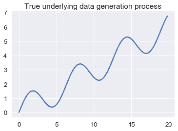
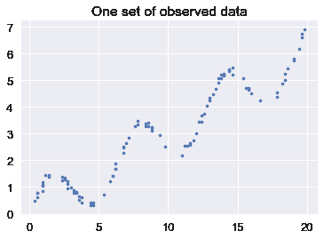
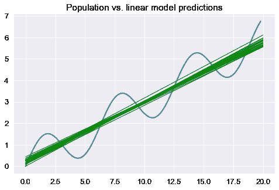
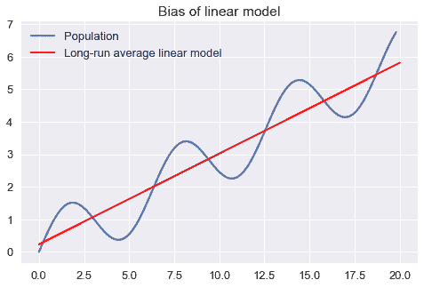
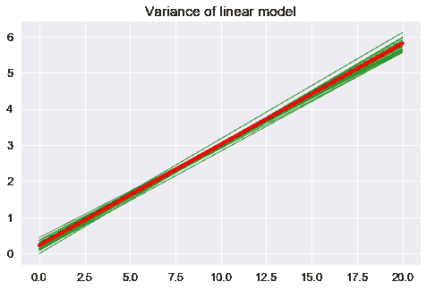
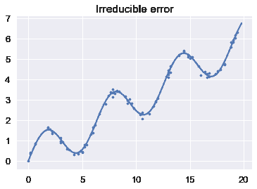
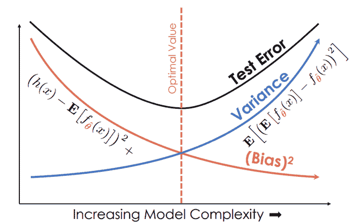
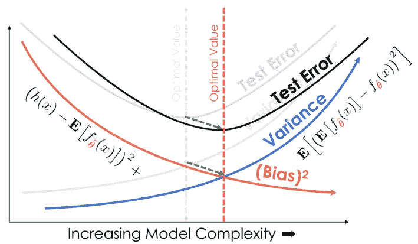

# 模型偏差和方差

> 原文：[https://www.bookbookmark.ds100.org/ch/15/bias_modeling.html](https://www.bookbookmark.ds100.org/ch/15/bias_modeling.html)

```
# HIDDEN
# Clear previously defined variables
%reset -f

# Set directory for data loading to work properly
import os
os.chdir(os.path.expanduser('~/notebooks/15'))

```

```
# HIDDEN
import warnings
# Ignore numpy dtype warnings. These warnings are caused by an interaction
# between numpy and Cython and can be safely ignored.
# Reference: https://stackoverflow.com/a/40846742
warnings.filterwarnings("ignore", message="numpy.dtype size changed")
warnings.filterwarnings("ignore", message="numpy.ufunc size changed")

import numpy as np
import matplotlib.pyplot as plt
import pandas as pd
import seaborn as sns
%matplotlib inline
import ipywidgets as widgets
from ipywidgets import interact, interactive, fixed, interact_manual
import nbinteract as nbi

sns.set()
sns.set_context('talk')
np.set_printoptions(threshold=20, precision=2, suppress=True)
pd.options.display.max_rows = 7
pd.options.display.max_columns = 8
pd.set_option('precision', 2)
# This option stops scientific notation for pandas
# pd.set_option('display.float_format', '{:.2f}'.format)

```

```
# HIDDEN
def df_interact(df, nrows=7, ncols=7):
    '''
    Outputs sliders that show rows and columns of df
    '''
    def peek(row=0, col=0):
        return df.iloc[row:row + nrows, col:col + ncols]
    if len(df.columns) <= ncols:
        interact(peek, row=(0, len(df) - nrows, nrows), col=fixed(0))
    else:
        interact(peek,
                 row=(0, len(df) - nrows, nrows),
                 col=(0, len(df.columns) - ncols))
    print('({} rows, {} columns) total'.format(df.shape[0], df.shape[1]))

```

我们之前已经看到，我们选择的模型有两个基本的错误来源。

我们的模型可能过于简单——例如，线性模型无法正确地拟合由二次过程生成的数据。这种类型的错误是由模型**偏差**引起的。

我们的模型也可能适合数据中的随机噪声，即使我们使用二次模型拟合二次过程，模型也可能预测不同于实际过程产生的结果。这种类型的错误是由模型**方差**引起的。

## 偏差方差分解

我们可以通过分解模型风险的公式，使上面的陈述更加精确。回想一下，$f \theta 型号的**风险**是所有可能的训练数据集$x$、$y$和所有输入输出点$z$、$\gamma$在总体上的预期损失：

$$ \begin{aligned} R(f_\hat{\theta}) = \mathbb{E}[ \ell(\gamma, f_\hat{\theta} (z)) ] \end{aligned} $$

我们将生成真实人口数据的过程表示为$f_yta（x）$。输出点$\gamma$由我们的填充过程加上数据收集中的一些随机噪声生成：$\gamma_i=f_ \theta（z_i）+\epsilon$。随机噪声$\epsilon$是平均值为零的随机变量：$\mathbb e[\epsilon]=0$。

如果我们使用平方误差作为损失函数，则上述表达式将变为：

$$ \begin{aligned} R(f_\hat{\theta}) = \mathbb{E}[ (\gamma - f_\hat{\theta} (z))^2 ] \end{aligned} $$

通过一些代数运算，我们可以证明上述表达式等价于：

$$ \begin{aligned} R(f_\hat{\theta}) = (\mathbb{E}[f_\hat{\theta}(z)] - f_\theta(z))^2 + \text{Var}(f_\hat{\theta}(z)) + \text{Var}(\epsilon) \end{aligned} $$

此表达式中的第一个术语$（\mathbb e[f \theta（z）]-f \theta（z））^2$是模型偏差的数学表达式。（从技术上讲，这个术语表示偏差平方，$\text 偏差^2$）如果从长远来看，我们选择$f \theta（z）$模型预测人口过程产生的相同结果，$f \theta（z）$则偏差等于零。如果我们选择的模型对总体过程的预测很差，那么即使我们将整个总体作为数据集，这种偏差也是很高的。

此表达式中的第二个术语，$\text var（f \that \theta（z））$表示模型方差。当模型的预测在不同的数据集上训练时变化不大时，方差很小。当模型在来自总体的不同数据集上训练时，当模型的预测发生很大变化时，方差很大。

此表达式中的第三个也是最后一个术语，$\text var（\epsilon）$表示数据生成和收集过程中不可减少的错误或噪声。当数据生成和收集过程很精确或变化很小时，这个术语就很小。当数据包含大量噪声时，此术语很大。

## 偏差方差分解的推导

为了开始分解，我们从均方误差开始：

$$\mathbb{E}[(\gamma - f_{\hat{\theta}}(z))^2]$$

并展开平方，应用期望线性：

$$ =\mathbb{E}[\gamma^2 -2\gamma f_{\hat{\theta}} +f_\hat{\theta}(z)^2]$$

$=\mathbb e[\gamma^2]-\mathbb e[2\gamma f \hat \theta（z）]+\mathbb[f \hat \theta（z）^2]$$

由于\ \\\123\\123 \123 123 ；（Z）美元。然后，我们用$F_uyta（z）+\epsilon$替换$\gamma$：

$$ =\mathbb{E}[(f_\theta(z) + \epsilon)^2] - \mathbb{E}[2(f_\theta(z) + \epsilon)] \mathbb{E}[f_{\hat{\theta}}(z)] + \mathbb{E}[f_{\hat{\theta}}(z)^2]$$

再简单化一些：（注意，$\mathbb e[f \theta（z）]=f \theta（z）$因为$f \theta（z）$是一个确定性函数，给定一个特定的查询点$z$。）

$$ =\mathbb{E}[f_\theta(z)^2 + 2f_\theta(z) \epsilon + \epsilon^2] - (2f_\theta(z) + \mathbb{E}[2\epsilon]) \mathbb{E}[f_{\hat{\theta}}(z)] + \mathbb{E}[f_{\hat{\theta}}(z)^2]$$

再次应用期望线性：

$$= f_\theta(z)^2 + 2f_\theta(z)\mathbb{E}[\epsilon] + \mathbb{E}[\epsilon^2] - (2f_\theta(z) + 2\mathbb{E}[\epsilon]) \mathbb{E}[f_{\hat{\theta}}(z)] + \mathbb{E}[f_{\hat{\theta}}(z)^2]$$

注意到$\big（\mathbb e[\epsilon]=0\big）=&gt；\big（\mathbb[\epsilon^2]=\text var（\epsilon）\big）$因为$\text var（\epsilon）=\mathbb

$$ = f_\theta(z)^2 + \text{Var}(\epsilon) - 2f_\theta(z) \mathbb{E}[f_{\hat{\theta}}(z)] + \mathbb{E}[f_{\hat{\theta}}(z)^2]$$

然后我们可以将方程改写为：

$$ = f_\theta(z)^2 + \text{Var}(\epsilon) - 2f_\theta(z) \mathbb{E}[f_{\hat{\theta}}(z)] + \mathbb{E}[f_{\hat{\theta}}(z)^2] - \mathbb{E}[f_{\hat{\theta}}(z)]^2 + \mathbb{E}[f_{\hat{\theta}}(z)]^2$$

因为$\mathbb e[f \hat \theta（z）^2]-\mathbb[f \hat \theta（z）]2=var（f \hat \theta（z））$：

$$ = f_\theta(z)^2 - 2f_\theta(z) \mathbb{E}[f_{\hat{\theta}}(z)] + \mathbb{E}[f_{\hat{\theta}}(z)]^2 + Var(f_{\hat{\theta}}(z)) + \text{Var}(\epsilon)$$$$ = (f_\theta(z) - \mathbb{E}[f_{\hat{\theta}}(z)])^2 + Var(f_{\hat{\theta}}(z)) + \text{Var}(\epsilon) $$$$= \text{bias}^2 + \text{model variance} + \text{noise}$$

为了选择一个性能良好的模型，我们寻求最小化风险。为了最小化风险，我们尝试最小化偏差方差分解的偏差、方差和噪声项。例如，降低噪声项通常需要改进数据采集过程，以购买更精确的传感器。然而，为了减少偏差和方差，我们必须调整模型的复杂性。过于简单的模型具有较高的偏差；过于复杂的模型具有较高的方差。这就是 _ 偏差方差权衡 _ 的本质，这是我们在选择预测模型时面临的一个基本问题。

## 示例：线性回归和正弦波

假设我们正在对下面所示的振荡函数生成的数据进行建模。

```
# HIDDEN
from collections import namedtuple
from sklearn.linear_model import LinearRegression

np.random.seed(42)

Line = namedtuple('Line', ['x_start', 'x_end', 'y_start', 'y_end'])

def f(x): return np.sin(x) + 0.3 * x

def noise(n):
    return np.random.normal(scale=0.1, size=n)

def draw(n):
    points = np.random.choice(np.arange(0, 20, 0.2), size=n)
    return points, f(points) + noise(n)

def fit_line(x, y, x_start=0, x_end=20):
    clf = LinearRegression().fit(x.reshape(-1, 1), y)
    return Line(x_start, x_end, clf.predict(x_start)[0], clf.predict(x_end)[0])

population_x = np.arange(0, 20, 0.2)
population_y = f(population_x)

avg_line = fit_line(population_x, population_y)

datasets = [draw(100) for _ in range(20)]
random_lines = [fit_line(x, y) for x, y in datasets]

```

```
# HIDDEN
plt.plot(population_x, population_y)
plt.title('True underlying data generation process');

```



如果我们从人群中随机抽取一个数据集，我们可能会得到以下结果：

```
# HIDDEN
xs, ys = draw(100)
plt.scatter(xs, ys, s=10)
plt.title('One set of observed data');

```



假设我们从总体中提取许多数据集，并将一个简单的线性模型拟合到每个数据集。下面，我们用蓝色绘制人口数据生成方案，用绿色绘制模型预测。

```
# HIDDEN
plt.figure(figsize=(8, 5))
plt.plot(population_x, population_y)

for x_start, x_end, y_start, y_end in random_lines:
    plt.plot([x_start, x_end], [y_start, y_end], linewidth=1, c='g')

plt.title('Population vs. linear model predictions');

```



上面的图表清楚地表明，一个线性模型会对这个群体产生预测误差。我们可以将预测误差分解为偏差、方差和不可约噪声。我们通过显示长期平均线性模型将预测不同于人口过程的结果来说明我们模型的偏差：

```
plt.figure(figsize=(8, 5))
xs = np.arange(0, 20, 0.2)
plt.plot(population_x, population_y, label='Population')

plt.plot([avg_line.x_start, avg_line.x_end],
         [avg_line.y_start, avg_line.y_end],
         linewidth=2, c='r',
         label='Long-run average linear model')
plt.title('Bias of linear model')
plt.legend();

```



我们模型的方差是围绕长期平均模型的模型预测的方差：

```
plt.figure(figsize=(8, 5))
for x_start, x_end, y_start, y_end in random_lines:
    plt.plot([x_start, x_end], [y_start, y_end], linewidth=1, c='g', alpha=0.8)

plt.plot([avg_line.x_start, avg_line.x_end],
         [avg_line.y_start, avg_line.y_end],
         linewidth=4, c='r')

plt.title('Variance of linear model');

```



最后，我们通过显示观测点与底层总体过程的偏差来说明不可约误差。

```
# HIDDEN
plt.plot(population_x, population_y)

xs, ys = draw(100)
plt.scatter(xs, ys, s=10)
plt.title('Irreducible error');

```



## 实践偏差方差

在理想的情况下，我们将最小化我们的模型对总体中所有输入输出点的预期预测误差。然而，在实践中，我们不知道总体数据的生成过程，因此无法精确地确定模型的偏差、方差或不可约误差。相反，我们使用我们的观测数据集作为人口的近似值。

然而，正如我们所看到的，实现一个低的训练错误并不一定意味着我们的模型也将有一个低的测试错误。通过拟合一条经过每次训练观测的曲线，可以很容易地得到一个偏差极低、训练误差小的模型。然而，该模型具有很高的方差，这通常会导致很高的测试误差。相反，预测常数的模型具有低方差但高偏差。从根本上说，这是因为训练误差反映了我们模型的偏差，而不是方差；测试误差反映了两者。为了使测试误差最小化，我们的模型需要同时实现低偏差和低方差。为此，我们需要一种不使用测试集来模拟测试错误的方法。这通常是通过交叉验证完成的。

## 抽头[¶](#Takeaways)

偏差-方差权衡使我们能够更准确地描述我们迄今为止所看到的建模现象。

下溢通常是由过多的偏差引起的；过度拟合通常是由过多的模型方差引起的。

收集更多的数据可以减少差异。例如，线性回归的模型方差下降了$1/N$的因子，其中$N$是数据点的数量。因此，将数据集大小加倍将使模型方差减半，并且收集许多数据点将导致方差接近 0。最近的一个趋势是选择一个具有低偏差和高内在方差的模型（例如神经网络），并收集许多数据点，使模型方差足够低，能够做出准确的预测。虽然在实践中有效，但是为这些模型收集足够的数据往往需要大量的时间和金钱。

如果模型能够精确地适应人口过程，收集更多的数据可以减少偏差。如果模型本身无法对总体进行建模（如上例所示），即使是无限的数据也无法消除模型偏差。

向数据中添加一个有用的特性，例如，当底层进程是二次的时候，添加一个二次特性，可以减少偏差。添加一个无用的特性很少会增加偏差。

添加一个功能，无论是否有用，通常都会增加模型差异，因为每个新功能都会向模型添加一个参数。一般来说，具有许多参数的模型有许多可能的参数组合，因此比具有很少参数的模型具有更高的方差。为了提高模型的预测精度，新特征应该比增加方差更能减少偏差。

删除功能通常会增加偏差，并可能导致下溢。例如，一个简单的线性模型比添加了二次特征的同一个模型具有更高的模型偏差。如果数据是由二次现象生成的，那么简单的线性模型将在数据下方。

在下面的图表中，X 轴测量模型复杂性，Y 轴测量大小。请注意，随着模型复杂性的增加，模型偏差将严格减少，模型方差将严格增加。当我们选择更复杂的模型时，测试误差首先减小，然后随着模型方差的增加而增加，而大于模型偏差的减少。



如图所示，一个高复杂度的模型可以实现较低的训练误差，但由于其模型方差较大，不能推广到测试集。另一方面，复杂度较低的模型方差较低，但由于模型偏差较大，无法推广。为了选择一个有用的模型，我们必须在模型偏差和方差之间取得平衡。

当我们添加更多的数据时，我们将绘图上的曲线向右和向下移动，减少偏差和方差：



## 摘要[¶](#Summary)

偏差-方差权衡揭示了建模中的一个基本问题。为了使模型风险最小化，我们结合了特征工程、模型选择和交叉验证来平衡偏差和方差。