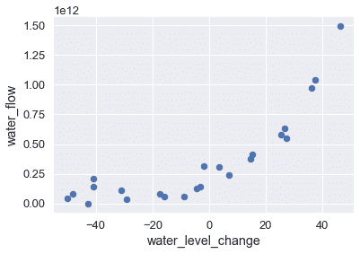
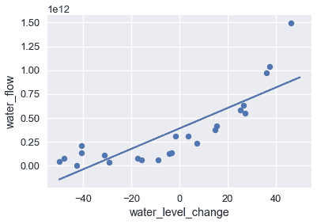
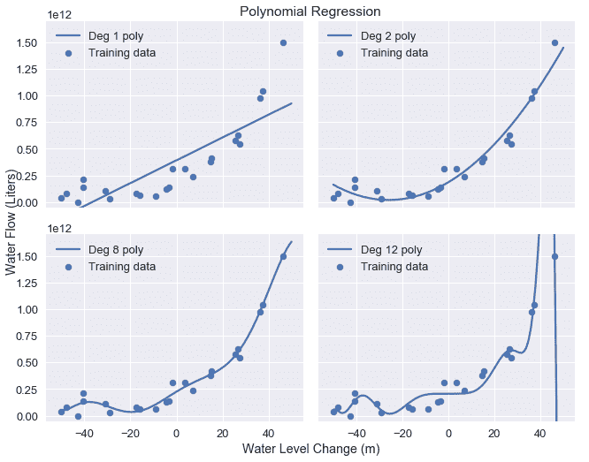

# 正则化直觉

> 原文：[https://www.textbook.ds100.org/ch/16/reg_invituation.html](https://www.textbook.ds100.org/ch/16/reg_invituation.html)

```
# HIDDEN
# Clear previously defined variables
%reset -f

# Set directory for data loading to work properly
import os
os.chdir(os.path.expanduser('~/notebooks/16'))

```

```
# HIDDEN
import warnings
# Ignore numpy dtype warnings. These warnings are caused by an interaction
# between numpy and Cython and can be safely ignored.
# Reference: https://stackoverflow.com/a/40846742
warnings.filterwarnings("ignore", message="numpy.dtype size changed")
warnings.filterwarnings("ignore", message="numpy.ufunc size changed")

import numpy as np
import matplotlib.pyplot as plt
import pandas as pd
import seaborn as sns
%matplotlib inline
import ipywidgets as widgets
from ipywidgets import interact, interactive, fixed, interact_manual
import nbinteract as nbi

sns.set()
sns.set_context('talk')
np.set_printoptions(threshold=20, precision=2, suppress=True)
pd.options.display.max_rows = 7
pd.options.display.max_columns = 8
pd.set_option('precision', 2)
# This option stops scientific notation for pandas
# pd.set_option('display.float_format', '{:.2f}'.format)

```

```
# HIDDEN
def df_interact(df, nrows=7, ncols=7):
    '''
    Outputs sliders that show rows and columns of df
    '''
    def peek(row=0, col=0):
        return df.iloc[row:row + nrows, col:col + ncols]
    if len(df.columns) <= ncols:
        interact(peek, row=(0, len(df) - nrows, nrows), col=fixed(0))
    else:
        interact(peek,
                 row=(0, len(df) - nrows, nrows),
                 col=(0, len(df.columns) - ncols))
    print('({} rows, {} columns) total'.format(df.shape[0], df.shape[1]))

```

```
# HIDDEN
df = pd.read_csv('water_large.csv')

```

```
# HIDDEN
from collections import namedtuple
Curve = namedtuple('Curve', ['xs', 'ys'])

def flatten(seq): return [item for subseq in seq for item in subseq]

def make_curve(clf, x_start=-50, x_end=50):
    xs = np.linspace(x_start, x_end, num=100)
    ys = clf.predict(xs.reshape(-1, 1))
    return Curve(xs, ys)

def plot_data(df=df, ax=plt, **kwargs):
    ax.scatter(df.iloc[:, 0], df.iloc[:, 1], s=50, **kwargs)

def plot_curve(curve, ax=plt, **kwargs):
    ax.plot(curve.xs, curve.ys, **kwargs)

def plot_curves(curves, cols=2):
    rows = int(np.ceil(len(curves) / cols))
    fig, axes = plt.subplots(rows, cols, figsize=(10, 8),
                             sharex=True, sharey=True)
    for ax, curve, deg in zip(flatten(axes), curves, degrees):
        plot_data(ax=ax, label='Training data')
        plot_curve(curve, ax=ax, label=f'Deg {deg} poly')
        ax.set_ylim(-5e10, 170e10)
        ax.legend()

    # add a big axes, hide frame
    fig.add_subplot(111, frameon=False)
    # hide tick and tick label of the big axes
    plt.tick_params(labelcolor='none', top='off', bottom='off',
                    left='off', right='off')
    plt.grid(False)
    plt.title('Polynomial Regression')
    plt.xlabel('Water Level Change (m)')
    plt.ylabel('Water Flow (Liters)')
    plt.tight_layout()

def print_coef(clf):
    reg = clf.named_steps['reg']
    print(reg.intercept_)
    print(reg.coef_)

```

```
# HIDDEN
X = df.iloc[:, [0]].as_matrix()
y = df.iloc[:, 1].as_matrix()

degrees = [1, 2, 8, 12]
clfs = [Pipeline([('poly', PolynomialFeatures(degree=deg, include_bias=False)),
                  ('reg', LinearRegression())])
        .fit(X, y)
        for deg in degrees]

curves = [make_curve(clf) for clf in clfs]

ridge_clfs = [Pipeline([('poly', PolynomialFeatures(degree=deg, include_bias=False)),
                        ('reg', Ridge(alpha=0.1, normalize=True))])
        .fit(X, y)
        for deg in degrees]

ridge_curves = [make_curve(clf) for clf in ridge_clfs]

```

我们从一个例子开始讨论正则化，这个例子说明了正则化的重要性。

## 大坝数据

以下数据集以升为单位记录某一天从大坝流出的水量，以米为单位记录该天水位的变化量。

```
# HIDDEN
df

```

|  | 水位变化 | 水流 |
| --- | --- | --- |
| 零 | -15.936758 | 6.042233E+10 号 |
| --- | --- | --- |
| 1 个 | -29.152979 年 | 3.321490E+10 型 |
| --- | --- | --- |
| 二 | 36.189549 年 | 9.727064E+11 号 |
| --- | --- | --- |
| …… | …… | ... |
| --- | --- | --- |
| 20 个 | 7.085480 | 2.363520E+11 号 |
| --- | --- | --- |
| 21 岁 | 46.282369 年 | 1.494256E+12 |
| --- | --- | --- |
| 二十二 | 14.612289 年 | 3.781463E+11 号 |
| --- | --- | --- |

23 行×2 列

绘制这些数据表明，随着水位变得更为积极，水流呈上升趋势。

```
# HIDDEN
df.plot.scatter(0, 1, s=50);

```



为了建立这个模式，我们可以使用最小二乘线性回归模型。我们在下面的图表中显示数据和模型的预测。

```
# HIDDEN
df.plot.scatter(0, 1, s=50);
plot_curve(curves[0])

```



可视化结果表明，该模型不捕获数据中的模式，模型具有很高的偏差。正如我们之前所做的，我们可以尝试通过在数据中添加多项式特征来解决这个问题。我们添加 2、8 和 12 度的多项式特征；下表显示了训练数据和每个模型的预测。

```
# HIDDEN
plot_curves(curves)

```



正如预期的那样，12 次多项式很好地匹配训练数据，但似乎也适合由噪声引起的数据中的伪模式。这提供了另一个关于偏差-方差权衡的说明：线性模型具有高偏差和低方差，而度 12 多项式具有低偏差但高方差。

## 检查系数[¶](#Examining-Coefficients)

检验 12 次多项式模型的系数，发现该模型根据以下公式进行预测：

$$ 207097470825 + 1.8x + 482.6x^2 + 601.5x^3 + 872.8x^4 + 150486.6x^5 \\ + 2156.7x^6 - 307.2x^7 - 4.6x^8 + 0.2x^9 + 0.003x^{10} - 0.00005x^{11} + 0x^{12} $$

其中$x$是当天的水位变化。

模型的系数相当大，尤其是对模型方差有显著贡献的更高阶项（例如，x^5$和 x^6$）。

## 惩罚参数[¶](#Penalizing-Parameters)

回想一下，我们的线性模型根据以下内容进行预测，其中$\theta$是模型权重，$x$是特征向量：

$$ f_\hat{\theta}(x) = \hat{\theta} \cdot x $$

为了适应我们的模型，我们将均方误差成本函数最小化，其中$x$用于表示数据矩阵，$y$用于观察结果：

$$ \begin{aligned} L(\hat{\theta}, X, y) &= \frac{1}{n} \sum_{i}(y_i - f_\hat{\theta} (X_i))^2\\ \end{aligned} $$

为了将上述成本降到最低，我们调整$\hat \theta$直到找到最佳的权重组合，而不管权重本身有多大。然而，我们发现更复杂特征的权重越大，模型方差越大。如果我们可以改变成本函数来惩罚较大的权重值，那么得到的模型将具有较低的方差。我们用正规化来增加这个惩罚。