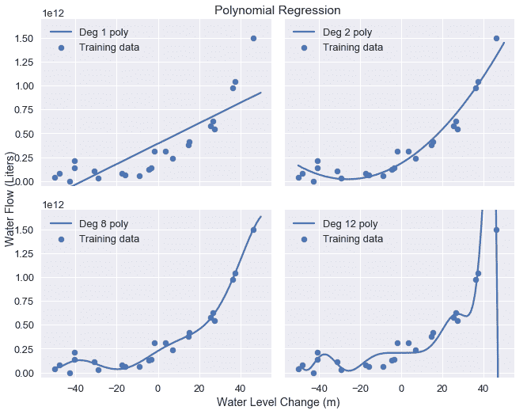
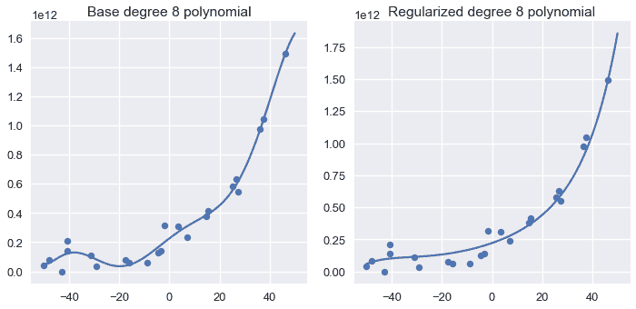
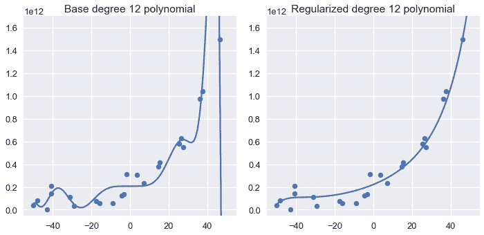
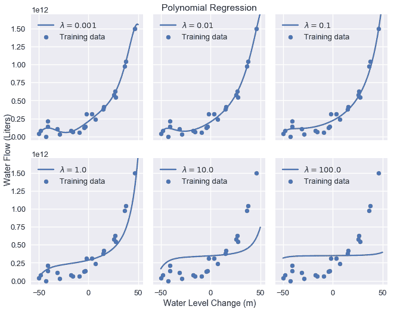

# L2 正则化：岭回归

> 原文：[https://www.bookbookmark.ds100.org/ch/16/reg_ridge.html](https://www.bookbookmark.ds100.org/ch/16/reg_ridge.html)

```
# HIDDEN
# Clear previously defined variables
%reset -f

# Set directory for data loading to work properly
import os
os.chdir(os.path.expanduser('~/notebooks/16'))

```

```
# HIDDEN
import warnings
# Ignore numpy dtype warnings. These warnings are caused by an interaction
# between numpy and Cython and can be safely ignored.
# Reference: https://stackoverflow.com/a/40846742
warnings.filterwarnings("ignore", message="numpy.dtype size changed")
warnings.filterwarnings("ignore", message="numpy.ufunc size changed")

import numpy as np
import matplotlib.pyplot as plt
import pandas as pd
import seaborn as sns
%matplotlib inline
import ipywidgets as widgets
from ipywidgets import interact, interactive, fixed, interact_manual
import nbinteract as nbi

sns.set()
sns.set_context('talk')
np.set_printoptions(threshold=20, precision=2, suppress=True)
pd.options.display.max_rows = 7
pd.options.display.max_columns = 8
pd.set_option('precision', 2)
# This option stops scientific notation for pandas
# pd.set_option('display.float_format', '{:.2f}'.format)

```

```
# HIDDEN
def df_interact(df, nrows=7, ncols=7):
    '''
    Outputs sliders that show rows and columns of df
    '''
    def peek(row=0, col=0):
        return df.iloc[row:row + nrows, col:col + ncols]
    if len(df.columns) <= ncols:
        interact(peek, row=(0, len(df) - nrows, nrows), col=fixed(0))
    else:
        interact(peek,
                 row=(0, len(df) - nrows, nrows),
                 col=(0, len(df.columns) - ncols))
    print('({} rows, {} columns) total'.format(df.shape[0], df.shape[1]))

```

```
# HIDDEN
df = pd.read_csv('water_large.csv')

```

```
# HIDDEN
from collections import namedtuple
Curve = namedtuple('Curve', ['xs', 'ys'])

def flatten(seq): return [item for subseq in seq for item in subseq]

def make_curve(clf, x_start=-50, x_end=50):
    xs = np.linspace(x_start, x_end, num=100)
    ys = clf.predict(xs.reshape(-1, 1))
    return Curve(xs, ys)

def plot_data(df=df, ax=plt, **kwargs):
    ax.scatter(df.iloc[:, 0], df.iloc[:, 1], s=50, **kwargs)

def plot_curve(curve, ax=plt, **kwargs):
    ax.plot(curve.xs, curve.ys, **kwargs)

def plot_curves(curves, cols=2, labels=None):
    if labels is None:
        labels = [f'Deg {deg} poly' for deg in degrees]
    rows = int(np.ceil(len(curves) / cols))
    fig, axes = plt.subplots(rows, cols, figsize=(10, 8),
                             sharex=True, sharey=True)
    for ax, curve, label in zip(flatten(axes), curves, labels):
        plot_data(ax=ax, label='Training data')
        plot_curve(curve, ax=ax, label=label)
        ax.set_ylim(-5e10, 170e10)
        ax.legend()

    # add a big axes, hide frame
    fig.add_subplot(111, frameon=False)
    # hide tick and tick label of the big axes
    plt.tick_params(labelcolor='none', top='off', bottom='off',
                    left='off', right='off')
    plt.grid(False)
    plt.title('Polynomial Regression')
    plt.xlabel('Water Level Change (m)')
    plt.ylabel('Water Flow (Liters)')
    plt.tight_layout()

```

```
# HIDDEN
def coefs(clf):
    reg = clf.named_steps['reg']
    return np.append(reg.intercept_, reg.coef_)

def coef_table(clf):
    vals = coefs(clf)
    return (pd.DataFrame({'Coefficient Value': vals})
            .rename_axis('degree'))

```

```
# HIDDEN
X = df.iloc[:, [0]].as_matrix()
y = df.iloc[:, 1].as_matrix()

degrees = [1, 2, 8, 12]
clfs = [Pipeline([('poly', PolynomialFeatures(degree=deg, include_bias=False)),
                  ('reg', LinearRegression())])
        .fit(X, y)
        for deg in degrees]

curves = [make_curve(clf) for clf in clfs]

alphas = [0.01, 0.1, 1.0, 10.0]

ridge_clfs = [Pipeline([('poly', PolynomialFeatures(degree=deg, include_bias=False)),
                        ('reg', RidgeCV(alphas=alphas, normalize=True))])
        .fit(X, y)
        for deg in degrees]

ridge_curves = [make_curve(clf) for clf in ridge_clfs]

```

在本节中，我们将介绍$L_2$正则化，这是一种在成本函数中惩罚大权重以降低模型方差的方法。我们简要回顾了线性回归，然后引入正则化作为对成本函数的修正。

为了进行最小二乘线性回归，我们使用以下模型：

$$ f_\hat{\theta}(x) = \hat{\theta} \cdot x $$

我们通过最小化均方误差成本函数来拟合模型：

$$ \begin{aligned} L(\hat{\theta}, X, y) &= \frac{1}{n} \sum_{i}^n(y_i - f_\hat{\theta} (X_i))^2\\ \end{aligned} $$

在上述定义中，$x$表示$n 乘以 p$数据矩阵，$x$表示$x$的一行，$y$表示观察到的结果，$that \theta$表示模型权重。

## 二级规范化定义

要将$L_2$正则化添加到模型中，我们修改上面的成本函数：

$$ \begin{aligned} L(\hat{\theta}, X, y) &= \frac{1}{n} \sum_{i}(y_i - f_\hat{\theta} (X_i))^2 + \lambda \sum_{j = 1}^{p} \hat{\theta_j}^2 \end{aligned} $$

请注意，上面的成本函数与前面的相同，加上$L_2$Regularization$\lambda\sum_j=1 ^ p \hat \theta_j ^2$term。本术语中的总和是每种型号重量的平方和，即$\Hat \Theta、\Hat \Theta、\Ldots、\Hat \Theta P。这个术语还引入了一个新的标量模型参数$\lambda$来调整正则化惩罚。

如果$\that \theta$中的值远离 0，正则化术语会导致成本增加。加入正则化后，最优模型权重将损失和正则化惩罚的组合最小化，而不是只考虑损失。由于得到的模型权重在绝对值上趋向于较小，因此该模型具有较低的方差和较高的偏差。

使用$l_2$正则化和线性模型以及均方误差成本函数，通常也被称为**岭回归**。

### 正则化参数[¶](#The-Regularization-Parameter)

正则化参数$\lambda$控制正则化惩罚。一个小的$\lambda$会导致一个小的惩罚，如果$\lambda=0$正则化术语也是$0$并且成本根本没有正则化。

一个大的$\lambda$术语会导致一个大的惩罚，因此是一个更简单的模型。增加$\lambda$会减少方差并增加模型的偏差。我们使用交叉验证来选择$\lambda$的值，以最小化验证错误。

**关于`scikit-learn`中正则化的说明：**

`scikit-learn`提供了内置正则化的回归模型。例如，要进行岭回归，可以使用[`sklearn.linear_model.Ridge`](http://scikit-learn.org/stable/modules/generated/sklearn.linear_model.Ridge.html)回归模型。注意，`scikit-learn`模型调用正则化参数`alpha`而不是$\lambda$。

`scikit-learn`方便地提供了规范化模型，这些模型执行交叉验证以选择一个好的值$\lambda$。例如，[`sklearn.linear_model.RidgeCV`](http://scikit-learn.org/stable/modules/generated/sklearn.linear_model.RidgeCV.html#sklearn.linear_model.RidgeCV)允许用户输入正则化参数值，并自动使用交叉验证来选择验证错误最小的参数值。

### 偏压项排除

注意，偏差项$\theta_$不包括在正则化项的总和中。我们不惩罚偏倚项，因为增加偏倚项不会增加模型的方差。偏倚项只会将所有预测值移动一个常量。

### 数据规范化

注意，正则化术语$\lambda\sum_j=1 ^ p \that \theta ^2$对每个\theta j 2$的惩罚是相等的。但是，每个$\hat \theta j 的效果因数据本身而异。在添加 8 次多项式特征后，考虑水流数据集的这一部分：

```
# HIDDEN
pd.DataFrame(clfs[2].named_steps['poly'].transform(X[:5]),
             columns=[f'deg_{n}_feat' for n in range(8)])

```

|  | deg_0_ 专长 | deg_1_ 专长 | …… | deg_6_ 专长 | deg_7_ 专长 |
| --- | --- | --- | --- | --- | --- |
| 零 | -15 | 二百五十三点九八 | …… | -261095791.08 元 | 4161020472.12 年 |
| --- | --- | --- | --- | --- | --- |
| 1 个 | -27.15 | 八百四十九点九零 | ... | -17897014961.65 | 521751305227.70 |
| --- | --- | --- | --- | --- | --- |
| 二 | 三十六点一九 | 1309.68 号 | ... | 81298431147.09 | 2942153527269.12 |
| --- | --- | --- | --- | --- | --- |
| 三 | 三十七点四九 | 1405.66 元 | ... | 104132296999.30 | 3904147586408.71 |
| --- | --- | --- | --- | --- | --- |
| 四 | -41.06 | 2309.65 美元 | ... | -592123531634.12 | 28456763821657.78 |
| --- | --- | --- | --- | --- | --- |

5 行×8 列

我们可以看到 7 次多项式的特征值比 1 次多项式的特征值大得多。这意味着 7 级特征的大型模型权重对预测的影响远大于 1 级特征的大型模型权重。如果我们直接对这些数据应用正则化，正则化惩罚将不成比例地降低低阶特征的模型权重。在实际应用中，由于对预测影响较大的特征不受影响，即使采用正则化，也往往导致模型方差较大。

为了解决这个问题，我们 _ 通过减去平均值并将每一列中的值缩放到-1 和 1 之间来规范化 _ 每个数据列。在`scikit-learn`中，大多数回归模型允许使用`normalize=True`进行初始化，以便在拟合前规范化数据。

另一种类似的技术是 _ 标准化 _ 数据列，方法是减去平均值并除以每个数据列的标准偏差。

## 使用岭回归

我们以前使用多项式特征来拟合 2、8 和 12 度多项式以获得水流数据。原始数据和结果模型预测在下面重复。

```
# HIDDEN
df

```

|  | 水位变化 | 水流 |
| --- | --- | --- |
| 0 | -15.94 | 60422330445.52 号 |
| --- | --- | --- |
| 1 | -29.15 | 33214896575.60 元 |
| --- | --- | --- |
| 2 | 36.19 | 972706380901.06 |
| --- | --- | --- |
| ... | ... | ... |
| --- | --- | --- |
| 20 个 | 七点零九 | 236352046523.78 个 |
| --- | --- | --- |
| 21 岁 | 四十六点二八 | 149425638186.73 |
| --- | --- | --- |
| 二十二 | 十四点六一 | 378146284247.97 美元 |
| --- | --- | --- |

23 行×2 列

```
# HIDDEN
plot_curves(curves)

```



为了进行岭回归，我们首先从数据中提取数据矩阵和结果向量：

```
X = df.iloc[:, [0]].as_matrix()
y = df.iloc[:, 1].as_matrix()
print('X: ')
print(X)
print()
print('y: ')
print(y)

```

```
X: 
[[-15.94]
 [-29.15]
 [ 36.19]
 ...
 [  7.09]
 [ 46.28]
 [ 14.61]]

y: 
[6.04e+10 3.32e+10 9.73e+11 ... 2.36e+11 1.49e+12 3.78e+11]

```

然后，我们对`X`应用 12 次多项式变换：

```
from sklearn.preprocessing import PolynomialFeatures

# We need to specify include_bias=False since sklearn's classifiers
# automatically add the intercept term.
X_poly_8 = PolynomialFeatures(degree=8, include_bias=False).fit_transform(X)
print('First two rows of transformed X:')
print(X_poly_8[0:2])

```

```
First two rows of transformed X:
[[-1.59e+01  2.54e+02 -4.05e+03  6.45e+04 -1.03e+06  1.64e+07 -2.61e+08
   4.16e+09]
 [-2.92e+01  8.50e+02 -2.48e+04  7.22e+05 -2.11e+07  6.14e+08 -1.79e+10
   5.22e+11]]

```

我们指定了`scikit-learn`将使用交叉验证从中选择的`alpha`值，然后使用`RidgeCV`分类器来匹配转换的数据。

```
from sklearn.linear_model import RidgeCV

alphas = [0.01, 0.1, 1.0, 10.0]

# Remember to set normalize=True to normalize data
clf = RidgeCV(alphas=alphas, normalize=True).fit(X_poly_8, y)

# Display the chosen alpha value:
clf.alpha_

```

```
0.1
```

最后，我们在正则化的 8 阶分类器旁边绘制基本 8 阶多项式分类器的模型预测：

```
# HIDDEN
fig = plt.figure(figsize=(10, 5))

plt.subplot(121)
plot_data()
plot_curve(curves[2])
plt.title('Base degree 8 polynomial')

plt.subplot(122)
plot_data()
plot_curve(ridge_curves[2])
plt.title('Regularized degree 8 polynomial')
plt.tight_layout()

```



我们可以看到，正则化多项式比基阶 8 多项式更平滑，并且仍然捕获了数据中的主要趋势。

比较非正则化和正则化模型的系数，发现岭回归有利于将模型权重放在较低阶多项式项上：

```
# HIDDEN
base = coef_table(clfs[2]).rename(columns={'Coefficient Value': 'Base'})
ridge = coef_table(ridge_clfs[2]).rename(columns={'Coefficient Value': 'Regularized'})

pd.options.display.max_rows = 20
display(base.join(ridge))
pd.options.display.max_rows = 7

```

|  | 底座 | 正规化 |
| --- | --- | --- |
| 度 |  |  |
| --- | --- | --- |
| 0 | 225782472111.94 美元 | 221063525725.23 |
| --- | --- | --- |
| 1 | 13115217770.78 号 | 6846139065.96 美元 |
| --- | --- | --- |
| 2 | -144725749.98 美元 | 146158037.96 号 |
| --- | --- | --- |
| 3 | -10355082.91 元 | 193090.04 年 |
| --- | --- | --- |
| 4 | 567935.23 元 | 38240.62 元 |
| --- | --- | --- |
| 5 个 | 9805.14 年 | 五百六十四点二一 |
| --- | --- | --- |
| 六 | -249.64 条 | 七点二五 |
| --- | --- | --- |
| 七 | -2.09 | 零点一八 |
| --- | --- | --- |
| 8 个 | 零点零三 | 零 |
| --- | --- | --- |

重复 12 次多项式特征的过程会得到类似的结果：

```
# HIDDEN
fig = plt.figure(figsize=(10, 5))

plt.subplot(121)
plot_data()
plot_curve(curves[3])
plt.title('Base degree 12 polynomial')
plt.ylim(-5e10, 170e10)

plt.subplot(122)
plot_data()
plot_curve(ridge_curves[3])
plt.title('Regularized degree 12 polynomial')
plt.ylim(-5e10, 170e10)
plt.tight_layout()

```



增加正则化参数会使模型变得越来越简单。下图显示了将正则化量从 0.001 增加到 100.0 的效果。

```
# HIDDEN
alphas = [0.001, 0.01, 0.1, 1.0, 10.0, 100.0]

alpha_clfs = [Pipeline([
    ('poly', PolynomialFeatures(degree=12, include_bias=False)),
    ('reg', Ridge(alpha=alpha, normalize=True))]
).fit(X, y) for alpha in alphas]

alpha_curves = [make_curve(clf) for clf in alpha_clfs]
labels = [f'$\\lambda = {alpha}$' for alpha in alphas]

plot_curves(alpha_curves, cols=3, labels=labels)

```



如我们所见，增加正则化参数会增加模型的偏差。如果我们的参数太大，模型就会变成一个常量模型，因为任何非零的模型权重都会受到严重惩罚。

## 摘要[¶](#Summary)

使用$L_2$正则化可以通过惩罚大型模型权重来调整模型偏差和方差。$L_2$最小二乘线性回归的正则化也被更常见的名称岭回归所知。使用正则化添加了一个额外的模型参数$\lambda$，我们使用交叉验证进行调整。