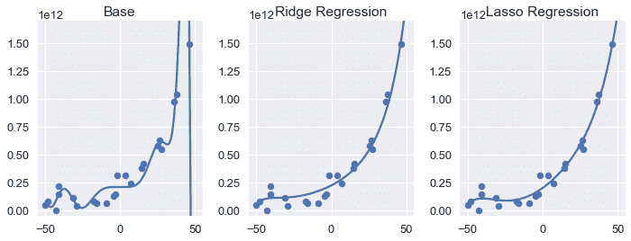

# L1 正则化：LASSO 回归

> 原文：[https://www.textbook.ds100.org/ch/16/reg_lasso.html](https://www.textbook.ds100.org/ch/16/reg_lasso.html)

```
# HIDDEN
# Clear previously defined variables
%reset -f

# Set directory for data loading to work properly
import os
os.chdir(os.path.expanduser('~/notebooks/16'))

```

```
# HIDDEN
import warnings
# Ignore numpy dtype warnings. These warnings are caused by an interaction
# between numpy and Cython and can be safely ignored.
# Reference: https://stackoverflow.com/a/40846742
warnings.filterwarnings("ignore", message="numpy.dtype size changed")
warnings.filterwarnings("ignore", message="numpy.ufunc size changed")

import numpy as np
import matplotlib.pyplot as plt
import pandas as pd
import seaborn as sns
%matplotlib inline
import ipywidgets as widgets
from ipywidgets import interact, interactive, fixed, interact_manual
import nbinteract as nbi

sns.set()
sns.set_context('talk')
np.set_printoptions(threshold=20, precision=2, suppress=True)
pd.options.display.max_rows = 7
pd.options.display.max_columns = 8
pd.set_option('precision', 2)
# This option stops scientific notation for pandas
# pd.set_option('display.float_format', '{:.2f}'.format)

```

```
# HIDDEN
def df_interact(df, nrows=7, ncols=7):
    '''
    Outputs sliders that show rows and columns of df
    '''
    def peek(row=0, col=0):
        return df.iloc[row:row + nrows, col:col + ncols]
    if len(df.columns) <= ncols:
        interact(peek, row=(0, len(df) - nrows, nrows), col=fixed(0))
    else:
        interact(peek,
                 row=(0, len(df) - nrows, nrows),
                 col=(0, len(df.columns) - ncols))
    print('({} rows, {} columns) total'.format(df.shape[0], df.shape[1]))

```

```
# HIDDEN
df = pd.read_csv('water_large.csv')

```

```
# HIDDEN
from collections import namedtuple
Curve = namedtuple('Curve', ['xs', 'ys'])

def flatten(seq): return [item for subseq in seq for item in subseq]

def make_curve(clf, x_start=-50, x_end=50):
    xs = np.linspace(x_start, x_end, num=100)
    ys = clf.predict(xs.reshape(-1, 1))
    return Curve(xs, ys)

def plot_data(df=df, ax=plt, **kwargs):
    ax.scatter(df.iloc[:, 0], df.iloc[:, 1], s=50, **kwargs)

def plot_curve(curve, ax=plt, **kwargs):
    ax.plot(curve.xs, curve.ys, **kwargs)

def plot_curves(curves, cols=2, labels=None):
    if labels is None:
        labels = [f'Deg {deg} poly' for deg in degrees]
    rows = int(np.ceil(len(curves) / cols))
    fig, axes = plt.subplots(rows, cols, figsize=(10, 8),
                             sharex=True, sharey=True)
    for ax, curve, label in zip(flatten(axes), curves, labels):
        plot_data(ax=ax, label='Training data')
        plot_curve(curve, ax=ax, label=label)
        ax.set_ylim(-5e10, 170e10)
        ax.legend()

    # add a big axes, hide frame
    fig.add_subplot(111, frameon=False)
    # hide tick and tick label of the big axes
    plt.tick_params(labelcolor='none', top='off', bottom='off',
                    left='off', right='off')
    plt.grid(False)
    plt.title('Polynomial Regression')
    plt.xlabel('Water Level Change (m)')
    plt.ylabel('Water Flow (Liters)')
    plt.tight_layout()

```

```
# HIDDEN
def coefs(clf):
    reg = clf.named_steps['reg']
    return np.append(reg.intercept_, reg.coef_)

def coef_table(clf):
    vals = coefs(clf)
    return (pd.DataFrame({'Coefficient Value': vals})
            .rename_axis('degree'))

```

```
# HIDDEN
X = df.iloc[:, [0]].as_matrix()
y = df.iloc[:, 1].as_matrix()

degrees = [1, 2, 8, 12]
clfs = [Pipeline([('poly', PolynomialFeatures(degree=deg, include_bias=False)),
                  ('reg', LinearRegression())])
        .fit(X, y)
        for deg in degrees]

curves = [make_curve(clf) for clf in clfs]

alphas = [0.1, 1.0, 10.0]

ridge_clfs = [Pipeline([('poly', PolynomialFeatures(degree=deg, include_bias=False)),
                        ('reg', RidgeCV(alphas=alphas, normalize=True))])
        .fit(X, y)
        for deg in degrees]

ridge_curves = [make_curve(clf) for clf in ridge_clfs]

lasso_clfs = [Pipeline([('poly', PolynomialFeatures(degree=deg, include_bias=False)),
                        ('reg', LassoCV(normalize=True, precompute=True, tol=0.001))])
        .fit(X, y)
        for deg in degrees]
lasso_curves = [make_curve(clf) for clf in lasso_clfs]

```

在本节中，我们将介绍$L_1$正则化，这是另一种对特性选择有用的正则化技术。

我们首先简要回顾线性回归的$L_2$正则化。我们使用模型：

$$ f_\hat{\theta}(x) = \hat{\theta} \cdot x $$

我们通过用一个额外的正则化项最小化均方误差成本函数来拟合模型：

$$ \begin{aligned} L(\hat{\theta}, X, y) &= \frac{1}{n} \sum_{i}(y_i - f_\hat{\theta} (X_i))^2 + \lambda \sum_{j = 1}^{p} \hat{\theta_j}^2 \end{aligned} $$

在上述定义中，$x$表示$n 乘以 p$数据矩阵，$x$表示$x$的一行，$y$表示观察到的结果，$hat \theta$表示模型权重，$lambda$表示正则化参数。

## 一级规范化定义

要将$L_1$正则化添加到模型中，我们修改上面的成本函数：

$$ \begin{aligned} L(\hat{\theta}, X, y) &= \frac{1}{n} \sum_{i}(y_i - f_\hat{\theta} (X_i))^2 + \lambda \sum_{j = 1}^{p} |\hat{\theta_j}| \end{aligned} $$

注意，这两个成本函数的正则化条件不同。$L_1$正则化惩罚绝对权重值之和，而不是平方值之和。

在线性模型和均方误差成本函数中使用$L_1$正则化，通常也被称为**lasso 回归**。（lasso 代表最小绝对收缩和选择运算符。）

## 比较 lasso 和 ridge 回归

为了进行 lasso 回归，我们使用了`scikit-learn`便利的[`LassoCV`](http://scikit-learn.org/stable/modules/generated/sklearn.linear_model.LassoCV.html)分类器，它是执行交叉验证以选择正则化参数的[`Lasso`](http://scikit-learn.org/stable/modules/generated/sklearn.linear_model.Lasso.html)分类器的一个版本。下面，我们显示了我们的水位变化和大坝流出水量的数据集。

```
# HIDDEN
df

```

|  | 水位变化 | 水流 |
| --- | --- | --- |
| 零 | -15 | 60422330445.52 号 |
| --- | --- | --- |
| 1 个 | -27.15 | 33214896575.60 元 |
| --- | --- | --- |
| 二 | 三十六点一九 | 972706380901.06 |
| --- | --- | --- |
| …… | …… | ... |
| --- | --- | --- |
| 20 个 | 七点零九 | 236352046523.78 个 |
| --- | --- | --- |
| 21 岁 | 四十六点二八 | 149425638186.73 |
| --- | --- | --- |
| 二十二 | 十四点六一 | 378146284247.97 美元 |
| --- | --- | --- |

23 行×2 列

由于该过程几乎与使用上一节中的`RidgeCV`分类器相同，因此我们省略了代码，而是显示下面的基阶 12 多项式、岭回归和 lasso 回归模型预测。

```
# HIDDEN
fig = plt.figure(figsize=(10, 4))

plt.subplot(131)
plot_data()
plot_curve(curves[3])
plt.title('Base')
plt.ylim(-5e10, 170e10)

plt.subplot(132)
plot_data()
plot_curve(ridge_curves[3])
plt.title('Ridge Regression')
plt.ylim(-5e10, 170e10)

plt.subplot(133)
plot_data()
plot_curve(lasso_curves[3])
plt.title('Lasso Regression')
plt.ylim(-5e10, 170e10)
plt.tight_layout()

```



我们可以看到，两个正则化模型的方差都小于基度 12 多项式。乍一看，使用$L_2$和$L_1$正则化可以生成几乎相同的模型。然而，比较岭回归和套索回归的系数，可以发现两种正则化类型之间最显著的差异：套索回归模型将若干模型权重设置为零。

```
# HIDDEN
ridge = coef_table(ridge_clfs[3]).rename(columns={'Coefficient Value': 'Ridge'})
lasso = coef_table(lasso_clfs[3]).rename(columns={'Coefficient Value': 'Lasso'})

pd.options.display.max_rows = 20
pd.set_option('display.float_format', '{:.10f}'.format)
display(ridge.join(lasso))
pd.options.display.max_rows = 7
pd.set_option('display.float_format', '{:.2f}'.format)

```

|  | 山脊 | 套索 |
| --- | --- | --- |
| 度 |  |  |
| --- | --- | --- |
| 0 | 221303288116.2275085449 | 198212062407.2835693359 |
| --- | --- | --- |
| 1 | 6953405307.7653837204 | 9655088668.0876655579 |
| --- | --- | --- |
| 2 | 142621063.9297277331 | 198852674.1646585464 |
| --- | --- | --- |
| 三 | 1893283.0567885502 年 | 0.000000 万 |
| --- | --- | --- |
| 四 | 38202.1520293704 号 | 34434.3458919188 年 |
| --- | --- | --- |
| 5 个 | 484.4262914111 号 | 975.6965959434 |
| --- | --- | --- |
| 六 | 8.1525126516 | 0.0000000000 |
| --- | --- | --- |
| 七 | 0.1197232472 | 0.0887942172 个 |
| --- | --- | --- |
| 8 个 | 0.0012506185 | 0.0000000000 |
| --- | --- | --- |
| 九 | 0.0000289599 元 | 0.0000000000 |
| --- | --- | --- |
| 10 个 | -0.000000000 万 4 | 0.0000000000 |
| --- | --- | --- |
| 11 个 | 0.0000000069 美元 | 0.0000000000 |
| --- | --- | --- |
| 12 个 | -0.00000000001 美元 | -0.000000 万 |
| --- | --- | --- |

如果您原谅上面的详细输出，您将注意到脊回归会导致所有多项式特性的非零权重。另一方面，套索回归为七个特征生成了 0 的权重。

换句话说，当进行预测时，套索回归模型完全抛弃了大部分特征。尽管如此，上面的曲线图显示，与岭回归模型相比，lasso 回归模型将做出几乎相同的预测。

## 使用 lasso 回归的功能选择[¶](#Feature-Selection-with-Lasso-Regression)

lasso 回归执行**特征选择**——它在拟合模型参数时丢弃原始特征的子集。这在处理具有许多特性的高维数据时特别有用。一个只使用少数特征进行预测的模型比一个需要大量计算的模型运行得更快。由于不需要的特征倾向于在不降低偏差的情况下增加模型方差，我们有时可以通过使用 lasso 回归选择要使用的特征子集来提高其他模型的精度。

## 实践中的套索与山脊

如果我们的目标仅仅是达到最高的预测精度，我们可以尝试两种类型的正则化，并使用交叉验证在这两种类型之间进行选择。

有时我们更喜欢一种类型的正则化而不是另一种，因为它更接近于我们正在处理的领域。例如，如果知道我们试图从许多小因素模拟结果的现象，我们可能更喜欢岭回归，因为它不会丢弃这些因素。另一方面，一些具有高度影响力的特征导致了一些结果。在这些情况下，我们更喜欢 lasso 回归，因为它将丢弃不需要的特性。

## 摘要[¶](#Summary)

使用$L_1$正则化，如$L_2$正则化，可以通过惩罚大型模型权重来调整模型偏差和方差。$L_1$最小二乘线性回归的正则化也被更常见的名称 lasso 回归所知。套索回归也可用于执行特征选择，因为它丢弃了不重要的特征。