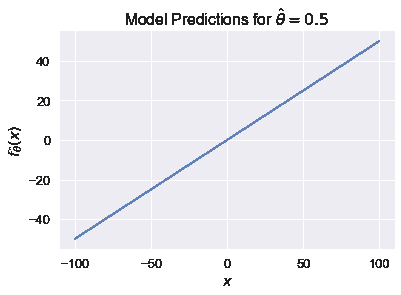
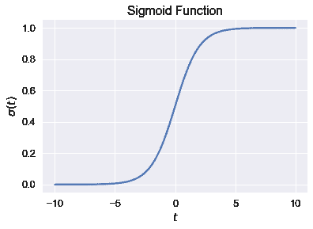
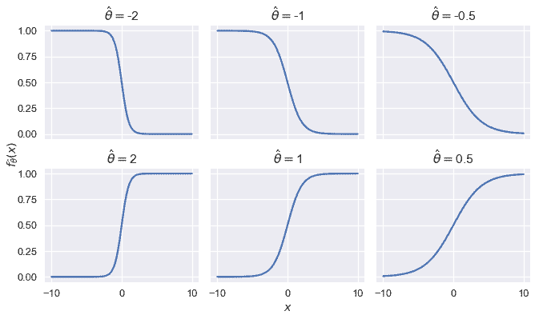

# Logistic 模型

> 原文：[https://www.bookbookmark.ds100.org/ch/17/classification_log_model.html](https://www.bookbookmark.ds100.org/ch/17/classification_log_model.html)

```
# HIDDEN
# Clear previously defined variables
%reset -f

# Set directory for data loading to work properly
import os
os.chdir(os.path.expanduser('~/notebooks/17'))

```

```
# HIDDEN
import warnings
# Ignore numpy dtype warnings. These warnings are caused by an interaction
# between numpy and Cython and can be safely ignored.
# Reference: https://stackoverflow.com/a/40846742
warnings.filterwarnings("ignore", message="numpy.dtype size changed")
warnings.filterwarnings("ignore", message="numpy.ufunc size changed")

import numpy as np
import matplotlib.pyplot as plt
import pandas as pd
import seaborn as sns
%matplotlib inline
import ipywidgets as widgets
from ipywidgets import interact, interactive, fixed, interact_manual
import nbinteract as nbi

sns.set()
sns.set_context('talk')
np.set_printoptions(threshold=20, precision=2, suppress=True)
pd.options.display.max_rows = 7
pd.options.display.max_columns = 8
pd.set_option('precision', 2)
# This option stops scientific notation for pandas
# pd.set_option('display.float_format', '{:.2f}'.format)

```

```
# HIDDEN
def df_interact(df, nrows=7, ncols=7):
    '''
    Outputs sliders that show rows and columns of df
    '''
    def peek(row=0, col=0):
        return df.iloc[row:row + nrows, col:col + ncols]
    if len(df.columns) <= ncols:
        interact(peek, row=(0, len(df) - nrows, nrows), col=fixed(0))
    else:
        interact(peek,
                 row=(0, len(df) - nrows, nrows),
                 col=(0, len(df.columns) - ncols))
    print('({} rows, {} columns) total'.format(df.shape[0], df.shape[1]))

```

```
# HIDDEN
def jitter_df(df, x_col, y_col):
    x_jittered = df[x_col] + np.random.normal(scale=0, size=len(df))
    y_jittered = df[y_col] + np.random.normal(scale=0.05, size=len(df))
    return df.assign(**{x_col: x_jittered, y_col: y_jittered})

```

```
# HIDDEN
lebron = pd.read_csv('lebron.csv')

```

在本节中，我们将介绍**逻辑模型**，这是一个用于预测概率的回归模型。

回想一下，拟合一个模型需要三个部分：一个预测模型、一个损失函数和一个优化方法。对于目前熟悉的最小二乘线性回归，我们选择模型：

$$ \begin{aligned} f_\hat{\boldsymbol{\theta}} (\textbf{x}) &= \hat{\boldsymbol{\theta}} \cdot \textbf{x} \end{aligned} $$

损失函数：

$$ \begin{aligned} L(\boldsymbol{\theta}, \textbf{X}, \textbf{y}) &= \frac{1}{n} \sum_{i}(y_i - f_\boldsymbol{\theta} (\textbf{X}_i))^2\\ \end{aligned} $$

我们使用梯度下降作为优化方法。在上面的定义中，$\textbf x$表示$n \乘以 p$的数据矩阵（$n$表示数据点的数目，$p$表示属性的数目），$\textbf x$表示一行$\textbf x，$textbf y$表示观察结果的向量。矢量$\BoldSymbol \Hat \Theta 包含最佳模型权重，而$\BoldSymbol \Theta 包含优化期间生成的中间权重值。

## 实数与概率

观察到模型$f_ \hat \\\123\123\123; \123\\123\123\125\\\\125\\123\\\123\\\\\\\\\\\\\\\\.

当$x$是一个标量时，我们可以很容易地看到这一点。如果$\hat\theta=0.5$，我们的模型将变为$f \theta（\textbf x）=0.5 x$。它的预测值可以是从负无穷大到正无穷大的任意值：

```
# HIDDEN
xs = np.linspace(-100, 100, 100)
ys = 0.5 * xs
plt.plot(xs, ys)
plt.xlabel('$x$')
plt.ylabel(r'$f_\hat{\theta}(x)$')
plt.title(r'Model Predictions for $ \hat{\theta} = 0.5 $');

```



对于分类任务，我们希望限制$f_ \hat \boldSymbol \theta（\textbf x）$以便将其输出解释为概率。这意味着它只能输出$[0，1]$范围内的值。此外，我们希望$f_ux \boldsymbol \theta（\textbf x）$的大值对应于高概率，小值对应于低概率。

## Logistic 功能[¶](#The-Logistic-Function)

为了实现这一点，我们引入了**逻辑函数**，通常称为**乙状结肠函数**：

$$ \begin{aligned} \sigma(t) = \frac{1}{1 + e^{-t}} \end{aligned} $$

为了便于阅读，我们经常将$E^X$替换为$\text exp（x）$并写下：

$$ \begin{aligned} \sigma (t) = \frac{1}{1 + \text{exp}(-t)} \end{aligned} $$

我们为下面的值$t\in[-10，10]$绘制 sigmoid 函数。

```
# HIDDEN
from scipy.special import expit
xs = np.linspace(-10, 10, 100)
ys = expit(xs)
plt.plot(xs, ys)
plt.title(r'Sigmoid Function')
plt.xlabel('$ t $')
plt.ylabel(r'$ \sigma(t) $');

```



观察 sigmoid 函数$\sigma（t）$接受任何实数$\mathbb r，只输出 0 到 1 之间的数字。函数在其输入$t$上单调递增；根据需要，$t$的大值对应于接近 1 的值。这不是巧合，虽然我们省略了简单性的推导，但 sigmoid 函数可以从概率的对数比中推导出来。

## Logistic 模型定义

我们现在可以将我们的线性模型$\hat \boldSymbol \theta \cdot\textbf x$作为 sigmoid 函数的输入来创建**逻辑模型**：

$$ \begin{aligned} f_\hat{\boldsymbol{\theta}} (\textbf{x}) = \sigma(\hat{\boldsymbol{\theta}} \cdot \textbf{x}) \end{aligned} $$

换句话说，我们将线性回归的输出取为$\mathbb r 美元中的任意数字，并使用 sigmoid 函数将模型的最终输出限制为介于 0 和 1 之间的有效概率。

为了对 Logistic 模型的行为产生一些直观的认识，我们将$x$限制为一个标量，并将 Logistic 模型的输出绘制为几个值，即$hat \theta。

```
# HIDDEN
def flatten(li): return [item for sub in li for item in sub]

thetas = [-2, -1, -0.5, 2, 1, 0.5]
xs = np.linspace(-10, 10, 100)

fig, axes = plt.subplots(2, 3, sharex=True, sharey=True, figsize=(10, 6))
for ax, theta in zip(flatten(axes), thetas):
    ys = expit(theta * xs)
    ax.plot(xs, ys)
    ax.set_title(r'$ \hat{\theta} = $' + str(theta))

# add a big axes, hide frame
fig.add_subplot(111, frameon=False)
# hide tick and tick label of the big axes
plt.tick_params(labelcolor='none', top='off', bottom='off',
                left='off', right='off')
plt.grid(False)
plt.xlabel('$x$')
plt.ylabel(r'$ f_\hat{\theta}(x) $')
plt.tight_layout()

```



我们看到，改变\θ的幅度会改变曲线的锐度；距离 0$越远，曲线的锐度就越高。翻转$\hat \theta 的符号，同时保持大小不变，相当于反映 Y 轴上的曲线。

## 摘要[¶](#Summary)

我们引入了逻辑模型，这是一个输出概率的新预测函数。为了建立模型，我们使用线性回归的输出作为非线性逻辑函数的输入。