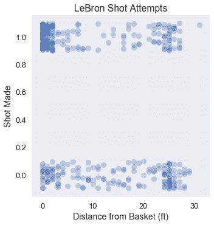
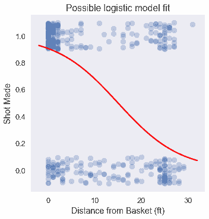

# Logistic 模型的损失函数

> 原文：[https://www.textbook.ds100.org/ch/17/classification_cost.html](https://www.textbook.ds100.org/ch/17/classification_cost.html)

```
# HIDDEN
# Clear previously defined variables
%reset -f

# Set directory for data loading to work properly
import os
os.chdir(os.path.expanduser('~/notebooks/17'))

```

```
# HIDDEN
import warnings
# Ignore numpy dtype warnings. These warnings are caused by an interaction
# between numpy and Cython and can be safely ignored.
# Reference: https://stackoverflow.com/a/40846742
warnings.filterwarnings("ignore", message="numpy.dtype size changed")
warnings.filterwarnings("ignore", message="numpy.ufunc size changed")

import numpy as np
import matplotlib.pyplot as plt
import pandas as pd
import seaborn as sns
%matplotlib inline
import ipywidgets as widgets
from ipywidgets import interact, interactive, fixed, interact_manual
import nbinteract as nbi

sns.set()
sns.set_context('talk')
np.set_printoptions(threshold=20, precision=2, suppress=True)
pd.options.display.max_rows = 7
pd.options.display.max_columns = 8
pd.set_option('precision', 2)
# This option stops scientific notation for pandas
# pd.set_option('display.float_format', '{:.2f}'.format)

```

```
# HIDDEN
def df_interact(df, nrows=7, ncols=7):
    '''
    Outputs sliders that show rows and columns of df
    '''
    def peek(row=0, col=0):
        return df.iloc[row:row + nrows, col:col + ncols]
    if len(df.columns) <= ncols:
        interact(peek, row=(0, len(df) - nrows, nrows), col=fixed(0))
    else:
        interact(peek,
                 row=(0, len(df) - nrows, nrows),
                 col=(0, len(df.columns) - ncols))
    print('({} rows, {} columns) total'.format(df.shape[0], df.shape[1]))

```

```
# HIDDEN
lebron = pd.read_csv('lebron.csv')

```

我们定义了概率的回归模型，逻辑模型：

$$ \begin{aligned} f_\hat{\boldsymbol{\theta}} (\textbf{x}) = \sigma(\hat{\boldsymbol{\theta}} \cdot \textbf{x}) \end{aligned} $$

与线性回归模型一样，该模型也有参数$\Hat \BoldSymbol \Theta$，这是一个向量，它为每个$\textbf x 的特征包含一个参数。我们现在解决的问题是为这个模型定义一个损失函数，它允许我们将模型的参数与数据相匹配。

直观地说，我们希望模型的预测与数据尽可能接近。下面，我们用每球与篮筐之间的距离，重现了勒布朗在 2017 年 NBA 季后赛中的投篮尝试。这些点在 Y 轴上抖动以减轻过度绘制。

```
# HIDDEN
np.random.seed(42)
sns.lmplot(x='shot_distance', y='shot_made',
           data=lebron,
           fit_reg=False, ci=False,
           y_jitter=0.1,
           scatter_kws={'alpha': 0.3})
plt.title('LeBron Shot Attempts')
plt.xlabel('Distance from Basket (ft)')
plt.ylabel('Shot Made');

```



注意到篮筐附近的大量投篮和篮筐远处的较小的错失投篮，我们预计此数据上的逻辑模型可能如下所示：

```
# HIDDEN
from scipy.special import expit

np.random.seed(42)
sns.lmplot(x='shot_distance', y='shot_made',
           data=lebron,
           fit_reg=False, ci=False,
           y_jitter=0.1,
           scatter_kws={'alpha': 0.3})

xs = np.linspace(-2, 32, 100)
ys = expit(-0.15 * (xs - 15))
plt.plot(xs, ys, c='r', label='Logistic model')

plt.title('Possible logistic model fit')
plt.xlabel('Distance from Basket (ft)')
plt.ylabel('Shot Made');

```



虽然我们可以像线性回归那样使用均方误差损失函数，但对于一个逻辑模型来说，它是非凸的，因此难以优化。

## 交叉熵损失

我们使用**交叉熵损失**来代替均方误差。让$\textbf x$表示 P$输入数据矩阵的$n 倍，$\textbf y$表示观测数据值的矢量，$f \boldsymbol \theta（\textbf x）$表示逻辑模型。$\BoldSymbol \Theta$包含当前参数值。使用此符号，平均交叉熵损失定义为：

$$ \begin{aligned} L(\boldsymbol{\theta}, \textbf{X}, \textbf{y}) = \frac{1}{n} \sum_i \left(- y_i \ln (f_\boldsymbol{\theta}(\textbf{X}_i)) - (1 - y_i) \ln (1 - f_\boldsymbol{\theta}(\textbf{X}_i) \right) \end{aligned} $$

您可以观察到，像往常一样，我们对数据集中的每个点取平均损失。上述总和中的内部表达式表示一个数据点的损失$（\textbf x u i，y_i）$：

$$ \begin{aligned} \ell(\boldsymbol{\theta}, \textbf{X}_i, y_i) = - y_i \ln (f_\boldsymbol{\theta}(\textbf{X}_i)) - (1 - y_i) \ln (1 - f_\boldsymbol{\theta}(\textbf{X}_i) ) \end{aligned} $$

回想一下，数据集中的每个$y_i$都是 0 或 1。如果 Y_i=0 美元，损失的第一项为零。如果 Y_i=1 美元，损失中的第二项为零。因此，对于数据集中的每个点，只有一个交叉熵损失项会导致整体损失。

假设$y_i=0$和我们的预测概率$f_uuBoldSymbol \theta（\textbf x _i）=0$我们的模型是完全正确的。这一点的损失将是：

$$ \begin{aligned} \ell(\boldsymbol{\theta}, \textbf{X}_i, y_i) &= - y_i \ln (f_\boldsymbol{\theta}(\textbf{X}_i)) - (1 - y_i) \ln (1 - f_\boldsymbol{\theta}(\textbf{X}_i) ) \\ &= - 0 - (1 - 0) \ln (1 - 0 ) \\ &= - \ln (1) \\ &= 0 \end{aligned} $$

正如预期的那样，正确预测的损失是 0 美元。您可以验证预测概率与真实值越远，损失越大。

最大限度地减少总体交叉熵损失需要模型$F_BoldSymbol \Theta（\textbf_x）$来做出最准确的预测。方便的是，该损失函数是凸的，使得梯度下降成为一种有用的优化选择。

## 交叉熵损失梯度

为了对模型的交叉熵损失进行梯度下降，必须计算损失函数的梯度。首先，我们计算 sigmoid 函数的导数，因为我们将在梯度计算中使用它。

$$ \begin{aligned} \sigma(t) &= \frac{1}{1 + e^{-t}} \\ \sigma'(t) &= \frac{e^{-t}}{(1 + e^{-t})^2} \\ \sigma'(t) &= \frac{1}{1 + e^{-t}} \cdot \left(1 - \frac{1}{1 + e^{-t}} \right) \\ \sigma'(t) &= \sigma(t) (1 - \sigma(t)) \end{aligned} $$

乙状结肠功能的导数可以方便地用乙状结肠功能本身来表示。

简而言之，我们定义了$\sigma（\textbf x u i）=\sigma（\textbf x u i \cdot \boldsymbol \theta）$。我们很快就需要.\sigma i$相对于向量.\boldsymbol \theta 的梯度，因此我们现在将使用链规则的直接应用来推导它。

$$ \begin{aligned} \nabla_{\boldsymbol{\theta}} \sigma_i &= \nabla_{\boldsymbol{\theta}} \sigma(\textbf{X}_i \cdot \boldsymbol{\theta}) \\ &= \sigma(\textbf{X}_i \cdot \boldsymbol{\theta}) (1 - \sigma(\textbf{X}_i \cdot \boldsymbol{\theta})) \nabla_{\boldsymbol{\theta}} (\textbf{X}_i \cdot \boldsymbol{\theta}) \\ &= \sigma_i (1 - \sigma_i) \textbf{X}_i \end{aligned} $$

现在，我们推导出交叉熵损失相对于模型参数$\BoldSymbol \Theta 的梯度。在下面的推导中，我们让$\sigma_i=f_ \boldsymbol \theta（\textbf x（\textbf x u i \cdot \boldsymbol \theta）$。

$$ \begin{aligned} L(\boldsymbol{\theta}, \textbf{X}, \textbf{y}) &= \frac{1}{n} \sum_i \left(- y_i \ln (f_\boldsymbol{\theta}(\textbf{X}_i)) - (1 - y_i) \ln (1 - f_\boldsymbol{\theta}(\textbf{X}_i) \right) \\ &= \frac{1}{n} \sum_i \left(- y_i \ln \sigma_i - (1 - y_i) \ln (1 - \sigma_i) \right) \\ \nabla_{\boldsymbol{\theta}} L(\boldsymbol{\theta}, \textbf{X}, \textbf{y}) &= \frac{1}{n} \sum_i \left( - \frac{y_i}{\sigma_i} \nabla_{\boldsymbol{\theta}} \sigma_i + \frac{1 - y_i}{1 - \sigma_i} \nabla_{\boldsymbol{\theta}} \sigma_i \right) \\ &= - \frac{1}{n} \sum_i \left( \frac{y_i}{\sigma_i} - \frac{1 - y_i}{1 - \sigma_i} \right) \nabla_{\boldsymbol{\theta}} \sigma_i \\ &= - \frac{1}{n} \sum_i \left( \frac{y_i}{\sigma_i} - \frac{1 - y_i}{1 - \sigma_i} \right) \sigma_i (1 - \sigma_i) \textbf{X}_i \\ &= - \frac{1}{n} \sum_i \left( y_i - \sigma_i \right) \textbf{X}_i \\ \end{aligned} $$

令人惊讶的简单梯度表达式允许我们使用梯度下降将逻辑模型拟合到交叉熵损失：

$$ \hat{\boldsymbol{\theta}} = \displaystyle\arg \min_{\substack{\boldsymbol{\theta}}} L(\boldsymbol{\theta}, \textbf{X}, \textbf{y})$$

第 17.6 节探讨了批量、随机和小批量梯度下降的更新公式。

## 摘要[¶](#Summary)

由于交叉熵损失函数是凸的，因此我们使用梯度下降将其最小化，以使逻辑模型适合数据。我们现在有了逻辑回归的必要组成部分：模型、损失函数和最小化过程。在第 17.5 节中，我们更详细地了解了为什么我们使用平均交叉熵损失进行逻辑回归。