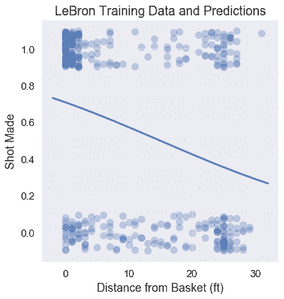

# 使用逻辑回归

> 原文：[https://www.textbook.ds100.org/ch/17/classification_log_reg.html](https://www.textbook.ds100.org/ch/17/classification_log_reg.html)

```
# HIDDEN
# Clear previously defined variables
%reset -f

# Set directory for data loading to work properly
import os
os.chdir(os.path.expanduser('~/notebooks/17'))

```

```
# HIDDEN
import warnings
# Ignore numpy dtype warnings. These warnings are caused by an interaction
# between numpy and Cython and can be safely ignored.
# Reference: https://stackoverflow.com/a/40846742
warnings.filterwarnings("ignore", message="numpy.dtype size changed")
warnings.filterwarnings("ignore", message="numpy.ufunc size changed")

import numpy as np
import matplotlib.pyplot as plt
import pandas as pd
import seaborn as sns
%matplotlib inline
import ipywidgets as widgets
from ipywidgets import interact, interactive, fixed, interact_manual
import nbinteract as nbi

sns.set()
sns.set_context('talk')
np.set_printoptions(threshold=20, precision=2, suppress=True)
pd.options.display.max_rows = 7
pd.options.display.max_columns = 8
pd.set_option('precision', 2)
# This option stops scientific notation for pandas
# pd.set_option('display.float_format', '{:.2f}'.format)

```

```
# HIDDEN
def df_interact(df, nrows=7, ncols=7):
    '''
    Outputs sliders that show rows and columns of df
    '''
    def peek(row=0, col=0):
        return df.iloc[row:row + nrows, col:col + ncols]
    if len(df.columns) <= ncols:
        interact(peek, row=(0, len(df) - nrows, nrows), col=fixed(0))
    else:
        interact(peek,
                 row=(0, len(df) - nrows, nrows),
                 col=(0, len(df.columns) - ncols))
    print('({} rows, {} columns) total'.format(df.shape[0], df.shape[1]))

```

```
# HIDDEN
from scipy.optimize import minimize as sci_min
def minimize(cost_fn, grad_cost_fn, X, y, progress=True):
    '''
    Uses scipy.minimize to minimize cost_fn using a form of gradient descent.
    '''
    theta = np.zeros(X.shape[1])
    iters = 0

    def objective(theta):
        return cost_fn(theta, X, y)
    def gradient(theta):
        return grad_cost_fn(theta, X, y)
    def print_theta(theta):
        nonlocal iters
        if progress and iters % progress == 0:
            print(f'theta: {theta} | cost: {cost_fn(theta, X, y):.2f}')
        iters += 1

    print_theta(theta)
    return sci_min(
        objective, theta, method='BFGS', jac=gradient, callback=print_theta,
        tol=1e-7
    ).x

```

我们已经开发了逻辑回归的所有组件。首先，用于预测概率的逻辑模型：

$$ \begin{aligned} f_\hat{\boldsymbol{\theta}} (\textbf{x}) = \sigma(\hat{\boldsymbol{\theta}} \cdot \textbf{x}) \end{aligned} $$

然后，交叉熵损失函数：

$$ \begin{aligned} L(\boldsymbol{\theta}, \textbf{X}, \textbf{y}) = &= \frac{1}{n} \sum_i \left(- y_i \ln \sigma_i - (1 - y_i) \ln (1 - \sigma_i ) \right) \\ \end{aligned} $$

最后，梯度下降的交叉熵损失的梯度：

$$ \begin{aligned} \nabla_{\boldsymbol{\theta}} L(\boldsymbol{\theta}, \textbf{X}, \textbf{y}) &= - \frac{1}{n} \sum_i \left( y_i - \sigma_i \right) \textbf{X}_i \\ \end{aligned} $$

在上面的表达式中，我们让$\textbf \x；$表示 p$输入数据矩阵的$n 乘以 p$输入值，$\textbf \123\ \，$\textbf \，$\textbf \123\123 123 123 123 123 \ 123 \ \123 \\\\Thet 公司 A 美元。简而言之，我们定义了$\sigma \boldsymbol \theta（\textbf x u i）=\sigma（\textbf x u i \cdot \hat \boldsymbol \theta）。

## 勒布朗射门的逻辑回归

现在让我们回到本章开头所面临的问题：预测勒布朗·詹姆斯将要投哪一球。我们从加载勒布朗在 2017 年 NBA 季后赛中拍摄的照片开始。

```
lebron = pd.read_csv('lebron.csv')
lebron

```

|  | 游戏日期 | 分钟 | 对手 | 动作类型 | 镜头类型 | 射击距离 | 拍摄 |
| --- | --- | --- | --- | --- | --- | --- | --- |
| 零 | 20170415 年 | 10 个 | 因德 | 驾驶上篮得分 | 2pt 现场目标 | 零 | 0 |
| --- | --- | --- | --- | --- | --- | --- | --- |
| 1 个 | 20170415 | 11 个 | IND | Driving Layup Shot | 2PT Field Goal | 0 | 1 个 |
| --- | --- | --- | --- | --- | --- | --- | --- |
| 二 | 20170415 | 十四 | IND | 上篮得分 | 2PT Field Goal | 0 | 1 |
| --- | --- | --- | --- | --- | --- | --- | --- |
| …… | …… | ... | ... | ... | ... | ... | ... |
| --- | --- | --- | --- | --- | --- | --- | --- |
| 三百八十一 | 20170612 年 | 46 岁 | GSW | Driving Layup Shot | 2PT Field Goal | 1 | 1 |
| --- | --- | --- | --- | --- | --- | --- | --- |
| 382 个 | 20170612 | 47 岁 | GSW | 后仰跳投 | 2PT Field Goal | 14 | 0 |
| --- | --- | --- | --- | --- | --- | --- | --- |
| 三百八十三 | 20170612 | 48 岁 | GSW | Driving Layup Shot | 2PT Field Goal | 二 | 1 |
| --- | --- | --- | --- | --- | --- | --- | --- |

384 行×7 列

我们在下面包含了一个小部件，允许您浏览整个数据帧。

```
df_interact(lebron)

```

<button class="js-nbinteract-widget">Loading widgets...</button>

```
(384 rows, 7 columns) total

```

我们首先只使用拍摄距离来预测拍摄是否进行。`scikit-learn`方便地提供了一个逻辑回归分类器作为[`sklearn.linear_model.LogisticRegression`](http://scikit-learn.org/stable/modules/generated/sklearn.linear_model.LogisticRegression.html)类。为了使用这个类，我们首先创建数据矩阵`X`和观察结果向量`y`。

```
X = lebron[['shot_distance']].as_matrix()
y = lebron['shot_made'].as_matrix()
print('X:')
print(X)
print()
print('y:')
print(y)

```

```
X:
[[ 0]
 [ 0]
 [ 0]
 ...
 [ 1]
 [14]
 [ 2]]

y:
[0 1 1 ... 1 0 1]

```

按照惯例，我们将数据分成一个训练集和一个测试集。

```
from sklearn.model_selection import train_test_split

X_train, X_test, y_train, y_test = train_test_split(
    X, y, test_size=40, random_state=42
)
print(f'Training set size: {len(y_train)}')
print(f'Test set size: {len(y_test)}')

```

```
Training set size: 344
Test set size: 40

```

`scikit-learn`使初始化分类器并将其安装在`X_train`和`y_train`上变得简单：

```
from sklearn.linear_model import LogisticRegression
simple_clf = LogisticRegression()
simple_clf.fit(X_train, y_train)

```

```
LogisticRegression(C=1.0, class_weight=None, dual=False, fit_intercept=True,
          intercept_scaling=1, max_iter=100, multi_class='ovr', n_jobs=1,
          penalty='l2', random_state=None, solver='liblinear', tol=0.0001,
          verbose=0, warm_start=False)
```

为了可视化分类器的性能，我们绘制了原始点和分类器的预测概率。

```
# HIDDEN 
np.random.seed(42)
sns.lmplot(x='shot_distance', y='shot_made',
           data=lebron,
           fit_reg=False, ci=False,
           y_jitter=0.1,
           scatter_kws={'alpha': 0.3})

xs = np.linspace(-2, 32, 100)
ys = simple_clf.predict_proba(xs.reshape(-1, 1))[:, 1]
plt.plot(xs, ys)

plt.title('LeBron Training Data and Predictions')
plt.xlabel('Distance from Basket (ft)')
plt.ylabel('Shot Made');

```



## 正在评估分类器[¶](#Evaluating-the-Classifier)

评估分类器有效性的一种方法是检查其预测精度：它正确预测的点数比例是多少？

```
simple_clf.score(X_test, y_test)

```

```
0.6
```

我们的分类器在测试集上实现了相当低的精度 0.60。如果我们的分类器只是随机地猜测每个点，那么我们期望精度为 0.50。事实上，如果我们的分类器简单地预测到 Lebron 的每一次射门都会成功，我们也会得到 0.60 的准确度：

```
# Calculates the accuracy if we always predict 1
np.count_nonzero(y_test == 1) / len(y_test)

```

```
0.6
```

对于这个分类器，我们只使用了几个可能的特性中的一个。在多变量线性回归中，我们可能通过合并更多的特征来实现更精确的分类器。

## 多变量逻辑回归

在我们的分类器中合并更多的数字特性就如同从`lebron`数据帧中提取额外的列到`X`矩阵中一样简单。另一方面，结合分类特征需要我们应用一个热编码。在下面的代码中，我们使用`minute`、`opponent`、`action_type`和`shot_type`功能增强了分类器，使用`scikit-learn`中的`DictVectorizer`类对分类变量应用一个热编码。

```
from sklearn.feature_extraction import DictVectorizer

columns = ['shot_distance', 'minute', 'action_type', 'shot_type', 'opponent']
rows = lebron[columns].to_dict(orient='row')

onehot = DictVectorizer(sparse=False).fit(rows)
X = onehot.transform(rows)
y = lebron['shot_made'].as_matrix()

X.shape

```

```
(384, 42)
```

我们将再次将数据分为训练集和测试集：

```
X_train, X_test, y_train, y_test = train_test_split(
    X, y, test_size=40, random_state=42
)
print(f'Training set size: {len(y_train)}')
print(f'Test set size: {len(y_test)}')

```

```
Training set size: 344
Test set size: 40

```

最后，我们再次调整模型并检查其准确性：

```
clf = LogisticRegression()
clf.fit(X_train, y_train)
print(f'Test set accuracy: {clf.score(X_test, y_test)}')

```

```
Test set accuracy: 0.725

```

这个分类器比只考虑射击距离的分类器精确 12%左右。在第 17.7 节中，我们探讨了用于评估分类器性能的其他指标。

## 摘要[¶](#Summary)

我们开发了使用逻辑回归进行分类所需的数学和计算机制。逻辑回归因其预测简单有效而得到广泛应用。