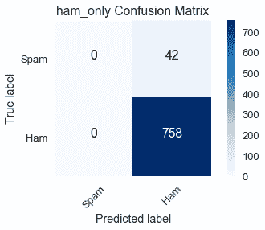
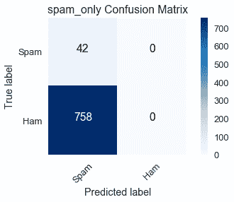
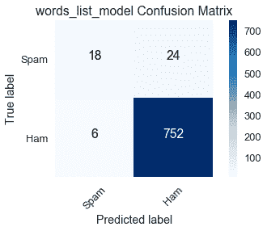
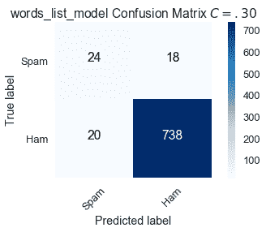
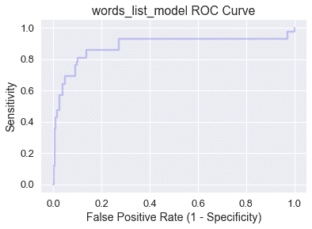
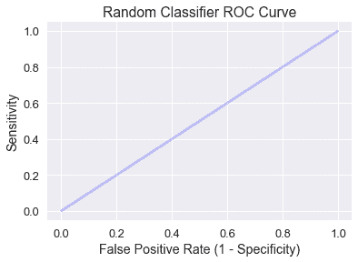
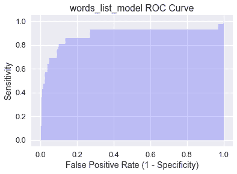

# 评估 Logistic 模型

> 原文：[https://www.bookbookmark.ds100.org/ch/17/classification_sensitivity_specificity.html](https://www.bookbookmark.ds100.org/ch/17/classification_sensitivity_specificity.html)

```
# HIDDEN
# Clear previously defined variables
%reset -f

# Set directory for data loading to work properly
import os
os.chdir(os.path.expanduser('~/notebooks/17'))

```

```
# HIDDEN
import warnings
# Ignore numpy dtype warnings. These warnings are caused by an interaction
# between numpy and Cython and can be safely ignored.
# Reference: https://stackoverflow.com/a/40846742
warnings.filterwarnings("ignore", message="numpy.dtype size changed")
warnings.filterwarnings("ignore", message="numpy.ufunc size changed")

import numpy as np
import matplotlib.pyplot as plt
import pandas as pd
import seaborn as sns
%matplotlib inline
import ipywidgets as widgets
from ipywidgets import interact, interactive, fixed, interact_manual
import nbinteract as nbi

sns.set()
sns.set_context('talk')
np.set_printoptions(threshold=20, precision=2, suppress=True)
pd.options.display.max_rows = 7
pd.options.display.max_columns = 8
pd.set_option('precision', 2)
# This option stops scientific notation for pandas
# pd.set_option('display.float_format', '{:.2f}'.format)

```

```
# HIDDEN

from sklearn.feature_extraction import DictVectorizer
from sklearn.model_selection import train_test_split
from sklearn.linear_model import LogisticRegression
from sklearn.metrics import confusion_matrix

emails=pd.read_csv('selected_emails.csv', index_col=0)

```

```
# HIDDEN

def words_in_texts(words, texts):
    '''
    Args:
        words (list-like): words to find
        texts (Series): strings to search in

    Returns:
        NumPy array of 0s and 1s with shape (n, p) where n is the
        number of texts and p is the number of words.
    '''
    indicator_array = np.array([texts.str.contains(word) * 1 for word in words]).T

    # YOUR CODE HERE
    return indicator_array

```

虽然我们在前面的章节中使用分类准确度来评估我们的 Logistic 模型，但是仅使用准确度就有一些严重的缺陷，我们在这一章节中对此进行了探讨。为了解决这些问题，我们引入了一个更有用的度量来评估分类器性能：曲线下面积（AUC）度量。

假设我们有一个 1000 封邮件的数据集，它们被标记为垃圾邮件或火腿（不是垃圾邮件），我们的目标是建立一个分类器，将未来的垃圾邮件与火腿电子邮件区分开来。数据包含在下面显示的`emails`数据框中：

```
emails

```

|  | 身体 | 垃圾邮件 |
| --- | --- | --- |
| 零 | \嗨，伙计们，我一直在尝试设置 bu… | 零 |
| --- | --- | --- |
| 1 个 | 哈哈。我想她不想让每个人都知道… | 0 |
| --- | --- | --- |
| 二 | 这篇来自 nytimes.com 的文章已发送… | 0 |
| --- | --- | --- |
| …… | …… | ... |
| --- | --- | --- |
| 997 年 | &lt；html&gt；\n&lt；head&gt；\n&lt；meta http equiv=“conten…” | 1 个 |
| --- | --- | --- |
| 九百九十八 | &lt；html&gt；\n&lt；head&gt；\n&lt；/head&gt；\n&lt；body&gt；\n\n&lt；cente… | 1 |
| --- | --- | --- |
| 999 个 | \ n&lt；html&gt；\n\n&lt；head&gt；\n&lt；meta http equiv=3d“合作… | 1 |
| --- | --- | --- |

1000 行×2 列

每一行包含`body`列中的电子邮件正文和`spam`列中的垃圾邮件指示器，如果电子邮件是 ham，则为`0`，如果是垃圾邮件，则为`1`。

让我们比较三种不同分类器的性能：

*   `ham_only`：将每个电子邮件标记为 ham。
*   `spam_only`：将每封电子邮件标记为垃圾邮件。
*   `words_list_model`：根据电子邮件正文中的某些词预测“ham”或“spam”。

假设我们有一个单词列表`words_list`我们认为在垃圾邮件中很常见：“请”、“点击”、“钱”、“生意”和“删除”。我们使用以下过程构造`words_list_model`：如果`words_list`中的$i$th 字包含在电子邮件正文中，则通过将向量的$i$th 项设置为 1，否则设置为 0，将每个电子邮件转换为特征向量。例如，使用我们选择的五个字和电子邮件正文“请通过 Tomo 删除”。rrow“，特征向量将为$[1，0，0，0，1]$。此过程生成`1000 X 5`功能矩阵$\textbf x$。

下面的代码块显示分类器的精度。为了简洁起见，省略了模型创建和培训。

```
# HIDDEN

words_list = ['please', 'click', 'money', 'business', 'remove']

X = pd.DataFrame(words_in_texts(words_list, emails['body'].str.lower())).as_matrix()
y = emails['spam'].as_matrix()

# Train-test split
X_train, X_test, y_train, y_test = train_test_split(
    X, y, random_state=41, test_size=0.2
)

#Fit the model
words_list_model = LogisticRegression(fit_intercept=True)
words_list_model.fit(X_train, y_train)

y_prediction_words_list = words_list_model.predict(X_test)
y_prediction_ham_only = np.zeros(len(y_test))
y_prediction_spam_only = np.ones(len(y_test))

```

```
from sklearn.metrics import accuracy_score

# Our selected words
words_list = ['please', 'click', 'money', 'business']

print(f'ham_only test set accuracy: {np.round(accuracy_score(y_prediction_ham_only, y_test), 3)}')
print(f'spam_only test set accuracy: {np.round(accuracy_score(y_prediction_spam_only, y_test), 3)}')
print(f'words_list_model test set accuracy: {np.round(accuracy_score(y_prediction_words_list, y_test), 3)}')

```

```
ham_only test set accuracy: 0.96
spam_only test set accuracy: 0.04
words_list_model test set accuracy: 0.96

```

使用`words_list_model`可以正确分类 96%的测试集电子邮件。虽然这一精确度似乎很高，但通过简单地将所有东西标记为火腿，HTG1 达到了同样的精确度。这是值得关注的原因，因为数据表明我们完全可以在没有垃圾邮件过滤器的情况下做得同样好。

正如上述精度所示，仅模型精度就可能是模型性能的误导性指标。我们可以使用**混淆矩阵**更深入地理解模型的预测。二元分类器的混淆矩阵是一个二乘二的 heatmap，它包含一个轴上的模型预测和另一个轴上的实际标签。

混淆矩阵中的每个条目表示分类器的可能结果。如果将垃圾邮件输入到分类器，则有两种可能的结果：

*   **真阳性**（左上角的条目）：模型用阳性类（spam）正确地标记了它。
*   **false negative**（右上角的条目）：模型将其错误地标记为负类（ham），但它确实属于正类（spam）。在我们的例子中，一个错误的否定意味着一封垃圾邮件被错误地标记为火腿，并最终进入收件箱。

同样，如果一封火腿电子邮件被输入到分类器，有两种可能的结果。

*   **假阳性**（左下角的条目）：模型用阳性类（spam）误导了它，但它确实属于阴性类（ham）。在我们的例子中，假阳性意味着一封火腿电子邮件会被标记为垃圾邮件并从收件箱中过滤掉。
*   **真负**（右下角输入）：模型正确地用负类（ham）标记它。

假阳性和假阴性的成本取决于情况。对于电子邮件分类，误报会导致重要的电子邮件被过滤掉，因此它们比误报更糟糕，因为垃圾邮件会在收件箱中结束。然而，在医疗环境中，诊断测试中的假阴性比假阳性更为重要。

我们将使用 Scikit Learn 的[混淆矩阵函数](http://scikit-learn.org/stable/modules/generated/sklearn.metrics.confusion_matrix.html#sklearn.metrics.confusion_matrix)为训练数据集上的三个模型构造混淆矩阵。`ham_only`混淆矩阵如下：

```
# HIDDEN

def plot_confusion_matrix(cm, classes,
                          normalize=False,
                          title='Confusion matrix',
                          cmap=plt.cm.Blues):
    """
    This function prints and plots the confusion matrix.
    Normalization can be applied by setting `normalize=True`.
    """
    import itertools
    if normalize:
        cm = cm.astype('float') / cm.sum(axis=1)[:, np.newaxis]
#         print("Normalized confusion matrix")
#     else:
#         print('Confusion matrix, without normalization')

#     print(cm)

    plt.imshow(cm, interpolation='nearest', cmap=cmap)
    plt.title(title)
    plt.colorbar()
    tick_marks = np.arange(len(classes))
    plt.xticks(tick_marks, classes, rotation=45)
    plt.yticks(tick_marks, classes)

    fmt = '.2f' if normalize else 'd'
    thresh = cm.max() / 2.
    for i, j in itertools.product(range(cm.shape[0]), range(cm.shape[1])):
        plt.text(j, i, format(cm[i, j], fmt),
                 horizontalalignment="center",
                 color="white" if cm[i, j] > thresh else "black")

    plt.tight_layout()
    plt.ylabel('True label')
    plt.xlabel('Predicted label')
    plt.grid(False)

ham_only_y_pred = np.zeros(len(y_train))
spam_only_y_pred = np.ones(len(y_train))
words_list_model_y_pred = words_list_model.predict(X_train)

```

```
from sklearn.metrics import confusion_matrix

class_names = ['Spam', 'Ham']

ham_only_cnf_matrix = confusion_matrix(y_train, ham_only_y_pred, labels=[1, 0])

plot_confusion_matrix(ham_only_cnf_matrix, classes=class_names,
                      title='ham_only Confusion Matrix')

```



将一行中的数量相加表示培训数据集中有多少电子邮件属于相应的类：

*   真标签=垃圾邮件（第一行）：真阳性（0）和假阴性（42）的总和显示培训数据集中有 42 封垃圾邮件。
*   真标签=ham（第二行）：假阳性（0）和真阴性（758）的总和显示训练数据集中有 758 封 ham 电子邮件。

对列中的数量求和表示分类器在相应类中预测的电子邮件数：

*   预测标签=垃圾邮件（第一列）：真阳性（0）和假阳性（0）的总和显示`ham_only`预测培训数据集中有 0 封垃圾邮件。
*   预测标签=ham（第二列）：假阴性（42）和真阴性（758）的总和显示`ham_only`预测培训数据集中有 800 封 ham 电子邮件。

我们可以看到`ham_only`的高精度为$左（\frac 758 800 \约 95 右）$因为在总共 800 封电子邮件中，培训数据集中有 758 封 HAM 电子邮件。

```
spam_only_cnf_matrix = confusion_matrix(y_train, spam_only_y_pred, labels=[1, 0])

plot_confusion_matrix(spam_only_cnf_matrix, classes=class_names,
                      title='spam_only Confusion Matrix')

```



另一个极端是，`spam_only`预测训练数据集没有 ham 电子邮件，混淆矩阵显示这与 758 个误报的事实相差甚远。

我们的主要兴趣是`words_list_model`的混淆矩阵：

```
words_list_model_cnf_matrix = confusion_matrix(y_train, words_list_model_y_pred, labels=[1, 0])

plot_confusion_matrix(words_list_model_cnf_matrix, classes=class_names,
                      title='words_list_model Confusion Matrix')

```



行总数与预期的`ham_only`和`spam_only`混淆矩阵相匹配，因为训练数据集中的真实标签对所有模型都是不变的。

在 42 封垃圾邮件中，`words_list_model`正确地分类了 18 封，这是一个糟糕的性能。它的高精度受到大量真实否定的支持，但这是不够的，因为它不符合可靠过滤垃圾邮件的目的。

此电子邮件数据集是**类不平衡数据集**的一个示例，其中绝大多数标签属于一个类而不是另一个类。在这种情况下，我们的大多数电子邮件都是火腿。另一个常见的阶级失衡的例子是，当一个群体的疾病发生频率较低时，疾病检测。一项医学测试总是得出这样的结论：病人没有这种疾病会有很高的准确性，因为大多数病人确实没有这种疾病，但是它无法识别出患有这种疾病的人，这就使得它毫无用处。

我们现在转向敏感性和特异性，这两个指标更适合评估类不平衡数据集。

### 灵敏度[¶](#Sensitivity)

**灵敏度**（也称为**真阳性率**）测量属于分类器正确标记的阳性类的数据比例。

$$ \text{Sensitivity} = \frac{TP}{TP + FN} $$

从我们对混淆矩阵的讨论中，您应该将表达式$tp+fn$识别为第一行中条目的总和，它等于数据集中属于正类的实际数据点数量。使用混淆矩阵可以很容易地比较模型的敏感性：

*   `ham_only`：$\frac 0 0+42=0$
*   `spam_only`：$\frac 42 42+0=1$
*   `words_list_model`：$\frac 18 18+24 \约 429$

因为`ham_only`没有真阳性，所以它的灵敏度值可能是 0。另一方面，`spam_only`的准确度非常低，但它的灵敏度值可能是 1，因为它正确地标记了所有垃圾邮件。`words_list_model`的低敏感度表明它经常无法标记垃圾邮件；然而，它的表现明显优于`ham_only`。

### 特异性

**特异性**（也称为**真负率**）测量属于分类器正确标记的负类的数据比例。

$$ \text{Specificity} = \frac{TN}{TN + FP} $$

表达式$tn+fp$等于数据集中属于负类的实际数据点数。同样，混淆矩阵有助于比较模型的特性：

*   `ham_only`：$\frac 758 758+0=1$
*   `spam_only`：$\frac 0 0+758=0$
*   `words_list_model`：$\frac 752 752+6 \约 992$

与敏感性一样，最差和最好的特异性分别为 0 和 1。注意，`ham_only`有最好的特异性和最差的敏感性，而`spam_only`有最差的特异性和最好的敏感性。由于这些模型只预测一个标签，它们将错误分类另一个标签的所有实例，这反映在极端的敏感性和特异性值中。对于`words_list_model`来说，差距要小得多。

虽然敏感性和特异性似乎描述了分类器的不同特征，但我们使用分类阈值在这两个指标之间建立了重要的联系。

### 分类阈值[¶](#Classification-Threshold)

**分类阈值**是一个值，用于确定将数据点分配给什么类；位于阈值两侧的点用不同的类进行标记。回想一下，逻辑回归输出数据点属于正类的概率。如果此概率大于阈值，则数据点标记为正类，如果低于阈值，则数据点标记为负类。对于我们的例子，让$F_ \那\ theta 作为逻辑模型，让$C$作为阈值。如果$F_ \Theta（x）&gt；C$标记，$X$标记为垃圾邮件；如果$F \Theta（x）&lt；C$标记，$X$标记为火腿。SciKit Learn 通过默认为负类打破了联系，因此如果$f \that \theta（x）=c$，$x$标记为 ham。

我们可以通过创建一个混淆矩阵，用分类阈值$C$来评估模型的性能。本节前面显示的`words_list_model`混淆矩阵使用 SciKit 学习的默认阈值$C=0.50$。

将阈值提高到$C=0.70 美元，这意味着如果概率$F \that \theta（x）$大于.70，我们会将电子邮件$X$标记为垃圾邮件，从而导致以下混淆矩阵：

```
# HIDDEN

words_list_prediction_probabilities = words_list_model.predict_proba(X_train)[:, 1]

words_list_predictions = [1 if pred >= .70 else 0 for pred in words_list_prediction_probabilities]

high_classification_threshold = confusion_matrix(y_train, words_list_predictions, labels=[1, 0])

plot_confusion_matrix(high_classification_threshold, classes=class_names,
                      title='words_list_model Confusion Matrix $C = .70$')

```


通过提高将电子邮件分类为垃圾邮件的标准，13 封正确分类为$C=.50$的垃圾邮件现在被贴错标签。

$$ \text{Sensitivity } (C = .70) = \frac{5}{42} \approx .119 \\ \text{Specificity } (C = .70) = \frac{757}{758} \approx .999 $$

与默认值相比，更高的阈值$C=.70$增加了特异性，但降低了敏感性。

将阈值降低到$C=0.30 美元，这意味着如果概率$F \that \theta（x）$大于.30，我们会将电子邮件$X$标记为垃圾邮件，从而导致以下混淆矩阵：

```
# HIDDEN
words_list_predictions = [1 if pred >= .30 else 0 for pred in words_list_prediction_probabilities]

low_classification_threshold = confusion_matrix(y_train, words_list_predictions, labels=[1, 0])

plot_confusion_matrix(low_classification_threshold, classes=class_names,
                      title='words_list_model Confusion Matrix $C = .30$')

```



通过降低将电子邮件分类为垃圾邮件的标准，6 封错误标记为$C=.50$的垃圾邮件现在是正确的。然而，有更多的误报。

$$ \text{Sensitivity } (C = .30) = \frac{24}{42} \approx .571 \\ \text{Specificity } (C = .30) = \frac{738}{758} \approx .974 $$

与默认值相比，较低的阈值$C=.30$增加了敏感性，但降低了特异性。

我们通过改变分类阈值来调整模型的敏感性和特异性。尽管我们努力最大限度地提高敏感性和特异性，但从用不同分类阈值创建的混淆矩阵中可以看出，存在一种权衡。敏感性增加导致特异性降低，反之亦然。

### ROC 曲线

我们可以计算 0 到 1 之间所有分类阈值的敏感性和特异性值，并绘制它们。每个阈值$c$与一对（敏感性、特异性）相关。**ROC（接收器工作特性）曲线**是对这一想法的一个细微修改；它不是绘制（敏感性、特异性）曲线，而是绘制（敏感性、1-特异性）对，其中 1-特异性被定义为假阳性率。

$$ \text{False Positive Rate } = 1 - \frac{TN}{TN + FP} = \frac{TN + FP - TN}{TN + FP} = \frac{FP}{TN + FP} $$

ROC 曲线上的一个点表示与特定阈值相关的灵敏度和假阳性率。

使用 SciKit Learn 的[roc 曲线函数](http://scikit-learn.org/stable/modules/generated/sklearn.metrics.roc_curve.html)计算`words_list_model`的 roc 曲线：

```
from sklearn.metrics import roc_curve

words_list_model_probabilities = words_list_model.predict_proba(X_train)[:, 1]
false_positive_rate_values, sensitivity_values, thresholds = roc_curve(y_train, words_list_model_probabilities, pos_label=1)

```

```
# HIDDEN

plt.step(false_positive_rate_values, sensitivity_values, color='b', alpha=0.2,
         where='post')
plt.xlabel('False Positive Rate (1 - Specificity)')
plt.ylabel('Sensitivity')
plt.title('words_list_model ROC Curve')

```

```
Text(0.5,1,'words_list_model ROC Curve')
```



注意，当我们在曲线上从左向右移动时，敏感性增加，特异性降低。一般来说，最佳分类阈值对应于高灵敏度和特异性（低假阳性率），因此最好是位于地块西北角或附近的点。

让我们来检查一下图的四个角：

*   （0，0）：特异性$=1$，这意味着负类中的所有数据点都被正确标记，但敏感性$=0$，因此模型没有真正的正性。（0,0）映射到分类阈值$c=1.0$，这与`ham_only`具有相同的效果，因为没有电子邮件的概率大于$1.0$。
*   （1，1）：特异性$=0$，这意味着模型没有真正的负性，但敏感性$=1$，所以正类中的所有数据点都被正确标记。（1,1）映射到分类阈值$c=0.0$，这与`spam_only`具有相同的效果，因为没有电子邮件的概率低于$0.0$。
*   （0，1）：特异性$=1$和敏感性$=1$，这意味着没有假阳性或假阴性。具有包含（0，1）的 ROC 曲线的模型具有$C$值，在该值上它是一个完美的分类器！
*   （1，0）：特异性.=0$和敏感性.=0$，这意味着没有真阳性或真阴性。具有包含（1，0）的 ROC 曲线的模型具有$C$值，在该值处它预测每个数据点的错误类！

随机预测类的分类器有一条包含灵敏度和假阳性率相等的所有点的对角 ROC 曲线：

```
# HIDDEN

plt.step(np.arange(0, 1, 0.001), np.arange(0, 1, 0.001), color='b', alpha=0.2,
         where='post')
plt.xlabel('False Positive Rate (1 - Specificity)')
plt.ylabel('Sensitivity')
plt.title('Random Classifier ROC Curve')

```

```
Text(0.5,1,'Random Classifier ROC Curve')
```



直观地说，一个随机分类器预测输入$x$的概率$p$将导致机会$p$的真正或假正，因此灵敏度和假正率相等。

我们希望分类器的 ROC 曲线高出随机模型诊断线，这将我们引入 AUC 度量。

### AUC[？](#AUC)

曲线下的**面积（auc）**是 roc 曲线下的面积，用作分类器的单个数字性能摘要。下面阴影显示了`words_list_model`的 AUC，并使用 SciKit Learn 的[AUC 函数](http://scikit-learn.org/stable/modules/generated/sklearn.metrics.roc_auc_score.html#sklearn.metrics.roc_auc_score)进行计算：

```
# HIDDEN

plt.fill_between(false_positive_rate_values, sensitivity_values, step='post', alpha=0.2,
                 color='b')

plt.xlabel('False Positive Rate (1 - Specificity)')
plt.ylabel('Sensitivity')
plt.title('words_list_model ROC Curve')

```

```
Text(0.5,1,'words_list_model ROC Curve')
```



```
from sklearn.metrics import roc_auc_score

roc_auc_score(y_train, words_list_model_probabilities)

```

```
0.9057984671441136
```

AUC 被解释为分类器将更高的概率分配给真正属于正类的随机选择的数据点，而不是真正属于负类的随机选择的数据点。完美的 AUC 值 1 对应于完美的分类器（ROC 曲线将包含（0，1）。事实上，`words_list_model`的 AUC 为.906 意味着大约 90.6%的时间将垃圾邮件分类为垃圾邮件，而不是将火腿电子邮件分类为垃圾邮件。

经检验，随机分类器的 AUC 为 0.5，尽管这可能由于随机性而略有变化。一个有效的模型的 AUC 将远高于`words_list_model`所达到的 0.5。如果模型的 AUC 小于 0.5，那么它的性能会比随机预测差。

### 摘要[¶](#Summary)

AUC 是评估类不平衡数据集模型的重要指标。在对模型进行训练后，最好生成 ROC 曲线并计算 AUC 以确定下一步。如果 AUC 足够高，使用 ROC 曲线确定最佳分类阈值。但是，如果 AUC 不满意，考虑进一步进行 EDA 和特征选择以改进模型。