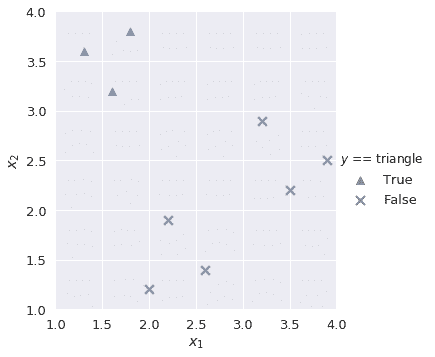
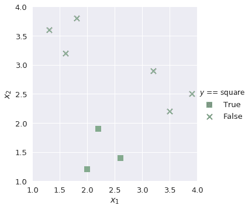
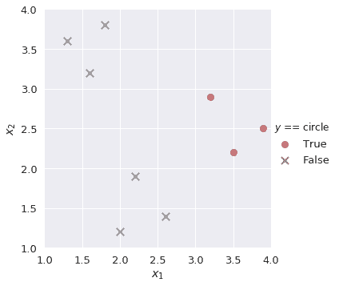
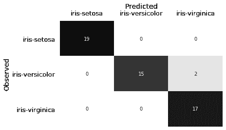
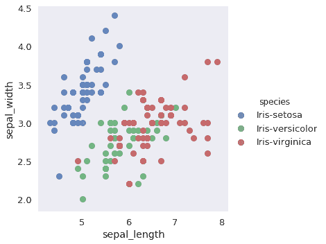

# 多类分类

> 原文：[https://www.textbook.ds100.org/ch/17/classification_multicolass.html](https://www.textbook.ds100.org/ch/17/classification_multicolass.html)

```
# HIDDEN
# Clear previously defined variables
%reset -f

# Set directory for data loading to work properly
import os
os.chdir(os.path.expanduser('~/notebooks/17'))

```

```
# HIDDEN
import warnings
# Ignore numpy dtype warnings. These warnings are caused by an interaction
# between numpy and Cython and can be safely ignored.
# Reference: https://stackoverflow.com/a/40846742
warnings.filterwarnings("ignore", message="numpy.dtype size changed")
warnings.filterwarnings("ignore", message="numpy.ufunc size changed")

import numpy as np
import matplotlib.pyplot as plt
import pandas as pd
import seaborn as sns
%matplotlib inline
import ipywidgets as widgets
from ipywidgets import interact, interactive, fixed, interact_manual
import nbinteract as nbi

sns.set()
sns.set_context('talk')
np.set_printoptions(threshold=20, precision=2, suppress=True)
pd.options.display.max_rows = 7
pd.options.display.max_columns = 8
pd.set_option('precision', 2)
# This option stops scientific notation for pandas
# pd.set_option('display.float_format', '{:.2f}'.format)

```

```
# HIDDEN
markers = {'triangle':['^', sns.color_palette()[0]], 
           'square':['s', sns.color_palette()[1]],
           'circle':['o', sns.color_palette()[2]]}

def plot_binary(data, label):
    data_copy = data.copy()
    data_copy['$y$ == ' + label] = (data_copy['$y$'] == label).astype('category')

    sns.lmplot('$x_1$', '$x_2$', data=data_copy, hue='$y$ == ' + label, hue_order=[True, False], 
               markers=[markers[label][0], 'x'], palette=[markers[label][1], 'gray'],
               fit_reg=False)
    plt.xlim(1.0, 4.0)
    plt.ylim(1.0, 4.0);

```

```
# HIDDEN
def plot_confusion_matrix(y_test, y_pred):
    sns.heatmap(confusion_matrix(y_test, y_pred), annot=True, cbar=False, cmap=matplotlib.cm.get_cmap('gist_yarg'))
    plt.ylabel('Observed')
    plt.xlabel('Predicted')
    plt.xticks([0.5, 1.5, 2.5], ['iris-setosa', 'iris-versicolor', 'iris-virginica'])
    plt.yticks([0.5, 1.5, 2.5], ['iris-setosa', 'iris-versicolor', 'iris-virginica'], rotation='horizontal')
    ax = plt.gca()
    ax.xaxis.set_ticks_position('top')
    ax.xaxis.set_label_position('top')

```

到目前为止，我们的分类器执行二进制分类，其中每个观察都属于两个类中的一个；例如，我们将电子邮件分类为 ham 或 spam。然而，许多数据科学问题涉及到**多类分类**，其中我们希望将观测分类为几个不同类别中的一个。例如，我们可能有兴趣将电子邮件分类为家庭、朋友、工作和促销等文件夹。为了解决这些类型的问题，我们使用了一种新的方法，叫做**one vs rest（ovr）classification**。

### 一对休息分类

在 OVR 分类（也称为 One vs All，或 OVA）中，我们将一个多类分类问题分解为几个不同的二进制分类问题。例如，我们可以观察培训数据，如下所示：

```
# HIDDEN
shapes = pd.DataFrame(
    [[1.3, 3.6, 'triangle'], [1.6, 3.2, 'triangle'], [1.8, 3.8, 'triangle'],
     [2.0, 1.2, 'square'], [2.2, 1.9, 'square'], [2.6, 1.4, 'square'],
     [3.2, 2.9, 'circle'], [3.5, 2.2, 'circle'], [3.9, 2.5, 'circle']],
    columns=['$x_1$', '$x_2$', '$y$']
)

```

```
# HIDDEN
sns.lmplot('$x_1$', '$x_2$', data=shapes, hue='$y$', markers=['^', 's', 'o'], fit_reg=False)
plt.xlim(1.0, 4.0)
plt.ylim(1.0, 4.0);

```


我们的目标是构建一个多类分类器，将观测值标记为$x_1$和$x_2$的给定值`triangle`、`square`或`circle`。首先，我们要构建一个二进制分类器`lr_triangle`，它将观察结果预测为`triangle`或非`triangle`：

```
plot_binary(shapes, 'triangle')

```



同样，我们为剩余的类构建二进制分类器`lr_square`和`lr_circle`。

```
plot_binary(shapes, 'square')

```



```
plot_binary(shapes, 'circle')

```



我们知道，在逻辑回归中，乙状结肠函数的输出是从 0 到 1 的概率值。为了解决我们的多类分类任务，我们在每个二进制分类器中找到正类的概率，并选择输出最高正类概率的类。例如，如果我们有一个具有以下值的新观察值：

| $XY1 $ | $XY2 $ |
| --- | --- |
| 第 3.2 条 | 2.5 条 |

然后我们的多类分类器将这些值输入到`lr_triangle`、`lr_square`和`lr_circle`中的每一个。我们提取三个分类器的正类概率：

```
# HIDDEN
lr_triangle = LogisticRegression(random_state=42)
lr_triangle.fit(shapes[['$x_1$', '$x_2$']], shapes['$y$'] == 'triangle')
proba_triangle = lr_triangle.predict_proba([[3.2, 2.5]])[0][1]

lr_square = LogisticRegression(random_state=42)
lr_square.fit(shapes[['$x_1$', '$x_2$']], shapes['$y$'] == 'square')
proba_square = lr_square.predict_proba([[3.2, 2.5]])[0][1]

lr_circle = LogisticRegression(random_state=42)
lr_circle.fit(shapes[['$x_1$', '$x_2$']], shapes['$y$'] == 'circle')
proba_circle = lr_circle.predict_proba([[3.2, 2.5]])[0][1]

```

| `lr_triangle` | `lr_square` | `lr_circle` |
| --- | --- | --- |
| 0.145748 个 | 0.285079 美元 | 0.497612 个 |

由于`lr_circle`的正类概率是三种概率中最大的，因此我们的多类分类器预测观察结果是一个圆。

## 案例研究：IRIS 数据集[¶](#Case-Study:-Iris-dataset)

IRIS 数据集是一种著名的数据集，在数据科学中经常用于探索机器学习概念。有三类，每类代表一种鸢尾植物：

*   刚毛鸢尾
*   杂色鸢尾
*   弗吉尼亚鸢尾

数据集中有四个可用功能：

*   萼片长度（厘米）
*   萼片宽度（cm）
*   花瓣长度（cm）
*   花瓣宽度（cm）


我们将创建一个多类分类器，根据上述四个特征预测鸢尾植物的类型。首先，我们读取数据：

```
iris = pd.read_csv('https://archive.ics.uci.edu/ml/machine-learning-databases/iris/iris.data',
                  header=None, names=['sepal_length', 'sepal_width', 'petal_length', 'petal_width', 'species'])

iris

```

|  | 萼片长度 | 萼片宽度 | 花瓣长度 | 花瓣宽度 | 物种 |
| --- | --- | --- | --- | --- | --- |
| 零 | 五点一 | 第 3.5 条 | 一点四 | 0.2 条 | 刚毛鸢尾 |
| --- | --- | --- | --- | --- | --- |
| 1 个 | 四点九 | 三 | 1.4 | 0.2 | Iris-setosa |
| --- | --- | --- | --- | --- | --- |
| 二 | 四点七 | 3.2 | 一点三 | 0.2 | Iris-setosa |
| --- | --- | --- | --- | --- | --- |
| …… | …… | ... | ... | ... | ... |
| --- | --- | --- | --- | --- | --- |
| 147 个 | 6.5 条 | 3.0 | 五点二 | 二 | 弗吉尼亚鸢尾 |
| --- | --- | --- | --- | --- | --- |
| 一百四十八 | 六点二 | 三点四 | 五点四 | 二点三 | Iris-virginica |
| --- | --- | --- | --- | --- | --- |
| 149 个 | 五点九 | 3.0 | 5.1 | 一点八 | Iris-virginica |
| --- | --- | --- | --- | --- | --- |

150 行×5 列

```
X, y = iris.drop('species', axis=1), iris['species']
X_train, X_test, y_train, y_test = train_test_split(X, y, test_size=0.35, random_state=42)

```

在将数据集划分为训练和测试分割之后，我们将多类分类器与我们的训练数据相匹配。默认情况下，SciKit Learn 的`LogisticRegression`设置`multi_class='ovr'`，它为每个唯一类创建二进制分类器：

```
lr = LogisticRegression(random_state=42)
lr.fit(X_train, y_train)

```

```
LogisticRegression(C=1.0, class_weight=None, dual=False, fit_intercept=True,
          intercept_scaling=1, max_iter=100, multi_class='ovr', n_jobs=1,
          penalty='l2', random_state=42, solver='liblinear', tol=0.0001,
          verbose=0, warm_start=False)
```

我们对测试数据进行预测，并使用一个混淆矩阵来评估结果。

```
y_pred = lr.predict(X_test)
plot_confusion_matrix(y_test, y_pred)

```



混淆矩阵表明，我们的分类器将两个`Iris-versicolor`观察结果误分类为`Iris-virginica`。在观察`sepal_length`和`sepal_width`特征时，我们可以假设为什么会发生这种情况：

```
# HIDDEN
sns.lmplot(x='sepal_length', y='sepal_width', data=iris, hue='species', fit_reg=False);

```



这两个特性的`Iris-versicolor`和`Iris-virginica`点重叠。虽然剩下的特性（`petal_width`和`petal_length`）有助于区分这两个类，但是我们的分类器仍然对这两个观察结果进行了错误分类。

同样，在现实世界中，如果两个类具有相似的特性，则错误分类可能很常见。混淆矩阵是有价值的，因为它们帮助我们识别分类器所产生的错误，从而洞察为了改进分类器，我们可能需要提取哪些额外的特性。

## 多标签分类

另一类分类问题是**多标签分类**，其中每个观测可以有多个标签。文件分类系统就是一个例子：文件可以有积极或消极的情绪，宗教或非宗教的内容，自由或保守的倾向。多标签问题也可以是多类的；我们可能希望我们的文档分类系统区分一系列类型，或者识别文档所用的语言。

我们可以通过简单地在每一组标签上训练一个单独的分类器来执行多标签分类。为了标记一个新的点，我们结合了每个分类器的预测。

## 摘要[¶](#Summary)

分类问题在本质上往往是复杂的。有时，这个问题要求我们区分多个类之间的观察；在其他情况下，我们可能需要为每个观察指定几个标签。我们利用我们对二进制分类器的知识来创建能够完成这些任务的多类和多标签分类系统。