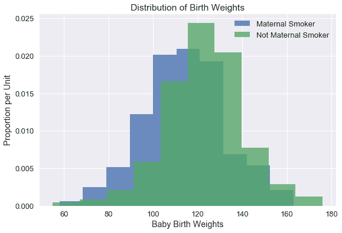
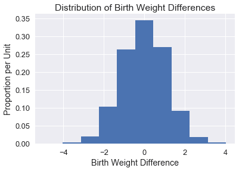
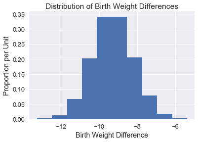

# 假设检验和置信区间

> 原文：[https://www.textbook.ds100.org/ch/18/hyp_introduction.html](https://www.textbook.ds100.org/ch/18/hyp_introduction.html)

```
# HIDDEN
# Clear previously defined variables
%reset -f

# Set directory for data loading to work properly
import os
os.chdir(os.path.expanduser('~/notebooks/18'))

```

```
# HIDDEN
import warnings
# Ignore numpy dtype warnings. These warnings are caused by an interaction
# between numpy and Cython and can be safely ignored.
# Reference: https://stackoverflow.com/a/40846742
warnings.filterwarnings("ignore", message="numpy.dtype size changed")
warnings.filterwarnings("ignore", message="numpy.ufunc size changed")

import numpy as np
import matplotlib.pyplot as plt
import pandas as pd
import seaborn as sns
%matplotlib inline
import ipywidgets as widgets
from ipywidgets import interact, interactive, fixed, interact_manual
import nbinteract as nbi

sns.set()
sns.set_context('talk')
np.set_printoptions(threshold=20, precision=2, suppress=True)
pd.options.display.max_rows = 7
pd.options.display.max_columns = 8
pd.set_option('precision', 2)
# This option stops scientific notation for pandas
# pd.set_option('display.float_format', '{:.2f}'.format)

```

在本节中，我们将简要回顾使用引导测试和置换测试的假设测试。我们假设对这个主题很熟悉，因为它在计算和推理思维（数据 8 的教科书）中有详细介绍。关于这里解释的概念的更深入的解释，请参见计算和推理思维的[第 11 章](https://www.inferentialthinking.com/chapters/11/Testing_Hypotheses)、[第 12 章](https://www.inferentialthinking.com/chapters/12/Comparing_Two_Samples)和[第 13 章](https://www.inferentialthinking.com/chapters/13/Estimation)。

## 假设检验

当把数据科学技术应用到不同的领域时，我们经常会遇到关于世界的问题。例如，喝咖啡会导致睡眠不足吗？自动驾驶车辆比非自动驾驶车辆更容易撞车吗？药物 X 有助于治疗肺炎吗？为了帮助回答这些问题，我们使用假设检验根据观察到的证据/数据做出明智的结论。

由于数据收集通常是一个不精确的过程，所以我们常常不确定数据集中的模式是由噪声还是真实现象造成的。假设检验有助于我们确定一个模式是否会因为数据收集中的随机波动而发生。

为了探索假设检验，我们从一个例子开始。表`baby`包含出生时婴儿体重的信息。它记录了 1174 名婴儿的出生体重（盎司），以及母亲是否在怀孕期间吸烟。

```
# HIDDEN
baby = pd.read_csv('baby.csv')
baby = baby.loc[:, ["Birth Weight", "Maternal Smoker"]]
baby

```

|  | 出生体重 | 母亲吸烟者 |
| --- | --- | --- |
| 零 | 一百二十 | 错误 |
| --- | --- | --- |
| 1 个 | 一百一十三 | False |
| --- | --- | --- |
| 二 | 一百二十八 | 对 |
| --- | --- | --- |
| …… | …… | ... |
| --- | --- | --- |
| 一千一百七十一 | 一百三十 | True |
| --- | --- | --- |
| 一千一百七十二 | 一百二十五 | False |
| --- | --- | --- |
| 一千一百七十三 | 117 个 | False |
| --- | --- | --- |

1174 行×2 列

### 设计[¶](#Design)

我们想看看母亲吸烟是否与出生体重有关。为了建立我们的假设检验，我们可以使用以下空假设和可选假设来表示世界的两种观点：

**无效假设**在人口中，婴儿出生体重的分布对于不吸烟的母亲和不吸烟的母亲是一样的。样品的差异是由于偶然性造成的。

**另一种假设：在人口中，吸烟的母亲的婴儿平均出生体重低于不吸烟的婴儿。**

我们的最终目标是在这两个数据生成模型之间做出决定。值得注意的一点是，我们构建了关于数据生成模型的 _ 参数 _ 的假设，而不是实验结果。例如，我们不应该构建一个无效的假设，例如“吸烟母亲的出生体重将等于非吸烟母亲的出生体重”，因为这一过程的结果存在自然的变异性。

零假设强调，如果数据看起来与零假设预测的不同，那么差异只由偶然性造成。非正式地，另一种假设认为观察到的差异是“真实的”。

我们应该仔细看看我们的替代假设的结构。在我们当前的设置中，请注意，如果吸烟母亲的婴儿出生体重显著低于不吸烟母亲的婴儿出生体重，我们将拒绝无效假设。换句话说，替代假设包含/支持分布的一侧。我们称之为**单边**替代假设。一般来说，如果我们有充分的理由相信吸烟的母亲的婴儿平均出生体重更高是不可能的，那么我们只想使用这种替代假设。

为了可视化数据，我们绘制了母亲吸烟者和非吸烟者所生婴儿体重的柱状图。

```
# HIDDEN
plt.figure(figsize=(9, 6))
smokers_hist = (baby.loc[baby["Maternal Smoker"], "Birth Weight"]
                .hist(normed=True, alpha=0.8, label="Maternal Smoker"))
non_smokers_hist = (baby.loc[~baby["Maternal Smoker"], "Birth Weight"]
                    .hist(normed=True, alpha=0.8, label="Not Maternal Smoker"))
smokers_hist.set_xlabel("Baby Birth Weights")
smokers_hist.set_ylabel("Proportion per Unit")
smokers_hist.set_title("Distribution of Birth Weights")
plt.legend()
plt.show()

```



吸烟母亲的婴儿的平均体重似乎比不吸烟母亲的婴儿的平均体重要低。这种差异可能是由于随机变化引起的吗？我们可以尝试用假设检验来回答这个问题。

为了进行假设检验，我们假设一个生成数据的特定模型；然后，我们问自己，我们将看到与我们观察到的结果一样极端的结果的可能性有多大？直观地说，如果看到我们观察到的结果的机会很小，我们假设的模型可能不是合适的模型。

特别是，我们假设零假设及其概率模型**零模型**是真的。换言之，我们假设零假设是真的，并关注统计值在零假设下的值。这个机会模型表示没有潜在的差异；样本中的分布只是因为偶然而有所不同。

### 测试统计[¶](#Test-Statistic)

在我们的例子中，我们假设母亲吸烟对婴儿体重没有影响（观察到的任何差异都是由于偶然性）。为了在我们的假设之间进行选择，我们将使用两组方法之间的差异作为我们的**检验统计**。从形式上讲，我们的测试统计是

$$\mu \text 吸烟-\mu \text 不吸烟$$

因此，这个统计的小值（即大负值）将有利于替代假设。让我们计算测试统计的观察值：

```
nonsmoker = baby.loc[~baby["Maternal Smoker"], "Birth Weight"]
smoker = baby.loc[baby["Maternal Smoker"], "Birth Weight"]
observed_difference = np.mean(smoker) - np.mean(nonsmoker)
observed_difference

```

```
-9.266142572024918
```

如果这两种分布在基础人群中真的没有差别，那么每个母亲是否是一个吸烟者不应该影响平均出生体重。换言之，与母亲吸烟有关的标签“真”或“假”不应与平均值有任何差异。

因此，为了模拟零假设下的检验统计量，我们可以将所有出生体重随机地放入母亲中。我们在下面进行这种随机排列。

```
def shuffle(series):
    '''
    Shuffles a series and resets index to preserve shuffle when adding series
    back to DataFrame.
    '''
    return series.sample(frac=1, replace=False).reset_index(drop=True)

```

```
baby["Shuffled"] = shuffle(baby["Birth Weight"])
baby

```

|  | Birth Weight | Maternal Smoker | 无序播放 |
| --- | --- | --- | --- |
| 0 | 120 | False | 一百二十二 |
| --- | --- | --- | --- |
| 1 | 113 | False | 167 个 |
| --- | --- | --- | --- |
| 2 | 128 | True | 一百一十五 |
| --- | --- | --- | --- |
| ... | ... | ... | ... |
| --- | --- | --- | --- |
| 1171 | 130 | True | 一百一十六 |
| --- | --- | --- | --- |
| 1172 | 125 | False | 一百三十三 |
| --- | --- | --- | --- |
| 1173 | 117 | False | 120 |
| --- | --- | --- | --- |

1174 行×3 列

### 进行置换试验

基于数据随机排列的测试称为**排列测试**。在下面的单元中，我们将多次模拟测试统计数据，并收集数组中的差异。

```
differences = np.array([])

repetitions = 5000
for i in np.arange(repetitions):
    baby["Shuffled"] = shuffle(baby["Birth Weight"])

    # Find the difference between the means of two randomly assigned groups
    nonsmoker = baby.loc[~baby["Maternal Smoker"], "Shuffled"]
    smoker = baby.loc[baby["Maternal Smoker"], "Shuffled"]
    simulated_difference = np.mean(smoker) - np.mean(nonsmoker)

    differences = np.append(differences, simulated_difference)

```

我们绘制了以下平均值中模拟差异的柱状图：

```
# HIDDEN
differences_df = pd.DataFrame()
differences_df["differences"] = differences
diff_hist = differences_df.loc[:, "differences"].hist(normed = True)
diff_hist.set_xlabel("Birth Weight Difference")
diff_hist.set_ylabel("Proportion per Unit")
diff_hist.set_title("Distribution of Birth Weight Differences");

```



从直觉上讲，差异的分布集中在 0 附近，因为在零假设下，两组的平均值应该相同。

为了得出这个假设检验的结论，我们应该计算 p 值。试验的经验 p 值是模拟差异等于或小于观察差异的比例。

```
p_value = np.count_nonzero(differences <= observed_difference) / repetitions
p_value

```

```
0.0
```

在假设检验开始时，我们通常选择一个 P 值**显著性阈值**（通常表示为 alpha）。如果我们的 p 值低于显著性阈值，那么我们拒绝无效假设。最常用的阈值是 0.01 和 0.05，其中 0.01 被认为更“严格”，因为我们需要更多的证据支持替代假设来拒绝无效假设。

在这两种情况下，我们都拒绝了无效假设，因为 p 值小于显著性阈值。

## 引导置信区间

数据科学家必须经常使用随机样本估计未知的人口参数。虽然理想情况下，我们希望从人群中采集大量样本，以生成一个样本分布，但我们通常仅限于金钱和时间上的单一样本。

幸运的是，一个随机采集的大样本看起来像原始种群。引导过程使用这个事实，通过从原始样本重新采样来模拟新样本。

要执行引导，我们执行以下步骤：

1.  从原始样本替换的样本（现在是引导填充）。这些样本称为引导样本。我们通常会抽取数千个自举样本（通常是 10000 个）。
2.  计算每个引导样本的兴趣统计。这种统计称为引导统计，这些引导统计的经验分布近似于引导统计的抽样分布。


我们可以使用引导抽样分布来创建一个置信区间，用来估计总体参数的值。

由于出生体重数据提供了一个大的随机样本，因此我们可以将不吸烟母亲的数据视为非吸烟母亲群体的代表。同样，我们的行为就好像吸烟母亲的数据代表了吸烟母亲的人口。

因此，我们将原始样本作为引导填充来执行引导过程：

1.  从不吸烟的母亲身上提取一个替代品样本，并计算这些母亲的平均出生体重。我们还从吸烟的母亲那里提取了一个替代品样本，并计算出平均出生体重。
2.  计算平均差。
3.  重复上述过程 10000 次，得到 10000 个平均差。

该程序给出了婴儿平均体重差异的经验抽样分布。

```
def resample(sample):
    return np.random.choice(sample, size=len(sample))

def bootstrap(sample, stat, replicates):
    return np.array([
        stat(resample(sample)) for _ in range(replicates)
    ])

```

```
nonsmoker = baby.loc[~baby["Maternal Smoker"], "Birth Weight"]
smoker = baby.loc[baby["Maternal Smoker"], "Birth Weight"]

nonsmoker_means = bootstrap(nonsmoker, np.mean, 10000)
smoker_means = bootstrap(smoker, np.mean, 10000)

mean_differences = smoker_means - nonsmoker_means

```

我们绘制了平均值差异的经验分布：

```
# HIDDEN
mean_differences_df = pd.DataFrame()
mean_differences_df["differences"] = np.array(mean_differences)
mean_diff = mean_differences_df.loc[:, "differences"].hist(normed=True)
mean_diff.set_xlabel("Birth Weight Difference")
mean_diff.set_ylabel("Proportion per Unit")
mean_diff.set_title("Distribution of Birth Weight Differences");

```



最后，为了构建一个 95%的置信区间，我们取引导统计数据的 2.5%和 97.5%。

```
(np.percentile(mean_differences, 2.5), 
 np.percentile(mean_differences, 97.5))

```

```
(-11.36909646997882, -7.181670323140913)
```

这个置信区间可以让我们 95%的置信度说明出生体重的总体平均差异在-11.37 至-7.18 盎司之间。

## 摘要[¶](#Summary)

在本节中，我们将回顾使用置换测试的假设测试和使用引导的置信区间。为了进行假设检验，我们必须陈述我们的无效假设和替代假设，选择适当的检验统计量，并执行检验程序来计算 p 值。为了建立一个置信区间，我们选择适当的测试统计量，引导原始样本生成测试统计量的经验分布，并选择与我们期望的置信水平相对应的分位数。