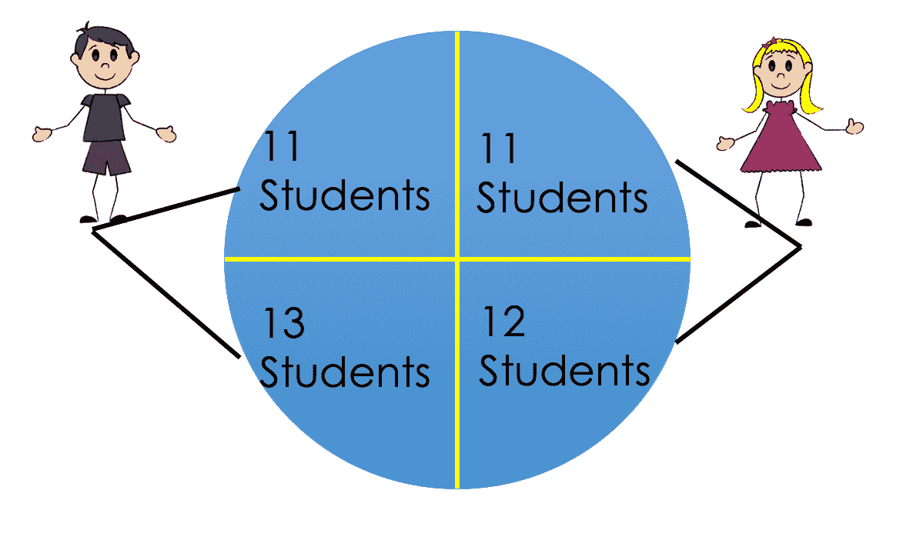
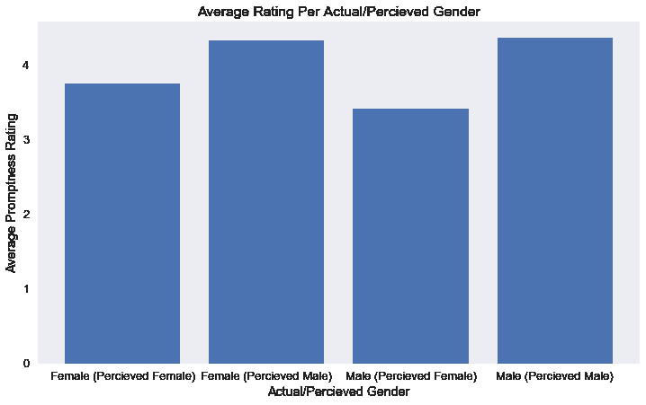
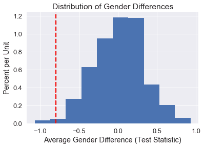

# 置换检验

> 原文：[https://www.textbook.ds100.org/ch/18/hyp_introduction_part2.html](https://www.textbook.ds100.org/ch/18/hyp_introduction_part2.html)

```
# HIDDEN
# Clear previously defined variables
%reset -f

# Set directory for data loading to work properly
import os
os.chdir(os.path.expanduser('~/notebooks/18'))

```

```
# HIDDEN
import warnings
# Ignore numpy dtype warnings. These warnings are caused by an interaction
# between numpy and Cython and can be safely ignored.
# Reference: https://stackoverflow.com/a/40846742
warnings.filterwarnings("ignore", message="numpy.dtype size changed")
warnings.filterwarnings("ignore", message="numpy.ufunc size changed")

import numpy as np
import matplotlib.pyplot as plt
import pandas as pd
import seaborn as sns
%matplotlib inline
import ipywidgets as widgets
from ipywidgets import interact, interactive, fixed, interact_manual
import nbinteract as nbi

sns.set()
sns.set_context('talk')
np.set_printoptions(threshold=20, precision=2, suppress=True)
pd.options.display.max_rows = 7
pd.options.display.max_columns = 8
pd.set_option('precision', 2)
# This option stops scientific notation for pandas
# pd.set_option('display.float_format', '{:.2f}'.format)

```

在一些情况下，我们希望执行一个置换测试，以测试一个假设并了解更多关于世界的信息。置换测试是一种非常有用的非参数测试类型，它允许我们在不进行低于传统参数测试的统计假设的情况下进行推论。

排列推理的一个有见地的例子是通过无聊、奥托博尼和斯塔克（2016）对学生对教学（集合）数据的评估进行复查。在这个实验中，47 名学生被随机分配到四个部分中的一个。有两个助教分别教两个部分；一个助教是男性，另一个是女性。在其中两个部分中，教学助理是用他们的实际姓名介绍的。在其他两个部分中，助手们交换了名字。

```
#HIDDEN 
from IPython.display import Image
display(Image('student_setup.png'))

```



学生们从未面对面见到过助教。相反，他们通过在线论坛与学生互动。家庭作业的返回是协调的，这样所有学生都能同时收到分数/反馈。这两个助教的经验水平也相当。在课程结束时，学生们会评估作业的及时性。作者想调查性别认知是否对集合评估/评分有任何影响。

### 实验装置

我们使用 0.05 的 p 值截止值进行假设检验。

在我们的**模型**中，每个助教有两个可能的评分，每个学生一个针对每个感知到的性别。每个学生被分配到任何一对（性别，感知性别）的机会均等。最后，学生们相互独立地评估他们的助教。

本实验的**无效假设**是感知性别对集合没有影响，任何观察到的评分差异都是偶然的。换言之，无论是男性还是女性，对每个助教的评估都应保持不变。这意味着每个助教实际上只有一个可能的评分来自每个学生。

另一种假设是感知性别对集合有影响。

**检验统计**是每个 TA 的感知男性和感知女性评分的平均值差异。直观地说，如果性别对收视率没有影响，我们预计这将接近 0。我们可以正式写下：

$$\mu \文本感知女性-\mu \文本感知男性$$

哪里：

$$ \begin{aligned} \mu_{\text{perceived female}} &= \frac {\sum_{j=1}^{n_1} x_{1j} + \sum_{j=1}^{n_3} x_{3j}}{{n_1} + {n_3}} \\ \mu_{\text{perceived male}} &= \frac {\sum_{j=1}^{n_2} x_{2j} + \sum_{j=1}^{n_4} x_{4j}}{{n_2} + {n_4}} \end{aligned} $$

其中，$n i$是$i$th 组的学生人数，$x ij 是第 i 组的第 j 个学生的评分。

为了确定性别对集合评分是否有影响，我们进行了置换测试，以在无效假设下生成检验统计量的经验分布。我们遵循以下步骤：

1.  为同一助教下的学生排列感知的性别标签。请注意，在上图中，我们在左右两半部分进行了调整。
2.  计算确定的女性和确定的男性群体的平均得分差异。
3.  重复多次，为两组的平均分数差创建一个近似的抽样分布。
4.  使用近似分布来估计看到测试统计数据比观察到的更极端的可能性。

理解置换测试在这种情况下的合理性是很重要的。在空模型下，每个学生都会给他们的助教相同的分数，而不管他们的性别。简单的随机分配意味着，对于一个给定的助教，无论他们被视为男性还是女性，他们的所有评分都有平等的机会出现。因此，如果无效假设为真，那么排列性别标签对评分应该没有影响。

### 数据[¶](#The-Data)

我们从下面的学生和性别数据开始。这些数据是美国一所大学的 47 名参加在线课程的学生的人口普查。

```
#HIDDEN 
student_eval = (
    pd.read_csv('StudentRatingsData.csv')
    .loc[:, ["tagender", "taidgender", "prompt"]]
    .dropna()
    .rename(columns={'tagender': 'actual', 'taidgender': 'perceived'})
)
student_eval[['actual', 'perceived']] = (
    student_eval[['actual', 'perceived']]
    .replace([0, 1], ['female', 'male'])
)
student_eval

```

|  | 实际的 | 感知 | 促使 |
| --- | --- | --- | --- |
| 零 | 女性的 | 男性的 | 四 |
| --- | --- | --- | --- |
| 1 个 | female | male | 五 |
| --- | --- | --- | --- |
| 二 | female | male | 5.0 |
| --- | --- | --- | --- |
| …… | …… | ... | ... |
| --- | --- | --- | --- |
| 四十三 | male | female | 4.0 |
| --- | --- | --- | --- |
| 四十四 | male | female | 二 |
| --- | --- | --- | --- |
| 45 岁 | male | female | 4.0 |
| --- | --- | --- | --- |

43 行×3 列

这些列具有以下含义：

**实际**——助教的真实性别

**感知**——呈现给学生的性别

**提示**——HW 的及时性等级从 1 到 5

在分析和绘制了下面实验的评分数据后，两组学生之间似乎存在差异，感知到的女性评分低于男性评分；然而，我们需要一个更正式的假设测试，以确定这种差异是否仅仅是由于随机性导致的。m 学生作业。

```
# HIDDEN
avg_ratings = (student_eval
 .loc[:, ['actual', 'perceived', 'prompt']]
 .groupby(['actual', 'perceived'])
 .mean()
 .rename(columns={'prompt': 'mean prompt'})
)
avg_ratings

```

|  |  | 平均提示 |
| --- | --- | --- |
| actual | perceived |  |
| --- | --- | --- |
| 女性的 | 女性的 | 3.75 条 |
| --- | --- | --- |
| 男性的 | 四点三三 |
| --- | --- |
| 男性的 | female | 三点四二 |
| --- | --- | --- |
| male | 四点三六 |
| --- | --- |

```
# HIDDEN
fig, ax = plt.subplots(figsize=(12, 7))
ind = np.arange(4)
plt.bar(ind, avg_ratings["mean prompt"])
ax.set_xticks(ind)
ax.set_xticklabels(['Female (Percieved Female)', 'Female (Percieved Male)', 'Male (Percieved Female)', "Male (Percieved Male)"])
ax.set_ylabel('Average Promptness Rating')
ax.set_xlabel('Actual/Percieved Gender')
ax.set_title('Average Rating Per Actual/Percieved Gender')
plt.show()

```



### 进行实验

我们将计算确定的男性和确定的女性群体的平均评分之间观察到的差异：

```
def stat(evals):
    '''Computes the test statistic on the evals DataFrame'''
    avgs = evals.groupby('perceived').mean()
    return avgs.loc['female', 'prompt'] - avgs.loc['male', 'prompt']

```

```
observed_difference = stat(student_eval)
observed_difference

```

```
-0.79782608695652169
```

我们发现差异是-0.8-在这种情况下，女性的平均评分从 1 分到 5 分低了近 1 分。考虑到评级的规模，这种差异似乎相当大。通过执行排列测试，我们将能够发现在空模型下观察到如此大差异的机会。

现在，我们可以为每个 TA 排列感知的性别标签，并计算 1000 次测试统计：

```
def shuffle_column(df, col):
    '''Returns a new copy of df with col shuffled'''
    result = df.copy()
    result[col] = np.random.choice(df[col], size=len(df[col]))
    return result

```

```
repetitions = 1000

gender_differences = np.array([
    stat(shuffle_column(student_eval, 'perceived'))
    for _ in range(repetitions)
])

```

我们使用下面的排列图绘制得分差异的近似抽样分布，用红色虚线显示观察值。

```
# HIDDEN
differences_df = pd.DataFrame()
differences_df["gender_differences"] = gender_differences
gender_hist = differences_df.loc[:, "gender_differences"].hist(normed=True)
gender_hist.set_xlabel("Average Gender Difference (Test Statistic)")
gender_hist.set_ylabel("Percent per Unit")
gender_hist.set_title("Distribution of Gender Differences")
plt.axvline(observed_difference, c='r', linestyle='--');

```

```
<matplotlib.lines.Line2D at 0x1a1b34e3c8>
```


```
# HIDDEN
differences_df = pd.DataFrame()
differences_df["gender_differences"] = gender_differences
gender_hist = differences_df.loc[:, "gender_differences"].hist(normed=True)
gender_hist.set_xlabel("Average Gender Difference (Test Statistic)")
gender_hist.set_ylabel("Percent per Unit")
gender_hist.set_title("Distribution of Gender Differences")
plt.axvline(observed_difference, c='r', linestyle='--')

```

```
<matplotlib.lines.Line2D at 0x1a1b256ef0>
```



根据下面的计算，在 1000 个模拟中，只有 18 个的差异至少与观察到的差异一样大。因此，我们的 p 值小于 0.05 阈值，我们拒绝了零假设，而赞成替代。

```
#Sample Distribution Parameters
sample_sd = np.std(gender_differences)
sample_mean = np.mean(gender_differences)
#Computing right-hand extreme value
num_sd_away = (sample_mean - observed_difference)/sample_sd
right_extreme_val = sample_mean + (num_sd_away*sample_sd)
#Calculate P-value
num_extreme_left = np.count_nonzero(gender_differences <= observed_difference)
num_extreme_right = np.count_nonzero(gender_differences >= right_extreme_val)
empirical_P = (num_extreme_left + num_extreme_right) / repetitions
empirical_P

```

```
0.018
```

### 结论[¶](#Conclusion)

通过这一排列测试，我们发现集合对女教师的偏见是一个数额大，统计意义重大。

还有其他一些研究也在教学评估中测试了偏差。根据 Dring，Ottoboni&Stark 2016，进行了其他几个参数测试，假设男女教师的评级是来自具有相同方差的正态分布人群的独立随机样本；这种类型的实验设计与提出了零假设，导致 p 值可能产生误导。

相比之下，无聊的 Ottoboni&Stark 2016 使用了基于随机分配学生到班级的排列测试。回想一下，在排列测试期间，我们没有对数据的分布做任何基本假设。在这个实验中，我们没有假设学生、集合分数、成绩或任何其他变量包含任何群体的随机样本，更不用说具有正态分布的群体。

在检验假设时，仔细选择实验设计和无效假设是非常重要的，以获得可靠的结果。