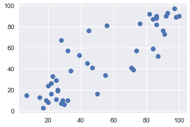
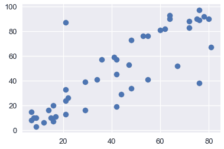
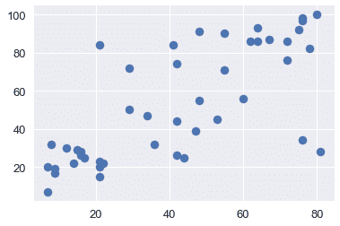
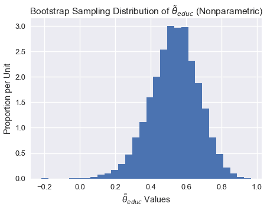

# 线性回归的自举（真系数的推断）

> 原文：[https://www.bookbookmark.ds100.org/ch/18/hyp_regression.html](https://www.bookbookmark.ds100.org/ch/18/hyp_regression.html)

```
# HIDDEN
# Clear previously defined variables
%reset -f

# Set directory for data loading to work properly
import os
os.chdir(os.path.expanduser('~/notebooks/18'))

```

```
# HIDDEN
import warnings
# Ignore numpy dtype warnings. These warnings are caused by an interaction
# between numpy and Cython and can be safely ignored.
# Reference: https://stackoverflow.com/a/40846742
warnings.filterwarnings("ignore", message="numpy.dtype size changed")
warnings.filterwarnings("ignore", message="numpy.ufunc size changed")

import numpy as np
import matplotlib.pyplot as plt
import pandas as pd
import seaborn as sns
%matplotlib inline
import ipywidgets as widgets
from ipywidgets import interact, interactive, fixed, interact_manual
import nbinteract as nbi

sns.set()
sns.set_context('talk')
np.set_printoptions(threshold=20, precision=2, suppress=True)
pd.options.display.max_rows = 7
pd.options.display.max_columns = 8
pd.set_option('precision', 2)
# This option stops scientific notation for pandas
# pd.set_option('display.float_format', '{:.2f}'.format)

```

回想一下，在线性回归中，我们拟合了如下形式的模型：$\ begin aligned f \ theta（x）=\hat \ theta+hat \ theta x u 1+\ldots+\hat \ theta x u p\end aligned$$

我们想推断模型的真实系数。由于$\hat \theta 0，$\hat \theta，$\ldots$\hat \theta p 是根据我们的培训数据/观察结果而变化的估计量，我们想了解我们的估计系数与真实系数的比较情况。bootstrapping 是一种统计推断的非参数方法，它为我们的参数提供了标准误差和置信区间。

让我们来看一个如何在线性回归中使用引导方法的例子。

### 数据[¶](#The-Data)

奥蒂斯·达德利·邓肯是一位定量社会学家，对衡量不同职业的声望水平感兴趣。在 1947 年的国家意见研究中心（Norc）调查中，只有 90 个职业被评为他们的声望水平。邓肯希望通过使用 1950 年人口普查记录的每个职业的收入和教育数据来“填写”未分级职业的声望分数。当把北卡罗来纳州的数据与 1950 年的人口普查数据相结合时，只有 45 个职业可以匹配。最后，邓肯的目标是建立一个模型，用不同的特征来解释威望；使用这个模型，人们可以预测在挪威国家石油公司调查中没有记录的其他职业的威望。

邓肯数据集是一个随机样本，其中包含 1950 年美国 45 个职业的声望和其他特征的信息。变量包括：

`occupation`表示职业/头衔的类型。

`income`表示收入超过 3500 美元的职业在职人员的百分比。

`education`代表 1950 年美国人口普查中在职者中高中毕业生的百分比。

`prestige`表示在一项调查中，被调查者在声望上认为某一职业“好”或“优秀”的百分比。

```
duncan = pd.read_csv('duncan.csv').loc[:, ["occupation", "income", "education", "prestige"]]
duncan

```

|  | 职业 | 收入 | 教育 | 声望 |
| --- | --- | --- | --- | --- |
| 零 | 会计 | 六十二 | 86 岁 | 八十二 |
| --- | --- | --- | --- | --- |
| 1 个 | 飞行员 | 七十二 | 七十六 | 八十三 |
| --- | --- | --- | --- | --- |
| 二 | 建筑师 | 75 岁 | 92 岁 | 九十 |
| --- | --- | --- | --- | --- |
| …… | …… | ... | ... | ... |
| --- | --- | --- | --- | --- |
| 42 岁 | 看门人 | 七 | 20 个 | 8 个 |
| --- | --- | --- | --- | --- |
| 四十三 | 警察 | 34 岁 | 47 岁 | 四十一 |
| --- | --- | --- | --- | --- |
| 四十四 | 服务员 | 8 | 三十二 | 10 个 |
| --- | --- | --- | --- | --- |

45 行×4 列

通过可视化来探索数据通常是一个好主意，以便了解变量之间的关系。下面，我们将看到收入、教育和声望之间的关系。

```
plt.scatter(x=duncan["education"], y=duncan["prestige"])

```

```
<matplotlib.collections.PathCollection at 0x1a1cf2cd30>
```



```
plt.scatter(x=duncan["income"], y=duncan["prestige"])

```

```
<matplotlib.collections.PathCollection at 0x1a1d0224e0>
```



```
plt.scatter(x=duncan["income"], y=duncan["education"])

```

```
<matplotlib.collections.PathCollection at 0x1a1d0de5f8>
```



从上面的图中，我们看到教育和收入与声望呈正相关；因此，这两个变量可能有助于解释声望。让我们用这些解释变量拟合一个线性模型来解释声望。

### 拟合模型[¶](#Fitting-the-model)

我们将采用以下模型来解释职业声望作为收入和教育的线性函数：

$$\开始对齐\文本 tt 声望 _i=\theta_0^*

*   \ theta ^*\cdot\texttt 收入 u i
*   \ theta 教育^*\cdot\texttt 教育 u i
*   \ varepsilon_i \结束对齐$$

为了适应这个模型，我们将定义设计矩阵（x）和响应变量（y）：

```
X = duncan.loc[:, ["income", "education"]]
X.head()

```

|  | income | education |
| --- | --- | --- |
| 0 | 62 | 86 |
| --- | --- | --- |
| 1 | 72 | 76 |
| --- | --- | --- |
| 2 | 75 | 92 |
| --- | --- | --- |
| 三 | 55 岁 | 90 |
| --- | --- | --- |
| 四 | 六十四 | 86 |
| --- | --- | --- |

```
y = duncan.loc[:, "prestige"]
y.head()

```

```
0    82
1    83
2    90
3    76
4    90
Name: prestige, dtype: int64
```

下面，我们拟合我们的线性模型，并在模型与数据相匹配后，打印出模型的所有系数（从上面的方程式中）。注意，这些是我们的样本系数。

```
import sklearn.linear_model as lm

linear_model = lm.LinearRegression()
linear_model.fit(X, y)

print("""
intercept: %.2f
income:    %.2f
education:    %.2f
""" % (tuple([linear_model.intercept_]) + tuple(linear_model.coef_)))

```

```
intercept: -6.06
income:    0.60
education:    0.55

```

上面的系数给出了真实系数的估计。但是，如果我们的样本数据是不同的，我们将使我们的模型适合不同的数据，导致这些系数是不同的。我们想探讨一下，我们的系数可能使用了引导方法。

在我们的引导方法和分析中，我们将关注教育系数。我们希望探讨声誉与教育之间的部分关系，即保持收入不变（而不是声誉与教育之间的边际关系，而忽略收入）。偏回归系数$\widehat \theta_uxttet education$说明了我们数据中声望和教育之间的部分关系。

### 引导观察结果[¶](#Bootstrapping-the-Observations)

在这种方法中，我们将对$（x_i，y_i）$作为样本，因此我们通过从这些对中进行替换采样来构造引导重新采样：

$$\ begin aligned（x_i^*，y_i^*）=（x_i，y_i），\text 其中 i=1，点，n \ text 随机均匀采样。\ end aligned$$

换句话说，我们从我们的数据点用替换的方法对 n 个观测进行采样；这是我们的引导样本。然后我们将一个新的线性回归模型拟合到这个样本数据中，并记录教育系数$\tilde\theta\texttt education$；这个系数是我们的引导统计。

#### $\tilde\theta\texttt 教育$[？](#Bootstrap-Sampling-Distribution-of-$\tilde\theta_\texttt{education}$)的引导抽样分布

```
def simple_resample(n): 
    return(np.random.randint(low = 0, high = n, size = n))

def bootstrap(boot_pop, statistic, resample = simple_resample, replicates = 10000):
    n = len(boot_pop)
    resample_estimates = np.array([statistic(boot_pop[resample(n)]) for _ in range(replicates)])
    return resample_estimates

```

```
def educ_coeff(data_array):
    X = data_array[:, 1:]
    y = data_array[:, 0]

    linear_model = lm.LinearRegression()
    model = linear_model.fit(X, y)
    theta_educ = model.coef_[1]

    return theta_educ

data_array = duncan.loc[:, ["prestige", "income", "education"]].values

theta_hat_sampling = bootstrap(data_array, educ_coeff)

```

```
plt.figure(figsize = (7, 5))
plt.hist(theta_hat_sampling, bins = 30, normed = True)
plt.xlabel("$\\tilde{\\theta}_{educ}$ Values")
plt.ylabel("Proportion per Unit")
plt.title("Bootstrap Sampling Distribution of $\\tilde{\\theta}_{educ}$ (Nonparametric)");
plt.show()

```



注意上面的采样分布是如何稍微向左倾斜的。

#### 估算真系数

虽然我们不能直接测量$\theta^*u \texttt education$我们可以使用引导置信区间来解释样本回归系数$\widehat\theta \texttt education 的可变性。下面，我们使用 bootstrap percentile 方法为真系数$\theta^*\texttt education 构建一个大约 95%的置信区间。置信区间从 2.5%扩展到 10000 个自举系数的 97.5%。

```
left_confidence_interval_endpoint = np.percentile(theta_hat_sampling, 2.5)
right_confidence_interval_endpoint = np.percentile(theta_hat_sampling, 97.5)

left_confidence_interval_endpoint, right_confidence_interval_endpoint

```

```
(0.24714198882974781, 0.78293602739856061)
```

从上述置信区间，我们可以相当确定，真实系数介于 0.236 和 0.775 之间。

#### 利用正态理论的置信区间

我们也可以建立基于正态理论的置信区间。由于$\widehat\theta educ 值呈正态分布，我们可以通过计算以下内容来构造置信区间：

$$\begin aligned[\widehat\theta-z \frac \alpha 2 se（\theta ^*），\widehat\theta+z \frac \alpha 2 se（\theta ^*）]\end aligned$$

其中，$se（\theta^*）$是引导系数的标准误差，$z$是一个常数，$widehat\theta$是我们的样本系数。注意$Z$根据我们构建的区间的置信水平而变化。由于我们正在建立一个 95%的置信区间，我们将使用 1.96。

```
# We will use the statsmodels library in order to find the standard error of the coefficients
import statsmodels.api as sm
ols = sm.OLS(y, X)
ols_result = ols.fit()
# Now you have at your disposition several error estimates, e.g.
ols_result.HC0_se

```

```
income       0.15
education    0.12
dtype: float64
```

```
left_confidence_interval_endpoint_normal = 0.55 - (1.96*0.12)
right_confidence_interval_endpoint_normal = 0.55 + (1.96*0.12)
left_confidence_interval_endpoint_normal, right_confidence_interval_endpoint_normal

```

```
(0.3148000000000001, 0.7852)
```

**观察值：**注意使用正态理论的置信区间比使用百分位法的置信区间窄，特别是在区间的左边。

我们不会详细讨论正常理论置信区间，但如果您想了解更多信息，请参阅 x。

#### 真系数可以是 0 吗？[¶](#Could-the-true-coefficient-be-0?)

虽然我们观察到教育和声望之间存在正的部分关系（从 0.55 系数开始），但如果真正的系数是 0，而教育和声望之间没有部分关系呢？在这种情况下，我们观察到的关联仅仅是由于在获得构成我们样本的点时的变化。

为了正式检验教育与声望之间的部分关系是否真实，我们要检验以下假设：

**虚假设**真偏系数为 0。

**替代假设。**真正的分项系数不是 0。

由于我们已经为真系数建立了 95%的置信区间，我们只需要看看 0 是否在这个区间内。请注意，0 不在上述置信区间内；因此，我们有足够的证据来拒绝无效假设。

如果真系数的置信区间确实包含 0，那么我们就没有足够的证据来拒绝无效假设。在这种情况下，观察到的系数$\widehat\theta \textt education$可能是假的。

#### 方法 1 引导反射

为了建立系数$\widehat\theta \texttt education 的抽样分布，并构造真系数的置信区间，我们直接对观测结果进行了重采样，并在引导样本上拟合了新的回归模型。此方法将回归量$x_i$隐式地视为随机的，而不是固定的。

在某些情况下，我们可能希望将$x_i$视为固定值（例如，如果数据来自实验设计）。如果解释变量被控制，或者解释变量的值被实验者设置，那么我们可以考虑下面的替代引导方法。

### 备选方案：引导残差[¶](#Alternative:-Bootstrapping-the-Residuals)

线性回归中假设检验的另一种方法是自举残差。这种方法有许多基本假设，在实践中使用频率较低。在这种方法中，我们将 _ 残差 _$e_i：=y_i-x_i \widehat \beta$作为我们的样本，因此我们通过用这些残差替换的样本来构造引导重采样。一旦我们构造了每个引导样本，我们就可以使用这些残差计算新的拟合值。然后，我们将这些新的 y 值回归到固定的 x 值上，得到自举回归系数。

为了更清楚地说明，让我们将此方法分解为以下步骤：

1.  估计原始样本的回归系数，并计算每个观测值的拟合值$\widehat y$和残差$e_i$。

2.  选择残差的引导样本；我们将这些引导残差表示为$\tilde e_1、\tilde e_2、\dots\tilde e_n$。然后，通过计算$\widehat y+\tilde e_i$计算引导的$\tilde y_i$值，其中拟合值$\widehat y_i=x_i\widehat\beta$从原始回归中获得。

3.  在固定的$x$值上对引导的$\tilde y_i$值进行回归，以获得引导回归系数$\tilde\theta$。

4.  重复第二步和第三步数次，以获得几个引导回归系数$\tilde\theta_1、\tilde\theta_2、\dots\tilde\theta_n$。这些可以用来计算引导标准错误和置信区间。

#### Estimating the True Coefficients[¶](#Estimating-the-True-Coefficients)

既然我们已经有了自举回归系数，我们可以使用与以前相同的技术构造一个置信区间。我们将把这个留作练习。

#### 引导残差反射[？](#Bootstrapping-the-Residuals-Reflection)

让我们考虑一下这个方法。通过将重新取样的残差随机重新附加到确定的值，此过程隐式地假定错误分布相同。更具体地说，该方法假定输入$x_i$的所有值的回归曲线周围的波动分布是相同的。这是一个缺点，因为真正的错误可能有不恒定的方差；这种现象被称为异方差。

虽然这种方法没有对误差分布的形状做任何假设，但它隐式地假定模型的函数形式是正确的。通过依赖模型来创建每个引导样本，我们假设模型结构是适当的。

## 摘要[¶](#Summary)

在本节中，我们将重点介绍线性回归设置中使用的引导技术。

一般来说，引导观察通常用于引导。该方法通常比其他技术更为稳健，因为它所做的基本假设更少；例如，如果拟合了错误的模型，则该方法仍将生成相关参数的适当抽样分布。

我们还强调了另一种方法，它有几个缺点。当我们希望将我们的观察值$x$视为固定值时，可以使用引导残差。请注意，应该谨慎使用此方法，因为它对模型的错误和形式进行了额外的假设。