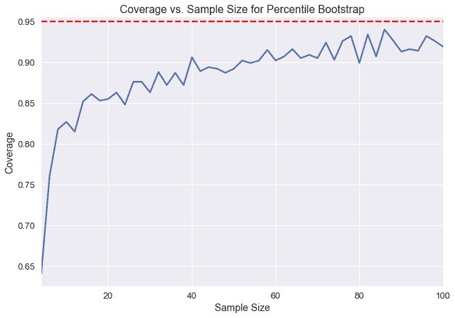
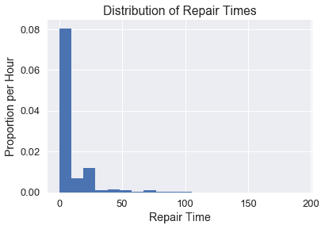
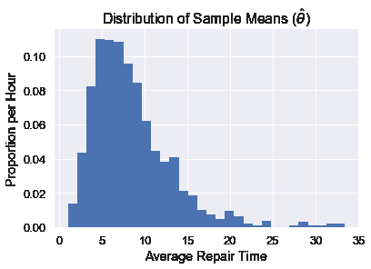
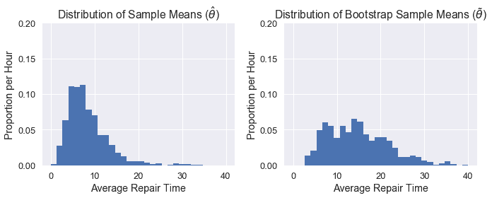
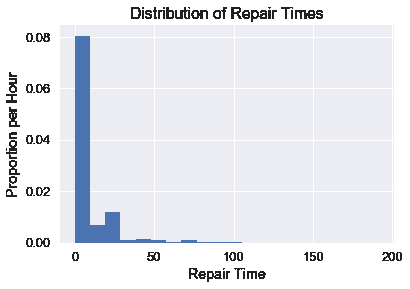
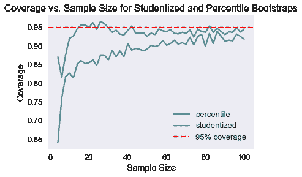

# 学生化自举

> 原文：[https://www.textbook.ds100.org/ch/18/hyp_studentized.html](https://www.textbook.ds100.org/ch/18/hyp_studentized.html)

```
# HIDDEN
# Clear previously defined variables
%reset -f

# Set directory for data loading to work properly
import os
os.chdir(os.path.expanduser('~/notebooks/18'))

```

```
# HIDDEN
import warnings
# Ignore numpy dtype warnings. These warnings are caused by an interaction
# between numpy and Cython and can be safely ignored.
# Reference: https://stackoverflow.com/a/40846742
warnings.filterwarnings("ignore", message="numpy.dtype size changed")
warnings.filterwarnings("ignore", message="numpy.ufunc size changed")

import numpy as np
import matplotlib.pyplot as plt
import pandas as pd
import seaborn as sns
%matplotlib inline
import ipywidgets as widgets
from ipywidgets import interact, interactive, fixed, interact_manual
import nbinteract as nbi

sns.set()
sns.set_context('talk')
np.set_printoptions(threshold=20, precision=2, suppress=True)
pd.options.display.max_rows = 7
pd.options.display.max_columns = 8
pd.set_option('precision', 2)
# This option stops scientific notation for pandas
# pd.set_option('display.float_format', '{:.2f}'.format)

```

```
# HIDDEN
def df_interact(df, nrows=7, ncols=7):
    '''
    Outputs sliders that show rows and columns of df
    '''
    def peek(row=0, col=0):
        return df.iloc[row:row + nrows, col:col + ncols]
    if len(df.columns) <= ncols:
        interact(peek, row=(0, len(df) - nrows, nrows), col=fixed(0))
    else:
        interact(peek,
                 row=(0, len(df) - nrows, nrows),
                 col=(0, len(df.columns) - ncols))
    print('({} rows, {} columns) total'.format(df.shape[0], df.shape[1]))

```

```
# HIDDEN
times = pd.read_csv('ilec.csv')['17.5']

```

**bootstrap**是我们在数据 8 中了解到的一个过程，我们只能使用一个样本来估计人口统计。引导的一般步骤如下：

*   从人群中抽取相当大的样本。
*   使用这个样本，我们用替换品重新取样，形成相同尺寸的新样本。
*   我们做了很多次，对每个重采样进行期望的统计（例如，我们取每个重采样的中位数）。

在这里，我们得到了许多来自个别重采样的测试统计数据，从中我们可以形成一个分布。在数据 8 中，我们被教导通过采用引导统计的 2.5%和 97.5%来形成 95%的置信区间。这种用于创建置信区间的引导方法称为**百分位数引导。**95%置信度意味着，如果我们从总体中提取一个新的样本并构造一个置信区间，置信区间将包含概率为 0.95 的总体参数。然而，重要的是要注意，从实际数据创建的置信区间只能接近 95%的置信度。特别是在小样本量的情况下，百分位数引导比期望的置信度要低。

下面，我们选取了一个总体，并为不同样本大小的总体平均值创建了 1000 个引导 95%的置信区间。Y 轴表示包含实际总体平均值的 1000 个置信区间的分数。注意，在样本量低于 20 的情况下，小于 90%的置信区间实际上包含总体平均值。



我们可以通过计算我们这里测量的置信度和我们期望的 95%置信度之间的差异来测量 _ 覆盖误差 _。我们可以看到，在小样本量的情况下，百分位数引导的覆盖率误差非常高。在本章中，我们将介绍一种新的引导方法，称为**studentized bootstrap**方法，它具有较低的覆盖率错误，但需要更多的计算。

### 修理次数[¶](#Repair-Times)

纽约市公用事业委员会监测该州修理陆地电话服务的响应时间。这些维修时间可能会因维修类型的不同而有所不同。我们对一个特定的 _ 现有本地交换运营商 _ 进行了一次一类维修的维修时间普查，该公司是一家电话公司，在向竞争激烈的本地交换运营商开放市场之前，该公司对固定电话服务拥有区域垄断权，或者这类公司的法人继承人。委员会对平均维修时间的估计很感兴趣。首先，让我们看看所有时间的分布。

```
plt.hist(times, bins=20, normed=True)
plt.xlabel('Repair Time')
plt.ylabel('Proportion per Hour')
plt.title('Distribution of Repair Times');

```



假设我们要估计修复时间的总体平均值。我们首先需要定义实现这一点所需的主要统计函数。通过对整个人口的统计，我们可以看出实际平均修复时间约为 8.4 小时。

```
def stat(sample, axis=None):
    return np.mean(sample, axis=axis)

```

```
theta = stat(times)
theta

```

```
8.406145520144333
```

现在我们需要定义一个方法，它将返回一个索引列表，这样我们就可以从原始样本中重新取样而不需要替换。

```
def take_sample(n=10):
    return np.random.choice(times, size=n, replace=False)

```

在现实生活中，我们将无法从人群中提取许多样本（我们使用自举只能使用一个样本）。但出于演示目的，我们可以接触到整个人口，因此我们将采集 1000 个 10 号样本，并绘制样本平均值的分布图。

```
samples_from_pop = 1000

pop_sampling_dist = np.array(
    [stat(take_sample()) for _ in range(samples_from_pop)]
)

plt.hist(pop_sampling_dist, bins=30, normed=True);
plt.xlabel('Average Repair Time')
plt.ylabel('Proportion per Hour')
plt.title(r'Distribution of Sample Means ($\hat{\theta}$)');

```



我们可以看到，这个分布的中心是~5，并且由于原始数据的分布是倾斜的，所以它是向右倾斜的。

### 统计分布比较

现在我们可以看看单个引导分布如何与从总体中抽样的分布相比较。

一般来说，我们的目标是估计我们的人口参数$\theta^*$（在这种情况下，人口的平均修复时间，我们发现是~8.4）。每个单独的样本都可以用来计算一个估计的统计，$\hat\theta$（在这种情况下，是单个样本的平均修复时间）。上面的图表显示了我们所称的 _ 经验分布 _，它是由人口中许多样本的估计统计数据计算得出的。但是，对于自举，我们需要原始样本（称为$\tilde\theta$）重新采样的统计信息。

为了使自举正常工作，我们希望原始样本看起来与总体相似，以便重新取样看起来也与总体相似。如果我们的原始样本 _ 看起来像人群，那么从重新取样计算出的平均修复时间分布将类似于直接从人群中提取的样本的经验分布。_

让我们来看看一个单独的引导分布将如何显示。我们可以定义不需要替换的情况下抽取 10 号样本的方法，并将其引导 1000 次以获得我们的分布。

```
bootstrap_reps = 1000

def resample(sample, reps):
    n = len(sample)
    return np.random.choice(sample, size=reps * n).reshape((reps, n))

def bootstrap_stats(sample, reps=bootstrap_reps, stat=stat):
    resamples = resample(sample, reps)
    return stat(resamples, axis=1)

```

```
np.random.seed(0)

sample = take_sample()

plt.hist(bootstrap_stats(sample), bins=30, normed=True)
plt.xlabel('Average Repair Time')
plt.ylabel('Proportion per Hour')
plt.title(r'Distribution of Bootstrap Sample Means ($\tilde{\theta}$)');

```


正如您所看到的，我们的$\tilde\theta$分布与$\hat\theta$分布不太一样，这可能是因为我们的原始样本不像人群。因此，我们的置信区间表现相当差。下面我们可以看到两个分布的并排比较：

```
plt.figure(figsize=(10, 4))
plt.subplot(121)
plt.xlabel('Average Repair Time')
plt.ylabel('Proportion per Hour')
plt.title(r'Distribution of Sample Means ($\hat{\theta}$)')
plt.hist(pop_sampling_dist, bins=30, range=(0, 40), normed=True)
plt.ylim((0,0.2))

plt.subplot(122)
plt.xlabel('Average Repair Time')
plt.ylabel('Proportion per Hour')
plt.title(r'Distribution of Bootstrap Sample Means ($\tilde{\theta}$)')
plt.hist(bootstrap_stats(sample), bins=30, range=(0, 40), normed=True)
plt.ylim((0,0.2))

plt.tight_layout();

```



### studentized 自举[¶](#The-Studentized-Bootstrap-Procedure)

正如我们所看到的，百分位数自举的主要问题是需要更大的样本量才能真正达到所需的 95%置信度。利用 studentized 自举，我们可以做更多的计算，以在较小的样本量下获得更好的覆盖率。

研究自举背后的思想是规范化测试统计的分布$\tilde\theta$以 0 为中心，标准偏差为 1。这将修正原始分布的扩展差和倾斜。为了完成所有这些，我们需要首先进行一些派生。

在百分位数引导过程中，我们生成了许多$\tilde\theta$的值，然后我们将 2.5%和 97.5%作为置信区间。简言之，我们将这些百分位数称为$Q_2.5 和$Q_97.5 美元。请注意，这两个值都来自引导统计信息。

通过这个过程，我们希望实际的人口统计数据在置信区间之间的概率是 95%。换句话说，我们希望实现以下平等：

$$\Begin Aligned 0.95&amp；=\Cal P \ Left（Q 2.5 \Leq\Theta ^*\Leq Q 97.5 \ Let Aligned$$

在这个过程中，我们做了两个近似：因为我们假设我们的随机样本看起来像总体，所以我们用.\that\theta$来近似.\theta^*；因为我们假设一个随机重采样看起来像原始样本，所以我们用.\tilde\theta$来近似.\that\theta$。由于第二个近似值依赖于第一个近似值，所以它们都会在置信区间生成中引入误差，从而产生我们在图中看到的覆盖误差。

我们的目标是通过标准化我们的统计数据来减少这个错误。我们不直接使用我们的计算值$\tilde\theta$，而是使用：

$$\begin aligned \frac \tilde \theta-\hat \theta se（\tilde \theta）\end aligned$$

这将用样本统计标准化重采样统计，然后除以重采样统计的标准偏差（此标准偏差也称为标准误差，或 SE）。

整个规范化的统计称为学生的 t 统计量，所以我们称这个引导方法为**studentized bootstrap**或**bootstrap-t**方法。

像往常一样，我们计算了许多重采样的统计数据，然后取 2.5%和 97.5%分别为$Q_2.5 和$Q_97.5_。因此，我们希望归一化总体参数位于这些百分位数之间：

$$\Begin Aligned 0.95&amp；=\Cal P \ Left（Q 2.5 \Leq\Frac \Hat \Theta-\Theta ^*SE（\Hat \Theta）\Leq Q 97.5 \ Let Aligned$$

我们现在可以解出$\theta^*$的不等式：

$$ \begin{aligned} 0.95 &= {\cal P}\left(q_{2.5} \leq \frac{\hat{\theta} - \theta^*} {SE({\hat{\theta}})} \leq q_{97.5}\right) \\ &= {\cal P}\left(q_{2.5}SE({\hat{\theta}}) \leq {\hat{\theta} - \theta^*} \leq q_{97.5}SE({\hat{\theta}})\right) \\ &= {\cal P}\left(\hat{\theta} - q_{97.5}Se（\Hat \Theta）\Leq \Theta ^*\Leq \Hat \Theta-Q 2.5 Se（\Hat \Theta）\右\端对齐$$

这意味着我们可以只用$\hat\theta$（原始样本的测试统计）、$q 2.5 和$q 97.5$（用重采样计算的标准化统计百分比）和$se（\hat\theta）$（样本测试统计的标准差）来构造置信区间。最后一个值是通过使用重新取样测试统计数据的标准偏差来估计的。

因此，要计算 studentized 自举 CI，我们执行以下过程：

1.  计算样本上的测试统计数据。
2.  多次引导样本。
3.  对于每个自举，重新取样：
    1.  计算$\tilde\theta$，重新取样的测试统计信息。
    2.  计算$SE（\tilde \theta）美元。
    3.  计算$Q=\frac \tilde \theta-\hat \theta se（\tilde \theta）$。
4.  使用$\tilde\theta$值的标准偏差估计$se（\hat\theta）$值。
5.  然后计算置信区间：$\Left[\Hat \Theta-Q 97.5 SE（\Hat \Theta），\Hat \Theta-Q 2.5 SE（\Hat \Theta Right）$。

### 重新取样统计的标准误差计算

需要注意的是，$SE（\hat\theta）$是重新采样测试统计的标准错误，它并不总是容易计算，并且依赖于测试统计。对于样本平均值，$se（\tilde\theta）=\frac \tilde\sigma \sqrt n$，重采样值的标准差除以样本大小的平方根。

还要记住，我们必须使用重采样值来计算$SE（\tilde\theta）$；我们使用示例值来计算$SE（\hat\theta）$。

但是，如果我们的测试统计数据没有一个分析表达式（就像我们对于样本平均值的表达式），那么我们需要进行第二级引导。对于每个重采样，我们再次引导它，并计算每个第二级重采样（重采样）的测试统计信息，并使用这些第二级统计信息计算标准偏差。通常，我们会进行大约 50 个二级采样。

这大大增加了 studentized 引导过程的计算时间。如果我们进行 50 个二级重采样，整个过程将花费 50 倍的时间，只要我们有一个$SE（\tilde\theta）$的分析表达式。

### 研究性引导与百分位数引导的比较

为了评估 studentized 和 percentile 引导的权衡，让我们使用修复时间数据集比较两种方法的覆盖率。

```
plt.hist(times, bins=20, normed=True);
plt.xlabel('Repair Time')
plt.ylabel('Proportion per Hour')
plt.title('Distribution of Repair Times');

```



我们将从人群中抽取许多样本，计算每个样本的百分位置信区间和研究的置信区间，然后计算每个样本的覆盖率。我们将对不同的样本大小重复此操作，以了解每个方法的覆盖范围如何随样本大小而变化。

我们可以使用`np.percentile`计算以下百分位置信区间：

```
def percentile_ci(sample, reps=bootstrap_reps, stat=stat):
    stats = bootstrap_stats(sample, reps, stat)
    return np.percentile(stats, [2.5, 97.5])

```

```
np.random.seed(0)
sample = take_sample(n=10)
percentile_ci(sample)

```

```
array([ 4.54, 29.56])
```

要进行 studentized 引导，我们需要更多的代码：

```
def studentized_stats(sample, reps=bootstrap_reps, stat=stat):
    '''
    Computes studentized test statistics for the provided sample.

    Returns the studentized test statistics and the SD of the
    resample test statistics.
    '''
    # Bootstrap the sample and compute \tilde \theta values
    resamples = resample(sample, reps)
    resample_stats = stat(resamples, axis=1)
    resample_sd = np.std(resample_stats)

    # Compute SE of \tilde \theta.
    # Since we're estimating the sample mean, we can use the formula.
    # Without the formula, we would have to do a second level bootstrap here.
    resample_std_errs = np.std(resamples, axis=1) / np.sqrt(len(sample))

    # Compute studentized test statistics (q values)
    sample_stat = stat(sample)
    t_statistics = (resample_stats - sample_stat) / resample_std_errs
    return t_statistics, resample_sd

def studentized_ci(sample, reps=bootstrap_reps, stat=stat):
    '''
    Computes 95% studentized bootstrap CI
    '''
    t_statistics, resample_sd = studentized_stats(sample, reps, stat)
    lower, upper = np.percentile(t_statistics, [2.5, 97.5])

    sample_stat = stat(sample)
    return (sample_stat - resample_sd * upper,
            sample_stat - resample_sd * lower)

```

```
np.random.seed(0)
sample = take_sample(n=10)
studentized_ci(sample)

```

```
(4.499166906400612, 59.03291210887363)
```

现在所有内容都写出来了，我们可以比较两种方法的覆盖范围，因为样本大小从 4 增加到 100。

```
def coverage(cis, parameter=theta):
    return (
        np.count_nonzero([lower < parameter < upper for lower, upper in cis])
        / len(cis)
    )

```

```
def run_trials(sample_sizes):
    np.random.seed(0)
    percentile_coverages = []
    studentized_coverages = []

    for n in sample_sizes:
        samples = [take_sample(n) for _ in range(samples_from_pop)]
        percentile_cis = [percentile_ci(sample) for sample in samples]
        studentized_cis = [studentized_ci(sample) for sample in samples]

        percentile_coverages.append(coverage(percentile_cis))
        studentized_coverages.append(coverage(studentized_cis))
    return pd.DataFrame({
        'percentile': percentile_coverages,
        'studentized': studentized_coverages,
    }, index=sample_sizes)

```

```
%%time

trials = run_trials(np.arange(4, 101, 2))

```

```
CPU times: user 1min 52s, sys: 1.08 s, total: 1min 53s
Wall time: 1min 57s

```

```
trials.plot()
plt.axhline(0.95, c='red', linestyle='--', label='95% coverage')
plt.legend()
plt.xlabel('Sample Size')
plt.ylabel('Coverage')
plt.title('Coverage vs. Sample Size for Studentized and Percentile Bootstraps');

```



如我们所见，在较小的样本量下，studentized 引导具有更好的覆盖范围。

## 摘要[¶](#Summary)

大多数情况下，研究的引导比百分位引导更好，特别是如果我们只有一个小样本开始。我们通常希望在样本量较小或原始数据倾斜时使用此方法。主要的缺点是它的计算时间，如果$SE（\tilde\theta）$不容易计算，它会被进一步放大。