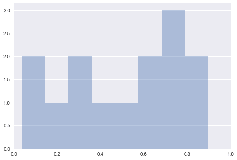
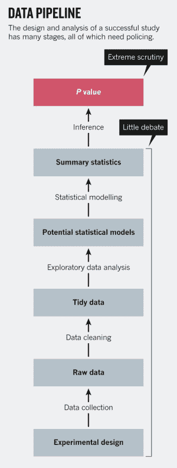

# P-HACKING

> 原文：[https://www.textbook.ds100.org/ch/18/hyp_k.html](https://www.textbook.ds100.org/ch/18/hyp_k.html)

```
# HIDDEN
# Clear previously defined variables
%reset -f

# Set directory for data loading to work properly
import os
os.chdir(os.path.expanduser('~/notebooks/18'))

```

```
# HIDDEN
import warnings
# Ignore numpy dtype warnings. These warnings are caused by an interaction
# between numpy and Cython and can be safely ignored.
# Reference: https://stackoverflow.com/a/40846742
warnings.filterwarnings("ignore", message="numpy.dtype size changed")
warnings.filterwarnings("ignore", message="numpy.ufunc size changed")

import numpy as np
import matplotlib.pyplot as plt
import pandas as pd
import seaborn as sns
%matplotlib inline
import ipywidgets as widgets
from ipywidgets import interact, interactive, fixed, interact_manual
import nbinteract as nbi

sns.set()
sns.set_context('talk')
np.set_printoptions(threshold=20, precision=2, suppress=True)
pd.options.display.max_rows = 7
pd.options.display.max_columns = 8
pd.set_option('precision', 2)
# This option stops scientific notation for pandas
# pd.set_option('display.float_format', '{:.2f}'.format)

```

正如我们所讨论的，p 值或概率值是基于零假设的模型，检验统计量等于在数据中观察到的值，或者更进一步地向替代值方向观察到的值的机会。如果一个 p 值很小，这意味着超出观测统计值的尾部很小，因此观测统计值远离零预测值。这意味着数据比支持空值更好地支持替代假设。按照惯例，当我们看到 p 值低于 0.05 时，结果被称为统计显著性，我们拒绝了无效假设。

当 p 值被滥用时，存在着危险。_p-hacking_ 是错误地使用数据分析来证明数据中的模式在实际情况下具有统计意义的行为。这通常是通过对数据执行多个测试来完成的，并且只关注返回重要结果的测试。

在本节中，我们将介绍一些关于 p 值和 p-hacking 危险的例子。

## 多重假设检验

盲目依赖 p 值来确定“统计显著性”的最大危险之一是，当我们试图找到“最性感”的结果时，这些结果会给我们“好的”p 值。这通常是在做“食物频率问卷”或 FFQ 时，为了研究饮食习惯与其他特征（疾病、体重、宗教等）的相关性。Fivethirtyeight 是一个专注于民意调查分析的在线博客，它制作了自己的 ffq，我们可以使用他们的数据运行我们自己的分析，找到一些愚蠢的结果，这些结果可以被认为是“统计上的显著性”。

```
data = pd.read_csv('raw_anonymized_data.csv')
# Do some EDA on the data so that categorical values get changed to 1s and 0s
data.replace('Yes', 1, inplace=True)
data.replace('Innie', 1, inplace=True)
data.replace('No', 0, inplace=True)
data.replace('Outie', 0, inplace=True)

# These are some of the columns that give us characteristics of FFQ-takers
characteristics = ['cat', 'dog', 'right_hand', 'left_hand']

# These are some of the columns that give us the quantities/frequencies of different food the FFQ-takers ate
ffq = ['EGGROLLQUAN', 'SHELLFISHQUAN', 'COFFEEDRINKSFREQ']

```

我们将特别关注人们是否拥有猫、狗，或者他们是什么样的手习惯。

```
data[characteristics].head()

```

|  | 猫 | 狗 | 右手 | 左手 |
| --- | --- | --- | --- | --- |
| 零 | 零 | 0 | 1 个 | 0 |
| --- | --- | --- | --- | --- |
| 1 个 | 0 | 0 | 1 | 0 |
| --- | --- | --- | --- | --- |
| 二 | 0 | 1 | 1 | 0 |
| --- | --- | --- | --- | --- |
| 三 | 0 | 0 | 1 | 0 |
| --- | --- | --- | --- | --- |
| 四 | 0 | 0 | 1 | 0 |
| --- | --- | --- | --- | --- |

此外，我们还将了解人们消费了多少贝类、蛋卷和咖啡。

```
data[ffq].head()

```

|  | 鸡蛋卷 | 贝鱼圈 | 共同进料机频率 |
| --- | --- | --- | --- |
| 0 | 1 | 三 | 二 |
| --- | --- | --- | --- |
| 1 | 1 | 2 | 3 |
| --- | --- | --- | --- |
| 2 | 2 | 3 | 3 |
| --- | --- | --- | --- |
| 3 | 3 | 2 | 1 |
| --- | --- | --- | --- |
| 4 | 2 | 2 | 2 |
| --- | --- | --- | --- |

所以现在我们可以计算每对特征和食物频率/数量特征的 p 值。

```
# HIDDEN
def findpvalue(data, c, f):
    return stat.pearsonr(data[c].tolist(), data[f].tolist())[1]

```

```
# Calculate the p value between every characteristic and food frequency/quantity pair
pvalues = {}
for c in characteristics:
    for f in ffq:
        pvalues[(c,f)] = findpvalue(data, c, f)
pvalues

```

```
{('cat', 'EGGROLLQUAN'): 0.69295273146288583,
 ('cat', 'SHELLFISHQUAN'): 0.39907214094767007,
 ('cat', 'COFFEEDRINKSFREQ'): 0.0016303467897390215,
 ('dog', 'EGGROLLQUAN'): 2.8476184473490123e-05,
 ('dog', 'SHELLFISHQUAN'): 0.14713568495622972,
 ('dog', 'COFFEEDRINKSFREQ'): 0.3507350497291003,
 ('right_hand', 'EGGROLLQUAN'): 0.20123440208411372,
 ('right_hand', 'SHELLFISHQUAN'): 0.00020312599063263847,
 ('right_hand', 'COFFEEDRINKSFREQ'): 0.48693234457564749,
 ('left_hand', 'EGGROLLQUAN'): 0.75803051153936374,
 ('left_hand', 'SHELLFISHQUAN'): 0.00035282554635466211,
 ('left_hand', 'COFFEEDRINKSFREQ'): 0.1692235856830212}
```

我们的研究发现：

| 吃/喝 | 链接到： | P 值 |
| --- | --- | --- |
| 蛋卷 | 狗的所有权 | &lt；0.000 一 |
| 贝类 | 右手习惯 | 零点零零零二 |
| Shellfish | 左撇子 | 零点零零零四 |
| 咖啡 | CAT 所有权 | 零点零零一六 |

显然这是有缺陷的！除了这些相关性似乎毫无意义之外，我们还发现贝类与左右手习惯有关！因为我们盲目地测试了所有列之间的统计显著性，所以我们可以选择任何对给我们的“统计显著性”结果。这显示了盲目遵循 p 值而不注意正确的实验设计的危险。

## A/B 测试[¶](#A/B-Testing)

A/B 测试是一个非常简单的概念。我们在一个正常的、受控的环境中测量一个统计量（我们称之为 a），然后将其与在一个环境中 _ 一个 _ 变化的相同统计量进行比较。这种形式的测试经常用于市场营销和广告研究，以比较广告某些特征的有效性。

假设我们为一家公司工作，该公司的网站允许用户制作自己的自定义视频游戏。该公司有一个免费版本，允许用户制作非常基本的视频游戏，和一个付费版本，允许用户使用更先进的工具制作视频游戏。当一个用户通过一个免费帐户完成了一个视频游戏，我们会把他们发送到一个登陆页面，让他们可以选择注册一个付费帐户。在这种情况下，我们测量的统计数据是有多少免费用户在到达这个页面后注册一个付费帐户。我们可以向一半的用户发送一个版本的页面，其中可能有详细解释付费帐户好处的文本（这将是版本 A），另一半的用户将获得另一个版本的页面，其中可能有一个彩色的图形，解释了一些好处的页面。e 支付账户（这将是 B 版）。

之所以称之为 A/B 测试，而不是 A/B/C/D，有一个非常具体的原因。测试。这是因为如果我们尝试同时测试多个版本，我们很容易遇到问题。

假设我们有 15 个不同的注册页面（一个是控件，在本例中为“a”），每个页面都有不同的内容（一个有小狗的图片，一个有客户的引述，一个有图形等），并且假设在本例中，我们的任何变体实际上都没有效果。关于用户交互（所以我们可以使用平均值为 0，标准差为 0.1 的高斯分布）。

```
# HIDDEN
n = 50
reps = 1000
num_pages = 15
np.random.seed(11)
def permute(A, B):
    combined = np.append(A, B)
    shuffled = np.random.choice(combined, size=len(combined), replace=False)
    return shuffled[:n], shuffled[n:]

def permutedpvalue(A, B):
    obs = test_stat(A, B)
    resampled = [test_stat(*permute(A, B)) for _ in range(reps)]
    return np.count_nonzero(obs >= resampled) / reps

```

```
n = 50
reps = 1000
num_pages = 15
# This will represent percentage of users that make a paid account from the landing page
# Note that all pages have no effect, so they all just have a base 10% of interactions.
landing_pages = [np.random.normal(0.1, 0.01, n) for _ in range(num_pages)]

# This will be our "control"
A = landing_pages[0]

# Our test statistic will be the difference between the mean percentage 
def test_stat(A, B):
    return np.abs(np.mean(B) - np.mean(A))

p_vals = []
for i in range(1, num_pages):
    # We test against each of the non-control landing pages
    B = landing_pages[i]
    p_val = permutedpvalue(A, B)
    p_vals.append(p_val)
print(p_vals)

```

```
[0.732, 0.668, 0.037, 0.245, 0.717, 0.256, 0.683, 0.654, 0.43, 0.503, 0.897, 0.868, 0.328, 0.044]

```

```
sns.distplot(p_vals, bins=8, kde=False)
plt.xlim((0,1))
plt.show()

```



正如我们所看到的，这些广告中不止一个的 p 值似乎小于 0.05，尽管我们知道页面之间实际上没有差别。这就是为什么我们在多个试验中进行单个 A/B 试验，而不是仅在单个试验中进行多个假设试验。如果我们只尝试多次，p 值就很容易给我们一个假阳性。

## 一种现象的许多测试

有时，多次测试可能是偶然的。如果许多研究人员同时研究同一现象，那么其中一个研究人员很可能会以幸运的试验结束。这正是 2010 年世界杯期间发生的事情。

### 章鱼保罗

章鱼保罗是一只生活在德国奥伯豪森海洋生物中心的普通章鱼。他最著名的是正确猜测 2010 年世界杯期间德国队的七场足球赛，以及荷兰队和西班牙队之间的决赛。

在比赛之前，保罗的主人会把两个装食物的盒子放在自己的油箱里，每个盒子上都标有不同国家的国旗。保罗从一开始就选择吃哪个盒子，这都被认为是他对比赛结果的预测。


那么，为什么保罗在预测这些比赛的结果方面如此出色呢？他到底是通灵的还是运气好？我们可能会问，假设他只是“猜测”，那么他得到所有正确预测的机会有多大？

保罗正确预测了 2010 年世界杯的 8 场比赛，每次他都有 1/2 的机会做出正确的预测。获得 8 个匹配项中所有 8 个匹配项的唯一方法是：$$1/2^8=1/256$$

他真的是通灵的吗？还是有更多的事情要揭露？

原来，有很多动物（其中一些和保罗在同一个动物园里！）做同样的事情，试图猜测各自国家比赛的结果，包括：

*   马尼鹦鹉，来自新加坡
*   来自德国的豪猪利昂
*   小矮人河马，来自德国
*   奥托·阿姆斯特朗，章鱼，来自德国
*   安东·塔马林，来自德国
*   来自德国的秘鲁豚鼠吉米
*   中国章鱼小哥
*   来自荷兰的章鱼保琳
*   来自爱沙尼亚的黑猩猩皮诺
*   来自爱沙尼亚的红河猪 Apelsin
*   鳄鱼哈利，来自澳大利亚，他们都没有得到他们的权利（虽然马尼鹦鹉得到了 7 场比赛中的 8 个权利）。

有些人可能会争辩说，把他们都搞错也很了不起。那么，12 只动物中至少有一只会得到正确或错误的机会有多大？

我们可以用简单的概率来计算。我们有 12 个试验（在本例中为动物），每个独立试验有 2 美元*（1/2）^8=1/128 美元的机会得到所有正确或错误的预测。那么，至少有一次成功的概率是多少？那是 1 美元-p 全部\textrm 失败=1-（127/128）^ 12=1-0.910=0.090$

我们有 9%的机会得到一只能够选择所有正确预测的动物，而且这还不包括世界上所有的动物都在做这些“预测”。这并不罕见，正是多重测试的危险导致了这种“现象”。这只章鱼被淘汰了。在世界上许多不同的动物中，恰巧有人猜对了所有正确的预测，这种情况的流行使它变得不可思议。

对于那些想知道这是否真的是运气的人来说，已经证明了普通章鱼（htg0）这个物种实际上是色盲的，一些人认为章鱼是被画成水平形状的，因此保罗决定选择德国，除了在与西班牙和塞尔维亚比赛时。

最后，我们知道，当研究被复制时，它们是更值得信赖的。数据科学家应该尽量避免像章鱼保罗这样的案例，因为在那里，只有一个真正的案例可以正确地预测一系列世界杯比赛。只有当我们看到他在多场足球比赛中这样做时，我们才应该开始查看数据。

## P-hacking 只是冰山一角

事实证明，P-hacking 并不是数据科学家和统计学家在从数据中做出合理推断时唯一需要担心的事情。成功研究的设计和分析有很多阶段，如下图所示（摘自李鹏的 _p 值只是冰山一角 _）。



如图所示，整个“数据管道”的最后一步是计算像 p 值这样的推断统计，并对其应用规则（例如 p&gt；0.05）。但是，还有许多其他的预先决定，如实验设计或 EDA，可以对结果产生更大的影响-错误，如简单的舍入或测量误差，选择错误的模型，或不考虑混杂因素可以改变一切。通过改变数据的清理、汇总或建模方式，我们可以实现任意程度的统计显著性。

举一个简单的例子，掷一对骰子，得到两个 6。如果我们假设骰子是公平的，不加权的，并且我们的检验统计量是骰子的和，我们会发现这个结果的 p 值是 1/36 或 0.028，和 g。艾夫斯我们的统计结果显着的骰子是公平的。但是很明显，单卷还不足以为我们提供充分的证据来判断结果是否具有统计学意义，并且表明如果不正确地设计一个好的实验而盲目地应用 p 值，会导致糟糕的结果。

最后，最重要的是关于安全假设检验的教育，并确保你不会陷入糟糕的统计决策的愚蠢之中。