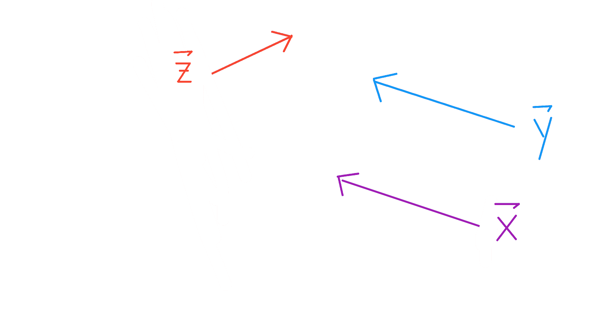
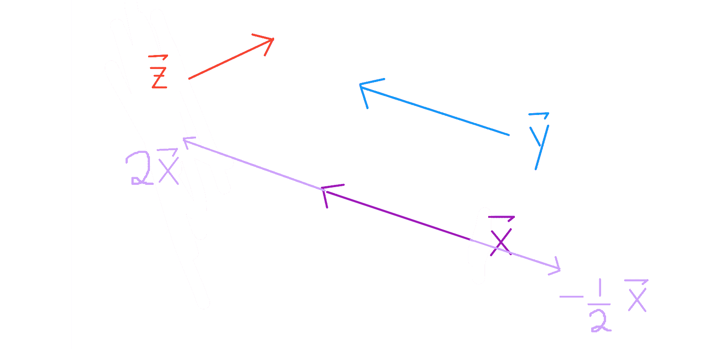
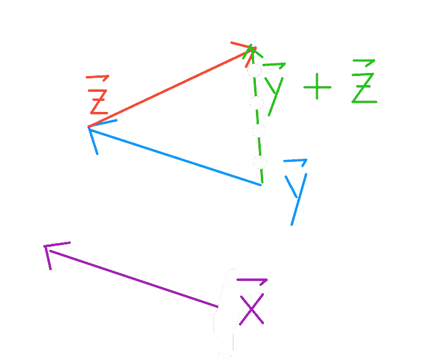
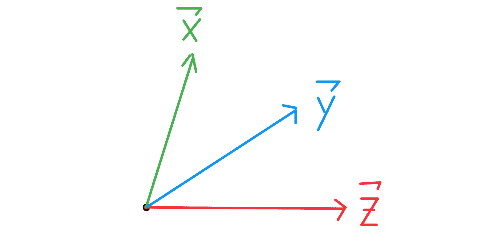
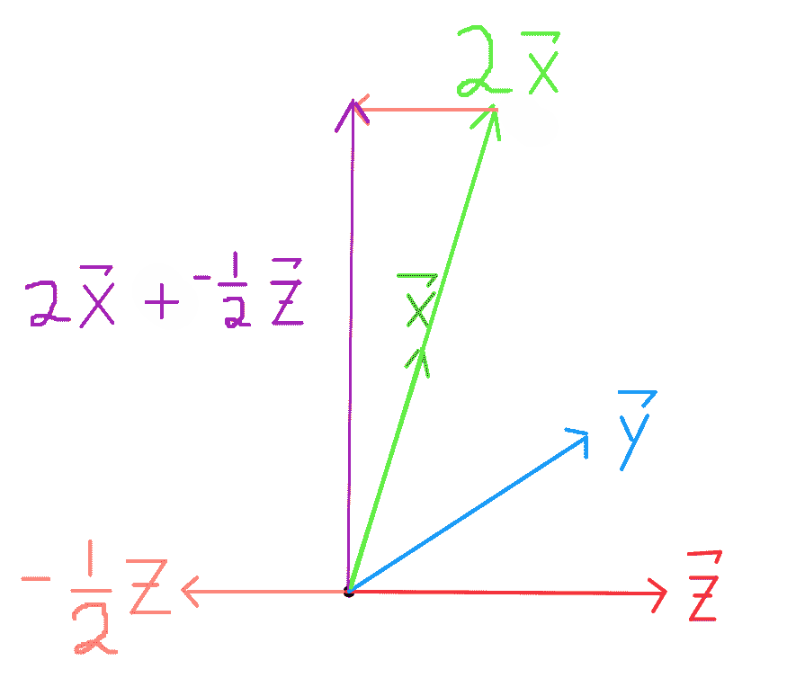
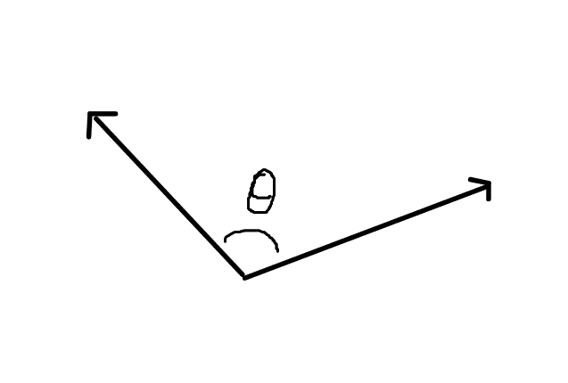
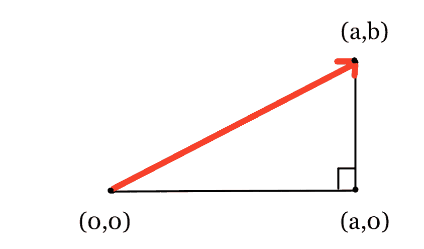
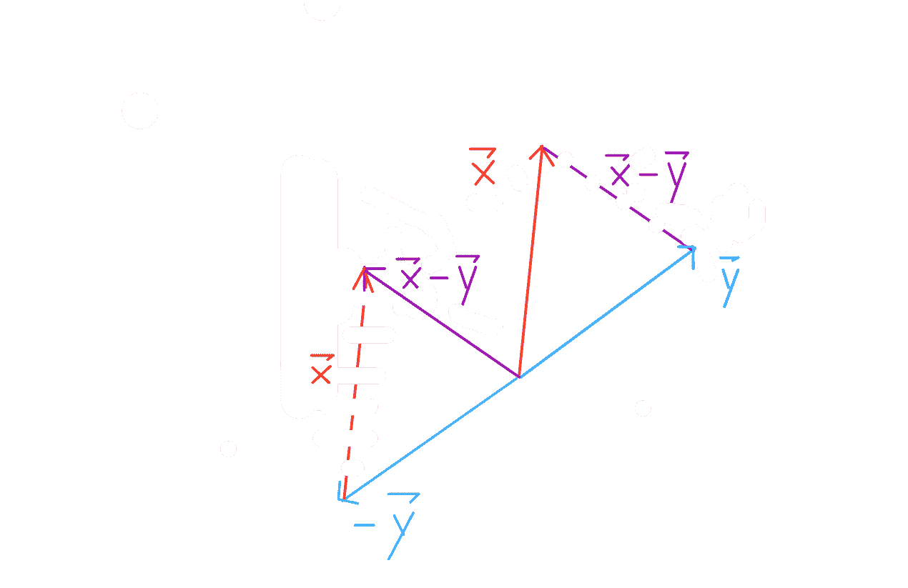
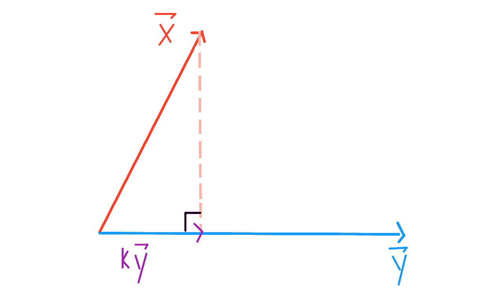
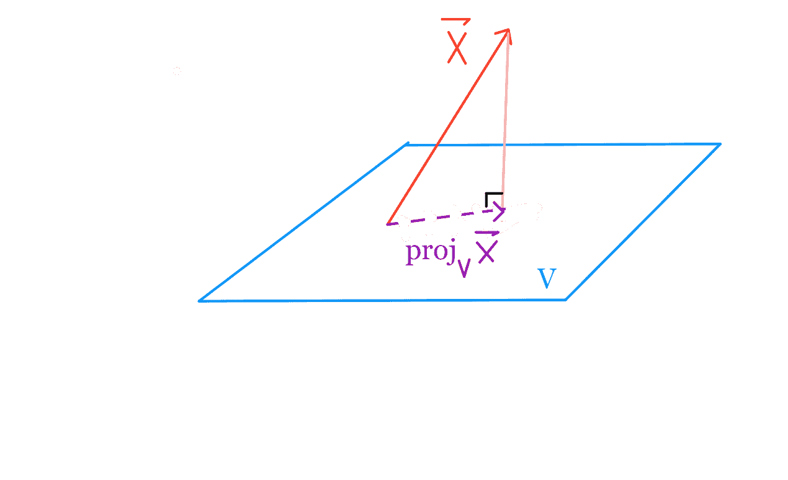

# 向量空间回顾

> 原文：[https://www.textbook.ds100.org/ch/19/vector_space_review.html](https://www.textbook.ds100.org/ch/19/vector_space_review.html)

```
# HIDDEN
# Clear previously defined variables
%reset -f

# Set directory for data loading to work properly
import os
os.chdir(os.path.expanduser('~/notebooks/19'))

```

*   [矢量定义](#Definition-of-a-vector)
*   [缩放和添加向量](#Scaling-and-adding-vectors)
*   [矢量符号](#Vector-notations)
*   [矢量$\vec 1$vector](#The-$\vec{1}$-vector)

*   [一组向量的跨度](#Span-of-a-set-of-vectors)
*   [向量空间](#Vector-spaces)
*   [向量子空间](#Vector-subspaces)

*   [向量之间的角度](#Angles-between-vectors)
*   [矢量长度](#Vector-lengths)
*   [两个向量之间的距离](#Distance-between-two-vectors)
*   [正交向量](#Orthogonal-vectors)
*   [矢量投影](#Projections-of-vectors)

### 向量的定义[¶](#Definition-of-a-vector)

矢量由长度和方向定义。



注意，$\vec x 和$\vec y 具有相同的长度和方向。它们是相等的向量。

### 缩放和添加向量

缩放向量就是改变向量的长度。



注意$\vec 2x$和$\vec y$有方向但长度不同。他们不平等。

若要添加两个向量$\vec y+\vec z$，请根据$\vec y 的长度执行一步，然后立即根据\vec z 的长度执行一步（反之亦然）。这也被称为三角形方法，将向量的初始点放在另一个向量的端点上。



### 矢量符号

向量通常用笛卡尔坐标表示。



$$ \vec{x} = \begin{bmatrix} 1 \\ 4 \end{bmatrix} , \quad \vec{y} = \begin{bmatrix} 3 \\ 2 \end{bmatrix} , \quad \vec{z} = \begin{bmatrix} 4 \\ 0 \end{bmatrix}$$

在这个符号中，我们前面看到的算术运算变得非常简单。

$$ \vec{2x} = \begin{bmatrix} 2 \\ 8 \end{bmatrix} , \quad \vec{-0.5z} = \begin{bmatrix} -2 \\ 0 \end{bmatrix} , \quad \vec{2x + -0.5z} = \begin{bmatrix} 0 \\ 8 \end{bmatrix} $$



可以添加向量并按比例缩放元素：

$$a \vec{x} + b \vec{y} = \begin{bmatrix} a \ x_1 & + & b \ y_1 \\ & \vdots & \\ a \ x_n & + & b \ y_n \end{bmatrix} $$

### $\vec 1$vector[¶](#The-$\vec{1}$-vector)

在任何$d$维空间中，$\vec 1 是所有$1$的向量：$\begin bmatrix 1 \\vdots\\1 \end bmatrix$

### 一组向量的跨度

一组向量的跨度$\ \ vec v、\vec v、\dots、\vec v p 是所有可能的线性组合的集合。对于这些$P$向量：

$$ \{ c_1 \ \vec{v_1} + c_2 \ \vec{v_2} + \dots + c_p \ \vec{v_p} \ : \ \forall c_i \in F\}$$

其中$F$是向量空间的字段（超出范围）。

### 向量空间

向量空间$v$是一组向量的跨度，$n\ vec \ vec \ v，\vec \ v，\dots，\vec v \ p，其中每个$\ vec v，$是$n\乘以 1$维列向量。

### 向量子空间

$v$的子空间$u$是一组向量的跨度（$v\ vec \ vec u、\dots、\vec u \ u），其中每个向量（$vec u i）以 v$表示。这意味着$U$中的每一个向量也都是$V$中的。

### 向量间的角度

当您将任意两个向量端到端放置而不改变它们的方向时，可以测量它们之间的角度。



### 向量长度[¶](#Vector-lengths)

直觉在$\mathbb r ^2$中：

回想一下加上两个向量的三角形方法。如果我们在$\mathbb 2$中添加两个垂直向量$\vec vec 在这种情况下，我们还知道，$\vec a+\vec b$的长度将遵循勾股定理：$\sqrt a^2+b^2$。



马蹄布 r \\\125\125\\124\123;\\124\124\124\\\124\124; 124\124\124; \124\124\124\\\\\\\\\\\\\；V \端对齐$$

其中，最后一个运算符是点积。

$$ \begin{aligned} \vec{x} \cdot \vec{y} \quad &= \quad x_1 \ y_1 + x_2 \ y_2 + \dots + x_n \ y_n \\ &= \quad||x|| \ ||y|| \ \cos{\theta} \end{aligned} $$

第一个表达式称为点积的代数定义，第二个表达式称为几何定义。注意，点积是为$\mathbb r ^n$中的向量定义的内积。

### 两个向量之间的距离

$$dist(\vec{x},\vec{y}) \quad = \quad || \vec{x} - \vec{y} ||$$



### 正交向量

要使两个非零向量正交，它们必须满足$\vec x \cdot\vec y=0$的属性。因为它们的长度不是零，所以两个向量正交的唯一方法是当$\cos \theta=0$时。一个令人满意的角度是 90 度，我们熟悉的直角。

### 向量投影

要将一个向量$\vec x 投射到另一个向量$\vec y 上，我们需要找到最接近于\vec x 的$K\\vec y$



根据毕达哥拉斯定理，我们知道$k$必须是标量，这样，$vec x-k\\vec y 就垂直于$vec-y，所以$k\\vec y 是$vec x 到$vec y 的（正交）投影。

同样地，为了将一个矢量\\\\\\123 \ 123，点，\\123\123\123\\\\123\\\\123\\123\\\\\\\\123；v_p 美元，最接近于\vec x 美元。

