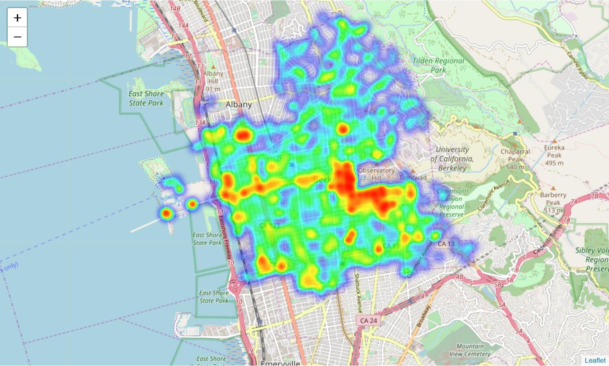
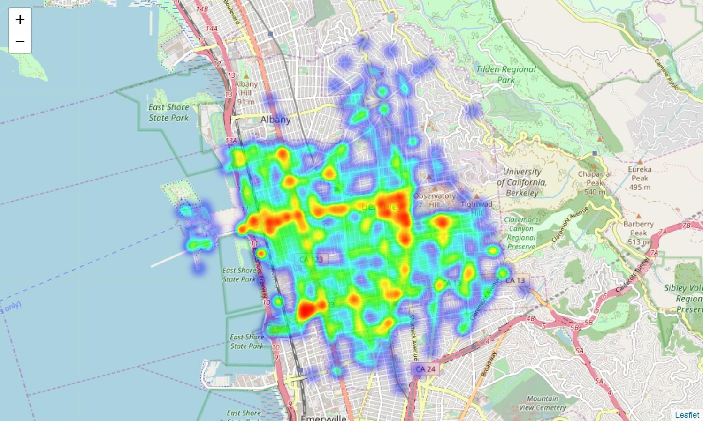
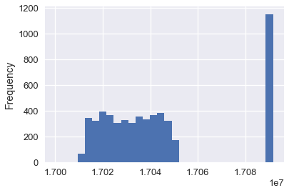

# 五、探索性数据分析

> 原文：[DS-100/textbook/notebooks/ch05](https://nbviewer.jupyter.org/github/DS-100/textbook/tree/master/notebooks/ch05/)
> 
> 校验：[飞龙](https://github.com/wizardforcel)
> 
> 自豪地采用[谷歌翻译](https://translate.google.cn/)

> 探索性数据分析是一种态度，一种灵活的状态，一种寻找那些我们认为不存在和存在的东西的心愿。
> 
> [John Tukey](https://en.wikipedia.org/wiki/John_Tukey)

在探索性数据分析（EDA），也就是数据科学生命周期的第三步中，我们总结，展示和转换数据，以便更深入地理解它。 特别是，通过 EDA，我们发现数据中的潜在问题，并发现可用于进一步分析的趋势。

我们试图了解我们数据的以下属性：

结构：我们数据文件的格式。
粒度：每行和每列的精细程度。
范围：我们的数据有多么完整或不完整。
时间性：数据是不是当时的情况。
忠实度：数据捕捉“现实”有多好。

尽管我们分别介绍了数据清理和 EDA 来有助于组织本书，但在实践中，你经常会在两者之间切换。 例如，列的可视化可能会向你展示，应使用数据清理技术进行处理的格式错误的值。 考虑到这一点，我们回顾伯克利警察局的数据集来进行探索。

## 结构和连接

### 结构

数据集的结构指的是数据文件的“形状”。 基本上，这指的是输入数据的格式。例如，我们看到呼叫数据集是 CSV（逗号分隔值）文件：

```
!head data/Berkeley_PD_-_Calls_for_Service.csv

CASENO,OFFENSE,EVENTDT,EVENTTM,CVLEGEND,CVDOW,InDbDate,Block_Location,BLKADDR,City,State
17091420,BURGLARY AUTO,07/23/2017 12:00:00 AM,06:00,BURGLARY - VEHICLE,0,08/29/2017 08:28:05 AM,"2500 LE CONTE AVE
Berkeley, CA
(37.876965, -122.260544)",2500 LE CONTE AVE,Berkeley,CA
17020462,THEFT FROM PERSON,04/13/2017 12:00:00 AM,08:45,LARCENY,4,08/29/2017 08:28:00 AM,"2200 SHATTUCK AVE
Berkeley, CA
(37.869363, -122.268028)",2200 SHATTUCK AVE,Berkeley,CA
17050275,BURGLARY AUTO,08/24/2017 12:00:00 AM,18:30,BURGLARY - VEHICLE,4,08/29/2017 08:28:06 AM,"200 UNIVERSITY AVE
Berkeley, CA
(37.865491, -122.310065)",200 UNIVERSITY AVE,Berkeley,CA
```

另一方面，截停数据集是 JSON（JavaScript 对象表示法）文件。

```
# Show first and last 5 lines of file
!head -n 5 data/stops.json
!echo '...'
!tail -n 5 data/stops.json

{
  "meta" : {
    "view" : {
      "id" : "6e9j-pj9p",
      "name" : "Berkeley PD - Stop Data",
...
, [ 31079, "C2B606ED-7872-4B0B-BC9B-4EF45149F34B", 31079, 1496269085, "932858", 1496269085, "932858", null, "2017-00024245", "2017-04-30T22:59:26", " UNIVERSITY AVE/6TH ST", "T", "BM2TWN; ", null, null ]
, [ 31080, "8FADF18D-7FE9-441D-8709-7BFEABDACA7A", 31080, 1496269085, "932858", 1496269085, "932858", null, "2017-00024250", "2017-04-30T23:19:27", " UNIVERSITY AVE /  WEST ST", "T", "HM4TCS; ", "37.8698757000001", "-122.286550846" ]
, [ 31081, "F60BD2A4-8C47-4BE7-B1C6-4934BE9DF838", 31081, 1496269085, "932858", 1496269085, "932858", null, "2017-00024254", "2017-04-30T23:38:34", " CHANNING WAY /  BOWDITCH ST", "1194", "AR; ", "37.867207539", "-122.256529377" ]
 ]
}
```

当然，还有很多其他类型的数据格式。 以下是最常见格式的列表：

+   逗号分隔值（CSV）和制表符分隔值（TSV）。 这些文件包含由逗号（CSV）或制表符（`\t`，TSV）分隔的表格数据。 这些文件通常很容易处理，因为数据的输入格式与`DataFrame`类似。

+   JavaScript 对象表示法（JSON）。 这些文件包含嵌套字典格式的数据。 通常我们必须将整个文件读为 Python 字典，然后弄清楚如何从字典中为`DataFrame`提取字段。

+   可扩展标记语言（XML）或超文本标记语言（HTML）。 这些文件也包含嵌套格式的数据，例如：

    ```xml
    <?xml version="1.0" encoding="UTF-8"?>
    <note>
        <to>Tove</to>
        <from>Jani</from>
        <heading>Reminder</heading>
        <body>Don't forget me this weekend!</body>
    </note>
    ```
    
    在后面的章节中，我们将使用 XPath 从这些类型的文件中提取数据。

+   日志数据。许多应用在运行时会以非结构化文本格式输出一些数据，例如：

    ```
    2005-03-23 23:47:11,663 - sa - INFO - creating an instance of aux_module.Aux
    2005-03-23 23:47:11,665 - sa.aux.Aux - INFO - creating an instance of Aux
    2005-03-23 23:47:11,665 - sa - INFO - created an instance of aux_module.Aux
    2005-03-23 23:47:11,668 - sa - INFO - calling aux_module.Aux.do_something
    2005-03-23 23:47:11,668 - sa.aux.Aux - INFO - doing something
    ```
    
    在后面的章节中，我们将使用正则表达式从这些类型的文件中提取数据。

### 连接（Join）

数据通常会分成多个表格。 例如，一张表可能描述一些人的个人信息，而另一张表可能包含他们的电子邮件：

```py
personal information while another will contain their emails:

people = pd.DataFrame(
    [["Joey",      "blue",    42,  "M"],
     ["Weiwei",    "blue",    50,  "F"],
     ["Joey",      "green",    8,  "M"],
     ["Karina",    "green",    7,  "F"],
     ["Nhi",       "blue",     3,  "F"],
     ["Sam",       "pink",   -42,  "M"]], 
    columns = ["Name", "Color", "Number", "Sex"])

people
```

|  | Name | Color | Number | Sex |
| --- | --- | --- | --- | --- |
| 0 | Joey | blue | 42 | M |
| 1 | Weiwei | blue | 50 | F |
| 2 | Joey | green | 8 | M |
| 3 | Karina | green | 7 | F |
| 4 | Fernando | pink | -9 | M |
| 5 | Nhi | blue | 3 | F |
| 6 | Sam | pink | -42 | M |

```py
email = pd.DataFrame(
    [["Deb",  "deborah_nolan@berkeley.edu"],
     ["Sam",  "samlau95@berkeley.edu"],
     ["John", "doe@nope.com"],
     ["Joey", "jegonzal@cs.berkeley.edu"],
     ["Weiwei", "weiwzhang@berkeley.edu"],
     ["Weiwei", "weiwzhang+123@berkeley.edu"],
     ["Karina", "kgoot@berkeley.edu"]], 
    columns = ["User Name", "Email"])

email
```

| | User Name | Email |
| --- | --- | --- |
| 0 | Deb | deborah_nolan@berkeley.edu |
| 1 | Sam | samlau95@berkeley.edu |
| 2 | John | doe@nope.com |
| 3 | Joey | jegonzal@cs.berkeley.edu |
| 4 | Weiwei | weiwzhang@berkeley.edu |
| 5 | Weiwei | weiwzhang+123@berkeley.edu |
| 6 | Karina | kgoot@berkeley.edu |

为了使每个人匹配他或她的电子邮件，我们可以在包含用户名的列上连接两个表。 然后，我们必须决定，如何处理出现在一张表上而没有在另一张表上的人。 例如，`Fernando`出现在`people`表中，但不出现在`email`表中。 我们有几种类型的连接，用于每个匹配缺失值的策略。 最常见的连接之一是内连接，其中任何不匹配的行都不放入最终结果中：

```py
# Fernando, Nhi, Deb, and John don't appear
people.merge(email, how='inner', left_on='Name', right_on='User Name')
```


| | Name | Color | Number | Sex | User Name | Email |
| --- | --- | --- | --- | --- | --- | --- |
| 0 | Joey | blue | 42 | M | Joey | jegonzal@cs.berkeley.edu |
| 1 | Joey | green | 8 | M | Joey | jegonzal@cs.berkeley.edu |
| 2 | Weiwei | blue | 50 | F | Weiwei | weiwzhang@berkeley.edu |
| 3 | Weiwei | blue | 50 | F | Weiwei | weiwzhang+123@berkeley.edu |
| 4 | Karina | green | 7 | F | Karina | kgoot@berkeley.edu |
| 5 | Sam | pink | -42 | M | Sam | samlau95@berkeley.edu |

这是我们经常使用的四个基本连接：内连接，全连接（有时称为“外连接”），左连接和右连接。 以下是个图表，展示了这些类型的连接之间的区别。


运行下面的代码，并使用生成的下拉菜单，来展示`people`和`email `表格的四种不同的连接的结果。 注意对于外，左和右连接，哪些行包含了`NaN`值。

```py
# HIDDEN
def join_demo(join_type):
    display(HTML('people and email tables:'))
    display_two(people, email)
    display(HTML('<br>'))
    display(HTML('Joined table:'))
    display(people.merge(email, how=join_type,
                         left_on='Name', right_on='User Name'))
    
interact(join_demo, join_type=['inner', 'outer', 'left', 'right']);
```

### 结构检查清单

查看数据集的结构之后，你应该回答以下问题。我们将根据呼叫和截停数据集回答它们。

数据是标准格式还是编码过的？

标准格式包括：

表格数据：CSV，TSV，Excel，SQL
嵌套数据：JSON，XML

呼叫数据集采用 CSV 格式，而截停数据集采用 JSON 格式。

数据是组织为记录形式（例如行）的吗？如果不是，我们可以通过解析数据来定义记录吗？

呼叫数据集按行出现；我们从截停数据集中提取记录。

数据是否嵌套？如果是这样，我们是否可以适当地提取非嵌套的数据？

呼叫数据集不是嵌套的；我们不必过于费力从截停数据集中获取非嵌套的数据。

数据是否引用了其他数据？如果是这样，我们可以连接数据吗？

呼叫数据集引用了星期表。连接这两张表让我们知道数据集中每个事件的星期。截取数据集没有明显的引用。

每个记录中的字段（例如，列）是什么？每列的类型是什么？

呼叫和截停数据集的字段，在每个数据集的“数据清理”一节中介绍。

## 粒度

数据的粒度是数据中每条记录代表什么。 例如，在呼叫数据集中，每条记录代表一次警务呼叫。

```py
# HIDDEN
calls = pd.read_csv('data/calls.csv')
calls.head()
```

|  | CASENO | OFFENSE | CVLEGEND | BLKADDR | EVENTDTTM | Latitude | Longitude | Day |
| --- | --- | --- | --- | --- | --- | --- | --- | --- |
| 0 | 17091420 | BURGLARY AUTO | BURGLARY - VEHICLE | 2500 LE CONTE AVE | 2017-07-23 06:00:00 | 37.876965 | -122.260544 | Sunday |
| 1 | 17038302 | BURGLARY AUTO | BURGLARY - VEHICLE | BOWDITCH STREET & CHANNING WAY | 2017-07-02 22:00:00 | 37.867209 | -122.256554 | Sunday |
| 2 | 17049346 | THEFT MISD. (UNDER $950) | LARCENY | 2900 CHANNING WAY | 2017-08-20 23:20:00 | 37.867948 | -122.250664 | Sunday |
| 3 | 17091319 | THEFT MISD. (UNDER $950) | LARCENY | 2100 RUSSELL ST | 2017-07-09 04:15:00 | 37.856719 | -122.266672 | Sunday |
| 4 | 17044238 | DISTURBANCE | DISORDERLY CONDUCT | TELEGRAPH AVENUE & DURANT AVE | 2017-07-30 01:16:00 | 37.867816 | -122.258994 | Sunday |

在截停数据集中，每条记录代表一次警务截停事件。

```py
# HIDDEN
stops = pd.read_csv('data/stops.csv', parse_dates=[1], infer_datetime_format=True)
stops.head()
```

|  | Incident Number | Call Date/Time | Location | Incident Type | Dispositions | Location - Latitude | Location - Longitude |
| --- | --- | --- | --- | --- | --- | --- | --- |
| 0 | 2015-00004825 | 2015-01-26 00:10:00 | SAN PABLO AVE / MARIN AVE | T | M | NaN | NaN |
| 1 | 2015-00004829 | 2015-01-26 00:50:00 | SAN PABLO AVE / CHANNING WAY | T | M | NaN | NaN |
| 2 | 2015-00004831 | 2015-01-26 01:03:00 | UNIVERSITY AVE / NINTH ST | T | M | NaN | NaN |
| 3 | 2015-00004848 | 2015-01-26 07:16:00 | 2000 BLOCK BERKELEY WAY | 1194 | BM4ICN | NaN | NaN |
| 4 | 2015-00004849 | 2015-01-26 07:43:00 | 1700 BLOCK SAN PABLO AVE | 1194 | BM4ICN | NaN | NaN |

另一方面，我们可能以下列格式收到接受数据：

```py
# HIDDEN
(stops
 .groupby(stops['Call Date/Time'].dt.date)
 .size()
 .rename('Num Incidents')
 .to_frame()
)
```

|  | Num Incidents |
| --- | --- |
| Call Date/Time |  |
| 2015-01-26 | 46 |
| 2015-01-27 | 57 |
| 2015-01-28 | 56 |
| ... | ... |
| 2017-04-28 | 82 |
| 2017-04-29 | 86 |
| 2017-04-30 | 59 |

825 rows × 1 columns

在这种情况下，表格中的每个记录对应于单个日期而不是单个事件。 我们会将此表描述为，它具有比上述更粗的粒度。 了解数据的粒度非常重要，因为它决定了你可以执行哪种分析。 一般来说，细粒度由于粗粒度；虽然我们可以使用分组和旋转将细粒度变为粗粒度，但我们没有几个工具可以由粗到精。

### 粒度检查清单

查看数据集的粒度后，你应该回答以下问题。我们将根据呼叫和截停数据集回答他们。

一条记录代表了什么？

在呼叫数据集中，每条记录代表一次警务呼叫。在截停数据集中，每条记录代表一次警务截停事件。

所有记录的粒度是否在同一级别？ （有时一个表格将包含汇总行。）

是的，对于呼叫和截停数据集是如此。

如果数据是聚合的，聚合是如何进行的？采样和平均是常见的聚合。

就有印象记住，在两个数据集中，位置都是输入为街区，而不是特定的地址。

我们可以对数据执行什么类型的聚合？

例如，随着时间的推移，将个体聚合为人口统计分组，或个体事件聚合为总数。

在这种情况下，我们可以聚合为不同的日期或时间粒度。例如，我们可以使用聚合，找到事件最常见的一天的某个小时。我们也可能能够按照事件地点聚合，来发现事件最多的伯克利地区。

## 范围

数据集的范围是指数据集的覆盖面，与我们有兴趣分析的东西相关。我们试图回答我们数据范围的以下问题：

数据是否涵盖了感兴趣的话题？

例如，呼叫和截停数据集包含在伯克利发生的呼叫和截停事件。然而，如果我们对加利福尼亚州的犯罪事件感兴趣，那么这些数据集的范围将会过于有限。

一般来说，较大的范围比较小的范围更有用，因为我们可以将较大的范围过滤为较小的范围，但通常不能从较小的范围转到较大的范围。例如，如果我们有美国的警务截停数据集，我们可以取数据集的子集，来调查伯克利。

请记住，范围是一个广义术语，并不总是用于描述地理位置。例如，它也可以指时间覆盖面 - 呼叫数据集仅包含 180 天的数据。

在调查数据生成的过程中，我们经常会处理数据集的范围，并在 EDA 期间确认数据集的范围。让我们来确认呼叫数据集的地理和时间范围。

```py
calls
```


| | CASENO | OFFENSE | CVLEGEND | BLKADDR | EVENTDTTM | Latitude | Longitude | Day |
| --- | --- | --- | --- | --- | --- | --- | --- | --- |
| 0 | 17091420 | BURGLARY AUTO | BURGLARY - VEHICLE | 2500 LE CONTE AVE | 2017-07-23 06:00:00 | 37.876965 | -122.260544 | Sunday |
| 1 | 17038302 | BURGLARY AUTO | BURGLARY - VEHICLE | BOWDITCH STREET & CHANNING WAY | 2017-07-02 22:00:00 | 37.867209 | -122.256554 | Sunday |
| 2 | 17049346 | THEFT MISD. (UNDER $950) | LARCENY | 2900 CHANNING WAY | 2017-08-20 23:20:00 | 37.867948 | -122.250664 | Sunday |
| ... | ... | ... | ... | ... | ... | ... | ... | ... |
| 5505 | 17021604 | IDENTITY THEFT | FRAUD | 100 MONTROSE RD | 2017-03-31 00:00:00 | 37.896218 | -122.270671 | Friday |
| 5506 | 17033201 | DISTURBANCE | DISORDERLY CONDUCT | 2300 COLLEGE AVE | 2017-06-09 22:34:00 | 37.868957 | -122.254552 | Friday |
| 5507 | 17047247 | BURGLARY AUTO | BURGLARY - VEHICLE | UNIVERSITY AVENUE & CHESTNUT ST | 2017-08-11 20:00:00 | 37.869679 | -122.288038 | Friday |

5508 rows × 8 columns

```py
# Shows earliest and latest dates in calls
calls['EVENTDTTM'].dt.date.sort_values()
'''
1384    2017-03-02
1264    2017-03-02
1408    2017-03-02
           ...    
3516    2017-08-28
3409    2017-08-28
3631    2017-08-28
Name: EVENTDTTM, Length: 5508, dtype: object
'''
```

```py
calls['EVENTDTTM'].dt.date.max() - calls['EVENTDTTM'].dt.date.min()
# datetime.timedelta(179)
```

该表格包含 179 天的时间段的数据，该时间段足够接近数据描述中的 180 天，我们可以假设 2017 年 4 月 14 日或 2017 年 8 月 29 日没有呼叫。

为了检查地理范围，我们可以使用地图：

```py
import folium # Use the Folium Javascript Map Library
import folium.plugins

SF_COORDINATES = (37.87, -122.28)
sf_map = folium.Map(location=SF_COORDINATES, zoom_start=13)
locs = calls[['Latitude', 'Longitude']].astype('float').dropna().as_matrix()
heatmap = folium.plugins.HeatMap(locs.tolist(), radius = 10)
sf_map.add_child(heatmap)
```



除少数例外情况外，呼叫数据集覆盖了伯克利地区。 我们可以看到，大多数警务呼叫发生在伯克利市中心和 UCB 校区的南部。

现在我们来确认截停数据集的时间和地理范围：

```py
stops
```


| | Incident Number | Call Date/Time | Location | Incident Type | Dispositions | Location - Latitude | Location - Longitude |
| --- | --- | --- | --- | --- | --- | --- | --- |
| 0 | 2015-00004825 | 2015-01-26 00:10:00 | SAN PABLO AVE / MARIN AVE | T | M | NaN | NaN |
| 1 | 2015-00004829 | 2015-01-26 00:50:00 | SAN PABLO AVE / CHANNING WAY | T | M | NaN | NaN |
| 2 | 2015-00004831 | 2015-01-26 01:03:00 | UNIVERSITY AVE / NINTH ST | T | M | NaN | NaN |
| ... | ... | ... | ... | ... | ... | ... | ... |
| 29205 | 2017-00024245 | 2017-04-30 22:59:26 | UNIVERSITY AVE/6TH ST | T | BM2TWN | NaN | NaN |
| 29206 | 2017-00024250 | 2017-04-30 23:19:27 | UNIVERSITY AVE / WEST ST | T | HM4TCS | 37.869876 | -122.286551 |
| 29207 | 2017-00024254 | 2017-04-30 23:38:34 | CHANNING WAY / BOWDITCH ST | 1194 | AR | 37.867208 | -122.256529 |

29208 rows × 7 columns

```py
stops['Call Date/Time'].dt.date.sort_values()
'''
0        2015-01-26
25       2015-01-26
26       2015-01-26
            ...    
29175    2017-04-30
29177    2017-04-30
29207    2017-04-30
Name: Call Date/Time, Length: 29208, dtype: object
'''
```

如承诺的那样，数据收集工作从 2015 年 1 月 26 日开始。因为它在 2017 年 4 月 30 日起停止，数据似乎在 2017 年 5 月初左右下载。让我们绘制地图来查看地理数据：

```py
SF_COORDINATES = (37.87, -122.28)
sf_map = folium.Map(location=SF_COORDINATES, zoom_start=13)
locs = stops[['Location - Latitude', 'Location - Longitude']].astype('float').dropna().as_matrix()
heatmap = folium.plugins.HeatMap(locs.tolist(), radius = 10)
sf_map.add_child(heatmap)
```



我们可以证实，数据集中在伯克利发生的警务截停，以及大多数警务呼叫，都发生在伯克利市中心和伯克利西部地区。

## 时间性

时间性是指数据在时间上如何表示，特别是数据集中的日期和时间字段。我们试图通过这些字段来了解以下特征：

数据集中日期和时间字段的含义是什么？

在呼叫和截停数据集中，日期时间字段表示警务呼叫或截停的时间。然而，截停数据集最初还有一个日期时间字段，记录案件什么时候输入到数据库，我们在数据清理过程中将其移除，因为我们认为它不适用于分析。

另外，我们应该注意日期时间字段的时区和夏令时，特别是在处理来自多个位置的数据的时候。

日期和时间字段在数据中有什么表示形式？

虽然美国使用`MM/DD/YYYY`格式，但许多其他国家使用`DD/MM/YYYY`格式。仍有更多格式在世界各地使用，分析数据时认识到这些差异非常重要。

在呼叫和截停数据集中，日期显示为`MM/DD/YYYY`格式。

是否有奇怪的时间戳，它可能代表空值？

某些程序使用占位符而不是空值。例如，Excel 的默认日期是 1990 年 1 月 1 日，而 Mac 上的 Excel 则是 1904 年 1 月 1 日。许多应用将生成 1970 年 1 月 1 日 12:00 或 1969 年 12 月 31 日 11:59 pm 的默认日期时间，因为这是用于时间戳的 Unix 纪元。如果你在数据中注意到这些时间戳的多个实例，则应该谨慎并仔细检查数据源。 呼叫或截停数据集都不包含任何这些可疑值。

## 忠实度

如果我们相信它能准确捕捉现实，我们将数据集描述为“忠实的”。通常，不可信的数据集包含：

不切实际或不正确的值

例如，未来的日期，不存在的位置，负数或较大离群值。

明显违反的依赖关系

例如，个人的年龄和生日不匹配。

手动输入的数据

我们看到，这些通常充满了拼写错误和不一致。

明显的数据伪造迹象

例如，重复的名称，伪造的电子邮件地址，或重复使用不常见的名称或字段。

注意与数据清理的许多相似之处。 我们提到，我们经常在数据清理和 EDA 之间来回切换，特别是在确定数据忠实度的时候。 例如，可视化经常帮助我们识别数据中的奇怪条目。

```py
calls = pd.read_csv('data/calls.csv')
calls.head()
```


| | CASENO | OFFENSE | EVENTDT | EVENTTM | ... | BLKADDR | Latitude | Longitude | Day |
| --- | --- | --- | --- | --- | --- | --- | --- | --- | --- |
| 0 | 17091420 | BURGLARY AUTO | 07/23/2017 12:00:00 AM | 06:00 | ... | 2500 LE CONTE AVE | 37.876965 | -122.260544 | Sunday |
| 1 | 17038302 | BURGLARY AUTO | 07/02/2017 12:00:00 AM | 22:00 | ... | BOWDITCH STREET & CHANNING WAY | 37.867209 | -122.256554 | Sunday |
| 2 | 17049346 | THEFT MISD. (UNDER $950) | 08/20/2017 12:00:00 AM | 23:20 | ... | 2900 CHANNING WAY | 37.867948 | -122.250664 | Sunday |
| 3 | 17091319 | THEFT MISD. (UNDER $950) | 07/09/2017 12:00:00 AM | 04:15 | ... | 2100 RUSSELL ST | 37.856719 | -122.266672 | Sunday |
| 4 | 17044238 | DISTURBANCE | 07/30/2017 12:00:00 AM | 01:16 | ... | TELEGRAPH AVENUE & DURANT AVE | 37.867816 | -122.258994 | Sunday |

5 rows × 9 columns

```py
calls['CASENO'].plot.hist(bins=30)
# <matplotlib.axes._subplots.AxesSubplot at 0x1a1ebb2898>
```



请注意`17030000`和`17090000`处的非预期的簇。通过绘制案例编号的分布，我们可以很快查看数据中的异常。 在这种情况下，我们可能会猜测，两个不同的警察团队为他们的呼叫使用不同的案件编号。

数据探索通常会发现异常情况；如果可以修复，我们可以使用数据清理技术。
