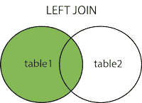

# SQL 连接

> 原文：[https://www.bookbookmark.ds100.org/ch/09/sql_joins.html](https://www.bookbookmark.ds100.org/ch/09/sql_joins.html)

```
# HIDDEN
# Clear previously defined variables
%reset -f

# Set directory for data loading to work properly
import os
os.chdir(os.path.expanduser('~/notebooks/09'))

```

```
# HIDDEN
import warnings
# Ignore numpy dtype warnings. These warnings are caused by an interaction
# between numpy and Cython and can be safely ignored.
# Reference: https://stackoverflow.com/a/40846742
warnings.filterwarnings("ignore", message="numpy.dtype size changed")
warnings.filterwarnings("ignore", message="numpy.ufunc size changed")

import numpy as np
import matplotlib.pyplot as plt
import pandas as pd
import seaborn as sns
%matplotlib inline
import ipywidgets as widgets
from ipywidgets import interact, interactive, fixed, interact_manual
import nbinteract as nbi

sns.set()
sns.set_context('talk')
np.set_printoptions(threshold=20, precision=2, suppress=True)
pd.options.display.max_rows = 7
pd.options.display.max_columns = 8
pd.set_option('precision', 2)
# This option stops scientific notation for pandas
# pd.set_option('display.float_format', '{:.2f}'.format)

```

```
# HIDDEN
# Make names table
sql_expr = """
CREATE TABLE names(
    cat_id INTEGER PRIMARY KEY,
    name TEXT);
"""
result = sqlite_engine.execute(sql_expr)

# Populate names table
sql_expr = """
INSERT INTO names VALUES 
(0, "Apricot"),
(1, "Boots"),
(2, "Cally"),
(4, "Eugene");
"""

result = sqlite_engine.execute(sql_expr)

```

```
# HIDDEN
# Make colors table
sql_expr = """
CREATE TABLE colors(
    cat_id INTEGER PRIMARY KEY,
    color TEXT);
"""
result = sqlite_engine.execute(sql_expr)

# Populate colors table
sql_expr = """
INSERT INTO colors VALUES 
(0, "orange"),
(1, "black"),
(2, "calico"),
(3, "white");
"""

result = sqlite_engine.execute(sql_expr)

```

```
# HIDDEN
# Make ages table
sql_expr = """
CREATE TABLE ages(
    cat_id INTEGER PRIMARY KEY,
    age INT);
"""
result = sqlite_engine.execute(sql_expr)

# Populate ages table
sql_expr = """
INSERT INTO ages VALUES 
(0, 4),
(1, 3),
(2, 9),
(4, 20);
"""

result = sqlite_engine.execute(sql_expr)

```

在`pandas`中，我们使用`pd.merge`方法在两个表的列中使用匹配的值连接两个表。例如：

```
pd.merge(table1, table2, on='common_column')

```

在本节中，我们将介绍 SQL 连接。SQL 连接用于组合关系数据库中的多个表。

假设我们是猫店的老板，有一个我们店里猫的数据库。我们有**两个**不同的表：`names`和`colors`。`names`表包含列`cat_id`、分配给每个 cat 的唯一编号和 cat 的名称`name`。`colors`表包含列`cat_id`和`color`，每只猫的颜色。

请注意，两个表中都有一些缺少的行-`names`表中缺少一行带有`cat_id`3，而`colors`表中缺少一行带有`cat_id`4。

<header style="text-align:center">**names**</header>

| 猫科动物 | 名称 |
| --- | --- |
| 零 | 杏 |
| 1 个 | 靴子 |
| 二 | 凯利 |
| 四 | 尤金 |

<header style="text-align:center">**colors**</header>

| cat_id | 颜色 |
| --- | --- |
| 0 | 橙色 |
| 1 | 黑色 |
| 2 | 印花布 |
| 三 | 白色 |

要计算名为杏的猫的颜色，我们必须在两个表中使用信息。我们可以将 _ 连接到 _ 列上的表，用`name`和`color`创建一个新表。

## 连接[¶](#Joins)

连接通过在表的列中匹配值来组合表。

连接有四种主要类型：内部连接、外部连接、左侧连接和右侧连接。尽管这四个表都是组合表，但每个表对不匹配的值的处理方式不同。

### 内部连接

**定义：**在内部连接中，最终表只包含在**两个**表中具有匹配列的行。


**示例：**我们希望将`names`和`colors`表连接在一起，以匹配每只猫的颜色。因为这两个表都包含一个`cat_id`列，该列是 cat 的唯一标识符，所以我们可以在`cat_id`列上使用内部连接。

**sql:**要在 sql 中编写内部连接，我们修改了`FROM`子句以使用以下语法：

```
SELECT ...
FROM <TABLE_1>
    INNER JOIN <TABLE_2>
    ON <...>

```

例如：

```
SELECT *
FROM names AS N
    INNER JOIN colors AS C
    ON N.cat_id = C.cat_id;

```

|  | cat_id | name | cat_id | color |
| --- | --- | --- | --- | --- |
| 零 | 0 | Apricot | 0 | orange |
| --- | --- | --- | --- | --- |
| 1 个 | 1 | Boots | 1 | black |
| --- | --- | --- | --- | --- |
| 二 | 2 | Cally | 2 | calico |
| --- | --- | --- | --- | --- |

您可以验证每个 cat 名称是否与其颜色匹配。请注意，结果表中不存在带有`cat_id`3 和 4 的 cats，因为`colors`表没有带有`cat_id`4 的行，而`names`表没有带有`cat_id`3 的行。在内部连接中，如果一行在另一个表中没有匹配的值，则该行不包括在最终结果中。

假设我们有一个名为`names`的数据帧和一个名为`colors`的数据帧，我们可以通过编写以下内容在`pandas`中执行内部连接：

```
pd.merge(names, colors, how='inner', on='cat_id')

```

### 全/外接

**定义：**在完全连接（有时称为外部连接）中，**两个表**中的所有记录都包含在连接表中。如果一行在另一个表中没有匹配项，则用`NULL`填充缺少的值。


**示例：**和前面一样，我们将`names`和`colors`表连接在一起，以匹配每只猫的颜色。这一次，我们希望将所有行保留在两个表中，即使没有匹配的行。

**sql:**要在 sql 中编写外部连接，我们修改了`FROM`子句，以使用以下语法：

```
SELECT ...
FROM <TABLE_1>
    FULL JOIN <TABLE_2>
    ON <...>

```

For example:

```
SELECT name, color
FROM names N
    FULL JOIN colors C
    ON N.cat_id = C.cat_id;

```

| cat_id | name | color |
| --- | --- | --- |
| 0 | Apricot | orange |
| 1 | Boots | black |
| 2 | Cally | calico |
| 3 | 无效的 | white |
| 4 | Eugene | NULL |

请注意，最终输出包含带有`cat_id`3 和 4 的条目。如果一行没有匹配项，它仍然包含在最终输出中，并且任何缺少的值都用`NULL`填充。

在`pandas`中：

```
pd.merge(names, colors, how='outer', on='cat_id')
```

### 左连接[¶](#Left-Join)

**定义：**在左连接中，来自**左表**的所有记录都包含在连接表中。如果行在右表中没有匹配项，则缺少的值将用`NULL`填充。



**示例：**和前面一样，我们将`names`和`colors`表连接在一起，以匹配每只猫的颜色。这次，我们要保留所有的猫名，即使一只猫没有匹配的颜色。

**sql:**要在 sql 中编写左连接，我们修改了`FROM`子句以使用以下语法：

```
SELECT ...
FROM <TABLE_1>
    LEFT JOIN <TABLE_2>
    ON <...>

```

For example:

```
SELECT name, color
FROM names N
    LEFT JOIN colors C
    ON N.cat_id = C.cat_id;

```

| cat_id | name | color |
| --- | --- | --- |
| 0 | Apricot | orange |
| 1 | Boots | black |
| 2 | Cally | calico |
| 4 | Eugene | NULL |

请注意，最终输出包括所有四个 cat 名称。`names`关系中的三个`cat_id`s 在`colors`表中与`cat_id`s 匹配，一个不匹配（eugene）。没有匹配颜色的猫名的颜色为`NULL`。

In `pandas`:

```
pd.merge(names, colors, how='left', on='cat_id')
```

### 右连接[¶](#Right-Join)

**定义：**在右连接中，来自**右表**的所有记录都包含在连接表中。如果左表中的行不匹配，则用`NULL`填充缺少的值。


**示例：**和前面一样，我们将`names`和`colors`表连接在一起，以匹配每只猫的颜色。这一次，我们要保留所有的猫的颜色，即使一只猫没有匹配的名字。

**sql:**要在 sql 中编写正确的 join，我们修改了`FROM`子句以使用以下语法：

```
SELECT ...
FROM <TABLE_1>
    RIGHT JOIN <TABLE_2>
    ON <...>

```

For example:

```
SELECT name, color
FROM names N
    RIGHT JOIN colors C
    ON N.cat_id = C.cat_id;

```

| cat_id | name | color |
| --- | --- | --- |
| 0 | Apricot | orange |
| 1 | Boots | black |
| 2 | Cally | calico |
| 3 | NULL | white |

这一次，观察最终输出包括所有四种 CAT 颜色。`colors`关系中的三个`cat_id`s 与`names`表中的`cat_id`s 匹配，一个不匹配（白色）。没有匹配名称的 cat 颜色的名称为`NULL`。

您还可能注意到，右连接产生的结果与交换表顺序的左连接相同。即，`names`左接`colors`与`colors`右接`names`相同。因此，一些 SQL 引擎（如 sqlite）不支持右连接。

In `pandas`:

```
pd.merge(names, colors, how='right', on='cat_id')
```

### 隐式内部连接[¶](#Implicit-Inner-Joins)

在 SQL 中通常有多种方法来完成同一个任务，就像在 Python 中有多种方法来完成同一个任务一样。我们指出了另一种编写内部连接的方法，这种方法在实践中出现，称为 _ 隐式连接 _。回想一下，我们之前编写了以下内容来进行内部连接：

```
SELECT *
FROM names AS N
    INNER JOIN colors AS C
    ON N.cat_id = C.cat_id;

```

隐式内部连接的语法稍有不同。请特别注意，`FROM`子句使用逗号从两个表中进行选择，并且查询包含一个`WHERE`子句来指定连接条件。

```
SELECT *
FROM names AS N, colors AS C
WHERE N.cat_id = C.cat_id;

```

当在`FROM`子句中指定多个表时，SQL 将创建一个表，其中包含每个表中的每一行组合。例如：

```
sql_expr = """
SELECT *
FROM names N, colors C
"""
pd.read_sql(sql_expr, sqlite_engine)

```

|  | cat_id | name | cat_id | color |
| --- | --- | --- | --- | --- |
| 0 | 0 | Apricot | 0 | orange |
| --- | --- | --- | --- | --- |
| 1 | 0 | Apricot | 1 | black |
| --- | --- | --- | --- | --- |
| 2 | 0 | Apricot | 2 | calico |
| --- | --- | --- | --- | --- |
| 三 | 0 | Apricot | 3 | white |
| --- | --- | --- | --- | --- |
| 四 | 1 | Boots | 0 | orange |
| --- | --- | --- | --- | --- |
| 5 个 | 1 | Boots | 1 | black |
| --- | --- | --- | --- | --- |
| 六 | 1 | Boots | 2 | calico |
| --- | --- | --- | --- | --- |
| 七 | 1 | Boots | 3 | white |
| --- | --- | --- | --- | --- |
| 8 个 | 2 | Cally | 0 | orange |
| --- | --- | --- | --- | --- |
| 九 | 2 | Cally | 1 | black |
| --- | --- | --- | --- | --- |
| 10 个 | 2 | Cally | 2 | calico |
| --- | --- | --- | --- | --- |
| 11 个 | 2 | Cally | 3 | white |
| --- | --- | --- | --- | --- |
| 12 个 | 4 | Eugene | 0 | orange |
| --- | --- | --- | --- | --- |
| 十三 | 4 | Eugene | 1 | black |
| --- | --- | --- | --- | --- |
| 十四 | 4 | Eugene | 2 | calico |
| --- | --- | --- | --- | --- |
| 15 个 | 4 | Eugene | 3 | white |
| --- | --- | --- | --- | --- |

此操作通常称为 _ 笛卡尔积 _：第一个表中的每一行都与第二个表中的每一行成对出现。请注意，许多行包含的 cat 颜色与它们的名称不匹配。隐式连接中的附加`WHERE`子句筛选出没有匹配`cat_id`值的行。

```
SELECT *
FROM names AS N, colors AS C
WHERE N.cat_id = C.cat_id;

```

|  | cat_id | name | cat_id | color |
| --- | --- | --- | --- | --- |
| 0 | 0 | Apricot | 0 | orange |
| --- | --- | --- | --- | --- |
| 1 | 1 | Boots | 1 | black |
| --- | --- | --- | --- | --- |
| 2 | 2 | Cally | 2 | calico |
| --- | --- | --- | --- | --- |

## 连接多个表[¶](#Joining-Multiple-Tables)

若要连接多个表，请使用附加的`JOIN`运算符扩展`FROM`子句。例如，下表`ages`包括每只猫的年龄数据。

| cat_id | 年龄 |
| --- | --- |
| 0 | 4 |
| 1 | 3 |
| 2 | 九 |
| 4 | 20 个 |

要在`names`、`colors`和`ages`表上执行内部连接，我们编写：

```
# Joining three tables

sql_expr = """
SELECT name, color, age
    FROM names n
    INNER JOIN colors c ON n.cat_id = c.cat_id
    INNER JOIN ages a ON n.cat_id = a.cat_id;
"""
pd.read_sql(sql_expr, sqlite_engine)

```

|  | name | color | age |
| --- | --- | --- | --- |
| 0 | Apricot | orange | 4 |
| --- | --- | --- | --- |
| 1 | Boots | black | 3 |
| --- | --- | --- | --- |
| 2 | Cally | calico | 9 |
| --- | --- | --- | --- |

## 摘要[¶](#Summary)

我们已经介绍了四种主要的 SQL 连接类型：内部连接、完整连接、左连接和右连接。我们使用所有四个连接将信息组合在单独的关系中，并且每个连接只在处理输入表中不匹配行的方式上有所不同。