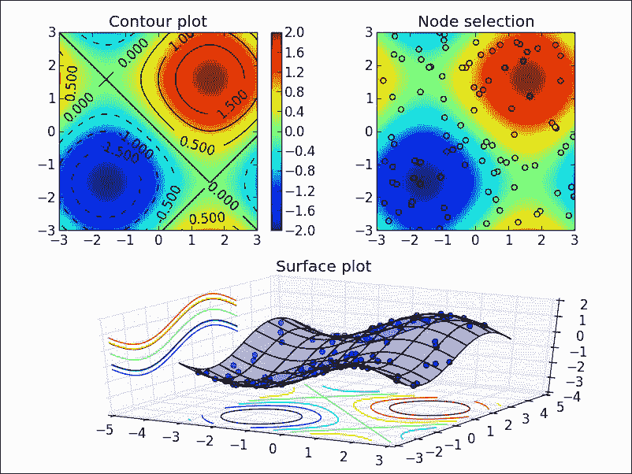
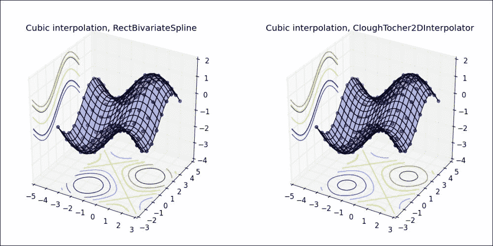
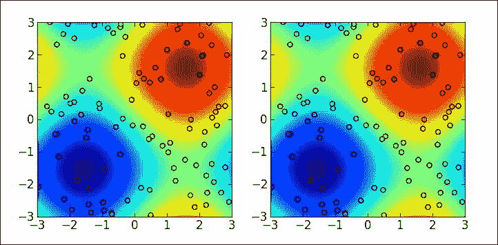

# 二、插值和近似

近似理论指出了如何从某个预定类中的另一个函数中找到给定函数的最佳近似，以及这种近似的效果如何。 在本章中，我们将通过两个设置来探索该字段：**插值**和**最小二乘近似**。

# 动机

考虑一个气象实验，该实验测量海上矩形矩形网格上一组浮标的温度。 我们可以通过指示 16×16 位置的网格上的浮标的经度和纬度，以及它们上的随机温度在 36ºF 至 46ºF 之间来模拟这样的实验：

```py
In [1]: import numpy as np, matplotlib.pyplot as plt, \
 ...: matplotlib.cm as cm; \
 ...: from mpl_toolkits.basemap import Basemap
In [2]: map1 = Basemap(projection='ortho', lat_0=20, lon_0=-60, \
 ...:                resolution='l', area_thresh=1000.0); \
 ...: map2 = Basemap(projection='merc', lat_0=20, lon_0=-60, \
 ...:                resolution='l', area_thresh=1000.0, \
 ...:                llcrnrlat=0,  urcrnrlat=45, \
 ...:                llcrnrlon=-75, urcrnrlon=-15)
In [3]: longitudes = np.linspace(-60, -30, 16); \
 ...: latitudes = np.linspace(15, 30, 16); \
 ...: lons, lats = np.meshgrid(longitudes, latitudes); \
 ...: temperatures = 10\. * np.random.randn(16, 16) + 36.
In [4]: x1, y1 = map1(lons, lats); \
 ...: x2, y2 = map2(lons, lats)
In [5]: plt.rc('text', usetex=True); \
 ...: plt.figure()
In [6]: plt.subplot(121, aspect='equal'); \
 ...: map1.drawmeridians(np.arange(0, 360, 30)); \
 ...: map1.drawparallels(np.arange(-90, 90, 15)); \
 ...: map1.drawcoastlines(); \
 ...: map1.fillcontinents(color='coral'); \
 ...: map1.scatter(x1, y1, 15, temperatures, cmap=cm.gray)
In [7]: plt.subplot(122); \
 ...: map2.drawmeridians(np.arange(0, 360, 30)); \
 ...: map2.drawparallels(np.arange(-90, 90, 15)); \
 ...: map2.drawcoastlines(); \
 ...: map2.fillcontinents(color='coral'); \
 ...: C = map2.scatter(x2, y2, 15, temperatures, cmap=cm.gray); \
 ...: Cb = map2.colorbar(C, "bottom", size="5%", pad="2%"); \
 ...: Cb.set_label(r'$\mbox{}^{\circ} F$'); \
 ...: plt.show()

```

我们获得下图：


可以猜测这些浮标之间的温度（不完全准确，但至少在一定程度上），因为温度是地球表面的光滑函数。 让我们假设，我们需要借助三阶分段 2D 多项式进行近似，并且在块彼此相交处具有最大的平滑度。 当然，一个明显的挑战是浮标不是位于平面上，而是在一个很大的球体的表面上。 对于 SciPy 而言，这不是问题。

```py
In [8]: from scipy.interpolate import RectSphereBivariateSpline \
 ...: as RSBS
In [9]: soln = RSBS(np.radians(latitudes), \
 ...:            np.pi + np.radians(longitudes), \
 ...:            temperatures)
In [10]: long_t = np.linspace(-60, -30, 180); \
 ....: lat_t = np.linspace(15, 30, 180); \
 ....: temperatures = soln(np.radians(lat_t), \
 ....:                     np.pi + np.radians(long_t))
In [11]: long_t, lat_t = np.meshgrid(long_t, lat_t); \
 ....: lo1, la1 = map1(long_t, lat_t); \
 ....: lo2, la2 = map2(long_t, lat_t)
In [12]: plt.figure()
Out[12]: <matplotlib.figure.Figure at 0x10ec28250>
In [13]: plt.subplot(121, aspect='equal'); \
 ....: map1.drawmeridians(np.arange(0, 360, 30)); \
 ....: map1.drawparallels(np.arange(-90, 90, 15)); \
 ....: map1.drawcoastlines(); \
 ....: map1.fillcontinents(color='coral'); \
 ....: map1.contourf(lo1, la1, temperatures, cmap=cm.gray)
Out[13]: <matplotlib.contour.QuadContourSet instance at 0x10f63d7e8>
In [14]: plt.subplot(122); \
 ....: map2.drawmeridians(np.arange(0, 360, 30)); \
 ....: map2.drawparallels(np.arange(-90, 90, 15)); \
 ....: map2.drawcoastlines(); \
 ....: map2.fillcontinents(color='coral'); \
 ....: C = map2.contourf(lo2, la2, temperatures, cmap=cm.gray); \
 ....: Cb = map2.colorbar(C, "bottom", size="5%", pad="2%"); \
 ....: Cb.set_label(r'$\mbox{}^{\circ} F$'); \
 ....: plt.show()

```


我们已经通过简单地通过将温度函数表示为与浮标位置上的温度值相符的分段多项式曲面来解决了这个问题。 这在技术上称为球面上的矩形节点网格上具有双变量样条的插值。

在其他情况下，只要结果函数与实际温度更紧密相关，这些位置的精确值就不是很重要。 在这种情况下，我们不希望执行插值，而是要计算具有相同功能类的元素的近似值。

让我们精确地定义两个设置：

插值问题需要三个要素：

*   有限域上的目标函数`f(x)`（为方便起见，我们用`x`表示）。
*   域中的一组有限点：插值的节点，我们用`xi`表示。 我们还将需要在这些节点处评估目标函数（可能还有其某些派生函数）。 在本章中，我们用`yi`表示这些。
*   插值族：具有与目标函数相同的输入/输出结构的函数。

插值问题的目标是通过匹配节点上目标函数的值，使插值成员对目标函数进行近似。

我们在以下设置中探索插值：

*   最近邻插值（任何维度）
*   通过分段线性函数进行插值（任意维度）
*   通过多项式进行单变量插值（Lagrange 和 Hermite 插值）
*   分段多项式的单变量插值
*   通过样条线进行单变量和双变量插值
*   径向基多元插值

### 提示

我们假设熟悉样条线的理论和应用。 有很多很好的入门资料，但我们建议您使用一些更实用的口味：

*   Carl de Boor，*花键实用指南*。 施普林格（1978）。
*   Paul Dierckx，*曲线和样条曲线*的曲面拟合。 牛津大学出版社，1993 年。

所有插值均通过模块`scipy.interpolate`进行。 特别是，与样条相关的是 Paul Dierckx `FITPACK`库中某些例程的一组包装。

要定义近似问题，我们需要以下四个要素：

*   有限域`x`上的目标函数`f(x)`，该函数以尺寸为`n`的列向量作为输入并输出尺寸为`m`的列向量
*   一系列近似值`{g[a](x)}`：具有与`f(x)`相同的输入/输出结构，其功能取决于参数`a`，该参数编码为尺寸为`r`的列向量
*   `norm`是一种用于测量`x, ||f(x) - g(x)||`任意两个给定功能之间距离的功能

近似问题的目标是找到相对于参数`a`最小化表达式`||f(x) - g[a](x)||`的近似成员。 这等效于相对于`a`为`error`功能`F(a) = ||f(x) - g[a](x)||`找到`a`（局部或全局）最小值。

我们说，如果近似族是一个基本元素的线性组合并且参数`a`作为系数，则近似是**线性**； 否则，我们将近似值称为**非线性**。

在本章中，我们将介绍以下设置中的近似函数：

*   通用线性最小二乘近似（通过求解线性方程组）
*   单变量和二变量样条的最小二乘近似/平滑
*   球上矩形网格上的样条最小二乘近似/平滑
*   通用非线性最小二乘近似（使用 Levenberg-Marquardt 迭代算法）

函数上下文中的最小二乘近似通过几个模块执行：

*   对于一般的线性最小二乘近似，可以始终将问题简化为线性方程组的解。 在这种情况下，我们在上一章研究的`scipy.linalg`和`scipy.sparse.linalg`模块拥有我们需要的所有算法。 如前所述，所需的函数是 Fortran 库`BLAS`和`LAPACK`和`C`库`SuperLU`中几个例程的包装。
*   对于通过样条线进行线性最小二乘近似的特殊情况，`scipy.interpolate`模块执行许多功能（针对所有不同情况），这些功能又是 Paul Diercks 的 Fortran 库`FITPACK`中的例程包装。
*   对于非线性最小二乘近似，我们使用来自`scipy.optimize`模块的函数。 这些函数是 Fortran 库`MINPACK`中`LMDIF`和`LMDER`例程的包装。

### 提示

有关这些 Fortran 库的更多信息，可以从 Netlib 存储库中的它们的页面中获得很好的参考：

*   FITPACK： [http://netlib.org/dierckx/](http://netlib.org/dierckx/)
*   MINPACK： [http://netlib.org/minpack/](http://netlib.org/minpack/)
*   FFTPACK： [http://netlib.org/fftpack/](http://netlib.org/fftpack/)

可以从[的创建者处找到`SuperLU`的最佳参考文献，网址为 http://crd-legacy.lbl.gov/~xiaoye/SuperLU/](http://crd-legacy.lbl.gov/~xiaoye/SuperLU/) 。

# 插补

我们有三种不同的实现方法来处理插值问题：

*   **程序**模式，该模式计算代表实际解决方案的一组数据点（以`ndarray`的形式，具有所需的维数）。
*   在某些特殊情况下，**功能性**模式为我们提供了代表解决方案的`numpy`功能。
*   面向对象的模式，为插值问题创建类。 不同的类具有不同的方法，具体取决于特定种类的插值器所享受的操作。 这种模式的优势在于，通过这些方法，我们可以从解决方案中获取更多信息：不仅是评估或表示，还包括诸如搜索根，计算导数和反导数，错误检查以及计算系数和结之类的相关操作。

代表我们的插值词的方式的选择取决于我们，这主要取决于我们需要多少精度，以及之后需要的信息/操作。

## 实施细节

在过程模式下，没有太多要添加到实现细节中的内容了。 对于每个插值问题，我们选择一个例程，向该例程中馈送节点`xi`，这些节点上目标函数（及其可能的导数）的值`yi`以及要评估插值的域`x` 。 在某些情况下，如果插值器需要更多结构，我们将提供更多信息。

功能实现甚至更简单：可用时，它们仅需要节点`xi`的值和在这些节点上的评估`yi`。

有几种通用的面向对象的插值类。 我们很少篡改它们，而是使用例程在内部创建和操作更合适的子类。 让我们简要介绍一下这些对象：

*   对于通用单变量插值，我们具有`_Interpolator1D`类。 可以使用节点集`xi`以及这些节点上的目标函数的值`yi`进行初始化。 如有必要，我们也可以使用`._set_dtype`类方法强制使用`yi`的数据类型。 如果需要处理插值器的导数，可以使用`_Interpolator1DWithDerivatives`子类，并使用额外的类方法`.derivatives`来计算微分的评估。
*   对于样条小于或等于 5 的单变量插值，我们具有`InterpolatedUnivariateSpline`类，而该类又是`UnivariateSpline`类的子类。 它们都是非常丰富的类，具有许多方法不仅可以评估样条曲线或其任何派生类，而且可以计算其派生类和反派生类的样条表示形式。 我们也有方法计算两个点之间的定积分。 也有一些方法可以返回结的位置，样条系数，残差甚至根。 我们至少使用节点`xi`和适合这些节点`yi`的值来初始化`UnivariateSpline`类中的对象。 我们可以选择使用样条曲线的度数初始化对象。
*   对于具有非结构化节点（节点不一定在矩形网格上）的双变量插值，`interp2d`类是一个选项，该类可使用 1、3 或 5 阶双变量样条在二维中实现插值。 及其评估。
*   对于在矩形网格上具有节点的双变量样条插值，我们具有`RectBivariateSpline`类（当与`s = 0`参数一起使用时），它是`BivariateSpline`类的子类。 反过来，`BivariateSpline`是基类`_BivariateSplineBase`的子类。 作为其单变量对应物，这是一个非常丰富的类，提供了许多用于评估，提取节点和系数以及计算体积积分或残差的方法。
*   对于多元插值，存在`NDInterpolatorBase`类，具有三个子类：`NearestNDInterpolator`（用于最近邻插值），`LinearNDInterpolator`（用于分段线性插值）和`CloughTocher2DInterpolator`（实现分段三次，C1 平滑） ，二维的最小化曲率插值）。
*   为了在球面上的矩形网格上的一组节点上进行插值，需要使用`SphereBivariateSpline`类的`RectSphereBivariateSpline`子类。 我们使用表示球体上节点位置的角度（`theta`和`phi`）以及相应的评估来初始化它。
*   对于具有径向函数的多元插值，我们具有`Rbf`类。 它相当干燥，因为它仅允许使用评估方法。 它使用节点和评估进行初始化。

## 单变量插值

下表总结了用 SciPy 编码的不同单变量插值模式，以及我们可能用来解决它们的过程：

<colgroup><col> <col> <col></colgroup> 
| 

插补模式

 | 

面向对象的实现

 | 

程序执行

 |
| --- | --- | --- |
| 最近邻居 | `interp1d(,kind='nearest')` |  |
| 拉格朗日多项式。 | `BarycentricInterpolator` | `barycentric_interpolate` |
| 埃尔米特多项式。 | `KroghInterpolator` | `krogh_interpolate` |
| 分段多项式。 | `PiecewisePolynomial` | `piecewise_polynomial_interpolate` |
| 分段线性 | `interp1d(,kind='linear')` |  |
| 通用样条插值 | `InterpolatedUnivariateSpline` | `splrep` |
| 零阶样条 | `interp1d(,kind='zero')` |  |
| 线性样条 | `interp1d(,kind='slinear')` |  |
| 二次样条 | `interp1d(,kind='quadratic')` |  |
| 三次样条 | `interp1d(,kind='cubic')` |  |
| 邮编 | `PchipInterpolator` | `pchip_interpolate` |

### 最近邻插值

在一维函数的上下文中，最近邻插值提供了一种解决方案，该解决方案在由节点集的两个连续中点定义的每个子间隔上，围绕每个节点保持不变。 为了计算所需的插值值，我们使用`kind='nearest'`选项调用通用的`scipy.interpolate.interp1d`函数。 它仅使用可用的评估方法生成`_Interpolator1D`类的实例。

以下示例显示了其简单三角函数`f(x) = sin(3*x)`在 0 到 1 区间上的结果：

```py
In [1]: import numpy as np, matplotlib.pyplot as plt; \
 ...: from scipy.interpolate import interp1d
In [2]: nodes = np.linspace(0, 1, 5); \
 ...: print nodes
[ 0\.    0.25  0.5   0.75  1\.  ]
In [3]: def f(t): return np.sin(3 * t)
In [4]: x = np.linspace(0, 1, 100)         # the domain
In [5]: interpolant = interp1d(nodes, f(nodes), kind='nearest')
In [6]: plt.rc('text', usetex=True)
 ...: plt.figure(); \
 ...: plt.axes().set_aspect('equal'); \
 ...: plt.plot(nodes, f(nodes), 'ro', label='Nodes'); \
 ...: plt.plot(x, f(x), 'r-', label=r'f(x)=\sin(3x)'); \
 ...: plt.plot(x, interpolant(x), 'b--', label='Interpolation'); \
 ...: plt.title("Nearest-neighbor approximation"); \
 ...: plt.ylim(-0.05, 1.05); \
 ...: plt.xlim(-0.5, 1.05); \
 ...: plt.show()

```

这将产生以下图形：


### 拉格朗日插值

在拉格朗日插值中，我们寻求与节点集处的目标函数相符的多项式。 在`scipy.interpolate`模块中，我们有三种方法可以解决此问题：

*   `_Interpolator1D`的`BarycentricInterpolator`子类基于有理函数近似实现了一种非常稳定的算法。 此类有一种评估方法，以及两种添加/更新运行中节点的方法：`.add_xi`和`.set_yi`。
*   一种程序方案`barycentric_interpolate`是上一类的语法糖，评估方法适用于规定的领域。
*   数值不稳定的函数方案`lagrange`计算插值多项式的`numpy.poly1d`实例。 如果节点很少且明智地选择，则此方法可以使我们可靠地处理与目标函数相关的派生，积分和根求解问题。

让我们在臭名昭著的`Runge`示例中尝试这种插值模式：为函数 *f（x）= 1 /（1 + x* *<sup>2</sup> [* *）*在从-5 到 5 的间隔中，具有两组相等分布的节点：

```py
In [7]: from scipy.interpolate import BarycentricInterpolator, \
 ...: barycentric_interpolate, lagrange
In [8]: nodes = np.linspace(-5, 5, 11); \
 ...: x = np.linspace(-5,5,1000); \
 ...: print nodes
[-5\. -4\. -3\. -2\. -1\.  0\.  1\.  2\.  3\.  4\.  5.]
In [9]: def f(t): return 1\. / (1\. + t**2)
In [10]: interpolant = BarycentricInterpolator(nodes, f(nodes))
In [11]: plt.figure(); \
 ....: plt.subplot(121, aspect='auto'); \
 ....: plt.plot(x, interpolant(x), 'b--', \
 ....:          label="Lagrange Interpolation"); \
 ....: plt.plot(nodes, f(nodes), 'ro', label='nodes'); \
 ....: plt.plot(x, f(x), 'r-', label="original"); \
 ....: plt.legend(loc=9); \
 ....: plt.title("11 equally distributed nodes")
Out[11]: <matplotlib.text.Text at 0x10a5fbe50>

```

`BarycentricInterpolator`类允许以最佳方式添加额外的节点并更新插值，而无需从头开始进行重新计算：

```py
In [12]: newnodes = np.linspace(-4.5, 4.5, 10); \
 ....: print newnodes
[-4.5 -3.5 -2.5 -1.5 -0.5  0.5  1.5  2.5  3.5  4.5]
In [13]: interpolant.add_xi(newnodes, f(newnodes))
In [14]: plt.subplot(122, aspect='auto'); \
 ....: plt.plot(x, interpolant(x), 'b--', \
 ....:          label="Lagrange Interpolation"); \
 ....: plt.plot(nodes, f(nodes), 'ro', label='nodes'); \
 ....: plt.plot(x, f(x), 'r-', label="original"); \
 ....: plt.legend(loc=8); \
 ....: plt.title("21 equally spaced nodes"); \
 ....: plt.show()

```

我们获得以下结果：


`Runge`示例显示了非常简单的插值的缺点之一。 尽管插值器可以在区间内部精确地近似函数，但它在端点处显示出非常大的偏差。

可以调用初始化插值的相同方法来请求有关它们的信息。 以下简短会议说明了这一点：

```py
In [15]: print interpolant.xi
[-5\.  -4\.  -3\.  -2\.  -1\.   0\.   1\.   2\.   3\.   4\.   5\.  -4.5 -3.5
 –2.5 -1.5 -0.5  0.5  1.5  2.5  3.5  4.5]
In [16]: print interpolant.yi.squeeze()
[ 0.04  0.06  0.1   0.2   0.5   1\.    0.5   0.2   0.1   0.06  0.04
 0.05  0.08  0.14  0.31  0.8   0.8   0.31  0.14  0.08  0.05]

```

程序方案具有更简单的语法，但是缺乏动态更新节点的灵活性：

```py
In [17]: y = barycentric_interpolate(nodes, f(nodes), x)

```

该功能方案还具有简单的语法：

```py
In [18]: g = lagrange(nodes, f(nodes)); \
 ....: print g
 10             9            8             7           6
3.858e-05 x  + 6.268e-19 x - 0.002149 x + 3.207e-17 x + 0.04109 x
 5          4            3         2
 + 5.117e-17 x - 0.3302 x - 2.88e-16 x + 1.291 x - 1.804e-16 x

```

### 埃尔米特插值

`Hermite`插值的目的是计算与目标函数及其在一组有限节点中的某些导数一致的多项式。 我们通过两种方案以数字方式完成此任务：

*   `_Interpolator1DWithDerivatives`的子类`KroghInterpolator`，具有`.derivative`方法来计算插值的任何导数的表示形式，并具有`.derivatives`方法来对其进行评估。
*   `krogh_interpolate`函数，是上一类的语法糖，并且在规定的域上应用了评估方法。

让我们以伯恩斯坦的示例展示这些例程：在从`-1`到`1`的区间中，使用十个平均分布的节点，将 Hermite 插值计算为绝对值函数，并在每个节点上提供一个导数。

### 提示

节点需要以递增顺序进行馈送。 对于每个我们要派生导数的节点，我们都会根据需要重复该节点多次。 对于`xi`中节点的每次出现，我们将`yi`上的函数及其派生子的评估放在相同的入口级别。

```py
In [19]: from scipy.interpolate import KroghInterpolator
In [20]: nodes = np.linspace(-1, 1, 10); \
 ....: x = np.linspace(-1, 1, 1000)
In [21]: np.set_printoptions(precision=3, suppress=True)
In [22]: xi = np.repeat(nodes, 2); \
 ....: print xi; \
 ....: yi = np.ravel(np.dstack((np.abs(nodes), np.sign(nodes)))); \
 ....: print yi
[-1\.    -1\.    -0.778 -0.778 -0.556 -0.556 -0.333 -0.333 -0.111
 -0.111  0.111  0.111  0.333  0.333  0.556  0.556  0.778  0.778 
 1\.     1\.   ]
[ 1\.    -1\.     0.778 -1\.     0.556 -1\.     0.333 -1\.     0.111
 -1\.     0.111  1\.     0.333  1\.     0.556  1\.     0.778  1\. 
 1\.     1\.   ]
In [23]: interpolant = KroghInterpolator(xi, yi)
In [24]: plt.figure(); \
 ....: plt.axes().set_aspect('equal'); \
 ....: plt.plot(x, interpolant(x), 'b--', \
 ....:          label='Hermite Interpolation'); \
 ....: plt.plot(nodes, np.abs(nodes), 'ro'); \
 ....: plt.plot(x, np.abs(x), 'r-', label='original'); \
 ....: plt.legend(loc=9); \
 ....: plt.title('Bernstein example'); \
 ....: plt.show()

```

这给出了下图：


### 分段多项式插值

通过规定几个多项式的阶数和节点的有限集，我们可以构造一个插值器，该插值器在两个连续节点之间的每个子间隔上具有所需顺序的多项式弧。 我们可以通过以下步骤构造具有此特征的插值值：

*   `PiecewisePolynomial`的子类`PiecewisePolynomial`，具有评估插值值及其派生值或附加新节点的方法
*   对于分段线性插值的特殊情况，`interp1d`实用程序仅使用评估方法创建`_Interpolator1D`类的实例
*   `piecewise_polynomial_interpolate`函数，它是`PiecewisePolynomial`类的语法糖，其评估方法适用于规定的域

让我们回顾一下本节中的第一个示例。 首先，我们尝试使用`interp1d`进行分段线性插值。 其次，我们使用`PiecewisePolynomial`在每个节点上应用具有正确导数的分段二次插值（所有分段的阶数均为 2）。

```py
In [25]: from scipy.interpolate import PiecewisePolynomial
In [26]: nodes = np.linspace(0, 1, 5); \
 ....: x = np.linspace(0, 1, 100)
In [27]: def f(t): return np.sin(3 * t)
In [28]: interpolant = interp1d(nodes, f(nodes), kind='linear')
In [29]: plt.figure(); \
 ....: plt.subplot(121, aspect='equal'); \
 ....: plt.plot(x, interpolant(x), 'b--', label="interpolation"); \
 ....: plt.plot(nodes, f(nodes), 'ro'); \
 ....: plt.plot(x, f(x), 'r-', label="original"); \
 ....: plt.legend(loc=8); \
 ....: plt.title("Piecewise Linear Interpolation")
Out[29]: <matplotlib.text.Text at 0x107be0390>
In [30]: yi = np.zeros((len(nodes), 2)); \
 ....: yi[:,0] = f(nodes); \
 ....: yi[:,1] = 3 * np.cos(3 * nodes); \
 ....: print yi
[[ 0\.     3\.   ]
 [ 0.682  2.195]
 [ 0.997  0.212]
 [ 0.778 -1.885]
 [ 0.141 -2.97 ]]
In [31]: interpolant = PiecewisePolynomial(nodes, yi, orders=2)
In [32]: plt.subplot(122, aspect='equal'); \
 ....: plt.plot(x, interpolant(x), 'b--', label="interpolation"); \
 ....: plt.plot(nodes, f(nodes), 'ro'); \
 ....: plt.plot(x, f(x), 'r-', label="original"); \
 ....: plt.legend(loc=8); \
 ....: plt.title("Piecewise Quadratic interpolation"); \
 ....: plt.show()

```

这给出了下图：


在此图像中，分段二次插值和原始函数实际上是无法区分的。 我们需要去计算差值的绝对值（函数以及它的一阶和二阶导数）才能真正实现计算误差。 以下是近似这些误差的粗略计算，并说明了`.derivatives`方法的使用：

```py
In [33]: np.abs(f(x) - interpolant(x)).max()
Out[33]: 0.0093371930045896279
In [34]: f1prime = lambda t: 3 * np.cos(3 * t); \
 ....: np.abs(f1prime(x) - interpolant.derivatives(x)).max()
Out[34]: 10.589218385920123
In [35]: f2prime = lambda t: -9 * np.sin(3 * x); \
 ....: np.abs(f2prime(x) - interpolant.derivatives(x,der=2)).max()
Out[35]: 9.9980773091170505

```

分段多项式近似的一个很大优点是在不同子区间上使用不同次数的多项式的灵活性。 例如，对于相同的节点集，我们可以在第一个和最后一个子间隔和三次中使用其他行：

```py
In [36]: interpolant = PiecewisePolynomial(nodes, yi, \
 ....:                                   orders=[1,3,3,1])

```

实现这种插值方案的另一个巨大优势是，我们可以轻松添加新节点，而无需从头开始进行重新计算。 例如，要在最后一个节点之后添加新节点，我们发出：

```py
In [37]: interpolant.append(1.25, np.array([f(1.25)]))

```

### 样条插值

单变量样条曲线是分段多项式的一种特殊情况。 它们在多项式连接的地方具有高度的平滑度。 可以将这些函数编写为基本样条的线性组合，并且对于给定的度数，平滑度和节点集，只需很少的支持即可。

通过`interp1d`功能和适当的`kind`选项，可以使用最多 5 个等级的`splines`使用单变量样条插值。 此函数使用相应的类方法创建`_Interpolator1DWithDerivatives`的实例。 通过对 Fortran 库`FITPACK`中的例程的调用来执行计算。 以下示例显示了不同的可能性：

```py
In [38]: splines = ['zero', 'slinear', 'quadratic', 'cubic', 4, 5]; \
 ....: g = KroghInterpolator([0,0,0,1,1,1,2,2,2,3,3,3], \
 ....:                       [10,0,0,1,0,0,0.25,0,0,0.125,0,0]); \
 ....: f = lambda t: np.log1p(g(t)); \
 ....: x = np.linspace(0,3,100); \
 ....: nodes = np.linspace(0,3,11)
In [39]: plt.figure()
In [40]: for k in xrange(6):
 ....:     interpolant = interp1d(nodes, f(nodes), \
 ....:                            kind = splines[k])
 ....:     plt.subplot(2,3,k+1, aspect='equal')
 ....:     plt.plot(nodes, f(nodes), 'ro')
 ....:     plt.plot(x, f(x), 'r-', label='original')
 ....:     plt.plot(x, interpolant(x), 'b--', \
 ....:              label='interpolation')
 ....:     plt.title('{0} spline'.format(splines[k]))
 ....:     plt.legend()
In [41]: plt.show()

```

这给出了下图：


### 注意

零样条非常类似于最近邻近似，尽管在这种情况下，插值在两个连续节点的每个选择之间都是恒定的。 线性样条曲线与分段线性插值完全相同。 但是，通过样条曲线执行插值的算法较慢。

对于任何给定的问题设置，都有许多不同的样条插值，它们具有相同的度数，节点和评估。 例如，输出还取决于结的位置和数量。 不幸的是，`interp1d`功能仅允许控制节点和值。 该算法在结计算方面使用了最简单的设置。

例如，请注意，上一个示例中的三次样条插值不能保留目标函数的单调性。 在这种情况下，可以通过谨慎地限制导数或结的位置来强制插值的单调性。 我们有一个特殊功能，可以通过使用 Fritsch-Carlson 算法实现的**分段单调三次 Hermite 插值**（ **PCHIP** ）来完成此任务。 这个简单的算法可以通过`_Interpolator1DWithDerivatives`的`PchipInterpolator`子类来实现，也可以通过其等效的过程函数`pchip_interpolate`来实现。

```py
In [42]: from scipy.interpolate import PchipInterpolator
In [43]: interpolant = PchipInterpolator(nodes, f(nodes))
In [44]: plt.figure(); \
 ....: plt.axes().set_aspect('equal'); \
 ....: plt.plot(nodes, f(nodes), 'ro'); \
 ....: plt.plot(x, f(x), 'r-', label='original'); \
 ....: plt.plot(x, interpolant(x), 'b--', label='interpolation'); \
 ....: plt.title('PCHIP interpolation'); \
 ....: plt.legend(); \
 ....: plt.show()

```

这给出了下图：


通用样条插值由`InterpolatedUnivariateSpline`类处理，在这里我们可以实际控制所有影响样条质量的参数。 在这种情况下，所有计算都由 Fortran 库`FITPACK`中的例程包装程序执行。 通过`scipy.interpolate`模块中的一组功能，可以以程序方式访问这些包装器。 下表显示了类方法，相应的过程函数以及它们调用的`FITPACK`例程之间的匹配：

<colgroup><col> <col> <col> <col></colgroup> 
| 

操作方式

 | 

面向对象的实现

 | 

程序

 | 

FITPACK

 |
| --- | --- | --- | --- |
| 插值的实例化 | `InterpolatedUnivariateSpline` | `splrep` | `CURFIT` |
| 报告花键的结 | `object.get_knots()` | `splrep` |  |
| 报告样条系数 | `object.get_coeffs()` | `splrep` | `CURFIT` |
| 花键的评估 | `object()` | `splev` | `SPLEV` |
| 衍生物 | `object.derivative()` | `splder` |  |
| 衍生品评估 | `object.derivatives()` | `splev, spalde` | `SPLDER, SPALDE` |
| 反导数 | `object.antiderivative()` | `splantider` |  |
| 定积分 | `object.integral()` | `splint` | `SPLINT` |
| 根（用于三次样条） | `object.roots()` | `sproot` | `SPROOT` |

### 提示

所获得的值。 `get_coeffs`方法是作为 B 样条的线性组合的样条系数。

让我们展示如何通过计算 5 阶相应插值样条曲线的积分来近似估算目标函数图下的面积。

```py
In [45]: from scipy.interpolate import InterpolatedUnivariateSpline \
 ....: as IUS
In [46]: interpolant = IUS(nodes, f(nodes), k=5)
In [47]: area = interpolant.integral(0,3); \
 ....: print area
2.14931665485

```

## 多元插值

样条曲线的双变量插值可以通过`scipy.interpolate`模块中的`interp2d`执行。 这是一个非常简单的类，仅允许使用求值方法，并具有三种基本的样条插值模式编码：线性，三次和五次。 它无法控制节或重。 为了创建双变量样条的表示，`interp2d`函数从库`FITPACK`中调用 Fortran 例程`SURFIT`（可悲的是，实际上并不意味着执行插值！）。 为了用数字方式评估样条，模块调用例程`BISPEV`。

让我们通过示例显示`interp2d`的用法。 我们首先构造一个有趣的双变量函数，以在其域上插值 100 个节点的随机选择，并提供可视化效果：

```py
In [1]: import numpy as np, matplotlib.pyplot as plt; \
 ...: from mpl_toolkits.mplot3d.axes3d import Axes3D
In [2]: def f(x, y): return np.sin(x) + np.sin(y)
In [3]: t = np.linspace(-3, 3, 100); \
 ...: domain = np.meshgrid(t, t); \
 ...: X, Y = domain; \
 ...: Z = f(*domain)
In [4]: fig = plt.figure(); \
 ...: ax1 = plt.subplot2grid((2,2), (0,0), aspect='equal'); \
 ...: p = ax1.pcolor(X, Y, Z); \
 ...: fig.colorbar(p); \
 ...: CP = ax1.contour(X, Y, Z, colors='k'); \
 ...: ax1.clabel(CP); \
 ...: ax1.set_title('Contour plot')
In [5]: nodes = 6 * np.random.rand(100, 2) - 3; \
 ...: xi = nodes[:, 0]; \
 ...: yi = nodes[:, 1]; \
 ...: zi = f(xi, yi)
In [6]: ax2 = plt.subplot2grid((2,2), (0,1), aspect='equal'); \
 ...: p2 = ax2.pcolor(X, Y, Z); \
 ...: ax2.scatter(xi, yi, 25, zi) ; \
 ...: ax2.set_xlim(-3, 3); \
 ...: ax2.set_ylim(-3, 3); \
 ...: ax2.set_title('Node selection')
In [7]: ax3 = plt.subplot2grid((2,2), (1,0), projection='3d', \
 ...:                        colspan=2, rowspan=2); \
 ...: ax3.plot_surface(X, Y, Z, alpha=0.25); \
 ...: ax3.scatter(xi, yi, zi, s=25); \
 ...: cset = ax3.contour(X, Y, Z, zdir='z', offset=-4); \
 ...: cset = ax3.contour(X, Y, Z, zdir='x', offset=-5); \
 ...: ax3.set_xlim3d(-5, 3); \
 ...: ax3.set_ylim3d(-3, 5); \
 ...: ax3.set_zlim3d(-4, 2); \
 ...: ax3.set_title('Surface plot')
In [8]: fig.tight_layout(); \
 ...: plt.show()

```

我们获得下图：



然后可以使用以下节点执行分段线性插值：

```py
In [9]: from scipy.interpolate import interp2d
In [10]: interpolant = interp2d(xi, yi, zi, kind='linear')
In [11]: plt.figure(); \
 ....: plt.axes().set_aspect('equal'); \
 ....: plt.pcolor(X, Y, interpolant(t, t)); \
 ....: plt.scatter(xi, yi, 25, zi); \
 ....: CP = plt.contour(X, Y, interpolant(t, t), colors='k'); \
 ....: plt.clabel(CP); \
 ....: plt.xlim(-3, 3); \
 ....: plt.ylim(-3, 3); \
 ....: plt.title('Piecewise linear interpolation'); \
 ....: plt.show()

```

尽管其名称为`interp2d`，但此过程不是实际的插值，而是试图拟合数据的粗略近似。 通常，每次运行此代码，都将获得不同质量的结果。 幸运的是，其余的插补例程并非如此！


### 注意

如果节点的位置不是最优的，我们很可能会收到警告：

```py
Warning:     No more knots can be added because the number of B-spline coefficients
 already exceeds the number of data points m. Probably causes: either
 s or m too small. (fp>s)
 kx,ky=1,1 nx,ny=11,14 m=100 fp=0.002836 s=0.000000

```

### 提示

注意，在前面的示例中，对插值值的评估是通过调用两个一维数组来执行的。 通常，要评估在矩形网格上用`interp2d`计算的插值`g`，该插值可以实现为两个一维数组（大小`m`的`tx`和大小`n`的`ty` ]），我们发布`g(tx, ty)`； 这给出了一个二维数组，大小为 *m* x *n* 。

当然，结果的质量与节点的密度和结构密切相关。 增加其数量或将其位置置于矩形网格上会改善问题。 在节点形成矩形网格的情况下，借助于`RectBivariateSpline`类可以使用更快，更准确的方法进行实际插值。 此函数是`FITPACK`库中 Fortran 例程`REGRID`的包装。

现在让我们在矩形网格上选择 100 个节点并重新计算，如下所示：

```py
In [12]: ti = np.linspace(-3, 3, 10); \
 ....: xi, yi = np.meshgrid(ti, ti); \
 ....: zi = f(xi, yi)
In [13]: from scipy.interpolate import RectBivariateSpline
In [14]: interpolant = RectBivariateSpline(ti, ti, zi, kx=1, ky=1)
In [15]: plt.figure(); \
 ....: plt.axes().set_aspect('equal'); \
 ....: plt.pcolor(X, Y, interpolant(t, t)); \
 ....: CP = plt.contour(X, Y, interpolant(t, t), colors='k'); \
 ....: plt.clabel(CP); \
 ....: plt.scatter(xi, yi, 25, zi); \
 ....: plt.xlim(-3, 3); \
 ....: plt.ylim(-3, 3); \
 ....: plt.title('Piecewise linear interpolation, \
 ....: rectangular grid'); \
 ....: plt.show()

```

### 提示

与`interp2d`的情况一样，要评估在矩形网格上用`RectBivariateSpline`计算的插值`g`，该插值可以实现为两个一维数组（`m`大小为`m`和[ `n`大小的`ty`），我们发布`g(tx, ty)`； 这给出了一个二维数组，大小为 *m* x *n* 。

现在给出一个实际的插值：


图下的体积积分非常准确（给定域中目标函数的实际积分为零）：

```py
In [16]: interpolant.integral(-3, 3, -3, 3)
Out[16]: 2.636779683484747e-16

```

在这种情况下，让我们检查一下从此类中获得的一些不同的信息：

*   插值度：

    ```py
    In [17]: interpolant.degrees
    Out[17]: (1, 1)

    ```

*   返回的样条曲线近似值的平方残差之和：

    ```py
    In [18]: interpolant.fp
    Out[18]: 0.0
    In [19]: interpolant.get_residual()
    Out[19]: 0.0

    ```

*   插值系数：

    ```py
    In [20]: np.set_printoptions(precision=5, suppress=True)
    In [21]: print interpolant.get_coeffs()
    [-0.28224 -0.86421 -1.13653 -0.98259 -0.46831  0.18607
     0.70035  0.85429  0.58197  0\.      -0.86421 -1.44617
     -1.71849 -1.56456 -1.05028 -0.39589  0.11839  0.27232 
     0\.      -0.58197 -1.13653 -1.71849 -1.99082 -1.83688
     -1.3226  -0.66821 -0.15394  0\.      -0.27232 -0.85429
     -0.98259 -1.56456 -1.83688 -1.68294 -1.16867 -0.51428 
     0\.       0.15394 -0.11839 -0.70035 -0.46831 -1.05028
     -1.3226  -1.16867 -0.65439 -0\.       0.51428  0.66821
     0.39589 -0.18607  0.18607 -0.39589 -0.66821 -0.51428
     -0\.       0.65439  1.16867  1.3226   1.05028  0.46831
     0.70035  0.11839 -0.15394  0\.       0.51428  1.16867 
     1.68294  1.83688  1.56456  0.98259  0.85429  0.27232
     0\.       0.15394  0.66821  1.3226   1.83688  1.99082
     1.71849  1.13653  0.58197  0\.      -0.27232 -0.11839
     0.39589  1.05028  1.56456  1.71849  1.44617  0.86421 
     0\.      -0.58197 -0.85429 -0.70035 -0.18607  0.46831
     0.98259  1.13653  0.86421  0.28224]

    ```

*   结的位置：

    ```py
    In [22]: interpolant.get_knots()
    (array([-3\. , -3\. , -2.33333, -1.66667, -1\. , -0.33333,
     0.33333,  1\. ,  1.66667,  2.33333,  3\. ,  3\. ]),
     array([-3\. , -3\. , -2.33333, -1.66667, -1\. , -0.33333,
     0.33333,  1\. ,  1.66667,  2.33333,  3\. ,  3\. ]))

    ```

使用分段三次样条曲线可以获得更平滑的结果。 在前面的示例中，我们可以通过设置`kx = 3`和`ky = 3`来完成此任务：

```py
In [23]: interpolant = RectBivariateSpline(ti, ti, zi, kx=3, ky=3)
In [24]: fig = plt.figure(); \
 ....: ax = fig.add_subplot(121, projection='3d',aspect='equal'); \
 ....: ax.plot_surface(X, Y, interpolant(t, t), alpha=0.25, \
 ....:                 rstride=5, cstride=5); \
 ....: ax.scatter(xi, yi, zi, s=25); \
 ....: C = ax.contour(X, Y, interpolant(t, t), zdir='z', \
 ....:                offset=-4); \
 ....: C = ax.contour(X, Y, interpolant(t, t), zdir='x',\
 ....:                offset=-5); \
 ....: ax.set_xlim3d(-5, 3); \
 ....: ax.set_ylim3d(-3, 5); \
 ....: ax.set_zlim3d(-4, 2); \
 ....: ax.set_title('Cubic interpolation, RectBivariateSpline')

```

在所有可能的三次样条插补中，有一种特殊情况可以最大程度地减小曲率。 通过收敛到解决方案的巧妙的迭代算法，我们可以实现这种特殊情况。 它依赖于以下三个关键概念：

*   使用节点作为顶点的域的 Delaunay 三角剖分
*   使用 Cough-Tocher 方案在每个三角形上支持的 Bezier 三次多项式
*   估计和施加梯度以最小化曲率

可以通过`scipy.interpolate`模块中的`CloughTocher2dInterpolator`功能或通过带有`method='cubic'`选项的同一模块中的黑匣子功能`griddata`来实现。 让我们比较输出：

```py
In [25]: from scipy.interpolate import CloughTocher2DInterpolator
In [26]: nodes = np.dstack((np.ravel(xi), np.ravel(yi))).squeeze(); \
 ....: zi = f(nodes[:, 0], nodes[:, 1])
In [27]: interpolant = CloughTocher2DInterpolator(nodes, zi)
In [28]: ax = fig.add_subplot(122, projection='3d', aspect='equal'); \
 ....: ax.plot_surface(X, Y, interpolant(X, Y), alpha=0.25, \
 ....:                 rstride=5, cstride=5); \
 ....: ax.scatter(xi, yi, zi, s=25); \
 ....: C = ax.contour(X, Y, interpolant(X, Y), zdir='z', \
 ....:                offset=-4); \
 ....: C = ax.contour(X, Y, interpolant(X, Y), zdir='x', \
 ....:                offset=-5); \
 ....: ax.set_xlim3d(-5, 3); \
 ....: ax.set_ylim3d(-3, 5); \
 ....: ax.set_zlim3d(-4, 2); \
 ....: ax.set_title('Cubic interpolation, \
 ....: CloughTocher2DInterpolator'); \
 ....: plt.show()

```

### 提示

与`interp2d`和`RectBivariateSpline`的情况不同，要评估用`CloughTocher2DInterpolator`在矩形网格`X, Y = domain`上计算的插值`g`，我们发布`g(X, Y)`或`g(*domain)`。

这给出了下图：



黑盒程序函数`griddata`还允许我们访问多维的分段线性插值，以及多维最近邻插值。

```py
In [29]: from scipy.interpolate import griddata
In [30]: Z = griddata(nodes, zi, (X, Y), method='nearest')
In [31]: plt.figure(); \
 ....: plt.axes().set_aspect('equal'); \
 ....: plt.pcolor(X, Y, Z); \
 ....: plt.colorbar(); \
 ....: plt.title('Nearest-neighbors'); \
 ....: plt.show()

```

这为我们提供了以下不太令人印象深刻的图表：


还需要考虑另一种插值模式：径向基函数插值。 此处的目的是针对同一函数`g`插入以`(xk, yk)`为中心的形式`fk(x,y) = g(sqrt((x-xk)**2 + (y-yk)**2))`的径向函数的线性组合。 我们可以在七个标准功能`g (listed below)`中进行选择，甚至可以选择我们自己的：

*   `'multiquadric': g(r) = sqrt((r/self.epsilon)**2 + 1)`
*   `'inverse': g(r) = 1.0/sqrt((r/self.epsilon)**2 + 1)`
*   `'gaussian': g(r) = exp(-(r/self.epsilon)**2)`
*   `'linear': g(r) = r`
*   `'cubic': g(r) = r**3`
*   `'quintic': g(r) = r**5`
*   `'thin_plate': g(r) = r**2 * log(r)`

通过`Rbf`类执行该实现。 可以照常使用节点及其评估值对其进行初始化。 我们还需要包括对径向函数的选择，并且如果需要，还可以包括影响`bumps`大小的`epsilon`参数的值。

让我们运行几个插值：首先，通过具有标准偏差`epsilon = 2.0`的径向高斯曲线，然后使用基于`sinc`的径向函数。 让我们还回到随机节点：

```py
In [32]: from scipy.interpolate import Rbf
In [33]: nodes = 6 * np.random.rand(100, 2) - 3; \
 ....: xi = nodes[:, 0]; \
 ....: yi = nodes[:, 1]; \
 ....: zi = f(xi, yi)
In [34]: interpolant = Rbf(xi, yi, zi, function='gaussian', \
 ....:                   epsilon=2.0)
In [35]: plt.figure(); \
 ....: plt.subplot(121, aspect='equal'); \
 ....: plt.pcolor(X, Y, interpolant(X, Y)); \
 ....: plt.scatter(xi, yi, 25, zi); \
 ....: plt.xlim(-3, 3); \
 ....: plt.ylim(-3, 3)
Out[35]: (-3, 3)
In [36]: interpolant = Rbf(xi, yi, zi, function = np.sinc)
In [37]: plt.subplot(122, aspect='equal'); \
 ....: plt.pcolor(X, Y, interpolant(X, Y)); \
 ....: plt.scatter(xi, yi, 25, zi); \
 ....: plt.xlim(-3, 3); \
 ....: plt.ylim(-3, 3); \
 ....: plt.show()

```

尽管节点是非结构化的，但这仍然提供了两个非常准确的插值：



需要考虑的最后一种情况是球体上矩形网格上的二元样条插值。 我们使用`RectSphereBivariateSpline`函数获得此插值，该函数通过调用`FITPACK`例程`SPGRID`（用于计算样条的表示）和`BISPEV`（用于评估）来实例化`SphereBivariateSpline`的子类。

实施和评估让人联想到 Fortran 编码方法：

*   要计算样条曲线表示，我们发出`RectSphereBivariateSpline(u, v, data)`命令，其中`u`和`v`都是严格增加的正值的一维数组，这些正值分别代表了纬度和经度的角度（以弧度为单位）。 节点的位置。
*   在评估时，如果需要在尺寸为 *m* x *n* 的细化网格上以二维形式表示插值，我们将发布`object(theta, phi)`，其中`theta`和`phi`是一维且严格增加的，并且必须包含在以上`u`和`v`定义的域中。 输出（尽管您的文档说了什么）是 *m* x *n* 数组。

# 最小二乘近似

在数值上，陈述最小二乘范数的近似问题相对简单。 这是本节的主题。

## 线性最小二乘近似

在线性最小二乘近似的情况下，始终可以通过求解线性方程组来减少问题，如以下示例所示：

考虑从 0 到 1 的区间中的正弦函数 *f（x）= sin（x）*。我们选择二阶多项式作为近似值： *{a* *<sub>0</sub>* *+一个* *<sub>1</sub>* *x +一个* *<sub>2</sub>* *x* *<sup>2</sup>* *}* 。 为了计算值 *[a* *<sub>0</sub>* *，* *<sub>1</sub>* *一个使这个问题最小化的* *<sub>2</sub>* *]* ，我们首先形成一个 3×3 矩阵，其中包含成对的点积（两个乘积的积分 基本功能 *{1，x，x* *<sup>2</sup>* *}* 的基本功能）。 由于此问题的性质，我们获得了阶数为 3 的希尔伯特矩阵：

```py
[   < 1, 1 >    < 1, x >    < 1, x^2 > ]     [  1   1/2  1/3 ]
[   < x, 1 >    < x, x >    < x, x^2 > ]  =  [ 1/2  1/3  1/4 ]
[ < x^2, 1 >  < x^2, x >  < x^2, x^2 > ]     [ 1/3  1/4  1/5 ]

```

系统的右侧是给定间隔中正弦函数与每个基本函数的点积的列向量：

```py
[   < sin(x), 1 > ]     [            1 - cos(1) ]
[   < sin(x), x > ]  =  [       sin(1) - cos(1) ]
[ < sin(x), x^2 > ]     [ 2*sin(1) + cos(1) - 2 ]

```

我们按以下方式计算系数和相应的近似多项式：

```py
In [1]: import numpy as np, scipy.linalg as spla, \
 ...: matplotlib.pyplot as plt
In [2]: A = spla.hilbert(3); \
 ...: b = np.array([1-np.cos(1), np.sin(1)-np.cos(1), \
 ...:               2*np.sin(1)+ np.cos(1)-2])
In [3]: spla.solve(A, b)
Out[3]: array([-0.00746493,  1.09129978, -0.2354618 ])
In [4]: poly1 = np.poly1d(spla.solve(A, b)[::-1]); \
 ...: print poly1
 2
-0.2355 x + 1.091 x - 0.007465

```

通常，要解决基于`r`元素的线性最小二乘近似问题，我们需要解决具有`r`方程和`r`不定式的线性方程组的基本系统。 尽管其表面上很简单，但该方法远非完美。 以下是两个主要原因：

*   该系统可能状况不佳，就像前面的示例一样。
*   系数是非永久性的。 系数的值在很大程度上取决于`r`。 增加问题的范围会导致产生一组新系数，与先前的系数不同。

### 注意

有多种方法可以修复系统的故障。 一种标准程序是使用 Gram-Schmidth 和改进的 Gram-Schmidt 正交化方法从原始对象构建正交基础。 这个主题超出了本专论的范围，但是可以在 Walter Gautschi，Birkhäuser，1997 年的*数值分析*一书的第 1 章中阅读这些方法的良好参考。

始终提供简单线性系统的基础是 B 样条曲线。 所有涉及的系统都是三对角线的，因此无需复杂的操作即可轻松解决。 `scipy.interpolate`模块中编码的面向对象系统使我们能够在内部执行所有这些计算。 这是所涉及的类和子类的简要枚举：

*   `UnivariateSpline`用于一维的样条曲线或任何维的曲线样条。 我们很少直接使用此类，而是使用`LSQUnivariateSpline`子类。
*   `BivariateSpline`用于样条线的曲线，表示放置在矩形上的节点上的曲面。 作为其单变量对应项，不得直接使用此类。 相反，我们利用了`LSQBivariateSpline`子类。
*   样条曲线的`SphereBivariateSpline`表示放置在球体上的节点上的曲面。 计算必须改为通过`LSQSphereBivariateSpline`子类进行。

### 提示

在这三种情况下，基类及其方法在插值问题中都是相对应的。 有关更多信息，请参见*插值*部分。

让我们通过一些示例来说明这些面向对象的技术：

在最小二乘意义上，用三次样条（`k = 3`）在相同的域上近似具有相同的`sine`函数。 首先，请注意，我们必须提供一个边界框，该域上的一组结点以及最小二乘近似的权重`w`。 我们还可以提供可选的平滑度参数`s`。 如果`s = 0`，则获得插值，而对于`s`的值较大，则可以实现所得样条曲线的不同程度的平滑度。 为了获得可靠的（加权的）最小二乘近似，较好的选择是`s = len(w)`（默认情况下，例程会执行此操作）。 还请注意，计算出的误差有多小：

```py
In [5]: f = np.sin; \
 ...: x = np.linspace(0,1,100); \
 ...: knots = np.linspace(0,1,7)[1:-1]; \
 ...: weights = np.ones_like(x)
In [6]: from scipy.interpolate import LSQUnivariateSpline
In [7]: approximant = LSQUnivariateSpline(x, f(x), knots, k=3, \
 ...:                                   w = weights, bbox = [0, 1])
In [8]: spla.norm(f(x) - approximant(x))
Out[8]: 3.370175009262551e-06

```

### 提示

计算此近似误差的更方便方法是使用。 `get_residual`方法如下：

```py
In [9]: approximant.get_residual()**(.5)
Out[9]: 3.37017500928446e-06

```

在`[-3,3] x [-3,3]`域上近似二维函数`sin(x)+sin(y)`。 我们首先选择域的表示形式，网格上的一组 100 个合适的节点以及权重。 由于`LSQBivariateSpline`函数的所有输入都必须是一维数组，因此我们在调用近似函数之前执行相应的转换：

```py
In [10]: def f(x, y): return np.sin(x) + np.sin(y); \
 ....: t = np.linspace(-3, 3, 100); \
 ....: domain = np.meshgrid(t, t); \
 ....: X, Y = domain; \
 ....: Z = f(*domain)
In [11]: X = X.ravel(); \
 ....: Y = Y.ravel(); \
 ....: Z = Z.ravel()
In [12]: kx = np.linspace(-3,3,12)[1:-1]; \
 ....: ky = kx.copy(); \
 ....: weights = np.ones_like(Z);
In [13]: from scipy.interpolate import LSQBivariateSpline
In [14]: approximant = LSQBivariateSpline(X, Y, Z, kx, kx, \
 ....:                                  w = weights)
In [15]: approximant.get_residual()
Out[15]: 0.0

```

### 提示

也可以使用`RectBivariateSpline`功能执行此计算。 为了实现最小二乘插值，我们提供了足够大的节点（而不是结，因为它们将自动计算），权重`w`和平滑度参数`s`。 `s = len(w)`是一个不错的选择。

## 非线性最小二乘近似

在非线性最小二乘近似的情况下，我们通常没有简单矩阵表示的奢侈。 取而代之的是，我们使用迭代过程的两个变体，即`scipy.optimize`模块中托管的 Levenberg-Marquardt 算法。 可以通过`leastsq`包装器调用这两个版本，它们对应于 Fortran 库`MINPACK`中的`LMDER`和`LMDIF`例程。

下表列出了此功能的所有选项：

<colgroup><col> <col></colgroup> 
| 

选项

 | 

描述

 |
| --- | --- |
| `func` | 错误功能`F(a)` |
| `x0` | 最小化的起始估算值，大小为`r` |
| `args` | 作为元组的`func`的额外参数 |
| `Dfun` | 表示`func`的雅可比矩阵的函数 |
| `full_output` | 布尔型 |
| `col_deriv` | 布尔型 |
| `ftol` | 期望的相对误差平方和 |
| `xtol` | 近似解中所需的相对误差 |
| `gtol` | `func`和`Dfun`的列之间需要正交 |
| `maxfev` | 最大通话次数。 如果为零，则通话次数为`100*(r+1)` |
| `epsfcn` | 如果`Dfun=None`，我们可以指定一个浮点值作为雅可比矩阵的前向差分近似中的步长 |
| `factor` | 浮点值介于 0.1 到 100 之间，指示初始步长边界 |
| `diag` | 每个变量的比例因子 |

当我们有一个可靠的误差函数雅可比矩阵时，将使用算法的第一个变体。 如果未提供，则使用该算法的第二种变体，该变体通过前向差近似雅可比行列式。 我们通过几个示例来说明这两种变体。

让我们开始使用该方法重新审视先前的示例，以了解用法和准确性的差异。 我们将把计算重点放在从 0 到 1 的间隔的分区上，该分区具有 100 个均匀间隔的点：

```py
In [16]: from scipy.optimize import leastsq
In [17]: def error_function(a):
 ....:     return a[0] + a[1] * x + a[2] * x**2 - np.sin(x)
In [18]: def jacobian(a): return np.array([np.ones(100), x, x**2])
In [19]: coeffs, success = leastsq(error_function, np.zeros((3,)))
In [20]: poly2 = np.poly1d(coeffs[::-1]); print poly2
 2
-0.2354 x + 1.091 x - 0.007232
In [21]: coeffs, success = leastsq(error_function, np.zeros((3,)), \
 ....:                           Dfun = jacobian, col_deriv=True)
In [22]: poly3 = np.poly1d(coeffs[::-1]); \
 ...:  print poly3
 2
-0.2354 x + 1.091 x - 0.007232
In [23]: map(lambda f: spla.norm(np.sin(x) - f(x)), \
 ....:     [poly1, poly2, poly3])
Out[23]:
[0.028112146265269783, 0.02808377541388009, 0.02808377541388009]

```

### 提示

`scipy.optimize`模块中还有另一个函数可以执行非线性最小二乘近似：`curve_fit`。 它使用相同的算法，但不是误差函数，而是将其泛型近似值`g[a](x)`以及自变量`x`的适当域以及目标函数`f`的输出传递给该域 。 我们也确实需要输入初始估计。 输出与所需系数一起是所述系数的协方差的估计。

```py
In [23]: from scipy.optimize import curve_fit
In [24]: def approximant(t, a, b, c):
 ....:     return a + b*t + c*t**2
In [25]: curve_fit(approximant, x, np.sin(x), \
 ....:           np.ones((3,)))
(array([-0.007232  ,  1.09078356, -0.23537796]),
 array([[  7.03274163e-07,  -2.79884256e-06,
 2.32064835e-06],
 [ -2.79884256e-06,   1.50223585e-05, 
 -1.40659702e-05],
 [  2.32064835e-06,  -1.40659702e-05, 
 1.40659703e-05]]))

```

在本节中，我们仅专注于`leastsq`功能。 这两个功能的目标和编码是相同的，但是`leastsq`可以按需提供更多信息，并可以更好地控制 Levenberg-Marquardt 算法的不同参数。

现在让我们尝试一些实际的非线性问题：

在第一个示例中，我们将使用有理函数（在每个多项式最多具有 1 的阶数）下从 0 到 1 的区间近似`tan(2*x)`函数。

```py
In [26]: def error_function(a):
 ....:     return (a[0] + a[1]*x)/(a[2] + a[3]*x) – np.tan(2*x)
In [27]: def jacobian(a):
 ....:     numerator = a[0] + a[1]*x
 ....:     denominator = a[2] + a[3]*x
 ....:     return np.array( [ 1./denominator, x/denominator, \
 ....:                        -1.0*numerator/denominator**2, \
 ....:                        -1.0*x*numerator/denominator**2 ])

```

为了显示初始估计的依赖性，我们将尝试三种不同的选择：一种没有意义（所有系数为零），另一种为盲目标准选择（所有条目等于一个），另一种选择 承认`tan(2*x)`函数具有垂直渐近线这一事实。 我们将假装我们不知道确切的位置，并将其近似为`0.78`。 然后，我们的第三个初始估计表示一个简单的有理函数，在`0.78`处有一个渐近线。

显然，错误的初始估算并不能提供任何有用的信息：

```py
In [28]: x1 = np.zeros((4,)); \
 ....: x2 = np.ones((4,)); \
 ....: x3 = np.array([1,0,0.78,-1])
In [29]: coeffs, success = leastsq(error_function, x1); \
 ....: numerator = np.poly1d(coeffs[1::-1]); \
 ....: denominator = np.poly1d(coeffs[:1:-1]); \
 ....: print numerator, denominator
0
0
In [30]: coeffs, success = leastsq(error_function, x1, \
 ....:                           Dfun=jacobian, col_deriv=True); \
 ....: numerator = np.poly1d(coeffs[1::-1]); \
 ....: denominator = np.poly1d(coeffs[:1:-1]); \
 ....: print numerator, denominator 
0
0

```

使用`x2`作为初始猜测的这两个近似值都不令人满意：相应的误差很大，并且两个解都不具有从 0 到 1 的区间中的渐近线。

```py
In [31]: coeffs, success = leastsq(error_function, x2); \
 ....: numerator = np.poly1d(coeffs[1::-1]); \
 ....: denominator = np.poly1d(coeffs[:1:-1]); \
 ....: print numerator, denominator; \
 ....: spla.norm(np.tan(2*x) - numerator(x) / denominator(x))
-9.729 x + 4.28
-1.293 x + 1.986
Out[31]: 220.59056436054016
In [32]: coeffs, success = leastsq(error_function, x2, \
 ....:                           Dfun=jacobian, col_deriv=True); \
 ....: numerator = np.poly1d(coeffs[1::-1]); \
 ....: denominator = np.poly1d(coeffs[:1:-1]); \
 ....: print numerator, denominator; \
 ....: spla.norm(np.tan(2*x) - numerator(x) / denominator(x))
-655.9 x + 288.5
-87.05 x + 133.8
Out[32]: 220.590564978504

```

使用 x3 作为初始猜测的近似值更接近目标函数，并且两者都具有可接受的渐近线。

```py
In [33]: coeffs, success = leastsq(error_function, x3); \
 ....: numerator = np.poly1d(coeffs[1::-1]); \
 ....: denominator = np.poly1d(coeffs[:1:-1]); \
 ....: print numerator, denominator; \
 ....: spla.norm(np.tan(2*x) - numerator(x) / denominator(x))
0.01553 x + 0.02421
-0.07285 x + 0.05721
Out[33]: 2.185984698129936
In [34]: coeffs, success = leastsq(error_function, x3, \
 ....:                           Dfun=jacobian, col_deriv=True); \
 ....: numerator = np.poly1d(coeffs[1::-1]); \
 ....: denominator = np.poly1d(coeffs[:1:-1]); \
 ....: print numerator, denominator; \
 ....: spla.norm(np.tan(2*x) - numerator(x) / denominator(x))
17.17 x + 26.76
-80.52 x + 63.24
Out[34]: 2.1859846981334954

```

当然，我们可以做得更好，但是这些简单的示例现在就足够了。

如果我们希望输出更多信息来监视近似质量，可以将`full_output`选项设置为`True`来执行此操作：

```py
In [35]: approximation_info = leastsq(error_function, x3, \
 ....:                              full_output=True)
In [36]: coeffs = approximation_info[0]; \
 ....: print coeffs
[ 0.02420694  0.01553346  0.0572128  -0.07284579]
In [37]: message = approximation_info[-2]; \
 ....: print message
Both actual and predicted relative reductions in the sum of squares
 are at most 0.000000
In [38]: infodict = approximation_info[2]; \
 ....: print 'The algorithm performed \
 ....: {0:2d} iterations'.format(infodict['nfev'])
The algorithm performed 97 iterations

```

尽管从技术上讲，`leastsq`算法主要处理单变量函数的近似，但可以借助索引，散布，解包（使用特殊的`*`运算符）和稳定的和来处理多元函数。

### 提示

使用`numpy`实例方法`sum`（或使用`numpy`函数`sum`）的`ndarray`浮点数的总和远非稳定。 我们强烈建议不要将其用于较大数量的数字。 以下示例显示了一种不希望出现的情况，在这种情况下，我们尝试添加 4000 个值：

```py
>>> arr=np.array([1,1e20,1,-1e20]*1000,dtype=np.float64)
>>> arr.sum()    # The answer should be, of course, 2000
0.0

```

为了解决这种情况，我们使用稳定的总和。 在`math`模块中，为此目的提供了 Shewchuk 算法的实现：

```py
>>> from math import fsum
>>> fsum(arr)
2000.0

```

有关 Shewchuk 算法的更多信息，以及使用浮点算术进行科学计算时应避免的其他常见陷阱，我们建议使用出色的指南*，David Goldberg 着每位计算机科学家应该了解的浮点算术*。 。 ACM 计算调查，1991 年。 23，第 5-48 页。

最好用一个例子来说明这个过程。 我们首先生成目标函数：32×32 尺寸的图像，除了三个具有不同位置，方差和高度的球形高斯函数外，还包含白噪声。 我们将所有这些值收集在一个 3×4 的数组中，这些数组称为值。 第一和第二列包含中心坐标的`x`和`y`值。 第三列包含高度，第四列包含差异。

```py
In [39]: def sphericalGaussian(x0, y0, h, v):
 ....:     return lambda x,y: h*np.exp(-0.5*((x-x0)**2+(y-y0)**2)/v)
 ....:
In [40]: domain = np.indices((32, 32)); \
 ....: values = np.random.randn(3,4); \
 ....: values[:,:2] += np.random.randint(1, 32, size=(3, 2)); \
 ....: values[:,2] += np.random.randint(1, 64, size=3); \
 ....: values[:,3] += np.random.randint(1, 16, size=3); \
 ....: print values
[[ 17.43247918  17.15301326  34.86691265   7.84836966]
 [  5.5450271   20.68753512  34.41364835   4.78337552]
 [ 24.44909459  27.28360852   0.62186068   9.15251106]]
In [41]: img = np.random.randn(32,32)
In [42]: for k in xrange(3):
 ....:     img += sphericalGaussian(*values[k])(*domain)

```

让我们假设我们不知道中心，高度和方差，并希望从目标图像`img`进行估计。 然后，我们创建一个误差函数来计算 3×4 数组`a`中压缩的 12 个系数。 请注意`numpy`函数 ravel 的作用和实例方法的重塑，以确保正确处理数据：

```py
In [43]: from math import fsum
In [44]: def error_function(a):
 ....:     a = a.reshape(3,4)
 ....:     cx = a[:,0]    # x-coords
 ....:     cy = a[:,1]    # y-coords
 ....:     H = a[:,2]     # heights
 ....:     V = a[:,3]     # variances
 ....:     guess = np.zeros_like(img)
 ....:     for i in xrange(guess.shape[0]):
 ....:         for j in xrange(guess.shape[1]):
 ....:             arr = H*np.exp(-0.5*((i-cx)**2+(j-cy)**2)/V)
 ....:             guess[i,j] = fsum(arr)
 ....:     return np.ravel(guess-img)

```

在保证成功的情况下，在这种情况下开始最小二乘法的过程需要一个近似的初步猜测。 对于此特定示例，我们将从名为`values`的数组中产生初始猜测：

```py
In [45]: x0 = np.vectorize(int)(values); \
 ....: print x0
[[17 17 34  7]
 [ 5 20 34  4]
 [24 27  0  9]]
In [46]: leastsq(error_function, x0)
Out[46]:
(array([ 17.43346907,  17.14219682,  34.82077187,   7.85849653,
 5.52511918,  20.68319748,  34.28559808,   4.8010449 ,
 25.19824918,  24.02286107,   3.87170006,   0.5289382 ]),
 1)

```

现在让我们通过以下过程直观地比较目标图像`img`及其最小化：

```py
In [47]: coeffs, success = _; \
 ....: coeffs = coeffs.reshape(3,4)
In [48]: output = np.zeros_like(img)
In [49]: for k in xrange(3):
 ....:     output += sphericalGaussian(*coeffs[k])(*domain)
In [50]: plt.figure(); \
 ....: plt.subplot(121); \
 ....: plt.imshow(img); \
 ....: plt.title('target image'); \
 ....: plt.subplot(122); \
 ....: plt.imshow(output); \
 ....: plt.title('computed approximation'); \
 ....: plt.show()

```

这给出了下图：


# 摘要

在本章中，我们探讨了近似理论领域中的两个基本问题：最小二乘意义上的插值和近似。 我们了解到有三种不同的方式可以解决 SciPy 中的这些问题：

*   一种程序模式，以`ndarrays`的形式提供快速的数值解决方案。
*   提供`numpy`功能的功能模式作为输出。
*   面向对象的模式，通过不同的类及其方法具有极大的灵活性。 当我们从解决方案中需要其他信息（例如，有关根，系数，结和错误的信息）或相关对象（例如，导数或反导数的表示形式）时，便使用此模式。

我们详细探讨了`scipy.interpolate`模块中编码的插值的所有不同实现，并且特别了解到与样条相关的实现是 Fortran 库`FITPACK`中多个例程的包装。

在最小二乘意义上的线性近似情况下，我们了解到，我们可以通过线性方程组（通过上一章中的技术）来实现解决方案，或者在样条近似的情况下，可以通过包装到 Fortran 例程中的方法来实现。 `FITPACK`库。 所有这些功能都在`scipy.interpolate`模块中编码。

对于最小二乘意义上的非线性近似，我们发现了`scipy.optimize`模块中编码的 Levenberg-Marquardt 迭代算法的两个变体。 这些依次从库`MINPACK`中调用 Fortran 例程`LMDER`和`LMDIF`。

在下一章中，我们将掌握差异化和集成的技术和应用。