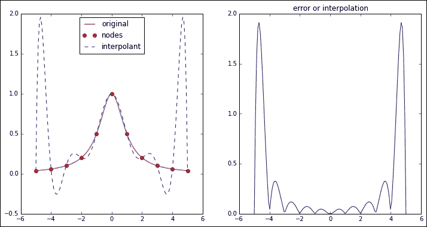
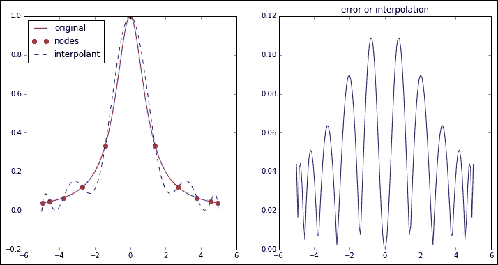

# 四、非线性方程式和最优化

在本章中，我们将回顾对数值数学的发展至关重要的两个基本运算：零值搜索和实值函数的极值。

# 动机

让我们从第 2 章，“插值和近似”中重新审视 Runge 的示例，在该示例中，我们使用了从`-5`到`5`的间隔中的 11 个等距节点计算了 Runge 函数的 Lagrange 插值：

```py
In [1]: import numpy as np, matplotlib.pyplot as plt; \
 ...: from scipy.interpolate import BarycentricInterpolator
In [2]: def f(t): return 1\. / (1\. + t**2)
In [3]: nodes = np.linspace(-5, 5, 11); \
 ...: domain = np.linspace(-5, 5, 128); \
 ...: interpolant = BarycentricInterpolator(nodes, f(nodes))
In [4]: plt.figure(); \
 ...: plt.subplot(121); \
 ...: plt.plot(domain, f(domain), 'r-', label='original'); \
 ...: plt.plot(nodes, f(nodes), 'ro', label='nodes'); \
 ...: plt.plot(domain, interpolant1(domain), 'b--',
 ...:          label='interpolant'); \
 ...: plt.legend(loc=9); \
 ...: plt.subplot(122); \
 ...: plt.plot(domain, np.abs(f(domain)-interpolant1(domain))); \
 ...: plt.title('error or interpolation'); \
 ...: plt.show()

```



衡量此方案成功与否的一种方法是通过计算原始函数与插值之间差异的统一范数。 在这种情况下，该标准接近 2.0。 我们可以通过对域中的大量点执行以下计算来近似此值：

```py
In [5]: error1a = np.abs(f(domain)-interpolant(domain)).max(); \
 ...: print error1a
1.91232007608

```

但是，这是实际误差的粗略近似值。 为了计算真实的范数，我们需要一种机制来在有限的时间间隔内而不是在离散的点集上计算函数的实际最大值。 对于当前示例，要执行此操作，我们将使用模块`scipy.optimize`中的例程`minimize_scalar`。

让我们以两种不同的方式解决此问题，以说明优化算法的一个可能的陷阱：

*   在第一种情况下，我们将利用问题的对称性（`f`和`interpolator`均为偶函数），并提取从`0`到`5`的区间的差范数的最大值
*   在第二种情况下，我们在`-5`至`5`的整个时间间隔内执行相同的操作。

我们将在计算之后得出结论：

```py
In [6]: from scipy.optimize import minimize_scalar
In [7]: def uniform_norm(func, a, b):
 ...:     g = lambda t: -np.abs(func(t))
 ...:     output = minimize_scalar(g, method="bounded",
 ...:                              bounds=(a, b))
 ...:     return -output.fun
 ...:
In [8]: def difference(t): return f(t) - interpolant(t)
In [9]: error1b = uniform_norm(difference, 0., 5.)
 ...: print error1b
1.9156589182259303
In [10]: error1c = uniform_norm(difference, -5., 5.); \
 ....: print error1c
0.32761452331581842

```

### 提示

刚刚发生了什么？ 例程`minimize_scalar`使用一种迭代算法，该算法由于问题的对称性而感到困惑，并收敛到一个局部最大值，而不是所请求的全局最大值。

第一个示例说明了本章的主题之一（及其危害）：实值函数的约束极值的计算。

近似显然不是很好。 切比雪夫（Chebyshev）的一个定理指出，最佳的多项式近似是通过明智地选择节点来实现的-恰比雪夫（Chebyshev）多项式的零点正好！ 我们可以使用模块`scipy.special`中的例程`t_roots`来收集所有这些根。 在我们的运行示例中，最佳 11 个节点的选择将基于 11 度 Chebyshev 多项式的根，并在插值的间隔内正确转换：

```py
In [11]: from scipy.special import t_roots
In [12]: nodes = 5 * t_roots(11)[0]; \
 ....: print nodes
[ -4.94910721e+00  -4.54815998e+00  -3.77874787e+00  -2.70320409e+00 
 -1.40866278e+00  -1.34623782e-15   1.40866278e+00   2.70320409e+00 
 3.77874787e+00   4.54815998e+00   4.94910721e+00]
In [13]: interpolant = BarycentricInterpolator(nodes, f(nodes))
In [14]: plt.figure(); \
 ....: plt.subplot(121); \
 ....: plt.plot(domain, f(domain), 'r-', label='original'); \
 ....: plt.plot(nodes, f(nodes), 'ro', label='nodes'); \
 ....: plt.plot(domain, interpolant(domain), 'b--',
 ....:          label='interpolant')); \
 ....: plt.subplot(122); \
 ....: plt.plot(domain, np.abs(f(domain)-interpolant(domain))); \
 ....: plt.title('error or interpolation'); \
 ....: plt.show()

```



这是插值器质量的显着提高。 多亏了我们将位置合理的节点作为多项式的根进行了计算。 让我们计算该插值的统一范数：

```py
In [15]: def difference(t): return f(t) - interpolant(t)
In [16]: error2 = uniform_norm(difference, 0., 2.)
 ....: print error2
0.10915351095

```

对于某些经常出现的情况，例如 Chebyshev 多项式零点的示例，模块`scipy.special`具有例程，可以按规定的精度收集这些值。 有关这些特殊情况的完整列表，请参考[上的`scipy.special`在线文档，网址为 http://docs.scipy.org/doc/scipy/reference/special.html](http://docs.scipy.org/doc/scipy/reference/special.html) 。

对于一般情况，我们希望有一套扎根的技术。 这正是本章讨论的另一个主题。

# 非线性方程和系统

在线性方程和系统的解中， *f（x）= 0* ，我们可以选择使用直接方法或迭代过程。 这种设置中的一种直接方法就是简单地应用仅涉及四个基本运算的精确公式：加，减，乘和除。 当取消发生时，主要是每当存在和减时，就会出现这种方法的问题。 迭代方法不是在有限数量的运算中计算解决方案，而是计算与所述解决方案的越来越近的近似值，从而提高了每个步骤的准确性。

对于非线性方程，直接方法很少是一个好主意。 即使公式可用，非基本运算的存在也会导致舍入错误。 让我们用一个非常基本的例子来看看。

考虑二次方程 *ax* *<sup>2</sup>* *+ bx + c = 0* ，其中 *a = 10* *<sup>–10</sup>* ， *b = –（10* *<sup>10</sup>* *+ 1）/ 10* *<sup>10</sup>* 和 *c = 1* 。 这些是多项式 *p（x）= 10* *<sup>–10</sup>* *（x-1）（x–10 [* *<sup>10</sup>* *）*，根 *x = 1* 和 *x = 10* *<sup>10</sup>* 。 请注意以下命令中二次方的行为：

```py
In [1]: import numpy as np
In [2]: a, b, c = 1.0e-10, -(1.0e10 + 1.)/1.0e10, 1.
In [3]: (-b - np.sqrt(b**2 - 4*a*c))/(2*a)
Out[3]: 1.00000000082740371

```

由于取消引起的一个明显的舍入误差已经扩散。 在这种情况下，可以通过将该公式的分子和分母乘以其分母的共轭数，并改用所得公式来解决这种情况：

```py
In [4]: 2*c / (-b + np.sqrt(b**2 - 4*a*c))
Out[4]: 1.0

```

甚至`sympy`库中编码的代数求解器也存在此缺陷，如以下示例所示：

### 提示

`sympy`库具有一组代数求解器，并且都可以从通用例程`solve`中访问它们。 当前，该方法求解单变量多项式，先验方程以及它们的分段组合。 它还解决了线性和多项式方程组。

有关更多信息，请参考[的`sympy`官方文档，网址为 http://docs.sympy.org/dev/modules/solvers/solvers.html](http://docs.sympy.org/dev/modules/solvers/solvers.html) 。

```py
In [5]: from sympy import symbols, solve
In [6]: x = symbols('x', real=True)
In [7]: solve(a*x**2 + b*x + c)
Out[7]: [1.00000000000000, 9999999999.00000]

```

为了避免对我们的解决方案的准确性进行猜测或微调每个可以解决非线性方程式的公式，我们始终可以采用迭代过程来任意近似地近似。

## 单变量函数的迭代方法

标量函数的迭代过程可以分为三类：

*   **括弧方法**，其中算法跟踪包含根的间隔的端点。 我们有以下算法：
    *   二等分法
    *   Regula falsi（错误位置方法）
*   **正割方法**，具有以下算法：
    *   割线法
    *   牛顿-拉夫森法
    *   插值法
    *   逆插值法
    *   定点迭代法
*   **布伦特方法**，它是对分，割线和逆插值方法的组合。

现在，让我们探索 SciPy 堆栈中包含的方法。

### 包围方式

最基本的算法是平分法-给定区间 *[a，b]* 满足 *f（a）f（b）的连续函数 *f（x）* < 0* 。 该方法通过平分间隔并保留存在解决方案的子间隔来构造一个近似序列。 这是一个缓慢的过程（线性收敛），但是它永远不会收敛到一个解决方案。 在模块`scipy.optimize`中，我们有一个实现，例程`bisect`。

让我们首先通过运行示例来探索这种方法。 由于 *p（0）*和 *p（2）*的符号不同，因此在 *[0* *，2]区间中必须有根* ：

```py
In [8]: from scipy.optimize import bisect
In [9]: p = np.poly1d([a,b,c])
In [10]: bisect(p, 0, 2)
Out[10]: 1.0

```

### 提示

请注意，我们选择用`numpy.poly1d`类表示 *p（x）*。 每当我们需要使用多项式时，在 SciPy 中处理它们的最佳方法就是通过此类。 这样可以确保使用 Horner 方案评估多项式，该方案提供的计算速度比任何其他 Lambda 表示都要快。

但是，对于具有很高阶数的多项式，由于抵消引起的舍入误差，霍纳方案可能不准确。 在这种情况下，必须小心。

二等分方法的一个问题是，它对初始端点的选择非常敏感，但通常，可以通过请求适当的公差来提高计算解的质量，如以下示例所示：

```py
In [11]: bisect(p, -1, 2)
Out[11]: 1.0000000000002274
In [12]: bisect(p, -1, 2, xtol=1e-15)
Out[12]: 0.9999999999999996
In [13]: bisect(p, -1, 2, xtol=1e-15, rtol=1e-15)
Out[13]: 1.0000000000000009

```

更先进的技术集基于法规。 给定间隔 *[a，b]* 包含函数 *f（x）*的根，计算通过点*（a，f（a） ）*和*（b，f（b））*。 这条线与 *[a，b]* 内的 *x* 轴相交。 我们将这一点用于下一个包围步骤。 在模块`scipy.optimize`中，我们有例程`ridder`（基于 C.Ridders 开发的算法对法规进行的改进），它呈现二次收敛性。

为了说明任何求解器之间的行为差​​异，我们可以使用每种算法的可选输出`RootResult`，如以下会话所示：

```py
In [14]: soln, info = bisect(p, -1, 2, full_output=True)
In [15]: print "Iterations: {0}".format(info.iterations)
Iterations: 42
In [16]: print "Function calls: {0}".format(info.function_calls)
Function calls: 44
In [17]: from scipy.optimize import ridder
In [18]: soln, info = ridder(p, -1, 2, full_output=True)
In [19]: print "Solution: {0}".format(info.root)
Solution: 1.0
In [20]: print "Iterations: {0}".format(info.iterations)
Iterations: 1
In [21]: print "Function calls: {0}".format(info.function_calls)
Function calls: 4

```

### 正割方法

下一步技术是基于割线方法及其极限情况。 正割方法在计算上非常类似于法规。 而不是用括号括起来，我们从任何两个初始猜测开始 *x* *<sub>0</sub>* ， *x* *<sub>1</sub>* ，并通过*（x* *<sub>0</sub> 计算线的交点 *x* *<sub>2</sub>* ]* *，f（x* *<sub>0</sub>* *））*和*（x* *<sub>1</sub>* *，f（x* *<sub>1</sub>* *））*。 下一步对猜测重复执行相同的操作 *x* *<sub>1</sub>* ， *x* *<sub>2</sub>* 以计算新的近似值 *x* *<sub>3</sub>* ，然后重复该过程，直到获得对根的满意近似值为止。

通过使用比割线更智能的选择来搜索与 *x* 轴的交点，可以获得对该方法的改进。 Newton-Raphson 方法使用 *f（x）*的一阶导数来计算更好的相交线。 Halley 方法使用 *f（x）*的一阶和二阶导数来计算抛物线弧与 *x* 轴的交点。

割线方法的收敛阶数约为 1.61803，而牛顿-拉夫森方程是二次方，哈雷方程是三次方。

对于标量函数，可以使用模块`scipy.optimize`中的通用例程`newton`访问所有三种方法（割线，牛顿，哈雷）。 例程的必需参数是函数 *f（x）*，以及初始猜测 *x* *<sub>0</sub>* 。

让我们处理一个涉及方程 *sin（x）* */ x = 0* 的更复杂的示例：

```py
In [22]: from scipy.optimize import newton; \
 ....: from sympy import sin as Sin, pi, diff, lambdify
In [23]: def f(t): return np.sin(t)/t
In [24]: f0 = Sin(x)/x
In [25]: f1prime = lambdify(x, diff(f0, x), "numpy"); \
 ....: f2prime = lambdify(x, diff(f0, x, 2), "numpy")
In [26]: solve(f0, x)
Out[26]: [pi]
In [27]: newton(f, 1)                            # pure secant
Out[27]: 3.1415926535897931
In [28]: newton(f, 1, fprime=f1prime)            # Newton-Raphson
Out[28]: 3.1415926535897931
In [29]: newton(f, 1, fprime=f1prime, fprime2=f2prime)   # Halley
Out[29]: 3.1415926535897931

```

这三种方法中的任何一种的问题都是不能始终保证收敛。 例程`newton`具有一种机制，可以防止算法执行某些步骤，并且在发生这种情况时，会引发运行时错误，从而将这种情况告知我们。 牛顿-拉夫森法和哈雷法中不良行为的一个典型例子是方程 *x* *<sup>20</sup>* *= 1* 如果我们最初的猜测恰好是 *x = 0.5* ，则其根的根数 *x = 1* 和 *x = –1* ）：

```py
In [30]: solve(x**20 - 1, x)
Out[30]:
[-1,
 1,
 -sqrt(-sqrt(5)/8 + 5/8) + I/4 + sqrt(5)*I/4,
 -sqrt(-sqrt(5)/8 + 5/8) - sqrt(5)*I/4 - I/4,
 sqrt(-sqrt(5)/8 + 5/8) + I/4 + sqrt(5)*I/4,
 sqrt(-sqrt(5)/8 + 5/8) - sqrt(5)*I/4 - I/4,
 -sqrt(sqrt(5)/8 + 5/8) - I/4 + sqrt(5)*I/4,
 -sqrt(sqrt(5)/8 + 5/8) - sqrt(5)*I/4 + I/4,
 sqrt(sqrt(5)/8 + 5/8) - I/4 + sqrt(5)*I/4,
 sqrt(sqrt(5)/8 + 5/8) - sqrt(5)*I/4 + I/4]
In [31]: coeffs = np.zeros(21); \
 ....: coeffs[0] = 1; \
 ....: coeffs[20] = -1; \
 ....: p = np.poly1d(coeffs); \
 ....: p1prime = p.deriv(m=1); \
 ....: p2prime = p.deriv(m=2)
In [32]: newton(p, 0.5, fprime=p1prime)
RuntimeError: Failed to converge after 50 iterations, value is 2123.26621974
In [33]: newton(p, 0.5, fprime=p1prime, fprime2=p2prime)
RuntimeError: Failed to converge after 50 iterations, value is 2.65963902147

```

还有另一种技术可以通过定点迭代来迭代近似非线性标量方程的解。 例如，当我们的方程式可以写成 *x = g（x）*的形式时，这非常方便，因为方程式的解将是函数 *g* 的不动点。 。

通常，对于任何给定的方程 *f（x）= 0* ，总有一种方便的方法将其重写为定点问题 *x = g（x）*。 当然，标准方法是写 *g（x）= x + f（x）*，但这不一定提供最佳设置。 还有许多其他可能性。

为了计算到固定点的迭代，我们在模块`scipy.optimize`中具有例程`fixed_point`。 此实现基于 Steffensen 的算法，并使用 Aitken 的智能收敛加速：

```py
In [34]: def g(t): return np.sin(t)/t + t
In [35]: from scipy.optimize import fixed_point
In [36]: fixed_point(g, 1)
Out[36]: 3.1415926535897913

```

### 布伦特法

由 Brent，Dekker 和 van Wijngaarten 开发的将割线和二等分方法与逆插值相结合的算法更加先进（且速度更快）。 在模块`scipy.optimize`中，我们有此算法的两个变体：`brentq`（使用逆二次插值）和`brenth`（使用反双曲插值）。 它们都以包围方法开始，并且需要一个包含函数 *f（x）*的根的间隔作为输入。

让我们用公式 *si* *n（x）/ x = 0* 比较 Brent 方法与包围方法的这两种变化：

```py
In [37]: soln, info = bisect(f, 1, 5, full_output=True); \
 ....: list1 = ['bisect', info.root, info.iterations,
 ....:           info.function_calls]
In [38]: soln, info = ridder(f, 1, 5, full_output=True); \
 ....: list2 = ['ridder', info.root, info.iterations,
 ....:          info.function_calls]
In [39]: from scipy.optimize import brentq, brenth
In [40]: soln, info = brentq(f, 1, 5, full_output=True); \
 ....: list3 = ['brentq', info.root, info.iterations,
 ....:          info.function_calls]
In [41]: soln, info = brenth(f, 1, 5, full_output=True); \
 ....: list4 = ['brenth', info.root, info.iterations,
 ....:          info.function_calls]
In [42]: for item in [list1, list2, list3, list4]:
 ....:     print "{0}: x={1}. Iterations: {2}. Calls: {3}".format(*item)
 ....:
bisect: x=3.14159265359\. Iterations: 42\. Calls: 44
ridder: x=3.14159265359\. Iterations: 5\. Calls: 12
brentq: x=3.14159265359\. Iterations: 10\. Calls: 11
brenth: x=3.14159265359\. Iterations: 10\. Calls: 11

```

## 非线性方程组

在本部分中，我们旨在找到标量或多元函数系统的解， *F（X）= 0* ，其中 *F* 表示有限个数的 *N* 函数，每个函数都接受一个尺寸为 *N* 的向量 *X* 作为变量。

在代数或超越方程组的情况下，符号操作是可能的。 当尺寸太大时，这仍然是不切实际的。 一些例子可以说明这一点。

让我们从一个非常容易解决的情况开始，这种情况很容易消除：圆的交点（ *x* *<sup>2</sup>* *+ y* *<sup>2</sup>* *= 16* ），并带有抛物线（ *x* *<sup>2</sup>* *– 2y = 8* ）：

```py
In [1]: import numpy as np; \
 ...: from sympy import symbols, solve 
In [2]: x,y = symbols('x y', real=True)
In [3]: solutions = solve([x**2 + y**2 - 16, x**2 - 2*y -8])
In [4]: for item in solutions:
 ...:     print '({0}, {1})'.format(item[x], item[y])
 ...:
(0, -4)
(0, -4)
(-2*sqrt(3), 2)
(2*sqrt(3), 2)

```

现在，让我们给出一个更困难的例子。 其中一个方程是分数式，另一个是多项式： *1 / x* *<sup>4</sup>* *+ 6 / y* *<sup>4</sup>* *= 6，2y* *<sup>4</sup>* *+ 12x* *<sup>4</sup>* *=* *12x* *<sup>4</sup>* *和* *<sup>4</sup>* ：

```py
In [5]: solve([1/x**4 + 6/y**4 - 6, 2*y**4 + 12*x**4 - 12*x**4*y**4])
Out[5]: []

```

没有解决办法吗？ *（* *1，（6* */ 5））* *<sup>1/4</sup>* 怎么样？

```py
In [5]: x0, y0 = 1., (6/5.)**(1/4.)
In [6]: np.isclose(1/x0**4 + 6/y0**4, 6)
Out[6]: True
In [7]: np.isclose(2*y0**4 + 12*x0**4, 12*x0**4*y0**4)
Out[7]: True

```

只有迭代方法才能保证准确而快速的解决方案，而不会耗尽我们的计算资源。 让我们探索这个方向上的一些技术。

### 提示

从一个变量到多个变量带来了许多计算挑战。 在这种情况下出现的一些技术是对上一节中针对标量函数解释的方法的概括，但是还有许多其他策略可以利用大尺寸空间的更丰富结构。 与采用迭代方法求解线性方程组的情况一样，所有这些技术的命令都涉及学习非常高级的主题，例如功能分析中的算子，谱理论，Krylov 子空间等。 这远远超出了我们本书的范围。

有关所有方法的完整描述和分析，初始猜测的最佳选择或成功的预处理器的构造（使用时），请参考 Ortega 等人撰写的*多个变量*中非线性方程的迭代解。 莱茵堡。 它于 1970 年由 Academic Press 发行为《计算科学和应用数学专着》，目前仍是该主题的最佳可用资源之一。

为了分析非线性方程组，我们将在一个特别具有挑战性的示例上运行所有不同的方法，以尝试确定 *x = [x [0]，...，x [8]]* 的值 ]，求解以下三对角方程组：

```py
(3-2*x[0])*x[0]           -2*x[1]                   = -1
 -x(k-1) + (3-2*x[k])*x[k]         -2*x[k+1] = -1,  k=1,...,7
 -x[7] + (3-2*x[8])*x[8] = -1

```

我们可以将这样的系统定义为纯 NumPy 函数或 SymPy 矩阵函数（这将有助于我们将来计算其 Jacobian）：

```py
In [8]: def f(x):
 ...:     output = [(3-2*x[0])*x[0] - 2*x[1] + 1]
 ...:     for k in range(1,8):
 ...:         output += [-x[k-1] + (3-2*x[k])*x[k] - 2*x[k+1] + 1]
 ...:     output += [-x[7] + (3-2*x[8])*x[8] + 1]
 ...:     return output
 ...:
In [9]: from sympy import Matrix, var
In [10]: var('x:9'); \
 ....: X = [x0, x1, x2, x3, x4, x5, x6, x7, x8]
In [11]: F  = Matrix(f(X)); \
 ....: F
Out[11]:
Matrix([
[      x0*(-2*x0 + 3) - 2*x1 + 1],
[-x0 + x1*(-2*x1 + 3) - 2*x2 + 1],
[-x1 + x2*(-2*x2 + 3) - 2*x3 + 1],
[-x2 + x3*(-2*x3 + 3) - 2*x4 + 1],
[-x3 + x4*(-2*x4 + 3) - 2*x5 + 1],
[-x4 + x5*(-2*x5 + 3) - 2*x6 + 1],
[-x5 + x6*(-2*x6 + 3) - 2*x7 + 1],
[-x6 + x7*(-2*x7 + 3) - 2*x8 + 1],
[       -x7 + x8*(-2*x8 + 3) + 1]])

```

可以使用模块`scipy.optimize`中的通用例程`root`调用所有可用的迭代求解器。 该例程需要将系统 *F（x）= 0* 的左侧表达式和初始猜测作为强制性参数。 要访问不同的方法，我们包括参数`method`，可以将其设置为以下任何选项：

*   `linearmixing`：对于线性混合，这是一种非常简单的迭代非精确牛顿法，该方法使用标量近似于雅可比行列式。
*   `diagbroyden`：对于对角布罗伊登方法，另一种简单的迭代不精确牛顿方法是使用对角线布罗伊登近似于雅可比矩阵。
*   `excitingmixing`：为进行激动人心的混合，可以使用另一种简单的不精确牛顿法，该方法使用对角线近似于雅可比方程。
*   `broyden1`：好的 Broyden 方法是使用 Broyden 的第一个 Jacobian 近似的强大不精确牛顿方法。
*   `hybr`：鲍威尔（Powell）的混合方法，是 SciPy 堆栈中最通用，最可靠的求解器，尽管对于大尺寸系统而言效率不高。
*   `broyden2`：不好的 Broyden 方法类似于很好的 Broyden 方法，是另一种不精确的牛顿方法，它使用了 Broyden 的第二个 Jacobian 近似。 它更适合于大型系统。
*   `krylov`：牛顿-克雷洛夫方法是另一种不精确的牛顿法，其基于雅可比逆的克雷洛夫近似。 它是大尺寸系统的首选。
*   `anderson`：这是安德森混合方法的扩展版本。 与 Newton-Krylov 和错误的 Broyden 方法一起，这是处理大规模非线性方程组的另一种选择武器。

实现非常聪明。 除 Powell 混合方法的情况外，其余代码对`f(x)`和`Jacf(x)`的（近似）雅可比行列使用相同的代码，但表达式不同。 为此，在模块`scipy.optimize.nonlin`中存储了一个带有以下类属性的 Python 类`Jacobian`：

*   `.solve(v)`：对于合适的左侧向量`v`，它返回表达式 *Jacf（x）^（-1）* v*
*   `.update(x, F)`：这会将对象更新为`x`，并带有残余`F(x)`，以确保在每个步骤的正确位置评估雅可比矩阵
*   `.matvec(v)`：对于合适的向量`v`，它返回乘积`Jacf(x)*v`
*   `.rmatvec(v)`：对于合适的向量`v`，它返回乘积`Jacf(x).H*v`
*   `.rsolve(v)`：对于合适的向量`v`，它返回乘积`(Jacf(x).H)^(-1)*v`
*   `.matmat(M)`：对于具有适当尺寸的密集矩阵`M`，这将返回矩阵乘积`Jacf(x).H*M`
*   `.todense()`：如果需要，可以形成密集的雅可比矩阵

我们很少需要担心在此类中创建对象。 例程`root`接受任何`ndarray`，稀疏矩阵，`LinearOperator`或什至其输出是先前任何输出的可调用对象作为 Jacobian。 它使用`asjacobian`方法在内部将其转换为`Jacobian`类。 此方法也托管在子模块`scipy.optimize.nonlin`中。

### 简单的迭代求解器

在 SciPy 堆栈中，我们有三个非常简单的不精确的 Newton 求解器，就像标量方程的割线方法一样，用合适的近似值替代了多元函数的 Jacobian 函数。 这些是线性和激励混合的方法，以及对角 Broyden 方法。 它们速度很快，但并不总是可靠-使用它们需要您自担风险！

为了深入分析这些求解器的速度和行为，我们将使用回调函数来存储收敛步骤。 一，线性混合的方法：

```py
In [12]: from scipy.optimize import root
In [13]: root(f, np.zeros(9), method='linearmixing')
Out[13]:
 status: 2
 success: False
 fun: array([  9.73976997e+00,  -1.66208587e+02,   7.98809260e+00,
 -1.66555288e+01,   6.09078392e+01,  -5.57689008e+03,
 5.72527250e+06,  -2.61478262e+13,   3.15410157e+06])
 x: array([  2.85055795e+00,  -8.21972867e+00,   2.28548187e+00,
 -1.17938653e+00,   4.52499108e+00,  -4.30522840e+01,
 8.68604963e+02,  -3.61578590e+06,   4.81211473e+02])
 message: 'The maximum number of iterations allowed has been reached.'
 nit: 1000

```

这不太有希望！ 如果我们愿意，我们可以以不同的公差或允许的最大迭代次数进行测试。 我们可以为该算法更改的另一种选择是在雅可比近似中搜索最佳线的方法。 这有助于确定在由所述近似给出的方向上的步长。 此时，我们只有三个选择：`armijo`（阿米乔-戈尔德斯坦条件，默认设置），`wolfe`（使用菲利普·沃尔夫不等式）或`None`。

传递给任何方法的所有选项都必须通过 Python 字典，通过参数`options`完成：

```py
In [14]: lm_options = {}; \
 ....: lm_options['line_search'] = 'wolfe'; \
 ....: lm_options['xtol'] = 1e-5; \
 ....: lm_options['maxiter'] = 2000
In [15]: root(f, np.zeros(9), method='linearmixing',
 ....:      options=lm_options)
OverflowError: (34, 'Result too large')

```

现在，让我们尝试在相同的初始条件下激发混合的方法：

```py
In [16]: root(f, np.zeros(9), method='excitingmixing')
Out[16]:
 status: 2
 success: False
 fun: array([  1.01316841e+03,  -8.25613756e+05,   4.23367202e+02,
 -7.04594503e+02,   5.53687311e+03,  -2.85535494e+07,
 6.34642518e+06,  -3.11754414e+13,   2.87053285e+06])
 x: array([  1.24211360e+01,  -6.41737121e+02,   1.20299207e+01,
 -1.69891515e+01,   3.26672949e+01,  -3.77759320e+03,
 8.82115576e+02,  -3.94812801e+06,   7.34779049e+02])
 message: 'The maximum number of iterations allowed has been reached.'
 nit: 1000

```

类似的（缺乏）成功！ 微调此方法的相关选项是`line_search`，浮点值`alpha`（将`-1/alpha`用作对 Jacobian 的初始近似值）和浮点值`alphamax`（因此，条目 对角雅可比行列式的范围保持在`[alpha,alphamax]`范围内。

让我们尝试使用初始条件相同的对角线 Broyden 方法：

```py
In [17]: root(f, np.zeros(9), method='diagbroyden')
Out[17]:
 status: 2
 success: False
 fun: array([-4.42907377, -0.87124314, -2.61646043,  0.59009568, -1.34073061,
 -2.06266247, -0.32076522,  0.25120731,  0.0731001 ])
 x: array([ 2.09429178,  1.46991649, -0.06730407,  0.96778603,  0.75367344,
 1.2489588 ,  1.46803463,  0.08282948, -0.24223748])
 message: 'The maximum number of iterations allowed has been reached.'
 nit: 1000

```

这种方法的性能也很差！ 如果需要，我们可以尝试使用选项`line_search`和`alpha`来尝试改善收敛性。

### 布罗伊登法

好的 Broyden 方法是另一种不精确的 Newton 方法，该方法在第一次迭代中使用实际的 Jacobian 函数，但对于后续的迭代，则使用连续的秩一更新。 让我们看看我们的运行示例是否还有更多运气：

```py
In [18]: root(f, np.zeros(9), method='broyden1')
Out[18]:
 status: 2
 success: False
 fun: array([-111.83572901, -938.30236242, -197.71489446, -626.93927637,
 -737.43130888,  -19.87676004, -107.31583876,  -92.32200167,
 -252.26714229])
 x: array([  6.65222472,  22.1441079 ,   9.17971608,  17.78778014,
 19.65632798,   3.43502682,  -6.03665297,   6.94424738,  11.87312669])
 message: 'The maximum number of iterations allowed has been reached.'
 nit: 1000

```

为了微调此算法，除了`line_search`和`alpha`之外，我们还可以控制在连续迭代中强制执行秩约束的方法。 我们可以使用可选的整数`max_rank`明确地限制等级不高于给定的阈值。 但是更好的是，我们可以采用一种依赖于其他因素的简化方法。 为此，我们使用选项`reduce_method`。

这些是选项：

*   `restart`：此归约方法删除所有矩阵列。
*   `simple`：仅删除最旧的矩阵列。
*   `svd`：与可选整数`to_retain`一起，此归约方法仅保留最重要的 SVD 分量（最多保留整数`to_retain`）。 如果强加整数`max_rank`，则`to_retain`的较好选择通常是`max_rank - 2`：

    ```py
    In [19]: b1_options = {}; \
     ....: b1_options['max_rank'] = 4; \
     ....: b1_options['reduce_method'] = 'svd'; \
     ....: b1_options['to_retain'] = 2
    In [20]: root(f, np.zeros(9), method='broyden1', options=b1_options)
    Out[20]:
     status: 2
     success: False
     fun: array([ -1.22226719e+00,  -6.72508500e-02,  -6.31642766e-03,
     -2.24588204e-04,  -1.70786962e-05,  -4.55208297e-05,
     -4.81332054e-06,   1.42432661e-05,  -1.64421441e-05])
     x: array([ 0.87691697,  1.65752568, -0.16593591, -0.60204322, -0.68244063,
     -0.688356  , -0.66512492, -0.59589812, -0.41638642])
     message: 'The maximum number of iterations allowed has been reached.'
     nit: 1000

    ```

### 鲍威尔的混合求解器

在最成功的非线性系统求解器中，我们拥有 Powell 的混合算法，为此，在库`MINPACK`中有几个名为`HYBRID**`的 Fortran 例程。 这些例程实现了原始算法的多个修改版本。

当`scipy`例程根与`method='hybr'`一起调用时，它既充当`HYBRID`和`HYBRIDJ`的包装。 如果通过可选参数`jac`提供了 Jacobian 表达式，则 root 调用`HYBRIDJ`，否则调用`HYBRID`。 `HYBRID`代替了实际的雅可比行列式，而是使用在起点由正向差异构造的该算符的近似值。

### 提示

有关作者的鲍威尔混合算法的完整描述和分析，请参阅文章*非线性方程式的混合方法*，该文章于 1970 年在《非线性代数方程的数值方法》杂志上发表。

有关 Fortran 例程`HYBRID`和`HYBRIDJ`的实现细节，请参阅 MINPACK 用户指南的第 4 章，位于 [http://www.mcs.anl.gov/~more/ANL8074b.pdf](http://www.mcs.anl.gov/~more/ANL8074b.pdf) 。

让我们用难以捉摸的例子再试一次：

```py
In [21]: solution = root(f, np.zeros(9), method='hybr')
In [22]: print solution.message
The solution converged.
In [23]: print "The root is approximately x = {0}".format(solution.x)
The root is approximately x = [-0.57065451 -0.68162834 -0.70173245 -0.70421294 -0.70136905 -0.69186564
 -0.66579201 -0.5960342  -0.41641206]
In [24]: print "At that point, it is f(x) = {0}".format(solution.fun)
At that point, it is f(x) = [ -5.10793630e-11   1.00466080e-10  -1.17738708e-10   1.36598954e-10
 -1.25279342e-10   1.10176535e-10  -2.81137336e-11  -2.43449705e-11
 3.32504024e-11]

```

至少获得解决方案令人耳目一新，但我们可以做得更好。 让我们观察一下提供 *f（x）*的精确雅可比矩阵时`method='hybr'`的行为。 在我们的例子中，该运算符可以很容易地通过符号和数值计算，如下所示：

```py
In [25]: F.jacobian(X)

```


```py
In [26]: def Jacf(x):
 ....:     output = -2*np.eye(9, k=1) - np.eye(9, k=-1)
 ....:     np.fill_diagonal(output, 3-4*x)
 ....:     return output
 ....:
In [27]: root(f, np.zeros(9), jac=Jacf, method='hybr')
 status: 1
 success: True
 qtf: array([ -1.77182781e-09,   2.37713260e-09,   2.68847440e-09,
 -2.24539710e-09,   1.34460264e-09,   8.25783813e-10,
 -3.43525370e-09,   2.36025536e-09,   1.16245070e-09])
 nfev: 25
 r: array([-5.19829211,  2.91792319,  0.84419323, -0.48483853,  0.53965529,
 -0.10614628,  0.23741206, -0.03622988,  0.52590331, -4.93470836,
 2.81299775,  0.2137127 , -0.96934776,  1.03732374, -0.71440129,
 0.27461859,  0.5399114 ,  5.38440026, -1.62750656, -0.6939511 ,
 0.3319492 , -0.11487171,  1.11300907, -0.65871043,  5.3675704 ,
 -2.2941419 , -0.85326984,  1.56089518, -0.01734885,  0.12503146,
 5.42400229, -1.8356058, -0.64571006,  1.61337203, -0.18691851,
 5.25497284, -2.34515389,  0.34665604,  0.47453522,  4.57813558,
 -2.82915356,  0.98463742,  4.64513056, -1.59583822, -3.76195794])
 fun: array([ -5.10791409e-11,   1.00465636e-10,  -1.17738708e-10,
 1.36598732e-10,  -1.25278898e-10,   1.10176535e-10,
 -2.81135115e-11,  -2.43454146e-11,   3.32505135e-11])
 x: array([-0.57065451, -0.68162834, -0.70173245, -0.70421294, -0.70136905,
 -0.69186564, -0.66579201, -0.5960342 , -0.41641206])
 message: 'The solution converged.'
 fjac: array([[-0.96956077,  0.19053436,  0.06633131, -0.12548354,  0.00592579,
 0.0356269 ,  0.00473293, -0.0435999 ,  0.01657895],
 [-0.16124306, -0.95068272,  0.1340795 , -0.05374361, -0.08570706,
 0.18508814, -0.04624209, -0.05739585,  0.04797319],
 [ 0.08519719,  0.11476118,  0.97782789, -0.0281114 , -0.08494929,
 -0.05753056, -0.02702655,  0.09769926, -0.04280136],
 [-0.13529817, -0.0388138 ,  0.03067186,  0.97292228, -0.12168962,
 -0.10168782,  0.0762693 ,  0.0095415 ,  0.04015656],
 [-0.03172212, -0.09996098,  0.07982495,  0.10429531,  0.96154001,
 -0.12901939, -0.13390792,  0.10972049,  0.02401791],
 [ 0.05544828,  0.17833604,  0.03912402,  0.1374237 ,  0.09225721,
 0.93276861, -0.23865212, -0.00446867,  0.09571999],
 [ 0.03507942,  0.00518419,  0.07516435, -0.0317367 ,  0.17368453,
 0.20035625,  0.9245396 , -0.20296261,  0.16065313],
 [-0.05145929, -0.0488773 , -0.08274238, -0.02933344, -0.06240777,
 0.09193555,  0.21912852,  0.96156966, -0.04770545],
 [-0.02071235, -0.03178967, -0.01166247,  0.04865223,  0.05884561,
 0.12459889,  0.11668282, -0.08544005, -0.97783168]])
 njev: 2

```

观察到明显的改进-我们到达了相同的根，但仅进行了 25 次迭代。 只需要对雅可比矩阵进行两次评估。

### 大型求解器

对于大型系统，混合方法效率很低，因为该方法的强度取决于密集雅可比矩阵逆矩阵的内部计算。 在这种情况下，我们倾向于使用更健壮的不精确牛顿法。

其中一种是不良的 Broyden 方法（`broyden2`）。 安德森混合（`anderson`）也是一种可靠的方法。 但是，毫无疑问，最成功的方法是 Newton-Krylov 方法（`krylov`）：

```py
In [28]: root(f, np.zeros(9), method='krylov')
Out[28]:
 status: 1
 success: True
 fun: array([ -8.48621595e-09,  -1.28607913e-08,  -9.39627043e-10,
 -6.71023681e-10,  -1.12563803e-09,  -3.46839557e-09,
 -7.64257968e-09,  -1.29112268e-08,  -1.26301001e-08])
 x: array([-0.57065452, -0.68162834, -0.70173245, -0.70421294, -0.70136905,
 -0.69186565, -0.66579202, -0.5960342 , -0.41641207])
 message: 'A solution was found at the specified tolerance.'
 nit: 29

```

我们仅在`29`迭代中就获得了很好的近似值。 通过一系列可选参数可以进行改进。 两个关键选项是：

*   来自模块`scipy.sparse.linalg`的线性方程的迭代求解器，用于计算雅可比方程的 Krylov 近似
*   A preconditioner for the inner Krylov iteration: a functional expression that approximates the inverse of the Jacobian

    ### 提示

    为了说明预处理器的使用，SciPy 的官方文档中有一个很好的例子，网址为 [http://docs.scipy.org/doc/scipy/reference/tutorial/optimize.html](http://docs.scipy.org/doc/scipy/reference/tutorial/optimize.html) 。

    进一步解释这两个选项的用法将需要一本教科书！ 有关此技术背后的理论，请参阅 D.A.发表的无 Jacobian 牛顿-克里洛夫方法文章。 诺尔和 D.E. 《计算物理学杂志》上的凯斯。 193，357（2003）。

# 优化

最好将优化问题描述为搜索标量值函数 *f（x）*的局部最大值或最小值。 可以针对 *f* 域中的所有可能的输入值（在这种情况下，我们将此问题称为无约束优化）或可以由 a 表示的特定子集执行此搜索。 有限的恒等式和不等式（并且我们将此另一个问题称为约束优化）。 在本节中，我们将在几种设置中探索两种模式。

## 单变量函数的无约束优化

我们专注于在区间 *[a，b]* 中搜索函数 *f（x）*的局部最小值（对局部最大值的搜索可以视为对 函数 *–f（x）*在相同间隔中的局部最小值）。 对于此任务，我们在模块`scipy.optimize`中具有例程`minimize_scalar`。 它接受单变量函数 *f（x）*以及搜索方法作为强制输入。

尽管在此设置中括号的概念有些不同，但大多数搜索方法都基于我们用于查找根的括号的概念。 在这种情况下，好的括号是 *x < y < z* 的三元组，其中 *f（y）*小于两个 *f（x）* 和 *f（z）*。 如果函数是连续的，则其图形在括号中呈现 U 形。 这保证了子间隔 *[x，z]* 内的最小值。 一个成功的包围方法将在每个后续步骤中寻找 *[x，y]* 或 *[y，z]* 中的目标极值。

让我们构造一个简单的包围式测试方法。 假设我们有一个初始括号 *a < c < b* 。 通过二次插值，我们通过点*（a，f（a））*，*（c，f（c））*和*（b，f（ b））*。 由于 U 形条件，插值抛物线必须有一个最小值（易于计算），例如*（d，f（d））*。 不难证明值`d`位于子间隔 *[a，c]* 和 *[c，b]* 的中点之间。 我们将在下一个包围步骤中使用这一点 *d* 。 例如，如果碰巧 *c < d* ，则下一个括号将是 *c < d < b* 或 *a < c < d* 。 很简单！ 让我们实现这个方法：

```py
In [1]: import numpy as np; \
 ...: from scipy.interpolate import lagrange; \
 ...: from scipy.optimize import OptimizeResult, minimize_scalar
In [2]: def good_bracket(func, bracket):
 ...:     a, c, b = bracket
 ...:     return (func(a) > func(c)) and (func(b) > func(c))
 ...:
In [3]: def parabolic_step(f, args, bracket, **options):
 ...:     stop = False
 ...:     funcalls = 0
 ...:     niter = 0
 ...:     while not stop:
 ...:         niter += 1
 ...:         interpolator = lagrange(np.array(bracket),
 ...:                                 f(np.array(bracket)))
 ...:         funcalls += 3
 ...:         a, b, c = interpolator.coeffs
 ...:         d = -0.5*b/a
 ...:         if np.allclose(bracket[1], d):
 ...:             minima = d
 ...:             stop = True
 ...:         elif bracket[1] < d:
 ...:             newbracket = [bracket[1], d, bracket[2]]
 ...:             if good_bracket(f, newbracket):
 ...:                 bracket = newbracket
 ...:             else:
 ...:                 bracket = [bracket[0], bracket[1], d]
 ...:         else:
 ...:             newbracket = [d, bracket[1], bracket[2]]
 ...:             if good_bracket(f, newbracket):
 ...:                 bracket = newbracket
 ...:             else:
 ...:                 bracket = [bracket[0], d, bracket[1]]
 ...:     return OptimizeResult(fun=f(minima), x=minima,
 ...:                           nit=niter, nfev=funcalls)

```

### 提示

任何最小化方法的输出都必须是`OptimizeResult`对象，至少具有属性`x`（优化问题的解决方案）。 在我们刚才运行的示例中，用此方法编码的属性是`x`，`fun`（在该解决方案中对 *f* 的求值），`nit`（迭代次数）和`nfev`（所需功能评估的次数）。

让我们在一些示例上运行此方法：

```py
In [4]: f = np.vectorize(lambda x: max(1-x, 2+x))
In [5]: def g(x): return -np.exp(-x)*np.sin(x)
In [6]: good_bracket(f, [-1, -0.5, 1])
Out[6]: True
In [7]: minimize_scalar(f, bracket=[-1, -0.5, 1],
 ...:                 method=parabolic_step)
Out[7]:
 fun: array(1.5000021457670878)
 nfev: 33
 nit: 11
 x: -0.50000214576708779
In [8]: good_bracket(g, [0, 1.2, 1.5])
Out[8]: True
In [9]: minimize_scalar(g, bracket=[0,1.2,1.5],
 ...:                 method=parabolic_step)
Out[9]:
 fun: -0.32239694192707441
 nfev: 54
 nit: 18
 x: 0.78540558550495643

```

按照 Brent 和 Dekker 的算法，已经有两种编码用于单变量标量最小化的方法：`golden`（使用黄金分割搜索）和`brent`：

```py
In [10]: minimize_scalar(f, method='brent', bracket=[-1, -0.5, 1])
Out[10]:
 fun: array(1.5)
 nfev: 22
 nit: 21
 x: -0.5
In [11]: minimize_scalar(f, method='golden', bracket=[-1, -0.5, 1])
Out[11]:
 fun: array(1.5)
 x: -0.5
 nfev: 44
In [12]: minimize_scalar(g, method='brent', bracket=[0, 1.2, 1.5])
Out[12]:
 fun: -0.32239694194483443
 nfev: 11
 nit: 10
 x: 0.78539817180087257
In [13]: minimize_scalar(g, method='golden', bracket=[0, 1.2, 1.5])
Out[13]:
 fun: -0.32239694194483448
 x: 0.7853981573284226
 nfev: 43

```

## 单变量函数的约束优化

尽管例程`minimize_scalar`中包含的括号已经对该函数施加了约束，但是可以在一个不容易找到括号的合适间隔内强制搜索一个真正的最小值：

```py
In [14]: minimize_scalar(g, method='bounded', bounds=(0, 1.5))
Out[14]:
 status: 0
 nfev: 10
 success: True
 fun: -0.32239694194483415
 x: 0.78539813414299553
 message: 'Solution found.'

```

## 多元函数的无约束优化

除了通过蛮力或盆跳最小化的情况外，我们可以使用模块`scipy.optimize`中的通用例程`minimize`执行所有其他搜索。 参数方法与其单变量对应方法一样，需要选择用于实现极值的算法。 已经编码了几种众所周知的算法，但是我们也可以通过合适的定制方法来实现自己的想法。

在本节中，我们将重点介绍编码实现的描述和用法。 在我们为`minimize_scalar`的自定义方法的构造中采用的相同技术在这里是有效的，但额外尺寸带来了明显的挑战。

为了比较所有不同的方法，我们将它们与一个特别具有挑战性的函数进行比较：Rocksenbrock 的抛物线谷（也非正式地称为香蕉函数）。 模块`scipy.optimize`具有此功能的 NumPy 版本，以及其 Jacobian 和 Hessian：

```py
In [15]: from scipy.optimize import rosen; \
 ....: from sympy import var, Matrix, solve, pprint
In [16]: var('x y')
Out[16]: (x, y)
In [17]: F = Matrix([rosen([x, y])]); \
 ....: pprint(F)
[(-x + 1)<sup>2</sup> + 100.0(-x<sup>2</sup> + y)<sup>2</sup>]
In [18]: X, Y = np.mgrid[-1.25:1.25:100j, -1.25:1.25:100j]
In [19]: def f(x,y): return rosen([x, y])
In [20]: import matplotlib.pyplot as plt, matplotlib.cm as cm; \
 ....: from mpl_toolkits.mplot3d.axes3d import Axes3D
In [21]: plt.figure(); \
 ....: plt.subplot(121, aspect='equal'); \
 ....: plt.contourf(X, Y, f(X,Y), levels=np.linspace(0,800,16),
 ....:              cmap=cm.Greys)
 ....: plt.colorbar(orientation='horizontal')
 ....: plt.title('Contour plot')
 ....: ax = plt.subplot(122, projection='3d', aspect='equal')
 ....: ax.plot_surface(X, Y, f(X,Y), cmap=cm.Greys, alpha=0.75)
 ....: plt.colorbar(orientation='horizontal')
 ....: plt.title('Surface plot')
 ....: plt.show()

```


该图显示了可能包含局部最小值的大区域（香蕉形状）。 多元演算技术可以帮助我们精确地确定所有关键点，而不必依靠直觉。 我们首先需要计算函数的雅可比行列式和黑森州式：

```py
In [22]: JacF = F.jacobian([x, y]); \
 ....: pprint(JacF)
[- 400.0⋅x⋅(- x<sup>2</sup> + y) + 2⋅x - 2 - 200.0⋅x<sup>2</sup>  + 200.0⋅y]
In [23]: HesF = JacF.jacobian([x, y]); \
 ....: pprint(HesF)
[1200.0⋅x<sup>2</sup> - 400.0⋅y + 2 -400.0⋅x
 -400.0⋅x          200.0  ]
In [24]: solve(JacF)
Out[24]: [{x: 1.00000000000000, y: 1.00000000000000}]
In [25]: HesF.subs({x: 1.0, y: 1.0})
Out[25]:
Matrix([
[ 802.0, -400.0],
[-400.0,  200.0]])
In [26]: _.det()
Out[26]: 400.000000000000

```

这些计算表明在（`1, 1`）仅存在一个临界点。 毫无疑问，这一点表示该位置的局部最小值。

尽管可行，但尝试使用此技术针对更高维度的 Rosenbrock 函数计算临界点的计算量很大。 例如，移至四个维度需要一台像样的计算机大约半分钟：

```py
In [27]: var('x:4'); \
 ....: X = [x0, x1, x2, x3]; \
 ....: F = Matrix([rosen(X)])
In [28]: %time solve(F.jacobian(X))
CPU times: user 36.6 s, sys: 171 ms, total: 36.8 s
Wall time: 36.7 s
Out[28]:
[{x<sub>0</sub>:1.0,x<sub>1</sub>:1.0,x<sub>2</sub>:1.0,x<sub>3</sub>:1.0}]

```

对于大尺寸，可以通过蛮力来寻找全局最小值。 不是很优雅，但是可以完成工作。 蛮力算法能够跟踪全局最小值（或使其近似到令人满意的精度）。 我们可以使用模块`scipy.optimize`中的例程`brute`调用此方法。 强制性参数是要最小化的功能，以及我们将应用优化的域的描述。 最好将此域编码为切片的元组。 例如，要在四个变量中搜索 Rosenbrock 函数的全局最小值，其中每个变量的绝对值都以三个为界，我们可以发出以下命令：

```py
In [29]: from scipy.optimize import brute
In [30]: interval = slice(-3, 3, 0.25); \
 ....: box = [interval] * 4
In [31]: %time brute(rosen, box)
CPU times: user 13.7 s, sys: 6 ms, total: 13.7 s
Wall time: 13.7 s
Out[31]: array([ 1.,  1.,  1.,  1.])

```

还是一个很慢的过程！ 为了达到速度，最好使用迭代方法。 根据几种模式（以及这些模式的组合）可以在此设置中搜索最小值：

*   **随机方法**：这些方法适合于搜索实际的全局最小值。 它们生成并使用随机变量。 在模块`scipy.optimize`中，我们有两个此类的指数：
    *   一种是盆地跳跃算法，在模块`scipy.optimize`中由例程`basinhopping`调用。 该实现具有由 Metropolis 标准**蒙特卡洛模拟**给出的验收测试。
    *   另一个是不推荐使用的模拟退火方法，称为`method='Anneal'`。 这是蒙特卡洛模拟的一种变体。 对于搜索空间离散且较大的优化问题很有用。
*   **确定性算法，仅使用函数评估**：这些算法基本上是通过沿不同方向进行连续线性最小化来执行的。 在模块`scipy.optimize`中，我们有两种符合此原则的方法：
    *   基于一维布伦特极小化的 Powell 方法。 我们称它为`method='Powell'`。
    *   下坡单纯形算法，也称为变形虫方法，由 Nelder 和 Mead 在 1965 年创建。我们将其称为`method='Nelder-Mead'`。
*   **牛顿法**：这些是关于微分函数的确定性算法，该算法模仿多元演算来搜索关键点。 简而言之，我们寻求至少一个临界点，其 Hessians 满足局部极小值的条件。 这些算法同时采用了 Jacobian 和 Hessian 评估。 通常，由于这些表达式的复杂性，通常改为对这两个运算符进行近似处理。 在这种情况下，我们将这些方法称为准牛顿法。 在模块`scipy.optimize`中，我们有 **Broyden，Fletcher，Goldfarb 和 Shanno** 的准牛顿法（ **BFGS** ），该方法仅使用一阶导数。 我们称它为`method='BFGS'`。
*   **共轭梯度法**：这里，我们有三种变体：
    *   Fetcher-Reeves 算法的一种变体是实现由 Polak 和 Ribiere 编写的纯共轭梯度。 它仅使用一阶导数，并与`method ='CG'`一起调用。
    *   共轭梯度与牛顿法（即截断的牛顿法）的组合，我们称之为`method='Newton-CG'`。
    *   牛顿共轭梯度信任区域算法的两种不同版本，它们使用信任区域的思想更有效地限制了可能极小值的位置。 我们称它们为`method='dogleg'`和`method='trust-ncg'`。

让我们浏览这些方法。

### 随机方法

让我们使用盆地跳跃技术找到九个变量的 Rosenbrock 函数的全局最小值：

```py
In [32]: from scipy.optimize import minimize, basinhopping
In [33]: %time basinhopping(rosen, np.zeros(9))
CPU times: user 4.59 s, sys: 7.17 ms, total: 4.6 s
Wall time: 4.6 s
Out[33]:
 nfev: 75633
 minimization_failures: 52
 fun: 2.5483642615054407e-11
 x: array([ 0.99999992,  0.99999994,  0.99999992,  0.99999981,  0.99999962,
 0.99999928,  0.99999865,  0.9999972 ,  0.99999405])
 message: ['requested number of basinhopping iterations completed successfully']
 njev: 6820
 nit: 100

```

让我们比较一下（不建议使用的）模拟退火的行为：

```py
In [34]: minimize(rosen, np.zeros(9), method='Anneal')
Out[34]:
 status: 5
 success: False
 accept: 19
 nfev: 651
 T: 1130372817.0369582
 fun: 707171392.44894326
 x: array([ 11.63666756, -24.41186725,  48.26727994,   3.97730959,
 -31.52658563,  18.00560694,   1.22589971,  21.97577333, -43.9967434 ])
 message: 'Final point not the minimum amongst encountered points'
 nit: 12

```

### 专门采用功能评估的确定性算法

让我们将 Powell 方法的结果与下坡单纯形方法进行比较：

```py
In [35]: minimize(rosen, np.zeros(9), method='Powell')
Out[35]:
 status: 0
 success: True
 direc: array([[ -9.72738085e-06,   2.08442100e-05,   2.06470355e-05,
 4.39487337e-05,   1.29109966e-04,   1.98333214e-04,
 3.66992711e-04,   7.00645878e-04,   1.38618490e-03],
 [ -6.95913466e-06,  -7.25642357e-07,  -2.39771165e-06,
 4.10148947e-06,  -6.17293950e-06,  -6.53887928e-06,
 -1.06472130e-05,  -5.23030557e-06,  -2.28609232e-06],
 [  0.00000000e+00,   0.00000000e+00,   1.00000000e+00,
 0.00000000e+00,   0.00000000e+00,   0.00000000e+00,
 0.00000000e+00,   0.00000000e+00,   0.00000000e+00],
 [  1.23259262e-06,   9.30817407e-07,   2.48075497e-07,
 -7.07907998e-07,  -2.01233105e-07,  -1.10513430e-06,
 -2.57164619e-06,  -2.58316828e-06,  -3.89962665e-06],
 [  6.07328675e-02,   8.51817777e-02,   1.30174960e-01,
 1.71511253e-01,   9.72602622e-02,   1.47866889e-02,
 1.12376083e-03,   5.35386263e-04,   2.04473740e-04],
 [  0.00000000e+00,   0.00000000e+00,   0.00000000e+00,
 0.00000000e+00,   0.00000000e+00,   1.00000000e+00,
 0.00000000e+00,   0.00000000e+00,   0.00000000e+00],
 [  3.88222708e-04,   8.26386166e-04,   5.56913200e-04,
 3.08319925e-04,   4.45122275e-04,   2.66513914e-03,
 6.31410713e-03,   1.24763367e-02,   2.45489699e-02],
 [  0.00000000e+00,   0.00000000e+00,   0.00000000e+00,
 0.00000000e+00,   0.00000000e+00,   0.00000000e+00,
 0.00000000e+00,   1.00000000e+00,   0.00000000e+00],
 [ -2.82599868e-13,   2.33068676e-13,  -4.23850631e-13,
 -1.23391999e-12,  -2.41224441e-12,  -5.08909225e-12,
 -9.92053051e-12,  -2.07685498e-11,  -4.10004188e-11]])
 nfev: 6027
 fun: 3.1358222279861171e-21
 x: array([ 1.,  1.,  1.,  1.,  1.,  1.,  1.,  1.,  1.])
 message: 'Optimization terminated successfully.'
 nit: 56
In [36]: minimize(rosen, np.zeros(9), method='Nelder-Mead')
 status: 1
 nfev: 1800
 success: False
 fun: 4.9724099905503065
 x: array([ 0.85460488,  0.70911132,  0.50139591,  0.24591886,  0.06234451,
 -0.01112426,  0.02048509,  0.03266785, -0.01790827])
 message: 'Maximum number of function evaluations has been exceeded.'
 nit: 1287

```

### Broyden-Fletcher-Goldfarb-Shanno 拟牛顿法

让我们在运行示例中观察该算法的行为：

```py
In [37]: minimize(rosen, np.zeros(9), method='BFGS')
Out[37]:
 status: 0
 success: True
 njev: 83
 nfev: 913
 hess_inv: array([[  1.77874730e-03,   1.01281617e-03,   5.05884211e-04,
 3.17367120e-04,   4.42590321e-04,   7.92168518e-04,
 1.52710497e-03,   3.06357905e-03,   6.12991619e-03],
 [  1.01281617e-03,   1.91057841e-03,   1.01489866e-03,
 7.31748268e-04,   8.86058826e-04,   1.44758106e-03,
 2.76339393e-03,   5.60288875e-03,   1.12489189e-02],
 [  5.05884211e-04,   1.01489866e-03,   2.01221575e-03,
 1.57845668e-03,   1.87831124e-03,   3.06835450e-03,
 5.86489711e-03,   1.17764144e-02,   2.35964978e-02],
 [  3.17367120e-04,   7.31748268e-04,   1.57845668e-03,
 3.13024681e-03,   3.69430791e-03,   6.16910056e-03,
 1.17339522e-02,   2.33374859e-02,   4.66640347e-02],
 [  4.42590321e-04,   8.86058826e-04,   1.87831124e-03,
 3.69430791e-03,   7.37204979e-03,   1.23036988e-02,
 2.33709766e-02,   4.62512165e-02,   9.24474614e-02],
 [  7.92168518e-04,   1.44758106e-03,   3.06835450e-03,
 6.16910056e-03,   1.23036988e-02,   2.48336778e-02,
 4.71369608e-02,   9.29927375e-02,   1.85683729e-01],
 [  1.52710497e-03,   2.76339393e-03,   5.86489711e-03,
 1.17339522e-02,   2.33709766e-02,   4.71369608e-02,
 9.44348689e-02,   1.86490477e-01,   3.72360210e-01],
 [  3.06357905e-03,   5.60288875e-03,   1.17764144e-02,
 2.33374859e-02,   4.62512165e-02,   9.29927375e-02,
 1.86490477e-01,   3.73949424e-01,   7.46959044e-01],
 [  6.12991619e-03,   1.12489189e-02,   2.35964978e-02,
 4.66640347e-02,   9.24474614e-02,   1.85683729e-01,
 3.72360210e-01,   7.46959044e-01,   1.49726446e+00]])
 fun: 6.00817150312557e-11
 x: array([ 0.99999993,  0.99999986,  0.99999976,  0.99999955,  0.99999913,
 0.99999832,  0.99999666,  0.99999334,  0.99998667])
 message: 'Optimization terminated successfully.'
 jac: array([  5.23788826e-06,  -5.45925187e-06,  -1.35362172e-06,
 8.75480656e-08,  -9.45374358e-06,   7.31889131e-06,
 3.34352248e-07,  -7.24984749e-07,   2.02705630e-08])

```

### 注意

请注意，与 Powell 方法（包括 Jacobian 评估）相比，此方法采用了更多的迭代，但函数评估却少得多。 准确性是可比的，但是复杂性和速度方面的提升却非凡。

### 共轭梯度法

纯共轭梯度法最适合于具有清晰，唯一临界点且斜率范围不太大的函数。 多个固定点往往会使迭代混乱，并且太陡的斜率（大于 1000）会导致可怕的舍入误差。

在不提供雅可比行列式的表达式的情况下，该算法计算此算符的体面近似值以计算一阶导数：

```py
In [38]: minimize(rosen, np.zeros(9), method='CG')
Out[38]:
 status: 0
 success: True
 njev: 326
 nfev: 3586
 fun: 1.5035665428352255e-10
 x: array([ 0.9999999 ,  0.99999981,  0.99999964,  0.99999931,  0.99999865,
 0.99999733,  0.9999947 ,  0.99998941,  0.99997879])
 message: 'Optimization terminated successfully.'
 jac: array([ -1.48359492e-06,   2.95867756e-06,   1.71067556e-06,
 -1.83617409e-07,  -2.47616618e-06,  -5.34951641e-06,
 2.50389338e-06,  -2.37918319e-06,  -3.86667920e-06])

```

包括一个实际的 Jacobian 可以大大改善问题。 请注意，求出的最小值（`fun`）的评估有所改进：

```py
In [39]: from scipy.optimize import rosen_der
In [40]: minimize(rosen, np.zeros(9), method='CG', jac=rosen_der)
Out[40]:
 status: 0
 success: True
 njev: 406
 nfev: 406
 fun: 8.486856765134401e-12
 x: array([ 0.99999998,  0.99999996,  0.99999994,  0.99999986,  0.99999969,
 0.99999938,  0.99999875,  0.9999975 ,  0.999995  ])
 message: 'Optimization terminated successfully.'
 jac: array([  1.37934336e-06,  -9.03688875e-06,   8.53289049e-06,
 9.77779178e-06,  -2.63022111e-06,  -1.02087919e-06,
 -6.55712127e-06,  -1.71887373e-06,  -9.12268328e-07])

```

截断的牛顿方法需要精确的 Jacobian 函数才能工作：

```py
In [41]: minimize(rosen, np.zeros(9), method='Newton-CG')
ValueError: Jacobian is required for Newton-CG method
In [38]: minimize(rosen, np.zeros(9), method='Newton-CG', jac=rosen_der)
Out[41]:
 status: 0
 success: True
 njev: 503
 nfev: 53
 fun: 5.231613200425767e-08
 x: array([ 0.99999873,  0.99999683,  0.99999378,  0.99998772,  0.99997551,
 0.99995067,  0.99990115,  0.99980214,  0.99960333])
 message: 'Optimization terminated successfully.'
 nhev: 0
 jac: array([  6.67155399e-06,   2.50927306e-05,   1.03398234e-04,
 4.09953321e-04,   1.63524314e-03,   6.48667316e-03,
 -1.91779902e-03,  -2.81972861e-04,  -5.67500380e-04])

```

使用信任区域的方法需要对 Hessian 进行精确表达：

```py
In [42]: from scipy.optimize import rosen_hess
In [43]: minimize(rosen, np.zeros(9), method='dogleg',
 ....:                 jac=rosen_der, hess=rosen_hess)
Out[43]:
 status: 0
 success: True
 njev: 25
 nfev: 29
 fun: 9.559277795967234e-19
 x: array([ 1.,  1.,  1.,  1.,  1.,  1.,  1.,  1.,  1.])
 message: 'Optimization terminated successfully.'
 nhev: 24
 jac: array([  3.84137166e-14,   3.00870439e-13,   1.10489395e-12,
 4.32831548e-12,   1.72455383e-11,   6.77315980e-11,
 2.48459919e-10,   6.62723207e-10,  -1.52775570e-09])
 nit: 28
In [44]: minimize(rosen, np.zeros(9), method='trust-ncg',
 ....:                 jac=rosen_der, hess=rosen_hess)
Out[44]:
 status: 0
success: True
 njev: 56
 nfev: 67
 fun: 3.8939669818289621e-18
 x: array([ 1.,  1.,  1.,  1.,  1.,  1.,  1.,  1.,  1.])
 message: 'Optimization terminated successfully.'
 nhev: 55
 jac: array([  2.20490293e-13,   5.57109914e-13,   1.77013959e-12,
 -9.03965791e-12,  -3.05174774e-10,   3.03425818e-09,
 1.49134067e-08,   6.32240935e-08,  -3.64210218e-08])
 nit: 66

```

请注意，与以前的方法相比，在准确性，迭代和功能评估方面都取得了巨大的进步！ 明显的缺点是，要获得 Jacobian 或 Hessian 算子的良好表示，通常是非常困难的。

## 多元函数的约束优化

以平面函数 *f（x，y）= 5x – 2y + 4* 在圆 *x* *<sup>2</sup>* *+ y* *<sup>2</sup>* *= 4* 。 使用 SymPy，我们可以实现 Lagrange 乘法器的技术：

```py
In [45]: F = Matrix([5*x - 2*y + 4]); \
 ....: G = Matrix([x**2 + y**2 - 4])      # constraint
In [46]: var('z'); \
 ....: solve(F.jacobian([x, y]) - z * G.jacobian([x, y]))
Out[46]: [{x: 5/(2*z), y: -1/z}]
In [47]: soln = _[0]; \
 ....: solve(G.subs(soln))
Out[47]: [{z: -sqrt(29)/4}, {z: sqrt(29)/4}]
In [48]: zees = _; \
 ....: [(soln[x].subs(item), soln[y].subs(item)) for item in zees]
Out[48]:
[(-10*sqrt(29)/29, 4*sqrt(29)/29), (10*sqrt(29)/29, -4*sqrt(29)/29)]

```

还不错！ 在此约束之上，我们可以进一步以不等式的形式强加另一个条件。 考虑与之前相同的问题，但改为限制为半圆： *y > 0* 。 在这种情况下，新结果将仅是坐标为 *x = –10√（29）/ 29 = –1.8569533817705186* 和 *y =4√（29）/ 29 = 0.74278135270820744 [* 。

当然，可以用数字方式解决这个问题。 在模块`scipy.optimize`中，我们基本上有三种方法，所有这些方法都可以从通用例程`minimize`中调用：

*   基于 BFGS 算法（我们称之为`method='L-BFGS-B'`）的大规模约束约束优化。 该实现实际上是由[Ciyou Zhu]，[Richard Byrd]和[Jorge Nocedal]编写的同名`FORTRAN`例程的包装（有关详细信息，请参见 RH Byrd，P.Lu 和 J.Nocedal。[HTG2 用于有限约束优化的有限存储器算法，（1995）， *SIAM 科学与统计计算杂志*，16，5，第 1190-1208 页）。
*   一种基于牛顿截断法的约束算法（我们称其为`method='TNC'`）。 此实现与我们用`method='Newton-CG'`调用的实现类似，除了此版本是`C`例程的包装。
*   通过线性近似进行约束优化（用`method='COBYLA'`调用）。 此实现使用相同的名称包装`FORTRAN`例程。
*   一种基于顺序最小二乘编程（`method='SLSQP'`）的最小化方法。 该实现是 Dieter Kraft 编写的同名`FORTRAN`例程的包装。

让我们使用我们的运行示例来说明如何输入不同的约束。 我们将它们实现为字典或字典的元组—元组中的每个条目都表示同一性（`'eq'`）或不等式（`'ineq'`），以及函数表达式（以`ndarray`的形式） 必要时）及其对应的派生词：

```py
In [49]: def f(x): return 5*x[0] - 2*x[1] + 4
In [50]: def jacf(x): return np.array([5.0, -2.0])
In [51]: circle = {'type': 'eq',
 ....:           'fun': lambda x: x[0]**2 + x[1]**2 - 4.0,
 ....:           'jac': lambda x: np.array([2.0 * x[0],
 2.0 * x[1]])}
In [52]: semicircle = ({'type': 'eq',
 ....:                'fun': lambda x: x[0]**2 + x[1]**2 - 4.0,
 ....:                'jac': lambda x: np.array([2.0 * x[0],
 ....:                                           2.0 * x[1]])},
 ....:               {'type': 'ineq',
 ....:                'fun': lambda x: x[1],
 ....:                'jac': lambda x: np.array([0.0, 1.0])})

```

约束通过参数`constraints`馈送到例程`minimize`。 最初的猜测也必须满足约束条件，否则，算法将无法收敛到任何有意义的东西：

```py
In [53]: minimize(f, [2,2], jac=jacf, method='SLSQP', constraints=circle)
Out[53]:
 status: 0
 success: True
 njev: 11
 nfev: 13
 fun: -6.7703296142789693
 x: array([-1.85695338,  0.74278135])
 message: 'Optimization terminated successfully.'
 jac: array([ 5., -2.,  0.])
 nit: 11
In [54]: minimize(f, [2,2], jac=jacf, method='SLSQP', constraints=semicircle)
Out[54]:
 status: 0
 success: True
 njev: 11
 nfev: 13
 fun: -6.7703296142789693
 x: array([-1.85695338,  0.74278135])
 message: 'Optimization terminated successfully.'
 jac: array([ 5., -2.,  0.])
 nit: 11

```

# 摘要

在本章中，我们已经掌握了计算数学中两个最具挑战性的过程-搜索函数的根和极值。 您了解了在几种设置中解决这些问题的符号方法和数字方法，以及如何通过收集有关函数的足够信息来避免常见的陷阱。

在下一章中，我们将探讨一些求解微分方程的技术。