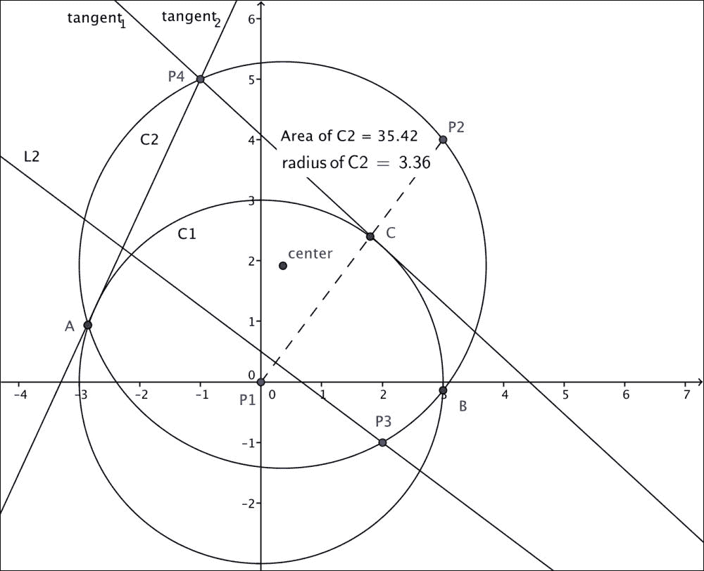
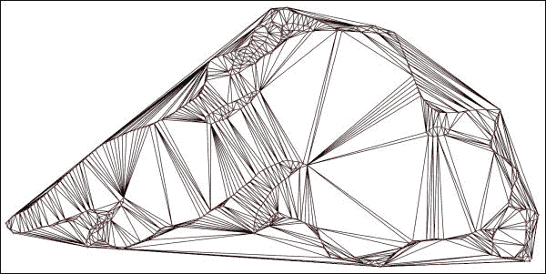
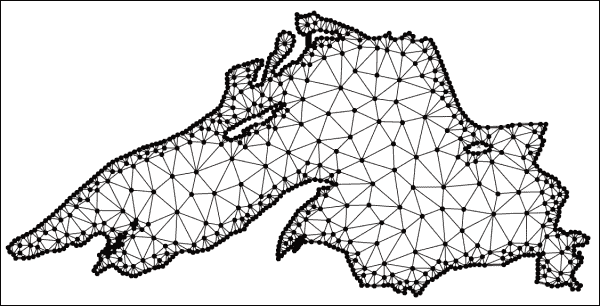
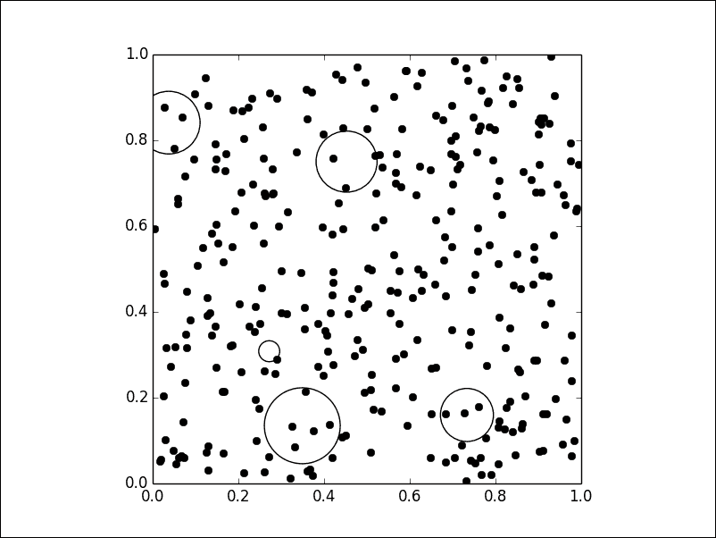

# 六、计算几何

*“计算几何”*是一个数学领域，致力于开发有效的算法来解决根据基本几何对象描述的问题。 我们区分**组合计算几何**和**数值计算几何**。

组合计算几何处理基本几何对象（点，线段，线，多边形和多面体）的相互作用。 在这种情况下，我们有三类问题：

*   **静态问题**：需要从一组输入几何对象中构造一个已知目标对象
*   **几何查询问题**：给定一组已知对象（搜索空间）和一个查找的属性（查询），这些问题将处理满足查询条件的对象的搜索
*   **动态问题**：这与前两个类别中的问题相似，但又增加了挑战，即事先不知道输入，并且在查询/构造之间插入或删除对象

数值计算几何主要处理空间中对象的表示，这些对象通过曲线，曲面和由其限定的空间中的区域来描述。

在我们继续开发和分析这两种设置中的不同算法之前，有必要探索一下基本背景-平面几何。

# 平面几何

SymPy 库的几何模块涵盖了基本的几何功能。 我们没有给出该模块中所有对象和属性的学术描述，而是通过一系列小型的不言自明的 Python 会话来发现最有用的对象和属性。

我们从*点*和*段*的概念开始。 目的是举例说明我们如何容易地检查共线性，计算长度，中点或线段的斜率。 我们还将展示如何快速计算两个线段之间的角度，以及如何确定给定点是否属于线段。 下图说明了一个示例，我们将继续执行代码：


```py
In [1]: from sympy.geometry import Point, Segment, Line, \
 ...:                            Circle, Triangle, Curve
In [2]: P1 = Point(0, 0); \
 ...: P2 = Point(3, 4); \
 ...: P3 = Point(2, -1); \
 ...: P4 = Point(-1, 5)
In [3]: statement = Point.is_collinear(P1, P2, P3); \
 ...: print "Are P1, P2, P3 collinear?," statement
Are P1, P2, P3 collinear? False
In [4]: S1 = Segment(P1, P2); \
 ...: S2 = Segment(P3, P4)
In [5]: print "Length of S1:", S1.length
Length of S1: 5
In [6]: print "Midpoint of S2:", S2.midpoint
Midpoint of S2: Point(1/2, 2)
In [7]: print "Slope of S1", S1.slope
Slope of S1: 4/3
In [8]: print "Intersection of S1 and S2:", S1.intersection(S2)
Intersection of S1 and S2: [Point(9/10, 6/5)]
In [9]: print "Angle between S1, S2:", Segment.angle_between(S1, S2)
Angle between S1, S2: acos(-sqrt(5)/5)
In [10]: print "Does S1 contain P3?", S1.contains(P3)
Does S1 contain P3? False

```

下一个逻辑几何概念是*线*。 我们可以使用行执行更多有趣的操作，并且为此，我们还有更多的构造函数。 我们可以找到他们的方程式； 计算点与线之间的距离以及许多其他操作：


```py
In [11]: L1 = Line(P1, P2)
In [12]: L2 = L1.perpendicular_line(P3) #perpendicular line to L1
In [13]: print "Parametric equation of L2:", L2.arbitrary_point()
Parametric equation of L2: Point(4*t + 2, -3*t – 1)
In [14]: print "Algebraic equation of L2:", L2.equation()
Algebraic equation of L2: 3*x + 4*y - 2
In [15]: print "Does L2 contain P4?", L2.contains(P4)
Does L2 contain P4? False
In [16]: print "Distance from P4 to L2:", L2.distance(P4)
Distance from P4 to L2: 3
In [17]: print "Is L2 parallel with S2?", L1.is_parallel(S2)
Is L2 parallel with S2? False

```

我们要探讨的下一个几何概念是*圆*。 我们可以通过圆的中心和半径或圆上的三个点来定义一个圆。 我们可以轻松计算其所有属性，如下图所示：



```py
In [18]: C1 = Circle(P1, 3); \
 ....: C2 = Circle(P2, P3, P4)
In [19]: print "Area of C2:", C2.area
Area of C2: 1105*pi/98
In [20]: print "Radius of C2:", C2.radius
Radius of C2: sqrt(2210)/14
In [21]: print "Algebraic equation of C2:", C2.equation()
Algebraic equation of C2: (x - 5/14)**2 + (y - 27/14)**2 - 1105/98
In [22]: print "Center of C2:", C2.center
Center of C2: Point(5/14, 27/14)
In [23]: print "Circumference of C2:", C2.circumference
Circumference of C2: sqrt(2210)*pi/7

```

计算与其他对象的相交，检查一条线是否与圆相切或找到通过外部点的切线也很简单：

```py
In [24]: print "Intersection of C1 and C2:\n", C2.intersection(C1)
Intersection of C1 and C2:
[Point(55/754 + 27*sqrt(6665)/754, -5*sqrt(6665)/754 + 297/754),
 Point(-27*sqrt(6665)/754 + 55/754, 297/754 + 5*sqrt(6665)/754)]
In [25]: print "Intersection of S1 and C2:\n", C2.intersection(S1)
Intersection of S1 and C2:
[Point(3, 4)]
In [26]: print "Is L2 tangent to C2?", C2.is_tangent(L2)
Is L2 tangent to C2? False
In [27]: print "Tangent lines to C1 through P4:\n", \
 C1.tangent_lines(P4)
Tangent lines to C1 through P4:
[Line(Point(-1, 5),
 Point(-9/26 + 15*sqrt(17)/26, 3*sqrt(17)/26 + 45/26)),
 Line(Point(-1, 5),
 Point(-15*sqrt(17)/26 - 9/26, -3*sqrt(17)/26 + 45/26))]

```

*三角形*是一个非常有用的基本几何概念。 这些对象的可靠处理是计算几何的核心。 我们需要强大而快速的算法来处理和提取信息。 让我们首先显示一个的定义，以及描述其属性的一系列查询：

```py
In [28]: T = Triangle(P1, P2, P3)
In [29]: print "Signed area of T:", T.area
Signed area of T: -11/2
In [30]: print "Angles of T:\n", T.angles
Angles of T:
{Point(3, 4): acos(23*sqrt(26)/130),
 Point(2, -1): acos(3*sqrt(130)/130),
 Point(0, 0): acos(2*sqrt(5)/25)}
In [31]: print "Sides of T:\n", T.sides
Sides of T:
[Segment(Point(0, 0), Point(3, 4)),
 Segment(Point(2, -1), Point(3, 4)),
 Segment(Point(0, 0), Point(2, -1))]
In [32]: print "Perimeter of T:", T.perimeter
Perimeter of T: sqrt(5) + 5 + sqrt(26)
In [33]: print "Is T a right triangle?", T.is_right()
Is T a right triangle? False
In [34]: print "Is T equilateral?", T.is_equilateral()
Is T equilateral? False
In [35]: print "Is T scalene?", T.is_scalene()
Is T scalene? True
In [36]: print "Is T isosceles?", T.is_isosceles()
Is T isosceles? False

```

接下来，请注意我们如何轻松地获得与三角形以及中间三角形（在顶点的中点处具有顶点的三角形）关联的不同线段，中心和圆的表示形式：

```py
In [37]: T.altitudes
Out[37]:
{Point(0, 0) : Segment(Point(0, 0), Point(55/26, -11/26)),
 Point(2, -1): Segment(Point(6/25, 8/25), Point(2, -1)),
 Point(3, 4) : Segment(Point(4/5, -2/5), Point(3, 4))}
In [38]: T.orthocenter     # Intersection of the altitudes
Out[38]:
Point((3*sqrt(5) + 10)/(sqrt(5) + 5 + sqrt(26)), (-5 + 4*sqrt(5))/(sqrt(5) + 5 + sqrt(26)))
In [39]: T.bisectors()    # Angle bisectors
Out[39]:
{Point(0, 0) : Segment(Point(0, 0), Point(sqrt(5)/4 + 7/4, -9/4 + 5*sqrt(5)/4)),
 Point(2, -1): Segment(Point(3*sqrt(5)/(sqrt(5) + sqrt(26)),  4*sqrt(5)/(sqrt(5) + sqrt(26))),
 Point(2, -1)),
 Point(3, 4) : Segment(Point(-50 + 10*sqrt(26), -5*sqrt(26) + 25), Point(3, 4))}
In [40]: T.incenter     # Intersection of angle bisectors
Out[40]:
Point((3*sqrt(5) + 10)/(sqrt(5) + 5 + sqrt(26)), (-5 + 4*sqrt(5))/(sqrt(5) + 5 + sqrt(26)))
In [41]: T.incircle
Out[41]:
Circle(Point((3*sqrt(5) + 10)/(sqrt(5) + 5 + sqrt(26)),
 (-5 + 4*sqrt(5))/(sqrt(5) + 5 + sqrt(26))),
 -11/(sqrt(5) + 5 + sqrt(26)))
In [42]: T.inradius
Out[42]: -11/(sqrt(5) + 5 + sqrt(26))
In [43]: T.medians
Out[43]:
{Point(0, 0) : Segment(Point(0, 0), Point(5/2, 3/2)),
 Point(2, -1): Segment(Point(3/2, 2), Point(2, -1)),
 Point(3, 4) : Segment(Point(1, -1/2), Point(3, 4))}
In [44]: T.centroid     # Intersection of the medians
Out[44]: Point(5/3, 1)
In [45]: T.circumcenter   # Intersection of perpendicular bisectors
Out[45]: Point(45/22, 35/22)
In [46]: T.circumcircle
Out[46]: Circle(Point(45/22, 35/22), 5*sqrt(130)/22)
In [47]: T.circumradius
Out[47]: 5*sqrt(130)/22
In [48]: T.medial
Out[48]: Triangle(Point(3/2, 2), Point(5/2, 3/2), Point(1, -1/2))

```

以下是一些其他有趣的三角形运算：

*   与其他物体的相交
*   从点到每个线段的最小距离的计算
*   检查两个三角形是否相似

```py
In [49]: T.intersection(C1)
Out[49]: [Point(9/5, 12/5), Point(sqrt(113)/26 + 55/26, -11/26 + 5*sqrt(113)/26)]
In [50]: T.distance(T.circumcenter)
Out[50]: sqrt(26)/11
In [51]: T.is_similar(Triangle(P1, P2, P4))
Out[51]: False

```

当前在几何模块中编码的其他基本几何对象是：

*   `LinearEntity`：这是具有三个子类的超类：`Segment`，`Line`和`Ray`。 `LinearEntity`类具有以下基本方法：
    *   `are_concurrent(o1, o2, ..., on)`
    *   `are_parallel(o1, o2)`
    *   `are_perpendicular(o1, o2)`
    *   `parallel_line(self, Point)`
    *   `perpendicular_line(self, Point)`
    *   `perpendicular_segment(self, Point)`
*   `Ellipse`：这是一个具有中心以及水平和垂直半径的对象。 `Circle`实际上是两个半径相等的`Ellipse`的子类。
*   `Polygon`：这是一个超类，我们可以通过列出一组顶点来实例化。 例如，`Triangles`是`Polygon`的子类。 多边形的基本方法是：
    *   `area`
    *   `perimeter`
    *   `centroid`
    *   `sides`
    *   `vertices`
*   `RegularPolygon`。 这是`Polygon`的子类，具有额外的属性：
    *   `apothem`
    *   `center`
    *   `circumcircle`
    *   `exterior_angle`
    *   `incircle`
    *   `interior_angle`
    *   `radius`

        ### 提示

        有关此模块的更多信息，请参考官方的 SymPy 文档，网址为 [http://docs.sympy.org/latest/modules/geometry/index.html](http://docs.sympy.org/latest/modules/geometry/index.html) 。

还有一个非基本几何对象-*曲线*，我们通过提供参数方程式以及参数定义的间隔来定义它。 除了描述其构造函数的方法外，它目前没有许多有用的方法。 让我们说明如何处理这些对象。 例如，椭圆的四分之三弧可以编码如下：

```py
In [52]: from sympy import var, pi, sin, cos
In [53]: var('t', real=True)
In [54]: Arc = Curve((3*cos(t), 4*sin(t)), (t, 0, 3*pi/4))

```

要结束对 SymPy 库中来自 geometry 模块的基本对象的阐述，我们必须提到，我们可以将任何基本仿射变换应用于任何先前的对象。 这是通过组合`reflect`，`rotate`，`translate`和`scale`方法完成的：

```py
In [55]: T.reflect(L1)
Out[55]: Triangle(Point(0, 0), Point(3, 4), Point(-38/25, 41/25))
In [56]: T.rotate(pi/2, P2)
Out[56]: Triangle(Point(7, 1), Point(3, 4), Point(8, 3))
In [57]: T.translate(5,4)
Out[57]: Triangle(Point(5, 4), Point(8, 8), Point(7, 3))
In [58]: T.scale(9)
Out[58]: Triangle(Point(0, 0), Point(27, 4), Point(18, -1))
In [59]: Arc.rotate(pi/2, P3).translate(pi,pi).scale(0.5)
Out[59]:
Curve((-2.0*sin(t) + 0.5 + 0.5*pi, 3*cos(t) - 3 + pi), (t, 0, 3*pi/4))

```

通过这些基本定义和操作，我们已准备好应对更复杂的情况。 接下来让我们探索这些新挑战。

# 组合计算几何

也称为算法几何，此领域的应用很多。 在机器人技术中，例如，它用于解决可见性问题和运动计划。 在**地理信息系统**（ **GIS** ）中，采用了类似的应用程序来设计路线规划或搜索算法。

让我们描述问题的不同类别，重点介绍解决问题的工具，这些工具在 SciPy 堆栈中可用。

## 静态问题

此类别中的基本问题如下：

*   **凸包**：给定空间中的一组点，找到包含它们的最小凸多面体。
*   **Voronoi 图**：给定空间中的一组点（种子），请计算由更接近每个种子的所有点组成的区域中的分区。
*   **三角剖分**：用两个三角形分开的方式将平面与三角形分开，否则它们将共享一条边或一个顶点。 根据输入对象或三角形属性的约束，有不同的三角剖分。
*   **Shortest paths**: Given a set of obstacles in a space and two points, find the shortest path between the points that does not intersect any of the obstacles.

    ### 提示

    凸包，基本三角剖分和 Voronoi 图的计算问题紧密相关。 由 Franco Preparata 和 Michael Shamos 撰写的题为“计算几何”的计算机科学专着中详细解释了解释这个美丽主题的理论。 它由 Springer-Verlag 于 1985 年出版。

### 凸包

尽管可以通过库 SymPy 的几何模块计算平面中相当大的一组点的凸包，但不建议这样做。 可通过类`ConvexHull`在模块`scipy.spatial`中获得更快，更可靠的代码，该类可从`Qhull`库（ [http：//www.qhull 实现对例程`qconvex`的包装）。 org /](http://www.qhull.org/) ）。 该例程还允许以更高的尺寸计算凸包。 让我们将两种方法与著名的苏必利尔湖多边形`superior.poly`进行比较。

### 提示

多边形文件表示平面直线图-顶点和边的简单列表，以及在某些情况下有关孔和凹面的信息。 可以从 [https://github.com/blancosilva/Mastering-Scipy/blob/master/chapter6/superior.poly](https://github.com/blancosilva/Mastering-Scipy/blob/master/chapter6/superior.poly) 下载正在运行的示例。

这包含对苏必利尔湖海岸线的多边形描述，其中有 7 个孔（用于岛屿），518 个顶点和 518 个边。

有关多边形格式的完整说明，请参见 [http://www.cs.cmu.edu/~quake/triangle.poly.html](http://www.cs.cmu.edu/~quake/triangle.poly.html) 。 有了这些信息，我们可以轻松编写一个简单的阅读器。

以下是一个示例。

```py
# part of file chapter6.py
from numpy import array
def read_poly(file_name):
 """
 Simple poly-file reader, that creates a python dictionary
 with information about vertices, edges and holes.
 It assumes that vertices have no attributes or boundary markers.
 It assumes that edges have no boundary markers.
 No regional attributes or area constraints are parsed.
 """
 output = {'vertices': None, 'holes': None, 'segments': None}
 # open file and store lines in a list
 file = open(file_name, 'r')
 lines = file.readlines()
 file.close()
 lines = [x.strip('\n').split() for x in lines]
 # Store vertices
 vertices= []
 N_vertices,dimension,attr,bdry_markers = [int(x) for x in lines[0]]
 # We assume attr = bdrt_markers = 0
 for k in range(N_vertices):
 label,x,y = [items for items in lines[k+1]]
 vertices.append([float(x), float(y)])
 output['vertices']=array(vertices)
 # Store segments
 segments = []
 N_segments,bdry_markers = [int(x) for x in lines[N_vertices+1]]
 for k in range(N_segments):
 label,pointer_1,pointer_2 = [items for items in lines[N_vertices+k+2]]
 segments.append([int(pointer_1)-1, int(pointer_2)-1])
 output['segments'] = array(segments)
 # Store holes
 N_holes = int(lines[N_segments+N_vertices+2][0])
 holes = []
 for k in range(N_holes):
 label,x,y = [items for items in lines[N_segments + N_vertices + 3 + k]]
 holes.append([float(x), float(y)])
 output['holes'] = array(holes)
 return output

```

注意，将每个顶点加载为`Point`以及使用该结构计算凸包需要太多的资源和太多的时间。 注意区别：

```py
In [1]: import numpy as np, matplotlib.pyplot as plt; \
 ...: from sympy.geometry import Point, convex_hull; \
 ...: from scipy.spatial import ConvexHull; \
 ...: from chapter6 import read_poly
In [2]: lake_superior = read_poly("superior.poly"); \
 ...: vertices_ls = lake_superior['vertices']
In [3]: %time hull = ConvexHull(vertices_ls)
CPU times: user 1.59 ms, sys: 372 µs, total: 1.96 ms
Wall time: 1.46 ms
In [4]: vertices_sympy = [Point(x) for x in vertices_ls]
In [5]: %time convex_hull(*vertices_sympy)
CPU times: user 168 ms, sys: 54.5 ms, total: 223 ms
Wall time: 180 ms
Out[5]:
Polygon(Point(1/10, -629607/1000000), Point(102293/1000000, -635353/1000000),
 Point(2773/25000, -643967/1000000), Point(222987/1000000, -665233/1000000),
 Point(8283/12500, -34727/50000), Point(886787/1000000, -1373/2000),
 Point(890227/1000000, -6819/10000), Point(9/10, -30819/50000),
 Point(842533/1000000, -458913/1000000), Point(683333/1000000, -17141/50000),
 Point(16911/25000, -340427/1000000), Point(654027/1000000, -333047/1000000),
 Point(522413/1000000, -15273/50000), Point(498853/1000000, -307193/1000000),
 Point(5977/25000, -25733/50000), Point(273/2500, -619833/1000000))

```

让我们使用`scipy.spatial.ConvexHull`的计算来生成带有解决方案的图表：

### 提示

使用简单命令`convex_hull_plot_2d`，也可以在二维中绘制一组顶点及其凸包（一次使用`ConvexHull`计算）。 它需要`matplotlib.pyplot`。

```py
In [5]: plt.figure(); \
 ...: plt.xlim(vertices_ls[:,0].min()-0.01,   vertices_ls[:,0].max()+0.01); \
 ...: plt.ylim(vertices_ls[:,1].min()-0.01, vertices_ls[:,1].max()+0.01); \
 ...: plt.axis('off'); \
 ...: plt.axes().set_aspect('equal'); \
 ...: plt.plot(vertices_ls[:,0], vertices_ls[:,1], 'b.')
Out[5]: [<matplotlib.lines.Line2D at 0x10ee3ab10>]
In [6]: for simplex in hull.simplices:
 ...:     plt.plot(vertices_ls[simplex, 0], ...:              vertices_ls[simplex, 1], 'r-')
In [7]: plt.show()

```

这将绘制以下图像：


要修改`ConvexHull`的输出，我们可以通过参数`qhull_options`传递所有必需的`qconvex`控件。 有关所有`qconvex`控件和其他输出选项的列表，请参阅 Qhull 手册，网址为[，网址为 http://www.qhull.org/html/index.htm](http://www.qhull.org/html/index.htm) 。 在本章中，我们满意地显示了如果点的尺寸大于 4，则使用默认控件`qhull_options='Qx Qt'`获得的结果，否则，将显示`qhull_options='Qt'`。

现在让我们说明`ConvexHull`的一些高级用法。 首先，计算 3D 空间中随机点集的凸包。 为了可视化，我们将使用`mayavi`库：

```py
In [8]: points = np.random.rand(320, 3)
In [9]: hull = ConvexHull(points)
In [10]: X = hull.points[:, 0]; \
 ....: Y = hull.points[:, 1]; \
 ....: Z = hull.points[:, 2]
In [11]: from mayavi import mlab
In [12]: mlab.triangular_mesh(X, Y, X, hull.simplices,
   ....:                      colormap='gray', opacity=0.5,
 ....:                      representation='wireframe')

```

这将绘制以下图像：


### Voronoi 图

可以使用模块`scipy.spatial`中的类`Voronoi`（及其用于可视化的同伴`voronoi_plot_2d`）来计算一组顶点（我们的种子）的 Voronoi 图。 此类从`Qhull`库实现例程`qvoronoi`的包装，如果点的尺寸大于 4，则使用以下默认控件`qhull_option='Qbb Qc Qz Qx'`，否则使用`qhull_options='Qbb Qc Qz'`。 为了计算最远站点的 Voronoi 图，而不是最近站点，我们将添加额外的控件`'Qu'`。

让我们用普通的 Voronoi 图来做一个简单的例子：

```py
In [13]: from scipy.spatial import Voronoi, voronoi_plot_2d
In [14]: vor = Voronoi(vertices_ls)

```

为了理解输出，将通过限制`voronoi_plot_2d`获得的可视化效果在一个小窗口中复制我们获得的图表非常有说明性，该窗口位于苏必利尔湖北岸的某个中心：

```py
In [15]: ax = plt.subplot(111, aspect='equal'); \
 ....: voronoi_plot_2d(vor, ax=ax); \
 ....: plt.xlim( 0.45,  0.50); \
 ....: plt.ylim(-0.40, -0.35); \
 ....: plt.show()

```

这将绘制以下图像：


*   小点是 *x* 坐标在`0.45`和`0.50`之间， *y* 坐标在`-0.40`和`-0.35`之间的原始种子。 我们可以从原始列表`vertices_ls`或`vor.points`中访问这些值。
*   平面被分成不同的区域（Voronoi 细胞），每个种子一个。 这些区域包含平面中最接近其种子的所有点。 每个区域都接收一个索引，该索引不一定与`vor.points`列表中其种子的索引相同。 要访问给定种子的相应区域，我们使用`vor.point_region`：

    ```py
    In [16]: vor.point_region
    Out[16]:
    array([  0,  22,  24,  21,  92,  89,  91,  98,  97,  26, 218, 219, 220, 217, 336, 224, 334, 332, 335, 324, 226, 231, 230, 453, 500, 454, 235, 234, 333, 236, 341, 340,  93, ... 199,  81,  18,  17, 205, 290,  77, 503, 469, 473, 443, 373, 376, 366, 370, 369, 210, 251, 367, 368, 377, 472, 504, 506, 502, 354, 353,  54,  42,  43, 350, 417, 414, 415, 418, 419, 425])

    ```

*   每个 Voronoi 单元格均由其定界顶点和边缘（在 Voronoi 行话中也称为脊）定义。 可以使用`vor.vertices`获得具有 Voronoi 图的计算顶点坐标的列表。 这些顶点在上一张图像中被表示为较大的点，并且由于它们始终位于至少两个边缘的交点处而种子没有输入边缘，因此易于识别：

    ```py
    In [17]: vor.vertices
    Out[17]:
    array([[ 0.88382749, -0.23508215],
     [ 0.10607886, -0.63051169],
     [ 0.03091439, -0.55536174],
     ...,
     [ 0.49834202, -0.62265786],
     [ 0.50247159, -0.61971784],
     [ 0.5028735 , -0.62003065]])

    ```

*   For each of the regions, we can access the set of delimiting vertices with `vor.regions`. For instance, to obtain the coordinates of the vertices that delimit the region around the fourth seed, we could issue the following command:

    ```py
    In [18]: [vor.vertices[x] for x in vor.regions[vor.point_region[4]]]
    Out[18]:
    [array([ 0.13930793, -0.81205929]),
     array([ 0.11638   , -0.92111088]),
     array([ 0.11638   , -0.63657789]),
     array([ 0.11862537, -0.6303235 ]),
     array([ 0.12364332, -0.62893576]),
     array([ 0.12405738, -0.62891987])]

    ```

    必须注意上一步-Voronoi 单元的某些顶点不是实际顶点，而是位于无穷大处。 在这种情况下，它们使用索引`-1`进行标识。 在这种情况下，为了准确表示具有这些特征的山脊，我们必须使用两个种子的知识，它们的连续 Voronoi 细胞在所述山脊上相交-因为山脊垂直于由这两个种子定义的部分。 我们使用`vor.ridge_points`获得有关这些种子的信息：

    ```py
    In [19]: vor.ridge_points
    Out[19]:
    array([[  0,   1],
     [  0, 433],
     [  0, 434],
     ...,
     [124, 118],
     [118, 119],
     [119, 122]])

    ```

    可以将`vor.ridge_points`的第一项解读为，有一条垂直于第一种子和第二种子的脊。

我们可以使用对象`vor`的其他属性来查询 Voronoi 图的属性，但是我们所描述的属性应该足以复制先前的图。 我们将其作为一个不错的练习：

1.  收集`vor.points`中具有 *x* 坐标和 *y* 坐标的种子的索引。 绘制它们。
2.  对于这些种子中的每一个，收集有关其相应 Voronoi 细胞顶点的信息。 绘制那些非无限顶点的样式与种子不同。
3.  收集有关每个相关区域的山脊的信息，并将它们绘制为简单的细段。 有些山脊无法用其两个顶点表示。 在这种情况下，我们将使用有关确定种子的信息。

### 三角剖分

平面中一组顶点的三角剖分是将顶点的凸包分割成三角形，满足一个重要条件。 给定的两个三角形可以是以下任意一个：

*   他们必须脱节
*   它们只能在一个共同的顶点相交
*   他们必须有一个共同的优势

这些简单的三角剖分没有太大的计算价值，因为它们的某些三角形可能太瘦了—这会导致令人不舒服的舍入误差，计算或错误的区域，中心等。 在所有可能的三角剖分中，我们总是寻求一种三角形的属性以某种方式平衡的三角剖分。

考虑到这一目的，我们对一组顶点进行了 **Delaunay** 三角剖分。 此三角剖分满足一个额外的条件-顶点中没有一个位于任何三角形外接圆的内部。 我们将具有此属性的三角形称为 Delaunay 三角形。

对于此更简单的设置，在模块`scipy.spatial`中，我们具有类`Delaunay`，该类实现了对`Qhull`库中的例程`qdelaunay`的包装，并且控件的设置与 Voronoi 相同 图表：

```py
In [20]: from scipy.spatial import Delaunay
In [21]: tri = Delaunay(vertices_ls)
In [22]: plt.figure()
 ....: plt.xlim(vertices_ls[:,0].min()-0.01, vertices_ls[:,0].max()+0.01); \
 ....: plt.ylim(vertices_ls[:,1].min()-0.01,vertices_ls[:,1].max()+0.01); \
 ....: plt.axes().set_aspect('equal'); \
 ....: plt.axis('off'); \
 ....: plt.triplot(vertices_ls[:,0], vertices_ls[:,1], tri.simplices, 'k-'); \
 ....: plt.plot(vertices_ls[:,0], vertices_ls[:,1], 'r.'); \
 ....: plt.show()

```

绘制下图：



也可以生成带有强加边缘的三角剖分。 给定顶点和边缘的集合，将**约束 Delaunay** 三角剖分是将空间划分为具有这些指定特征的三角形。 此三角剖分中的三角形不一定是 Delaunay。

我们有时可以通过细分每个施加的边来完成此额外条件。 我们称这种三角剖分**为 Delaunay** ，将细分边缘所需的新（人工）顶点称为 **Steiner 点**。

施加的一组顶点和边的**约束顺应 Delaunay** 三角剖分满足更多条件，通常在三角形的角度或面积值上设置阈值。 这可以通过引入一组新的 Steiner 点来实现，这些点不仅可以在边缘上使用，而且可以在任何地方使用。

### 提示

为了实现这些高级三角剖分，我们需要离开 SciPy 堆栈。 我们有一个 Python 封装程序，用于实现网格生成器的惊人实现`triangle`，作者是 Richard Shewchuck（ [http://www.cs.cmu.edu/~quake/triangle.html](http://www.cs.cmu.edu/~quake/triangle.html) ）。 可以通过发出`easy_install triangle`或`pip install triangle`从提示安装此包装，以及示例和其他相关功能。 有关此模块的更多信息，请参考其作者 Dzhelil Rufat 的在线文档，网址为[，网址为 http://dzhelil.info/triangle/index.html](http://dzhelil.info/triangle/index.html) 。

让我们为正在运行的示例计算那些不同的三角剖分。 我们再次将 poly 文件与苏必利尔湖的特征一起使用，将其读入包含有关顶点，线段和孔的所有信息的字典中。 第一个示例是约束 Delaunay 三角剖分（`cndt`）的示例。 我们用标志`p`（表明源是平面直线图，而不是一组顶点）完成此任务：

```py
In [23]: from triangle import triangulate, plot as tplot
In [24]: cndt = triangulate(lake_superior, 'p')
In [25]: ax = plt.subplot(111, aspect='equal'); \
 ....: tplot.plot(ax, **cndt); \
 ....: plt.show()

```

请注意，相对于先前的图表而言有所改进，并且原始多边形之外没有三角形：


下一步是计算符合的 Delaunay 三角剖分（`cfdt`）。 我们在某些线段上施加 Steiner 点，以确保尽可能多的 Delaunay 三角形。 我们通过额外的`D`标志来实现：

```py
In [26]: cfdt = triangulate(lake_superior, 'pD')

```

在这种情况下，可以观察到相对于先前的图略有改善或无改善。 当我们进一步对三角形的最小角度值（带有标记`q`）或三角形的面积的最大值（带有标记`a`）施加约束时，就会出现真正的改进。 例如，如果我们需要一个约束一致的 Delaunay 三角剖分（`cncfdt`），其中所有三角形的最小角度至少为 20 度，则发出以下命令：

```py
In [27]: cncfq20dt = triangulate(lake_superior, 'pq20D')
In [28]: ax = plt.subplot(111, aspect='equal'); \
 ....: tplot.plot(ax, **cncfq20dt); \
 ....: plt.show()

```

如下图所示，这为我们提供了更好的结果：


作为本节的总结，我们提供了最后一个示例，其中我们进一步在三角形上施加了最大面积：

```py
In [29]: cncfq20adt = triangulate(lake_superior, 'pq20a.001D')
In [30]: ax = plt.subplot(111, aspect='equal'); \
 ....: tplot.plot(ax, **cncfq20adt); \
 ....: plt.show()

```

最后一个（非常令人满意的）图如下：



### 最短路径

我们将使用前面的示例为最短路径问题引入特殊设置。 我们在湖的西北海岸选择一个位置（例如，在原始多边形文件中索引为 370 的顶点），目标是在右下角计算到海岸上最东南位置的最短路径 —这是原始多边形文件中索引为 179 的顶点。 在这种情况下，通过路径表示三角形的边缘链。

在 SciPy 堆栈中，我们依靠两个模块来完成三角剖分中最短路径的计算（以及一些其他可以通过图形编码的相似几何图形）：

*   `scipy.sparse`用于存储表示三角剖分的加权邻接矩阵`G`。 该邻接矩阵的每个非零条目`G[i,j]`恰好是从顶点`i`到顶点`j`的边的长度。
*   `scipy.sparse.csgraph` is the module that deals with compressed sparse graphs. This module contains routines to analyze, extract information, or manipulate graphs. Among these routines, we have several different algorithms to compute the shortest paths on a graph.

    ### 提示

    有关模块`scipy.sparse.csgraph`的更多信息，请参考位于 [http://docs.scipy.org/doc/scipy/reference/sparse.csgraph.html](http://docs.scipy.org/doc/scipy/reference/sparse.csgraph.html) 的在线文档。

    对于图论的理论和应用，最好的资料之一是 Reinhard Diestel 的入门书籍*图论*，由 Springer-Verlag 出版。

让我们用适当的代码说明此示例。 我们首先收集三角剖分中所有线段的顶点的索引以及这些线段的长度。

### 提示

为了计算每个段的长度，而不是从头开始创建一个例程，该例程将可靠的范数函数应用到相关顶点的两个列表的差的每一项上，我们使用模块`scipy.spatial`中的`minkowski_distance`。

```py
In [31]: X = cncfq20adt['triangles'][:,0]; \
 ....: Y = cncfq20adt['triangles'][:,1]; \
 ....: Z = cncfq20adt['triangles'][:,2]
In [32]: Xvert = [cncfq20adt['vertices'][x] for x in X]; \
 ....: Yvert = [cncfq20adt['vertices'][y] for y in Y]; \
 ....: Zvert = [cncfq20adt['vertices'][z] for z in Z]
In [33]: from scipy.spatial import minkowski_distance
In [34]: lengthsXY = minkowski_distance(Xvert, Yvert); \
 ....: lengthsXZ = minkowski_distance(Xvert, Zvert); \
 ....: lengthsYZ = minkowski_distance(Yvert, Zvert)

```

现在，我们创建加权邻接矩阵，将其存储为`lil_matrix`，并计算所请求顶点之间的最短路径。 我们在列表中收集计算路径中包括的所有顶点，并绘制覆盖在三角剖分上的结果链。

### 提示

**警告：**

我们将要计算的邻接矩阵不是距离矩阵。 在距离矩阵`A`中，我们在每个条目`A[i, j]`上包括任何顶点`i`与任何顶点`j`之间的距离，而不管是否通过边连接。 如果需要此距离矩阵，最可靠的计算方法是通过模块`scipy.spatial`中的例程`distance_matrix`：

```py
>>> from scipy.spatial import distance_matrix
>>> A = distance_matrix(cncfq20adt['vertices'], cncfq20adt['vertices'])

```

```py
In [35]: from scipy.sparse import lil_matrix; \
 ....: from scipy.sparse.csgraph import shortest_path
In [36]: nvert = len(cncfq20adt['vertices']); \
 ....: G = lil_matrix((nvert, nvert))
In [37]: for k in range(len(X)):
 ....:     G[X[k], Y[k]] = G[Y[k], X[k]] = lengthsXY[k]
 ....:     G[X[k], Z[k]] = G[Z[k], X[k]] = lengthsXZ[k]
 ....:     G[Y[k], Z[k]] = G[Z[k], Y[k]] = lengthsYZ[k]
 ....:
In [38]: dist_mat, pred = shortest_path(G, return_predecessors=True,
 ....:                                directed=True, ....:                                unweighted=False)
In [39]: index = 370; \
 ....: path = [370]
In [40]: while index != 197:
 ....:     index = pred[197, index]
 ....:     path.append(index)
 ....:
In [41]: print path
[380, 379, 549, 702, 551, 628, 467, 468, 469, 470, 632, 744, 764, 799, 800, 791, 790, 789, 801, 732, 725, 570, 647, 177, 178, 179, 180, 181, 182, 644, 571, 201, 200, 199, 197]
In [42]: ax = plt.subplot(111, aspect='equal'); \
 ....: tplot.plot(ax, **cncfq20adt)
In [43]: Xs = [cncfq20adt['vertices'][x][0] for x in path]; \
 ....: Ys = [cncfq20adt['vertices'][x][1] for x in path]
In [44]: ax.plot(Xs, Ys '-', linewidth=5, color='blue'); \
 ....: plt.show()

```

这给出了下图：


## 几何查询问题

此类别中的基本问题如下：

*   点位置
*   最近的邻居
*   范围搜寻

### 点位置

点位置的问题是计算几何学中的基本问题，给定将空间划分为不相交的区域，我们需要查询包含目标位置的区域。

最基本的点位置问题是由单个几何对象（例如，圆形或多边形）给定分区的问题。 对于通过模块`sympy.geometry`中的任何类构造的那些简单对象，我们有两种有用的方法：`.encloses_point`和`.encloses`。

前者检查点是否在源对象的内部（但不在边界上），而后者检查另一个目标对象的所有定义实体是否都在源对象的内部：

```py
In [1]: from sympy.geometry import Point, Circle, Triangle
In [2]: P1 = Point(0, 0); \
 ...: P2 = Point(1, 0); \
 ...: P3 = Point(-1, 0); \
 ...: P4 = Point(0, 1)
In [3]: C = Circle(P2, P3, P4); \
 ...: T = Triangle(P1, P2, P3)
In [4]: print "Is P1 inside of C?", C.encloses_point(P1)
Is P1 inside of C? True
In [5]: print "Is T inside of C?", C.encloses(T)
Is T inside of C? False

```

特别简单的是这种简单的设置，其中源对象是多边形。 `sympy.geometry`模块中的例程可以完成工作，但是要付出太多资源和太多时间的代价。 解决此问题的更快方法是使用`matplotlib.path`库中的`Path`类。 让我们看看如何进行快速会话。 首先，我们将多边形表示为`Path`：

### 提示

有关类`Path`及其在`matplotlib`库中的用法的信息，请参考[中的官方文档 http://matplotlib.org/api/path_api.html#matplotlib.path.Path](http://matplotlib.org/api/path_api.html#matplotlib.path.Path) ， 以及 [http://matplotlib.org/users/path_tutorial.html](http://matplotlib.org/users/path_tutorial.html) 上的教程。

```py
In [6]: import numpy as np, matplotlib.pyplot as plt; \
 ...: from matplotlib.path import Path; \
 ...: from chapter6 import read_poly; \
 ...: from scipy.spatial import ConvexHull
In [7]: superior = read_poly("superior.poly")
In [8]: hull = ConvexHull(superior['vertices'])
In [9]: my_polygon = Path([hull.points[x] for x in hull.vertices])

```

现在，我们可以问一个点（分别是点序列）是否在多边形内部。 我们可以通过`contains_point`或`contains_points`完成此操作：

```py
In [10]: X = .25 * np.random.randn(100) + .5; \
 ....: Y = .25 * np.random.randn(100) - .5
In [11]: my_polygon.contains_points([[X[k], Y[k]] for k in range(len(X))])
Out[11]:
array([False, False,  True, False,  True, False, False, False,  True,
 False, False, False,  True, False,  True, False, False, False,
 True, False,  True,  True, False, False, False, False, False,
 ...
 True, False,  True, False, False, False, False, False,  True,
 True, False,  True,  True,  True, False, False, False, False,
 False], dtype=bool)

```

当我们的空间被复杂的结构分隔时，会出现更具挑战性的点定位问题。 例如，一旦计算了三角剖分并考虑了随机位置，我们就需要查询目标位置所在的三角形。 在模块`scipy.spatial`中，我们有方便的例程可以通过`scipy.spatial.Delaunay`创建的 Delaunay 三角剖分执行此任务。 在以下示例中，我们跟踪在域中包含一组 100 个随机点的三角形：

```py
In [12]: from scipy.spatial import Delaunay, tsearch
In [13]: tri = Delaunay(superior['vertices'])
In [14]: points = zip(X, Y)
In [15]: print tsearch(tri, points)
[ -1 687  -1 647  -1  -1  -1  -1 805 520 460 647 580  -1  -1  -1  -1 304  -1  -1  -1  -1 108 723  -1  -1  -1  -1  -1  -1  -1 144 454  -1 -1  -1 174 257  -1  -1  -1  -1  -1  52  -1  -1 985  -1 263  -1 647 -1 314  -1  -1 104 144  -1  -1  -1  -1 348  -1 368  -1  -1  -1 988 -1  -1  -1 348 614  -1  -1  -1  -1  -1  -1  -1 114  -1  -1 684  -1 537 174 161 647 702 594 687 104  -1 144  -1  -1  -1 684  -1]

```

### 提示

使用 Delaunay 对象`tri`的方法`.find_simplex`获得相同的结果：

```py
In [16]: print tri.find_simplex(points)
[ -1 687  -1 647  -1  -1  -1  -1 805 520 460 647 580  -1 -1  -1  -1 304  -1  -1  -1  -1 108 723  -1  -1  -1  -1  -1  -1  -1 144 454  -1  -1  -1 174 257  -1  -1  -1  -1 -1  52  -1  -1 985  -1 263  -1 647  -1 314  -1  -1 104 144  -1  -1  -1  -1 348  -1 368  -1  -1  -1 988  -1  -1  -1 348 614  -1  -1  -1  -1  -1  -1  -1 114  -1  -1 684  -1 537 174 161 647 702 594 687 104  -1 144  -1  -1  -1 684  -1]

```

注意，当找到三角形时，例程在`tri.simplices`中报告其相应的索引。 如果未找到三角形（这意味着该点在三角测量的凸包外部），则报告的索引为`-1`。

### 最近的邻居

查找包含给定位置的 Voronoi 细胞的问题等同于在一组种子中搜索最近的邻居。 我们始终可以使用蛮力算法执行此搜索-在某些情况下可以接受该搜索-但总的来说，对于此问题，有更优雅，更简单的方法。 关键在于 **k-d 树**的概念—一种特殊的二进制空间划分结构，用于组织点，有助于快速搜索。

在 SciPy 堆栈中，我们有一个 k-d 树的实现。 模块`scipy.spatial`中的 Python 类`KDTree`。 此实现基于 Maneewongvatana 和 Mount 在 1999 年发布的想法。 使用输入点的位置进行初始化。 创建后，可以使用以下方法和属性对其进行操作和查询：

*   方法如下：
    *   `data`：显示输入。
    *   `leafsize`：这是算法切换到蛮力的点数。 可以在`KDTree`对象的初始化中提供此值。
    *   `m`：这是点所在空间的尺寸。
    *   `n`：这是输入点数。
    *   `maxes`：这表示输入点的每个坐标的最大值。
    *   `mins`：这表示输入点的每个坐标的最小值。
*   属性如下：
    *   `query(self, Q, p=2.0)`：这是使用 k-d 树的结构相对于 Minkowski p 距离搜索最近的邻居或目标位置`Q`的属性。
    *   `query_ball_point(self, Q, r, p=2.0)`：这是一种更为复杂的查询，它从目标位置`Q`输出 Minkowski p 距离`r`内的所有点。
    *   `query_pairs(self, r, p=2.0)`：查找所有 Minkowski p 距离最大为`r`的点对。
    *   `query_ball_tree(self, other, r, p=2.0)`：类似于`query_pairs`，但是它从两个不同的 k-d 树中找到所有成对的点，这些树的 Minkowski p 距离至少为`r`。
    *   `sparse_distance_matrix(self, other, max_distance)`：这将计算两个 kd 树之间的距离矩阵，并且任何大于`max_distance`的距离都为零。 输出存储在稀疏`dok_matrix`中。
    *   `count_neighbors(self, other, r, p=2.0)`：此属性是 Gray 和 Moore 设计的两点关联的实现，用于计算来自两个不同 k-d 树的点对的数量，这些树的 Minkowski p 距离不大于`r`。 与`query_ball`不同，此属性不会产生实际的对。

在 Cython 中，将这种对象作为扩展类型创建为`cdef`类`cKDTree`，可以实现更快的实现。 主要区别在于每种情况下节点的编码方式：

*   对于`KDTree`，节点是嵌套的 Python 类（该节点是顶级类，而 leafnode 和 innernode 都是代表树中不同种类节点的子类）。
*   对于`cKDTree`，节点是 C 类型的 malloc 结构，而不是类。 这使得实现快得多，但代价是对节点的可能操纵的控制较少。

让我们用这个想法来解决点定位问题，同时从苏必利尔湖重新审视 Voronoi 图：

```py
In [17]: from scipy.spatial import cKDTree, Voronoi, voronoi_plot_2d
In [18]: vor  = Voronoi(superior['vertices']); \
 ....: tree = cKDTree(superior['vertices'])

```

首先，我们查询前一个数据集，该数据集包含 100 个随机位置，即每个位置最近的种子：

```py
In [19]: tree.query(points)
Out[19]:
(array([ 0.38942726,  0.05020313,  0.06987993,  0.2150344 , 0.16101652,  0.08485664,  0.33217896,  0.07993277,  0.06298875,  0.07428273,  0.1817608 ,  0.04084714, 
 0.0094284 ,  0.03073465,  0.01236209,  0.02395969,  0.17561544,  0.16823951,  0.24555293,  0.01742335,  0.03765772,  0.20490015,  0.00496507]),
 array([  3, 343, 311, 155, 370, 372, 144, 280, 197, 144, 251, 453, 42  233, 232, 371, 280, 311,   0, 307, 507,  49, 474, 370, 114,   5,   1, 372, 285, 150, 361,  84,  43,  98, 418, 482, 155, 144, 371, 113,  91,   3, 453,  91, 311, 412, 155, 156, 251, 251,  22, 179, 394, 189,  49, 405, 453, 506, 407,  36, 308,  33,  81,  46, 301, 144, 280, 409, 197, 407, 516]))

```

请注意，输出是具有两个`numpy.array`的元组：第一个指示每个点到其最近种子（它们的最近邻居）的距离，第二个指示相应种子的索引。

我们可以使用这种想法来表示 Voronoi 图，而无需根据顶点，线段和射线进行几何描述：

```py
In [20]: X = np.linspace( 0.45,  0.50, 256); \
 ....: Y = np.linspace(-0.40, -0.35, 256); \
 ....: canvas = np.meshgrid(X, Y); \
 ....: points = np.c_[canvas[0].ravel(), canvas[1].ravel()]; \
 ....: queries = tree.query(points)[1].reshape(256, 256)
In [21]: ax1 = plt.subplot(121, aspect='equal'); \
 ....: voronoi_plot_2d(vor, ax=ax1); \
 ....: plt.xlim( 0.45,  0.50); \
 ....: plt.ylim(-0.40, -0.35)
Out[21]: (-0.4, -0.35)
In [22]: ax2 = plt.subplot(122, aspect='equal'); \
 ....: plt.gray(); \
 ....: plt.pcolor(X, Y, queries); \
 ....: plt.plot(vor.points[:,0], vor.points[:,1], 'ro'); \
 ....: plt.xlim( 0.45,  0.50); \
 ....: plt.ylim(-0.40, -0.35); \
 ....: plt.show()

```

这在苏必利尔湖北岸的一个小窗口中提供了 Voronoi 图的以下两种不同表示形式：


### 范围搜寻

范围搜索问题试图确定输入集中的哪些对象与查询对象（我们称为**范围**）相交。 例如，当给定平面中的一组点时，哪些点包含在以目标位置`Q`为中心的半径`r`的圆内？ 我们可以通过 k-d 树的适当实现轻松地通过属性`query_ball_point`解决此样本问题。 如果范围是由一系列不同球的并集形成的对象，我们可以走得更远。 相同的属性可以完成工作，如以下代码所示：

```py
In [23]: points = np.random.rand(320, 2); \
 ....: range_points = np.random.rand(5, 2); \
 ....: range_radii = 0.1 * np.random.rand(5)
In [24]: tree = cKDTree(points); \
 ....: result = set()
In [25]: for k in range(5):
 ....:     point  = range_points[k]
 ....:     radius = range_radii[k]
 ....:     partial_query = tree.query_ball_point(point, radius)
 ....:     result = result.union(set(partial_query))
 ....:
In [26]: print result
set([130, 3, 166, 231, 40, 266, 2, 269, 120, 53, 24, 281, 26, 284])
In [27]: fig = plt.figure(); \
 ....: plt.axes().set_aspect('equal')
In [28]: for point in points:
 ....:     plt.plot(point[0], point[1], 'ko')
 ....:
In [29]: for k in range(5):
 ....:     point = range_points[k]
 ....:     radius = range_radii[k]
 ....:     circle = plt.Circle(point, radius, fill=False)
 ....:     fig.gca().add_artist(circle)
 ....:
In [30]: plt.show()

```

这给出了下图，其中小点代表搜索空间的位置，圆圈是范围。 查询是位于圆内的一组点，由我们的算法计算得出：



根据输入对象类型，范围类型和查询类型，此设置中的问题从微不足道到极其复杂。 关于这一主题的一个很好的论述是美国数学协会出版社于 1999 年由 Pankaj K. Agarwal 和 Jeff Erickson 出版的调查论文*几何范围搜索及其相关术语*，作为 *Advances 的一部分 离散和计算几何*：1996 年 AMS-IMS-SIAM 联合夏季研究会议论文集，离散和计算几何。

## 动态问题

动态问题被视为前两个设置（静态或查询）中的任何问题，但又增加了挑战，即不断插入或删除对象。 除了解决基本问题外，我们还需要采取其他措施，以确保针对这些更改实施有效。

为此，模块`scipy.spatial`中的`Qhull`库包装的实现可以处理新点的插入。 我们通过说明选项`incremental=True`来完成此操作，该选项基本上抑制了`qhull`控件`'Qz'`并为这些复杂情况准备了输出结构。

让我们用一个简单的例子来说明这一点。 我们从苏必利尔湖的前十个顶点开始，然后一次插入十个顶点，并更新相应的三角剖分和 Voronoi 图：

```py
In [27]: from scipy.spatial import delaunay_plot_2d
In [28]: small_superior = superior['vertices'][:9]
In [29]: tri = Delaunay(small_superior, incremental=True); \
 ....: vor = Voronoi(small_superior, incremental=True)
In [30]: for k in range(4):
 ....:    tri.add_points(superior['vertices'][10*(k+1):10*(k+2)-1])
 ....:    vor.add_points(superior['vertices'][10*(k+1):10*(k+2)-1])
 ....:    ax1 = plt.subplot(4, 2, 2*k+1, aspect='equal')
 ....:    delaunay_plot_2d(tri, ax1)
 ....:    ax1.set_xlim( 0.00,  1.00)
 ....:    ax1.set_ylim(-0.70, -0.30)
 ....:    ax2 = plt.subplot(4, 2, 2*k+2, aspect='equal')
 ....:    voronoi_plot_2d(vor, ax2)
 ....:    ax2.set_xlim(0.0, 1.0)
 ....:    ax2.set_ylim(-0.70, -0.30)
 ....:
In [4]: plt.show()

```

这将显示以下图：


## 数值计算几何

该领域同时出现在寻求先验无关问题解决方案的不同研究人员群体中。 事实证明，它们提出的所有解实际上都具有重要的公分母，它们是通过参数曲线，参数曲面或由其限定的区域表示对象时获得的。 这些年来，这些科学家最终统一了他们的技术，最终定义了**数值计算几何学**的领域。 在此过程中，该领域获得了不同的名称：**机器几何**，**几何建模**以及最广泛的**计算机辅助几何设计**（ **CAGD** ）。

它用于计算机视觉，例如用于 3D 重建和运动轮廓。 它被广泛用于汽车，飞机或船只的车身的设计和定性分析。 有很多**计算机辅助设计**（ **CAD** ）软件包，这些软件包有助于进行交互式操作并解决该领域的许多问题。 在这方面，与 Python 的任何交互都被降级为可视化或动画背后的基础计算引擎的一部分—这不是 SciPy 的优势。 因此，我们将不在本书中介绍可视化或动画应用程序，而将重点放在基础数学上。

在这方面，数值计算几何的基础是基于三个关键概念的：贝塞尔曲面，库恩色块和 B 样条方法。 反过来，贝塞尔曲线理论在这些概念的发展中起着核心作用。 它们是分段多项式曲线表示的几何标准。 在本节中，我们仅关注平面贝塞尔曲线理论的基本发展。

### 提示

其余材料也超出了 SciPy 的范围，因此我们将其说明留给更多的技术书籍。 从这个意义上讲，最好的来源无疑是 Gerald Farin 所著的*《计算机辅助几何设计的曲线和曲面-实用指南》（第 5 版）*，该书由 Morgan Kauffman 出版社由 Academic Press 出版。 计算机图形学和几何建模中的系列。

## 贝塞尔曲线

一切都从 de Casteljau 算法开始，以构造阶次为 3 的多项式的圆弧的参数方程。在子模块`matplotlib.path`中，我们使用类`Path`实现了该算法的实现，可用于生成我们的算法。 自己的用户定义例程，用于生成和绘制平面贝塞尔曲线：

```py
# file chapter6.py   ...continued
import matplotlib.pyplot as plt
import matplotlib.patches as patches
from matplotlib.path import Path
def bezier_parabola(P1, P2, P3):
 return Path([P1, P2, P3],
 [Path.MOVETO, Path.CURVE3, Path.CURVE3])
def bezier_cubic(P1, P2, P3, P4):
 return Path([P1, P2, P3, P4],
 [Path.MOVETO, Path.CURVE4, Path.CURVE4, Path.CURVE4])
def plot_path(path, labels=None):
 Xs, Ys = zip(*path.vertices)
 fig = plt.figure()
 ax  = fig.add_subplot(111, aspect='equal')
 ax.set_xlim(min(Xs)-0.2, max(Xs)+0.2)
 ax.set_ylim(min(Ys)-0.2, max(Ys)+0.2)
 patch = patches.PathPatch(path, facecolor='none', linewidth=2)
 ax.add_patch(patch)
 ax.plot(Xs, Ys, 'o--', color='blue', linewidth=1)
 if labels:
 for k in range(len(labels)):
 ax.text(path.vertices[k][0]-0.1,
 path.vertices[k][1]-0.1,
 labels[k])
 plt.show()

```

在继续之前，我们需要对先前的代码进行一些解释：

*   通过创建以三个控制点为顶点，列表`[Path.MOVETO, Path.CURVE3, Path.CURVE3]`为代码的`Path`来执行阶数为 2 的多项式弧的 de Casteljau 算法。 这确保了所得曲线沿段`P1P2`给出的方向在`P1`处开始，并沿段`P2P3`给出的方向在`P3`处结束。 如果这三个点是共线的，我们将得到一个包含所有点的线段。 否则，我们将获得抛物线弧。
*   用于阶数为 3 的多项式弧的 de Casteljau 算法的执行方式与之前的情况类似。 我们有四个控制点，并使用它们作为顶点创建一个`Path`。 代码是列表`[Path.MOVETO, Path.CURVE4, Path.CURVE4, Path.CURVE4]`，该列表确保弧线以段`P1P2`给出的方向从`P1`开始。 它还确保弧在段`P3P4`的方向上在`P4`处终止。

让我们用一些基本示例进行测试：

```py
In [1]: import numpy as np; \
 ...: from chapter6 import *
In [2]: P1 = (0.0, 0.0); \
 ...: P2 = (1.0, 1.0); \
 ...: P3 = (2.0, 0.0); \
 ...: path_1 = bezier_parabola(P1, P2, P3); \
 ...: plot_path(path_1, labels=['P1', 'P2', 'P3'])

```

这给出了所需的抛物线弧：


```py
In [3]: P4 = (2.0, -1.0); \
 ...: P5 = (3.0, 0.0); \
 ...: path_2 = bezier_cubic(P1, P2, P4, P5); \
 ...: plot_path(path_2, labels=['P1', 'P2', 'P4', 'P5'])

```

如下图所示，这提供了很好的三次方弧：


更高阶的曲线在计算上评估起来很昂贵。 当需要复杂路径时，我们宁愿将它们创建为修补在一起的低阶 Bézier 曲线的分段序列，我们将此对象称为 Bézier 样条。 注意，不难保证这些样条线的连续性。 使每个路径的末尾成为下一条路径的起点就足够了。 通过将一条曲线的最后两个控制点与下一条曲线的前两个控制点对齐，也很容易保证平滑度（至少达到一阶导数）。 让我们用一个例子来说明这一点：

```py
In [4]: Q1 = P5; \
 ...: Q2 = (4.0, 0.0); \
 ...: Q3 = (5.0, -1.0); \
 ...: Q4 = (6.0, 0.0); \
 ...: path_3 = bezier_cubic(P1, P2, P3, P5); \
 ...: path_4 = bezier_cubic(Q1, Q2, Q3, Q4); \
 ...: plot_path(Path.make_compound_path(path_3, path_4),
 labels=['P1','P2','P3','P5=Q1',
 'P5=Q1','Q2','Q3', 'Q4'])

```

这给出了以下贝塞尔样条：


当我们需要对曲线应用仿射变换时，将曲线表示为贝塞尔曲线的明显优势就显现了。 例如，如果我们需要最后一条曲线的逆时针旋转版本，而不是对曲线的所有点执行操作，我们只需将变换应用于控制点并在新控件上重复 de Casteljau 算法即可：

```py
In [5]: def rotation(point, angle):
 ...:     return (np.cos(angle)*point[0] - np.sin(angle)*point[1],
 ...:             np.sin(angle)*point[0] + np.cos(angle)*point[1])
 ...:
In [6]: new_Ps = [rotation(P, np.pi/3) for P in path_3.vertices]; \
 ...: new_Qs = [rotation(Q, np.pi/3) for Q in path_4.vertices]; \
 ...: path_5 = bezier_cubic(*new_Ps); \
 ...: path_6 = bezier_cubic(*new_Qs); \
 ...: plot_path(Path.make_compound_path(path_5, path_6))

```

这将显示以下结果：


# 摘要

在本章中，我们简要介绍了计算几何学领域，并且掌握了 SciPy 堆栈中编码的所有工具，以有效解决该主题中最常见的问题。

在接下来的两章中，我们将探索 SciPy 在统计，数据挖掘，学习理论和其他技术应用于定量数据分析领域的能力。