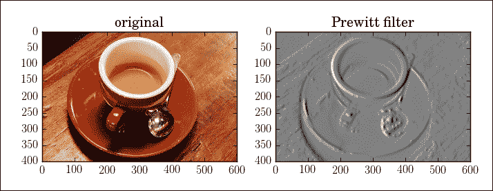
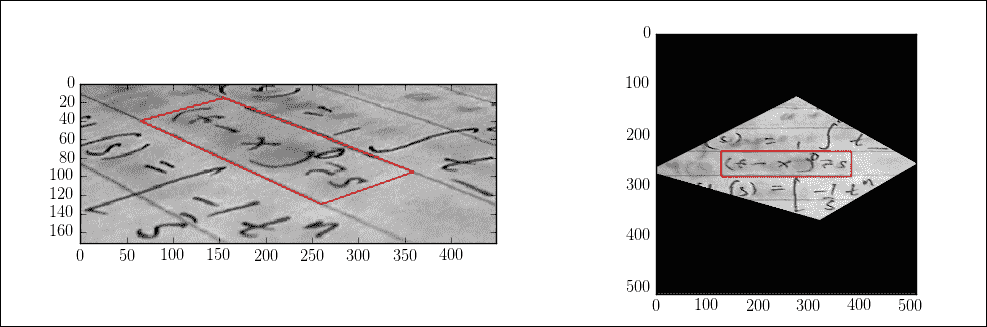
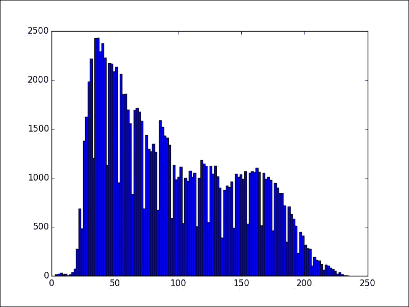
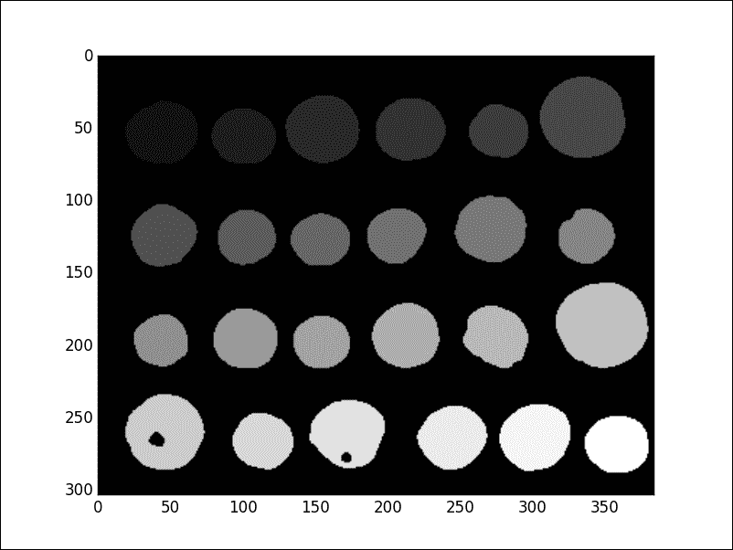
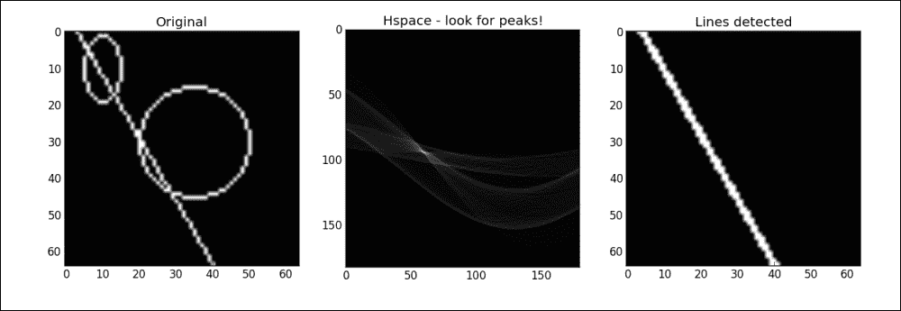
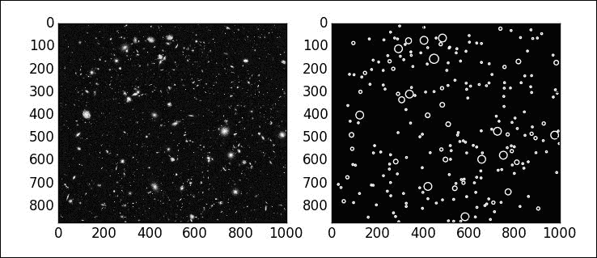
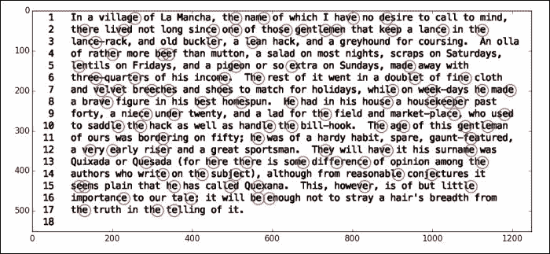

# 九、数字图像处理

*“数字图像处理”*是一个非常广阔的领域，它通过将图像表示为数学对象来处理图像。 根据目标，我们有四个子字段：

*   **Image acquisition**: The concern here is the effective representation of an object as an image. Clear examples are the digitalization of a photograph (that could be coded as a set of numerical arrays), or super-imposed information of the highest daily temperatures on a map (that could be coded as a discretization of a multivariate function). The processes of acquisition differ depending on what needs to be measured and the hardware that performs the measures. This topic is beyond the scope of this book but, if interested, some previous background can be obtained by studying the Python interface to OpenCV and any of the background libraries, such as **Python Imaging Library** (**PIL**) and the friendly PIL fork Pillow.

    ### 提示

    可以通过 [http://effbot.org/imagingbook/pil-index.htm](http://effbot.org/imagingbook/pil-index.htm) 上的 [http://effbot.org/](http://effbot.org/) 页面访问有关 PIL 的出色文档。 立即安装 SciPy 堆栈会在我们的系统中放置最新版本的 PIL 的副本。 如果需要，可以从 [http://pythonware.com/products/pil/](http://pythonware.com/products/pil/) 单独下载该库。 有关 Pillow 的信息，请参考 [http://pillow.readthedocs.org/](http://pillow.readthedocs.org/) 。

    可以在 [http://opencv.org/](http://opencv.org/) 中找到有关 OpenCV 的良好信息。 为了进一步了解 Python 的接口，我发现 [http://docs.opencv.org/3.0-beta/doc/py_tutorials/py_tutorials.html](http://docs.opencv.org/3.0-beta/doc/py_tutorials/py_tutorials.html) 上的教程非常有用。

    请注意，为 Python 安装 OpenCV 并不容易。 我的建议是从 Anaconda 或任何其他科学 Python 发行版执行此类安装。

*   **图像压缩**：这是这些子字段中技术最先进的，并且主要需要 NumPy，SciPy 和一些其他软件包中的高级库。 目标是使用尽可能少的数据来表示图像，从而保留大部分（理想情况下）相关信息。
*   **Image editing**: This, together with the following image analysis, is what we refer to as **Image processing**. Examples of the goals of image editing range from the restoration of damaged photographs, to the deblurring of a video sequence, or the removal of an object in an image, so that the removed area gets inpainted with coherent information. To deal with these operations, in the SciPy stack, we have the library `scipy.ndimage`, and the image processing toolkit `scikit-image`.

    ### 提示

    可以在 [http://docs.scipy.org/doc/scipy/reference/tutorial/ndimage.html](http://docs.scipy.org/doc/scipy/reference/tutorial/ndimage.html) 上找到有关多维图像处理库`scipy.ndimage`的大量参考资料和文档。 过滤器的启发性介绍。

    要探索图像处理工具包`scikit-image`，一个很好的初始资源是 [http://scikit-image.org/docs/stable/](http://scikit-image.org/docs/stable/) 官方页面上的文档。 这包括使用 NumPy 拍摄图像的速成班。

*   **图像分析**：这是一个有趣的领域，我们的目标是从表示为图像的对象中获取不同的信息。 想一想可以在一大群人的视频渲染中跟踪一个人的脸，或者在催化剂的显微照片上计算金原子数量的代码。 对于这些任务，我们通常将前两个库中的函数与上一章中讨论过的有用的工具包`scikit-learn`混合使用。

在我们的博览会中，我们将从一小部分开始，介绍如何在 SciPy 堆栈中表示数字图像。 我们将继续第二部分，介绍图像基本操作的性质。 其余各节将按顺序介绍压缩，编辑和分析技术。

我们介绍的大多数操作都以示例的可视化结束。 相应的代码通常是`matplotlib`命令的简单应用。 这些代码通常不包括在内，作为练习留给读者。 仅当引入特定的复杂布局或新颖的想法时，我们才会在演示文稿中包含这些代码。

# 数码影像

字典将像素（像素的缩写）定义为显示屏上照明的微小区域，从中构成图像是其中的一个。 因此，我们将数字图像视为一组像素，每个像素均由其位置（与选择的坐标类型无关）和该位置上相应图像的光强度来定义。

根据我们测量强度的方式，数字图像属于以下三种可能的类型之一：

*   二元
*   灰阶
*   颜色（有或没有 Alpha 通道）

## 二元

在二进制图像中，只有两种可能的强度-亮或暗。 传统上，此类图像最好实现为简单的二维布尔数组。 真表示亮点，而假表示暗点。

例如，要创建一个大小为 128 x 128 的二进制映像，并以半径为 6 的单个磁盘居中于位置（30，100），我们可以发出以下命令：

```py
In [1]: import numpy as np, matplotlib.pyplot as plt
In [2]: disk = lambda x,y: (x-30)**2 + (y-100)**2 <= 36
In [3]: image = np.fromfunction(disk, (128, 128))
In [4]: image.dtype
Out[4]: dtype('bool')

```


### 提示

在二进制图像上生成几何形状的另一种方法是模块`skimage.draw`或`skimage.morphology`中的一组实用程序。 例如，以前的代码可能生成如下：

```py
>>> from skimage.draw import circle
>>> image = np.zeros((128, 128)).astype('bool')
>>> image[circle(30, 100, 6)] = True

```

模块`skimage.draw`具有创建其他二维几何形状的例程：

*   **行**：`line`。 对于灰度图像，还存在线条的抗锯齿版本：`line_aa`。
*   **圆圈**：`circle`，`circle_perimeter`。 对于灰度图像，还有一个圆周抗锯齿版本：`circle_perimeter_aa`。
*   **椭圆**：`ellipse`，`ellipse_perimeter`。
*   **多边形**：`polygon`。

## 灰阶

灰度图像是代表黑白照片的传统方法。 在这些图像中，光的强度表示为不同的灰度等级。 白色表示最亮，黑色表示没有光。 不同刻度的数量是预先确定的，通常是二进位数（例如，我们可以选择少至 16 个刻度，或多达 256 个）。 在任何情况下，最高值始终保留为最亮的颜色（白色），最低值始终保留为最暗的颜色（黑色）。 一个简单的二维数组是存储此信息的好方法。

`scipy.misc`库具有符合该类别的测试图像。 在工具包`skimage`中，我们还有一些具有相同特征的测试图像：

```py
In [6]: from scipy.misc import lena; \
 ...: from skimage.data import coins
In [7]: lena().shape
Out[7]: (512, 512)
In [8]: lena()
Out[8]:
array([[162, 162, 162, ..., 170, 155, 128],
 [162, 162, 162, ..., 170, 155, 128],
 [162, 162, 162, ..., 170, 155, 128],
 ...,
 [ 43,  43,  50, ..., 104, 100,  98],
 [ 44,  44,  55, ..., 104, 105, 108],
 [ 44,  44,  55, ..., 104, 105, 108]])
In [9]: coins().shape
Out[9]: (303, 384)
In [10]: coins()
Out[10]:
array([[ 47, 123, 133, ...,  14,   3,  12],
 [ 93, 144, 145, ...,  12,   7,   7],
 [126, 147, 143, ...,   2,  13,   3],
 ...,
 [ 81,  79,  74, ...,   6,   4,   7],
 [ 88,  82,  74, ...,   5,   7,   8],
 [ 91,  79,  68, ...,   4,  10,   7]], dtype=uint8)

```


### 提示

在左侧，我们可以看到 Lena，这是从 1972 年 11 月的《花花公子》杂志上扫描出来的标准（有争议的）测试图像。 在右侧，我们可以看到庞贝古城的希腊硬币。 该图像已从布鲁克林博物馆收藏中下载。

# 颜色

在彩色图像中，我们有许多不同的方法来存储基础信息。 最常见的方法是 RGB 颜色空间，它也提供了用于创建算法的最简单的计算结构。 在这种方法中，图像表示至少包含三层。 对于每个像素，我们评估在相应位置获得所需颜色和强度所需的红色，绿色和蓝色量的组合信息。 第一层指示底层红色的强度。 第二层和第三层分别指示绿色和蓝色的强度：

```py
In [12]: from skimage.data import coffee
In [13]: coffee().shape
Out[13]: (400, 600, 3)
In [14]: coffee()
Out[14]:
array([[[ 21,  13,   8],
 [ 21,  13,   9],
 [ 20,  11,   8],
 ...,
 [228, 182, 138],
 [231, 185, 142],
 [228, 184, 140]],

 ...,

 [[197, 141, 100],
 [195, 137,  99],
 [193, 138,  98],
 ...,
 [158,  73,  38],
 [144,  64,  30],
 [143,  60,  29]]], dtype=uint8)

```


这张照片由 Rachel Michetti 拍摄，由 Pikolo Espresso Bar 提供。

为了收集与每个图层对应的数据，我们执行简单的切片操作：

```py
In [15]: plt.figure(); \
 ....: plt.subplot(131); \
 ....: plt.imshow(coffee()[:,:,0], cmap=plt.cm.Reds); \
 ....: plt.subplot(132); \
 ....: plt.imshow(coffee()[:,:,1], cmap=plt.cm.Greens); \
 ....: plt.subplot(133); \
 ....: plt.imshow(coffee()[:,:,2], cmap=plt.cm.Blues); \
 ....: plt.show()

```


本章中介绍的 SciPy 堆栈库中的所有功能均假定该方案中表示了任何彩色图像。 还有其他配色方案，旨在解决其他基本问题和图像属性。 在工具包`scikit-image`中，可以在子模块`skimage.color`中使用函数`convert-colorspace`来在大多数常见色彩空间之间进行转换。 例如，考虑**色相饱和度值**（ **HSV** ）颜色空间。 这是来自 RGB 颜色空间的点的圆柱坐标表示，其中围绕中心垂直轴的角度对应于**色调**（ **H** ），而距轴的距离对应于[ **饱和度**（ **S** ）。 高度对应于第三个**值**（ **V** ），即相对于饱和度的系统感知亮度（表示基础颜色组合的亮度）的表示形式：

```py
In [16]: from skimage.color import convert_colorspace
In [17]: convert_colorspace(coffee(), 'RGB', 'HSV')
Out[17]:
array([[[ 0.06410256,  0.61904762,  0.08235294],
 [ 0.05555556,  0.57142857,  0.08235294],
 [ 0.04166667,  0.6       ,  0.07843137],
 ...,
 [ 0.08148148,  0.39473684,  0.89411765],
 [ 0.08052434,  0.38528139,  0.90588235],
 [ 0.08333333,  0.38596491,  0.89411765]],

 ...,

 [[ 0.07044674,  0.49238579,  0.77254902],
 [ 0.06597222,  0.49230769,  0.76470588],
 [ 0.07017544,  0.49222798,  0.75686275],
 ...,
 [ 0.04861111,  0.75949367,  0.61960784],
 [ 0.0497076 ,  0.79166667,  0.56470588],
 [ 0.04532164,  0.7972028 ,  0.56078431]]])

```

### 提示

其他可用的色彩空间包括测量三色刺激值的 CIE XYZ 方法，或 CIE-LUB 和 CIE-LAB 色彩空间。 学习如何在 SciPy 堆栈环境中访问和使用它们的最佳资源是模块`skimage.color`的文档，位于其官方文档的页面上，网址为[，网址为 http://scikit-image.org/docs/stable/。 api / skimage.color.html](http://scikit-image.org/docs/stable/api/skimage.color.html) 。

通过添加具有适当权重的三层，还可以生成 RGB 颜色空间中提供的任何彩色图像的灰度版本。 在`skimage.color`模块中，例如，我们具有使用公式`output = 0.2125*red + 0.7154*green + 0.0721*blue`的函数`rgb2gray`或`rgb2grey`。

## Alpha 频道

在灰度或彩色图像中，有时我们会指示一个额外的图层，该图层为我们提供有关每个像素的不透明度的信息。 这称为 **alpha 通道**。 传统上，我们将图像的此属性合并为 RGB 的附加层，即 RGBA 色彩空间。 在这种情况下，此方案表示的图像具有四层而不是三层：

```py
In [18]: from skimage.data import horse
In [19]: horse().shape
Out[19]: (328, 400, 4)
In [20]: horse()
Out[20]:
array([[[255, 255, 255, 110],
 [255, 255, 255, 217],
 [255, 255, 255, 255],
 ...,
 [255, 255, 255, 255],
 [255, 255, 255, 217],
 [255, 255, 255, 110]],

 ...,

 [[255, 255, 255, 110],
 [255, 255, 255, 217],
 [255, 255, 255, 255],
 ...,
 [255, 255, 255, 255],
 [255, 255, 255, 217],
 [255, 255, 255, 110]]], dtype=uint8)

```

# 对数字图像的高级操作

在解决图像处理和压缩的挑战之前，值得一提的是检查我们对图像执行的基本操作的顺序。 这些运算是我们要探索的算法的基础。 他们自己精美地说明了数字图像处理的基本原理。 图像表示为数学对象，因此，可以将对相应对象的基本操作转换为对相应图像的物理操作或查询。

## 物体测量

在二进制图像的设置中，我们可以将图像视为平面的空白区域（背景为黑色）上的一组对象或斑点（白色）。 然后可以对所表示的每个对象执行不同的措施：

```py
In [1]: import numpy as np, matplotlib.pyplot as plt; \
 ...: from skimage.data import hubble_deep_field
In [2]: image = (hubble_deep_field()[:,:,0] > 120)

```


### 提示

**哈勃极致深场**：左图显示了宇宙的最远视图。 哈勃望远镜为 NASA 捕获了它，并将其上传到 [http://hubblesite.org/](http://hubblesite.org/) 。 可以在公共领域免费使用。

右边的图像（二进制图像）作为`True`值的子集，收集原始图像中代表的天体的选择。 我们通过简单的阈值操作获得了该二进制图像，我们在其中要求图片的红色强度大于 120 的那些像素。

从该二值图像中，我们可以轻松地标记和计数所选的天体，并计算其某些几何特性。 我们通过使用库`scipy.ndimage`中的`label`函数来实现：

```py
In [4]: from scipy.ndimage import label
In [5]: labels, num_features = label(image); \
 ...: print "Image contains {} objects".format(num_features)
Image contains 727 objects.

```

例如，使用功能`center_of_mass`计算每个物体的重心：

```py
In [6]: from scipy.ndimage import center_of_mass
In [7]: for k in range(1,11):
 ...:     location = str(center_of_mass(image, labels, k))
 ...:     print "Object {} center of mass at {}".format(k,location)
 ...:
Object  1 center of mass at (0.0, 875.5)
Object  2 center of mass at (4.7142857142857144, 64.857142857142861)
Object  3 center of mass at (3.3999999999999999, 152.19999999999999)
Object  4 center of mass at (6.0454545454545459, 206.13636363636363)
Object  5 center of mass at (5.0, 489.5)
Object  6 center of mass at (6.5, 858.0)
Object  7 center of mass at (6.0, 586.5)
Object  8 center of mass at (7.1111111111111107, 610.66666666666663)
Object  9 center of mass at (10.880000000000001, 297.45999999999998)
Object 10 center of mass at (12.800000000000001, 132.40000000000001)

```

## 数学形态

同样，在二进制图像的设置中，我们还有另一套有趣的操作，**数学形态学**。 基本的形态学操作包括使用常见的结构元素探测斑点的形状。 例如，考虑使用小正方形作为结构元素的形状腐蚀和膨胀的基本操作。

物体的腐蚀是当该物体在原始物体内部移动时，可以通过结构元素中心到达的该物体的点集。 另一方面，对象的膨胀是当结构的中心在原始对象内移动时由结构元素覆盖的一组点。 这两个操作的序列的组合导致图像编辑中功能更强大的算法。

另外，让我们观察两个更高级的形态学操作：形状骨架的计算以及形状中轴的位置（其距离变换的脊线）。 这些操作也是图像分析中有趣的过程的种子：

```py
In [8]: from scipy.ndimage.morphology import binary_erosion; \ 
 ...: from scipy.ndimage.morphology import binary_dilation; \
 ...: from skimage.morphology import skeletonize, medial_axis; \
 ...: from skimage.data import horse
In [9]: image = horse()[:,:,0]==0
In [10]: # Morphology via scipy.ndimage.morphology ; \
 ....: structuring_element = np.ones((10,10)); \
 ....: erosion = binary_erosion(image, structuring_element); \
 ....: dilation = binary_dilation(image, structuring_element)
In [11]: # Morphology via skimage.morphology ; \
 ....: skeleton = skeletonize(image); \
 ....: md_axis  = medial_axis(image)
In [12]: plt.figure(); \
 ....: plt.subplot2grid((2,4), (0,0), colspan=2, rowspan=2); \
 ....: plt.imshow(image); \
 ....: plt.gray(); \
 ....: plt.title('Original Image'); \
 ....: plt.subplot2grid((2,4), (0,2)); \
 ....: plt.imshow(erosion); \
 ....: plt.title('Erosion'); \
 ....: plt.subplot2grid((2,4), (0,3)); \
 ....: plt.imshow(dilation); \
 ....: plt.title('Dilation'); \
 ....: plt.subplot2grid((2,4), (1,2)); \
 ....: plt.imshow(skeleton); \
 ....: plt.title('Skeleton'); \
 ....: plt.subplot2grid((2,4), (1,3)); \
 ....: plt.imshow(md_axis); \
 ....: plt.title('Medial Axis'); \
 ....: plt.show()

```


### 提示

马的黑白剪影，由 Andreas Preuss 绘制并上传到 [https://openclipart.org/](https://openclipart.org/) 的公共领域。

## 平滑过滤器

我们可以将图像视为多元函数。 在这种情况下，有一些操作可以计算出具有某些良好属性的原始值的近似值。 一个典型的例子是创建图像的平滑版本。 这些是算法的基石，其中存在噪声或不必要的复杂纹理可能会导致令人困惑的结果。

以高斯滤波器为例，一个函数与均值`mu=0`和用户定义的标准`deviation sigma`的高斯核的卷积：

```py
In [13]: from scipy.ndimage import gaussian_filter; \
 ....: from skimage.color import rgb2gray; \
 ....: from skimage.data import coffee
In [14]: image = coffee()
In [15]: smooth_image = gaussian_filter(rgb2gray(image), sigma=2.5)

```


请注意，右侧的图像（原始图像的平滑版本）似乎模糊。 因此，了解平滑机制也是图像恢复算法的良好基础。

## 多元演算

现在通过将图像视为足够平滑的强度函数（使用或不使用平滑滤波器），就多元演算技术而言，可以进行许多操作。 例如，Prewitt 和 Sobel 运算符计算近似于所述函数的梯度范数。 每个位置上的相应值评估具有边缘的可能性，因此可用于构造可靠的特征检测算法：

```py
In [17]: from scipy.ndimage import prewitt
In [18]: gradient_approx = prewitt(smooth_image)

```



由于原始图像的特性及其平滑版本，在这种情况下，渐变幅度的绝对值（右）的范围从 0（黑色）到 0.62255043871863613（白色）。 因此，较亮的区域表示可能的边缘的位置，而较暗的区域表示较平坦的区域的位置。

二阶导数的和（拉普拉斯算子）也用于特征检测或运动估计的算法中：

```py
In [20]: from scipy.ndimage import laplace
In [21]: laplace_approx = laplace(smooth_image)

```


在这种情况下，拉普拉斯信息与梯度的组合会为局部极值的位置和所表示对象的几何形状提供线索。

Hessian 矩阵（标量值函数的二阶偏导数）用于描述图像的局部曲率。 它是斑点检测过程中的有用组件。 我们在模块`skimage.feature`中将这个运算符实现为例程`hessian_matrix`。 为了近似于黑森州的行列式，我们在同一模块中有例程`hessian_matrix_det`。

## 统计过滤器

将图像视为多维信号，我们可以进行许多具有统计性​​质的滤波操作。

例如，可以分别使用`scipy.ndimage`中的函数`maximum_filter`，`minimum_filter`，`median_filter`或`percentile_filter`计算最大，最小，中值或百分位滤波器。 这些滤波器针对图像上的每个像素和给定的足迹分别计算以像素为中心的足迹上的图像的最大，最小，中位数或请求的百分位。

在以下示例中，我们使用 10 x 10 正方形作为占位面积来计算第 80 个百分位数：

```py
In [23]: from scipy.ndimage import percentile_filter
In [24]: prctl_image = percentile_filter(image[:,:,0],
 ....:                                 percentile=-20, size=10)

```


可在子模块`skimage.filters.rank`中找到此类别中更多相关的过滤器。

## 傅立叶分析

通过再次将图像视为多元函数，我们可以对其进行傅立叶分析。 傅里叶变换和离散余弦变换的应用主要用于过滤，从图像中提取信息以及压缩：

```py
In [25]: from scipy.fftpack import fft2, ifft2, fftshift; \
 ....: from skimage.data import text
In [26]: image = text()
In [27]: frequency = fftshift(fft2(image))

```

函数的频率通常是复数值函数。 为了使其可视化，我们将介绍每个输出值的模块和角度。 为了更好地解释，我们通常通过对频率的模块应用对数校正来在视觉上增强结果：

```py
In [28]: plt.figure(); \
 ....: ax1 = plt.subplot2grid((2,2), (0,0), colspan=2); \
 ....: plt.imshow(image)
Out[28]: <matplotlib.image.AxesImage at 0x11deb1650>
In [29]: module = np.absolute(frequency); \
 ....: angles = np.angle(frequency)
In [30]: from skimage.exposure import adjust_log
In [31]: ax2 = plt.subplot2grid((2,2), (1,0)); \
 ....: plt.imshow(adjust_log(module)); \
 ....: ax3 = plt.subplot2grid((2,2), (1,1)); \
 ....: plt.imshow(angles); \
 ....: plt.show()

```

### 注意

**文本**是从 Wikipedia 下载并发布到公共领域的图像。 可以在 [https://en.wikipedia.org/wiki/File:Corner.png](https://en.wikipedia.org/wiki/File:Corner.png) 中找到。


请注意，如果我们忽略了图像频率中的部分信息（例如，大约 25％的信息），然后执行反演，将会发生什么：

```py
In [32]: frequency.shape
Out[32]: (172, 448)
In [33]: smaller_frequency = frequency[:,448/2-172/2:448/2+172/2]
In [34]: new_image = ifft2(smaller_frequency); \
 ....: new_image = np.absolute(new_image)

```


尽管我们错过了原始频率的四分之一，但反演为我们提供了一个图像，该图像具有与原始频率完全相同的信息。 我们忽略了那部分较低频率实际上实际上失去了什么？ 这个问题的答案导致了有趣的重建，压缩和分析算法。

## 小波分解

我们可以使用 Tariq Rashid 编写的软件包`PyWavelets`执行小波分解。

### 提示

可以从 [https://pypi.python.org/pypi/PyWavelets](https://pypi.python.org/pypi/PyWavelets) 下载。 可以按照这些页面上的说明进行后安装。 对于某些体系结构，安装可能很棘手。 在这种情况下，我们建议您从科学的 Python 发行版（例如 Anaconda）中进行工作。 例如，我们可以使用`binstar/conda`命令搜索软件包：

```py
% binstar search -t conda pywavelets
% conda install -c conda.binstar.org/dgursoy pywavelets

```

请注意，此库中实现了许多不同的小波系列：

```py
In [36]: import pywt
In [37]: pywt.families()
Out[37]: ['haar', 'db', 'sym', 'coif', 'bior', 'rbio', 'dmey']
In [38]: print pywt.wavelist()
['bior1.1', 'bior1.3', 'bior1.5', 'bior2.2', 'bior2.4', 'bior2.6',
 'bior2.8', 'bior3.1', 'bior3.3', 'bior3.5', 'bior3.7', 'bior3.9',
 'bior4.4', 'bior5.5', 'bior6.8', 'coif1', 'coif2', 'coif3', 'coif4',
 'coif5', 'db1', 'db2', 'db3', 'db4', 'db5', 'db6', 'db7', 'db8',
 'db9', 'db10', 'db11', 'db12', 'db13', 'db14', 'db15', 'db16',
 'db17', 'db18', 'db19', 'db20', 'dmey', 'haar', 'rbio1.1','rbio1.3',
 'rbio1.5', 'rbio2.2', 'rbio2.4', 'rbio2.6', 'rbio2.8', 'rbio3.1',
 'rbio3.3', 'rbio3.5', 'rbio3.7', 'rbio3.9', 'rbio4.4', 'rbio5.5',
 'rbio6.8', 'sym2', 'sym3', 'sym4', 'sym5', 'sym6', 'sym7', 'sym8',
 'sym9', 'sym10', 'sym11', 'sym12', 'sym13', 'sym14', 'sym15',
 'sym16', 'sym17', 'sym18', 'sym19', 'sym20']

```

让我们看看如何使用`haar`小波计算图像`skimage.data.camera`的表示形式。 由于原始图像的边长为`512=2^9`，因此在小波系数的计算中我们将需要九个级别：

```py
In [39]: from skimage.data import camera
In [40]: levels = int(np.floor(np.log2(camera().shape).max())); \
 ....: print "We need {} levels".format(levels)
We need 9 levels
In [41]: wavelet = pywt.Wavelet('haar')
In [42]: wavelet_coeffs = pywt.wavedec2(camera(), wavelet,
 ....:                                level=levels)

```

对象`wavelet_coeffs`是具有十个条目的元组，第一个是最高级别 0 的近似值。这始终是一个单一系数。 `wavelet_coeffs`中的第二个条目是一个三元组，包含级别 1 的三个不同的细节（水平，垂直和对角线）。每个连续的条目是另一个 3 元组，其中包含较高级别的三个不同的细节（`n = 2, 3, 4, 5, 6, 7, 8, 9`） 。

注意每个级别的系数数：

```py
In [43]: for index, level in enumerate(wavelet_coeffs):
 ....:     if index > 0:
 ....:         value = level[0].size + level[1].size + level[2].size
 ....:         print "Level {}: {}".format(index, value)
 ....:     else:
 ....:         print "Level 0: 1"
 ....:
Level 0: 1
Level 1: 3
Level 2: 12
Level 3: 48
Level 4: 192
Level 5: 768
Level 6: 3072
Level 7: 12288
Level 8: 49152
Level 9: 196608

```

# 图像压缩

压缩的目的是通过比仅将每个像素存储在阵列中所需的信息单元（例如字节）少的方法来表示图像。

例如，回想一下我们在第一部分中构建的二进制图像； 那是由 16,384 位（`True` / `False`）表示的 128 x 128 图像，其中除 113 位之外的所有位都是`False`。 当然，必须有一种更有效的方法来以少于 16384 位的方式存储此信息。 我们只需提供画布的大小（两个字节），磁盘中心的位置（再增加两个字节）以及其半径值（另一个字节）就可以做到这一点。 现在，我们有了一个仅使用 40 位的新表示形式（假设每个字节由 8 位组成）。 我们将这种精确表示称为无损压缩。

压缩图像的另一种可能方式是例如将彩色图像转换为其黑白表示的过程。 我们对图像`skimage.data.coffee`执行了此操作，将大小为 3 x 400 x 600（720,000 字节）的对象变成大小为 400 x 600（240,000 字节）的对象。 尽管在此过程中，我们失去了查看其颜色的能力。 这种操作适当地称为有损压缩。

在接下来的页面中，我们将从数学的角度探讨图像压缩的几种设置。 我们还将开发高效的代码，以从 SciPy 堆栈内部执行这些操作。 我们与创建用于读取或保存这些压缩图像的代码无关。 为此，我们在 Python Imaging Library 中已经有了可靠的实用程序，这些实用程序也已导入到模块`scipy.misc`，`scipy.ndimage`和工具包`scikit-image`中的不同函数中。 如果我们希望将代表黑白摄影的`numpy`数组 A 压缩并存储为不同的文件类型，我们可以简单地按照以下方式发布内容：

```py
In [1]: import numpy as np; \
 ...: from scipy.misc import lena, imsave
In [2]: A = lena()
In [3]: imsave("my_image.png", A); \
 ...: imsave("my_image.tiff", A); \
 ...: imsave("my_image.pcx", A); \
 ...: imsave("my_image.jpg", A); \
 ...: imsave("my_image.gif", A)

```

快速查看我们正在处理的文件夹的内容，显示创建的文件的大小。 例如，在* NIX 系统下，我们可以发出以下命令：

```py
% ls -nh my_image.*
-rw-r--r--  1 501  20   257K May 29 08:16 my_image.bmp
-rw-r--r--  1 501  20    35K May 29 08:16 my_image.jpg
-rw-r--r--  1 501  20   273K May 29 08:15 my_image.pcx
-rw-r--r--  1 501  20   256K May 29 08:16 my_image.tiff

```

注意结果文件的大小不同。 无损格式 PCX，BMP 和 TIFF 提供类似的压缩率（分别为 273K，257K 和 256K）。 另一方面，JPEG 有损格式提供了明显的改进（35 K）。

## 无损压缩

用于图像处理的一些最常见的无损压缩方案如下：

*   **游程长度编码**：当原始图像可视为基于调色板的位图（例如，卡通或计算机图标）时，此方法用于 PCX，BMP，TGA 和 TIFF 文件类型。
*   **Lempel-Ziv-Welch（LZW）**：默认情况下，它以 GIF 图像格式使用。
*   **通缩**：这非常强大且可靠。 这是用于 PNG 图像文件的方法。 它也是用于创建 ZIP 文件的压缩方法。
*   **链码**：这是编码二进制图像的首选方法，尤其是当这些图像包含少量大斑点时。

例如，让我们研究一个合适的示例中游程长度编码是如何工作的。 考虑棋盘图像`skimage.data.checkerboard`。 我们以 200 x 200 的整数值数组形式接收它，因此，它需要 40,000 字节的存储空间。 注意，它可以被视为只有两种颜色的基于调色板的位图。 我们首先将每个零值转换为`B`，然后将每个 255 转换为`W`：

```py
In [5]: from skimage.data import checkerboard
In [6]: def color(value):
 ...:     if value==0: return 'B'
 ...:     else: return 'W'
 ...:
In [7]: image = np.vectorize(color)(checkerboard()); \
 ...: print image
[['W' 'W' 'W' ..., 'B' 'B' 'B']
 ['W' 'W' 'W' ..., 'B' 'B' 'B']
 ['W' 'W' 'W' ..., 'B' 'B' 'B']
 ...,
 ['B' 'B' 'B' ..., 'W' 'W' 'W']
 ['B' 'B' 'B' ..., 'W' 'W' 'W']
 ['B' 'B' 'B' ..., 'W' 'W' 'W']]

```

接下来，我们创建一个对字符串列表和字符串进行编码的函数，而是生成一个由“单字符加计数”形式的模式组成的字符串：

```py
In [7]: from itertools import groupby
In [8]: def runlength(string):
 ...:     groups = [k + str(sum(1 for _ in g)) for k,g in
 ...:               groupby(string)]
 ...:     return ''.join(groups)
 ...:

```

请注意，当我们将图像重写为包含其颜色的扁平字符串并以这种方式对其进行编码时，会发生什么：

```py
In [9]: coded_image = runlength(image.flatten().tolist())
In [10]: print coded_image
W26B23W27B23W27B23W27B24W26B23W27B23W27B23W27B24W26B23W27B23W27B23W27
B24W26B23W27B23W27B23W27B24W26B23W27B23W27B23W27B24W26B23W27B23W27B23
W27B24W26B23W27B23W27B23W27B24W26B23W27B23W27B23W27B24W26B23W27B23W27
B23W27B24W26B23W27B23W27B23W27B24W26B23W27B23W27B23W27B24W26B23W27B23
W27B23W27B24W26B23W27B23W27B23W27B24W26B23W27B23W27B23W27B24W26B23W27
B23W27B23W27B24W26B23W27B23W27B23W27B24W26B23W27B23W27B23W27B24W26B23
W27B23W27B23W27B24W26B23W27B23W27B23W27B24W26B23W27B23W27B23W27B24W26
B23W27B23W27B23W27B24W26B23W27B23W27B23W27B24W26B
...
26B24W27B23W27B23W27B23W26B24W27B23W27B23W27B23W26B24W27B23W27B23W27B
23W26B24W27B23W27B23W27B23W26B24W27B23W27B23W27B23W26B24W27B23W27B23W
27B23W26B24W27B23W27B23W27B23W26B24W27B23W27B23W27B23W26B24W27B23W27B
23W27B23W26B24W27B23W27B23W27B23W26B24W27B23W27B23W27B23W26B24W27B23W
27B23W27B23W26B24W27B23W27B23W27B23W26B24W27B23W27B23W27B23W26B24W27B
23W27B23W27B23W26B24W27B23W27B23W27B23W26B24W27B23W27B23W27B23W26B24W
27B23W27B23W27B23W26B24W27B23W27B23W27B23W26B24W27B23W27B23W27B23W26
In [11]: len(coded_image)
Out[11]: 4474

```

我们将其大小减小到只有 4,474 字节。 现在，您如何将这些信息解码回图像？ 假设为您提供了该字符串，图像大小的附加信息（200 x 200）和调色板信息（黑色为`B`，白色为`W`）。

另一个不错的练习是找到其他提到的无损压缩方法的描述，并为其对应的编码器和解码器编写 Python 代码。

## 有损压缩

在许多可能的有损压缩方案中，我们将集中于变换编码的方法。 例如，文件类型 JPEG 基于离散余弦变换。

在任何这些情况下，过程都是相似的。 我们假设图像是一个函数。 它的可视化可视为其图形的表示，因此这是一个空间操作。 相反，我们可以计算图像的变换（例如，傅立叶，离散余弦或小波）。 现在，图像由值的集合表示：相应变换中函数的系数。 现在，当我们忽略大量这些系数并使用相应的逆变换重构函数时，就会发生压缩。

在处理上一节中的傅立叶分析技术时，我们已经观察到在忽略图像较低频率 25％之后重建图像的行为。 这不是忽略系数的唯一方法。 例如，我们可以改为收集具有足够大的绝对值的系数。 让我们检查一下这次使用离散余弦变换对同一图像执行该操作的结果：

```py
In [12]: from skimage.data import text; \
 ....: from scipy.fftpack import dct, idct
In [13]: image = text().astype('float')
In [14]: image_DCT = dct(image)

```

让我们忽略绝对值小于或等于 1000 的值。 请注意，此类系数的数量超过 256,317（几乎是原始数据的 98％）：

```py
In [15]: mask = np.absolute(image_DCT)>1000
In [16]: compressed = idct(image_DCT * mask)

```


尽管丢掉了大多数系数，但是重建还是非常忠实的。 有明显的文物，但这些文物并不太分散注意力。

我们可以使用小波变换执行类似的操作。 在此设置下执行压缩的一种简单方法是忽略整个系数级别，然后进行重构。 在前面部分中的示例（具有九个系数级别的图像`skimage.data.camera`的 Haar 小波表示）中，如果我们消除了后两个层次，则将丢弃 245760 个系数（几乎占原始信息的 94％ ）。 观察重建质量：

```py
In [18]: import pywt; \
 ....: from skimage.data import camera
In [19]: levels = int(np.floor(np.log2(camera().shape).max()))
In [20]: wavelet = pywt.Wavelet('haar')
In [21]: wavelet_coeffs = pywt.wavedec2(camera(), wavelet,
 ....:                                level=levels)
In [22]: compressed = pywt.waverec2(wavelet_coeffs[:8], wavelet)

```


与变换编码相似的是通过奇异值分解进行压缩的方法。 在这种情况下，我们将图像视为矩阵。 我们通过其奇异值表示它。 当我们忽略大量较小的奇异值，然后进行重构时，就会发生这种情况下的压缩。 有关此技术的示例，请阅读*《数值和科学计算的学习科学》，第二版*的第 3 章和*用于线性代数的科学*。

# 图片编辑

编辑的目的是更改数字图像，通常是为了改善其属性或将其转变为进一步处理的中间步骤。

让我们研究一下不同的编辑方法：

*   领域的转变
*   强度调整
*   影像还原
*   图像修复

## 领域的转变

在这种设置下，我们通过首先更改像素的位置来解决图像的转换：旋转，压缩，拉伸，漩涡，裁切，透视图控制等等。 完成对原始域中像素的转换后，我们将观察输出的大小。 如果此图像中的像素多于原始像素，则多余的位置将填充通过对给定数据进行插值获得的数值。 当然，我们确实对执行的插值类型有所控制。 为了更好地说明这些技术，我们将实际图像（例如，Lena）与作为棋盘格的域表示形式配对：

```py
In [1]: import numpy as np, matplotlib.pyplot as plt
In [2]: from scipy.misc import lena; \
 ...: from skimage.data import checkerboard
In [3]: image = lena().astype('float')
 ...: domain = checkerboard()
In [4]: print image.shape, domain.shape
Out[4]: (512, 512) (200, 200)

```

### 调整大小

在进行图像和域的配对之前，我们必须确保它们都具有相同的大小。 一种快速的解决方法是重新调整两个对象的大小，或者只是调整其中一个图像的大小以匹配另一个图像的大小。 让我们从第一个选择出发，以便我们可以说明在`skimage.transform`模块中用于调整大小和缩放的两个函数的用法：

```py
In [5]: from skimage.transform import rescale, resize
In [6]: domain = rescale(domain, scale=1024./200); \
 ...: image  = resize(image, output_shape=(1024, 1024), order=3)

```

观察在调整大小的操作中我们如何请求双三次插值。

### 漩涡

要执行漩涡，我们从模块`skimage.transform`调用函数`swirl`：

### 提示

在本节的所有示例中，我们将在执行请求的计算后直观地呈现结果。 在所有情况下，提供图像的调用语法都是相同的。 对于给定的操作映射，我们发出命令`display(mapping, image, domain)`，其中例程`display`定义如下：

```py
def display(mapping, image, domain):
 plt.figure()
 plt.subplot(121)
 plt.imshow(mapping(image))
 plt.gray()
 plt.subplot(122)
 plt.imshow(mapping(domain))
 plt.show()

```

为了简洁起见，我们不会在以下代码中包含此命令，但假定每次都调用它：

```py
In [7]: from skimage.transform import swirl
In [8]: def mapping(img):
 ...:     return swirl(img, strength=6, radius=512)
 ...:

```


### 几何变换

通过功能从模块`scipy.ndimage`或`skimage.transform`旋转，可以实现围绕任何位置（无论是在图像域的内部还是外部）的简单旋转。 它们本质上是相同的，但是`scikit-image`工具包中函数的语法更加用户友好：

```py
In [10]: from skimage.transform import rotate
In [11]: def mapping(img):
 ....:     return rotate(img, angle=30, resize=True, center=None)
 ....:

```

这样可以绕图像中心（`center=None`）逆时针旋转 30 度（`angle=30`）。 扩展输出图像的大小，以确保输出（`resize=True`）中存在所有原始像素：


旋转是所谓仿射变换的一种特殊情况-旋转与比例（每个维度一个），剪切和平移的组合。 仿射变换又是单应性的一种特殊情况（射影变换）。 库`skimage.transform`允许学习非常舒适的设置，而不是学习各种函数（针对每种几何变换）。 有一个通用函数（`warp`）被请求的几何变换调用并执行计算。 每个合适的几何变换都已使用合适的 Python 类进行了初始化。 例如，对于 *x* ，以围绕坐标为（512，-2048），比例因子分别为 2 和 3 个单位的点的逆时针旋转角度为 30 度执行仿射变换。 和 *y* 坐标，我们发出以下命令：

```py
In [13]: from skimage.transform import warp, AffineTransform
In [14]: operation = AffineTransform(scale=(2,3), rotation=np.pi/6, \
 ....:                             translation = (512, -2048))
In [15]: def mapping(img):
 ....:     return warp(img, operation)
 ....:

```


观察变换后的棋盘中的所有线如何平行或垂直-仿射变换会保留角度。

下面说明了单应性的效果：

```py
In [17]: from skimage.transform import ProjectiveTransform
In [18]: generator = np.matrix('1,0,10; 0,1,20; -0.0007,0.0005,1'); \
 ....: homography = ProjectiveTransform(matrix=generator); \
 ....: mapping = lambda img: warp(img, homography)

```


观察与仿射变换不同的是，线如何不再全部平行或垂直。 现在所有垂直线都入射在一个点上。 所有水平线也入射在不同点。

例如，当我们需要执行透视控制时，同形异义词才真正有用。 例如，图像`skimage.data.text`明显倾斜。 通过选择我们认为是完美矩形的四个角（我们通过视觉检查来估计这样的矩形），我们可以计算出单应性，从而将给定的图像转换为没有任何角度的图像。 代表几何变换的 Python 类使我们可以非常轻松地执行此估算，如以下示例所示：

```py
In [20]: from skimage.data import text
In [21]: text().shape
Out[21]: (172, 448)
In [22]: source = np.array(((155, 15),  (65, 40),
 ....:                    (260, 130), (360, 95),
 ....:                    (155, 15)))
In [23]: mapping = ProjectiveTransform()

```

让我们估计将单点转换成给定点集为大小为 48 x 256 的完美矩形的单应性，该矩形以 512 x 512 大小的输出图像为中心。输出图像大小的选择取决于对角线的对角线长度 原始图像（约 479 像素）。 这样，在计算了单应性之后，输出可能包含原始图像的所有像素：

### 提示

观察到我们在源中两次包含了一个顶点。 对于下面的计算，这不是绝对必要的，但是它将使矩形的可视化更容易编码。 我们对目标矩形使用相同的技巧。

```py
In [24]: target = np.array(((256-128, 256-24), (256-128, 256+24),
 ....:                    (256+128, 256+24), (256+128, 256-24),
 ....:                    (256-128, 256-24)))
In [25]: mapping.estimate(target, source)
Out[25]: True
In [26]: plt.figure(); \
 ....: plt.subplot(121); \
 ....: plt.imshow(text()); \
 ....: plt.gray(); \
 ....: plt.plot(source[:,0], source[:,1],'-', lw=1, color='red'); \
 ....: plt.xlim(0, 448); \
 ....: plt.ylim(172, 0); \
 ....: plt.subplot(122); \
 ....: plt.imshow(warp(text(), mapping,output_shape=(512, 512))); \
 ....: plt.plot(target[:,0], target[:,1],'-', lw=1, color='red'); \
 ....: plt.xlim(0, 512); \
 ....: plt.ylim(512, 0); \
 ....: plt.show()

```



### 提示

例如，需要其他更复杂的几何运算来修复渐晕以及摄影镜头产生的其他一些畸变。 传统上，一旦我们获取图像，我们就假定所有这些失真都存在。 通过了解用于拍照的设备的技术规格，我们可以自动纠正这些缺陷。 考虑到这一目的，在 SciPy 堆栈中，我们可以通过软件包`lensfunpy`（ [https：/ /pypi.python.org/pypi/lensfunpy](https://pypi.python.org/pypi/lensfunpy) ）。

有关用法和文档的示例，请访问 [http://pythonhosted.org/lensfunpy/api/](http://pythonhosted.org/lensfunpy/api/) 上的`lensfunpy` API 参考。

## 强度调整

在此类别中，我们有一些操作只能遵循全局公式来修改图像的强度。 因此，通过使用纯 NumPy 运算，通过创建适应所需公式的矢量化函数，可以轻松地对所有这些运算进行编码。

例如，可以根据黑白摄影中的曝光来解释这些操作的应用。 因此，本节中的所有示例都适用于灰度图像。

我们主要通过三种方法来处理图像强度来增强图像：

*   直方图均衡
*   强度限幅/调整大小
*   对比度调整

### 直方图均衡

此设置的起点始终是强度直方图（或更准确地说，是像素强度值的直方图）的概念-一种功能，该功能指示在该图像中找到的每个不同强度值处的图像像素数。

例如，对于原始版本的 Lena，我们可以发出以下命令：

```py
In [27]: plt.figure(); \
 ....: plt.hist(lena().flatten(), 256); \
 ....: plt.show()

```


直方图均衡化的操作通过以某种方式修改直方图以使大多数相关强度具有相同影响的方式来改善图像的对比度。 我们可以通过从模块`skimage.exposure`调用任何函数`equalize_hist`（纯直方图均衡）或`equalize_adaphist`（**对比度受限的自适应直方图均衡**（ **CLAHE** ）。

请注意，在对图像`skimage.data.moon`应用直方图均衡后，明显改善了：

### 提示

在以下示例中，我们在所有相关图像下方包括了相应的直方图，以进行比较。 执行此可视化的合适代码如下：

```py
def display(image, transform, bins):
 target = transform(image)
 plt.figure()
 plt.subplot(221)
 plt.imshow(image)
 plt.gray()
 plt.subplot(222)
 plt.imshow(target)
 plt.subplot(223)
 plt.hist(image.flatten(), bins)
 plt.subplot(224)
 plt.hist(target.flatten(), bins)
 plt.show()

```

```py
In [28]: from skimage.exposure import equalize_hist; \
 ....: from skimage.data import moon
In [29]: display(moon(), equalize_hist, 256)

```


### 强度限幅/调整大小

直方图上的峰表示存在特定强度，该强度明显比其相邻强度大。 如果我们希望隔离峰附近的强度，则可以对原始图像使用纯 NumPy 遮罩/剪切操作。 如果不需要存储结果，我们可以通过在库`matplotlib.pyplot`中使用命令`clim`来要求对结果进行快速可视化。 例如，要隔离 Lena 最高峰附近的强度（大约在 150 至 160 之间），我们可以发出以下命令：

```py
In [30]: plt.figure(); \
 ....: plt.imshow(lena()); \
 ....: plt.clim(vmin=150, vmax=160); \
 ....: plt.show()

```

请注意，尽管此操作将强度的代表性范围从 256 减小到了 10，但如何为我们提供了一个新图像，该图像具有足够的信息来重建原始图像。 当然，我们也可以将此操作视为有损压缩方法：


### 对比增强

削波强度的一个明显缺点是失去了感知到的明暗对比。 为了克服这种损失，最好采用不减小范围大小的公式。 在许多符合该数学性质的可用公式中，最成功的公式是那些复制采集方法光学性质的公式。 我们研究以下三种情况：

*   **伽玛校正**：人类视觉遵循幂函数，对较暗色调之间的相对差异比较亮色调之间的相对差异更敏感。 采集设备捕获的每个原始图像可能分配太多的位或太多的带宽，以突出显示人类实际上无法区分。 同样，太少的位/带宽可能无法分配给图像的较暗区域。 通过操作此幂函数，我们能够处理正确的位数和带宽。
*   **S 形校正**：与位数和带宽无关，通常希望保持感知的明暗对比。 然后根据从心理物理适应性实验的结果发展出来的经验对比增强模型设计 S 型重映射功能。
*   **对数校正**：这是一个纯粹的数学过程，旨在通过转换为对数范围来扩展自然低对比度图像的范围。

为了对图像执行伽玛校正，我们可以在模块`skimage.exposure`中使用功能`adjust_gamma`。 等效的数学运算是幂律关系`output = gain * input^gamma`。 当我们选择指数`gamma=2.5`而没有增益*（* `gain=1.0` *）*时，观察结肠结肠染色显微照片的较亮区域的定义有所改善：

```py
In [31]: from skimage.exposure import adjust_gamma; \
 ....: from skimage.color import rgb2gray; \
 ....: from skimage.data import immunohistochemistry
In [32]: image = rgb2gray(immunohistochemistry())
In [33]: correction = lambda img: adjust_gamma(img, gamma=2.5,
 ....:                                       gain=1.)

```

请注意，显微照片右下部分的对比度有了很大的改善，从而可以更好地描述和区分观察到的物体：


苏木精复染的免疫组织化学染色。 该图像在显微镜和分子图像处理中心（CMMI）上获得。

为了根据给定的`gain`和`cutoff`系数执行 S 型校正，我们根据公式`output = 1/(1 + exp*(gain*(cutoff - input)))`在`skimage.exposure`中采用函数`adjust_sigmoid`。 例如，使用`gain=10.0`和`cutoff=0.5`（默认值），我们可以获得以下增强：

```py
In [35]: from skimage.exposure import adjust_sigmoid
In [36]: display(image[:256, :256], adjust_sigmoid, 256)

```

请注意，增强图像中细胞壁的定义有所改善：


当增强图像频率的可视化时，我们已经在上一节中探讨了对数校正。 这等效于将`np.log1p`的矢量化版本应用于强度。 `scikit-image`工具包中的相应功能是子模块`exposure`中的`adjust_log`。

## 影像还原

在这种图像编辑类别中，目的是修复由于图像的后期处理或预处理，甚至消除由采集设备产生的失真而引起的损坏。 我们探索两种经典情况：

*   降噪
*   锐化和模糊

### 降噪

在数字图像处理中，根据定义，噪声是采集设备产生的强度（或颜色）的随机变化。 在所有可能的噪声类型中，我们承认以下四个关键情况：

*   **高斯噪声**：我们向每个像素添加从具有正态分布和固定均值的随机变量获得的值。 我们通常在图像的每个像素上允许相同的方差，但是根据位置更改方差是可行的。
*   **泊松噪声**：对于每个像素，我们添加一个从具有泊松分布的随机变量获得的值。
*   **盐和胡椒粉**：这是一种替换噪声，其中某些像素用零（黑色或胡椒）代替，而某些像素用 1（白色或盐）代替。
*   **斑点**：这是一种可乘的噪声，其中每个像素都由公式`output = input + n * input`修改。 修饰符`n`的值是从固定平均值和方差均匀分布的随机变量获得的值。

为了模拟所有这些噪声，我们使用了模块`skimage.util`中的实用程序`random_noise`。 让我们以一个共同的形象来说明各种可能性：

```py
In [37]: from skimage.data import camera; \
 ....: from skimage.util import random_noise
In [38]: gaussian_noise = random_noise(camera(), 'gaussian',
 ....:                               var=0.025); \
 ....: poisson_noise = random_noise(camera(), 'poisson'); \
 ....: saltpepper_noise = random_noise(camera(), 's&p',
 ....:                                 salt_vs_pepper=0.45); \
 ....: speckle_noise = random_noise(camera(), 'speckle', var=0.02)
In [39]: variance_generator = lambda i,j: 0.25*(i+j)/1022\. + 0.001; \
 ....: variances = np.fromfunction(variance_generator,(512,512)); \
 ....: lclvr_noise = random_noise(camera(), 'localvar',
 ....:                            local_vars=variances)

```

在最后一个示例中，我们创建了一个函数，该函数根据到图像上角的距离分配`0.001`和`0.026`之间的差异。 当我们可视化`skimage.data.camera`的相应噪点版本时，我们看到，随着我们靠近图片的右下角，降级程度变得更强。

以下是相应的噪点图像的可视化示例：


降噪的目的是消除尽可能多的不想要的信号，因此我们获得的图像尽可能接近原始图像。 当然，诀窍是在没有任何噪声特性的事先知识的情况下这样做。

最基本的去噪方法是应用高斯或中值滤波器。 在上一节中，我们对它们进行了探讨。 前者以平滑滤波器（`gaussian_filter`）的形式出现，而后者在我们探索统计滤波器（`median_filter`）时进行了讨论。 它们都提供了不错的噪声消除功能，但同时也会引入不需要的伪像。 例如，高斯滤镜不会保留图像中的边缘。 如果需要保留纹理信息，也不建议使用这些方法中的任何一种。

我们在模块`skimage.restoration`中提供了一些更高级的方法，它们可以对具有特定属性的图像进行去噪定制：

*   `denoise_bilateral`：这是双边过滤器。 当保留边缘很重要时，它很有用。
*   `denoise_tv_bregman`，`denoise_tv_chambolle`：如果我们需要总变化很小的去噪图像，我们将使用它。
*   `nl_means_denoising`：所谓的非局部均值降噪。 此方法可确保对图像呈现纹理区域进行去噪的最佳结果。
*   `wiener`和`unsupervised_wiener`：这是 Wiener-Hunt 反卷积。 当我们了解采集时的点扩展功能时，此功能很有用。

让我们以示例的方式展示这些方法之一在我们之前计算出的某些嘈杂图像上的性能：

```py
In [40]: from skimage.restoration import nl_means_denoising as dnoise
In [41]: images = [gaussian_noise, poisson_noise,
 ....:           saltpepper_noise, speckle_noise]; \
 ....: names  = ['Gaussian', 'Poisson', 'Salt & Pepper', 'Speckle']
In [42]: plt.figure()
Out[42]: <matplotlib.figure.Figure at 0x118301490>
In [43]: for index, image in enumerate(images):
 ....:     output = dnoise(image, patch_size=5, patch_distance=7)
 ....:     plt.subplot(2, 4, index+1)
 ....:     plt.imshow(image)
 ....:     plt.gray()
 ....:     plt.title(names[index])
 ....:     plt.subplot(2, 4, index+5)
 ....:     plt.imshow(output)
 ....:
In [44]: plt.show()

```

在每个嘈杂的图像下，我们采用非局部均值去噪后都给出了相应的结果。


如果我们用变换表示图像，也可以通过`thresholding`系数执行去噪。 例如，要使用 Biorthonormal 2.8 小波进行软阈值处理，我们将使用`PyWavelets`包：

```py
In [45]: import pywt
In [46]: def dnoise(image, wavelet, noise_var):
 ....:     levels = int(np.floor(np.log2(image.shape[0])))
 ....:     coeffs = pywt.wavedec2(image, wavelet, level=levels)
 ....:     value = noise_var * np.sqrt(2 * np.log2(image.size))
 ....:     threshold = lambda x: pywt.thresholding.soft(x, value)
 ....:     coeffs = map(threshold, coeffs)
 ....:     return pywt.waverec2(coeffs, wavelet)
 ....:
In [47]: plt.figure()
Out[47]: <matplotlib.figure.Figure at 0x10e5ed790>
In [48]: for index, image in enumerate(images):
 ....:     output = dnoise(image, pywt.Wavelet('bior2.8'),
 ....:                     noise_var=0.02)
 ....:     plt.subplot(2, 4, index+1)
 ....:     plt.imshow(image)
 ....:     plt.gray()
 ....:     plt.title(names[index])
 ....:     plt.subplot(2, 4, index+5)
 ....:     plt.imshow(output)
 ....:
In [49]: plt.show()

```

观察结果与使用先前方法获得的结果具有可比的质量：


### 锐化和模糊

在许多情况下会产生模糊的图像：

*   收购重点不正确
*   图像处理系统的运动
*   图像处理设备的点扩展功能（如电子显微镜中的）
*   图形艺术效果

对于模糊图像，我们可以通过将图像与相应内核进行卷积来复制点扩散函数的效果。 我们用于去噪的高斯滤波器以这种方式执行模糊处理。 在一般情况下，可以使用模块`scipy.ndimage`中的例程`convolve`与给定内核进行卷积。 例如，对于在 10 x 10 正方形上受支持的恒定内核，我们可以执行以下操作：

```py
In [50]: from scipy.ndimage import convolve; \
 ....: from skimage.data import page
In [51]: kernel = np.ones((10, 10))/100.; \
 ....: blurred = convolve(page(), kernel)

```

为了模拟运动产生的模糊效果，我们可以使用此处创建的内核进行卷积：

```py
In [52]: from skimage.draw import polygon
In [53]: x_coords = np.array([14, 14, 24, 26, 24, 18, 18]); \
 ....: y_coords = np.array([ 2, 18, 26, 24, 22, 18,  2]); \
 ....: kernel_2 = np.zeros((32, 32)); \
 ....: kernel_2[polygon(x_coords, y_coords)]= 1.; \
 ....: kernel_2 /= kernel_2.sum()
In [54]: blurred_motion = convolve(page(), kernel_2)

```


为了在了解退化过程时逆转卷积的影响，我们执行了反卷积。 例如，如果我们了解点扩散函数，则在模块`skimage.restoration`中，我们将实现 Wiener 滤波器（`wiener`），无监督 Wiener 滤波器（`unsupervised_wiener`）和 Lucy-Richardson 反卷积（`richardson_lucy`）。

我们通过应用维纳滤波器对模糊图像执行反卷积。 注意文本可读性的巨大改进：

```py
In [55]: from skimage.restoration import wiener
In [56]: deconv = wiener(blurred, kernel, balance=0.025, clip=False)

```


## 修补

我们将修复定义为替换图像数据中丢失或损坏的部分（主要是较小的区域或去除较小的缺陷）。

目前正在进行各种努力，以包括用于在 skimage 中进行修补的 Crimini 算法的实现。 直到那一天到来，SciPy 堆栈之外还有其他两个选项-Alexandru Telea 的快速行进方法的实现和基于流体动力学（特别是 Navier-Stokes 方程）的实现。 可以从 OpenCV 的`imgproc`模块中的例程`inpaint`调用这两种实现。 我们使用 Telea 的算法来说明此技术的强大功能：将已删除区域的棋盘格`skimage.data.checkerboard`视为测试图像。

```py
In [57]: from skimage.data import checkerboard
In [58]: image = checkerboard(); \
 ....: image[25:100, 25:75] = 0.
In [59]: mask = np.zeros_like(image); \
 ....: mask[25:100, 25:75] = 1.
In [60]: from cv2 import inpaint, INPAINT_TELEA, INPAINT_NS
In [61]: inpainted = inpaint(image, mask, 1, INPAINT_TELEA)

```


结果说明了修复的工作原理-从附近的已知值获得像素的强度。 因此，不足为奇的是，尽管保留了图像的几何形状，但修复的区域没有计算出正确的强度集，而是计算出了最合逻辑的强度。

### 提示

有关 OpenCV-Python 的图像处理模块`imgproc`的更多信息，请遵循 [http://docs.opencv.org/modules/imgproc/doc/imgproc.html](http://docs.opencv.org/modules/imgproc/doc/imgproc.html) 上的 API 参考。

修复对于从图片中删除不需要的对象非常有用。 例如，在页面图像`skimage.data.page`中，观察去除包含换行符的大区域并使用 Navier-Stokes 算法对其进行修复的效果：

```py
In [62]: image = page(); \
 ....: image[36:46, :] = image[140:, :] = 0
In [63]: mask = np.zeros_like(image); \
 ....: mask[36:46, :] = mask[140:, :] = 1
In [64]: inpainted = inpaint(image, mask, 5, INPAINT_NS)

```


# 图像分析

本部分的目的是从图像中提取信息。 我们将重点关注两种情况：

*   影像结构
*   物体识别

## 影像结构

目的是使用简单的结构表示图像的内容。 我们仅关注一种情况：**图像分割**。 我们鼓励读者探索其他设置，例如`quadtree`分解。

分割是一种通过分割为多个对象（段）来表示图像的方法； 他们每个人都有一些共同的财产。

在二进制图像的情况下，我们可以通过加标签的过程来完成此操作，如上一节中所示。 让我们通过由 30 个随机磁盘组成的人工图像，在 64 x 64 画布上重现该技术：

```py
In [1]: import numpy as np, matplotlib.pyplot as plt
In [2]: from skimage.draw import circle
In [3]: image = np.zeros((64, 64)).astype('bool')
In [4]: for k in range(30):
 ...:     x0, y0 = np.random.randint(64, size=(2))
 ...:     image[circle(x0, y0, 3)] = True
 ...:
In [5]: from scipy.ndimage import label
In [6]: labels, num_features = label(image)

```

变量`labels`可以看作是另一幅图像，其中原始图像中找到的每个不同对象都被赋予了不同的编号。 图像的背景也被认为是另外一个对象，并以数字 0 作为标签。 它的视觉表示（在下图的右侧）呈现了图像中的所有对象，每个对象具有不同的颜色：


对于灰度或彩色图像，分割过程更加复杂。 我们通常可以将此类图像缩小为相关区域的二进制表示形式（通过形态学处理后的某种阈值运算），然后应用标记过程。 但这并不总是可能的。 以硬币图像`skimage.data.coins`为例。 在此图像中，背景与背景中的许多硬币具有相同的强度范围。 阈值操作将导致无法有效分割。

我们有更多高级选项：

*   使用像素强度/颜色之间的差异作为像素之间的距离的聚类方法
*   基于压缩的方法
*   基于直方图的方法，其中我们使用图像直方图中的峰和谷将其分成多个部分
*   区域生长方法
*   基于偏微分方程的方法
*   变体方法
*   图分割方法
*   分水岭方法

从 SciPy 堆栈的角度来看，我们主要有两种选择，一种是`scipy.ndimage`中的工具的组合，另一种是模块`skimage.segmentation`中的分割程序。

### 提示

通过绑定到功能强大的库 **Insight 细分和注册工具包**（ **ITK** ），还有非常强大的实现集。 有关此库的一般信息，最好的资源是其官方网站 [http://www.itk.org/](http://www.itk.org/) 。

我们在其之上使用了简化的包装器构建：`SimpleITK`的 Python 发行版。 该软件包通过绑定到 Python 函数，带来了 ITK 的大多数功能。 有关文档，下载和安装，请访问 [http://www.simpleitk.org/](http://www.simpleitk.org/) 。

不幸的是，在编写本书时，安装非常棘手。 成功的安装在很大程度上取决于您的 Python 安装，计算机系统，已安装的库等。

让我们以示例的方式看一下其中一些技术在特别棘手的图像`skimage.data.coins`上的用法。 例如，要执行基于直方图的简单分割，我们可以按照以下步骤进行：

```py
In [8]: from skimage.data import coins; \
 ...: from scipy.ndimage import gaussian_filter
In [9]: image = gaussian_filter(coins(), sigma=0.5)
In [10]: plt.hist(image.flatten(), bins=128); \
 ....: plt.show()

```

### 提示

请注意，我们是如何首先通过使用球形高斯滤波器进行卷积来对原始图像进行平滑处理的。 这是消除可能的有害信号并获得更清晰结果的标准程序。



在强度`80`和`85`的峰值之间，强度`80`周围似乎有一个清晰的山谷。 在强度`112`周围还有一个谷，随后是强度`123`的峰。 强度`137`附近还有一个谷，强度`160`之后是最后一个峰。 我们使用此信息来创建四个细分：

```py
In [11]: level_1 = coins()<=80; \
 ....: level_2 = (coins()>80) * (coins()<=112); \
 ....: level_3 = (coins()>112) * (coins()<=137); \
 ....: level_4 = coins()>137
In [12]: plt.figure(); \
 ....: plt.subplot2grid((2,4), (0,0), colspan=2, rowspan=2); \
 ....: plt.imshow(coins()); \
 ....: plt.gray(); \
 ....: plt.subplot2grid((2,4),(0,2)); \
 ....: plt.imshow(level_1); \
 ....: plt.axis('off'); \
 ....: plt.subplot2grid((2,4),(0,3)); \
 ....: plt.imshow(level_2); \
 ....: plt.axis('off'); \
 ....: plt.subplot2grid((2,4), (1,2)); \
 ....: plt.imshow(level_3); \
 ....: plt.axis('off'); \
 ....: plt.subplot2grid((2,4), (1,3)); \
 ....: plt.imshow(level_4); \
 ....: plt.axis('off'); \
 ....: plt.show()

```


在对第四级进​​行稍加修改后，我们将获得不错的细分：

```py
In [13]: from scipy.ndimage.morphology import binary_fill_holes
In [14]: level_4 = binary_fill_holes(level_4)
In [15]: labels, num_features = label(level_4)

```


结果不是最佳的。 该过程没有在第五列中很好地分割某些硬币，但主要是在最低的行中。

如果我们为有兴趣获得的每个细分市场提供标记，则可以进行改进。 例如，我们可以假设我们知道那 24 个硬币的位置内至少有一个点。 然后，我们可以为此目的使用分水岭变换。 在模块`scipy.ndimage`中，我们基于迭代森林变换实现了此过程：

```py
In [17]: from scipy.ndimage import watershed_ift
In [18]: markers_x = [50, 125, 200, 255]; \
 ....: markers_y = [50, 100, 150, 225, 285, 350]
In [19]: markers = np.zeros_like(image).astype('int16'); \
 ....: markers_index = [[x,y] for x in markers_x for y in
 ....:                   markers_y]
In [20]: for index, location in enumerate(markers_index):
 ....:     markers[location[0], location[1]] = index+5
 ....:
In [21]: segments = watershed_ift(image, markers)

```


并非所有硬币都已正确分割，但已更正的硬币定义更好。 为了进一步改善加水印的结果，我们可以很好地研究标记的准确性，或者为每个所需的片段添加一个以上的点。 请注意，当我们每枚硬币仅添加一个标记以更好地分割三个遗失的硬币时会发生什么：

```py
In [23]: markers[53, 273] = 9; \
 ....: markers[130, 212] = 14; \
 ....: markers[270, 42] = 23
In [24]: segments = watershed_ift(image, markers)

```


我们可以通过采用图分割方法（例如随机游走器）进一步改善分割效果：

```py
In [26]: from skimage.segmentation import random_walker
In [27]: segments = random_walker(image, markers)

```


此过程可以将图像正确地分成 24 个高分辨区域，但不能很好地分辨背景。 为了解决这种情况，我们用`a-1`手动标记了我们认为是背景的那些区域。 我们可以使用先前计算的蒙版`level_1`和`level_2`-它们可以清楚地表示图像背景，以实现以下目的：

```py
In [29]: markers[level_1] = markers[level_2] = -1
In [30]: segments = random_walker(image, markers)

```



对于其他分割技术，请浏览模块`skimage.segmentation`中的不同例程。

## 物体识别

出现了许多可能性。 给定图像，我们可能需要收集简单的几何特征的位置，例如边缘，拐角，线性，圆形或椭圆形，多边形，斑点等。 我们可能还需要找到更复杂的对象，例如面，数字，字母，平面，坦克等。 让我们研究一些示例，我们可以轻松地从 SciPy 堆栈中进行编码。

### 边缘检测

可以在模块`skimage.feature`中找到 Canny 边缘检测器的实现。 此实现对输入图像进行平滑处理，然后执行垂直和水平 Sobel 运算符，以帮助提取边缘：

```py
In [32]: from skimage.feature import canny
In [33]: edges = canny(coins(), sigma=3.5)

```


### 线，圆和椭圆检测

为了检测这些基本的几何形状，我们借助了霍夫变换。 在 OpenCV 的`skimage.transform`模块和`imgproc`模块中都可以找到可靠的实现。 让我们通过跟踪人造二进制图像的这些对象来检查前者中例程的用法。 让我们放置一个以中心（`10, 10`）和半径`9`和`5`（与坐标轴平行）的椭圆，一个以中心（`30, 35`）和半径`8`为中心的圆，以及两个点之间的线（ `0, 3`）和（`64, 40`）：

```py
In [35]: from skimage.draw import line, ellipse_perimeter, \
 ....:                          circle_perimeter
In [36]: image = np.zeros((64, 64)).astype('bool'); \
 ....: image[ellipse_perimeter(10, 10, 9, 5)] = True; \
 ....: image[circle_perimeter(30, 35, 15)] = True; \
 ....: image[line(0, 3, 63, 40)] = True

```

为了对行使用霍夫变换，我们计算相应的 H 空间（累加器），并提取其峰的位置。 在 Hough 变换的线型情况下，累加器的轴表示角度`theta`和到直线的 Hesse 法线形式的原点`r`的距离 r = x cos（θ）+ y sin（ θ）。 然后，累加器中的峰值表明给定图像中最相关的线的存在：

```py
In [37]: from skimage.transform import hough_line, hough_line_peaks
In [38]: Hspace, thetas, distances = hough_line(image); \
 ....: hough_line_peaks(Hspace, thetas, distances)
Out[38]: 
(array([52], dtype=uint64),
 array([-0.51774851]),
 array([ 3.51933702]))

```

此输出意味着在图像的霍夫变换的 H 空间中只有一个重要的峰。 该峰对应于一条直线，其黑森角为`-0.51774851`弧度，距原点为`3.51933702`单位：

*3.51933702 = cos（-0.51774851）x + sin（-0.51774851）和*

让我们一起看原始图像和检测到的行：

```py
In [39]: def hesse_line(theta, distance, thickness):
 ....:     return lambda i, j: np.abs(distance - np.cos(theta)*j \
 ....:                               - np.sin(theta)*i) < thickness
 ....:
In [40]: peak, theta, r = hough_line_peaks(Hspace, thetas, distances)
In [41]: detected_lines = np.fromfunction(hesse_line(theta, r, 1.),
 ....:                                  (64, 64))

```

### 提示

注意在`hesse_line`定义中坐标`i`和`j`的作用反转。 为什么我们必须执行这种人为改变的坐标？



圆和椭圆的检测遵循类似的原理，即在某些 H 空间中计算累加器并跟踪其峰值。 例如，如果我们正在寻找半径等于`15`的圆，并且希望恢复其圆心，则可以按照以下方式发出一些信息：

```py
In [43]: from skimage.transform import hough_circle
In [44]: detected_circles = hough_circle(image,radius=np.array([15]))
In [45]: np.where(detected_circles == detected_circles.max())
Out[45]: (array([0]), array([30]), array([35]))

```

数组`detected_circles`具有形状（`1, 64, 64`）。 因此，最后一个输出的第一个索引无关紧要。 报告的其他两个索引指示检测到的圆的中心正好（`30, 35`）。

### 斑点检测

我们可以将斑点视为图像的所有像素共享相同属性的区域。 例如，在进行细分之后，找到的每个细分在技术上都是斑点。

为此，模块`skimage.feature`中有一些相关的例程，`blob_doh`（一种基于 Hessians 行列式的方法），`blob_dog`（一种基于高斯差分的方法）和`blob_log`（一种基于 Laglacian 的拉普拉斯算子的方法） 高斯人）。 第一种方法可确保提取更多样本，并且比其他两种方法更快：

```py
In [46]: from skimage.data import hubble_deep_field; \
 ....: from skimage.feature import blob_doh; \
 ....: from skimage.color import rgb2gray
In [47]: image = rgb2gray(hubble_deep_field())
In [48]: blobs = blob_doh(image)
In [49]: plt.figure(); \
 ....: ax1 = plt.subplot(121); \
 ....: ax1.imshow(image); \
 ....: plt.gray(); \
 ....: ax2 = plt.subplot(122); \
 ....: ax2.imshow(np.zeros_like(image))
Out[49]: <matplotlib.image.AxesImage at 0x105356d10>
In [50]: for blob in blobs:
 ....:     y, x, r = blob
 ....:     c = plt.Circle((x, y),r,color='white',lw=1,fill=False)
 ....:     ax2.add_patch(c)
 ....:
In [51]: plt.show()

```



### 拐角检测

拐角是两个未对齐边缘相交的位置。 这是图像分析中最有用的操作之一，因为许多复杂的结构都需要仔细定位这些特征。 应用范围从复杂的对象或运动识别到视频跟踪，3D 建模或图像配准。

在模块`skimage.feature`中，我们实现了一些最著名的算法来解决此问题：

*   **FAST 拐角检测**（来自加速段测试的功能）：`corner_fast`
*   **Förstner 拐角检测**（用于亚像素精度）：`corner_foerstner`
*   **哈里斯角点测度响应**（基本方法）：`corner_harris`
*   **厨房和 Rosenfeld 角点测量响应**：`corner_kitchen_rosenfeld`
*   **Moravec 角点测量响应**：这是简单且快速的方法，但无法检测相邻边缘不完全笔直的角点：`corner_moravec`
*   **Kanade-Tomasi 角点测量响应**：`corner_shi_tomasi`

我们还有一些实用程序来确定角的方向或其子像素位置。

让我们探讨`skimage.data.text`中拐角的出现：

```py
In [52]: from skimage.data import text; \
 ....: from skimage.feature import corner_fast, corner_peaks, \
 ....:                             corner_orientations
In [53]: mask = np.ones((5,5))
In [54]: corner_response = corner_fast(text(), threshold=0.2); \
 ....: corner_pos = corner_peaks(corner_response); \
 ....: corner_orientation = corner_orientations(text(), corner_pos,
 ....:                                          mask)
In [55]: for k in range(5):
 ....:     y, x = corner_pos[k]
 ....:     angle = np.rad2deg(corner_orientation[k])
 ....:     print "Corner ({}, {}) orientation {}".format(x,y,angle)
 ....: 
Corner (178, 26) orientation -146.091580713
Corner (257, 26) orientation -139.929752986
Corner (269, 30) orientation 13.8150253413
Corner (244, 32) orientation -116.248065313
Corner (50, 33) orientation -51.7098368078
In [56]: plt.figure(); \
 ....: ax = plt.subplot(111); \
 ....: ax.imshow(text()); \
 ....: plt.gray()
In [57]: for corner in corner_pos:
 ....:     y, x = corner
 ....:     c = plt.Circle((x, y), 2, lw=1, fill=False, color='red')
 ....:     ax.add_patch(c)
 ....:
In [58]: plt.show()

```


### 超越几何实体

对象检测不限于几何实体。 在本小节中，我们探索一些跟踪更复杂对象的方法。

在二进制图像的范围内，简单的关联通常足以实现某种程度不错的对象识别。 以下示例跟踪在描绘 Miguel de Cervantes 的 Don Quixote 的第一段的图像上字母`e`的大多数实例。 此图片的 tiff 版本已放置在 [https://github.com/blancosilva/Mastering-Scipy/tree/master/chapter9](https://github.com/blancosilva/Mastering-Scipy/tree/master/chapter9) 处：

```py
In [59]: from scipy.misc import imread
In [60]: quixote = imread('quixote.tiff'); \
 ....: bin_quixote = (quixote[:,:,0]<50); \
 ....: letter_e = quixote[10:29, 250:265]; \
 ....: bin_e = bin_quixote[10:29, 250:265]
In [61]: from scipy.ndimage.morphology import binary_hit_or_miss
In [62]: x, y = np.where(binary_hit_or_miss(bin_quixote, bin_e))
In [63]: plt.figure(); \
 ....: ax = plt.subplot(111); \
 ....: ax.imshow(bin_quixote)
Out[63]: <matplotlib.image.AxesImage at 0x113dd8750>
In [64]: for loc in zip(y, x):
 ....:     c = plt.Circle((loc[0], loc[1]), 15, fill=False)
 ....:     ax.add_patch(c)
 ....:
In [65]: plt.show()

```



文本呈现中的小瑕疵或大小的微小变化使关联成为一种瑕疵检测机制。

通过 OpenCV 模块`imgproc`中的例程`matchTemplate`，可以将其应用于灰度或彩色图像：

```py
In [66]: from cv2 import matchTemplate, TM_SQDIFF
In [67]: detection = matchTemplate(quixote, letter_e, TM_SQDIFF); \
 ....: x, y = np.where(detection <= detection.mean()/8.)
In [68]: plt.figure(); \
 ....: ax = plt.subplot(111); \
 ....: ax.imshow(quixote)
Out[68: <matplotlib.image.AxesImage at 0x26c7da890>]
In [69]: for loc in zip(y, x):
 ....:     r = pltRectangle((loc[0], loc[1]), 15, 19, fill=False)
 ....:     ax.add_patch(r)
 ....:
In [70]: plt.show()

```


现在已正确检测到所有字母`e`。

让我们以更复杂的对象检测案例结束本章。 我们将使用基于 Haar 特征的级联分类器：这是一种算法，该算法应用了基于机器学习的方法来从一些训练数据中检测面部和眼睛。

首先，在您的 OpenCV 安装文件夹中找到子文件夹`haarcascades`。 例如，在我的 Anaconda 安装中，这是在`/anaconda/pkgs/opencv-2.4.9-np19py27_0/share/OpenCV/haarcascades`。 在该文件夹中，我们将需要用于正面（`haarcascade_frontalface_default.xml`）和眼睛（`haarcascade_eye.xml`）的数据库：

```py
In [71]: from cv2 import CascadeClassifier; \
 ....: from skimage.data import lena
In [72]: face_cascade = CascadeClassifier('haarcascade_frontalface_default.xml'); \
 ....: eye_cascade = CascadeClassifier('haarcascade_eye.xml')
In [73]: faces = face_cascade.detectMultiScale(lena()); \
 ....: eyes = eye_cascade.detectMultiScale(lena())
In [74]: print faces
[[212 199 179 179]]
In [75]: print eyes
[[243 239  53  53]
 [310 247  40  40]]

```

结果是检测到一张脸和两只眼睛。 让我们在视觉上将它们放在一起：

```py
In [76]: plt.figure(); \
 ....: ax = plt.subplot(111); \
 ....: ax.imshow(lena())
Out[76]: <matplotlib.image.AxesImage at 0x269fabed0>
In [77]: x, y, w, ell = faces[0]; \
 ....: r = plt.Rectangle((x, y), w, ell, lw=1, fill=False); \
 ....: ax.add_patch(r)
Out[77]: <matplotlib.patches.Rectangle at 0x26a837cd0>
In [78]: for eye in eyes:
 ....:     x,y,w, ell = eye
 ....:     r = plt.Rectangle((x,y),w,ell,lw=1,fill=False)
 ....:     ax.add_patch(r)
 ....:
In [79]: plt.show()

```


# 摘要

在本章中，我们已经看到了 SciPy 堆栈如何帮助我们解决数字图像处理中的许多问题，从有效地表示数字图像到有效地存储，压缩和处理，修改，还原或分析它们。 尽管本章肯定详尽无遗，但本章还是从头开始的，但这是工程学这个充满挑战的领域的表面。 您可以轻松地写出另外 400 页专门用于该主题的页面，我邀请您进一步研究模块`scipy.ndimage`，映像工具包`skimage`以及库 OpenCV 或 SimpleITK 的 Python 绑定的可能性。

本章还关闭了我对掌握 SciPy 堆栈的含义的了解。 实际上，这种愿景仅关注科学应用和所需例程背后的数学理论之间的关系。 例如，尚未做出任何努力来解决通过与其他语言绑定来加速代码的技术。 尽管这是一个有趣且相关的主题，但我还是参考了有关计算机科学的其他更多技术专着。