# 一、基础

> 原文：[prob140/textbook/notebooks/ch01](https://nbviewer.jupyter.org/github/prob140/textbook/blob/gh-pages/notebooks/Chapter_01/)
> 
> 译者：[飞龙](https://github.com/wizardforcel)
> 
> 协议：[CC BY-NC-SA 4.0](http://creativecommons.org/licenses/by-nc-sa/4.0/)
> 
> 自豪地采用[谷歌翻译](https://translate.google.cn/)

究竟是什么概率，一直是有争议的辩论主题。有些人认为概率是长期的频率，只适用于在相同条件下可能反复发生的事件。其他人则认为概率量化了个体对任何事件的不确定性的主观程度，并且可能因人而异。还有一些人并不严格属于这些分组。

概率含义的争论使伟大的概率论者吉米·萨维奇（Jimmie Savage，1917-1971）观察到“自从巴别塔以来很少有这种完全的分歧和争论。”

现在，频率论者和主观主义者之间的分歧，并不像以前那么广泛。在 Prob140 中，对于概率的含义，欢迎你自己做出决定。

无论哲学上的争论如何，概率的基本组合方式都可以通过考虑比例来理解。这就是我们将在前两章中探讨的内容。我们先来介绍一些概率论的标准术语。

## 结果空间和事件

任何涉及随机性的实验都会产生许多可能的结果之一。结果空间是所有这些结果的集合。

形式上，结果空间只是一个集合，通常用`Ω`表示。这是大写的希腊字母 Omega。

现在我们将假设`Ω`是有限的。从某种意义上说，这不是限制性的，因为即使是最大的数据集也是有限的，而且功能最强大的计算机每个任务都执行许多有限操作。但是，我们很快就会看到，允许无限的可能结果，不仅会产生丰富而优雅的理论，而且会让我们更深入地了解涉及有限结果空间的问题。因此，一旦我们理清了有限的情况，那么`Ω`是有限的假设将在后面的章节中被解除。

结果`ω`是结果空间`Ω`的一个元素。虽然`ω`看起来像字母`w`，但它是小写的希腊 omega，通常比`w`更圆润。

事件是`Ω`的一个子集。允许空集`φ`和整个空间`Ω`作为子集。按照惯例，像`A`和`B`这样的前面几个字母通常用作事件的符号。

### 示例一：排列

假设你正在对三张牌洗牌，分别是`a`，`b`和`c`。 那么所有可能的结果空间是：


事件`{abc, acb}`可以被描述为“首先出现`a`”。 通过将事件定义为子集，事件的这种口头描述变得正式。这是发展精确而一致的理论的第一步，同时也应用于自然语言中。

| 事件 | 口头描述 | 子集 |
| --- | --- | --- |
| `A` | `a`首先出现 | `{abc, acb}` |
| `B` | `b`和`c`不挨着 | `{bac, cab}` |
| `C` | 字母是字母表中的顺序 | `{abc}` |
| `D` | `a`首先出现，`b`其次，但是`c`不是第三个 | `ϕ` |
| `E` | `c`是第一个，第二个或者第三个 | `Ω` |
| `F` | 字母来自于表示`"taxi"`的单词 | `{cab}` |

“类型”的注解：结果`ω = cab`与事件`F = {cab}`不同。结果是结果空间的一部分，事件是结果空间的一个子集。 这个子集碰巧只包含一个结果，但它仍然是一个子集，而不是一个元素。 你可以把它看作类似 Python 中的不同类型：`'cab'`是一个字符串，而`['cab']`是一个列表。

该表包含六个事件，你可以想出更多。 对于每一个，看看你是否可以提供一个有趣的口头描述。

当你为游戏洗牌时，目标是使牌的顺序变得“随机”。 最好是，你希望任何排列与其他排列可能性相同。 那么让我们开始研究等可能的结果。

## 等可能结果

“如果投掷一枚硬币，那么它是正面的几率是多少呢？”提出这个问题，你会得到的最常见的答案是 1/2。如果你询问理由，没有意外会听到，“因为硬币有两面。”一枚硬币确实有两面，但是注意到一个隐藏在你所得到的“推理”中的假设：两面中的每一面都与另一面相同。

等可能的结果的假设是一种简单而古老的随机性模型。它将概率定义为比例。`Ω`是有限的假设，使得易于将比例识别为结果总数的一小部分。

对于一些`n>1`，令`Ω`包含`n`个结果。让`A ⊆ Ω`成为一个事件。将`#(A)`定义为子集`A`中结果的数量。因此，对于任何其他事件，`#(Ω )= n`，`#(φ) = 0`，并且`0 < #(A) < n`。

对于事件`A`，设`P(A)`表示 `A`发生的概率或几率。我们将同义地使用“probability”和“chance”两个词（翻译为“概率”或“几率”），并且我们通常会使用“happens”而不是更正式的“occurs”（都翻译为“发生”）。

### 等可能的结果空间中的概率

假设`Ω`中的所有`n`个结果是等可能的，则事件`A`发生的概率由下式定义：

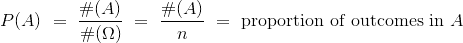

这种概率是比例的想法是许多计算的核心。 你将会看到，比例的组合规则成为概率的组合规则，无论所有结果是否是等可能的。 但是现在我们将在结果可能性相同的自然假设下开展工作。

### 示例一：随机排列

设`Ω`是字母`a`，`b`和`c`的所有排列的空间。 那么`Ω`包含`n = 6`个结果：


如果我们假设所有六种排列是等可能的，我们着手于三个字母的随机排列。 在这个假设下，我们可以用一列几率来扩展我们的事件表。

| 事件 | 口头描述 | 子集 | 概率 |
| --- | --- | --- | --- |
| `A` | `a`首先出现 | `{abc, acb}` | `2/6 = 1/3` |
| `B` | `b`和`c`不挨着 | `{bac, cab}` | 1/3 |
| `C` | 字母是字母表中的顺序 | `{abc}` | 1/6 |
| `D` | `a`首先出现，`b`其次，但是`c`不是第三个 | `ϕ` | 0 |
| `E` | `c`是第一个，第二个或者第三个 | `Ω` | 1 |
| `F` | 字母来自于表示`"taxi"`的单词 | `{cab}` | 1/6 |

要注意：

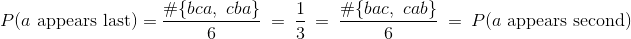

因此，所有排列等可能的假设，使得所有三个位置是等可能的。你应该检查`b`和`c`的位置也是如此。

### 示例二：随机数生成

假设一个随机数生成器从`00,01,02,...,98,99`的 100 个偶对  中返回一对数字，使得所有偶对等可能返回。

你会注意到这些偶对与 0 到 99 的 100 个整数相对应。在下面的内容中，乘法法则会很有用：

第一个数字有 10 个选项：`0,1,2,3,4,5,6,7,8,9`。
对应于第一位数字的每个选择，第二位数字有 10 个选择。
所以总共有`10×10 = 100`对数字。

这里“偶对”是两个数字的序列，一个接一个。偶对 27 与 72 不同。它们有时称为“有序对”。在本文中，所有序列都是有序的。

现在我们来计算一些事件的概率。通过假设，所有偶对都是等可能的。因此，每个答案将包括计算事件中的偶对数量，然后除以总数，即 100。

（1）偶对由两个不同的数字组成的概率是多少？

我们必须计算`a ≠ b`的偶对`ab`的数量。数字`a`可以按 10 种方式选择；对于每种方式，只有 9 种方法用于选择`b`，因为`b`必须与`a`不同。所以答案是：

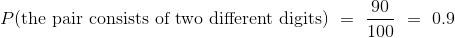

（2）两个数字相同的几率是多少？

让我们尝试使用我们对（1）的回答。 在 100 对中的每一对中，两个数字相同或不同。 没有一对可以属于两个类别，所以按照我们的比例规则：

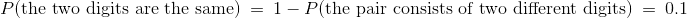

为了通过计数来检查这一点，你必须统计`aa`形式的偶对。 有 10 种方法可供选择，之后就没有更多的选择了。 所以答案是`10/100 = 0.1`，证实了以上我们的计算。

## 散列中的碰撞

在计算机科学中，散列函数将一个称为散列值的代码分配给一组个体中的每一个。为每个个体分配一个独特的值是很重要的。如果相同的值分配给了两个个体，则会发生碰撞，这会产生认证问题。然而，跟踪哪些散列值已分配或未分配是很麻烦的，因为散列值和个体的数量可能非常大。

如果散列值只是随机分配，而并不考虑哪些已经分配了呢？如果存在大量不同的值和相对较少的个体，那么认为碰撞的可能性很小，似乎是合理的。例如，如果有 1,000 个可用的散列值并且只有 5 个个体，那么如果你为这 5 个个体选择了 5 个值的随机序列，则似乎不太可能会发生冲突。

让我们对随机性做一些假设，找出没有碰撞的概率。假设有`N`个散列值和`n`个个体，并且假设你的散列函数是这样的，那么对个体的所有 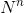 个赋值都是等可能的。赋值是序列 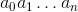，其中，对于每个`i`，将散列值 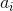 分配给个体`i`。

请注意，我们假定`n`个个体中的每一个，都可以被分配`N`个值中的任何一个，而不管分配给其他人的是什么。这包括了不幸的概率，所有`n`个个体被赋予相同值。

### 无碰撞

无碰撞的概率是什么？

如果个体数量`n`大于散列值`N`的数量，则答案为 0。如果个体数量多于个人数量，那么你将不得不重复使用某些值，因此无法避免碰撞。

但是我们对`n`很小的情况感兴趣，所以假设`n ≤ N`，我们没有问题。

如果回顾前一部分中，随机数生成器的例子中的第（1）部分，你会发现，在`N = 10`且`n = 2`的情况下，它与我们当前的问题相同。 我们可以按照相同的流程来获得我们的答案。

根据假设，所有  个可能的赋值都是等可能的。其中一些赋值不包含碰撞。我们的工作是统计它有多少。

你熟悉 Python 的从 0 开始的索引系统，它在这里派上用场。 我们必须计算序列 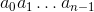 的数量，其中每个  是 N 个哈希值之一，并且所有  都彼此不同。

+   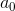 有`N`个选项。
+   对于每一种选择，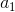 都有`N-1`个选项，因为  必须与  不同。
+   因此，有`N(N-1)`种方式填充位置 0 和 1 而避免碰撞。
+   对于这些选择  和  的`N(N-1)`种方法，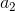 有`N-2`个选择。 这是因为  必须不同于彼此不同的  和 。
+   因此，有`N(N-1)(N-2)`种填充位置 0, 1 和 2 的方式。
+   请注意，对于每个`i`，与位置`i`对应的乘积中的项是`N-i`。这使序列容易延续到最后，即位置`(n-1)`。

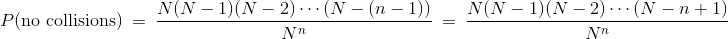

“延续序列”是一个需要数学证明的非正式过程。 你可以通过归纳法来证明。

分子中的乘积有`n`项，分母中有`n`个因子。 这使我们可以用不同的方式编写公式，作为`n`个分数的乘积：

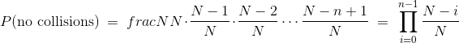

符号 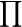 表示求积，就像  表示求和。

现在是坏消息了：

### 至少一个碰撞

每个序列要么至少有一次碰撞，要么没有碰撞。 没有序列可以位于这两个类别中，所以按照我们的比例规则：

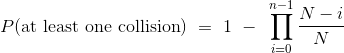

我们有了公式。这很棒！但是答案很大，还是很小？仅通过观察公式不容易分辨。那么让我们以不同的方式开始检验答案。

第一种方法是数字。为此，我们必须处理`N`和`n`的数值。我们在一个背景中会实现它，这个背景让这个计算变得著名。

## 生日问题

一个经典的概率问题是生日的“碰撞”。这个生日问题由理查德·冯·米塞斯和其他数学家提出 - 它的起源并不完善。主要问题是，“如果一个房间里有`n`个人，那么他们中的一些人有相同的生日的几率是多少？”

### 随机性假设

这个问题通常在每年 365 天的假设下得到解决，并且无论其他人的生日如何，每个人都有可能在 365 天中的任何一天出生。

你可以看到，这些假设忽略了闰年以及多胎（例如双胞胎）以及一年中出生分布不均匀的情况。这些假设使得计算更简单，但可能并不能反映人口中的生日的实际情况。数据科学家必须小心他们的假设 - 如果假设没有反映真相，那么结论也不会。

所以让我们注意，我们正在根据简化的假设进行工作，在对特定的群体做出结论之前我们应该检查一下。在任何情况下，忽略闰年和多胎都不应对结论产生重大影响。如果在一年中的某些时候，出生比其他时候更可能发生，那么就证明了生日相同的几率将大于我们在假设下得到的答案。

生日问题有很多变化，但我们会专注于经典问题。

### 匹配的概率

我们将简洁地陈述我们的假设，因为“所有 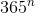 个生日序列是等可能的”。 你可以看到，这使得生日问题与上一节的碰撞问题相同，其中`N = 365`。 如前所述，唯一有趣的情况是当`n ≤ N`时，为此：

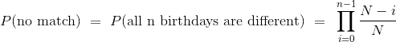

### 计算几率

当`N`固定在 365 时，函数`p_no_match`以`n`为参数并返回在`n`个生日之中不存在匹配的概率。

代码的其余部分在一个表中显示所有结果。该表还包含一列，包含存在碰撞的几率：

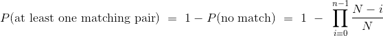

```py
N = 365

def p_no_match(n):
    individuals_array = np.arange(n)
    return np.prod( (N - individuals_array)/N )

results = Table().with_column('Trials', np.arange(1, N+1, 1))

different = results.apply(p_no_match, 'Trials')

results = results.with_columns(
    'P(all different)', different,
    'P(at least one match)', 1 - different
)

results
```

| Trials | P(all different) | P(at least one match) |
| --- | --- | --- |
| 1 | 1 | 0 |
| 2 | 0.99726 | 0.00273973 |
| 3 | 0.991796 | 0.00820417 |
| 4 | 0.983644 | 0.0163559 |
| 5 | 0.972864 | 0.0271356 |
| 6 | 0.959538 | 0.0404625 |
| 7 | 0.943764 | 0.0562357 |
| 8 | 0.925665 | 0.0743353 |
| 9 | 0.905376 | 0.0946238 |
| 10 | 0.883052 | 0.116948 |

... (355 rows omitted)

表中首先要注意的是，使用标签`Trials`来表示人。在概率中，通常将随机试验看作是试验序列，其中每个试验的结果取决于旅几率。 在生日问题中，每个人都被认为是一个试验，我们正在研究所有试验中是否至少有一对匹配的生日。

接下来，请注意，在只有一个人的无聊情况下，不能存在一对匹配的生日，因此`P(no match)`定义为 1。在许多问题中存在这样的“边界情况”，必须单独处理。

最后，请注意，当人数很少时，他们生日不同的几率很大。这与我们的直觉是一致的，即如果个体数量相对于可用散列值的数量较小，并且随机给个人赋值，那么碰撞的几率很小。

### 生日“悖论”

但是碰撞几率随人数增加而增加。实际上，它增加得很快。

```py
results.scatter('Trials', 'P(at least one match)')
plt.xlim(0, N/3)
plt.ylim(0, 1);
```

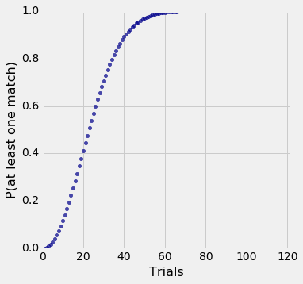

你可以看到，如果有超过 50 人，那么生日相同的几率就接近 1。

为了使碰撞几率超过 50%，必须有多少人？ 让我们看看我们能否找到这种情况发生的最少人数。

```py
results.where('P(at least one match)', are.between(0.5, 0.51))
```

| Trials | P(all different) | P(at least one match) |
| --- | --- | --- |
| 23 | 0.492703 | 0.507297 |

仅仅是 23 人，碰撞的可能性就大于不碰撞。 这让那些没有做计算的人感到惊讶，因此被称为生日悖论。 但事实上，它根本就没有任何矛盾或矛盾之处。 这与生日相同几率随着人数的增加而增长的方式有关。

我们已经完成了`N = 365`的计算，但如果 N 是其他数字，函数的增长有多快？ 如果我们要在生日以外的案例中应用我们的结果，我们需要知道它。

为了解决这个问题，我们可以重新编写各种不同`N`值的代码，并查看输出告诉我们的这些值的结果。 但是使用数学更加高效和富有洞察力，这是我们将在下一节中做的事情。

## 指数近似

本节的目标是，了解当有`N`个散列值且`N`大于`n`时，至少有一次碰撞的几率，如何表现为个体数`n`的函数。

我们知道几率是：


虽然这给出了准确的几率公式，但它并不能让我们了解函数如何增长。让我们看看我们是否可以开发一个近似值，它的形式更简单，因此更容易学习。

近似中的主要步骤将在本课程中重复使用，因此我们将在这里详细介绍它们。

### 步骤 1：仅仅近似需要近似的项

虽然这看起来很明显，但值得注意的是，它可以节省大量不必要的操作。 我们正在尝试近似：

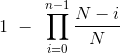

所以我们需要近似的所有东西，就是：

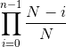

最后我们可以将 1 减去近似值。

换句话说，我们将近似`P(no collision)`。

### 步骤 2：使用对数将乘法变成加法

我们的公式是乘法，但使用加法要好得多。 对数函数可帮助我们将乘积变成和：

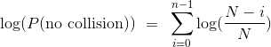

一旦我们有了`log(P(no collision))`的近似值，我们就可以使用指数将其转换为我们想要的近似值，即`P(no collision)`。

### 步骤 3：使用对数的性质

这通常是主要计算的步骤。 请记住对于较小的`x`，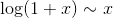，其中符号 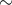 表示当`x`变为 0 时，双方的比例变为 1。对于较大的`x`，近似值可能不是很好，但无论如何让我们尝试一下。


根据前`n-1`个正整数的和的公式。

### 步骤 4：按需转换来完成近似

艰苦的工作已经完成，现在我们只需要清理干净。 第 3 步给了我们：

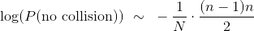

对两边取指数，我们得到：

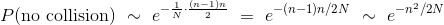

最后：

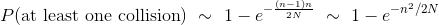

现在你可以看到，作为人数的函数，为什么`P(at least one collision)`迅速上升。 记住`N`是固定的，`n`在 1 和`N`之间变化。随着 n 增加，`(n-1)n`快速增加，基本上类似`n^2`。 所以`-n2 / 2N`快速下降，使得 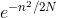 迅速下降；这让 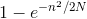 飞了起来。

值得注意的是，在整个计算中只有一个近似值：它在步骤 3 的中间，我们使用`ln(1 + x) ~ x`表示较小的`x`。我们会在课程中多次遇到这个近似值。

### 近似值有多好

为了查看指数近似值与确切概率的相比如何，让我们在生日的背景下开展工作；如果你更喜欢不同的配置，你可以在代码中更改`N`。

为了查看整个步骤序列，我们将重新进行精确计算并用一列近似值扩展它们。 我们将使用上述两者的更精细的近似。

```py
N = 365 

def p_no_match(n):
    individuals_array = np.arange(n)
    return np.prod((N - individuals_array)/N)

trials = np.arange(1, N+1, 1)
results = Table().with_column('Trials', trials)
different = results.apply(p_no_match, 'Trials')

results = results.with_columns(
    'P(at least one match)', 1 - different,
    'Exponential Approximation', 1 - np.e**( -(trials - 1)*trials/(2*N) )
)

results
```

| Trials | P(at least one match) | Exponential Approximation |
| --- | --- | --- |
| 1 | 0 | 0 |
| 2 | 0.00273973 | 0.00273598 |
| 3 | 0.00820417 | 0.00818549 |
| 4 | 0.0163559 | 0.016304 |
| 5 | 0.0271356 | 0.0270254 |
| 6 | 0.0404625 | 0.0402629 |
| 7 | 0.0562357 | 0.0559104 |
| 8 | 0.0743353 | 0.0738438 |
| 9 | 0.0946238 | 0.0939222 |
| 10 | 0.116948 | 0.115991 |

... (355 rows omitted)

前 10 个近似值看起来不错。 让我们来看看更多。

```py
results.scatter('Trials')
plt.xlim(0, N/3)
plt.ylim(0, 1);
```

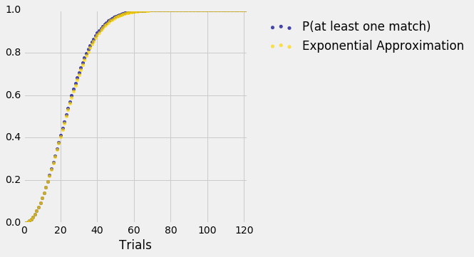

在这张图的尺度上，蓝点（精确值）与金点（我们的指数近似值）几乎没有区别。 你可以再次运行代码，使用不精确的近似法，它将`(n-1)n`替换为`n^2`，并看到近似值仍然很好。

我们从近似的第二种形式中学到，`n`个指定值中至少有一次碰撞的几率，大致是 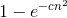，其中`c`是正的常数。

当我们稍后在课程中研究瑞利（Rayleigh）分布时，我们将再次遇到函数 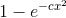。
