# 12. 标准差

> 译者：[cn-Wziv](https://github.com/cn-Wziv)

随机变量`X`的期望值$\mu_{X}$是`X`的分布中心的度量，但是我们知道`X`不必等于$\mu_{X}$; 实际上，$\mu_{X}$甚至不需要是`X`的可能值。

$\mu_{X}$距离$X$能有多远呢？本章将回答这个问题。

作为一个起点，很自然地看出与平均值的偏差。$$X-\mu_{X}$$

并试着了解我们的期望。 通过线性函数规则，$$E(X-\mu_{X}) = E(X)-\mu_{X} = \mu_{X}-\mu_{X}$$

对于每个随机变量，与均值的预期偏差为 0.正偏差完全抵消了负偏差。

这种取消使我们无法了解偏差的大小，无论其符号如何。但是，如果我们想要测量随机变量之间的距离，那就是我们需要测量的$X$及其期望值$\mu_{X}$。

我们必须以某种方式摆脱偏差的迹象。摆脱数字符号的一种历史悠久的方法是取绝对值。另一个是对数字进行平方。这是我们将使用的方法。正如您将看到的，它会导致一定程度的传播，这对于理解大样本的总和和平均值至关重要。

####12.1 定义
测量平方偏差的粗略大小具有避免正误差和负误差之间的抵消的优点。缺点是平方偏差具有难以理解的单位。我们即将定义的传播指标可以解决这个问题。

#### 均方根平均偏差
设`X`为期望$\mu_{X}$的随机变量。`X`的标准偏差，表示为`SD(X)`或$\sigma _{X}$，是与平均值的偏差的均方根。
$$SD(X)=\sigma_{X}=\sqrt{(E(X-\mu_{X})^{2})}$$

`SD(X)`具有与`X`和`E(X)`相同的单位。在本章中，我们将精确地确定标准偏差测量`X`围绕中心$\mu_{X}$的分布的传播。

平方根内的数量称为`X`的方差，并且具有比$SD$更好的计算属性。这与毕达哥拉斯定理的事实密切相关，距离的平方以有用的方式结合在一起。
$$Var(X)=\sigma _{X}^{2}=E((X-\mu_{X})^{2})$$

几乎无一例外，我们会先寻找差异，然后采取平方根计算标准偏差。

让我们在具有以下定义的分布的随机变量`X`上尝试$SD$的定义。
```
x = make_array(3, 4, 5)
probs = make_array(0.2, 0.5, 0.3)
dist_X = Table().values(x).probability(probs)
dist_X
```
| value | Probability |
| ------ | ------ |
| 3 | 0.2 |
| 4 | 0.5 |
| 5 | 0.3 |
```
dist_X.ev()
```
```
4.0999999999999996
```

下面是预期的偏差平方`E(X)=4.1`.
```
sd_table = Table().with_columns(
    'x', dist_X.column(0),
    '(x - 4.1)**2', (dist_X.column(0)-4.1)**2,
    'P(X = x)', dist_X.column(1)
)
sd_table
```
| x | (x-4.1)**2 | P(X=x) |
| ------ | ------ | ------- |
| 3 | 1.21 | 0.2 |
| 4 | 0.01 | 0.5 |
| 5 | 0.81 | 0.3 |

X 的标准偏差是均方偏差的平方根。下面的计算表明它的数值是`SD(X)=0.7`
```
sd_X = np.sqrt(sum(sd_table.column(1)*sd_table.column(2)))
sd_X
```
```
0.69999999999999996
```

应用于分布对象的`prob140`方法`sd`返回标准偏差，从而节省上述计算。

我们现在知道如何计算`SD`。但我们还没有很好地理解它的作用。让我们开始开发它应该拥有的一些属性。然后我们可以检查它是否有它们。

首先，常量的`SD`应为 0.您应该检查这确实是定义所暗示的。

#### 移动和缩放
SD 是衡量传播的标准。如果我们只是将概率直方图向左或向右移动，那么希望传播度量保持不变是很自然的。当我们向随机变量添加常量时会发生这种转变。下图显示了与上述相同的`X`的分布以及`X+5`的分布。很明显，`X+5`应该与`X`具有相同的`SD`。
```
dist2 = Table().values(x+5).probability(probs)
Plots('X', dist_X, 'X+5', dist2)
```

另一方面，将`X`乘以常数会导致应该具有不同点差的分布。这是`X`的分布以及`4X`的分布。`4X`分布的扩散似乎是`X`的四倍。
```
dist3 = Table().values(4*x).probability(probs)
Plots('X', dist_X, '4X', dist3 )
plt.xlim(0, 40);
```
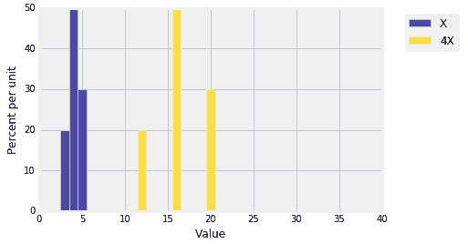

乘以-4 应该与乘以 4 对扩散产生相同的影响，如下图所示。一个直方图就是另一个直方图关于垂直轴的镜像为 0，传播没有变化。


上图帮助我们可视化随机变量线性变换时 SD 会发生什么，让`Y=aX+b`，然后


请注意，当乘以`a`和`-a`时，得到相同的答案。 这就是两个“镜像”直方图所显示的内容。

特别是，记住它是非常方便的`SD(X)=SD(-X)`.

### 方差的“计算”公式
方差公式的代数简化证明是非常有用的。
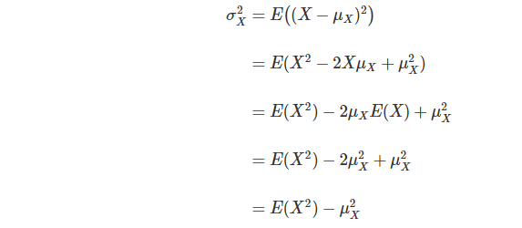

因此，方差是“平方的平均值减去平均值的平方”。

虽然这通常被称为方差的“计算”公式，但如果 X 的可能值很大且很多，则它在数值上可能是不准确的。然而，对于代数计算，它非常有用。以下是几个例子。

#### 指示符
指标随机变量的值是 0 和 1.这两个数中的每一个都等于其平方。所以，如果我是一个指标，那么 I2 = I，因此


当`p=0.5`时，您应检查此方差是否最大。用平方根得到


#### 标准化
让`U`在`1,2,3,4...,n`上统一。


在上面的最后一步中，我们使用公式表示前 n 个方块的总和。
我们知道`E(U)=(n+1)/2`，所以
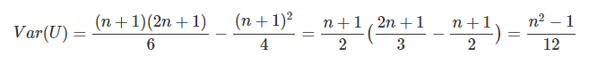
并且


通过移位，这与任何 n 个连续整数上的均匀分布的 SD 相同。

#### 泊松
让`X`拥有泊松`u`分布。在前一章中我们展示了这一点


我们也知道`E(X)=μ`，所以

并且

因此，例如，如果`X`具有泊松(5)分布，则`E(X)=5`并且`SD(X)=√5≈2.24`。在本章的其余部分，我们将尝试弄清楚这意味着什么。


#### 12.2 预测和估计
考虑`SD`的一种方法是预测误差。 假设我要生成随机变量的值`X`，我要求你预测我将获得的值。你应该用什么作为预测器？

一个自然的选择是`μX`，`X`的期望。 但你可以选择任何数字`c`。您将犯的错误是`X-c`。那有多大？对于`c`的最合理选择，误差有时是正的，有时是负的。要找到此错误的粗略大小，我们将避免像以前一样取消，并从计算均方误差开始$E[(X-c)^2]$.

因为我们已经猜到`μX`可能是一个不错的选择，我们将围绕该值组织代数。使用`c`作为预测器的均方误差是
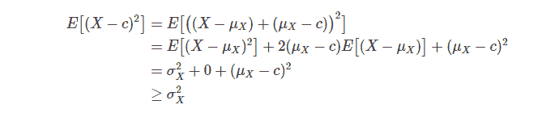
当且仅当`c=μX`时相等。

#### 均值作为最小二乘预测器
我们所展示的是预测器`μX`在所有选择中具有最小的均方误差`c`。最小均方误差是 X 的方差，因此最小均方根误差是`SDσX`。

这就是为什么一种常见的预测方法是“我的猜测是平均值，而且我将会关闭`SD`。”

#### 比较估算
如果我们有一个参数的两个竞争估计器，我们可以使用期望值和`SD`来比较它们。

作为一个例子，回想一下数据 8 的德国战机示例。模型是我们观察`X1，X2，...，Xn`，这是随机抽取的 n 个抽签，替换为`1,2，...，N`。目标是估算战斗机总数 N.

一个自然估计是`M = max(X1，X2，...，Xn)`。在本文前面比在数据 8 中更仔细地开发的另一个是`2A-1`,其中`A =(X1 + X2 + ... + Xn)/n`是样本平均值。

这是我们在数据 8 中进行的模拟，使用大小为 30 的样本来估计我们已经采用的`N`为 300。

```
N = 300
n = 30
serial_nos = np.arange(1, N+1)

repetitions = 10000
maxes = make_array()
double_means = make_array()
for i in range(repetitions):
    sample = np.random.choice(serial_nos, size=n)
    maxes = np.append(maxes, np.max(sample))
    double_means = np.append(double_means, 2*np.mean(sample)-1)

results = Table().with_columns(
    'M', maxes,
    '2A - 1', double_means
)
```
```
every_ten = np.arange(1, N+101, 10)
results.hist(bins=every_ten)
```

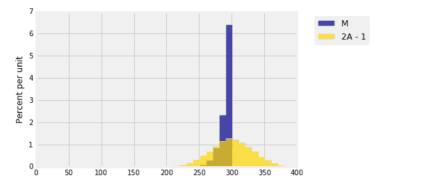

我们将估计器`2A-1`构造成无偏的，并且其经验分布实际上围绕参数`300`对称。估计器`MM`明显偏向：它永远不会大于`NN`但是它可以更小。如果我们只是比较期望，那么`E(2A-1)=300`而`E(M)≠300`，所以似乎`2A-1`是更好的估计。

但该图表说明了一个不同的故事，因为该图表还显示了两个分布中的每一个的分布。`2A-1`的分布比`MM`的分布更加分散。两个经验的`SD`相差 3.5 左右：
```
np.std(maxes)

9.6906610383399538

np.std(double_means)

31.574078469134559
```
这告诉我们虽然`MM`通常会低于 300，但它不会低于 300，而`2A-1`可能远远低于 300，低估了它的高估频率。
也许现在你更喜欢使用`MM`而不是`2A-1`。

这是估计中常见的偏差 - 方差权衡的一个例子。在选择一个估算器而不是另一个估算器时，期望和`SD`都很重要。 如在此示例中，选择并不总是清楚的。但是如果`SD`较低的估算器也恰好是无偏见的，那么你可以宣布它是胜利者。

#### 12.3 尾界
如果你知道`E(X)`和`SD(X)`，你就可以知道 X 分布的尾部有多少概率。

在本节中，我们将获得概率的上限，例如下图中的黄金区域。对于随机变量`X`，它是`P(X≥20)`，其分布显示在直方图中。


#### 单调性
为此，我们将首先观察 X 的功能期望。

假设``gg``和 h 是`g(X)≥h(X)`的函数，即`P(g(X)≥h(X))=1`。然后`E(g(X))≥E(h(X))`。当你注意到结果空间中的所有`ωω`时，这个结果很明显，`(g∘X)(ω)≥(h∘X)(ω)`，因此`(g∘X)(ω)P(ω)≥(h ∘X)(ω)`因此


现在假设 XX 是非负随机变量，并且`cc`是正数。考虑下面的两个函数`gg`和`hh`。
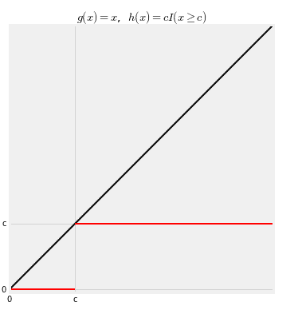

对于所有 xx，函数 gg 是标识`g(x)= xg(x)= x`。它使 xx 保持不变。所以`E(g(X))= E(X)E(g(X))= E(X)`。
函数 hh 在 cc 处截断 xx 如下：如果`x<cx<c`则`h(x)=0h(x)=0`，并且如果`x≥cx≥c`则`h(x)= ch(x)= c`。所以
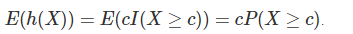

显然 g>=h，所以


#### 马尔可夫不等式
设 X 为非负随机变量。 然后对于任何`c > 0`


这个结果被称为“尾部绑定”，因为它对 cc 的右尾部的大小设置了一个上限。 值得注意的是，马氏波的`P(X> c)≤P(X≥c)≤E(X)/c`。

在下图中，`E(X)= 6.5`，`c = 20`。马尔科夫的不平等表明黄金面积最


你可以看到界限非常粗糙。 黄金面积显然略低于 0.325。
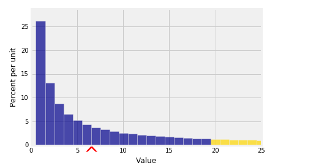

另一种思考马尔科夫界限的方法是，如果 X 是非负随机变量那么


即`P(X≥2μX)≤1/2`，`P(X≥5μX)≤1/5`，依此类推。非负随机变量至少是平均值的 k 倍的概率最多为 1/k。

注释：
	•k 不必是整数。例如，非负随机变量至少为平均值的 3.8 倍的概率最多为 1/3.8。
	•如果 k≤1，则不等式不会告诉您任何您不知道的事情。如果 k≤1 则 Markov 的界限为 1 或更大。所有概率都高于 1，因此不等式是正确的，但对于 k≤1 则无用。
	•当 k 很大时，边界会告诉你一些事情。你正在观察分布尾部相当远的概率，马尔可夫的界限是 1/k，这是小的。

#### 切比雪夫不等式

马尔可夫的约束只使用`E(X)`，而不是`SD(X)`。为了获得尾部的界限，如果可以的话，最好使用`SD(X)`。切比雪夫的不平等就是这样。 它在一个与`E(X)`对称的区间外的两条尾部提供一个边界，如下图所示。
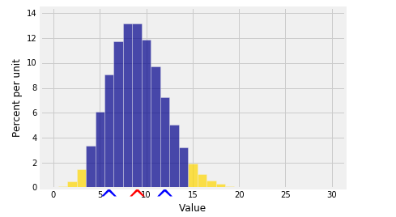

红色箭头像往常一样标记`μX`，现在两个蓝色箭头位于平均值两侧的`SD(X)`距离处。将`E(X)`视为“原点”并以任何一方的`SD`为单位测量距离通常会很方便。

因此，对于某些正`z`，我们可以将黄金区域视为`XX`与`μX`至少相差`±SD`的概率。现在
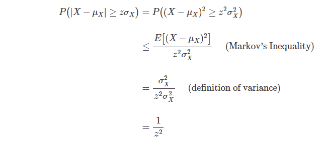

切比雪夫的不等式没有假设分布的形状。 这意味着无论 X 的分布如何
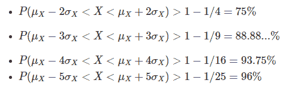
也就是说，无论分布的形状如何，概率的大部分都在“预期值加上或减去几个 SD”的区间内。

这是`SD`是衡量传播的一个很好的衡量标准的一个原因。无论分布如何，如果您知道期望值和`SD`，那么您就可以很好地了解概率的大部分位置。

如果你碰巧了解更多关于分布的信息，那么你当然可以做得比切比雪夫更好。但总的来说，切比雪夫的界限和你能做的一样，没有做出进一步的假设。

#### 标准单位

为了形成“将`μX`设置为原点并以`σX`为单位测量距离”的概念，我们将标准单位中称为“`X`的随机变量`Z`”定义如下：


`Z`测量相对于其`SD`，`X`高于其平均值的距离。换句话说，`X`是平均值以上的`ZSD`：


重要的是要学会在这两种测量尺度之间来回切换，因为我们将经常使用标准单位。注意，通过线性函数规则，


无论 X 的分布是什么。
切比雪夫不等式表示：

同时：

因此，如果您已将随机变量转换为标准单位，则标准化变量的绝大多数值应在-5 到 5 的范围内。有可能存在该范围之外的值，但不太可能。

#### 切比雪夫不等式的另一种写法

切比雪夫不等式通常写成如下：
对所有 c>0,

这与我们的陈述相同，但用 c 代替`zσX`。我们将使用在给定设置中方便的任何形式。

#### 12.4 尾重
这个简短的部分展示了一个例子，说明期望和标准差虽然在许多情况下非常有用，但在分布冗长乏味时却不够充分。 这是一个这样的分布。
```
N = 1000
n = np.arange(1, N+1, 1)
probs = (1/n)*(1/np.sum(1/n))
dist = Table().values(n).probability(probs)
Plot(dist)
plt.xlim(0, N/10);
```
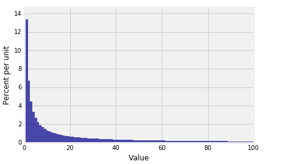

你可以看到尾巴伸展得很远。 如果我们独立于该群体进行抽样，样本平均值如何表现？平均值受尾部值的影响。

让我们模拟这个分布中 500 大小的随机样本的平均值的分布。我们将做 10,000 次重复以试图让经验分布稳定下来。
```
means = make_array()
for i in range(10000):
    means = np.append(means, np.mean(dist.sample_from_dist(500)))
Table().with_column('Sample Means', means).hist(bins=20)
```
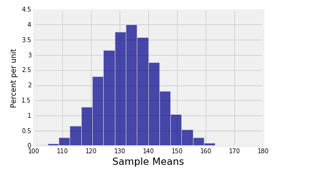
这是一个令人喜爱的的发行版，但看看它的中心位置。 中心位于 130 以上，而原始分布看起来好像在 100 左右：
```
Plot(dist)
plt.xlim(0, N/10);
```
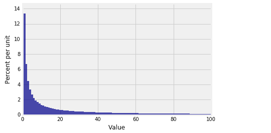

这是我们必须记住的原始分配实际上是 1000.尽管在我们的图表的规模上尾部几乎不可见 100，它就在那里，它正在影响期望。 预期值约为 133.6，这解释了样本平均值的经验分布的中心。
```
dist.ev()
```
```
认识到上述直方图的平衡点在图表上甚至不可见是令人清醒的。尾部有足够的质量可以将平衡点拉向右侧。

我们如何将这与 Chebyshev 的不等式相协调，告诉我们大部分概率在平均值的几个 SD 内？找出的唯一方法是计算分布的 SD。
133.59213049244224
```
认识到上述直方图的平衡点在图表上甚至不可见是令人清醒的。尾部有足够的质量可以将平衡点拉向右侧。

我们如何将这与 Chebyshev 的不等式相协调，告诉我们大部分概率在平均值的几个 SD 内？找出的唯一方法是计算分布的 SD。
```
dist.sd()
```
```
221.39558257101038
```
我们终于得到它了。SD 很大，甚至比平均值还要大。长尾使 SD 非常大 - 即使间隔“预期值加上或减去一个 SD”也非常宽，并且几乎包含所有数据。

要分析像这样的重尾分布，预期值和 SD 不是最佳使用量。有关应该使用什么的大量且不断增长的文献。您可能会在更高级的课程中遇到它。

#### Zipf 定律

如果你学习自然语言处理，语言学，经济学，甚至城市人口，你几乎肯定会遇到像这样的分布。本节中使用的示例是在这些字段中出现的 Zipf 分布之一。

Zipf 定律是一种经验观察的定律，它表示在大量单词中，单词的频率与频率表中的排名成反比。也就是说，第二个最常出现的单词的频率是最频繁出现的频率的一半。第三个最常出现的单词的频率是最常见单词频率的三分之一。等等。

根据维基百科的说法，“...在美国英语文本的布朗语料库中，”the“这个词是最常出现的单词，并且自身占所有单词出现次数的近 7％（略超过 100 万的 69,971）根据 Zipf 定律，第二位词“of”占据了超过 3.5％的单词（36,411 次出现），其次是“and”（28,852）。只需要 135 个词汇项来占布朗语料库的一半。 “

现在再看看我们的示例中的底层分布是如何定义的：
```
N = 1000
n = np.arange(1, N+1, 1)
probs = (1/n)*(1/np.sum(1/n))
```
我们假装我们有一个按排名顺序排列的 N = 1000 个单词的语料库，其中 Rank1 被授予最常出现的单词。 概率与秩成反比。 请注意，1 / np.sum（1 / n）只是比例常数，使概率加起来为 1.如果调用常数 c，则概率为：

请注意$E(X)=cN$ and $E(X^2)=c\cdot \frac{N(N+1)}{2}$，所以$Var(X)=(\frac{c}{2}-c^2)^2N^2+(\frac{c}{2})N$

当 N 变大时，E（X）和 SD（X）都会以无法获得有用结果的速率进入无穷大。