# 13. 方差和协方差

> 译者：[cn-Wziv](https://github.com/cn-Wziv)

在本章中，我们回到随机抽样并研究随机样本总和的可变性。值得花一些时间来理解样本总和的行为，因为许多有趣的随机变量(如成功计数)可以写成总和。二项式和超几何随机变量就是这样的总和。此外，随机样本的均值是样本和的直接函数。

设 X 是随机变量。 我们将使用一些熟悉的速记：
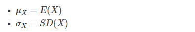

令`DX = X-μX`表示 X 与其平均值的偏差。然后


#### 总和的方差
设 X 和 Y 是同一空间上的两个随机变量，设`S = X + Y`. 那么`E(S)=μX+μY`，S 的偏差是 X 和 Y 的偏差之和：

这让我们对总和 S 的方差有了一些了解。


首先要注意的是，虽然和的期望是期望的总和，但上面的计算表明，总和的方差通常不是方差的总和。还有一个额外的术语。

要计算总和的方差，我们必须理解额外的术语。
#### 协方差
X 和 Y 的协方差，表示为`Cov(X，Y)`，是 X 和 Y 偏差的预期乘积：


在本章中，我们将学习如何利用协方差来找出总和的方差。 基本计算是我们上面做的那个; 这是使用协方差语言的结果。
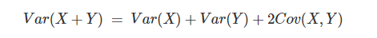

### 13.1 协方差的性质
让我们来看看协方差的行为方式。在接下来的两节中，我们将使用我们的观察来计算样本总和的方差。

建立协方差的性质涉及简单的观察和常规代数。我们在下面做了一些，我们希望你可以填写其余部分。

回想一下 X 的协方差和 Y.是

这个头衔具有“duh”品质。 但是仍然值得注意的是，任何常数`c`，


#### 方差是协方差
协方差是方差概念的延伸，因为

X 的方差是 X 与其自身的协方差。

#### 协方差是对称的
显然$Cov(Y,X)=Cov(X,Y)$，它遵循：
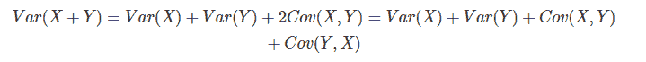
这种思考和的方差的方法将在以后有用。

#### 协方差和预期产品
协方差是预期的产品：它是偏差的预期产品。它也可以用 X 的预期产品来编写 和 Y，如下


所以协方差是产品的平均值减去均值的乘积。取`X = Y`得到一个熟悉的事实，即方差是平方的平均值减去平均值的平方。

这个结果简化了协方差事实的证明，如下所示。但作为一种计算工具，它仅在 X 和 Y 的分布非常简单时才有用 - 例如，当每个分布只有几个可能的值时。在协方差的其他计算中，尝试使用此结果很少是个好主意。相反，我们将使用下面的属性。

#### 加法法则
上述属性的常规应用表明，对于任何随机变量 X，Y 和 Z，

只需写入`Cov(X + Y，Z)= E [(X + Y)Z] -E(X + Y)E(Z)`，展开两个结果，并收集术语。


#### 主属性：双线性
这是使用协方差的关键。首先，简单代数表明对于常数 a 和 b，


将此与加法规则放在一起得到


您可以看到协方差的行为与产品相似。通过归纳，
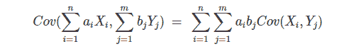

这可能看起来令人生畏，但实际上这个属性大大简化了计算。 它说你可以扩展协方差，就像两个总和的乘积一样。 例如，


你可以用$Var(Y)$代替$Cov(Y,Y)$.

这些属性简化了计算。但他们并不了解协方差的含义。实际上理解协方差并不容易，因为它具有令人讨厌的单位：例如，如果 X 是以千克为单位的重量而 Y 是以厘米为单位的高度，那么协方差的单位是千克厘米。在本课程的后面，我们将看到如何规范化协方差以获得您在数据 8 中经常使用的相关系数。现在，这是一个属性，开始向您展示协方差可以有助于量化依赖性和独立性。

#### 独立意味着不相关
设 X 和 Y 是独立的。然后
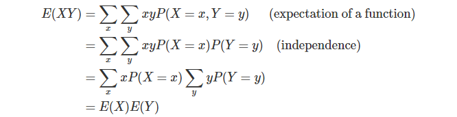
因此，如果 X 和 Y 是独立的，则$Cov(X，Y)=0$。 我们说 X 和 Y 是不相关的。

我们已经证明独立随机变量是不相关的。但是，不相关的随机变量必须是独立的。你将在练习中展示这一点。

### 13.2 IID 样本的总和
在对前一节进行干燥的代数讨论之后，最终能够计算出一些差异。
设`X1,X2......Xn`,用总和是随机变量


总和的方差是


我们说总和的方差是所有方差和所有协方差的总和。
如果`X1，X2 ...，Xn`是独立的，那么上面公式中的所有协方差项都是 0。
因此，如果`X1，X2，...，Xn`是独立的那么


因此，对于独立的随机变量`X1，X2，...，Xn`，期望值和方差都很好地相加：


当随机变量是 i.i.d.时，这进一步简化了。

#### IDD 样本的总和
令`X1，X2，...，Xn`为 i.i.d.，各自具有平均μ和`SDSDσ`。您可以将`X1，X2，...，Xn`视为随机抽取，从群体中替换，或者相同实验的独立复制的结果。

设 Sn 为样本和，如上所述。然后

这意味着随着样本大小 n 的增加，和 S 的分布向右移动并且更加分散。

这是这些结果中最重要的应用之一。

#### 二项式的方差
设 X 具有二项式(n，p)分布。 我们知道

其中`I1，I2，...，In`是 i.i.d. 指标，每个指标以概率 p 取值 1。这些指标中的每一个都具有期望值 pp 和方差 pq = p(1-p)。因此


例如，如果 X 是 100 投掷硬币的头数，那么


这是 X 的分布。你可以看到在`E(X)±3SD(X)`范围之外几乎没有概率。
```
k = np.arange(25, 75, 1)
binom_probs = stats.binom.pmf(k, 100, 0.5)
binom_dist = Table().values(k).probability(binom_probs)
Plot(binom_dist, show_ev=True, show_sd=True)
```
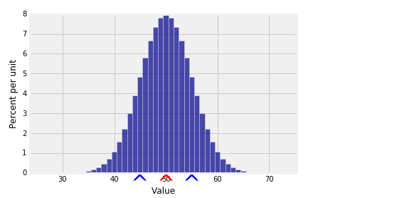

### 13.3 简单随机样本的和
正在添加的随机变量不是独立的时，找到总和的方差确实涉及找到协方差。和以前一样，让`X1，X2，...... Xn`是和的随机变量

总和的方差是
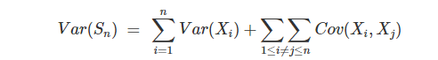
在我们应用这个公式之前，让我们从找到一个简单的协方差开始。
#### 指标
假设 A 和 B 是两个事件。设 IA 为 A 的指标，设 IB 为 b 的指标，这将是我们使用期望乘积求协方差的罕见例子之一。这是因为我们知道指标的乘积本身就是指标。


如果 A 和 B 是独立的，你可以看到协方差是 0，这与上一节更一般的结果是一致的。当 A 和 BB 不独立时，协方差帮助我们理解依赖的本质。例如，如果$Cov(IA,IB)$为正，则
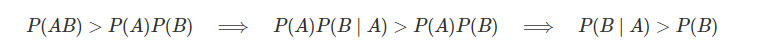
也就是说，假设 A 发生了，B 发生的概率比总体高。这叫做 A 和 B 的正相关。
#### 超几何方差

假设你有一个 NN 元素的总体 G 是好的。设 X 为从总体中抽取的 n 个元素的简单随机样本中好的元素个数。记住，简单的随机样本是没有替换的。
我们知道

其中$I_j$是绘制 j 的指示器，它产生了一个良好的元素。
通过对称性，我们知道$E(J_i)=\frac{G}{N}$对每个 j，这就是为什么

这和二项式的公式是一样的。

我们也知道,Var(I_{j})=\frac{G}{N}*\frac{B}{N}当 B=N-G 是不良人群中元素的数量。

也通过对称,Cov(Ij,Ik)是相同的每一对 j,k 当 j≠k。上面的例子告诉我们如何计算这个公共值。

因此，
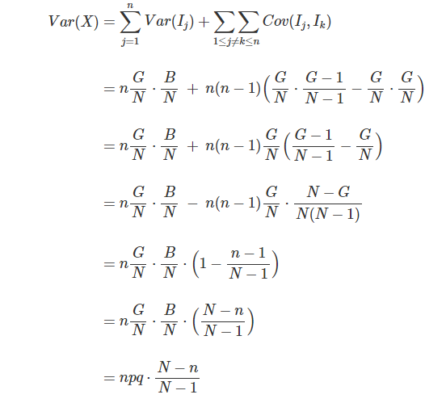
当$P=\frac{G}_{N}$且 q=1-q 时
请注意，除了因子之外，公式与二项式的方差的公式相同$\frac{N-n}{n-1}$

我们可以将这个结果推广到人口不是二元的情况。

#### 简单随机样本和的方差

假设我们有一个 N 个数的总体它不需要只有 0 和 1。假设人口意味着μ和标准差σ。从总体中抽取一个大小为 n 的简单随机样本。对于从 1 到 n 的 j，设 Xj 为第 j 个值。

让`Sn=X1+X2+⋯+Xn`,然后`E(Sn)=nμ`,并且
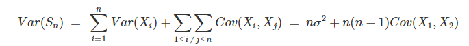
通过对称

如何找到`Cov(X1,X2)`尝试将两个变量相乘不是一个好主意，因为它们是相互依赖的，它们的分布可能不太好。预期的产品很难找到。

我们可以使用的是观察到我们在上面推导的`Var(Sn)`方程对于任何样本大小都是有效的。特别地，它在人口普查中是有效的，也就是说，当我们对人口的所有元素进行抽样时。在这种情况下 n=N 方程是


为什么有用?为了回答这个问题，考虑一下 SN 的变异。我们对整个种群进行了抽样，没有进行替换。因此 SN 就是整个种群的总数。SN 中没有抽样变异性，因为只有一个可能的 N 大小的样本。

这意味着 Var(SN)= 0。我们可以用这个解出 Cov(X1,X2)
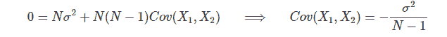
现在把这个代入 Var(Sn)的公式对于任何较小的样本容量 n。
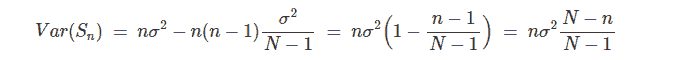
回想一下,样本的方差和样本时 nσ2 绘制与更换。当样本不重复,除系数外，公式是一样的$\frac{N-n}{N-1}。

这正是我们在二元总体的特殊情况中看到的。在本章的最后一节中，我们将研究有替换和没有替换的抽样之间的关系。

### 13.4 有限总体修正

数据科学家经常不得不使用来自庞大人口的相对较小的样本。 因此，假设我们从大小为 N 的群体中随机抽取 n 次，其中 NN 较大且 n 相对于 N 较小。现在请顺其自然 - 随着本节的发展，所有这些都将变得更加精确。
假设总体均值为μ且总体 SD 为σ。 设 Sn 是样本和。 然后，无论是否更换样品，


两种情况下样本总和的方差不同。
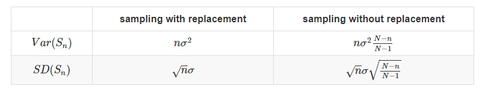
“无替换”列与“替换”列相同，除了所谓的校正因子。SD 的一个称为有限总体校正或 fpc。

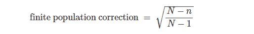
这个名称的产生是因为替换的抽样可以被认为是抽样而无需从无限的人口中取代。每次画画时，你都会将人口中的比例与画之前的比例完全相同。

该图像的更真实的版本是绘制而无需从庞大的有限人口中取代。每次画画时，你在人群中的比例几乎与画之前完全相同。

我们之前使用过这个想法，当我们说没有替换的采样与替换采样几乎相同，只要您从非常大的人口中抽取相对较小的样本。

fpc 为我们提供了量化这个想法的方法。


#### FPC 的大小
首先要注意的是，当 N 甚至中等大时，


这是采样后留下的人口比例。

如果 N 大并且 n 相对于 N 小，那么


这也意味着


因此，无论您是使用替换还是不进行采样，样本总和的方差都可以取为 nσ2。在采样替换的情况下，该公式是精确的，并且当样本大小相对于种群大小较小时，在没有从大群体替换的情况下采样的情况下具有极好的近似。

下表给出了各种人口和样本量的 fpc。
```
pop = make_array(1000, 10000, 50000, 100000, 500000, 1000000)

def fpc(pct):
    samp = np.round(pop*pct/100, 0)
    return np.round(((pop-samp)/(pop-1))**0.5, 6)
Table().with_columns(
  'Population Size', pop,
  '1% Sample', fpc(1),
  '5% Sample', fpc(5),
  '10% Sample', fpc(10),
  '20% Sample', fpc(20)
)
```
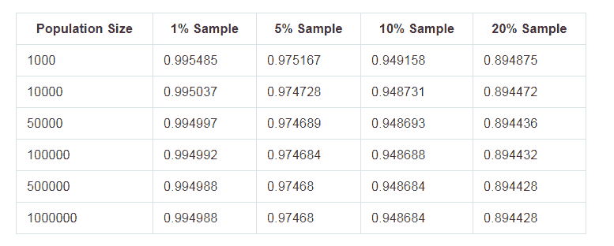

每列中的值基本上是不变的，因为每个列基本上是未采样的分数的平方根：
```
sample_pct = make_array(1, 5, 10, 20)
```
```
(1 - sample_pct/100)**0.5
array([ 0.99498744,  0.97467943,  0.9486833 ,  0.89442719])
```
所有这些 fpc 值都非常接近 1，特别是在 1％的列中，它们基本上都是 0.995。 这就是为什么 fpc 经常从方差计算中删除的原因。

#### 人口规模的（非）效应

简单随机样本和的 SD 仅取决于样本大小和总体 SD，前提是种群大小足以使 fpc 接近 1。

从公式中可以清楚地看出这一点。如果 fpc 接近 1，那么就像往常一样


其中仅涉及样本大小 n 和总体 SDσ。

为了直观地理解这一点，假设您正在尝试根据试管中的量确定液体的成分。 如果液体充分混合，试管中的量是从碗中还是从浴缸中取出是否重要？ 它没有，因为碗和浴缸都比试管大得多，它们也可能是无限的。