# 17. 联合密度 

> 译者：[Winchester-Yi](https://github.com/Winchester-Yi)

我们现在开始研究两个连续随机变量的联合概率密度。这些方法使用单个随机变量的密度来扩展我们的计算，并且类似于在离散情况下涉及联合分布表的方法。

> ```python
> # HIDDEN
> from datascience import *
> from prob140 import *
> import numpy as np
> import matplotlib.pyplot as plt
> plt.style.use('fivethirtyeight')
> %matplotlib inline
> import math
> from scipy import stats
> from sympy import *
> init_printing()
> ```


## 17.1 概率和期望

```python
# HIDDEN
from datascience import *
from prob140 import *
import numpy as np
import matplotlib.pyplot as plt
plt.style.use('fivethirtyeight')
%matplotlib inline
import math
from scipy import stats
from sympy import *
init_printing()
```

一个位于二维平面能够被称为联合密度的函数$f$定义如下：

- $f(x,y)\ge 0$ ，对于任意的$x,y$
- $\int_x\int_yf(x,y)dxdy=1$

如果你把$f$作为一个表面，那么第一个条件就意味着这个表面位于或者位于这个二维平面之上。第二个条件则表示在表面之下的总体积为 1。

将概率视为表面下的体积，定义$f$为随机变量$X,Y$的联合密度，

$$
P((X,Y)\in A)=\iint_A f(x,y) , for all A
$$

这也意味着，随机点$(X,Y)$位于区域$A$的可能性被表示为二维区域$A$下的体积。

这是一个二维随机变量的类比，即涉及单个连续随机变量的概率可以被认为是密度曲线下的区域。

**微元**

同样类似的是联合密度的解释，作为计算无穷小区域概率的一部分。

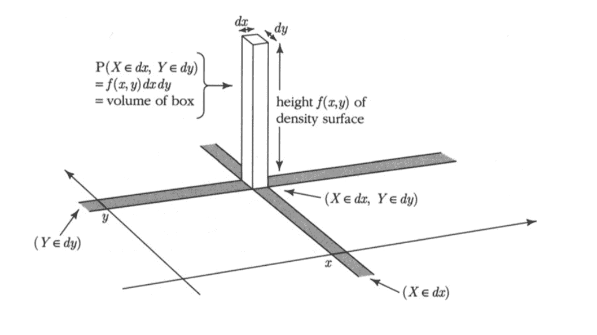


无穷小区域是在点$(x,y)$周围的平面中的一个小矩形。它的长和宽分别为$dy$和$dx$。相对应的体积是该矩形框对应的体积，其底部是极小的举行，同时这个立方体的高是$f(x,y)$。

因此，对于所有的$x$和$y$，
$$
P(X\in dx,Y\in dy) \sim f(x,y)dxdy
$$
由此，联合分布的密度表示为单位面积上的概率，
$$
f(x,y)\sim \frac{P(X\in dx, Y\in dy)}{dxdy}
$$

一个例子可以帮助我们可视化地理解。函数$f$被定义为
$$
f(x, y) ~ = ~ 
\begin{cases}
120x(y-x)(1-y), ~~~ 0 < x < y < 1 \\
0 ~~~~~~~~ \text{otherwise}
\end{cases}
$$
现在，假设这是一个联合分布函数，事实上，它确实是（它的积分为 1）。现在让我们看看这个表面看上去是怎样的。

**表面绘制**

为了绘制这个函数的表面，我们会使用三维绘图程序。首先，我们定义联合分布的密度函数。这个函数将$x$和$y$作为输入，然后返回上面定义的$f(x,y)$。

```python
def joint(x,y):
    if y < x:
        return 0
    else:
        return 120 * x * (y-x) * (1-y)
```

现在我们可以调用`plot_3d`来绘制出这个图形。调用函数的参数被限制在$x$轴和$y$轴，绘制函数的名字，以及两个可选参数`rstride`和`cstride`用于决定绘制需要使用网格线的数量。较大的数字表示越不频繁的网格线。

```python
Plot_3d(x_limits=(0,1), y_limits=(0,1), f=joint, cstride=4, rstride=4)
```

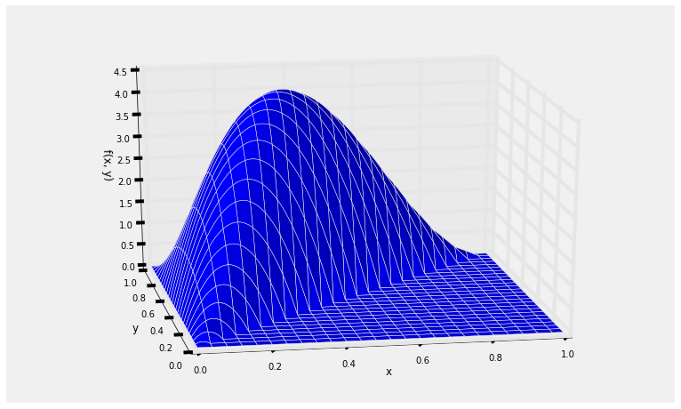

曲面在右下角的三角形的值为 0，因为点$(X,Y)$不可能在那个区域。

对于$(X,Y)$可能的值显示如下图的蓝色区域。为了手算，我们通常仅仅绘制可能值对应的平面区域而不是立体的曲面。

```python
# NO CODE

plt.plot([0, 0], [0, 1], color='k', lw=2)
plt.plot([0, 1], [0, 1], color='k', lw=2)
plt.plot([0, 1], [1, 1], color='k', lw=2)
xx = np.arange(0, 1.11, 0.1)
yy = np.ones(len(xx))
plt.fill_between(xx, xx, yy, alpha=0.3)
plt.xlim(-0.05, 1)
plt.ylim(0, 1.05)
plt.axes().set_aspect('equal')
plt.xticks(np.arange(0, 1.1, 0.25))
plt.yticks(np.arange(0, 1.1, 0.25))
plt.xlabel('$x$')
plt.ylabel('$y$', rotation=0)
plt.title('Possible Values of $(X, Y)$');
```

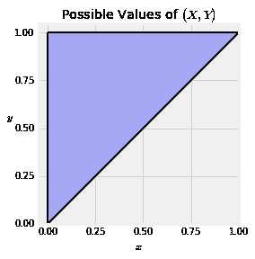

**表面下的总体积**

函数$f$看起来有点乱但是可以很清楚地看出它是非负的。检查表面下的总概率是否等于 1 是个好主意。

在整个可能值的区域上计算双重积分，需要注意的是，对于固定的$y$值，$x$的值从 0 增长到$y$，而$y$的值从 0 增长到$1$。

我们首先固定$y$并对于$x$积分，然后我们对于$y$进行积分。因此，整个积分可以如下计算，
$$
\begin{align*}
& ~~ \int_0^1 \int_0^y 120x(y-x)(1-y)dxdy \\
&= ~ 120 \int_0^1 (1-y) \Big{(}\int_0^y (xy - x^2)dx\Big{)}dy \\
&= ~ 20 \int_0^1 (1-y)y^3 dy ~ = ~  20 \big{(} \frac{1}{4} - \frac{1}{5}\big{)} ~ = ~  1
\end{align*}
$$
**使用`SymPy`**

为了使用`SymPy`，我们首先在单位间隔上声明两个变量，然后定义一个函数`f`。以上声明并没有表示$x\lt y$，我们需要在进行积分时加入这个条件。

```python
declare('x', interval=(0, 1))
declare('y', interval=(0, 1))
f = 120*x*(y-x)*(1-y)
```

双重积分则需要调用`Integral` 并在参数中声明内部积分和外部积分。这个调用形式表示，

- 被积分的函数是$f$
- 内部积分针对变量$x$，其从 0 增长至$y$
- 外部积分针对变量$y$，其从 0 增长至 1

```python
Integral(f, (x, 0, y), (y, 0, 1))
```

$$
\int_{0}^{1}\int_{0}^{y} 120 x \left(- x + y\right) \left(- y + 1\right)\, dx\, dy
$$

为了计算这个积分，需要用到`doit()`

```python
Integral(f, (x, 0, y), (y, 0, 1)).doit()
```

**作为体积的概率**

概率被作为联合分布密度函数曲面下的体积。换言之，它就是函数$f$的双重积分。对于每一个概率，我们必须首先定义积分的区域，一般使用几何学和检查事件空间来检查该区域是否正确。一旦我们建立了这个积分公式，我们就可以通过$SymPy$来自动计算这个积分。

**例子 1**

假设你想知道$P(Y\gt 4X)$。那么这个事件就如下图的蓝色区域所示。

```python
# NO CODE
plt.plot([0, 0], [0, 1], color='k', lw=2)
plt.plot([0, 1], [0, 1], color='k', lw=2)
plt.plot([0, 1], [1, 1], color='k', lw=2)
xx = np.arange(0, 0.251, 0.05)
yy = np.ones(len(xx))
plt.fill_between(xx, 4*xx, yy, alpha=0.3)
plt.xlim(-0.05, 1)
plt.ylim(0, 1.05)
plt.axes().set_aspect('equal')
plt.xticks(np.arange(0, 1.1, 0.25))
plt.yticks(np.arange(0, 1.1, 0.25))
plt.xlabel('$x$')
plt.ylabel('$y$', rotation=0)
plt.title('$Y > 4X$');
```

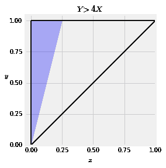

为了找到积分的区域，首先还是需要固定$y$，$x$的值从 0 增长至$y/4$。因此
$$
\begin{align*}
P(Y > 4X) ~ &= ~ \int_0^1 \int_0^{y/4} 120x(y-x)(1-y)dxdy \\
&= ~ 120 \int_0^1 (1-y) \Big{(} \int_0^{y/4} (xy - x^2)dx \Big{)}dy \\
&= ~ 120\Big{(} \frac{1}{32} - \frac{1}{192} \Big{)} \int_0^1 (1-y) y^3dy \\
&= ~ 120\Big{(} \frac{1}{32} - \frac{1}{192}\Big{)} \cdot \frac{1}{20} ~ = ~ 0.15625
\end{align*}
$$
**使用`SymPy`**

```python
Integral(f, (x, 0, y/4), (y, 0, 1))
```

$$
\int_{0}^{1}\int_{0}^{\frac{y}{4}} 120 x \left(- x + y\right) \left(- y + 1\right)\, dx\, dy
$$

```python
Integral(f, (x, 0, y/4), (y, 0, 1)).doit()
```

最终积分结果得到，
$$
\frac{5}{32}\sim0.15625
$$
例子 2

假设你想要知道$P(X > 0.25, Y > 0.5)$。这个事件依旧如下图的着色区域所示。

```python
# HIDDEN
plt.plot([0, 0], [0, 1], color='k', lw=2)
plt.plot([0, 1], [0, 1], color='k', lw=2)
plt.plot([0, 1], [1, 1], color='k', lw=2)
xx = np.arange(0.25, .52, 0.05)
yy1 = 0.5*np.ones(len(xx))
yy2 = np.ones(len(xx))
plt.fill_between(xx, yy1, yy2, alpha=0.3)
xx = np.arange(0.5, 1.1, 0.1)
yy1 = 0.5*np.ones(len(xx))
yy2 = np.ones(len(xx))
plt.fill_between(xx, xx, yy2, alpha=0.3)
plt.xlim(-0.05, 1)
plt.ylim(0, 1.05)
plt.axes().set_aspect('equal')
plt.xticks(np.arange(0, 1.1, 0.25))
plt.yticks(np.arange(0, 1.1, 0.25))
plt.xlabel('$x$')
plt.ylabel('$y$', rotation=0)
plt.title('$X > 0.25, Y > 0.5$');
```

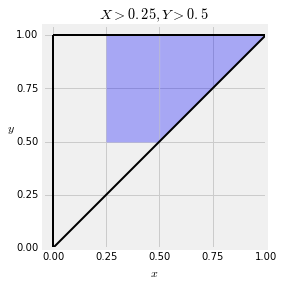

现在$P(X > 0.25, Y > 0.5)$就是该区域的联合概率密度函数的积分。选择$y>0.5$中的某个值并固定，该事件$x$的值从$0.25$增长至$y$。然后先积分$x$再积分$y$，整个积分表示如下
$$
P(X > 0.25, Y > 0.5) ~ = ~ \int_{0.5}^1 \int_{0.25}^y 120x(y-x)(1-y)dxdy
$$

依旧使用$SymPy$

```python
Integral(f, (x, 0.25, y), (y, 0.5, 1))
```

$$
\int_{0.5}^{1}\int_{0.25}^{y} 120 x \left(- x + y\right) \left(- y + 1\right)\, dx\, dy
$$

```python
Integral(f, (x, 0.25, y), (y, 0.5, 1)).doit()
```

最终得到结果，
$$
0.578125
$$
**期望**

设定$g$是平面上的一个函数，于是
$$
E(g(X, Y)) ~ = ~ \int_y \int_x g(x, y)f(x, y)dxdy
$$
如果存在积分，那么可以按任意顺序进行积分:先$x$后$y$，或者相反的顺序。

这是期望的非线性函数规则的应用，应用于具有联合密度的两个随机变量。

举一个例子，针对上面提出的具有联合密度函数$f$的变量$X$和$Y$ ，让我们计算出$E(\frac{Y}{X})$。在这里$g(x, y) = \frac{y}{x}$，因此
$$
\begin{align*}
E\big{(}\frac{Y}{X}\big{)} ~ &= ~ \int_y \int_x g(x, y)f(x, y)dxdy \\ \\
&= ~ \int_0^1 \int_0^y \frac{y}{x} 120x(y-x)(1-y)dx dy \\ \\
&= ~ 120 \int_0^1 y(1-y) \Big{(}\int_0^y (y-x)dx \Big{)}dy \\
&= ~ 60 \int_0^1 y^3(1-y) dy ~ = ~ 60 \cdot \frac{1}{20} ~ = ~ 3
\end{align*}
$$
**使用`SymPy`**

```python
ev_y_over_x = Integral((y/x)*f, (x, 0, y), (y, 0, 1))
```

$$
\int_{0}^{1}\int_{0}^{y} 120 y \left(- x + y\right) \left(- y + 1\right)\, dx\, dy
$$

```python
ev_y_over_x.doit()
```

得到结果，
$$
3
$$


## 17.2 独立性

```python
# HIDDEN
from datascience import *
from prob140 import *
import numpy as np
import matplotlib.pyplot as plt
plt.style.use('fivethirtyeight')
%matplotlib inline
import math
from scipy import stats
from sympy import *
init_printing()
```

联合分布的随机变量$X$和$Y$是独立的，当且仅当
$$
P(X \in A, Y \in B) = P(X \in A)P(Y \in B), \forall X,Y
$$
变量$X$的概率密度为$f_X$,$Y$的概率密度为$f_Y$，现在假定$X$与$Y$相互独立，那么作为$X$与$Y$的联合概率密度函数$f$，
$$
\begin{align*}
f(x, y)dxdy &\sim P(X \in dx, Y \in dy) \\
&= P(X \in dx)P(Y \in dy) ~~~~~ \text{(independence)} \\
&= f_X(x)dx f_Y(y)dy \\
&= f_X(x)f_Y(y)dxdy
\end{align*}
$$
因此，如果$X$和$Y$独立，那么他们的联合密度
$$
f(x, y) = f_X(x)f_Y(y)
$$
这是密度的乘积规则：两个独立随机变量的联合密度是它们密度的乘积。

**独立标准正态随机变量**

假设$X$和$Y$是独立同分布的标准正态随机变量（i.i.d.），因此他们的联合概率密度表示为
$$
f(x, y) = \frac{1}{\sqrt{2\pi}} e^{-\frac{1}{2}x^2} \cdot \frac{1}{\sqrt{2\pi}} e^{-\frac{1}{2}y^2}, ~~~~ -\infty < x, y < \infty
$$
等价于，
$$
f(x, y) = \frac{1}{2\pi} e^{-\frac{1}{2}(x^2 + y^2)}, ~~~~ -\infty < x, y < \infty
$$
下面尝试绘制出联合概率密度的曲面图，

```python
def indep_standard_normals(x,y):
    return 1/(2*math.pi) * np.exp(-0.5*(x**2 + y**2))

Plot_3d((-4, 4), (-4, 4), indep_standard_normals, rstride=4, cstride=4)
```

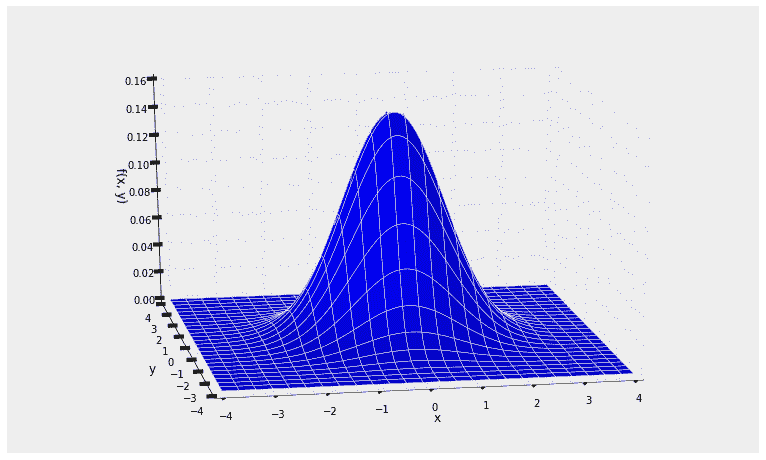

需要注意该曲面整体的对称性，这是由于联合密度的式子中包含的的随机变量对$(x,y)$关于$x^2+y^2$对称。

同时需要注意的是$P(X=Y)=0$，因为概率是直线上的体积。所有具有联合密度的独立随机变量对都是如此：$P(X=Y)=0$。因此$P(X > Y) = P(X \ge Y)$。你不必担心不等号是否应该严格。

**两个服从指数分布的随机变量中较大的一个**

假定$X$和$Y$是独立随机变量，且$X\sim E(\lambda)$（服从参数为$\lambda$的指数分布），$Y\sim E(\mu)$（服从参数为$\mu$的指数分布）。我们这里的目标是得出$P(Y>X)$。

由乘积规则可知，$X$和$Y$的联合概率密度函数为
$$
f(x, y) ~ = ~ \lambda e^{-\lambda x} \mu e^{-\mu y}, ~~~~ x > 0, ~ y > 0
$$
下图绘制的是$\lambda=0.5, \mu=0.25$的情况，因此$E(X)=2,E(Y)=4$。

```python
def independent_exp(x, y):
    return 0.5 * 0.25 * np.e**(-0.5*x - 0.25*y)

Plot_3d((0, 10), (0, 10), independent_exp)
```

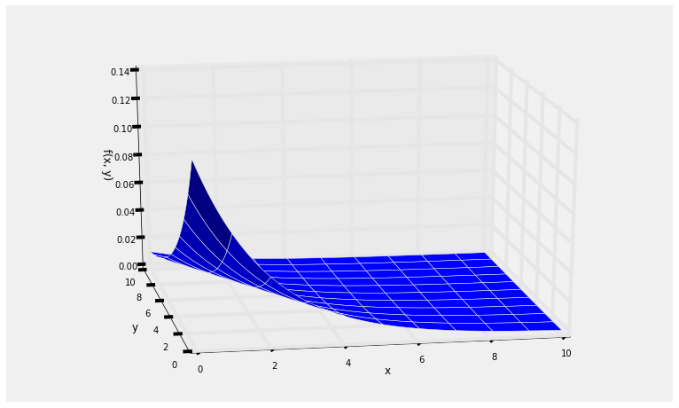

为了得出$P(Y>X)$，我们必须上第一象限中的上三角部分对联合密度函数进行积分，该部分显示如下。

```python
# NO CODE
xx = np.arange(0, 10.1, 0.1)
yy = 10*np.ones(len(xx))
plt.fill_between(xx, xx, yy, alpha=0.3)
plt.axes().set_aspect('equal')
plt.xlabel('$x$')
plt.ylabel('$y$', rotation=0)
plt.title('$Y > X$ (portion of infinite region)');
```

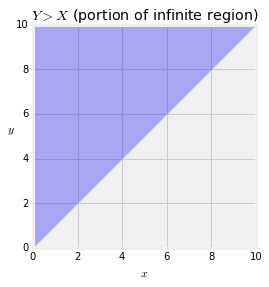

因此，这个概率等于
$$
P(Y > X) ~ = ~ \int_0^\infty \int_x^\infty \lambda e^{-\lambda x} \mu e^{-\mu y} dy dx
$$
我们可以通过使用概率事实来计算这个双重积分而不需要很多微积分知识。
$$
\begin{align*}
P(Y > X) &= \int_0^\infty \int_x^\infty \lambda e^{-\lambda x} \mu e^{-\mu y} dy dx \\ \\
&= \int_0^\infty \lambda e^{-\lambda x} \big{(} \int_x^\infty \mu e^{-\mu y} dy\big{)} dx \\ \\
&= \int_0^\infty \lambda e^{-\lambda x} e^{-\mu x} dx ~~~~~~ \text{(survival function of } Y\text{, evaluated at } x \text{)} \\ \\
&= \frac{\lambda}{\lambda + \mu} \int_0^\infty (\lambda + \mu) e^{-(\lambda + \mu)x} dx \\ \\
&= \frac{\lambda}{\lambda + \mu} ~~~~~~~ \text{(total integral of exponential }
(\lambda + \mu) \text{ density is 1)}
\end{align*}
$$
因此，
$$
P(Y > X) ~ = ~ \frac{\lambda}{\lambda + \mu}
$$
类似的是，
$$
P(X > Y) ~ = ~ \frac{\mu}{\lambda + \mu}
$$

需要注意的是以上两个值与参数（$\lambda 、\mu$）成正比。如果你将$X$和$Y$当作两个生命周期，那么这与直觉是一致的。如果$\lambda$偏大，相应的$X$的生命周期就偏小，因此这个式子表明$Y$更有可能比$X$大。

如果$\lambda = \mu$，那么$P(Y>X)=1/2$，同时对称的也是相等的值，因为$P(X=Y)=0$。

如果我们尝试以另外一个顺序进行双重积分——先$X$后$Y$，那么我们需要做更多的事情。
$$
\int_0^\infty \int_0^y \lambda e^{-\lambda x} \mu e^{-\mu y} dx dy
$$
现在使用`SymPy`来检查是否是相等的答案。

需要注意的是`SymPy`不能使用负指数，所以我们需要改变一些函数的形式。

```python
declare('x', 'y', 'lamda', 'mu', positive=True)

f_X = lamda * exp(-lamda * x)

f_Y = mu * exp(-mu * y)

jt_density = f_X * f_Y
jt_density
```

$$
\frac{\lambda \mu}{e^{\lambda x} e^{\mu y}}
$$

```python
p_Y_greater_than_X = Integral(jt_density, (x, 0, y), (y, 0, oo))
p_Y_greater_than_X
```

$$
\int_{0}^{\infty}\int_{0}^{y} \frac{\lambda \mu}{e^{\lambda x} e^{\mu y}}\, dx\, dy
$$

```python
p_Y_greater_than_X.doit()
```

$$
1 - \frac{\mu}{\lambda \left(1 + \frac{\mu}{\lambda}\right)}
$$

上面这个式子看起来十分奇怪，但是它其实等价于
$$
1 - \frac{\mu}{\lambda + \mu} ~ = ~ \frac{\lambda}{\lambda + \mu}
$$
这样就和我们早先得到的答案一样。


## 17.3 边际密度和条件密度

```python
# HIDDEN
from datascience import *
from prob140 import *
import numpy as np
import matplotlib.pyplot as plt
plt.style.use('fivethirtyeight')
%matplotlib inline
import math
from scipy import stats
from sympy import *
init_printing()
```

假定随机变量$X$和$Y$的联合概率密度如下，
$$
f(x, y) ~ = ~ 
\begin{cases}
30(y-x)^4, ~~~ 0 < x < y < 1 \\
0 ~~~~~~~~ \text{otherwise}
\end{cases}
$$

```python
def jt_dens(x,y):
    if y < x:
        return 0
    else:
        return 30 * (y-x)**4

Plot_3d(x_limits=(0,1), y_limits=(0,1), f=jt_dens, cstride=4, rstride=4)
```

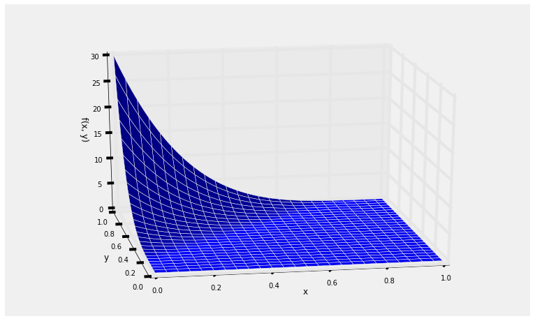


然后$(X,Y)$可能的值就位于左上角三角形，

```python
# NO CODE
plt.plot([0, 0], [0, 1], color='k', lw=2)
plt.plot([0, 1], [0, 1], color='k', lw=2)
plt.plot([0, 1], [1, 1], color='k', lw=2)
plt.xlim(-0.05, 1)
plt.ylim(0, 1.05)
plt.axes().set_aspect('equal')
plt.xticks(np.arange(0, 1.1, 0.25))
plt.yticks(np.arange(0, 1.1, 0.25))
plt.xlabel('$x$')
plt.ylabel('$y$', rotation=0)
plt.title('Possible Values of $(X, Y)$');
```

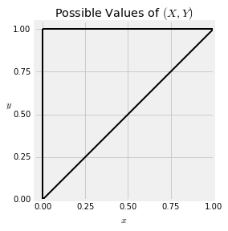


这里使用`SymPy`快速检查保证函数$f$是一个联合概率密度，

```python
declare('x', interval=(0, 1))
declare('y', interval=(0, 1))
joint_density = 30*(y-x)**4
```

```python
Integral(joint_density, (y, x, 1), (x, 0, 1)).doit()
```

**$X$的密度**

我们可以使用联合分布$f$来得到$X$的边缘分布，记为$f_X$。我们知道
$$
\begin{align*}
f_X(x)dx &\sim P(X \in dx) \\
&= \int_y P(X \in dx, Y \in dy) \\
&= \int_y f(x, y)dxdy \\
&= \big{(} \int_y f(x, y)dy \big{)}dx
\end{align*}
$$
在下面这副图，你可以看到这样计算的推论。蓝线表示事件${X\in dx}$非常靠近 0.25。为了得出$P(X\in dx)$所对应的体积，我们固定$x$然后加上所有的$y$。

```python
# NO CODE
plt.plot([0, 0], [0, 1], color='k', lw=2)
plt.plot([0, 1], [0, 1], color='k', lw=2)
plt.plot([0, 1], [1, 1], color='k', lw=2)
plt.plot([0.25, 0.25], [0.25, 1], color='blue', lw=3, alpha=0.3)
plt.xlim(-0.05, 1)
plt.ylim(0, 1.05)
plt.axes().set_aspect('equal')
plt.xticks(np.arange(0, 1.1, 0.25))
plt.yticks(np.arange(0, 1.1, 0.25))
plt.xlabel('$x$')
plt.ylabel('$y$', rotation=0)
plt.title('$X \in dx$');
```

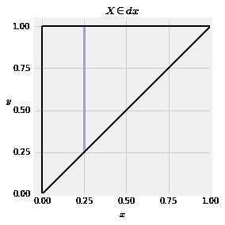

因此$X$的分布密度函数可以由下式得到，
$$
f_X(x) ~ = ~ \int_y f(x, y)dy ~~~~~ \text{for all } x
$$

通过与离散情况类比，$f_X$也被称为$X$的边缘密度。

在我们这里举的例子中，$(X,Y)$可能的值是左上角的三角形。因此，对于每个固定的$x$，$Y$可能的值是从$x$至 1。

所以，例子中$X$的密度可以如下计算，
$$
\begin{align*} 
f_X(x) &= \int_x^1 30(y-x)^4 dy \\
&= 30 \cdot \frac{1}{5} (y-x)^5 \Big{\rvert}_x^1 \\
&= 6(1-x)^5
\end{align*}
$$
这里再次出现了联合分布密度函数的曲面图形，可以从图中看到$X$相较于 1 更靠近 0。

```python
Plot_3d(x_limits=(0,1), y_limits=(0,1), f=jt_dens, cstride=4, rstride=4)
```


通过$X$的边缘密度分布可以看到类似的图形，

```python
# NO CODE
x_vals = np.arange(0, 1.01, 0.01)
f_X = 6*(1-x_vals)**5
plt.plot(x_vals, f_X, color='darkblue', lw=2)
plt.xlabel('$x$')
plt.ylabel('$f_X(x)$', rotation=0)
plt.title('$f_X$: Density of $X$');
```

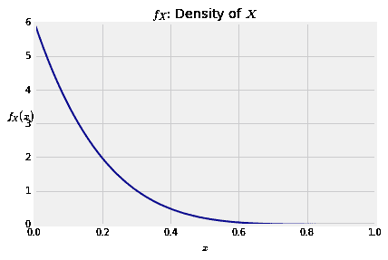


**$Y$的密度**

相应地，$Y$的密度函数可以通过固定$y$并对$x$进行积分得到，
$$
f_Y(y) = \int_x f(x, y)dx ~~~~ \text{for all } y
$$
在我们的例子中，联合分布的密度函数曲面表明$Y$更接近于 1，这也能通过计算证明。需要牢记的是$y>x$，因此对于每个固定的$y$值，$x$的值从 0 增长至$y$。

对于$0<y<1$，
$$
f_Y(y) ~ = ~ \int_0^y 30(y-x)^4dx ~ = ~ 6y^5
$$
```python
# NO CODE
y_vals = np.arange(0, 1.01, 0.01)
f_Y = 6*y_vals**5
plt.plot(y_vals, f_Y, color='darkblue', lw=2)
plt.xlabel('$y$')
plt.ylabel('$f_Y(y)$', rotation=0)
plt.title('$f_Y$: Density of $Y$');
```

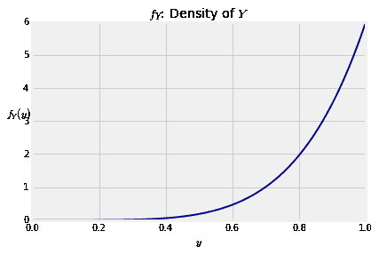

**条件密度**

考虑到条件概率$P(Y \in dy \mid X \in dx)$。依据除法法则，
$$
P(Y \in dy \mid X \in dx) ~ = ~ 
\frac{P(X \in dx, Y \in dy)}{P(X \in dx)} ~ = ~ 
\frac{f(x, y)dxdy}{f_X(x)dx} ~ = ~
\frac{f(x, y)}{f_X(x)} dy
$$
这同样暗示了一个对于概率密度的除法法则。给定值$x$，$y$的条件概率是
$$
f_{Y\mid X=x} (y) ~ = ~ \frac{f(x, y)}{f_X(x)} ~~~~ \text{for all } y
$$
因为变量$X$也有一个边缘概率密度函数，我们知道对于任意的$x$，$P(X=x)=0$。但是上面的比率$f_{Y|X=x(y)}$并不是一个概率。可能赋予更多的直觉“给定$X=x$”意味着“给定的$X$位于$x$附近”。

可以看出，条件分布密度的形状就是联合分布密度图中位于$x$点的垂直截面。式子中的分子决定了形状，分母是常数部分保证了这个密度分布积分结果为 1。

需要谨记的是，在这个公式中$x$是常数，所以分母$f_X(x)$对于所有的$y$都是相等的。

为了确认条件概率密度真的是积分为 1，让我们完成这个这个积分计算。
$$
\int_y f_{Y\mid X=x} (y)dy ~ = ~ \int_y \frac{f(x, y)}{f_X(x)} dy ~ = ~
\frac{1}{f_X(x)} \int_y f(x, y)dy ~ = ~ \frac{1}{f_X(x)} f_X(x) ~ = ~ 1
$$
在我们这个例子中，假定$x=0.2$，然后考虑计算$Y$的条件密度（给定$X=0.4$）。在这个条件下，$Y$可能的值从 0.4 到 1，因此，
$$
f_{Y \mid X=0.4} (y) ~ = ~ \frac{30(y - 0.4)^4}{6(1 - 0.4)^5} ~ = ~ 
\frac{5}{0.6^5} (y - 0.4)^4 ~~~~ y \in (0.4, 1)
$$
这是就是在$(0.4, 1)$区间的条件概率密度

```python
declare('y', interval=(0.4, 1))
cond_density = (5/(0.6**5)) * (y - 0.4)**4
Integral(cond_density, (y, 0.4, 1)).doit()
```

得到结果
$$
0.999999999999999
$$

下面的图就展示了$Y$的边缘密度与给定$X=0.4$时$Y$的条件概率，可以看到条件概率更多集中在较大的$Y$值。

```python
# NO CODE
plt.plot(y_vals, f_Y, color='darkblue', lw=2, label='Density of $Y$')
new_y = np.arange(0.4, 1.01, 0.01)
dens = (5/(0.6**5)) * (new_y - 0.4)**4
plt.plot(new_y, dens, color='gold', lw=2, label='Density of $Y$ given $X=0.4$')
plt.legend()
plt.xlim(0, 1)
plt.xlabel('$y$');
```

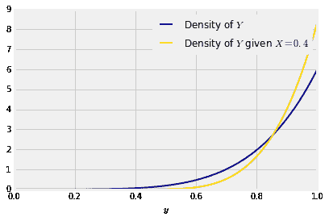

**使用条件概率**

我们通过使用条件概率来计算得到概率和期望，就像我们使用普通的分布密度。下面会举多个计算示例，在每个例子中我们建立积分公式然后使用`SymPy`。
$$
P(Y > 0.9 \mid X = 0.4) = \int_{0.9}^1 \frac{5}{0.6^5} (y - 0.4)^4 dy
$$
上面的示例结果是$60\%$。

```python
declare('y', interval=(0, 1))
cond_density = (5/(0.6**5))*(y - 0.4)**4
Integral(cond_density, (y, 0.9, 1)).doit()
```

$$
0.598122427983537
$$

现在我们使用条件概率计算条件期望。记住，在我们的例子中，给定$X=0.4$时$Y$可能的值从$0.4$至 1。
$$
E(Y \mid X = 0.4) ~ = ~ \int_{0.4}^1 y \frac{5}{0.6^5} (y - 0.4)^4 dy ~ = ~ 0.9
$$

```python
Integral(y*cond_density, (y, 0.4, 1)).doit()
```

$$
0.899999999999998
$$

对于任意固定的$y$值，给定$y$值时$X$的条件概率是
$$
f_{X \mid Y=y} (x) ~ = ~ \frac{f(x, y)}{f_Y(y)} ~~~~~ \text{for all } x
$$
在这一节的所有例子同时与前一节的都开始于一个突然出现的联合密度函数。在下一节里，我们将开始研究它们出现的情况。


## 17.4 具有整数参数的 Beta 密度

```python
# HIDDEN
from datascience import *
from prob140 import *
import numpy as np
import matplotlib.pyplot as plt
plt.style.use('fivethirtyeight')
%matplotlib inline
import math
from scipy import stats
from sympy import *
init_printing()
```

在上一节我们学会了如何使用联合分布的密度函数，但是许多的联合分布密度都像是无中生有。举一个例子，我们检查函数
$$
f(x, y) = 120x(y-x)(1-y), ~~~~ 0 < x < y < 1
$$
是否时一个联合密度，但是并没有展示这个是从何而来。在这一节，我们将追溯源头同时尝试在单位间隔上拓展出一个重要的分布密度函数族。

**独立均匀分布$(0,1)$变量的次序统计量**

假定$U_1, U_2, ..., U_n$是在$(0,1)$均匀分布上的独立变量。想象每一个$U_i$就是一个飞镖扔向单位间隔的具体位置，下图展示了 5 支飞镖(星号)的位置。

```python
# NO CODE

plt.plot([0, 1], [0, 0], color='k', lw=2)
y = 1 - np.ones(5)
x = stats.uniform.rvs(size=5)
order_stats = np.sort(x)
plt.scatter(x, y, marker='*', color='r', s=100)
plt.text(0, -0.0007, r'0', size=16)
plt.text(0.98, -0.0007, r'1', size=16)
plt.xlim(0, 1)
plt.yticks([])
plt.xticks([])
plt.title('Five IID Uniform (0, 1) Variables');
```

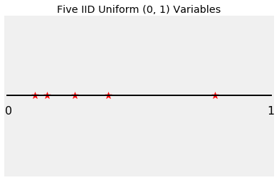

基于上面的图，你能指出哪个星号代表$U_1$。不，你不能，因为$U_1$可能是五个位置中的任意一个。所以你也不饿能分辨出$U_1, U_2, U_3,U_4, U_5$五个变量。

你能看到的只是$U_i$的增长序列。你可以看到最小值，排序后的第二大的值，以及第三大、第四大和第五大的值。

这些值被称作$U_1, U_2, U_3, U_4, U_5$的次序统计量，并被记为$U_{(1)}, U_{(2)}, U_{(3)}, U_{(4)}, U_{(5)}$。

请记住，因为$U_i$是具有密度的独立随机变量，所以它们之间不存在联系：两个变量相等的概率为 0。

```python
# NO CODE

plt.plot([0, 1], [0, 0], color='k', lw=2)
order_stats = np.sort(x)
plt.scatter(x, y, marker='*', color='r', s=100)
u_labels = make_array('$U_{(1)}$', '$U_{(2)}$', '$U_{(3)}$', '$U_{(4)}$', '$U_{(5)}$')
for i in range(5):
    plt.text(order_stats[i], -0.0007, u_labels[i], size=16)
plt.text(0, -0.0007, r'0', size=16)
plt.text(0.98, -0.0007, r'1', size=16)
plt.xlim(0, 1)
plt.yticks([])
plt.xticks([])
plt.title('Order Statistics of the Five IID Uniform (0, 1) Variables');
```

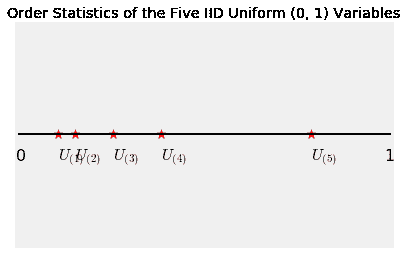

总之对于$1 \le k \le n$，当$U_i$以升序排列时，$U_1, U_2, U_3, U_4, U_5$中的第$k$个次序统计量是第$k$大的值。

**两个次序统计量的联合分布密度**

假定$n=5$，同时在这里我们尝试计算$U_{(2)}$和$U_{(4)}$的联合分布，这代表第二大和第四大的联合分布。

下面这幅图展示了事件$\{U_{(2)} \in dx, U_{(4)} \in dy\}$对于所有的$x$、$y$值，其中$0 < x < y < 1$。

```python
# NO CODE

plt.plot([0, 1], [0, 0], color='k', lw=2)
y = 1 - np.ones(5)
x = make_array(0.1, 0.3, 0.45, 0.7, 0.9)
plt.scatter(x, y, marker='*', color='r', s=100)
plt.plot([0.28, 0.32], [0, 0], color='gold', lw=2)
plt.text(0.28, -0.0007, r'$dx$', size=16)
plt.plot([0.68, 0.72], [0, 0], color='gold', lw=2)
plt.text(0.68, -0.0007, r'$dy$', size=16)
plt.text(0, -0.0007, r'0', size=16)
plt.text(0.98, -0.0007, r'1', size=16)
plt.xlim(0, 1)
plt.yticks([])
plt.xticks([])
plt.title('$n = 5$; $\{ U_{(2)} \in dx, U_{(4)} \in dy \}$');
```

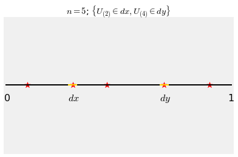

为了得出$P(U_{(2)} \in dx, U_{(4)} \in dy)$，首先可以看出：

- $U_1, U_2, U_3, U_4, U_5$中的一个必定是$dx$，这里共有 5 种情况。
- 剩下的 4 个变量，其中一个必定是$dy$，这里共有 4 种情况。
- 剩下的 3 个变量中，其中一个必定在$(0,x)$。
- 剩下的 2 个变量中，其中一个必定在$(x,y)$。
- 最后一个变量则必定在$(x,y)$。

那么，
$$
P(U_{(2)} \in dx, U_{(4)} \in dy) ~ \sim ~ 5(1dx) \cdot 4(1dy) \cdot 3x \cdot 2(y-x) \cdot 1(1-y) 
~ = ~ 120x(y-x)(1-y)dxdy
$$
因此$U_{(2)}$与$U_{(4)}$的条件概率为，
$$
f(x, y) = 120x(y-x)(1-y), ~~~ 0 < x < y < 1
$$
这个也就解释了这个式子是如何出现的。

但是它能体现更多的东西。服从$(0,1)$均匀分布的独立次序统计量的边缘密度构成了在数据科学中非常重要的一类分布函数族。


**$U_{(k)}$的密度**


假定$U_{(k)}$是$U_1, U_2, \ldots, U_n$的第$k$大的次序统计量。我们这次通过与以前一样的手法得出$U_{(k)}$的密度函数。

下面这幅图展示了事件$\{ U_{(k)} \in dx \}$。当这个事件发生时，

- $dx$必定是$U_1, U_2, \ldots, U_n$其中一个。
- 剩下的$n-1​$个变量中，必定有$k-1​$个位于$(0,x)​$，其余的位于$(x,1)​$。

```python
# NO CODE

plt.plot([0, 1], [0, 0], color='k', lw=2)
plt.scatter(0.4, 0, marker='*', color='r', s=100)
plt.plot([0.38, 0.42], [0, 0], color='gold', lw=2)
plt.text(0.38, -0.0007, r'$dx$', size=16)
plt.text(0.1, 0.001, '$k-1$ stars', size=16)
plt.text(0.1, 0.0005, 'in $(0, x)$', size=16)
plt.text(0.6, 0.001, '$n-k$ stars', size=16)
plt.text(0.6, 0.0005, 'in $(x, 1)$', size=16)
plt.text(0, -0.0007, r'0', size=16)
plt.text(0.98, -0.0007, r'1', size=16)
plt.xlim(0, 1)
plt.yticks([])
plt.xticks([])
plt.title('$\{ U_{(k)} \in dx \}$');
```

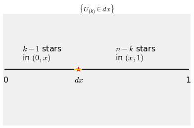

这里共有$n$种方法来选择$dx$的位置，一旦选定，剩下的$n-1$个变量种$k-1$个位于$(0,x)$。那么，
$$
P(U_{(k)} \in dx) \sim n \cdot 1 dx \cdot \binom{n-1}{k-1}x^{k-1}(1-x)^{n-k}
$$
因此$U_{(k)}$的密度函数为
$$
f_{U_{(k)}} (x) = \frac{n!}{(k-1)!(n-k)!} x^{k-1}(1-x)^{n-k}, ~~~ 0 < x < 1
$$
让我们重写一下上面这个公式，
$$
f_{U_{(k)}} (x) = \frac{n!}{(k-1)!((n-k+1)-1)!} x^{k-1}(1-x)^{(n-k+1)-1}, ~~~ 0 < x < 1
$$
因为$1 \le k \le n$，我们知道$n-k+1$是一个正整数。同时由于$n$是一个任意正整数，所以$n-k+1$也一样。

**Beta 密度**

我们已经展示了如果$s$和$r$是任意两个正整数，那么函数
$$
f(x) ~ = ~ \frac{(r+s-1)!}{(r-1)!(s-1)!} x^{r-1}(1-x)^{s-1}, ~~~ 0 < x < 1
$$
就是一个概率密度函数。这个函数被称为*参数为$r$和$s$的 beta 密度函数*。

次序统计量$U_{(k)}$就是一个参数为$k$和$n-k+1$的 beta 密度函数。

密度的形状由$x$和$1-x$决定。所有的阶乘只是常数的部分以确保密度函数积分为 1。

有趣的是，$(0,1)$均匀分布同样属于 beta 密度函数(参数$r=1$与$s=1$)，也就是说，$(0,1)$均匀分布同样是 beta 函数族的一员。

下图展示了某些 beta 密度函数曲线。正如你期望的，参数为$(3,3)$的 beta 密度函数曲线关于 0.5 对称。

```python
x = np.arange(0, 1.01, 0.01)
for i in np.arange(1, 7, 1):
    plt.plot(x, stats.beta.pdf(x, i, 6-i), lw=2)
plt.title('Beta $(i, 6-i)$ densities for $1 \leq i \leq 5$');
```


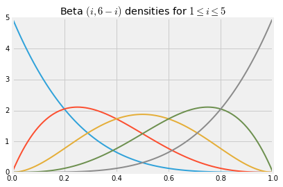

通过选择合适的参数，你可以创造一个 beta 密度函数并且使得它的重量(期望)趋近于一个预定的值。这是 beta 密度函数常常被用于建模随机比率的原因之一。例如，如果你想垃圾邮件的概率更趋近于$60\%$至$90\%$之间，也许更低，你可以通过选择密度使其尖峰在$0.75$附近来表示这一个先验倾向。

**Beta 函数积分**

将 beta 密度函数积分至 1，那么对于任意的正整数$r$和$s$，我们有
$$
\int_0^1 x^{r-1}(1-x)^{s-1}dx ~ = ~ \frac{(r-1)!(s-1)!}{(r+s-1)!}
$$
因此概率论简化了其他方面的工作。同时，我们可以计算出服从 beta 分布的随机变量的期望。

让$X$服从$beta(r,s)$分布，那么
$$
\begin{align*}
E(X) &= \int_0^1 x \frac{(r+s-1)!}{(r-1)!(s-1)!} x^{r-1}(1-x)^{s-1}dx \\
&= \frac{(r+s-1)!}{(r-1)!(s-1)!} \int_0^1 x^r(1-x)^{s-1}dx \\
&= \frac{(r+s-1)!}{(r-1)!(s-1)!} \cdot \frac{r!(s-1)!}{(r+s)!} ~~~~ \text{(beta integral for parameters } r+1 \text{and } s\text{)}\\
&= \frac{r}{r+s}
\end{align*}
$$
你可以使用同样的方法计算出$E(X^2)$与$Var(X)$。

期望的公式同样允许你依据先验知识选择参数。例如，如果你想要这个比率在$0.4$附近，你可以尝试参数$r=2$和$s=3$的 bata 函数。

也许你会注意到 beta 密度函数的形式十分二项式。事实上，我们使用二项式来推导出 beta 密度函数。接下来的教程里面你会看到 beta 密度与二项式之间另一个更近的联系。这些特性使得 beta 函数族成为机器学习中使用最广泛的密度系列之一。