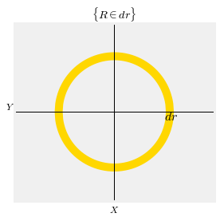
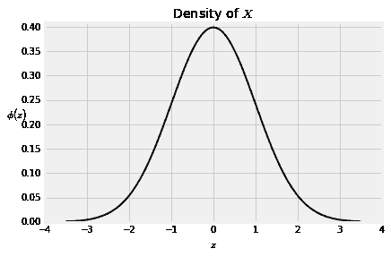
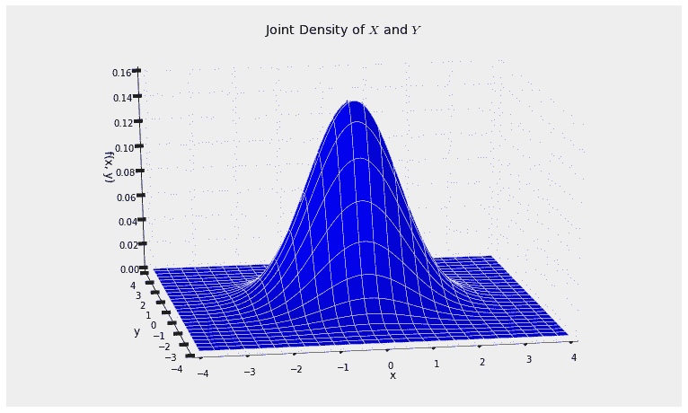
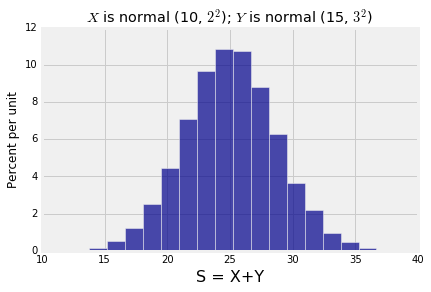
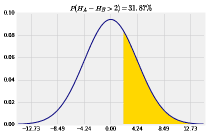
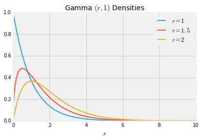
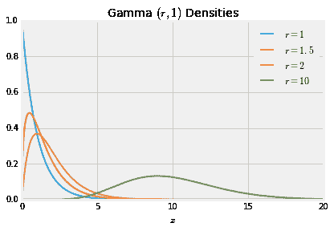
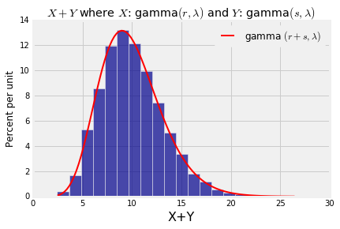
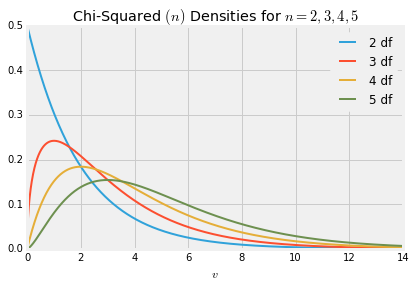

# 18. 正态和伽马分布族

> 译者：[Winchester-Yi](https://github.com/Winchester-Yi)

```python
# HIDDEN
from datascience import *
from prob140 import *
import numpy as np
import matplotlib.pyplot as plt
plt.style.use('fivethirtyeight')
%matplotlib inline
import math
from scipy import stats
```

正态分布族在概率论和数据科学中有独一无二的地位。在你理解更多正式的概率论之前，你就开始使用 Data 8 中的正态分布。所以，你已经将几个基本事实视为理所当然而无需证明。这章我们将开始研究并建立这些事实，同时研究独立正态分布变量的和的问题。

至于伽马分布族，通过练习题进行研究的特性出现在了许多的场景中。举一个例子，你已经证明指数分布属于伽马分布族，就像属于标准正态分布的变量的平方一样。稍后在这章，我们将收集我们知道的关于伽马分布族的内容以及看看在独立伽马分布的变量平方中能挖掘到什么样的东西。

## 18.1 标准正态分布：基础

尽管自从 Data 8 我们已经接受标准正态分布的密度函数，我们还没有证明它的确是一个密度函数-积分为 1。我们也没有检查它的期望是否存在，也没有检查它的标准差的确为 1。

现在是时候完成这些了，只有这样才能确保我们关于正态分布密度的计算是合理的。

在开始的地方我们需要回忆一些关于不相关的瑞利分布的事实，我们曾经在研究指数分布的平方根的分布的时候遇见过。

假定$T$服从参数为$1/2$的指数分布。那么我们可以说$R=\sqrt T$就是一个瑞利分布，并且其累计分布函数为
$$
F_R(r) = 1 - e^{-\frac{1}{2}r^2}, ~~~~ r > 0
$$
同时其密度函数为
$$
f_R(r) = re^{-\frac{1}{2}r^2}, ~~~~ r > 0
$$
事实上，存在一个瑞利分布族，其中每一个都有着$cR$的分布($c$是常数)。但是让我们定义$R$就是唯一的瑞利分布，然后研究$R$是如何与标准正态分布联系起来。

**积分的常数**

假定$X​$和$Y​$是相互独立的标准正态分布变量。因为我们还没有证明标准正态分布的密度函数中积分为$1/\sqrt 2​$的常数，现在暂定其为$c​$。然后，$X​$和$Y​$的联合分布密度为
$$
f(x, y) ~ = ~ c e^{-\frac{1}{2}x^2} \cdot c e^{-\frac{1}{2}y^2} 
~ = ~ c^2 e^{-\frac{1}{2}(x^2 + y^2)},
~~~~ -\infty < x, y < \infty
$$
不管这个常数的具体值，这个联合分布拥有圆对称性。如果两个点在与原点相同径向距离的平面上，那么这个联合密度在这两个点上是一样的。现在使用另外的记号来使这一结论更清晰。
$$
f(x, y) ~ = ~ c^2 e^{-\frac{1}{2}r^2} ~~~~ \text{where } x^2 + y^2 = r^2
$$
现在假定$R = \sqrt{X^2 + Y^2}$。为了找到$R$的密度，现在尝试计算$P(R\in dr)$。这个事件在下图中展示。

```python
# NO CODE
x = np.append(np.arange(-1, 0.999, 0.01), 1)
y = (1 - x**2)**0.5
plt.plot(x, y, color='gold', lw=10)
y2 = -1*y
plt.plot(x, y2, color='gold', lw=10)
plt.plot([-1.8, 1.8], [0, 0], color='k', lw=1)
plt.plot([0, 0], [-1.8, 1.8], color='k', lw=1)
plt.xlim(-1.8, 1.8)
plt.ylim(-1.6, 1.6)
plt.xticks([])
plt.yticks([])
plt.text(0.9, -0.15, '$dr$', size=16)
plt.xlabel('$X$')
plt.ylabel('$Y$', rotation=0)
plt.title('$\{R \in dr \}$')
plt.axes().set_aspect('equal');
```



为了得到联合密度曲面下的相关体积，两个观察会有帮助。

- 由于具有圆对称性，联合密度曲面在整个黄色的圆环上都是同一高度，且高度为$c^2e^{-\frac{1}{2}r^2}$。
- 圆环的区域基本上等价于一个矩形，且矩形宽为$dr$，长等于周长$2\pi r$。

因此，
$$
P(R \in dr) ~ \sim ~ 2\pi r \cdot dr \cdot c^2e^{-\frac{1}{2}r^2}, ~~~~ r > 0
$$
所以$R$的密度函数为
$$
f_R(r) ~ = ~ 2\pi c^2 r e^{-\frac{1}{2}r^2}, ~~~~ r > 0
$$
将这个密度函数与瑞利分布的密度函数比较。这两者是一样的除了常数部分不同。瑞利分布的常数为 1 而对于新的$R$分布，其常数为$2\pi ^2c$。但是由于两个函数是等价的，因此常数部分也必定相同。因此$1=2\pi c^2$，这就意味着
$$
c = \frac{1}{\sqrt{2\pi}}
$$
现在我们知道标准正态分布的密度函数$\phi$也是一个密度函数，
$$
\phi(z) ~ = ~ \frac{1}{\sqrt{2\pi}} e^{-\frac{1}{2}z^2}, ~~~~ -\infty < z < \infty
$$

```python
# NO CODE
z = np.arange(-3.5, 3.51, 0.01)
phi = stats.norm.pdf(z)
plt.plot(z, phi, color='k', lw=2)
plt.ylim(0, 0.41)
plt.title('Density of $X$')
plt.xlabel('$z$')
plt.ylabel('$\phi(z)$', rotation=0);
```



```python
def indep_standard_normals(x,y):
    return 1/(2*math.pi) * np.exp(-0.5*(x**2 + y**2))

Plot_3d((-4, 4), (-4, 4), indep_standard_normals, rstride=4, cstride=4)
plt.title('Joint Density of $X$ and $Y$');
```



**期望**

如果$Z$服从标准正态分布且$E(Z)$存在，那么$E(Z)$必须关于$0$对称。但是你已经在习题中看到并不是所有的对称函数都有期望，柯西函数就是其中一个例子。为了确保$E(Z)=0$，我们必须首先确保$E(|Z|)$是有限的。
$$
\begin{align*}
E(\lvert Z \rvert) &= \int_{-\infty}^\infty \lvert z \rvert \phi(z)dz \\ \\
&= 2 \int_0^\infty z \phi(z)dz ~~~~ \text{(symmetry)} \\ \\
&= \frac{2}{\sqrt{2\pi}} \int_0^\infty z e^{-\frac{1}{2}z^2} dz \\ \\
&= \frac{2}{\sqrt{2\pi}} ~~~~~~ \text{(Rayleigh density integrates to 1)} \\ \\
&= \sqrt{\frac{2}{\pi}}
\end{align*}
$$
我们不止证明了$E(|Z|)$的值是有限的，因此$E(Z)=0$，同时我们还得到了$E(|Z|)$的具体值。

**方差**

如果$X$和$Y$是独立的标准正态分布变量，我们已经证明了$R = \sqrt{X^2 + Y^2}$就是瑞利分布。

同时也知道了瑞利分布能够作为参数$1/2$的指数分布的平方根的分布出现。

紧接着，如果$X$和$Y$是独立的标准正态分布变量，那么$X^2 + Y^2$就是服从参数$1/2$的指数分布。

在后面的章节我们会对这些进行更深入的研究。至此，让我们总结两个关于期望的观察结果。

- $X^2 + Y^2$服从参数$1/2$的指数分布，因此$E(X^2 + Y^2) = 2$。
- $X$和$Y$服从完全一样的分布，因此$E(X^2) = E(Y^2)$。

综上，$E(X^2)=1$。我们知道$E(X)=0$，因此$Var(X) = 1$且$SD(X) = 1$。


## 18.2 独立正态分布变量的和

基于以下事实，这一节将包含多个例子：

**独立正态分布变量的和同样服从正态分布**

我们将会在下一节使用矩母函数证明这一观点。而现在，我们将进行一个快速的模拟并观察如何在例子中利用这一事实。

```python
mu_X = 10
sigma_X = 2
mu_Y = 15
sigma_Y = 3
x = stats.norm.rvs(mu_X, sigma_X, size=10000)
y = stats.norm.rvs(mu_Y, sigma_Y, size=10000)
s = x+y
Table().with_column('S = X+Y', s).hist(bins=20)
plt.title('$X$ is normal (10, $2^2$); $Y$ is normal (15, $3^2$)');
```




上面的仿真随机生成了$10,000$个样本$X+Y$，其中$X$服从均值为$10$，标准差为$2$的正态分布，$Y$独立于$X$且其服从均值为$15$，标准差为$3$的正态分布。由结果可以清楚地看出两者和服从正态分布。你可以改变参数然后检查和的分布是否是一样的形状，尽管坐标轴的标签不一样。

为了确认是否真的是正态分布，你必须算出和的均值和方差。这里仅仅使用均值和方差的特性：

如果$X$服从$(\mu_X, \sigma_X^2)$的正态分布，$Y$独立于$X$且服从$(\mu_Y, \sigma_Y^2)$的正态分布，那么$X+Y$也是正态分布且均值为$\mu_X + \mu_Y$，方差为$\sigma_X^2 + \sigma_Y^2$。

这意味着我们不需要$X$和$Y$的联合密度就能得到$X+Y$事件的概率。

**独立同正态分布变量的和**

假定$X_1, X_2, \ldots, X_n$是独立同正态分布的变量，且其均值为$\mu$，方差为$\sigma^2$。现在$S_n = X_1 + X_2 + \ldots + X_n$。那么$S_n$的分布也是正态分布，但是其均值为$n\mu$，方差为$n\sigma^2$。

这个看起来很想中心极限定理，但是需要注意到这里没有假设$n$很大，也不是近似服从正态分布。

如果潜在分布是正态分布，那么无论样本大小，独立抽取的样本的和也是正态分布。

**两个独立正态分布变量间的区别**

如果$Y$是正态分布，那么$-Y$也是。因此如果$X$和$Y$是独立的正态分布，那么$X-Y$也是正态的，并且均值为$\mu x-\mu y$，方差则等于
$$
Var(X - Y) ~ = ~
Var(X) + Var(-Y) ~ = ~
\sigma_X^2 + (-1)^2\sigma_Y^2 ~ = ~
\sigma_X^2 + \sigma_Y^2
$$
举个例子，如果$A、B$两人的身高分别为$H_A$和$H_B$，并假设$H_A$和$H_B$是独立同正态分布，均值为$66$英寸，标准差为$3$英寸。那么$A$比$B$高$2$英寸的概率是
$$
P(H_A > H_B + 2) = P(H_A - H_B > 2) = 1 - \Phi\big{(}\frac{2 - 0}{\sqrt{18}}\big{)}
$$
因为$H_A-H_B$是正态分布，均值为$0$，标准差为$\sqrt{3^2 + 3^2} = \sqrt{18} = 4.24$。

```python
# NO CODE
mu = 0
sigma = 18**0.5
x = np.arange(mu - 3.5*sigma, mu + 3.5*sigma+0.1, 0.1)
plt.plot(x, stats.norm.pdf(x, mu, sigma), color='darkblue', lw=2)
w = np.arange(2, mu+3.5*sigma+0.1, 0.1)
plt.fill_between(w, stats.norm.pdf(w, mu, sigma), color='gold')
plt.xticks(np.arange(mu-3*sigma, mu+3*sigma+0.1, sigma))
plt.title('$P(H_A - H_B > 2) = 31.87\%$');
```





```python
mu = 0
sigma = 18**0.5
1 - stats.norm.cdf(2, mu, sigma)
```

$$
0.31867594411696853
$$

**比较两样本的比例**

一个候选者正在参与竞选。在州 1，$50\%$的选民偏爱他，在州 2，只有$27\%$的选民选择他。每个州随机抽取 1000 名选民。你可以假定样本之间相互独立并且在每个州都有成千上万的选民。

**问题**：样本来自州 1 的概率是多少，选择候选人的选民比例是洲 2 样本比例的两倍多。

**答案**：对于$i=1,2$，$X_i$是在州$i$的样本中选民选择候选人的比例。我们想要求得$P(X_1 > 2X_2)$。根据中心极限定理，$X_1$和$X_2$都是近似正态分布，所以$X_1-2X_2$也近似是正态分布。

现在问题的关键在于找到均值和标准差。
$$
E(X_1 - 2X_2) ~ = ~ 0.5 - 2\times 0.27 = -0.04
$$

$$
Var(X_1) = \frac{0.5 \times 0.5}{1000} = 0.00025, ~~~~~~
Var(X_2) = \frac{0.27 \times 0.73}{1000} = 0.000197
$$

$$
Var(X_1 - 2X_2) = Var(X_1) + 4Var(X_2) = 0.00104, ~~~~~~
SD(X_1 - 2X_2) = 0.03222
$$

因此，
$$
P(X_1 > 2X_2) ~ = ~ P(X_1 - 2X_2 > 0) 
~ \approx ~ 1 - \Phi \big{(} \frac{0 - (-0.04)}{0.03222} \big{)}
~ \approx ~ 10.7\%
$$

```python
mu = 0.5 - 2*0.27
var = (0.5*0.5/1000) + 4*(0.27*.73/1000)
sigma = var**0.5
1 - stats.norm.cdf(0, mu, sigma)
```

$$
0.1072469993885582
$$


## 18.3 伽马分布族

在习题中你已经看到了非负随机变量$X$服从$gamma(r,\lambda)$的分布，其中$r$和$\lambda$都是正实数，如果$X$的分布密度给定如下
$$
f_X(x) ~ = ~ \frac{\lambda^r}{\Gamma(r)} x^{r-1}e^{-\lambda x}, ~~~~~ x \ge 0
$$
其中，
$$
\Gamma(r) ~ = ~ \int_0^\infty x^{r-1}e^{-x} dx
$$
就是 Gamma 函数，它作为常数部分保证密度函数积分为 1。

就像你知道的，伽马函数的关键特点就是以下这个递归表达式，
$$
\Gamma(r+1) ~ = ~ r\Gamma (r), ~~~~ r > 0
$$
这也就暗示了
$$
\Gamma(r) ~ = ~ (r-1)! ~~~~ \text{如果} r \text{是一个正整数}
$$
把这些放在一起就是为了表明
$$
E(X) ~ = ~ \frac{r}{\lambda} ~~~~~~~~~~~~~~ SD(X) ~ = ~ \frac{\sqrt{r}}{\lambda}
$$
你已经观察到标准正态分布变量的平方就是服从 gamma$(1/2, 1/2)$，参数为$\lambda$指数分布也是服从 gamma$(1, \lambda)$分布。

**比率$\lambda$**

对于固定的$r$，$\lambda$越大，所期望的$X$就越小。类似于指数分布，参数$\lambda$基本确定了单位度量。对于正常数$c$，随机变量$Y=cX$服从 gamma$(,\lambda /c)$分布。你可以通过将线性变换引入式子中观察到这一点。例如正数$y$，$Y$的密度分布为
$$
f_Y(y) ~ = ~ f_X(\frac{y}{c}) \cdot \frac{1}{c} ~ = ~ 
\frac{(\lambda/c)^r}{\Gamma(r)} y^{r-1}e^{-(\lambda/c) y}
$$
SciPy 将$1/\lambda$称为 gamma 分布中的比例参数。因为这个参数决定了密度图中横轴的比例，它的值经常取为 1。这就是为什么我们转而研究另外一个参数$r$。

**形状参数$r$**

这里是服从 gamma$(r,1)$分布的密度函数图，其中$r=1,1.5,2\text{以及}10$.

```python
# NO CODE
x = np.arange(0, 10, 0.01)
y1 = stats.gamma.pdf(x, 1, scale=1)
y2 = stats.gamma.pdf(x, 1.5, scale=1)
y3 = stats.gamma.pdf(x, 2, scale=1)
y5 = stats.chi2.pdf(x, 5)
plt.plot(x, y1, lw=2, label='$r = 1$')
plt.plot(x, y2, lw=2, label='$r = 1.5$')
plt.plot(x, y3, lw=2, label='$r = 2$')
plt.legend()
plt.xlabel('$x$')
plt.title('Gamma $(r, 1)$ Densities');
```



当$r=1$时，密度函数时指数分布。随着$r$增加，密度函数逐渐往右移并且变得扁平，与增加的均值$r$一致和标准差$\sqrt r$。

当$r=10$时，伽马密度函数看起来是正常的。为说明原因，我们会检查独立伽马变量的和。

```python
# NO CODE
x = np.arange(0, 20, 0.01)
y1 = stats.gamma.pdf(x, 1, scale=1)
y2 = stats.gamma.pdf(x, 1.5, scale=1)
y3 = stats.gamma.pdf(x, 2, scale=1)
y4 = stats.gamma.pdf(x, 10, scale=1)
plt.plot(x, y1, lw=2, label='$r = 1$')
plt.plot(x, y2, lw=2, label='$r = 1.5$')
plt.plot(x, y3, lw=2, label='$r = 2$')
plt.plot(x, y4, lw=2, label='$r = 10$')
plt.legend()
plt.xlabel('$x$')
plt.title('Gamma $(r, 1)$ Densities');
```



**具有相同速率参数$\lambda$的独立伽玛变量的和**

如果$X$服从 gamma$(r,\lambda)$和$Y$独立于$X$且服从 gamma$(s,\lambda)$，那么$X+Y$服从 gamma$(r+s,\lambda)$分布。

需要记住为了应用这一结论，$X$和$Y$的速率参数$\lambda$必须一样。同时证明$X+Y$的速率参数也是一样的，而形状参数则是两者相加。

我们将在下一章中证明这个结果以及独立正态变量之和的相应结果。现在，就像在正态分布的变量和一样，我们将通过仿真来验证这一结论。下面代码中的前三行在设定$\lambda、r\text{和}s$的值，剩下的代码模拟生成$10000$个$X+Y$的值，然后通过仿真的值画出 gamma$(r+s,\lambda)$的分布。

```python
# Change these three parameters as you wish.
lam = 1
r = 3
s = 7

# Leave the rest of the code alone.
x = stats.gamma.rvs(r, scale=1/lam, size=10000)
y = stats.gamma.rvs(s, scale=1/lam, size=10000)
w = x+y
Table().with_column('X+Y', w).hist(bins=20)
t = np.arange(min(w), max(w)+0.1, (max(w) - min(w))/100)
dens = stats.gamma.pdf(t, r+s, scale=1/lam)
plt.plot(t, dens, color='red', lw=2, label='gamma $(r+s, \lambda)$')
plt.legend()
plt.title('$X+Y$ where $X$: gamma$(r, \lambda)$ and $Y$: gamma$(s, \lambda)$');
```



你现在可以看出为什么当$r$足够大时，gamma$(r,\lambda)$分布会近似为正态分布。通过以上结果，对于整数$r$，服从指数分布$(\lambda)$的独立变量和服从 gamma$(r,\lambda)$分布。对于固定的$\lambda$和增长的$r$，中心极限定理说明该分布的和趋近于正态分布。

伽马分布族经常被用于建模右偏峰的非负布。在数据科学中，伽马分布族也常出现在平方“居中”的正态随机变量中，这也就意味着，正态随机变量的均值为 0。下一节将列出细节。

## 18.4 卡方分布

假定$Z$时标准正态分布的随机变量，令$V=Z^2$。通过改变变量的密度公式，我们发现$V$的密度为
$$
f_V(v) ~ = ~ \frac{1}{\sqrt{2\pi}} v^{-\frac{1}{2}} e^{-\frac{1}{2} v}, ~~~~ v > 0
$$
这就是 gamma$(1/2,1/2)$密度函数。它也被称为自由度为$1$的卡方分布，我们缩写为 chi-squared$(1)$。

**从 chi-squared$(1)$到 chi-squared$(n)$**

当我们建立标准正态分布的特性时，我们发现如果$Z_1$和$Z_2$时标准正态独立变量，那么$Z_1^2+Z_2^2$就服从指数分布(参数为$1/2$)。我们在瑞利分布中通过比较两个不同的设定观察到了这一结论，但是并没有特别明晰的理由得出为什么$Z_1^2+Z_2^2$服从指数分布。

现在我们知道了独立的伽马分布（比率参数相同）随机变量的和也服从伽马分布，并且其形状参数等于两者之和，比率参数保持不变，所以$Z_1^2+Z_2^2$服从 gamma$(1,1/2)$。就像练习中展示的那样，这个分布和指数分布(1/2)是一样的。这解释了为什么两个独立同标准正态分布变量的和也服从指数分布(1/2)。

假定$Z_1, Z_2, \ldots, Z_n$是独立标准正态变量，那么$Z_1^2, Z_2^2, \ldots, Z_n^2$是独立同 chi-squared$(1)$的变量。这就意味着，它们每一个都服从 gamma$(1/2,1/2)$分布。

通过归纳，$Z_1^2 + Z_2^2 + \cdots + Z_n^2$服从 gamma$(n/2,1/2)$分布，这个分布被称为卡方分布且其自由度为$n$，我们缩写为 chi-squared$(n)$。

**自由度为$n$的卡方分布**

对于一个正整数$n$，随机变量$X$服从自由度为$n$的卡方分布当$X$的分布为 gamma$(n/2,1/2)$。因此，$X$的密度为
$$
f_X(x) ~ = ~ \frac{\frac{1}{2}^{\frac{n}{2}}}{\Gamma(\frac{n}{2})} x^{\frac{n}{2} - 1} e^{-\frac{1}{2}x}, ~~~~ x > 0
$$
这里是卡方分布的图，且其自由度从 2 变化至 5。

```python
# NO CODE
x = np.arange(0, 14, 0.01)
y2 = stats.chi2.pdf(x, 2)
y3 = stats.chi2.pdf(x, 3)
y4 = stats.chi2.pdf(x, 4)
y5 = stats.chi2.pdf(x, 5)
plt.plot(x, y2, lw=2, label='2 df')
plt.plot(x, y3, lw=2, label='3 df')
plt.plot(x, y4, lw=2, label='4 df')
plt.plot(x, y5, lw=2, label='5 df')
plt.legend()
plt.xlabel('$v$')
plt.title('Chi-Squared $(n)$ Densities for $n = 2, 3, 4, 5$');
```




自由度为 2 的卡方分布是指数分布因为它也是 gamma$(1,1/2)$分布，因此这个分布有三个名字：

- 自由度为 2 的卡方分布
- gamma$(1,1/2)$
- 指数分布$(1/2)$

**均值和方差**

现在你知道了如果$T$服从 gamma$(r,\lambda)$，那么
$$
E(T) ~ = ~ \frac{r}{\lambda} ~~~~~~~~~~~~ SD(T) = \frac{\sqrt{r}}{\lambda}
$$
如果$X$服从自由度为$n$的卡方分布，那么$X$服从 gamma$(n/2,1/2)$。因此
$$
E(X) ~ = ~ \frac{n/2}{1/2} ~ = ~ n
$$
那么服从卡方分布的随机变量的期望就是它的自由度。

标准差为
$$
SD(X) ~ = ~ \frac{\sqrt{n/2}}{1/2} ~ = ~ \sqrt{2n}
$$
**估计正态方差**

假定$X_1, X_2, \ldots, X_n$服从正态分布$(\mu,\sigma^2)$，现在如果你已经知道$\mu$，需要求出$\sigma^2$。

$Z_i$是$X_i$的，因此$Z_i = (X_i - \mu)/\sigma$。定义随机变量$T$如下
$$
T ~ = ~ \sum_{i=1}^n Z_i^2 ~ = ~ \frac{1}{\sigma^2}\sum_{i=1}^n (X_i - \mu)^2
$$
那么$T$服从自由度为$n$的卡方分布，并且$E(T)=n$。现在定义$W$
$$
W ~ = ~  \frac{\sigma^2}{n} T ~ = ~ \frac{1}{n} \sum_{i=1}^n (X_i - \mu)^2
$$
随后因为已经知道$\mu$的值，$W$可以通过样本进行计算。同时，因为$W$是$T$的线性变换，可以很直接地得出$E(W)=\sigma^2$。因此我们可以构建$\sigma^2$的无偏估计：它是已知总体均值的均方偏差。

但通常，$\mu$是未知的。在这种情况下你需要另外一种估计$\sigma^2$的方法，因为你不能像上面那样计算$W$。在练习中你知道了
$$
S^2 ~ = ~ \frac{1}{n-1}\sum_{i=1}^n (X_i - \bar{X})^2
$$
是$\sigma^2$的无偏估计而不管$X_i$的具体分布。就像这个例子一样，当$X_i$是正态分布，可以证明$S^2$是自由度为$(n-1)$的卡方分布的线性变换。在下节中，我们将解释这种方法的原因所在。

**自由度**

上面这个例子能够帮助解释“自由度”这个陌生的术语，这一个词语出现在卡方分布的参数中。

- 当$\mu$已知，你有$n$个独立的中心正态分布$(X_i-\mu)$，由此可以估计$\sigma$。也就意味着，你有个$n$个自由度来构建你的估计。
- 当$\mu$未知是，你使用所有$n$个$X_1 - \bar{X}, X_2 - \bar{X}, \ldots, X_n - \bar{X}$在你的估计中，但是它们并不是相互独立的。它们是$X_1, X_2, \ldots , X_n$离它们的均值$\bar{X}$的偏差，因此它们的和为 0。所以如果你知道其中的$n-1$个，那么最后一个也是确定的。你也就只有$n-1$个自由度。