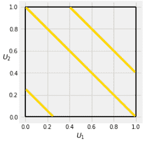
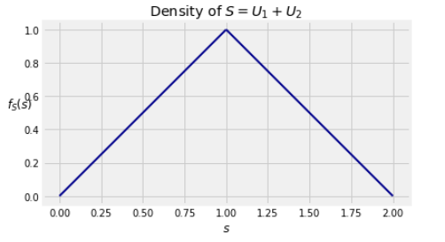
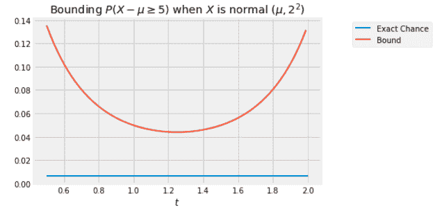
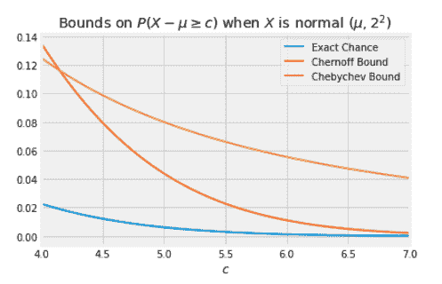

# 十九、和的分布

> 原文：[prob140/textbook/notebooks/ch19](https://nbviewer.jupyter.org/github/prob140/textbook/blob/gh-pages/notebooks/Chapter_19/)
> 
> 译者：[平淡的天](https://github.com/friedhelm739)
> 
> 协议：[CC BY-NC-SA 4.0](http://creativecommons.org/licenses/by-nc-sa/4.0/)
> 
> 自豪地采用[谷歌翻译](https://translate.google.cn/)

# 本章所需 python 包 #
```python
# HIDDEN
from datascience import *
from prob140 import *
import numpy as np
import matplotlib.pyplot as plt
plt.style.use('fivethirtyeight')
%matplotlib inline
import math
from scipy import stats
```

本章提供了一些离散变量和连续变量处理随机变量和的一般方法。

我们将从连续模拟用于分配两个独立的离散随机变量之和卷积公式开始。

然后，我们将开发一个更强大的概率生成函数版本，我们之前定义它来研究具有有限多个非负整数值的独立随机变量的总和。新版本被称为矩生成函数，它将应用于离散和连续随机变量，其具有有限或无限的可能值集。

##卷积公式

我们令`X`和`Y`为两个离散变量，且令`S=X+Y`。我们知道找到`S`分布一种好的方式就是根据`X`的值去划分事件`{S=s}`。即：

$$P(S=s)=\sum_{}^{all x}$(X=x,Y=s-x)$$

如果`X`和`Y`是独立的，那么上一步公式变为离散卷积公式：

$$P(S=s)=\sum_{}^{all x}$P(X=x)P(Y=s-x)$$

这个公式有一个直接的连续模拟。令`X`和`Y`为联合密度为`f`的连续随机变量，令`S=X+Y`。则`S`的密度为：

$$f_{s}(s)=\int_{-\infty }^{\infty }f(x,s-x)dx$$

则当`X`和`Y`独立时公式变为卷积公式：

$$f_{s}(s)=\int_{-\infty }^{\infty }f_{X}(x)f_{Y}(s-x)dx$$

###两个独立同分布指数随机变量的和

令`X`和`Y`为独立同分布指数`（λ）`随机变量，令`S=X+Y`。对于`s>0`的和，`X`和`Y`都不能超过`s`。卷积公式显示`S`的密度为：

$$f_{s}(s)=\int_{0}^{s }\lambda e^{-\lambda x}\lambda e^{-\lambda (s-x)}dx
=\lambda ^{2}e^{-\lambda s}\int_{0}^{s }dx=\lambda ^{2}se^{-\lambda s}$$

这是伽玛(2,λ)密度，与前一章关于独立伽马随机变量之和的说法一致。

有时，可以在没有卷积公式的情况下找到和的密度。

##两个独立同分布二项分布`(0,1)`随机变量的和

令$$S=U_{1}+U_{2}$$,其中$$U_{i}$$为独立同分布二项分布`(0,1)`。下图中的金条显示了各种`S`值的事件`S∈ds`。

```python
# NO CODE
plt.plot([0, 1], [1, 1], color='k', lw=2)
plt.plot([1, 1], [0, 1], color='k', lw=2)
plt.plot([0, 1], [0, 0], color='k', lw=2)
plt.plot([0, 0], [0, 1], color='k', lw=2)
plt.plot([0.005, 0.25], [0.25, 0.005], color='gold', lw=4)
plt.plot([0.005, 0.995], [0.995, 0.005], color='gold', lw=4)
plt.plot([0.405, 0.995], [0.995, 0.405], color='gold', lw=4)
plt.ylim(-0.05, 1.05)
plt.xlim(-0.05, 1.05)
plt.axes().set_aspect('equal')
plt.xlabel('$U_1$')
plt.ylabel('$U_2$', rotation=0);
```



联合密度表面是平坦的。 因此，`S`的密度形状仅取决于条纹的长度，其在`s=0`和`s=1`之间线性增加，然后在`s=1`和`s=2`之间线性减小。 所以`S`的联合密度是三角形的。三角形的高度为 1，因为三角形的面积为 1。

```python
# NO CODE
plt.plot([0, 1], [1, 1], color='k', lw=2)
plt.plot([1, 1], [0, 1], color='k', lw=2)
plt.plot([0, 1], [0, 0], color='k', lw=2)
plt.plot([0, 0], [0, 1], color='k', lw=2)
plt.plot([0.005, 0.25], [0.25, 0.005], color='gold', lw=4)
plt.plot([0.005, 0.995], [0.995, 0.005], color='gold', lw=4)
plt.plot([0.405, 0.995], [0.995, 0.405], color='gold', lw=4)
plt.ylim(-0.05, 1.05)
plt.xlim(-0.05, 1.05)
plt.axes().set_aspect('equal')
plt.xlabel('$U_1$')
plt.ylabel('$U_2$', rotation=0);
```



有时卷积公式中的积分可能非常难以处理。在本章的其余部分，我们将开发一种不同的方法来推导和的分布。

##矩生成函数

概率质量函数和概率密度，cdf 和生存函数都是指定随机变量的概率分布的方法。 它们都被定义为概率或每单位长度的概率，因此具有自然的解释和可视化。

但是也有更抽象的方式来描述分布，例如我们为具有有限多个非负整数值的随机变量定义的概率生成函数（pgf）。

我们现在定义另一个这样的分布变换。 它比 pgf 更通用，是研究分布的有力工具。

设`X`是随机变量。`X`的矩生成函数（mgf）是通过公式在实数上定义的函数：

$$M_{X}(t)=E(e^{tX})$$

对于所有 t 期望是有限的。 事实（我们不会证明）mgf 的域必须是一个区间，不一定是有限的，但必然包括 0，因为$$M_{X}(0)=1$$

对于具有有限多个非负整数值的`X`，我们已经通过$$G_{X}(s)=E(s^{X})$$定义了 pgf。 请注意，这是当$$s)=e^{t}$$时 mgf 的特殊情况，因此为正。对于同时具有 pgf $$G_{X}$$和 mgf $$M_{X}$$的随机变量`X`，这两个函数通过$$G_{X}(log(s))=G_{X}E(s)$$相关。因此,$$M_{X}$$接近 0 的属性反映了 $$G_{X}$$在 1 附近的属性。

本节介绍了 mgf 有用的三种方法。 其他方式将在本章的后续章节中进行说明。 我们所说的关于 mgf 的大部分内容都不会附带完整的证明，因为所需的数学超出了本课程的范围。 但即使没有正式的证明，结果也是合理的。

我们将首先列出三种方法，然后在示例中使用它们。

###产生矩

对于非负整数 k，期望$$E(X^{k})$$被称为`X`的第 k 个矩。您在数据 8 中看到并且在该过程中再次看到平均$$E(X)$$是`X`的概率直方图的重心。在物理学中，质心被称为一阶矩。 矩的术语也用于概率论。

在这个过程中，我们只能使用在 0 左右的某个区间内有限的 mgf。区间可以是整个实线。实际上，如果 mgf 在 0 附近是有限的（不仅仅是 0 的一侧），那么所有的时刻都存在。

展开$$e^{tX}$$可得到：
$$M_{X}(t)=E(1+t\frac{X}{1!}+t^{2}\frac{X^{2}}{2!}+t^{3}\frac{X^{3}}{3!}+...)=1+t\frac{E(X)}{1!}+t^{2}\frac{E(X^{2})}{2!}+t^{3}\frac{E(X^{3})}{3!}+...$$

暂且放下关于我们是否可以将无限和与其他操作切换的问题。继续对$$M_{X}$$求导。设$$M_{X}^{n}$$表示第 n 个导数。可得

$$M_{X}^{(1)}(t)=\frac{d}{dt}M_{X}(t\frac{E(X)}{1!}+2t\frac{E(X^{2})}{2!}+3t^{2}\frac{E(X^{3})}{3!}+...$$

因此

$$M^{(1)}(0)=E(X)$$

对$$M^{(1)}(0)$$积分得到$$M^{(2)}(0)=E(X^{2})$$，以此类推

$$M^{(n)}(0)=E(X^{n}),n=1,2,3...$$

因此，我们可以通过在 t = 0 时评估$$M_{X}$$的连续导数来生成`X`的矩。 这是 mgf 有用的一种方式。

###识别分布

在本课程中，我们大量使用了一阶矩和二阶矩，并没使用高阶矩。情况将继续如此。但是 mgf 确实涉及所有时刻，这导致了一个对于证明分布事实非常有用的属性：

如果两个分布具有相同的 mgf，则它们必须是相同的分布。例如，如果将随机变量的 mgf 识别为正态分布的 mgf，则随机变量必须是正态的。

相反，如果您知道随机变量的期望，则无法识别随机变量的分布;即使你知道平均值和 SD（相当于一阶矩和二阶矩），你也无法识别分布。但是如果你知道生成函数，那么你就可以识别。

如果 mgf 存在于 0 左右的区间内，则此属性有效，我们在本节前面已假设。

mgf 确定分布是 mgf 有用的另一个原因。

###与和的良好合作

mgf 有用的第三个原因是，与 pgf 一样，独立随机变量之和的 mgf 很容易计算为乘积。

令`X`和`Y`独立，则：

$$M_{X+Y}(t)=E(e^{t(X+Y)})=E(e^{tX}\cdot e^{tY})$$

所以如果`X`和`Y`独立，

$$M_{X+Y}(t)=M_{X}(t)M_{Y}(t)$$

现在是举一些例子的时候了。 请记住，`X`的 mgf 是`X`的函数的期望。 在某些情况下，我们将使用非线性函数规则计算它以获得期望值。 在其他情况下，我们将使用独立随机变量之和的 mgf 的乘法性质。

###一切离散随机变量的 mgf

伯努利(p)

P(X=1)=p 并且 P(X=0)=1-p=q。所以对于所有 t

$$M_{X}(t)=qe^{t\cdot 0}+qe^{t\cdot 1}=q+pe^{t}=1-p(e^{t}-1)$$

二项分布(n,p)

一个二项分布随机变量是 n 个独立同分布变量之和，所以对于所有 t

$$M_{X}(t)=(q+pe^{t})^{n}$$

泊松分布(μ)

这是一个练习。对于所有 t

$$M_{X}(t)=e^{μ(e^{t}-1)}$$

您还可以使用它来显示独立泊松变量的总和是泊松。

###伽玛(r,λ)随机分布的 mgf

令`X`有伽玛(r,λ)分布，则：

$$M_{X}(t)=\int_{0}^{\infty }e^{tx} \frac{\lambda ^{r}}{\Gamma (r)}x^{r-1}e^{-\lambda x}dx=\frac{\lambda ^{r}}{\Gamma (r)}\int_{0}^{\infty } x^{r-1}e^{-(\lambda-t) x}dx=\frac{\lambda ^{r}}{\Gamma (r)}\cdot \frac{\Gamma (r)}{(\lambda -t)^r}=(\frac{\lambda }{\lambda -t})^{r}$$

####具有相同率的独立伽玛变量的和

如果`X`是伽玛(r,λ)分布且独立于`X`的`Y`也是伽玛(r,λ)分布，则：

$$M_{X+Y}(t)=(\frac{\lambda }{\lambda -t)^{r}\cdot (\frac{\lambda }{\lambda -t)^{s}=(\frac{\lambda }{\lambda -t})^{r+s}$$

这是伽马(r+s,λ)分布的 mgf。 因为 mgf 识别分布，所以`X+Y`必须具有伽马(r+s,λ)分布。

##MGF，正态和 CLT

令`Z`为标准正态，则`Z`的 mgf 为：

$$M_{z}(t)=\int_{-\infty }^{\infty }e^{tz}\frac{1}{\sqrt{2\pi }}e^{-\frac{1}{2}z^2}dz=\int_{-\infty }^{\infty }\frac{1}{\sqrt{2\pi }}e^{-\frac{1}{2}(z^2-2tz)}dz=e^\frac{t^{2}}{2}\int_{-\infty }^{\infty }\frac{1}{\sqrt{2\pi }}e^{-\frac{1}{2}(z^2-2tz+t^{2})}dz=e^\frac{t^{2}}{2}\int_{-\infty }^{\infty }\frac{1}{\sqrt{2\pi }}e^{-\frac{1}{2}(z-t)^{2}}dz=e^\frac{t^{2}}{2}$$

因为积分为 1，它是正态密度`(t,1)`在整个区间上的积分。
详细推导如下：

##正态$$(\mu ,\sigma ^{2})$$

首先要注意的是，矩生成函数在线性变换下表现良好。

$$M_{aX+b}(t)=E(e^{t(aX+b)})=e^{bt}E(e^atX)=e^{bt}M_{X}(at)$$

因为正态变量$$(\mu ,\sigma ^{2})$$可以被写成$$sigma Z+\mu $$,其中`Z`为正态分布，它的 mgf 为

$$M_{sigma Z+\mu }(t)=e^{\mu t}M_{Z}(sigma t)=e^{\mu t+\frac{sigma ^{2}t^2}{2}}$$

此外，这个公式的意思是，如果一个矩生成函数对于任意常数 c_{1}和任意正常数 c_{2}为$$exp(c_{1}t+c_{2}t^{2})$$那么它是正态分布的随机变量的矩生成函数。

##独立正态变量的和

现在我们可以证明独立正态变量的和是正态的。

令`X`为正态分布$$(\mu _{X},\sigma ^{2}_{X})$$，令`Y`独立于`X`并为正态分布$$(\mu _{Y},\sigma ^{2}_{Y})$$，可得：

$$M_{X+Y}(t)=e^{\mu _{X}t+\frac{\sigma ^{2}_{X}t^{2}}{2}}\cdot e^{\mu _{Y}t+\frac{\sigma ^{2}_{Y}t^{2}}{2}}=e^{(\mu _{X}+\mu _{Y})t+\frac{(\sigma ^{2}_{X}+\sigma ^{2}_{Y})t^{2}}{2}}$$

这就是在均值为$$(\mu _{X}+\mu _{Y})$$，方差为$$(\sigma ^{2}_{X+sigma ^{2}_{Y}})$$的正态分布的 mgf。

##中心极限定理的“证明”

研究 MGF 的另一个重要原因是它们可以帮助我们确定分布序列的极限。

我们已经看到的收敛的主要例子是中心极限定理。现在我们可以举出一个证明。

设$$X_{1}$$,$$X_{2}$$，...为具有期望μ和方差$$\sigma $$的独立同分布随机变量。对于每个$$n\geqslant 1$$，使$$S_{n}=X_{1}+X_{2}+...+X_{n}$$

中心极限定理表明，对于较大的`n`，标准化和的分布近似为标准正态分布：

$$S_{n}^{*}=\frac{S_{n}-n\mu }{\sqrt{n}\sigma }$$

为了显示这一点，我们将假设一个主要结果，其证明超出了本书的范围。假设$$Y_{1}$$,$$Y_{2}$$，......是随机变量，我们想证明$$Y_{n}$$的分布收敛于某些随机变量`Y`的分布。结果表明，这足以说明$$Y_{n}$$的 MGFf 收敛到`Y`的 MGF。

结果需要仔细的陈述，证明需要相当注意细节。在这门课上我们不会讨论这个问题。相反，我们会指出它似乎是合理的。因为 mgf 确定分布，所以不难推论如果两个 mgf 彼此接近，那么相应的分布也应该彼此接近。

让我们用这个结果来“证明”CLT。引号是因为我们将在没有证明的情况下使用上面的结果，并且还因为下面的参数涉及一些关于近似的手势。

首先，用标准化的`X`写标准化的总和。

$$S_{n}^{*}=\frac{S_{n}-n\mu }{\sqrt{n}\sigma } =\sum_{i=1}^{n} \frac{1}{\sqrt{n}}(\frac{X_{i}-\mu }{\sigma })=\sum_{i=1}^{n}  \frac{1}{\sqrt{n}}X_{i}^{*}$$

对于每个`i`，随机变量$$X_{i}^{*}$$是$$X_{i}$$的标准单元。

随机变量$$X_{i}^{*}$$是独立同分布的，所以令$$M_{X}^{*}$$代表他们中任意一个，通过以上证明的线性变换性质，给出了每一个$$\frac{1}{\sqrt{n}}X_{i}^{*}$$的 MGF 为：

$$M_{\frac{1}{\sqrt{n}}X_{i}^{*}}(t)=M_{X}^{*}(\frac{t}{\sqrt{n}})$$

因此

$$M_{S_{n}^{*}}(t)=(M_{X^{*}}(\frac{t}{\sqrt{n}})))^{n}=(1+\frac{t}{\sqrt{n}}\cdot \frac{E(X^{*})}{1!}+\frac{t^{2}}{n}\cdot \frac{E(X^{*^{2}})}{2!}+...)^{n}\approx (1+\frac{t^{2}}{2n})$$

通过忽略小项，并且对于任何标准化随机变量$$X^{*}$$的，我们可得$$E(X^{*})$$和$$E(X^{*^{2}})==1$$。

因此，对于大的`n`，

$$M_{S_{n}^{*}}(t)\approx (1+\frac{t^{2}}{2n})$$

极限是标准正态分布的矩生成函数。

##切诺夫界

如果分布的形式很难确定，因为通过积分很难找到准确的概率，那么好的估计和边界就变得很重要。随机变量分布尾部的界限帮助我们大致量化随机变量可能接近平均值的程度。

我们已经知道了两个这样的界限。设`X`为具有期望$$\mu _{X}$$和$$\sigma $$的随机变量。

###马尔科夫右手边约束

如果`X`是非负的，则

$$P(X\geqslant c)\leqslant \frac{\mu }{c}$$

###切比雪夫两边界

$$P(\left | X-\mu  \right |\geqslant c)\leqslant \frac{\sigma ^{2}}{c^{2}}$$

矩生成函数可以帮助我们在许多情况下改进这些界限。在下面，我们将假设`X`的矩生成函数在整个实直线上是有限的。如果它仅在 0 附近的较小间隔上是有限的，则下面的 MGF 的计算应限于该间隔。

##切诺夫右界

如果`g`是一个递增函数，那么事件$$\left \{ X\geq c \right.\left.  \right \}$$$$\left \{ g(X)\geq g(c) \right.\left.  \right \}$$与相同。

对任意常数$$t>0$$，被$$g(x)=e^{tx}$$定义的函数递增且非负，那么对于每个$$t>0$$，

$$P(x\geqslant c)=P(e^{tX}\geqslant e^{tc})\leqslant \frac{E(e^{tX})}{e^{tc}}=\frac{M_{X}(t)}{e^{tc}}$$

这是在右边推导切诺夫的第一步。

下一步，注意你可以选择 t 为任何正数。t 的一些选择将给出比其他人更清晰的界限。因为这些是上界，所以所有边界中最清晰的将对应于使右手边最小化的 t 值。所以切诺夫界限有一个优化的形式：

$$P(x\geqslant c)=\underset{t>0}{min}\frac{M_{X}(t)}{e^{tc}}$$

##正态分布的应用

假设为正态分布$$(\mu _{X},\sigma ^{2}_{X})$$，我们想知道`X`能在平均值上有多远。修正 C＞0。`X`的值至少是在平均值以上的确切概率是

$$P(X-\mu \geqslant c)=1-\Phi (\frac{c}{\sigma })$$

因为$$X-\mu $$的分布式正态的$$(0,\sigma ^{2}_{X})$$.这个精确的答案看起来很整洁，但是标准的正常 CDF $$\Phi $$ 是不容易分析的。有时我们可以从一个良好的界限获得更多的灵感。

最优的切诺夫界为

$$P(X-\mu \geqslant c)=\underset{t>0}{min}\frac{M_{X-\mu }(t)}{e^{tc}}=\underset{t>0}{min}\frac{e^(\frac{\sigma ^{2}t^{2}}{2})}{e^{tc}}=\underset{t>0}{min} e^\frac{\sigma ^{2}t^{2-ct}}{2}$$

曲线以下是$$e^\frac{\sigma ^{2}t^{2-ct}}{2}$$在$$c=5 \sigma =2$$的情况下作为 t 函数的曲线。平坦线是$$P(X-\mu \geqslant c)$$的精确概率。曲线总是高于平面线：无论 t 是什么，界限是一个上界。所有上界的最大值对应于在 1.2 到 1.3 范围内的某个极小值$$t^{*}$$。


```python
# NO CODE
c = 5
sigma = 2
t_min = 0.5
t_max = 2
t = np.arange(t_min, t_max, 0.01)
bound = np.exp(-1*c*t + 0.5*((sigma*t)**2))
exact = 1 - stats.norm.cdf(2.5)
plt.plot([t_min, t_max], [exact, exact], lw=2, label = 'Exact Chance')
plt.plot(t, bound, lw=2, label = 'Bound')
plt.legend(bbox_to_anchor=(1.4, 1))
plt.xlabel('$t$')
plt.title('Bounding $P(X - \mu \geq 5)$ when $X$ is normal $(\mu, 2^2)$');
```



为了找到`t`的最小值，我们将使用最小化的标准微积分方法。但是首先我们将通过观察找到正函数最小化的点与找到函数的对数最小化的点来简化我们的计算。这是因为`log`是一个递增的函数。

因此，该问题减小到寻找函数$$h(t)=\frac{\sigma ^{2}t^{2-ct}}{2}$$的`t`的最小值。微分法求解`t`的最小值:

$$c=\sigma ^{2}t^{*}$$

因此

$$c=\sigma ^{2}t^{*}$$

所以切诺夫界为：

$$P(X-\mu \geqslant c)\leq =e^\frac{\sigma ^{2}t^{2-ct}}{2}=e^\frac{-c^2}{2\sigma ^{2}}$$

当`c`较大时，优化的切诺夫边界比切比雪夫有更大的锐度。在$$\sigma =2$$的 Chernoff＝2 的情况下，下面的曲线示出了$$P(X-\mu \geqslant c)\leq $$作为`c`的函数的精确值，以及与切诺夫边界的关系。

```python
# NO CODE
sigma = 2
c_min = 4
c_max = 7
c = np.arange(c_min, c_max + .01, 0.01)
chernoff = np.exp(-0.5*((c/sigma)**2))
chebychev = 0.5 * ((sigma/c)**2)
plt.plot(c, 1 - stats.norm.cdf(c/sigma), label='Exact Chance', lw=2)
plt.plot(c, chernoff, lw=2, label='Chernoff Bound')
plt.plot(c, chebychev, lw=2, label='Chebychev Bound')
plt.xlim(c_min, c_max)
plt.xlabel('$c$')
plt.legend()
plt.title('Bounds on $P(X - \mu \geq c)$ when $X$ is normal $(\mu, 2^2)$');
```



##切诺夫左界

通过类似的论证，我们可以得到一个分布的切诺夫左界。对于一个常数 t>0，函数$$g(x)=e^{-tx}$$是递减的且非负的。对于 t>0 和任何常数`c`，

$$P(X\leq c)=P(e^{-tX}\geqslant e^{-tc})\leqslant \frac{E(e^{-tX})}{e^{-tc}}=\frac{M_X(-t)}{e^{-tc}}$$

因此：

$$P(X\leq c)\leqslant \underset{t>0}{min}\frac{M_X(-t)}{e^{-tc}}$$

##独立随机变量的和

切诺夫界经常被应用于独立随机变量的和。设$$X_{1}$$,$$X_{2}$$，...独立。使$$S_{n}=X_{1}+X_{2}+...+X_{n}$$，对于任意常数`c`，在 t>0 时：

$$P(S_n\geqslant c)\leqslant \frac{M_{S_n}(t)}{e^{tc}}=\frac{\prod _{i=1}^{n}M_{X_i}(t)}{e^{tc}}$$

由于伯努利随机变量的矩母函数具有直截了当的形式，这个结果对于寻找二项式尾上的界是有用的。它也被用于具有可能不同的成功概率的独立指示符的和的包围尾部。我们将把这一切留给后续的课程。