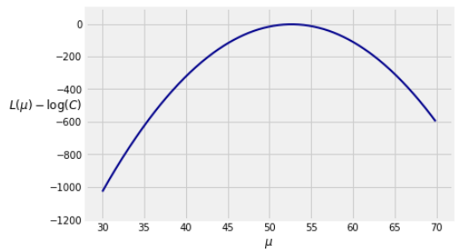
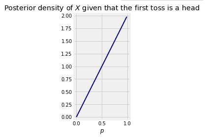

# 二十、估计方法

> 原文：[prob140/textbook/notebooks/ch20](https://nbviewer.jupyter.org/github/prob140/textbook/blob/gh-pages/notebooks/Chapter_20/)
> 
> 译者：[平淡的天](https://github.com/friedhelm739)
> 
> 协议：[CC BY-NC-SA 4.0](http://creativecommons.org/licenses/by-nc-sa/4.0/)
> 
> 自豪地采用[谷歌翻译](https://translate.google.cn/)

```python
# HIDDEN
from datascience import *
from prob140 import *
import numpy as np
import matplotlib.pyplot as plt
plt.style.use('fivethirtyeight')
%matplotlib inline
import math
from scipy import stats
```

在数据 8 中，我们定义了一个参数，它是一个与人口相关联的数字，或者是一个模型中的分布。在迄今为止我们所做的所有推论中，我们假设一个参数是一个固定的数字，可能是未知的。我们已经发展了估计方法，试图捕捉一个未知的固定参数在置信区间基于数据随机抽取人口。

我们将通过推导一个通用的方法来开始这一章，使我们能够得到固定参数的良好估计。本质上，它从参数的所有可能值中寻找，并选择一个使获得所观察样本的机会最大化的值。

但是还有另一种思考未知参数的方法。与其把它们想象成固定的，不如把它们想象成随机的；随机性是由于我们自己对参数的不确定度。例如，如果我们认为某类电子邮件是钓鱼邮件的几率在 70%左右，那么我们可以想象这种几率本身是随机的，取自一个分布，该分布的大部分内容都在 70%左右。

一旦我们收集了关于各种电子邮件消息的数据，以及它们是否是钓鱼的，我们就可以根据这些数据更新我们的想法。我们可以将这个更新的参考表示为在收集数据之后由贝叶斯规则计算的分布。

在这一章中，我们将阐述更新我们对参数的看法的基本术语和方法。然后我们将在这两种方法的结果之间建立联系。

##最大似然估计

假设你有一簇独立同分布样本 $X_1, X_2, \ldots, X_n$ 其中每个$X_i$ 的密度取决于 $\theta$.

假设 $\theta$ 是未知常量. $\theta$ 的最大似然估计的方法是通过解答下列问题得到的：

在参数$theta $的所有可能值中，哪一个最大化了获得样本的相似性？

最大化参数的值称为最大似然估计或简称为 MLE。在本节中，我们将引出一种寻找 MLE 的方法。

让我们看一个例子来说明这个算法的主要思想。假设您知道你的例子是从正态分布$(mu，1)$中抽取的，其中$mu$未知，并且你想去估计$mu$。假设采样值为 52.8、51.1、54.2 和 52.5。

这是一个小样本，但它携带信息。如果你必须在 32 和 52 之间选择值$\mu$，你会选择哪一个？

不需经过任何详细的计算，很明显，32 不是一个好的选择,正态分布$（32，1）$不大可能产生与观察样本中值一样大的值。如果 32 和 52 是$\mu$的唯一的两个选择，那么我们应该选择 52。

当然，$\mu$可以是任何数目。要找到最好的，我们必须去计算。

###基于正态分布$（\mu，\σ^ 2）$样本 $\mu$的 MLE

令$X_1, X_2, \ldots, X_n$ 为独立同分布的正态分布 $(\mu, \sigma^2)$.，样本均值可以很好的估计$mu$。在这个例子中，我们将得知它是$mu$的最大似然估计。

如果我们还想估计$\sigma$呢？我们将在本节结束时解决这个问题。现在，让我们估计$mu$。

####似然函数

似然函数是在观测值处估计的样本的联合密度，被认为是参数的函数。这有点令人困惑，但是我们一旦看到计算它就变得清晰明了。这个例子中的联合密度是$n$的$(\mu, \sigma^2)$密度函数的乘积，因此似然函数是

$$ Lik(\mu) ~ = ~ \prod_{i=1}^n \frac{1}{\sqrt{2\pi}\sigma} \exp \big{(} -\frac{1}{2} \big{(} \frac{X_i - \mu}{\sigma} \big{)}^2 \big{)} $$

当正态分布的平均值为$\mu$时，量$Lik(\mu)$称为数据$X_1, X_2, \ldots, X_n$ 的似然。对于每一个固定的$\mu$，$Lik(\mu)$是样本的函数，因此是一个随机变量。

你将很快会看到用如此奇怪的符号 $Lik$ 的原因。现在请先记下来。

我们的目标是找到使这个似然函数在 $\mu$ 可能的所有可能的值上最大化的 $\mu$ 的值，。我们还不知道这样一个最大化是否有意义，但无论如何我们还是尝试一下。

所以我们需要力所能及的简化这个似然函数。

$$ Lik(\mu) ~ = ~ \big{(} \frac{1}{\sqrt{2\pi}\sigma} \big{)}^n \exp \big{(} -\frac{1}{2\sigma^2}\sum_{i=1}^n (X_i - \mu)^2 \big{)} ~ = ~ C \exp \big{(} -\frac{1}{2\sigma^2}\sum_{i=1}^n (X_i - \mu)^2 \big{)} $$

其中 $C$ 独立于 $\mu$ 所以不会影响最大化。

即使在简化版本，似然函数依旧很难最大化。由于它是个乘积，所以我们可以通过取它的对数来继续简化计算。

####对数似然函数

对数函数不光可以将乘法转化为加法，它还是个增函数。因此使似然函数最大化的 $\mu$ 的值也是使似然函数的对数最大化的 $\mu$ 值。

令 $L$ 为似然函数的对数，也叫做对数似然函数，接下来统称为对数似然函数。因为接下来大部分的篇幅都市围绕对数似然函数，所以我们称其为 $L$ ，并使用 $Lik$ 为对数似然函数。

$$ L(\mu) ~ = ~ \log(C) - \frac{1}{2\sigma^2}\sum_{i=1}^n (X_i - \mu)^2 $$

$L$ 方程比 $Lik$ 更为简化.

因为 $\log(C)$ 并不影响最大化,我们定义了一个函数 $L - \log(C)$ 去计算从正态分布 $(\mu, 1)$ 中抽取的样本点 52.8, 51.1, 54.2, 和 52.5 。基于此样本，本节我们比较 $\mu$ 的估计 32 和 52 .

```python
sample = make_array(52.8, 51.1, 54.2, 52.5)
def shifted_log_lik(mu):
    return (-1/2) * sum((sample - mu)**2)
```

以下是 $\mu$ 在区间 $(30, 70)$的函数图像.

```python
# NO CODE
mu = np.arange(30, 70, 0.1)
l = Table().with_column('Mu', mu).apply(shifted_log_lik, 0)
plt.plot(mu, l, color='darkblue', lw=2 )
plt.xlabel('$\mu$')
plt.ylabel('$L(\mu) - \log(C)$', rotation=0)
plt.ylim(-1200, 100)
```



$\mu$ 的最值看起来非常接近 52.5. 为了精确其值，我们会对 $L$ 求 $\mu$ 的导数并令其为 0.

####对数似然函数的导数

应用链式法则，并且小心负数符号.

$$ \frac{d}{d\mu} L(\mu) ~ = ~ \frac{2}{2\sigma^2} \sum_{i=1}^n (X_i - \mu) $$

####令其值为 0 求解 MLE

统计学上经常使用 "^" 符号去表示估计.所以令 $\hat{\mu}$ 为 $\mu$的 MLE. 且 $\hat{\mu}$ 满足方程:

$$ \sum_{i=1}^n (X_i - \hat{\mu}) ~ = ~ 0 ~~~~~~ \Longleftrightarrow ~~~~~~ \sum_{i=1}^n X_i ~ = ~ n\hat{\mu} ~~~~~~ \Longleftrightarrow ~~~~~~ \hat{\mu} ~ = ~ \frac{1}{n} \sum_{i=1}^n X_i ~ = ~ \bar{X} $$

我们应该检查一下结果代表的是最大值而不是最小值，你可以通过求 $L$ 的二阶导数来证明其确实是最大值。

我们已经看到，$\mu$的 MLE 是样本均值 $\bar{X}$，而无关于 SD $\sigma$。在上图中, $\bar{X} = 52.65$.

```python
# NO CODE
np.mean(sample)
```
52.650000000000006

你现在已经知道了 $\bar{X}$ 的分布是正态的，且均值为 $\mu$ ，方差为$\sigma^2/n$。如果你不知道 $\sigma$, 如果样本量很大，你可以通过样本的 SD 来估计 $\sigma$ 并以此构建 $\mu$的置信区间.

###寻找 MLE 的步骤

让我们在一个算法中写出我们的步骤来找到给定独立同分布样本的参数的极大似然估计。

1.写出样本的似然。我们的目标是找到使这种可能性最大化的参数的值。

2.为了使最大化更容易，采用对数似然函数。

3.为了最大化参数的对数似然，取其参数的导数。

4.将导数设为 0，求出解；

让我们在另一个例子中实现这个算法。

###基于伯努利分布的样本 $(p)$ 的 MLE
令 $X_1, X_2, \ldots, X_n$ 为一个独立同分布伯努利样本 $(p)$ . 我们的目标是找到$p$的 MLE.

随机变量是离散的，所以似然函数定义为样本点的联合概率密度函数，我们通过下面的例子来看看为什么这么做。

假设 $n=5$ 且在 1's 和 0's 的观测序列为 01101. 在$p$ 的似然函数是在 $p$值下的观测到这个序列的机会:

$$ Lik(p) ~ = ~ (1-p)\cdot p \cdot p \cdot (1-p) \cdot p ~ = ~ p^3(1-p)^2 $$

似然依赖于 1's 的数值, 就像二项式概率公式一样. 因为我们在观察序列的每个元素，所以缺少组合项。

现在我们用我们的算法去找 MLE。

步骤 1: 找到似然函数.

令 $X = X_1 + X_2 + \ldots + X_n$ 为样本在 1's 的值. 似然函数为

$$ Lik(p) = p^X (1-p)^{n-X} $$

步骤 2. 找到对数似然函数.

$$ L(p) = X\log(p) + (n-X)\log(1-p) $$

步骤 3. 找到对数似然函数的导数.

$$ \frac{d}{dp} L(p) = \frac{X}{p} - \frac{n-X}{1-p} $$

Step 4. 令其为 0 求解 MLE.

$$ \frac{X}{\hat{p}} - \frac{n-X}{1-\hat{p}} = 0 $$

因此

$$ (1-\hat{p})X = (n-X)\hat{p} ~~~~~ \text{so} ~~~~~ X = n\hat{p} $$

所以$p$ 的 MLE 为：

$$ \hat{p} = \frac{X}{n} = \frac{1}{n}\sum_{i=1}^n X_i $$

所以 $p$ 的 MLE 是 1's 的样本比例.为了计算出这个估计，你需要样本 1's 中的数值. 你不需要看到 0's 和 1's 的所有样本.

因为 MLE $\hat{p}$ 是样本比例, 它是无偏的, 且 SD $\sqrt{p(1-p)/n}$, 是渐进正态的. 当 $n$ 很大你可以基于样本估计 SD 且确定 $p$的置信区间.

### MLE 的性质

在以上的两个例子中,  MLE 是无偏的且是完全正态或渐进正态的.通常来说, MLEs 不必无偏, 正如你将要看到的一个例子. 然而, 在某些概率分布或密度函数的正则性条件下，当样本较大时:

1.一致的，也就是说，可能接近参数

2.大致正态且几乎无偏

这一点超出了本课的范围，但是在练习中，你将通过仿真来观察这些属性。

虽然 MLE 的渐近方差理论很完美，但在实际应用中，很难用解析方法估计方差。这使得很难找到置信区间的公式。然而，您可以使用引导来估计方差：每个引导样本产生 MLE 的值，并且可以基于引导的 MLE 的经验分布来构造置信区间。

###基于正态分布 $(\mu, \sigma^2)$ 样本 $\mu$ 和 $\sigma$ 的 MLE

令 $X_1, X_2, \ldots, X_n$ 为一个独立同分布正态 $(\mu, \sigma^2)$ 样本.我们要找到 $\mu$ 和 $\sigma$的 MLE.

####似然函数

我们需要考虑包含 $\mu$ 和 $\sigma$的方程:

$$ Lik(\mu, \sigma) ~ = ~ \prod_{i=1}^n \frac{1}{\sqrt{2\pi}\sigma} \exp \big{(} -\frac{1}{2} \big{(} \frac{X_i - \mu}{\sigma} \big{)}^2 \big{)} ~ = ~ C \cdot \frac{1}{\sigma^n} \prod_{i=1}^n \exp \big{(} -\frac{1}{2\sigma^2} (X_i - \mu)^2 \big{)} $$

其中 $C = 1/(\sqrt{2\pi})^n$ 不影响最大化.

####对数似然函数
$$ L(\mu, \sigma) ~ = ~ \log(C) - n\log(\sigma) - \frac{1}{2\sigma^2}\sum_{i=1}^n (X_i - \mu)^2 $$

####最大化对数似然函数
我们通过两步来最大化 $L$ :

1.首先固定 $\sigma$ 根据 $\mu$最大化.

2.最后插入最大化时的 $\mu$值然后根据 $\sigma$最大化.

我们已经在本节的第一个例题完成了第一步. 对于每个固定的 $\sigma$, 最大化值的 $\mu$ 为 $\hat{\mu} = \bar{X}$.

所以我们的任务是寻找最大化新方程的 $\hat{\sigma}$ 值

$$ L^*(\sigma) ~ = ~ -n\log(\sigma) - \frac{1}{2\sigma^2}\sum_{i=1}^n (X_i - \bar{X})^2 ~ = ~ -n\log(\sigma) - \frac{1}{2\sigma^2} V $$

其中 $V = \sum_{i=1}^n (X_i - \bar{X})^2$ 独立于 $\sigma$. 对 $\sigma$ 求微分;持续跟中减号和 2 的因子.

$$ \frac{d}{d\sigma} L^*(\sigma) ~ = ~ -\frac{n}{\sigma} + \frac{1}{\sigma^3}V $$

S 令其为 0 然后解出最大化值 $\hat{\sigma}$.

$$ -\frac{n}{\hat{\sigma}} + \frac{1}{\hat{\sigma}^3}V ~ = ~ 0 ~~~~~~~ \Longleftrightarrow ~~~~~~~ \hat{\sigma}^2 ~ = ~ \frac{V}{n} ~ = ~ \frac{1}{n} \sum_{i=1}^n (X_i - \bar{X})^2 $$

你需要再次检查这个结果是最大值，而不是最小值，但是再次给出答案，你肯定会接受它是最大值。

你已经在练习中看到$\hat{\sigma}^2$不是$\sigma^2$的无偏估计。你还表明，当$n$很大时，它接近于无偏。

为了总结我们的结果，如果 $X_1, X_2, \ldots , X_n$是独立同分布正态 $(\mu, \sigma^2)$样本，那么 of $\mu$ 和 $\sigma$的 MLEs 为：

$\hat{\mu} = \bar{X}$
$\hat{\sigma} = \sqrt{\hat{\sigma}^2}$ 其中 $\hat{\sigma}^2 = \frac{1}{n} \sum_{i=1}^n (X_i - \bar{X})^2$

关于独立同分布正态样本的一个显著事实是，$\hat{\mu}$ 和 $\hat{\sigma}^2$是彼此独立的，即使它们是从同一样本计算的统计数据。在本课程后面，你会看到原因。

计算注释：MLE 不能总是像我们的例子一样容易解析。重要的是要记住，如果没有数值优化方法，最大化对数似然函数往往是难以处理的。而且，并非所有似然函数都有唯一极大值。

##先验与后验

你习惯于把硬币投掷认为对于固定的 $(p)$ 为一系列独立同分布伯努利 $(p)$。在较早的一节中，我们成功的证明了样本比例$\hat{p}$是固定但未知的 $(p)$的最大似然估计。

相反，假设我们认为 $(p)$ 是从单位区间上的随机抽取的结果。也就是说，我们假设硬币正面朝上的概率是一个随机变量$X$，其密度$f_X$ 为 $(0, 1)$。这被称为$X$的先验密度。

先验密度反映了在看到数据之前我们对未知参数的看法。例如，如果我们不知道正面朝上的可能性是什么，我们可以使用均匀分布 (0, 1)为$X$的先验。如果出于某种原因，我们碰巧认为正面朝上的概率大约在 70%左右，那么我们可能使用 beta (7,3)为$X$的先验，因为正面朝上的先验期望是$E(X) = 7/(7+3) = 0.7$。或者我们可以使用一些其他的 beta$（r，s）$先验，使得$r/（r+s）$大约为 0.7，并且事前密度的形状反映了我们对于正面朝上分布在 70%左右的想法。

现在，假设您根据先验密度密度$f_X$选择$X$一个值$p$，并且反复抛出具有$p$正面朝上的概率的硬币。然后，假设$x= p$，在$$$抛掷中的正面朝上的的分布是二项式$（n，p）$。

在我们进一步之前，让我们仔细地看一下“$x= p$”这个等式。因为$X$具有密度，所以$X$等于任何指定值的机会是 0，所以我们必须清楚我们所说的“X=p$”是什么意思。

###连续变量条件

让我们来进行一个关于连续变量的条件的一般性讨论。我们的观察将在我们讲述条件密度的之前章节中并行讨论。

假设 $X$ 是随机变量, $A$ 是依赖于 $X$的事件.

如果$X$ 是离散随机变量, 那么对任何有可能的$X$ 的 $x$值 $P(A \mid X = x)$ 可以通过除法得到很清晰的定义:

$$ P(A \mid X = x) ~ = ~ \frac{P(A, X = x)}{P(X = x)} $$

当 $X$ 时连续的, 分母为 0.在这种情况下需要记住:

无论无限小的间隔 $dx$  在哪，$P(A \mid X \in dx)$ 基本上是常数.这个常量将表示为 $P(A \mid X = x)$.

所以对于连续的 $X$, 我们定义

$$ P(A \mid X = x) ~ = ~ P(A \mid X \in dx) ~ \sim ~ \frac{P(A, X \in dx)}{P(X \in dx)} $$

我们假设 $dx$ 到 0 的右边极限存在，且不完全取决于$dx$是怎样定义的: 在 $x$附近,或在$x$的左面,或右面等等. 在这种规律条件下是正确的. 你可以假设他是有效的.

###后验密度

令$X$ 在单位区间和$f_X$概率密度函数下有值. 令 $H$ 为 $n$ 在 $X$ 的正面朝上的概率下正面朝上的数量.也就是说,对于每个 $x$ 假设给定 $H$ 的条件分布 $X=p$ 为二项分布 $(n, p)$.

注意随机化:我们从 $X$中选取 $p$ , 随后投掷 $p$概率的硬币 $n$ 次. 我们不是为了每次抛硬币而重新挑选硬币.

给定参数后 $H$ 似然为

$$ Lik(p) ~ = ~ {n \choose k} p^H (1-p)^{n-H} $$

给定 $H=k$, 那么 $X$是什么? 给定 $H=k$，答案被表示为 $X$的后验密度. 使用贝叶斯公式来计算:

$$ f_{X \vert H=k} (p)dp ~ \sim ~ \frac{P(X \in dp, H = k)}{P(H=k)} ~ \sim ~ \frac{f_X(p)dp \cdot P(H = k \mid X = p)}{P(H = k)} $$

分母并不包含 $p$. 这是常数的一部分，使后验密度整合到 1。因此，后密度与分子成比例：

$$ f_{X \vert H=k} (p) ~ \propto ~ f_X(p) \cdot P(H = k \mid X = p) $$

正如我们在前面的离散例题中看到的，后验跟先验的似然是正比的。

有时，为了识别 $X$的后验分布，我们需要观察。下面是一个例子。

###基于$(0, 1)$ 均匀先验的后验分布

假设我们对硬币一无所知，因此给定 $X$  (0, 1) 均匀先验. 随后令 $H = k$, 则 $X$ 的后验密度为

$$ f_{X \vert H=k} (p) ~ \propto ~ 1 \cdot p^k(1-p)^{n-k} $$

${n \choose k}$ 的因子并不包含 $p$ 并且已被划入常数比例.

记住 $X$ 的可能取值都是在单位区间. 你能看出 $X$ 的后验密度是什么吗?

对: 是  $(k+1, n-k+1)$ beta 密度. 方程的形式是被 $p^k(1-p)^{n-k}$ 决定的, 其中 $n$ 和 $k$ 可从数据中得知且 $p$ 是变量的值.

我们来看看从 beta 密度中能得到什么.

给定数据集, 我们希望 $X$ 是什么? 是 $E(X \mid H = k)$, 对,就是给定数据 $H=k$ 后$X$ 的 beta $(k+1, n-k+1)$ 后验密度的期望. 通过 beta 密度的定理可得

$$ E(X \mid H=k) ~ = ~ \frac{k+1}{n+2} $$

对于大的 $n$ 来说，它相当接近观察到的$k/n$ 的比例，但不完全相同。

###MAP 估计: 后验模式

 $X$ 的后验分布反映了我们对数据的 $X$ 的新看法。如果我们坚持认为我们对正面朝上概率的估计必须是数字而不是分布，那么我们可以采用上面的后验平均值。或者我们可以用另一个问题的答案：

给定数据， $X$ 最有可能是什么？更确切地说，给定 $H=k$的数据， $X$ 的后验分布的模式是什么？

答案是 beta $（k＋1，n+k+ 1）$密度的模式。这被称为正面朝上后验概率的最大后验概率（MAP）估计。

beta  $(r, s)$ 密度的模式很容易找到微积分。当 $r$ 和 $s$ 都大于 1，模式是$(r-1)/(r+s-2)$。

因此，如果 $1 \le k \le n-1$ （即，除了极端情况$k=0$和$k=n$），则给定 $H=k$ 的后验分布 $X$ 的模式是

$$ \frac{(k+1) - 1}{(n+2) - 2} ~ = ~ \frac{k}{n} $$

这是观察到的正面朝上的比例.

在 $k = 0$的情况下，后验模式为 0，这也是观察到的正面朝上比例。在 $k = n$的情况下，后验模式为 1，也是观察到的正面朝上比例。

###MLE 和 MAP

我们刚刚得知，如果在可能值（0，1）的区间上均匀地选择正面朝上的机会，那么 MAP 估计与我们假设正面朝上的固定概率而获得的 MLE 相同。

让我们来看看为什么这是有对的。当先验一致时，后验密度为

$$ f_{X \vert H=k} (p) ~ \propto ~ 1 \cdot p^k(1-p)^{n-k} $$

右边正好是 $k$ 个正面朝上在$p$概率硬币抛掷的可能性。因此，找到后验分布的模式等价于找到最大化似然的 $p$ 。这正是我们发现正面朝上机会的最大似然估计时所做的。

这种等价性依赖于均匀先验密度是常数。如果我们在(0, 1)上使用其他的先验密度，那么后验模式可能与正面朝上的比例不同。在下一章中，我们将发现 $X$ 的后验密度可以从任何 beta 先验开始。这是一个流行的聚类模型的基础，你可以在网上检索。

##独立性，重新审视

在这一节中，我们将看到，当参数随机化时，独立性会发生什么。首先，让我们复习一些基本知识。

###平均条件概率

令 $X$ 的密度诶 $f_X$ 且令 $A$ 为事件. 则

$$ P(A, X \in dx) ~ = ~ P(X \in dx)P(A \mid X = x) ~ \sim ~ f_X(x)dxP(A \mid X = x) $$

于是

$$ P(A) ~ = ~ \int_{\text{all x}} P(A, X \in dx) ~ = ~ \int_{\text{all x}} P(A \mid X = x)f_X(x)dx $$

也可写做$P(A) = E(P(A \mid X))$. 这是通过条件寻找期望的一个例子.

###硬币的一次投掷

令 $X$ 的密度在单位区间 $(0, 1)$上.  $X$ 的值为硬币正面朝上的概率. 投掷一次硬币. 再次重申 "给定 $X=p$" 的定义意味着

$$ P(\text{coin lands heads} \mid X = p) = p $$

令 $X$ 密度为 $f_X$. 随后

$$ P(\text{coin lands heads}) ~ = ~ \int_0^1 p \cdot f_X(p)dp ~ = ~ E(X) $$

因此如果 $X$ 是在 $(0, 1)$上均匀的, 则硬币正面朝上概率为 $1/2$. 如果 $X$ 为 beta $(r, s)$ 分布，那么硬币正面朝上概率为 $r/(r+s)$.

###硬币的二次投掷

令 $X$ 在 $(0, 1)$均匀分布. 给定 $X = p$, 投掷 $p$概率的硬币两次 并观测结果.

我们观测到 $P(\text{first toss is a head}) = 1/2$. 第一次投掷看起来像是 55 开的硬币. 同样的计算证明第二次投掷的概率(基于第一次投掷的经验)同样是 $1/2$.

现在我们计算出两次正面朝上的概率. 我们知道 $P(\text{both tosses are heads} \mid X = p) = p^2$. 所以

$$ P(\text{两次投掷正面朝上}) ~ = ~ \int_0^1 p^2 \cdot 1dp ~ = ~ \frac{1}{3} $$

它大于 $1/4$ ，可是两次投掷的硬币都是 55 开的. 结果表明两次投掷并不是独立的.

让我们来看看原因. 我们知道

$$ \begin{align*} P(\text{both tosses are heads}) ~ &= ~ P(\text{first toss is a head}) P(\text{second toss is a head} \mid \text{first toss is a head}) \\ &= ~ \frac{1}{2} P(\text{second toss is a head} \mid \text{first toss is a head}) \end{align*} $$

因此

$$ P(\text{second toss is a head} \mid \text{first toss is a head}) ~ = ~ \frac{2}{3} ~ > ~ \frac{1}{2} $$

很明显, 知道第一次正面朝上呼我们已经知道了 $X$的一些经验, 这就告诉了第二次投掷还是正面朝上的概率.

为了量化这个想法，因为第一次抛掷是正面朝上，所以我们会发现 $X$ 的后验密度。令$A$ 成为第一次正面朝上的事件。该事件的后验密度与 $A$的先验成正比。因此可以计算为

$$ f_{X \vert A} (x) ~ \propto ~ 1 \cdot p $$

在给定第一次正面朝上的情况下 $X$ 的后验密度并不均匀.它线性增长并趋近于 1.

这表明: 给定第一次投掷为正面朝上, 我们更倾向于相信硬币是正面朝上而不是朝下。

积分的常数很容易找到. 第一次投掷为正面朝上的后验密度为 $f_{X \vert A} (p) = 2p$ 其中 $p \in (0, 1)$

```python
# NO CODE
plt.axes().set_aspect('equal')
p = np.arange(0, 1, 0.01)
plt.plot(p, 2*p, color='darkblue', lw=2)
plt.xlim(-0.05, 1.05)
plt.ylim(-0.05, 2.05)
plt.xlabel('$p$')
plt.title('Posterior density of $X$ given that the first toss is a head')
```



为了仔细检查我们先前的计算，我们可以使用后验密度的方法来计算 $P(\text{second toss is a head} \mid \text{first toss is a head})$ 。

$$ \begin{align*} P(\text{第二次为正} \mid \text{第一次为正}) ~ &= ~ \int_0^1 p \cdot 2p \cdot dp \\ &= ~ \frac{2}{3} \end{align*} $$

这与我们先前的计算是一致的。