# 三、随机变量

> 原文：[prob140/textbook/notebooks/ch03](https://nbviewer.jupyter.org/github/prob140/textbook/blob/gh-pages/notebooks/Chapter_03/)
> 
> 译者：[飞龙](https://github.com/wizardforcel)
> 
> 协议：[CC BY-NC-SA 4.0](http://creativecommons.org/licenses/by-nc-sa/4.0/)
> 
> 自豪地采用[谷歌翻译](https://translate.google.cn/)

许多数据科学涉及数值变量，它的观察值取决于几率。其他值提供的变量的预测值，随机样本中观察到的不同类别个体的数量，以及自举样本的中值，仅仅是几个例子。 你在 Data8 中看到了更多例子。

在概率论中，随机变量是在结果空间上定义的数值函数。 也就是说，函数的定义域是`Ω`，它的值域是实数行。 随机变量通常用靠后的字母表示，如`X`和`Y`。

## 结果空间上的函数

随机抽样可以看做重复的随机试验，因此许多结果空间由序列组成。代表硬币投掷两次的结果空间是：

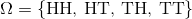

如果你投掷 10 次，结果空间将包含 10 个元素的 2^10 个序列，其中每个元素是`H`或`T`。手动列出结果比较痛苦，但计算机善于为我们避免这种痛苦。

### 乘积空间

两个集合`A`和`B`的乘积是所有偶对`(a, b)`的集合，其中`a ∈ A`和`b ∈ B`。 这个概念正是我们需要的，用于描述代表多个试验的空间。

例如，表示一枚硬币投掷结果的空间是 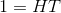。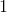 与其本身的乘积是偶对的集合`(H, H), (H, T), (T, H), (T, T)`，你可以认出这是硬币投掷的结果。 这个新空间和  的乘积是代表三次投掷的空间，以此类推。

Python 模块`itertools`包含构造乘积空间的函数`product`。 让我们导入它。

```py
from itertools import product
```

要了解`product`是如何工作的，我们将从投掷硬币的结果开始。我们正在使用`make_array`创建一个数组，但你可以使用任何其他方式创建数组或列表。

```py
one_toss = make_array('H', 'T')
```

为了使用`product`，我们必须指定基本空间和重复次数，然后将结果转换为列表。

```py
two_tosses = list(product(one_toss, repeat=2))
two_tosses

# [('H', 'H'), ('H', 'T'), ('T', 'H'), ('T', 'T')]
```

对于三次投掷，只需改变重复次数：

```py
three_tosses = list(product(one_toss, repeat=3))
three_tosses
'''
[('H', 'H', 'H'),
 ('H', 'H', 'T'),
 ('H', 'T', 'H'),
 ('H', 'T', 'T'),
 ('T', 'H', 'H'),
 ('T', 'H', 'T'),
 ('T', 'T', 'H'),
 ('T', 'T', 'T')]
'''
```

概率空间是结果空间，带有所有结果的概率。 如果假设三次投掷的八次结果是等可能的，则概率均为 1/8：

```py
three_toss_probs = (1/8)*np.ones(8)
```

相应的概率空间：

```py
three_toss_space = Table().with_columns(
    'omega', three_tosses,
    'P(omega)', three_toss_probs
)
three_toss_space
```


| omega | P(omega) |
| --- | --- |
| `['H' 'H' 'H']` | 0.125 |
| `['H' 'H' 'T']` | 0.125 |
| `['H' 'T' 'H']` | 0.125 |
| `['H' 'T' 'T']` | 0.125 |
| `['T' 'H' 'H']` | 0.125 |
| `['T' 'H' 'T']` | 0.125 |
| `['T' 'T' 'H']` | 0.125 |
| `['T' 'T' 'T']` | 0.125 |

乘积空间增长得非常快。 如果你投掷 5 次，将会有近 8000 种可能的结果：

```py
6**5
# 7776
```

但是我们有`product`，所以我们仍然可以列出所有乘积！ 这是一个表示 5 次骰子投掷的概率空间。

```py
die = np.arange(1, 7, 1)

five_rolls = list(product(die, repeat=5))  # All possible results of 5 rolls

five_roll_probs = (1/6**5)**np.ones(6**5)  # Each result has chance 1/6**5

five_roll_space = Table().with_columns(
   'omega', five_rolls,
    'P(omega)', five_roll_probs
)

five_roll_space
```

| omega | P(omega) |
| --- | --- |
| `[1 1 1 1 1]` | 0.000128601 |
| `[1 1 1 1 2]` | 0.000128601 |
| `[1 1 1 1 3]` | 0.000128601 |
| `[1 1 1 1 4]` | 0.000128601 |
| `[1 1 1 1 5]` | 0.000128601 |
| `[1 1 1 1 6]` | 0.000128601 |
| `[1 1 1 2 1]` | 0.000128601 |
| `[1 1 1 2 2]` | 0.000128601 |
| `[1 1 1 2 3]` | 0.000128601 |
| `[1 1 1 2 4]` | 0.000128601 |

... (7766 rows omitted)

### 结果空间上的函数

假设你投掷一个骰子五次，并将你看到的点数加起来。如果这看起来不清楚，请耐心等待一会儿，你很快就会明白为什么它很有趣。

点数的总和是五个点数的结果空间`Ω`上的数值函数。 总和是一个随机变量。我们称它为`S`。然后，在形式上，

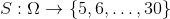

`S`的范围是 5 到 30 的整数，因为每个骰子至少有一个点，最多六个点。 我们也可以使用相同的符号：

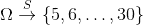

从计算的角度来看，`Ω`的元素位于`five_roll_space`的`omega`列中。让我们应用这个函数并创建一个更大的表格。

```py
five_rolls_sum = Table().with_columns(
    'omega', five_rolls,
    'S(omega)', five_roll_space.apply(sum, 'omega'),
    'P(omega)', five_roll_probs
)
five_rolls_sum
```

| omega | S(omega) | P(omega) |
| --- | --- | --- |
| `[1 1 1 1 1]` | 5 | 0.000128601 |
| `[1 1 1 1 2]` | 6 | 0.000128601 |
| `[1 1 1 1 3]` | 7 | 0.000128601 |
| `[1 1 1 1 4]` | 8 | 0.000128601 |
| `[1 1 1 1 5]` | 9 | 0.000128601 |
| `[1 1 1 1 6]` | 10 | 0.000128601 |
| `[1 1 1 2 1]` | 6 | 0.000128601 |
| `[1 1 1 2 2]` | 7 | 0.000128601 |
| `[1 1 1 2 3]` | 8 | 0.000128601 |
| `[1 1 1 2 4]` | 9 | 0.000128601 |

... (7766 rows omitted)

我们现在有五次投掷的所有可能的结果，以及它的总点数。你可以看到表格的第一行显示了尽可能少的点数，对应于所有投掷都显示 1 点。 第 7776 行显示了最大的：

```py
five_rolls_sum.take(7775)
```


| omega | S(omega) | P(omega) |
| --- | --- | --- |
| `[6 6 6 6 6]` | 30 | 0.000128601 |

`S`的所有其他值都在这两个极端之间。

#### 随机变量的函数

随机变量是`Ω`上的数值函数。 因此，通过复合，随机变量的数值函数也是随机变量。

例如， 是一个随机变量，计算如下：

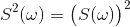

所以 ![S^2(\text{[6 6 6 6 6]}) = 30^2 = 900](img/tex-f2843560c3c8b7b6354a8ebb862b6f23.gif)。

### 由`S`确定的事件

从表`five_rolls_sum`中，很难判断有多少行显示 6 或 10 或其他任何值。 为了更好地理解`S`的属性，我们必须组织`five_rolls_sum`中的信息。

对于`S`中的任何子集`A`，定义事件`{S∈A}`为：

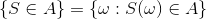

在特殊情况下尝试这个定义。令`A = {5,30}`。 然后`{S∈A}`，当且仅当所有点数都是 1 点或 6 点。 所以：

![\{S \in A\} = \{\text{[1 1 1 1 1], [6 6 6 6 6]}\}](img/tex-84e17d83407719152ae5ea9a53997143.gif)

询问总和是否为某个特定值的几率是很自然的，例如 10。读取表格并不容易，但我们可以访问相应的行：

```py
five_rolls_sum.where('S(omega)', are.equal_to(10))
```

... (116 rows omitted)

`S(ω)=10`的`ω`有 126 个值。由于所有的`ω`都相同，因此`S`的值为 10 的几率是 126/7776。

非正式情况下，我们通常会用符号表示，写成`{S = 10}`而不是`{S∈{10}}`。

## 分布

我们的空间是骰子的五次投掷的结果，而我们的随机变量`S`是五次投掷的点数总数。

```py
five_rolls_sum
```

| omega | S(omega) | P(omega) |
| --- | --- | --- |
| `[1 1 1 1 1]` | 5 | 0.000128601 |
| `[1 1 1 1 2]` | 6 | 0.000128601 |
| `[1 1 1 1 3]` | 7 | 0.000128601 |
| `[1 1 1 1 4]` | 8 | 0.000128601 |
| `[1 1 1 1 5]` | 9 | 0.000128601 |
| `[1 1 1 1 6]` | 10 | 0.000128601 |
| `[1 1 1 2 1]` | 6 | 0.000128601 |
| `[1 1 1 2 2]` | 7 | 0.000128601 |
| `[1 1 1 2 3]` | 8 | 0.000128601 |
| `[1 1 1 2 4]` | 9 | 0.000128601 |

... (7766 rows omitted)


在最后一节中，我们找到了`P(S = 10)`。我们可以使用相同的过程，为每个可能的`s`值查找`P(S = s)`。`group`方法允许我们在同一时间为所有`s`这样做。

为此，我们首先丢掉`omega`列。 然后，我们将按`S(omega)`的不同值对表格进行分组，并使用`sum`来将每组中的所有概率相加。

```py
dist_S = five_rolls_sum.drop('omega').group('S(omega)', sum)
dist_S
```

| S(omega) | P(omega) sum |
| --- | --- |
| 5 | 0.000128601 |
| 6 | 0.000643004 |
| 7 | 0.00192901 |
| 8 | 0.00450103 |
| 9 | 0.00900206 |
| 10 | 0.0162037 |
| 11 | 0.0263632 |
| 12 | 0.0392233 |
| 13 | 0.0540123 |
| 14 | 0.0694444 |

... (16 rows omitted)

该表格显示了所有可能的`S`值及其所有概率。它被称为`S`的概率分布表。

表中的内容 - 随机变量的所有可能值及其所有概率 - 称为`S`的概率分布，或者简称为`S`的分布。该分布显示了 100% 的总概率如何分布在`S`的所有可能值上。

让我们来检查一下，以确保结果空间中的所有`ω`都已经在概率一列中得到了解释。

```py
dist_S.column(1).sum()

# 0.99999999999999911
```

它在计算环境中是 1。这是任何概率分布的一个特征：

分布的概率是非负的，总和为 1。

### 展示分布

在 Data8 中，你使用`datascience`库来处理数据分布。`prob140`库建立在它上面，为处理概率分布和事件提供了一些便利的工具。

首先，我们将构造一个概率分布对象，虽然它看起来非常像上面的表格，但它的第二列中预计会有概率分布，并且如果它发现了其他任何东西，就会报错。

为了使代码易于阅读，让我们以数组的形式分别提取可能的值和概率：

```py
s = dist_S.column(0)
p_s = dist_S.column(1)
```

要将这些转换为概率分布对象，请从空表开始，然后使用表的`values`和`probability`方法。`values`的参数是可能值的列表或数组，而`probability`的参数是相应概率的列表或数组。

```py
dist_S = Table().values(s).probability(p_s)
dist_S
```

| Value | Probability |
| --- | --- |
| 5 | 0.000128601 |
| 6 | 0.000643004 |
| 7 | 0.00192901 |
| 8 | 0.00450103 |
| 9 | 0.00900206 |
| 10 | 0.0162037 |
| 11 | 0.0263632 |
| 12 | 0.0392233 |
| 13 | 0.0540123 |
| 14 | 0.0694444 |

... (16 rows omitted)

除了列标签更具可读性之外，这看起来与我们之前的表完全相同。但是这是好处：在直方图中展示分布，只需使用`prob140`的`Plot`方法，如下。

```py
Plot(dist_S)
```

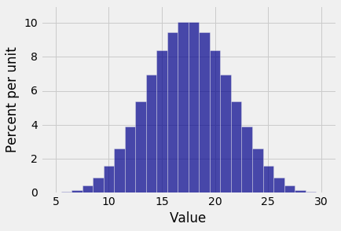

### `Plot`的注解

+   回想一下，`datascience`库中的`hist`显示原始数据的直方图，包含在表格的列中。`prob140`库中的`Plot`显示概率直方图，基于概率分布作为输入。

+   `Plot`仅适用于概率分布对象，使用`values`和`probability`方法创建的。 它不适用于`Table`类的普通成员。

+   `Plot`适用于具有整数值的随机变量。 你将在接下来的几章中遇到的许多随机变量是整数值。 为了展示其他随机变量的分布，分箱决策更加复杂。

### `S`的分布的注解

在这里，五次投掷的点数总和的分布曲线出现了钟形。 注意这个直方图和你在 Data 8 中看到的钟形分布之间的差异。

这个显示确切的分布。它是根据实验的所有可能结果进行计算的。这不是一个近似值也不是一个经验直方图。

Data8 中的中心极限定理的表述表明，大型随机样本总和的分布大致是正态的。但是在这里你看到的只是五次投掷的总和呈现钟形分布。如果你从均匀的分布开始（这是单次投掷的分布），那么在总和的概率分布变成正态之前，你不需要大型样本。

### 展示事件的概率

从 Data8 中可知，钟形曲线拐点之间的区间约占曲线面积的 68%。 虽然上面的直方图并不完全是一个钟形曲线 - 它是一个只有 26 个条形的离散直方图 - 但它非常接近。 拐点似乎大约是 14 和 21。

`Plot`的`event `参数可让你可视化事件的概率，如下所示。

```py
Plot(dist_S, event = np.arange(14, 22, 1))
```

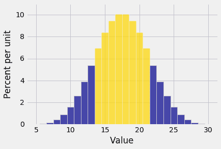

金色区域是`P(14 <= S <= 21)`。

`prob_event`方法操作概率分布对象，来返回事件的概率。为了找到`P(14 <= S <= 21)`，请按如下所示使用它。

```py
dist_S.prob_event(np.arange(14, 22, 1))

# 0.6959876543209863
```

几率是 69.6%，离 68% 并不远。

### 数学和代码的对应

`P(14 <= S <= 21)`可以通过将事件划分为 14 到 21 范围内的事件`{S = s}`的并集，然后使用加法规则来找到。

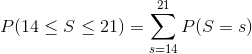

请小心使用小写字母`s`作为通用可能值，与大写字母`S`作为随机变量相对应；不这样做会使公式含义非常混乱。

这意味着：

首先为 14 到 21 范围内的每个`s`值抽取事件`{S = s}`：

```py
event_table = dist_S.where(0, are.between(14, 22))
event_table
```

| Value | Probability |
| --- | --- |
| 14 | 0.0694444 |
| 15 | 0.0837191 |
| 16 | 0.0945216 |
| 17 | 0.100309 |
| 18 | 0.100309 |
| 19 | 0.0945216 |
| 20 | 0.0837191 |
| 21 | 0.0694444 |

然后将所有这些事件的概率相加。

```py
event_table.column('Probability').sum()

# 0.6959876543209863
```

`prob_event`方法一步完成所有这些。 在这里再次进行比较。

```py
dist_S.prob_event(np.arange(14, 22, 1))

# 0.6959876543209863
```

你可以通过各种方式，使用相同的基本方法来查找由`S`确定的任何事件的概率。这里有两个例子。

示例 1：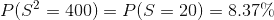

示例 2：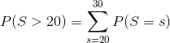

一个查找数值的简便方法：

```py
dist_S.prob_event(np.arange(20, 31, 1))
# 0.30516975308642047
```

示例 3：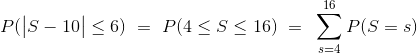

```py
dist_S.prob_event(np.arange(4, 17, 1))
# 0.39969135802469169
```

## 相等性

我们知道两个数字相等意味着什么。 然而，随机变量的相等可能不止一种。

### 相同

如果相同结果空间上定义的两个随机变量`X`和`Y`的值，对于空间中的每个结果都是相同的，那么它们是相同的。符号`X = Y`意味着 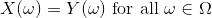。非正式来说，无论结果如何， 如果`X`是 10，那么`Y`也必须是 10；如果`X`是 11，`Y`必须是 11，依此类推。

一个例子会把它说清楚。 假设 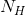 是三次硬币投掷的正面数量，并且 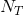 是相同的三次投掷的背面数量。 那么两个随机变量  和 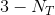 是相等的。 对于三次投掷的每一种可能结果， 的值等于  的值。

我们简单地写成 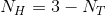。

### 同分布

如上所述， 和  不相等。例如，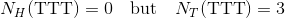。

然而，有一种感觉是，正面数量与背面数量“以相同的方式出现”。两个随机变量具有相同的概率分布。

结果空间是`three_tosses`：

```py
coin = make_array('H', 'T')
three_tosses = list(product(coin, repeat=3))
three_tosses
'''
[('H', 'H', 'H'),
 ('H', 'H', 'T'),
 ('H', 'T', 'H'),
 ('H', 'T', 'T'),
 ('T', 'H', 'H'),
 ('T', 'H', 'T'),
 ('T', 'T', 'H'),
 ('T', 'T', 'T')]
'''
```

只有 8 个结果，因此很容易检查上表并写出  和  的分布。它们都取值为 0, 1, 2 和 3，概率分别为 1/8，3/8，3/8 和 1/8。该分布如下表所示。

```py
dist = Table().values(np.arange(4)).probability(make_array(1, 3, 3, 1)/8)
dist
```

| Value | Probability |
| --- | --- |
| 0 | 0.125 |
| 1 | 0.375 |
| 2 | 0.375 |
| 3 | 0.125 |

我们说  和  是同分布的。

一般而言，如果两个随机变量具有相同的概率分布，则它们是同分布的。 这表示为 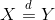。

### 相等性之间的关系

相同比同分布更强。如果两个随机变量在结果层面上相同，那么它们必须具有相同的分布，因为它们在结果空间上是相同的函数。

也就是说，对于任意两个随机变量`X`和`Y`，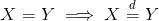。

但三次投掷的正面和反面的例子表明，反面不一定是正确的。

### 示例：来自小牌组的两张牌

一个牌组包含 10 张牌，分别标记为`1,2,2,3,3,3,4,4,4,4`。两张牌是不放回随机发放的。让 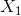 为第一张卡上的标记， 为第二张卡上的标记。

问题 1。 和  是否相同？

答案是否定的，因为结果可能是 31，在这种情况下 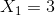 和 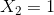。

问题 2。 和  是否同分布？

回答 2。让我们找到两个分布并进行比较。显然，每种情况下可能的值是 1,2,3 和 4。 的分布很简单：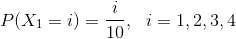。当分布由这样的公式定义时，你可以定义一个函数来表示公式所说的内容：

```py
def prob1(i):
    return i/10
```

然后，你可以像之前一样，使用`value`创建一个概率分布对象，但现在使用`probability_function`，它将函数的名称作为其参数：

```py
possible_i = np.arange(1, 5, 1)
dist_X1 = Table().values(possible_i).probability_function(prob1)
dist_X1
```

| Value | Probability |
| --- | --- |
| 1 | 0.1 |
| 2 | 0.2 |
| 3 | 0.3 |
| 4 | 0.4 |

相信下面的函数`prob2`会为每个`i`返回`P(X_2 = i)`。事件已根据  的值进行划分。

```py
def prob2(i):
    if i == 1:
        return (9/10)*(1/9)
    else:
        return (i/10)*((i-1)/9) + ((10-i)/10)*(i/9)
```

```py
dist_X2 = Table().values(possible_i).probability_function(prob2)
dist_X2
```

| Value | Probability |
| --- | --- |
| 1 | 0.1 |
| 2 | 0.2 |
| 3 | 0.3 |
| 4 | 0.4 |

这两个分布是相同的！这是另一个不放回抽样的对称性的例子。 结论是 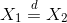。
