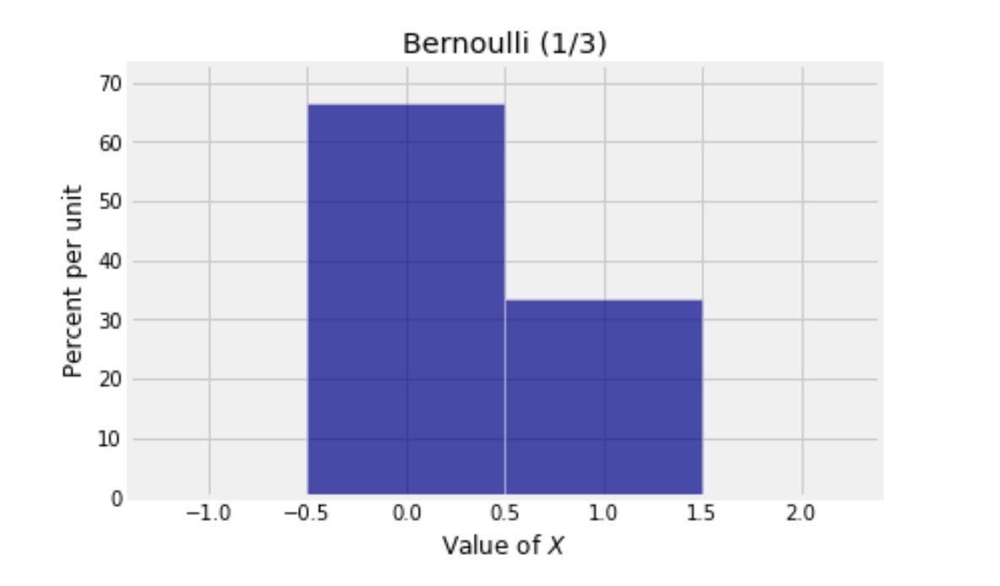
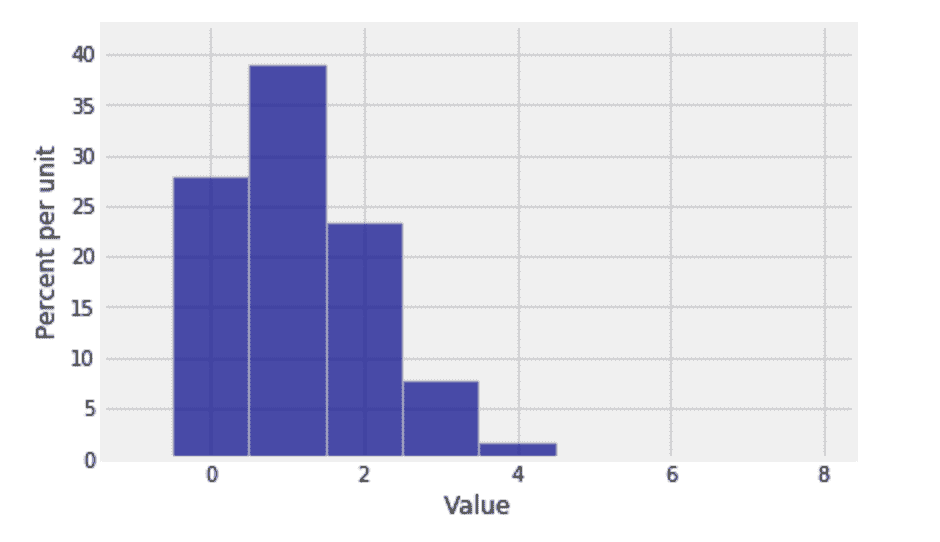
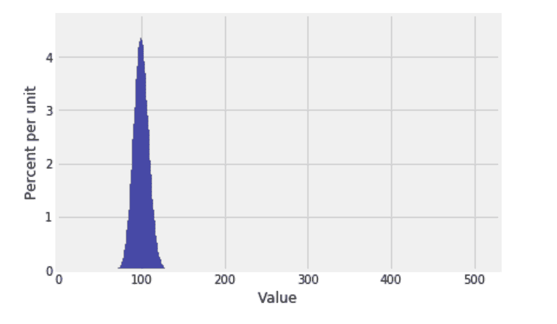
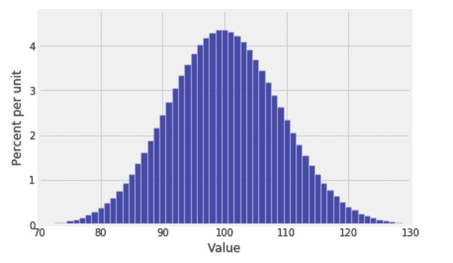
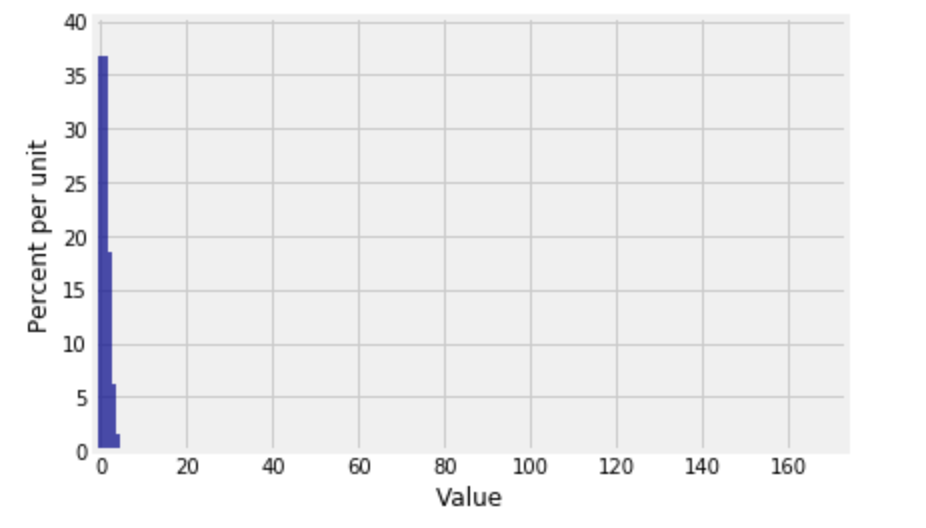
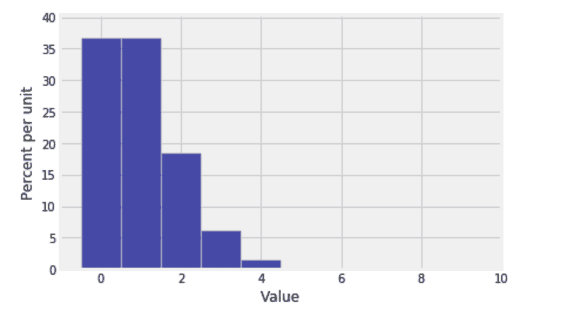
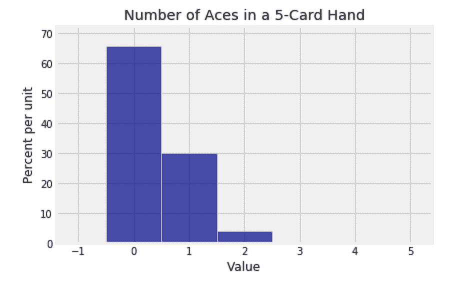
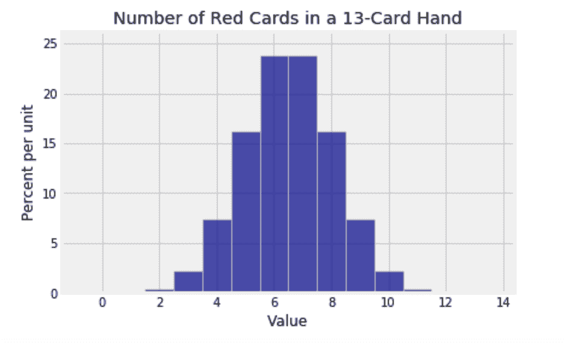
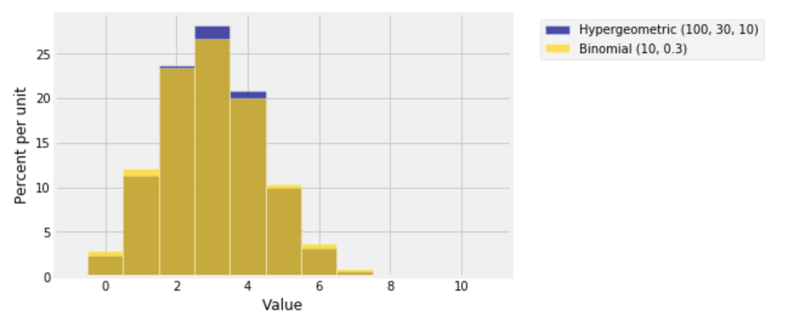

# 六、随机计数

> 原文：[prob140/textbook/notebooks/ch_6](https://nbviewer.jupyter.org/github/prob140/textbook/tree/gh-pages/notebooks/Chapter_06/)
>
> 译者：[viviwong](https://github.com/viviwong)
>
> 协议：[CC BY-NC-SA 4.0](http://creativecommons.org/licenses/by-nc-sa/4.0/)
>
> 自豪地采用[谷歌翻译](https://translate.google.cn/)

# 本章所需 python 包 #
```python
# HIDDEN
from datascience import *
from prob140 import *
import numpy as np
import matplotlib.pyplot as plt
plt.style.use('fivethirtyeight')
%matplotlib inline
import math
from scipy import stats
```

# 随机计数 #

随机计数构成了一类随机变量，它们在概率论中具有根本重要性。你已经看到了一些示例：$n$个元素的随机排列中的匹配个数（固定点数）就是一个“随机计数”的示例，简单随机抽样中的有效元素的个数也是如此。

一般情况是有许多次试验，每次试验都可能成功或失败。随机计数是所有试验中的成功的次数。

随机分布成功的次数取决于随机性的基本假设。在本章中将研究独立的、同分布的随机试验。匹配问题和简单随机抽样都不适合这个框架。但是，在某些条件下，将看到参数可以通过独立试验来近似地接近这两种情况。

最后，当试验次数本身是随机时，将发现随机计数的一些显著特性。数据科学包括许多基于随机化参数的强大方法。

从最简单的随机计数开始，即一个只有是 0 或 1 的计数。

### 指标和伯努利 $(p)$ 分布 ###

考虑只有一次成功或一次失败的试验。因此，成功次数$X$ 是 0-1 值随机变量，并且说它是具有*伯努利 $(p)$ 分布*，其中$p = P(X = 1)$是它成功的概率。

这个非常简单的随机计数$X$被称为试验成功的指标。

这是具有伯努利$(1/3)$分布的随机变量$X$的概率直方图。

```python
bern_1_3 = Table().values([0,1]).probability([2/3, 1/3])
Plot(bern_1_3)
plt.xlabel('Value of $X$')
plt.title('Bernoulli (1/3)');
```




### 计数就是数数添加 0 和 1 ###

考虑$n$次试验，对于$1 \le i \le n$，$X_i$是衡量第$i$次试验成功的指标。

求和$S_n = X_1 + X_2 + \cdots + X_n$是$n$次试验中的总成功次数。例如，如果$n=3$且$X_1 = 0$，$X_2 = 0$，$X_3 = 1$，在三次试验中有一次成功，$S_3 = 1$。当你增加试验次数时，计数在$X_i = 0$的每个$i$处保持不变，计数在$X_i = 1$的每个$i$处增加 1 。

首先假设所有的$X_i$都是独立同分布的。也就是说，试验是相互独立的，并且在所有试验中，成功的机率是固定的。

为了加深这个例子在你脑海中的印象，把这些试验想象成有 7 个骰子，让$X_i$ 表示第$i$次获得点数 6。每个$X_i$都服从伯努利$(1/6)$ 分布，所有$X_i$都是相互独立的。它们的总和$S_7$ 是 7 次实验中出现 6 的次数。


## 二项分布 ##

设$X_1, X_2, \ldots , X_n$为独立同分布的伯努利$(p)$随机变量，$S_n = X_1 + X_2 \ldots + X_n$。正式的说法为：

- 假设试验成功/失败的总数固定为$n$;
- 每次试验相互独立;
- 每次试验成功的概率为 $p$.
- $S_n$ 是总的成功次数.

本节的首要目标是找出$S_n$的分布。

在之前已经解决过的例子中，我们学会计算 7 个骰子中获得数字 6 的次数。 7 个骰子彼此独立，每次试验“成功”（获得数字 6）的机会是$1/6$，$S_7$是出现数字 6 的次数。

任何随机变量找到其分布的第一步是找出变量所有可能的取值。在$n$次试验中，获得数字 6 的最小可能次数为 0，最大可能次数为 $n$。因此，$S_n$可能值的集合是$\{0, 1, 2, \ldots , n\}$。

因此，7 个骰子获得数字 6 个数可以是 0 到 7 范围内的任何整数。计算$P(S_7 = 3)$。

事件$\{S_7 = 3\}$发生的不同情形。一种方式可以为 SSSFFFF，其中 S 表示“成功”（或掷出“六”），F 表示失败。另一种是 SFFSSFF。等等。

现在注意到 
$$
P(\text{SSSFFFF}) = 
\big{(}\frac{1}{6}\big{)}^3 \big{(}\frac{5}{6}\big{)}^4
= P(\text{SFFSSFF})
$$

由于是独立事件，任何顺序的三个 S 和四个 F 具有相同的概率。所以通过加法则，
$$
\begin{align*}
P(S_7 = 3) &= \text{(具有 3 个 S 和 4 个 F 的序列个数)} \cdot \big{(}\frac{1}{6}\big{)}^3 \big{(}\frac{5}{6}\big{)}^4 \\ \\
&= \binom{7}{3} \big{(}\frac{1}{6}\big{)}^3 \big{(}\frac{5}{6}\big{)}^4
\end{align*}
$$

因为$\binom{7}{3}$ 算式，表示为从 7 个位置中选择 3 个位置，放置符号 S，其余 4 个位置用 F 填充。

类似的论证得出概率论中最重要一个分布。

### 二项 式$(n, p)$ 分布 ###
设$S_n$是$n$次独立伯努利$(p)$试验中的成功次数。$S_n$满足*参数$n$,$p$的二项式分布*，定义如下
$$
P(S_n = k) = \binom{n}{k} p^k (1-p)^{n-k}, ~~~ k = 0, 1, \ldots, n
$$

Parameters of a distribution are constants associated with it. The Bernoulli $(p)$ distribution has parameter $p$. The binomial distribution defined above has parameters $n$ and $p$ and is referred to as the binomial $(n, p)$ distribution for short. You should check that the Bernoulli $(p)$ distribution is the same as the binomial $(1, p)$ distribution.

分布中的参数是与之相关的常量。伯努利$(p)$分布有参数$p$。上面定义的二项式分布具有参数$n$和$p$，并且简称为 B$(n, p)$二项分布。可以看出$p$的伯努利分布是与 B$(1, p)$二项分布同分布的。

在开始使用二项分布进行计算之前，观察一下。

- 概率的函数形式在表示成功和失败时是对称的，因为

$$
P(S_n = k) = \frac{n!}{k!(n-k)!} p^k (1-p)^{n-k}, ~~~ k = 0, 1, \ldots, n
$$

这是“总的试验次数的阶乘$n!$；除以成功次数的阶乘$k!$除以失败次数的阶乘$(n-k)!$；乘以成功概率的成功次数次方；乘以失败概率的失败次数次方。”

- 该公式对两端情况 $k=0$和$k=n$也是有意义的。可以在没有上面公式的情况下计算$P(S_n = 0)$。没有一次成功，所有的都失败，即$(1-p)^n$。公式如下

$$
P(S_n = 0) = \frac{n!}{0!(n-0)!} p^0 (1-p)^{n-0} = (1-p)^n
$$

在公式中考虑所有的因素；前两个因子都是 1.可以得出$P(S_n = n) = p^n$，即所有试验成功的可能性。

请记住定义$0! = 1$。在某种程度上，$\binom{n}{k}$公式能正确地表示$k=0$时的情形。

- 概率分布的总和为 1.为了清楚认识这点，回想一下任何两个数字$a$和$b$，

$$
\begin{align*}
(a+b)^2 &= a^2 + 2ab + b^2 \\
(a+b)^3 &= a^3 + 3a^2b + 3ab^2 + b^3 \\
\ldots \\
(a+b)^n &= \sum_{k=0}^n \binom{n}{k} a^k b^{n-k}
\end{align*}
$$

通过$(a+b)^n$的二项式展开。数字 $\binom{n}{k}$是帕斯卡三角形项，和在数学课上看到的一样。

替换 $a = p$和$b = 1-p$并注意总和中的项恰好是我们在上面定义的二项式概率。因此概率的总和是
$$
\sum_{k=0}^n \binom{n}{k} p^k (1-p)^{n-k}
~ = ~ \big{(} p + (1-p) \big{)}^n ~ = ~ 1^n ~ = ~ 1
$$

### Python 中的二项式概型 ###
`SciPy`是一个基于 Python 的科学计算库。  `scipy`的`stats`子模块在概率和统计上进行了大量计算。现在，在每个代码的开头导入它。

```python
from scipy import stats
```

函数`stats.binom.pmf`按顺序传入三个参数：$k$，$n$和$p$。它返回$P(S_n = k)$的数值，简言之，该函数返回$k$的二项式$(n, p)$概型

缩写“pmf”代表“概率质量函数”，正如前面提到的，它是有限多值变量分布的另一种叫法。

通过二项式公式，7 个骰子中选出 3 个 6 的概率是$\binom{7}{3}(1/6)^3(5/6)^4$，通过下面计算得出概率约为 8％。

```python
stats.binom.pmf(3, 7, 1/6)
```

```
0.078142861225422938
```

给$k$值传入数组或列表，`stats.binom.pmf`将返回包含其所有概率的数组。

```python
stats.binom.pmf([2, 3, 4], 7, 1/6)
```

```
array([ 0.23442858,  0.07814286,  0.01562857])
```

因此，要得出$P(2 \le S_7 \le 4)$的概率，可以使用

```python
sum(stats.binom.pmf([2, 3, 4], 7, 1/6))
```

```
0.32820001714677649
```

### 二项式直方图 ###
为了可视化二项式分布，使用`prob140`模块中的 `Plot`方法，首先使用 `stats.binom.pmf`来计算二项式概率。下面的图表绘制出$S_7$的分布。请注意如何从数组`k`中计算出$S_7$的所有可能取值概率。

```python
n = 7
p = 1/6
k = np.arange(n+1)
binom_7_1_6 = stats.binom.pmf(k, n, p)
binom_7_1_6_dist = Table().values(k).probability(binom_7_1_6)
Plot(binom_7_1_6_dist)
```



毫无疑问，图表显示，掷 7 个骰子，得到 6 个 1 的可能性最大。

正如所料，这个分布是不对称的。但是当增加骰子个数时，出现数字 6 次数的分布上会发生一些有趣的事情。

```python
n = 600
p = 1/6
k = np.arange(n+1)
binom_600_1_6 = stats.binom.pmf(k, n, p)
binom_600_1_6_dist = Table().values(k).probability(binom_600_1_6)
Plot(binom_600_1_6_dist)
```



这个分布接近于对称，尽管每个骰子出现数字 6 的概率只有 1/6。

另外注意，虽然掷一百次的*可能*取值范围从 0 到 600，但实际中*可能*取值在更小的范围。`plt.xlim`函数允许我们放大可能值的范围。下面代码中分号是为防止 Python 给出一个混乱图形。`edges=True`选项强制 `Plot` 绘制条形分隔线条；默认情况下，如果条形数量很大，它会停止这样做。

```python
Plot(binom_600_1_6_dist, edges=True)
plt.xlim(70, 130);
```



但是，当$n$很大，二项式 $(n, p)$分布是看起来不总是像钟形。

如果随机变量是 600 次独立试验中成功的次数，那么就会发生一些完全不同的事情，每次试验的成功率为 1/600。成功次数的分布是二项式$(600, 1/600)$，如下所示：

```python
n = 600
p = 1/600
k = np.arange(n+1)
binom_600_1_600 = stats.binom.pmf(k, n, p)
binom_600_1_600_dist = Table().values(k).probability(binom_600_1_600)
Plot(binom_600_1_600_dist)
```



确实看不到这个图形！放大。当水平轴上设置坐标值时，考虑条形图以 0 为中心，-0.5 为起始点。

```python
Plot(binom_600_1_600_dist, edges=True)
plt.xlim(-1, 10);
```



600 次独立试验，每次试验成功的概率为 1/600，最大的概率是没有成功或 1 次成功。还可能获得 2-4 次成功，但是任何超过 4 次成功的概率在图表的范围内几乎看不到。

显然，直方图的形状由$n$和$p$确定。在接下来的部分将仔细研究图形形状。但首先看一些使用二项分布的数值例子。

## 实例 ##

在本节中，将在各种情况下使用二项分布。公式和代码足够简单。必须记住的是二项分布有效的前提条件。它是这样的分布：

- 事件发生(成功)的次数
- 独立试验次数已知
- 每次试验都有相同的成功概率。

因此，不要将它用于扑克牌无放回的抽取 A 的情形

### 示例 1：随机数生成器 ###
随机数生成器随机重复生成 10 个数$\{0, 1, 2, 3, 4, 5, 6, 7, 8, 9\}$。

**问题 1.** 生成器运行 20 次。找出 0 出现两次以上的概率。

**回答 1.**

- 是否看到有事件发生？有的，0 表示“事件发生(成功)”。
- 独立试验次数已知？是的，$n = 20$，并且随机事件是可以重复发生的。
- 每次试验的成功概率是否相同？是的，$p = 0.1$。

两种等价的解答:

$$
\sum_{k=3}^{20} \binom{20}{k} 0.1^k 0.9^{20-k}
= 1 - \sum_{k=0}^2 \binom{20}{k} 0.1^k 0.9^{20-k}
$$

如果手动完成数值计算，会发现第二种方式更快。但你不会这样做。你宁愿：

```python
sum(stats.binom.pmf(np.arange(3, 21), 20, 0.1))
```

```
0.32307319481053343
```

或者，等价于，

```python
1 - sum(stats.binom.pmf(np.arange(3), 20, 0.1))
```

```
0.32307319481053431
```

**问题 2.** 一个班级有七个助教和导师。他们相互独立的运行随机数生成器 20 次。最多 3 个人获得两次 0 的几率是多少？

**回答 2.** 不能将此视为一组，即一共运行$7 \times 20 = 140$次生成器，必须分别跟踪这 7 组 20 次运行中的每一组的情况。

那么现在什么是“试验”？是一名班级教员：助教或导师。一共有 7 个，其结果彼此独立。“事件发生（成功）”意味着“在 20 次运行中得到两个 0” 。希望获得最多三次成功的概率。

We're all set to use the binomial: $n = 7$, $k = 0, 1, 2, 3$, and $p$ is the probability of getting two 0's in 20 runs. Hence

使用二项式： $n = 7$， $k = 0, 1, 2, 3$，而$p$是在 20 次运行中获得两个 0 的概率。于是

```python
p = stats.binom.pmf(2, 20, 0.1)

sum(stats.binom.pmf(np.arange(4), 7, p))
```

```
0.89236130614839881
```

用数学公式，表示如下

$$
\sum_{k=0}^3 \binom{7}{k}p^k(1-p)^{7-k} ~~ \text{where } 
p = \binom{20}{2} 0.1^2 0.9^{18}
$$

### 示例 2: 正面和反面 ###
抛硬币 10 次。

**问题.** 至少有 3 次正面和至少 3 次反面的概率是多少？

**回答.** 处理任何分布的第一步：确定事件发生可能值得集合。

出现 3 次，4 次，5 次，6 次和 7 次正面，现在答案很明显：
$$
\sum_{k=3}^7 \binom{10}{k} 0.5^k 0.5^{10-k}
$$

计算如下

```python
sum(stats.binom.pmf(np.arange(3, 8), 10, 1/2))
```

```
0.89062500000000089
```

$P(H \ge 3)$是至少出现三次正面的概率，其中 $H$表示正面朝上，通过计算$P(H \ge 3)$来解决这个问题，但是这种计算方法是有问题的。为什么呢，$T$为 10 次投掷中的反面次数。然后
$$
P(H \ge 3, T \ge 3) = P(H \ge 3)P(T \ge 3 \mid H \ge 3)
$$

第一个概率很容易算出，但第二个概率根本不清楚。它不是$P(T \ge 3)$，因为$H$和$T$并非独立：$T = 10 - H$。

### 示例 3: 当事件发生情况下的条件分布 ###
已经掷了 24 次骰子。

**问题.** 掷骰子 24 次，出现一次 6 的条件下，在哪个位置出现“6”的概率分布。

**回答.** R 代表第几次出现 6 的事件，$S$为掷 24 次骰子中 6 出现的总次数。给定$S = 1$，希望得到$R$的条件分布。

尝试找出概率分布时，始终从其可能的取值开始。出现 1 次 6，所以$R$可以是 1-24 范围内的任何值。

对于 $k = 1, 2, \ldots 24$，
$$
\begin{align*}
P(R = k \mid S = 1) &= \frac{P(R = k, S = 1)}{P(S=1)} \\ \\
&= \frac{P(k-1 \text{ non-sixes, then six, then } 24-k \text{ non-sixes})}{P(S = 1)} \\ \\
&= \frac{(5/6)^{k-1} (1/6) (5/6)^{24-k}}
{\binom{24}{1}(1/6)^1(5/6)^{23}} \\ \\
&= \frac{1}{24}
\end{align*}
$$

请注意解答中缺少$k$。得到了 1 次数字 6，所以数字 6 个出现的位置是均匀分布。

## 超几何分布 ##

前面已经看过超几何概率。在本节中，将使用它们来定义随机计数的分布，并研究其与二项分布的关系。

作为对超几何的回顾，假设总数为定值$N$，由这$N$个个体构成的某些特定组。称之为“成功”或“好元素”。例如，可能是以下内容：

- 选民群体，包括投票给特定候选人的群体
- 家庭群体，包括年收入低于 50,000 美元的群体
- 一副扑克和一套钻石

设$N = G+B$ ，其中$G$是好元素的数量，$B$是不好地被描述为“坏”的剩余元素数量。

现在假设从总体中获取$n$个元素的简单随机样本（SRS）。

### 简单随机样本（SRS）中的好元素数量 ###
设$X$是样本中好元素的个数。 那么$X$的分布是什么呢？

最大的$X$是$\min(G, n)$。最小的$X$是 0，但如果严谨一些，会发现实际上$X$不能小于$\max(0, n-B)$。

设$g$为$X$的可能值。然后，由于所有$\binom{N}{n}$样本都具有相同的可能性，
$$
P(X = g) ~ = ~ \frac{\binom{G}{g} \binom{B}{b}}{\binom{N}{n}}, ~~~
g+b=n
$$

这就是*超几何分布*，总体大小$N$，好元素的数量或“成功”数量为$G$，样本大小为$n$。该名称源于这样一个事实，即术语是[*超几何系列*](https://en.wikipedia.org/wiki/Hypergeometric_function#The_hypergeometric_series)中的系数，本课程中不会涉及这部分。

### 示例：五张牌扑克牌中 A 的数量 ###
五张牌扑克牌中 A 的数量$N_a$具有超几何分布，总体大小为 52，总体中有四个好元素，随机样本量为 5。
$$
P(N_a = k) = \frac{\binom{4}{k} \binom{48}{5-k}}{\binom{52}{5}}, ~~ k = 0, 1, 2, 3, 4
$$

使用`stats.hypergeom.pmf`函数计算超几何概率。第一个参数是所求概率的可能集值。后面的参数依次为，总体大小，好元素数量，简单随机样本大小。

```python
k = np.arange(5)
N = 52 # 总体大小
G = 4  # 总体中良好元素的数量
n = 5  # 简单随机样本大小
stats.hypergeom.pmf(k, N, G, n)
```

```
array([  6.58841998e-01,   2.99473636e-01,   3.99298181e-02,
         1.73607905e-03,   1.84689260e-05])
```

这是扑克手中所有不同数量的 A 的概率。它们阅读起来有些困难，所以尝试四舍五入。

```python
np.round(stats.hypergeom.pmf(k, N, G, n), 3)
```

```
array([ 0.659,  0.299,  0.04 ,  0.002,  0.   ])
```

5 张卡中的 A 出现的概率只可能是 0 或 1.可以使用`Plot`绘制分布的直方图。

```python
ace_probs = stats.hypergeom.pmf(k, N, G, n)
ace_dist = Table().values(k).probability(ace_probs)
Plot(ace_dist)
plt.title('5 张牌中的 A 的数量');
```



### 桥牌中的红桃 ###
以下是 13 张桥牌中红牌的数量分布：

```python
k = np.arange(14)
N = 52
G = 26
n = 13
bridge_probs = stats.hypergeom.pmf(k, N, G, n)
bridge_dist = Table().values(k).probability(bridge_probs)

Plot(bridge_dist)
plt.title('13 张牌中的红牌数');
```



这个看起来很像二项式。事实上，二项式和超几何分布之间存在密切关系。

### 与二项式的关系 ###
假设有如上所述的总体$N = G+B$个元素，重复进行了$n$次采样。然后，样本中的好元素的数量具有参数$n$和$G/N$的二项分布

如果在不放回的情况下进行抽样，那么好元素数量的分布是超几何的$(N, G, n)$。

两种抽样之间唯一区别是随机化：有无放回的抽样。

如果总体$N$远远大于样本数$n$，那么无论是放回还是没有放回区别不大。如果在抽样时只取出了很小一部分总体，那么对总体中的概率没有明显影响。

为了验证这个结论，通过计算来实现，绘制一些超几何分布和相应的二项式分布。更改以下代码中的参数。只要确保$n$远远小于$N$。

```python
N = 100
G = 30
n = 10
k = np.arange(n+1)
hyp_probs = stats.hypergeom.pmf(k, N, G, n)
bin_probs = stats.binom.pmf(k, n, G/N)
hyp_dist = Table().values(k).probability(hyp_probs)
bin_dist = Table().values(k).probability(bin_probs)
Plots('Hypergeometric (100, 30, 10)', hyp_dist, 'Binomial (10, 0.3)', bin_dist)
```



它们非常接近，但是可以看出超几何分布更高更窄。在后面的章节中，将量化这种收窄的速度。

### 费希尔精确检验 ###
回想一下在*Date 8*中分析的[随机对照实验](https://www.ncbi.nlm.nih.gov/pubmed/11376175)。肉毒杆菌毒素 A 一种非常有效的毒素，用于治疗患有慢性背痛的患者。

一共有 31 名患者参与了该研究。其中，15 名随机分配到治疗组，其余 16 名随机分配到对照组。治疗 8 周后，治疗组 15 例中有 11 例疼痛缓解，而对照组 16 例中有 2 例疼痛缓解。

换句话说，在 13 名背痛缓解的患者中，11 名在治疗组中，2 名在对照组中。这是否有利于治疗？

零假设认为治疗没有起到任何作用；两组之间的差异完全是由于患者被随机分配而导致病情被治疗和控制。

另一种假设认为治疗是有益的。

在零假设下，治疗没有起到任何作用，参与研究的 31 名患者，无论被分配到哪组，其中的 13 名患者都会有疼痛缓解。

为了求证数据更好地支持哪些假设，找到 P 值。在零假设下，就是一个概率，获取数据例如观察到的数据，甚至更多的数据。也就是说，P 值是在治疗组中获得 11 名或更多“疼痛缓解”患者的概率，只是概率。

为了找到 11 个或更多“疼痛缓解”患者最终在治疗组中出现的可能性，我们需要一个超几何概率：

- N = 31，患者数量
- G = 13，“疼痛缓解”患者的总数
- n = 15，治疗组的大小
- g = 11 或更高

```python
sum(stats.hypergeom.pmf([11, 12, 13], 31, 13, 15))
```

```
0.00082997550460762949
```

这个 P 值非常小，这意味着数据支持第二种假设而不支持 null。治疗对病情有帮助。这与研究人员的结论以及在*Data 8*中的分析一致 - 但三种分析方法完全不同。

在*Data 8*中，通过汇集两组数据并且随机抽取样本，来模拟零假设下两组比例之间的差异。结论是基于经验的近似值 P。

此处的计算不需要求得精确的 P 值。

这种方法称为费希尔精确检验。它与罗纳德·费舍尔爵士做的检验一样，他对假设进行了测试，建议对 P 值做切分，等等。该方法可用于任意大小样本和任何具有二元结果的随机实验。


## 比值比

二项式$(n, p)$概型涉及幂次和阶乘，当 n 很大时，这两者都很难计算。本节是关于整个分布的简化计算。结果有助于理解二项式直方图。

### 连续比值比 

固定$n$和$p$，$P(k)$为$k$的二项式$(n, p)$概率。也就是说，$P(k)$为在$n$次独立试验中获得$k$次成功的概率，每次试验的成功概率为$p$。

$k \ge 1$，定义第$k$个连续比值比为
$$
R(k) = \frac{P(k)}{P(k-1)}
$$
了解这些有助于计算每一个$P(k)$而不必每次都计算幂次和阶乘，请注意这一点
$$
\begin{align*}
P(0) &= (1-p)^n \\ \\
P(1) &= P(0) \cdot \frac{P(1)}{P(0)} = P(0)R(1) \\
P(2) &= P(0)R(1)R(2)
\end{align*}
$$
等等。

这比使用二项式公式更有启发性？为了看到这一点，固定$k \ge 1$并计算$R(k)$比率。
$$
\begin{align*}
R(k) &= \frac{\binom{n}{k}p^k(1-p)^{n-k}}
{\binom{n}{k-1}p^{k-1}(1-p)^{n-k+1}} \\ \\
&= \frac{n-k+1}{k} \cdot \frac{p}{1-p} ~~~
\text{(after cancellation)} \\ \\
&= \big{(} \frac{n+1}{k} - 1 \big{)} \cdot \frac{p}{1-p}
\end{align*}
$$
首先，请注意 $R(k)$的公式很简单。例如，如果$n \ge 3$，则很容易计算$P(3)$
$$
P(3) = (1-p)^n \cdot \frac{n - 1 + 1}{1} \cdot \frac{p}{1-p} \cdot
\frac{n - 2 + 1}{2} \cdot \frac{p}{1-p} \cdot
\frac{n - 3 + 1}{3} \cdot \frac{p}{1-p} \cdot
$$
没有涉及阶乘。

### 二项式直方图的形状

观察，比较$R(k)$和 1，直方图是上升，保持水平还是下降到$k$。
$$
\begin{align*}
R(k) > 1 &\iff P(k) > P(k-1) \\
R(k) = 1 &\iff P(k) = P(k-1) \\
R(k) < 1 &\iff P(k) < P(k-1) 
\end{align*}
$$
还要注意公式
$$
R(k) = \big{(} \frac{n+1}{k} - 1 \big{)} \cdot \frac{p}{1-p}
$$
比值$R(k)$是关于$k$的递减函数。在公式中， $n$和$p$是分布的参数是常数。  $k$是变量， $k$出现在分母中。

这意味着对于$k$，一旦$R(k) < 1$，对于所有较大的$k$，它将保持小于 1。换句话说，一旦直方图开始下降，它将继续下降。它不能再上升。

这就是为什么二项式直方图要么不增加，要么不减少，或者它们上升和下降。但它们看起来不像海浪。它们不能上升，下来，再上升。

想象一下$n = 23$和$p = 0.7$，这两个参数除了在这个例子中使用的选择之外没有任何意义。

```python
n = 23
p = 0.7
k = range(n+1)
bin_23_7 = stats.binom.pmf(k, n, p)
bin_dist = Table().values(k).probability(bin_23_7)
Plot(bin_dist)
```


```python
# 在这里将 k 定义为数组非常重要
# 这样就可以进行数组操作了
# 一次查找所有比率。
k = np.arange(1, n+1, 1)
((n - k + 1)/k)*(p/(1-p))
```

```
array([ 53.66666667,  25.66666667,  16.33333333,  11.66666667,
         8.86666667,   7.        ,   5.66666667,   4.66666667,
         3.88888889,   3.26666667,   2.75757576,   2.33333333,
         1.97435897,   1.66666667,   1.4       ,   1.16666667,
         0.96078431,   0.77777778,   0.61403509,   0.46666667,
         0.33333333,   0.21212121,   0.10144928])
```

Python 有助于告诉我们的是，1 处的不可见条比 0 处的不可见条大 53.666… 倍。之后比率降低但是它们仍然大于 1 到$k = 16$。直方图上升直到它在$k = 16$时达到峰值。你可以看到$R(16) = 1.1666 > 1$。然后比率降至 1 以下，因此直方图开始下降。

求解不等式$R(k) \ge 1$得出最大的 $k$是$(n+1)p$的整数部分。在例子中，这里$，k = 16$因为

```python
(n+1)*p
```

```
16.799999999999997
```


### 二项式模式

一种*模式*是离散分布具有最高概率的可能值。可能存在多个值，因此可能存在多种模式。

对于所有$k$ ，使得$R(k) \ge 1$，二项式直方图在$k$处上升或平坦。 $R(k) \ge 1$的最大$k$必须是一种模式；对于所有较大的$k$，直方图将下降。

设$q = 1-p$。 $R(k) \ge 1$的每个值$k$必须满足
$$
\big{(} \frac{n+1}{k} - 1 \big{)} \frac{p}{q} ~ \ge ~ 1
$$
那是，
$$
\frac{n+1}{k} ~ \ge ~ \frac{q}{p} + 1 ~ = ~ \frac{1}{p}
$$
等价于
$$
k ~ \le ~ (n+1)p
$$
因此，$R(k) \le 1$的最大$k$是$(n+1)p$的整数部分。这是二项式的一种模式。

因为比值比在$k$中是非递减的，所以存在多种模式的唯一情况就是如果存在$k$使得$R(k) = 1$。在这种情况下，$P(k) = P(k-1)$，因此$k$和$k-1$都是模式。总结如下：

#### 模式

二项式$(n, p)$分布的模式是$(n+1)p$的整数部分。如果$(n+1)p$是整数，则$(n+1)p-1$也是模式。

但事实上，$np$是一个更自然的计算。例如，如果计算一个硬币 100 次投掷的正面朝上次数，分布是二项式$(100, 1/2)$，很自然算出$np = 50$次正面。而不必担心 $101 \times (1/2)$。

当$n$很大时你不必担心，因为那时$np$和$(n+1)p$非常接近。在后面的章节中，我们将研究一种情况，当 n 很大时，可以使用$np$来近似二项分布的图形。


## 小数定律

当$n$很大且$p$很小时，二项式$(n, p)$分布的连续比值比有助于推导出分布的近似值。这种近似被称为“小数定律”，因为当成功的概率很小时，它近似于成功的概率分布：你只期望少量的成功。

例如，下面是二项式$(1000, 2/1000)$分布。请注意，1000 很大，2/1000 非常小，$1000 \times (2/1000) = 2$是自然成功次数。

```python
n = 1000
p = 2/1000
k = np.arange(16)
binom_probs = stats.binom.pmf(k, n, p)
binom_dist = Table().values(k).probability(binom_probs)
Plot(binom_dist)
```


虽然 1000 次试验中成功次数的可能取值在 0 到 1000 之间，但可能的值都很小，因为$p$很小。这就是为什么我们不打算计算超过$k = 15$的概率。

由于直方图全部在 0 附近，因此只有非常少的条形图概率明显。通过比二项式更简单的计算方式，确实可以找到相应值的近似概率。

如何做，从$P(0)$开始。

近似 $P(0)$

设$n \to \infty$和$p_n \to 0$，使$np_n \to \mu > 0$。要确保$p_n$不会过快地变为 0 以至于$np_n \to 0$，因为在这种情况下，当$n$很大时，所有概率都趋于在 0。

令 $P_n(k)$为二项式$(n, p_n)$$k$次成功的概率

然后
$$
P_n(0) = (1 - p_n)^n = \big{(} 1 - \frac{np_n}{n} \big{)}^n
\to e^{-\mu} ~~~ \text{as } n \to \infty
$$
如果无法直接获得极限值，请参考的指数近似求值：
$$
\log(P_n(0)) = n \log \big{(} 1 - \frac{np_n}{n} \big{)}
= n \cdot \log \big{(} 1 - p_n \big{)} 
\sim n(-p_n)
= -np_n
\sim -\mu
$$
当$n$很大时，因为$p_n \sim 0$和$np_n \sim \mu$。

### 近似$P(k)$

一般来说，对于固定的$k > 1$，
$$
\begin{align*}
P_n(k) &= P_n(k-1)R_n(k) \\ \\
&= P_n(k-1)\frac{n-k+1}{k} \cdot \frac{p_n}{1-p_n} \\ \\
&= P_n(k-1) \big{(} \frac{np_n}{k} - \frac{(k-1)p_n}{k} \big{)}
\frac{1}{1 - p_n} \\ \\
&\sim P_n(k-1) \cdot \frac{\mu}{k}
\end{align*}
$$
当$n$很大时，因为$k$是常数，$np_n \to \mu$，$p_n \to 0$和$1-p_n \to 1k$。通过归纳，对于每个固定的$k$有以下近似。
$$
P_n(k) ~ \sim ~ e^{-\mu} \cdot \frac{\mu}{1} \cdot \frac{\mu}{2}
\cdots \frac{\mu}{k}
~ = ~ e^{-\mu} \frac{\mu^k}{k!}
$$
如果$n$很大，在所有假设的附加条件下。这是正式表述。


### 二项式的泊松近似

设$n \to \infty$，$p_n \to 0$，使$np_n \to \mu > 0$。令$P_n(k)$ 为二项式$(n, p_n)$$k$次成功的概率。然后对于每一个$k$，$0 \le k \le n$，
$$
P_n(k) \sim e^{-\mu} \frac{\mu^k}{k!} ~~~
n \text{很大 }
$$
这叫做二项式的泊松近似。对于很大的$n$，泊松分布的参数是$\mu \sim np_n$。

该分布以其发布人，法国数学家[Siméon Denis Poisson](https://en.wikipedia.org/wiki/Siméon_Denis_Poisson) (1781-1840)命名。

近似中的项与$e^{\mu}$的级数展开项成正比：
$$
\frac{\mu^k}{k!}, ~~ k \ge 0
$$
可以扩展到无限，但我们只会达到有限（很大）的$n$。现在能够处理具有无限取值的概率空间了。

这部分内容将在后面介绍。现在，看看推导出的近似值是否合适。

### Python 中的泊松概型

使用`stats.poisson.pmf`跟用`stats.binomial.pmf`是一样的，但请记住泊松只有一个参数。

假设$n = 1000$且$p = 2/1000$。那么 3 次成功的二项式概率是

```python
stats.binom.pmf(3, 1000, 2/1000)
```

```
0.18062773231746918
```

近似泊松分布的参数为$1000 \times (2/1000) = 2$，因此对上述概率的泊松近似是

```python
stats.poisson.pmf(3, 2)
```

```
0.18044704431548356
```

不错。比较整个分布，首先创建两个分布对象：

```python
k = range(16)

bin_probs = stats.binom.pmf(k, 1000, 2/1000)
bin_dist = Table().values(k).probability(bin_probs)

poi_probs = stats.poisson.pmf(k, 2)
poi_dist = Table().values(k).probability(poi_probs)
```

绘制重叠直方图 `prob140`函数称为`Plots`（注意复数 s）。函数语法依次传入参数：该分布的字符串标签，后跟该分布，然后是第二个分布的字符串标签，然后是该分布。

```python
Plots('Binomial (1000, 2/1000)', bin_dist, 'Poisson (2)', poi_dist)
```


它看起来好像只有一个直方图吗？那是因为非常近似！以下是两个直方图。

```python
Plot(bin_dist)
```


```python
Plot(poi_dist)
```


在实验中，使用总体变量差距来获得近似误差的边界。

此时要问的一个问题是，“嗯，这都非常好，但是使用 Python 中 `stats.binom.pmf`来计算精确的二项式概率时，为什么还要用近似值呢？”

部分原因是，如果函数包含参数，则只能通过计算某些特定参数的值来了解其组成方式。 在泊松概型下，很快就会看到它在一组无限取值上构成的强大分布。

