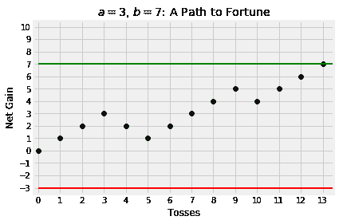
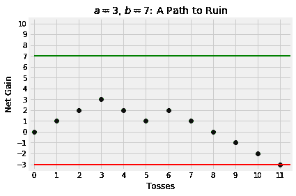
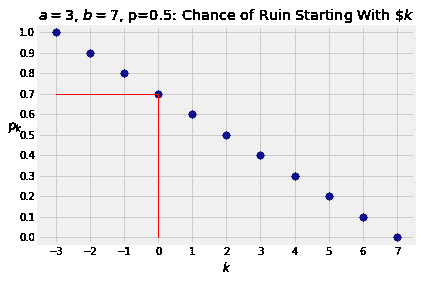
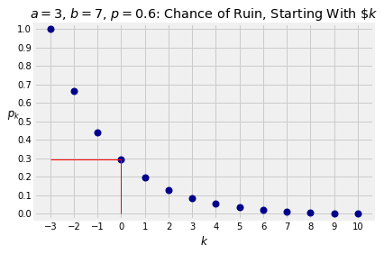

# 九、条件（续）

> 原文：[prob140/textbook/notebooks/ch09](https://nbviewer.jupyter.org/github/prob140/textbook/tree/gh-pages/notebooks/Chapter_09/)
> 
> 译者：[YAOYI626](https://github.com/YAOYI626)
> 
> 协议：[CC BY-NC-SA 4.0](http://creativecommons.org/licenses/by-nc-sa/4.0/)
> 
> 自豪地采用[谷歌翻译](https://translate.google.cn/)


```python
# HIDDEN
from datascience import *
from prob140 import *
import numpy as np
import matplotlib.pyplot as plt
plt.style.use('fivethirtyeight')
%matplotlib inline
import math
from scipy import stats
from scipy import misc
```
在接下来的几章中，我们将逐步研究以时序为索引的随机过程。 我们已经研究了其中的一些——例如，一系列试验可以被认为是一个随时间变化的随机过程。

自然地，在已经知道目前值的情况下，我们会对未来的过程预测产生兴趣。 接下来，涉及条件概率的方法将会发挥作用。 我们已经了解了其中的一些方法，在本章中我们将进一步研究它们。

## 条件概率

本节中的理论并不新鲜。这是古老熟悉的乘法规则。我们将在有关时序索引随机过程的上下文中使用它，在某种方法中我们叫它早期条件作用。

### 赢得骰子游戏
假设 Jo 和 Bo 玩下面这个游戏。 Jo 掷骰子，然后 Bo 掷，然后 Jo 再掷，依此类推，直到第一次他们中的一个掷出点数 6。这个人就是胜利者。

**问题。** Jo 获胜的几率是多少？

**答案。**在进行任何计算之前，请注意两个玩家的游戏并不对称。 Jo 拥有先行的优势，可以在第一轮获胜。所以 Jo 胜利的概率应该大于一半。

要确切了解概率的大小，请注意题设中存在自然递归或“更新”。为了赢得胜利，我们可以*对前两次投掷进行条件化*如下：
 -  Jo 在第一轮中获胜;
 - 或着 Jo 在第 1 轮中掷出非 6 的点数，然后 Bo 在第 2 轮中也掷出非 6 的点数，然后*游戏结束*  Jo 获胜。

所以在时间 0 时（也就是说，在掷骰子之前），设 $x$ 为 Jo 赢的概率。那么 $x$ 满足一个等式：

$$
x = \frac {1} {6} + \big {(} \frac {5} {6} \big {)} ^ 2 x
$$

这很容易算出答案。

$$
\frac {11} {36} x~ =~\frac {6} {36} ~~~~ \text {等等} ~~~~ x = \frac {6} {11}
$$

比我们猜测的一半更大一些。

### 赌徒的破产：公平的硬币
设 $a$ 和 $b$ 是两个正整数。假设一个赌徒以 $a$ 美元开始赌硬币：每次硬币正面落地，赌徒都会赢一美元。每次硬币反面落地，赌徒都会损失一美元。

现在假设赌徒有一个*停止规则*：当他的净收益为 $b$ 美元或者他没有钱时，他就停止游戏，以先发生者为准。如果赌徒输光了所有钱，他就破产了。我们在这个例子中的目标是找到赌徒破产的概率。

每次掷硬币时我们都会记录赌徒的净收益。因此他将从 0 开始，并在他获得 $b$ 或 $-a$ 时停止，以先发生者为准。

将赌徒净增益的随机变化轨迹可视化为*路径*是个好主意。这是两张图，假设 $a = 3$ 和 $b = 7$ 。第一张图展示了赌徒净赚 $b$ 的路径。第二个展示了赌徒的破产之路。

```python
# NO CODE
a = 3
b = 7
tosses = make_array(1, 1, 1, -1, -1, 1, 1, 1, 1, -1, 1, 1, 1)
fortune = np.cumsum(np.append(0, tosses))
plt.scatter(np.arange(14), fortune, color='k')
plt.plot([0, 13.5], [-1*a, -1*a], lw=2, color='r')
plt.plot([0, 13.5], [b, b], lw=2, color='g')
plt.ylim(-3.5, 10.5)
plt.xlim(-0.2, 13.5)
plt.xticks(np.arange(0, 14, 1))
plt.yticks(np.arange(-3, 11))
plt.xlabel('Tosses')
plt.ylabel('Net Gain')
plt.title('$a = 3$, $b = 7$: A Path to Fortune');
```


```python
#NO CODE
a = 3
b = 7
tosses = make_array(1,1,1，-1，-1,1，-1，-1，-1，-1，-1)
fortune = np.cumsum(np.append(0，tosses)
plt.scatter(np.arange(12)，fortune，color ='k')
plt.plot([0,11.5]，[ - 1 * a，-1 * a]，lw = 2，color ='r')
plt.plot([0,11.5]，[b，b]，lw = 2，color ='g')
plt.ylim(-3.5,10.5)
plt.xlim(-0.2,11.5)
plt.xlabel( 'Tosses')
plt.ylabel('Net Gain')
plt.xticks(np.arange(0,12,1)
plt.yticks(np.arange(-3,11)
plt.title(' $a = 3$， $b = 7$：破产之路');
```


**问题。**赌徒破产的概率是多少？

**答案。**你可以从上面的路径看到，在第一步，赌徒的净增益将是-1 或 1，所以我们必须从第一步开始计算破产概率。

对于任意 $k$，设 $p_k$ 为在赌徒净收益已经为 $k$ 的前提下他破产的概率。

我们现在求的概率是 $p_0$。

通过*第一步的条件*，我们得出 p_k 满足的一个等式：

$$
p_k = \frac {1} {2} p_ {k-1} + \frac {1} {2} p_ {k + 1}，~~~~ -a + 1 \le k \le b-1
$$

易得“边界情况”为

$$
p _ { - a} = 1 ~~~~~ \text {and} ~~~~~ p_b = 0
$$

将等式的左边写为 $\frac {1} {2} p_k + \frac {1} {2} p_k$，并重新排列，我们可以得出

$$
p_k - p_ {k-1} = p_ {k + 1} - p_k
$$

连续差相等，这意味着 $p_k$ 是 $k$ 的线性函数。

我们仍然假设 $a = 3$ 和 $b = 7$。红线表示 $p_0 = 0.7$。

```python
a = 3
b = 7
plt.scatter(np.arange(-3,8,1)，np.arange(1，-0.1，-0.1)，lw = 2，color ='darkblue')
plt.plot([0,0]，[0,0.7]，lw = 1，color ='r')
plt.plot([ - 3,0]，[0.7,0.7]，lw = 1，color ='r')
plt.ylim(-0.03,1.03)
plt.xticks(np.arange(-3, 8))
plt.yticks(np.arange(0, 1.1, 0.1))
plt.xlabel('$k$')
plt.ylabel('$p_k$', rotation=2)
plt.title('$a=3$, $b=7$, p=0.5: Chance of Ruin Starting With $\$k$')
```


对于一般的 $a$ 和 $b$，折线从 $( - a，1)$ 开始，并且斜率为 $-1 /(a + b)$。所以
破产的概率为：

$$
p_0~ = ~1 - \frac {a} {a + b}~=~\frac {b} {a + b}
$$

赌徒最终获得 $b$ 美元的概率是

$$
1 - p_0 = \frac {a} {a + b}
$$

对于固定的 $a$，上式是 $b$的递减函数。这和我们的直觉相符：对于固定的 $a$， $b$越大，赌徒最终赚到 $b$ 美元的难度就越大。

### 赌徒的破产：不公平的硬币
如果赌徒押注一枚硬币以 $p \ne 1/2 的价格出售，则方程式变为

$$
p_k = q \cdot p_ {k-1} + p \cdot p_ {k + 1}，~~~~ -a + 1 \le k \le b-1
$$

其中 $q = 1-p$，边界情况为

$$
p _ { - a} = 1 ~~~~~ \text {和} ~~~~~ p_b = 0
$$

像上面一样重新排列它，可得：

$$
q(p_k - p_ {k-1})= p(p_ {k + 1} - p_k)
$$

这说明连续差异的比率是恒定的，等于 $r = \frac {q} {p}$。所以概率 $p_k$ 是几何级数中以 $r$ 为比例的项的总和。您可以检查它是否正确：

$$
p_k = \frac {r ^ {a + k} - r ^ {a + b}} {1 - r ^ {a + b}}，~~~~~ -a \le k \le b
$$

因此破产的可能性是

$$
p_0~ =~\frac {r ^ a - r ^ {a + b}} {1 - r ^ {a + b}}
$$

注意，如果 $p <1/2$，then $r> 1$，分子和分母都是负数。

这是一个破产概率的图表，如前所述 $a = 3$ 和 $b = 10$，但现在有一个硬币正面偏重，它以正面落地的概率 $p = 0.6$。毫不奇怪，随着初始资金的增加，在这枚硬币下的破产概率比公平硬币更大。即使赌徒只以 $3 美元开始，他的破产概率也不到 30％。

```python
# NO CODE
a = 3
b = 10
p = 0.6
r = (1-p)/p
k = np.arange(-1*a, b+1)
ruin_probs = (r**(a+k) - r**(a+b))/(1 - r**(a+b))
p3 = ruin_probs.item(3)
plt.scatter(k, ruin_probs, lw=2, color='darkblue')
plt.plot([0, 0], [0, p3], lw=1, color='r')
plt.plot([-1*a, 0], [p3, p3], lw=1, color='r')
plt.ylim(-0.03, 1.03)
plt.xticks(np.arange(-1*a, b+1))
plt.yticks(np.arange(0, 1.1, 0.1))
plt.xlabel('$k$')
plt.ylabel('$p_k$', rotation=2)
plt.title('$a=3$, $b=7$, $p=0.6$: Chance of Ruin, Starting With $\$k$');
```


## 条件期望
```python
# HIDDEN
from datascience import *
from prob140 import *
import numpy as np
import matplotlib.pyplot as plt
plt.style.use('fivethirtyeight')
%matplotlib inline
```

设 $T$ 为一个随机变量，$S$ 为与 $T$ 在同一空间中定义的随机变量。正如我们知道的，如果 $S$ 和 $T$ 相关，那么条件化 $S$ 可能是寻找 $T$ 概率的好方法。在本节中，我们将看到条件化 $S$ 也是找到 $T$ 期望的好方法。

我们将从一个简单的例子开始来说明这些想法。设$ T $和$ S $的联合分配如下表所示。

```python
t = [3,4]
s = [5,6,7]
pp = [0.1,0.2,0.3,0.1,0.2,0.1]
jd2 =表（）。值（'T'，t，'S'，s）。概率(pp）
jt_dist = jd2.to_joint（）
jt_dist
```
|     | T=3 | T=4 |
| --- | --- | --- |
|**S=7**|0.3|0.1|
|**S=6**|0.2|0.2|
|**S=5**|0.1|0.1|

$S$ 如何参与 $E(T)$ 的计算？

注意，要查找 $E(T)$，您可以使用联合分布表和期望的定义，如下所示：

```python
3 *(0.3 + 0.2 + 0.1)+ 4 *(0.1 + 0.2 + 0.1)
```
```python
3.4
```
这相当于转到表格的每个单元格，用单元格中的概率加权该单元格中 $T$的值，然后再把它们相加。下面是另一种看待这种情况的方式。

设以 $S$ 为条件：
```python
jt_dist.conditional_dist('T', 'S')
```

|     | T=3 | T=4 |Sum|
| --- | --- | --- |---|
|**Dist. of T &#124; S=7**|0.75|0.25|1.0|
|**Dist. of T &#124; S=6**|0.50|0.50|1.0|
|**Dist. of T &#124; S=5**|0.50|0.50|1.0|
|**Marginal of T**|0.60|0.40|1.0|

三个条件分布中的每一个都是一个独立的分布。因此，它的直方图有一个平衡点，就像 $T$ 的边际分布一样。

```python
jt_dist.conditional_dist('T'，'S'，show_ev = True)
```

您可以在对应于 $T$ 分配的行中看到 $E(T)= 3.4$。并且您还可以在 $S$ 的每个可能值下看到 $T $的*条件期望*值：
 - $~E(T \mid S = 5)= 3.5$
 - $~E(T \mid S = 6)= 3.5$
 - $~E(T \mid S = 7)= 3.25$

$S $的*函数*的定义：对于 $S$的每个值 $s$，该函数的结果为 $E(T \mid S = s)$。

```python
ev_T_given_S = Table()。with_column(
    's'，s，
    'E(T | S = s)'，[3.5,3.5,3.25]，
    'P(S = s)'，[0.2,0.4,0.4]
)
ev_T_given_S
```

|  s  | E(T &#124; S = s) | P(S = s) |
| --- | --- | --- |
|**5**|3.5|0.2|
|**6**|3.5|0.4|
|**7**|3.25|0.4|

 $S$ 的这个函数在给定 $S$ 的情况下称为 $T$ 的条件期望值，并表示为 $E(T \mid S)$。与期望值不同，条件期望是随机变量。

由于它是一个随机变量，它有一个期望值，我们可以使用非线性函数规则来计算。答案是您将认识到的数量。

```python
ev = sum(ev_T_given_S.column('E(T | S = s)')* ev_T_given_S.column('P(S = s)')
ev
```
```python
3.4000000000000004
```

这是正确的：它是 $T$ 的期望值。

我们从中学到的是， $E(T)$是 $T$的条件期望的平均值，给定 $S$ 的不同值，由这些值的概率加权。

简而言之， $E(T)$是 $S$ 的预期条件期望 $T$。

### 条件期望作为随机变量
通常，假设 $T$ 和 $S$ 是概率空间上的两个随机变量。

然后对于 $s$ 的每个固定值， $T$ 具有给定 $S = s$ 的条件分布。这是一个普通的分布，并有一个期望。这被称为 $T$的条件期望，给定 $S = s $并且表示为 $E(T \mid S = s)$。

所以对于每个 $s$，有一个值 $E(T \mid S = s)$。这定义了随机变量 $S$的函数。它被称为 给定 $S$ 下 $T$的条件期望，表示为 $E(T \mid S)$。

期望与条件期望之间的关键区别：

 - $E(T)$， $T$的预期，是一个实数。
 - $E(T \mid S)$，给定 $S$ 的 $T$ 的条件期望是 $S$ 的函数，因此是一个随机变量。

由于 $E(T \mid S)$ 是一个随机变量，它有一个期望。这个期望等于 $E(T)$。我们曾在一个例子中观察到了这个现象，现在这节是证明。


### 迭代期望
假设我们想求一个随机变量的期望，并且假设给出相关随机变量的值时我们很容易求出期望是什么。 *迭代期望*的规则说我们可以首先找到条件期望，用它来找到我们的答案。

形式上，设 S 和 T 为同一空间下的两个随机变量。且 E(T) = E(E(T \mid S)。

证明：

$$
\begin {align*}
E(T)&= \sum _ {\text {all} t} tP(T = t)\\\\
&= \sum _ {\text {all} t} t \sum _ {\text {all} s} P(S = s，T = t)\\\\
&= \sum _ {\text {all} t} t \sum _ {\text {all} s} P(S = s)P(T = t \mid S = s)\\\\
&= \sum _ {\text {all} s} \Big {(} \sum _ {\text {all} t} tP(T = t \mid S = s)\Big {)} P(S = s) \\\\
&= \sum _ {\text {all} s} E(T \mid S = s)P(S = s)\\\\
&= E(E(T \mid S)
\end {align*}
$$

### 随机求和
设 $X_1，X_2，\ldots$ 为独立同分布变量，且 $E(X_1)= \mu_X$。设 $N$是一个取值范围为非负整数的随机变量，它独立于 $X$的序列，且 $E(N)= \mu_N$。

定义*随机总和* $S$ 为

$$
S = X_1 + X_2 + \ldots + X_N
$$

其中当 $N = 0$ 时 $S = 0$。

请注意， $S$ 是随机数字的总和。

**问题。**什么是 $E(S)$？

**答案。**如果 $N$是常数 10，那么答案将是 $10 \mu_X$。这是我们以 $N$为准的信号。以下是要遵循的步骤。
 - 固定第一个条件，即 $N$ 的值。给定 $N = n$， $S$ 是 $n$ 个独立同分布变量的总和。那么

$$
E(S \mid N = n)= n \mu_X
$$

这是实数相等。请注意，对所有 $n$ 都适用，包括 0。
 - 接下来用随机变量表示法写出条件期望。

$$
E(S \mid N)= N \mu_X
$$

这是随机变量的相等。
 - 现在使用迭代期望。

$$
E(S)= E(E(S \mid N)= E(N \mu_X)= E(N)\mu_X = \mu_N \mu_X
$$

这是一个自然得出的答案。这就是加入的项的数量的期望值乘以每个项的期望大小。

这是关于通过条件计算期望的重要注意事项。自然的答案往往是正确的。

### 分支过程中的人口规模

在* Galton-Watson 分支过程*中，每个粒子都有一个随机数的后代。假设不同例子的后代数是均值为 $\mu$ 的独立同分布变量。假设该过程从第 0 代中的一个粒子开始。

**问题。**假设没有死亡，那么在世代 0 到 $n$中预期的总粒子数是多少？

**答案。**设 $T_k$ 为第 $k$ 代的粒子数。我们假设 $T_0 = 1$。通过上面的例子，对 $k> 1$，有

$$
E(T_k)= E(T_ {k-1})\mu
$$

所以通过归纳，对于每个 $k> 1$，$T_k$ 的期望是

$$
E(T_k)= \mu ^ k
$$

其实 k = 0 的结果也符合上式。所以对 n 代总粒子数的期望是

$$
\begin {equation}
\sum_ {k = 0} ^ n \mu ^ k =
\begin {cases}
n, & \text {if}~\mu = 1 \\
\frac {1 - \mu ^ {n + 1}} {1 - \mu} = \frac {\mu ^ {n + 1} - 1} {\mu - 1} & \text {if}~\mu \ne 1
\end {cases}
\end {equation}
$$

\mu 的值，即单个粒子的后代数的期望，决定了当 n 变大时这个总数期望的变化趋势。在粒子不会死亡的前提下，如果 \mu <1，当 n \to \infty 时，粒子总数的期望趋于一个正常数。但如果 \mu \ge 1 那么粒子总数的期望将会无限大。

### 条件期望的其他属性
条件期望的最重要属性是我们在本节中研究的迭代。但条件期望具有与期望类似的其他属性。 **它们现在表示为随机变量的等式，而不是实数的等式。**

浏览列表，你会发现它们都是自然且合理的。证明是常规的；我们不会在这里证明它们。
 - **可加性。**$~E(T + U \mid S)= E(T \mid S)+ E(U \mid S)$
 - **线性变换。** $~E(aT + b \mid S)= aE(T \mid S)+ b$

另外两个属性形式化了这样一种观点，即给定的变量可以在条件期望中被视为常量。
- **“常量”**：设 $g$成为一个函数。然后 $E(g(S)\mid S)= g(S)$。
- **“提出常数”**： $~E(g(S)T \mid S)= g(S)E(T \mid S)$。

 例如，

$$
E(3ST + \log(S)U + 7 \mid S)= 3SE(T \mid S)+ \log(S)E(U \mid S)+ 7
$$

虽然我们真诚地希望你不会遇到这么奇怪的随机变量。

## 预计等待时间

```python
# HIDDEN
from datascience import *
from prob140 import *
import numpy as np
import matplotlib.pyplot as plt
plt.style.use('fivethirtyeight')
%matplotlib inline
import math
from scipy import stats
from scipy import misc
```

让我们通过条件得出一些期望。下面的所有计算都涉及早期条件下的随机过程。

### 等到 H 出现
一枚正面落地概率为 $p$ 的硬币。我们称之为 $p$ -coin。设 $X$ 为 $p$ -coin 第一次正面落地时的抛掷次数。如果像之前一样我们设 $q = 1-p$，$X$ 的分布可由下式给出

$$
P(X = k)~ = ~q ^ {k-1} p，~~~~~ k \ge 1
$$

因为它的项与几何级数中的项形式相同，所以上式被称为 $1,2,3，\ldots$ 上的几何分布 $(p)$。下面是一种快速求出 $E(X)$ 的方法，甚至不用分布的形式。

该方法基于用混合随机变量来表示 $X$ 的方式：
- 概率为 1 时，必须至少进行一次抛掷。所以 $X = 1 + Y$，其中 $Y$ 是第一次抛掷之后的随机抛掷次数。
- 有 $p$ 的概率第一次投掷是正面，这时 $Y = 0$。
- 剩下的概率为 $q$，即第一次投掷出现反面，然后*该过程独立于以前发生的事情重新开始*。也就是说，有 $q$ 的概率， $Y = X ^ *$ 其中 $X ^ *$ 是 $X$ 的独立副本。

因此，通过可加性和平均条件期望，

$$
E(X)= 1 + pE(0)~ + ~qE(X ^ *)= 1 + qE(X)
$$

解出 $E(X)$：

$$
E(X)= \frac {1} {p}
$$

“直到第一次成功的试验次数”为丰富的例子提供了框架，因为“试验”和“成功”都可以被定义为比投掷硬币和获得正面要复杂得多的设定。一个典型的例子是关于一位教授（或一只猴子）从字母表中的 26 个字母中随机独立抽取，看看他们是否得到了序列`datascience`。他们将以概率为 1，通过过高估计他们必须进行的抽取次数。
- 将“试验”定义为随机挑选的 11 个字母。
- 将“成功”定义为，随机挑选的 11 个字母组成序列`datascience`。

第一次出现`datascience`为止的试验次数服从参数为 $p = 1/26 ^ {11}$ 的几何分布，因此期望为 $26 ^ {11}$。这意味着可能共有 $26 ^ {11} $11 次抽取，这是一个高估，因为这是排序问题，而不是组合问题。例如，如果第一次包含 11 次抽取的试验以`data`结束并且下一个试验以`science`开头，那么你可以得到序列`datascience`并停止试验，但事实上在我们的计算中这两个块都被称为失败并且试验将继续。

`datascience`序列没什么特别之处。无论多长时间，你都可以用任何有限的字母代替它。你只需要用字符串的长度替换 11 即可。

### 等待两个面出现
假设我们抛出 $p $-coin 直到两个面都出现了。设 $N$为投掷数量。

**问题。**什么是 $E(N)$？

**答案。**我们可以通过调整第一次投掷来找到 $E(N)$，就像我们在上一个例子中所做的那样。
 - 概率为 1 时， $N = 1 + M$ 其中 $M$ 是第一次投掷之后所需的额外投掷次数。
 - 第一次投掷是正面的概率为 $p$，此时 $M = W_T$，其中 $W_T$ 服从几何分布 $(q)$。
 - 第一次投掷是反面的概率为 $q$，此时 $M = W_H$，其中 $W_H$服从几何分布 $(p)$。

所以

$$
E(N)= 1 + p \big {(} \frac {1} {q} \big {)} + q \big {(} \frac {1} {p} \big {)}
= 1 + \frac {p ^ 2 + q ^ 2} {pq} = \frac {1 - pq} {pq}
$$

### 等到 HH 出现
在 $p$ -coin 的投掷中，设 $W_ {HH}$为抛掷的次数，直到连续出现两个正面。

**问题。**什么是 $E(W_ {HH})$？

**答案 1. **我们可以发现这有几种方法。一种方法是通过条件化前两次投掷。
- 第一次投掷是反面的概率为 $p$，所以 $W_ {HH} = 1 + W ^ \*$其中 $W ^ \*$是 $W_ {HH}$的独立副本。
- 前两次投掷为 HT 的概率为 $pq$， $W_ {HH} = 2 + W ^ {\* \*}$
其中 $W ^ {\* \*}$是 $W_ {HH}$的独立副本。
- 概率 $p ^ 2$，前两个投掷是头， $W_ {HH} = 2$。

所以如果 $x = E(W_{HH})$ 那么

$$
x = q(1 + x)+ pq(2 + x)+ p ^ 22
$$

所以

$$
x = \frac {q + 2pq + 2p ^ 2} {1 - q - pq}
= \frac {1 + p} {p ^ 2}
$$

通过重复利用 $p + q = 1$。

**答案 2. **另一种方法是调整 $X$，直到第一个正面出现的投掷次数。我们知道 $E(X)= 1 / p$。

注意 $W_ {HH} = X + Y$，其中 $Y$是 $X$之后所需的额外投掷次数。
- $X$之后的第一次投掷出现正面的概率为 $p$，此时 $Y = 1$。
- $X$之后的第一次投掷出现反面的概率为 $q$，此时 $Y = 1 + W ^ \*$
其中 $W ^ {\* \*}$是 $W_ {HH}$的独立副本。
- 前两次投掷都出现正面的概率为 $p ^ 2$，此时 $W_ {HH} = 2$。

所以，当 $x = E(W_ {HH})$时，有

$$
x = q(1 + x)+ pq(2 + x)+ p ^ 2 2
$$

所以

$$
x = \frac {q + 2pq + 2p ^ 2} {1 - q - pq}
= \frac {1 + p} {p ^ 2}
$$

通过重复利用 $p + q = 1$代换。

**答案 2. **另一种方法是条件化 $X$，即直到第一次出现正面的投掷次数。我们知道 $E(X)= 1 / p$。

注意 $W_{HH} = X + Y$ 其中 $Y$是 $X$之后所需的额外投掷数。
- $X$之后的第一次投掷出现正面的概率为 $p$，此时 $Y = 1$。
- $X$之后的第一次投掷出现反面的概率为 $q$，此时 $Y = 1 + W ^ \*$ 其中 $W ^ \*$是 $W_ {HH}$的独立副本。

所以，当 $x = E(W_ {HH})$ 时，有

$$
x = E(X)+ E(Y)= \frac {1} {p} + p + q(1 + x)
$$

所以

$$
px = \frac {1} {p} + 1 ~~~~ \text {and thus} ~~~~ x = \frac {1 + p} {p ^ 2}
$$

像之前一样。

### 赌徒的破产：游戏持续时间
让我们用公平硬币和正整数 $a < b$ 回到赌徒破产问题的设定。赌徒以 $a$美元开始赌注并投掷硬币，直到他的净收益达到 $b$ 美元或他失去了所有的钱。设 $T$成为游戏的持续时间。

**问题。**游戏的预期持续时间是多少？

**答案。**设 $E_k(T)$表示游戏的预期持续时间，因为赌徒的净收益为 $k$ 美元。我们想要 $E_0(T)$。

通过第一步条件化，我们得到 $-a + 1 \le k \le b-1$，

$$
E_k(T)= 1 + \frac {1} {2} E_ {k-1} T + \frac {1} {2} E_ {k + 1} T
$$

边界情况

$$
E _ { - a}(T)= 0 = E_ {a + b}(T)
$$

你可以检查函数 $f(k)=(b-k)(k-a)$ 是否满足这个递归，因此 $E_0(T)= ab$。