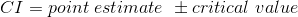
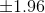
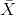
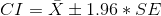
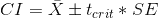
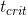
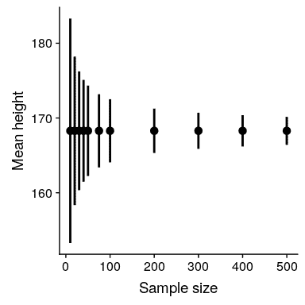

## 10.1 置信区间

到目前为止，我们在这本书中的重点是估计统计数据的具体值。例如，假设我们想估计 nhanes 数据集中成年人的平均体重。我们可以从数据集中提取一个样本并估计平均值：

```r
# take a sample from adults in NHANES and summarize their weight

sampSize <- 250
NHANES_sample <- sample_n(NHANES_adult, sampSize)

sample_summary <-
  NHANES_sample %>%
  summarize(
    meanWeight = mean(Weight),
    sdWeight = sd(Weight)
  )
pander(sample_summary)
```

<colgroup><col style="width: 18%"> <col style="width: 13%"></colgroup> 
| 平均重量 | S 重量 |
| --- | --- |
| 82.77 美元 | 22.27 条 |

在这个样本中，平均重量是 82.77 千克。我们将其称为 _ 点估计 _，因为它为我们提供了一个描述差异的单一数字。然而，我们从前面对抽样误差的讨论中知道，这个估计有一些不确定性，用标准误差来描述。您还应该记住，标准误差由两个部分决定：总体标准偏差（分子）和样本大小的平方根（分母）。总体标准偏差是一个未知但固定的参数，不在我们的控制范围内，而样本量 _ 在我们的控制范围内。因此，我们可以通过增加样本量来降低估计的不确定性——达到整个群体规模的极限，此时完全没有不确定性，因为我们可以直接从整个群体的数据中计算群体参数。_

您可能还记得之前我们引入了 _ 置信区间 _ 的概念，这是一种描述统计估计不确定性的方法。请记住，置信区间描述了一个平均包含给定概率的真实总体参数的区间；例如，95%置信区间是一个将捕获 95%时间的真实总体参数的区间。请再次注意，这不是关于填充参数的语句；任何特定的置信区间都包含或不包含真参数。正如信任区间的发明者 Jerzy Neyman 所说：

> “参数是一个未知常数，不能对其值作出概率陈述。”（J Neyman 1937）

平均值的置信区间计算如下：



其中临界值由估计值的抽样分布确定。那么，重要的问题是抽样分布是什么。

### 10.1.1 使用正态分布的置信区间

如果我们知道总体标准差，那么我们可以用正态分布来计算置信区间。我们通常不这样做，但对于我们的 nhanes 数据集示例，我们这样做（重量为 21.3）。

假设我们要计算平均值的 95%置信区间。临界值将是标准正态分布的值，它捕获了 95%的分布；这些仅仅是分布的 2.5%和 97.5%，我们可以使用 r 中的`qnorm()`函数计算得出。因此，平均值（）的置信区间为：



利用样本（82.77）的估计平均值和已知的总体标准差，我们可以计算出[80.13,85.41]的置信区间。

### 10.1.2 使用 t 分布的置信区间

如上所述，如果我们知道总体标准差，那么我们可以使用正态分布来计算我们的置信区间。但是，一般情况下，我们不会——在这种情况下，_t_ 分布更适合作为采样分布。记住，t 分布比正态分布略宽，特别是对于较小的样本，这意味着置信区间将比我们使用正态分布时的置信区间略宽。这包含了当我们基于小样本得出结论时产生的额外不确定性。

我们可以用类似于上述正态分布的方法计算 95%的置信区间，但临界值是由 _t_ 分布的 2.5%和 97.5%确定的，我们可以用 r 中的`qt()`函数计算，因此平均值（）的 ence 间隔为：



其中是临界 t 值。对于 nhanes 权重示例（样本大小为 250），置信区间为：

```r
# compute confidence intervals for weight in NHANES data

sample_summary <-
  sample_summary %>%
  mutate(
    cutoff_lower = qt(0.025, sampSize),
    cutoff_upper = qt(0.975, sampSize),
    CI_lower = meanWeight + cutoff_lower * sdWeight / sqrt(sampSize),
    CI_upper = meanWeight + cutoff_upper * sdWeight / sqrt(sampSize)
  )
pander(sample_summary)
```

<colgroup><col style="width: 17%"> <col style="width: 14%"> <col style="width: 19%"> <col style="width: 19%"> <col style="width: 14%"> <col style="width: 14%"></colgroup> 
| meanWeight | sdWeight | 切断阀 | 上切断 | Ci_ 下 | Ci_ 上部 |
| --- | --- | --- | --- | --- | --- |
| 82.77 | 22.27 | -1.97 条 | 1.97 条 | 80 | 85.54 美元 |

请记住，这并不能告诉我们关于真实总体值在这个区间内的概率，因为它是一个固定参数（我们知道它是 81.77，因为在这种情况下我们有整个总体），并且它或者不在这个特定区间内（i 在这种情况下，确实如此）。相反，它告诉我们，从长远来看，如果我们使用这个过程计算置信区间，95%的置信区间将捕获真正的总体参数。

### 10.1.3 置信区间和样本量

由于标准误差随样本量的减小而减小，平均置信区间应随着样本量的增大而变窄，从而为我们的估计提供了越来越严格的界限。图[10.1](#fig:CISampSize)显示了置信区间将如何作为权重示例的样本大小函数而变化的示例。从图中可以明显看出，随着样本量的增加，置信区间变得越来越紧，但是增加样本会产生递减的回报，这与置信区间项的分母与样本量的平方根成正比的事实相一致。E.



图 10.1 样本量对平均值置信区间宽度影响的示例。

### 10.1.4 使用引导程序计算置信区间

在某些情况下，我们不能假定正态性，或者我们不知道统计的抽样分布。在这些情况下，我们可以使用引导程序（我们在[8](#resampling-and-simulation)章中介绍了它）。作为提醒，引导程序需要重复地用替换项对数据 _ 进行重采样，然后使用这些样本上计算的统计分布作为统计分布的抽样代理。_

早些时候，我们使用手工编写的代码运行引导程序，但是 R 包含一个名为`boot`的包，我们可以使用它运行引导程序并计算置信区间。让我们用它来计算 nhanes 样本中权重的置信区间。

```r
# compute bootstrap confidence intervals on NHANES weight data

meanWeight <- function(df, foo) {
  return(mean(df[foo, ]$Weight))
}

bs <- boot(NHANES_sample, meanWeight, 1000)

# use the percentile bootstrap
bootci <- boot.ci(bs, type = "perc")
print("Bootstrap confidence intervals:")
```

```r
## [1] "Bootstrap confidence intervals:"
```

```r
tibble(
  lower = bootci$perc[4],
  upper = bootci$perc[5]
) %>%
  pander()
```

<colgroup><col style="width: 11%"> <col style="width: 11%"></colgroup> 
| 降低 | 上面的 |
| --- | --- |
| 第 80.12 条 | 85.71 美元 |

这些值与使用上面的 t 分布得到的值相当接近，尽管不完全相同。

### 10.1.5 置信区间与假设检验的关系

置信区间与假设检验有着密切的关系。尤其是，如果置信区间不包括无效假设，那么相关的统计检验将具有统计学意义。例如，如果您使用测试样本的平均值是否大于零，您可以简单地检查是否在平均值的 95%置信区间内包含零。

如果我们想比较两个条件的平均值，事情会变得更棘手（Schenker 和绅士 2001）。有几个情况是清楚的。首先，如果每个均值都包含在另一个均值的置信区间内，那么在所选置信水平上肯定没有显著差异。其次，如果置信区间之间没有重叠，那么在所选水平上肯定存在显著差异；事实上，该测试基本上是 _ 保守 _，因此实际误差率将低于所选水平。但是，如果置信区间彼此重叠，但不包含另一组的平均值，情况会怎样呢？在这种情况下，答案取决于两个变量的相对可变性，没有一般的答案。一般来说，我们应该避免对重叠的置信区间使用“视觉测试”，因为它通常会导致较高的假阴性（II 型）错误率。