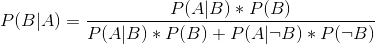

## 11.3 进行贝叶斯估计

我们最终希望使用贝叶斯统计来测试假设，但是在我们这样做之前，我们需要估计测试假设所需的参数。这里我们将介绍贝叶斯估计的过程。让我们用另一个筛选示例：机场安全筛选。如果你像我一样经常飞行，那么在随机爆炸物筛选结果恢复正常之前只是个时间问题；2001 年 9 月 11 日之后不久，当机场保安人员特别紧张时，我有过这种特别不幸的经历。

安全人员想知道的是，考虑到机器进行了正面测试，一个人携带爆炸物的可能性是多少。让我们来介绍一下如何使用贝叶斯分析计算这个值。

### 11.3.1 规定

为了使用贝叶斯定理，我们首先需要为假设指定先验概率。在这种情况下，我们不知道实数，但我们可以假设它很小。根据[联邦航空局](https://www.faa.gov/air_traffic/by_the_numbers/media/Air_Traffic_by_the_Numbers_2018.pdf)，2017 年美国有 971595898 名乘客。在这个例子中，假设有一个旅行者的包里装着炸药

```r
prior <- 1/971595898
```

### 11.3.2 收集一些数据

数据由炸药筛选试验结果组成。让我们假设安全人员通过他们的测试设备运行了 10 次袋子，它给出了 10 次测试中 9 次的正读数。

```r
nTests <- 10
nPositives <- 9
```

### 11.3.3 计算可能性

我们要在假设袋中有炸药的情况下计算数据的可能性。假设我们知道测试的灵敏度是 0.99——也就是说，当一个设备存在时，它将 99%的时间检测到它。为了确定在设备存在的假设下数据的可能性，我们可以将每个测试视为伯努利试验（即结果为真或假的试验），成功概率为 0.99，我们可以使用二项式分布来建模。

```r
likelihood <- dbinom(nPositives, nTests, 0.99)
likelihood
```

```r
## [1] 0.091
```

### 11.3.4 计算边际可能性

我们还需要知道数据的总体可能性——也就是说，在 10 个测试中找出 9 个阳性。计算边际似然性通常是贝叶斯分析中最困难的方面之一，但对于我们的例子来说，这很简单，因为我们可以利用我们在[3.7 节](#bayestheorem)中介绍的贝叶斯定理的具体形式：



在这种情况下，边际可能性是存在或不存在爆炸物时数据可能性的加权平均值，乘以存在爆炸物的概率（即先验概率）。在这种情况下，假设我们知道测试的特异性是 0.9，这样当没有爆炸物时，阳性结果的可能性是 0.1。

我们可以用 r 计算，如下所示：

```r
marginal_likelihood <- 
  dbinom(
    x = nPositives, 
    size = nTests, 
    prob = 0.99
  ) * prior + 
  dbinom(
    x = nPositives, 
    size = nTests, 
    prob = .1
  ) * 
  (1 - prior)

sprintf("marginal likelihood = %.3e", marginal_likelihood)
```

```r
## [1] "marginal likelihood = 9.094e-09"
```

### 11.3.5 计算后部

我们现在有了所有需要计算炸药存在后验概率的部分，假设在 10 个测试中观察到 9 个阳性结果。

```r
posterior <- (likelihood * prior) / marginal_likelihood
posterior
```

```r
## [1] 0.01
```

这一结果表明，袋中爆炸物的概率远高于之前的概率，但几乎不确定，再次强调了一个事实，即测试罕见事件几乎总是容易产生大量的假阳性。