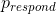
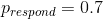
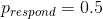
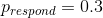
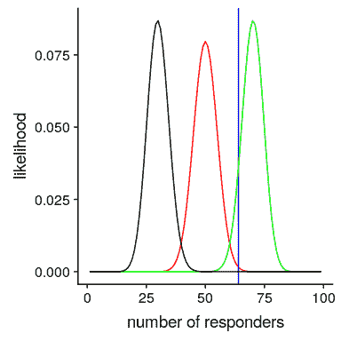
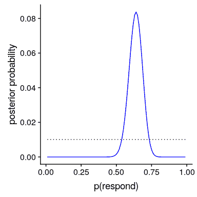
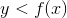
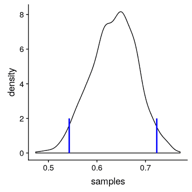
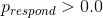
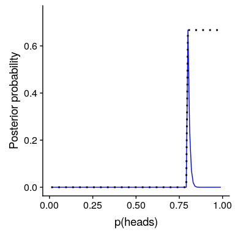

## 11.4 估计后验分布

在前一个例子中，只有两种可能的结果——爆炸物要么在那里，要么不在那里——我们想知道给出数据后，哪种结果最有可能。但是，在其他情况下，我们希望使用贝叶斯估计来估计参数的数值。比如说，我们想知道一种新的止痛药的有效性；为了测试这一点，我们可以给一组病人服用这种药物，然后询问他们服用这种药物后疼痛是否有所改善。我们可以使用贝叶斯分析来估计药物对谁有效的比例。

### 11.4.1 规定

在这种情况下，我们没有任何关于药物有效性的先验信息，因此我们将使用 _ 均匀分布 _ 作为先验值，因为所有值在均匀分布下都是相同的。为了简化示例，我们将只查看 99 个可能有效性值的子集（从.01 到.99，步骤为.01）。因此，每个可能值的先验概率为 1/99。

### 11.4.2 收集一些数据

我们需要一些数据来估计药物的效果。假设我们给 100 个人用药，结果如下：

```r
# create a table with results
nResponders <- 64
nTested <- 100

drugDf <- tibble(
  outcome = c("improved", "not improved"),
  number = c(nResponders, nTested - nResponders)
)
pander(drugDf)
```

<colgroup><col style="width: 20%"> <col style="width: 11%"></colgroup> 
| 结果 | 数 |
| --- | --- |
| 改进 | 64 个 |
| 没有改善 | 36 岁 |

### 11.4.3 计算可能性

我们可以使用 r 中的`dbinom()`函数计算有效性参数的任何特定值下的数据的可能性。在图[11.1](#fig:like2)中，您可以看到响应器数量对几个不同值的可能性曲线。从这一点来看，我们观察到的数据在假设下的可能性相对较大，在假设下的可能性相对较小，在假设下的可能性相对较小。贝叶斯推理的一个基本思想是，我们将试图找到我们感兴趣的参数的值，这使得数据最有可能，同时也考虑到我们的先验知识。



图 11.1 几个不同假设下每个可能数量的应答者的可能性（P（应答）=0.5（红色），0.7（绿色），0.3（黑色）。观察值以蓝色显示。

### 11.4.4 计算边际可能性

除了不同假设下数据的可能性外，我们还需要知道数据的总体可能性，并结合所有假设（即边际可能性）。这种边际可能性主要是重要的，因为它有助于确保后验值是真实概率。在这种情况下，我们使用一组离散的可能参数值使得计算边际似然变得容易，因为我们只需计算每个假设下每个参数值的似然，并将它们相加。

```r
# compute marginal likelihood
likeDf <- 
  likeDf %>%
  mutate(uniform_prior = array(1 / n()))

# multiply each likelihood by prior and add them up
marginal_likelihood <- 
  sum(
    dbinom(
      x = nResponders, # the number who responded to the drug
      size = 100, # the number tested
      likeDf$presp # the likelihood of each response 
    ) * likeDf$uniform_prior
  )

sprintf("marginal likelihood = %0.4f", marginal_likelihood)
```

```r
## [1] "marginal likelihood = 0.0100"
```

### 11.4.5 计算后部

我们现在有了所有需要计算所有可能值的后验概率分布的部分，如图[11.2](#fig:posteriorDist)所示。

```r
# Create data for use in figure
bayesDf <-
  tibble(
    steps = seq(from = 0.01, to = 0.99, by = 0.01)
  ) %>%
  mutate(
    likelihoods = dbinom(
      x = nResponders, 
      size = 100, 
      prob = steps
    ),
    priors = dunif(steps) / length(steps),
    posteriors = (likelihoods * priors) / marginal_likelihood
  )
```



图 11.2 蓝色后验概率分布图与均匀前验概率分布图（黑色虚线）。

### 11.4.6 最大后验概率（MAP）估计

根据我们的数据，我们希望获得样本的估计值。一种方法是找到后验概率最高的值，我们称之为后验概率（map）估计的 _ 最大值。我们可以从[11.2](#fig:posteriorDist)中的数据中找到：_

```r
# compute MAP estimate
MAP_estimate <- 
  bayesDf %>% 
  arrange(desc(posteriors)) %>% 
  slice(1) %>% 
  pull(steps)

sprintf("MAP estimate = %0.4f", MAP_estimate)
```

```r
## [1] "MAP estimate = 0.6400"
```

请注意，这只是样本中反应者的比例——这是因为之前的反应是一致的，因此没有影响我们的反应。

### 11.4.7 可信区间

通常我们想知道的不仅仅是对后位的单一估计，而是一个我们确信后位下降的间隔。我们之前讨论过频繁推理背景下的置信区间概念，您可能还记得，置信区间的解释特别复杂。我们真正想要的是一个区间，在这个区间中，我们确信真正的参数会下降，而贝叶斯统计可以给我们一个这样的区间，我们称之为 _ 可信区间 _。

在某些情况下，可信区间可以根据已知的分布用数字 _ 计算，但从后验分布中取样，然后计算样本的分位数更常见。当我们没有一个简单的方法来用数字表示后验分布时，这是特别有用的，在实际的贝叶斯数据分析中经常是这样。_

我们将使用一个简单的算法从我们的后验分布中生成样本，该算法被称为[_ 拒绝抽样 _](https://am207.github.io/2017/wiki/rejectionsampling.html)。我们的想法是从一个均匀分布中选择 x 的随机值（在本例中为）和 y 的随机值（在本例中为的后验概率）。然后，只有在—这种情况下，如果随机选择的 y 值小于 y 的实际后验概率，我们才接受样本。图[11.3](#fig:rejectionSampling)显示了使用拒绝抽样的样本的直方图示例，以及使用 th 获得的 95%可信区间。是方法。

```r
# Compute credible intervals for example

nsamples <- 100000

# create random uniform variates for x and y
x <- runif(nsamples)
y <- runif(nsamples)

# create f(x)
fx <- dbinom(x = nResponders, size = 100, prob = x)

# accept samples where y < f(x)
accept <- which(y < fx)
accepted_samples <- x[accept]

credible_interval <- quantile(x = accepted_samples, probs = c(0.025, 0.975))
pander(credible_interval)
```

<colgroup><col style="width: 9%"> <col style="width: 9%"></colgroup> 
| 2.5% | 98% |
| --- | --- |
| 0.54 分 | 0.72 分 |



图 11.3 拒绝抽样示例。黑线表示 P（响应）所有可能值的密度；蓝线表示分布的 2.5%和 97.5%，表示 P（响应）估计的 95%可信区间。

这个可信区间的解释更接近于我们希望从置信区间（但不能）中得到的结果：它告诉我们，95%的概率的值介于这两个值之间。重要的是，它表明我们对有很高的信心，这意味着该药物似乎有积极的效果。

### 11.4.8 不同先验的影响

在上一个例子中，我们在之前使用了 _ 平面，这意味着我们没有任何理由相信的任何特定值或多或少是可能的。然而，假设我们是从一些以前的数据开始的：在之前的一项研究中，研究人员测试了 20 个人，发现其中 10 个人的反应是积极的。这将引导我们从先前的信念开始，即治疗对 50%的人有效果。我们可以做与上面相同的计算，但是使用我们以前的研究中的信息来通知我们之前的研究（参见图[11.4](#fig:posteriorDistPrior)）。_

```r
# compute likelihoods for data under all values of p(heads) 
# using a flat or empirical prior.  
# here we use the quantized values from .01 to .99 in steps of 0.01

df <-
  tibble(
    steps = seq(from = 0.01, to = 0.99, by = 0.01)
  ) %>%
  mutate(
    likelihoods = dbinom(nResponders, 100, steps),
    priors_flat = dunif(steps) / sum(dunif(steps)),
    priors_empirical = dbinom(10, 20, steps) / sum(dbinom(10, 20, steps))
  )

marginal_likelihood_flat <- 
  sum(dbinom(nResponders, 100, df$steps) * df$priors_flat)

marginal_likelihood_empirical <- 
  sum(dbinom(nResponders, 100, df$steps) * df$priors_empirical)

df <- 
  df %>%
  mutate(
    posteriors_flat = 
      (likelihoods * priors_flat) / marginal_likelihood_flat,
    posteriors_empirical = 
      (likelihoods * priors_empirical) / marginal_likelihood_empirical
  )
```


图 11.4 先验对后验分布的影响。基于平坦先验的原始后验分布用蓝色绘制。根据对 20 人中 10 名反应者的观察，先验者被画成黑色虚线，后验者被画成红色。

注意，可能性和边际可能性并没有改变——只有先前的改变。手术前改变的效果是将后路拉近新手术前的质量，中心为 0.5。

现在，让我们看看如果我们以一个更强大的先验信念来进行分析会发生什么。假设之前的研究没有观察到 20 人中有 10 人有反应，而是测试了 500 人，发现 250 人有反应。原则上，这应该给我们一个更强大的先验，正如我们在图[11.5](#fig:strongPrior)中所看到的，这就是发生的事情：先验的集中度要高出 0.5 左右，后验的集中度也更接近先验。一般的观点是贝叶斯推理将先验信息和似然信息结合起来，并对每一种推理的相对强度进行加权。

```r
# compute likelihoods for data under all values of p(heads) using strong prior.

df <-
  df %>%
  mutate(
    priors_strong = dbinom(250, 500, steps) / sum(dbinom(250, 500, steps))
  )

marginal_likelihood_strong <- 
  sum(dbinom(nResponders, 100, df$steps) * df$priors_strong)

df <-
  df %>%
  mutate(
    posteriors_strongprior = (likelihoods * priors_strong) / marginal_likelihood_strong
  )
```


图 11.5：前向强度对后向分布的影响。蓝线显示了 100 人中 50 个人头使用先验图获得的后验图。虚线黑线显示的是 500 次翻转中 250 个头部的先验图像，红线显示的是基于先验图像的后验图像。

这个例子也突出了贝叶斯分析的顺序性——一个分析的后验可以成为下一个分析的前验。

最后，重要的是要认识到，如果先验足够强，它们可以完全压倒数据。假设你有一个绝对先验，它等于或大于 0.8，这样你就把所有其他值的先验概率设置为零。如果我们计算后验，会发生什么？

```r
# compute likelihoods for data under all values of p(respond) using absolute prior. 
df <-
  df %>%
  mutate(
    priors_absolute = array(data = 0, dim = length(steps)),
    priors_absolute = if_else(
      steps >= 0.8,
      1, priors_absolute
    ),
    priors_absolute = priors_absolute / sum(priors_absolute)
  )

marginal_likelihood_absolute <- 
  sum(dbinom(nResponders, 100, df$steps) * df$priors_absolute)

df <-
  df %>%
  mutate(
    posteriors_absolute = 
      (likelihoods * priors_absolute) / marginal_likelihood_absolute
  )
```



图 11.6：前向强度对后向分布的影响。蓝线表示使用绝对先验得到的后验值，表示 P（响应）大于等于 0.8。前面的内容显示在黑色虚线中。

在图[11.6](#fig:absolutePrior)中，我们发现，在先前设置为零的任何值的后面都存在零密度-数据被绝对先前覆盖。