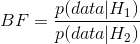
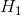
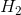
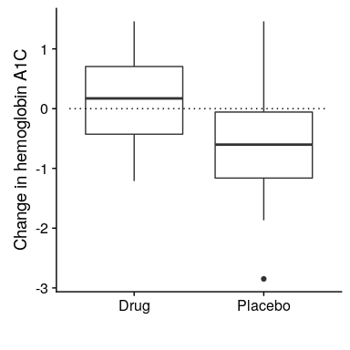

## 11.6 贝叶斯假设检验

在学习了如何执行贝叶斯估计之后，我们现在转向使用贝叶斯方法进行假设检验。假设有两位政治家对公众是否支持死刑持不同的看法。史密斯参议员认为只有 40%的人支持死刑，而琼斯参议员认为 60%的人支持死刑。他们安排了一个民意测验来测试这一点，随机抽取 1000 人，询问他们是否支持死刑。调查结果显示，在接受调查的样本中，490 人支持死刑。基于这些数据，我们想知道：这些数据支持一位参议员对另一位参议员的主张吗？我们可以使用一个名为[贝叶斯因子](https://bayesfactor.blogspot.com/2014/02/the-bayesfactor-package-this-blog-is.html)的概念来测试这一点。

### 11.6.1 贝叶斯因子

贝叶斯因子表征了两种不同假设下数据的相对似然性。定义如下：



对于两个假设和。对于我们的两位参议员，我们知道如何使用二项分布计算每个假设下数据的可能性。我们将把史密斯参议员作为分子，琼斯参议员作为分母，这样一个大于一的值将为史密斯参议员反映出更多的证据，而一个小于一的值将为琼斯参议员反映出更多的证据。

```r
# compute Bayes factor for Smith vs. Jones

bf <-
  dbinom(
    x = 490,
    size = 1000,
    prob = 0.4 #Smith's hypothesis
  ) / dbinom(
    x = 490, 
    size = 1000, 
    prob = 0.6 #Jones' hypothesis
  )

sprintf("Bayes factor = %0.2f", bf)
```

```r
## [1] "Bayes factor = 3325.26"
```

这个数字提供了数据提供的关于两个假设的证据的度量——在本例中，它告诉我们数据支持史密斯参议员的力度是他们支持琼斯参议员的 3000 倍。

### 11.6.2 统计假设的贝叶斯因子

在前一个例子中，我们有来自每个参议员的具体预测，这些预测的可能性我们可以用二项分布来量化。然而，在实际数据分析中，我们通常必须处理参数的不确定性，这会使贝叶斯因子复杂化。然而，作为交换，我们获得了量化相对数量的证据的能力，支持无效假设与替代假设。

假设我们是一名医学研究人员，正在进行糖尿病治疗的临床试验，我们希望知道与安慰剂相比，某种药物是否能降低血糖。我们招募了一组志愿者，将他们随机分配到药物组或安慰剂组，并在给药或安慰剂期间测量各组血红蛋白 A1c（血糖水平的一个标记）的变化。我们想知道的是：药物和安慰剂之间有区别吗？

首先，让我们生成一些数据，并使用空假设测试对其进行分析（参见图[11.7](#fig:bayesTesting)）。

```r
# create simulated data for drug trial example

set.seed(123456)
nsubs <- 40
effect_size <- 0.1

# randomize indiviuals to drug (1) or placebo (0)
drugDf <-
  tibble(
    group = as.integer(runif(nsubs) > 0.5)
  ) %>%
  mutate(
    hbchange = rnorm(nsubs) - group * effect_size
  )
```



图 11.7 显示药物和安慰剂组数据的方框图。

让我们进行一个独立的样本 t 检验，这表明两组之间存在显著差异：

```r
# compute t-test for drug example
drugTT <- t.test(hbchange ~ group, alternative = "greater", data = drugDf)
print(drugTT)
```

```r
## 
##  Welch Two Sample t-test
## 
## data:  hbchange by group
## t = 2, df = 40, p-value = 0.03
## alternative hypothesis: true difference in means is greater than 0
## 95 percent confidence interval:
##  0.096   Inf
## sample estimates:
## mean in group 0 mean in group 1 
##            0.12           -0.48
```

这个测试告诉我们，两组之间存在显著的差异，但是它并不能量化证据支持无效假设和替代假设的强度。为了测量这一点，我们可以使用 r 中 bayes factor 包中的`ttestBF`函数计算贝叶斯因子：

```r
# compute Bayes factor for drug data
bf_drug <- ttestBF(
  formula = hbchange ~ group, data = drugDf,
  nullInterval = c(0, Inf)
)

bf_drug
```

```r
## Bayes factor analysis
## --------------
## [1] Alt., r=0.707 0<d<Inf    : 2.4  ±0%
## [2] Alt., r=0.707 !(0<d<Inf) : 0.12 ±0%
## 
## Against denominator:
##   Null, mu1-mu2 = 0 
## ---
## Bayes factor type: BFindepSample, JZS
```

这里的贝叶斯因子告诉我们，替代假设（即差异大于零）比给定数据的点零假设（即平均差为零）的可能性高出 2.4 倍。

#### 11.6.2.1 单侧试验

我们通常对针对特定点值（例如，平均差=0）的零假设进行测试的兴趣低于针对定向零假设（例如，差小于或等于零）进行测试的兴趣。我们也可以使用`ttestBF`分析的结果进行定向（或 _ 单边 _）测试，因为它提供了两个 Bayes 因素：一个是平均差大于零的替代假设，另一个是平均差为 l 的替代假设。小于零。如果我们想评估正效应的相对证据，我们可以通过简单地将返回的两个 Bayes 因子除以函数来计算 Bayes 因子，比较正效应和负效应的相对证据：

```r
bf_drug[1]/bf_drug[2]
```

```r
## Bayes factor analysis
## --------------
## [1] Alt., r=0.707 0<d<Inf : 20 ±0%
## 
## Against denominator:
##   Alternative, r = 0.707106781186548, mu =/= 0 !(0<d<Inf) 
## ---
## Bayes factor type: BFindepSample, JZS
```

现在我们看到，正效应和负效应的贝叶斯因子大得多（接近 20）。

#### 11.6.2.2 解释贝叶斯因子

我们如何知道 2 或 20 的贝叶斯因子是好是坏？[Kass&Rafferty（1995）](https://www.andrew.cmu.edu/user/kk3n/simplicity/KassRaftery1995.pdf)提出了一个解释 Bayes 因子的一般准则：

| 高炉 | 证据的效力 |
| --- | --- |
| 1 到 3 | 只值得一提 |
| 3 至 20 | 积极的 |
| 20 至 150 | 坚强的 |
| &150 英镑 | 非常强壮 |

在此基础上，尽管统计结果是显著的，但支持替代假设与点零假设的证据数量足够弱，甚至不值得一提，而方向假设的证据是积极的，但不太强。

### 11.6.3 评估无效假设的证据

因为 Bayes 因子正在比较两个假设的证据，它还允许我们评估是否有支持空假设的证据，而标准的空假设测试无法做到这一点（因为它从空值为真的假设开始）。这对于确定一个非重大的结果是否真的提供了有力的证据证明没有效果，或者只是反映了总体上的薄弱证据是非常有用的。