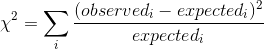
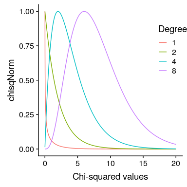
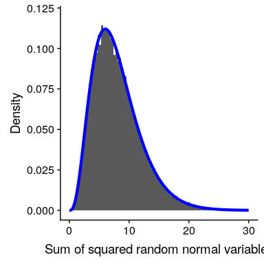

## 12.2 皮尔逊卡方检验

皮尔逊卡方检验为我们提供了一种方法来检验观察到的计数数据是否与定义零假设的某些特定预期值不同：



在我们的糖果例子中，无效假设是每种糖果的比例是相等的。我们可以计算我们观察到的糖果计数的卡方统计，如下所示：

```r
# compute chi-squared statistic

nullExpectation <- c(1 / 3, 1 / 3, 1 / 3) * sum(candyDf$count)

chisqVal <- 
  sum(
    ((candyDf$count - nullExpectation)**2) / nullExpectation
  )
```

这个分析的卡方统计结果是 0.74，这本身是不可解释的，因为它取决于加在一起的不同值的数量。然而，我们可以利用这样一个事实：卡方统计量是根据零假设下的特定分布分布分布的，这就是所谓的 _ 卡方 _ 分布。这种分布被定义为一组标准正态随机变量的平方和；它有若干自由度，等于被加在一起的变量数。分布的形状取决于自由度的数量。图[12.1](#fig:chisqDist)显示了几种不同自由度的分布示例。



图 12.1 不同自由度的卡方分布示例。

让我们通过模拟来验证卡方分布是否准确地描述了一组标准正态随机变量的平方和。

```r
# simulate 50,000 sums of 8 standard normal random variables and compare
# to theoretical chi-squared distribution

# create a matrix with 50k columns of 8 rows of squared normal random variables
d <- replicate(50000, rnorm(n = 8, mean = 0, sd = 1)**2) 
# sum each column of 8 variables
dMean <- apply(d, 2, sum)

# create a data frame of the theoretical chi-square distribution 
# with 8 degrees of freedom
csDf <-
  data.frame(x = seq(0.01, 30, 0.01)) %>%
  mutate(chisq = dchisq(x, 8))
```

图[12.2](#fig:chisqSim)显示，理论分布与重复将一组随机正态变量的平方相加的模拟结果非常吻合。



图 12.2 平方随机正态变量和的模拟。柱状图是基于 5 万组 8 个随机正态变量的平方和；蓝线显示了 8 个自由度下理论卡方分布的值。

对于糖果的例子，我们可以计算在所有糖果的相同频率的零假设下，我们观察到的卡方值为 0.74 的可能性。我们使用自由度等于 k-1（其中 k=类别数）的卡方分布，因为我们在计算平均值以生成预期值时失去了一个自由度。

```r
pval <- pchisq(chisqVal, df = 2, lower.tail = FALSE) #df = degrees of freedom
sprintf("p-value = %0.3f", pval)
```

```r
## [1] "p-value = 0.691"
```

这表明，观察到的糖果数量并不是特别令人惊讶的，基于印刷在糖果袋上的比例，我们不会拒绝等比的无效假设。