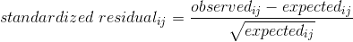
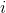

## 12.4 标准化残差

当我们发现卡方检验的显著效果时，这告诉我们，在无效假设下，数据是不可能的，但它并没有告诉我们 _ 数据有什么不同。为了更深入地了解数据与我们在零假设下预期的差异，我们可以检查模型的残差，该残差反映了数据（即观察到的频率）与每个单元中模型的偏差（即预期频率）。而不是查看原始残差（仅根据数据中观察的数量而变化），更常见的是查看其他 _ 标准化残差 _，其计算如下：_



其中和分别是行和列的索引。我们可以为警察局的数据计算这些数据：

```r
# compute standardized residuals
summaryDf2way <- 
  summaryDf2way %>% 
  mutate(stdRes = (n - expected)/sqrt(expected))

pander(summaryDf2way)
```

<colgroup><col style="width: 15%"> <col style="width: 19%"> <col style="width: 12%"> <col style="width: 15%"> <col style="width: 16%"> <col style="width: 11%"></colgroup> 
| 已搜索 | 车手比赛 | N 号 | 预期 | 标准平方差 | 标准普尔 |
| --- | --- | --- | --- | --- | --- |
| 错误的 | 黑色 | 36244 个 | 36883.67 个 | 2009 年 11 月 | -3.33 条 |
| 真的 | Black | 1219 年 | 579.33 条 | 第 706.31 条 | 26.58 美元 |
| FALSE | 白色 | 239241 个 | 238601.3 条 | 1.71 条 | 1.31 条 |
| TRUE | White | 3108 个 | 3747.67 美元 | 109.18 条 | -10.45 美元 |

这些标准化的残差可以解释为 z 分数——在这种情况下，我们看到，基于独立性，对黑人个体的搜索次数大大高于预期，而对白人个体的搜索次数大大低于预期。这为我们提供了解释显著的卡方结果所需的上下文。