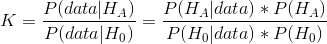

## 12.6 贝叶斯系数



我们在关于贝叶斯统计的前一章中讨论了贝叶斯因子——你可能记得它代表了两种假设下数据的可能性比：贝叶斯因子在某种程度上类似于 p 值和影响大小，也就是说它们的解释是某种意义上的。t 主观。他们的解释有各种各样的指导方针——这是来自 Kass 和 Raftery（1995）的一个：

| 高炉 | 解释 |
| --- | --- |
| 1 到 3 | 不值得一提 |
| 3 至 20 | 积极的 |
| 20 至 150 | 坚强的 |
| 150 及以上 | 非常强壮 |

我们可以使用 BayesFactor 包中的`contingencyTableBF()`函数计算警察搜索数据的 Bayes 因子：

```r
# compute Bayes factor 
# using independent multinomial sampling plan in which row totals (driver race)
# are fixed

bf <- 
  contingencyTableBF(as.matrix(summaryDf2wayTable),
  sampleType = "indepMulti",
  fixedMargin = "cols"
)
bf
```

```r
## Bayes factor analysis
## --------------
## [1] Non-indep. (a=1) : 1.8e+142 ±0%
## 
## Against denominator:
##   Null, independence, a = 1 
## ---
## Bayes factor type: BFcontingencyTable, independent multinomial
```

这表明，在这个数据集中，支持驾驶员种族和警察搜索之间关系的证据非常有力。