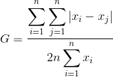
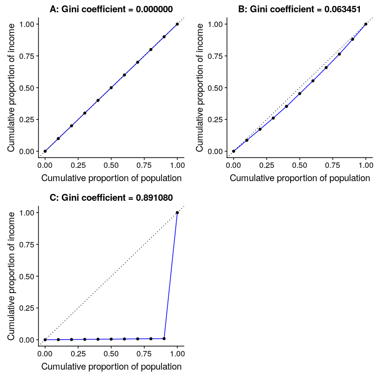

## 13.1 一个例子：仇恨犯罪和收入不平等

2017 年，网站 fivethirtyeight.com 发表了一篇题为“仇恨犯罪率上升与收入不平等（htg1）”的文章，讨论了 2016 年总统选举后仇恨犯罪率与收入不平等之间的关系。报道分析了来自联邦调查局和南方贫困法中心的仇恨犯罪数据，并据此报告：

> “我们发现，收入不平等是全美国调整人口仇恨犯罪和仇恨事件的最重要决定因素”。

此分析的数据包含在`fivethirtyeight`r 包中，这使得我们很容易访问它们。报道中的分析集中在收入不平等（定义为一个叫做 _ 基尼指数 _ 的量）与各州仇恨犯罪流行率之间的关系。

### 13.1.1 量化不平等：基尼指数

在我们查看报道中的分析之前，首先要了解如何使用基尼指数来量化不平等。基尼指数通常用一条曲线来定义，这条曲线描述了收入与收入水平等于或小于该水平的人口比例之间的关系，称为 _ 洛伦兹曲线 _。然而，另一种更直观的思考方式是：收入之间的相对平均绝对差异除以二（摘自[https://en.wikipedia.org/wiki/gini_coefficient](https://en.wikipedia.org/wiki/Gini_coefficient)）：

图 13.1 洛伦兹曲线表示 a）完全平等，b）正态分布收入，c）高度不平等（除一个非常富有的个人外，收入相等）。

图[13.1](#fig:gini0)显示了几种不同收入分配的洛伦兹曲线。左上方的面板（A）显示了一个例子，其中有 10 个人，每个人的收入完全相同。两个点之间的间隔长度相等，表明每个人在总收入中所占的份额相同。右上角的面板（B）显示了一个收入正态分布的例子。左下角的面板显示了一个不平等程度很高的例子：每个人的收入都是平等的（40000 美元），只有一个人的收入是 40000000 美元。根据美国人口普查，2010 年美国的基尼指数为 0.469，大约在我们的正态分布和最大不相等的例子之间下降了一半。