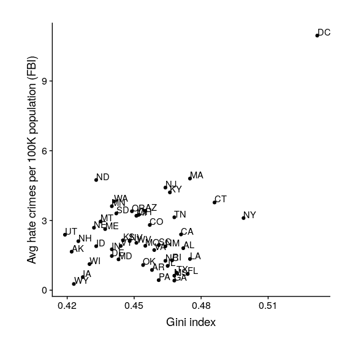

## 13.2 收入不平等是否与仇恨犯罪有关？

现在我们了解了基尼指数，我们可以看看收入不平等与仇恨犯罪率之间的关系（见图[13.2](#fig:hateCrimeGini)）。

```r
hateCrimes <- 
  hate_crimes %>%
  mutate(state_abb = state.abb[match(state,state.name)]) %>%
  drop_na(avg_hatecrimes_per_100k_fbi)

hateCrimes$state_abb[hateCrimes$state=="District of Columbia"]='DC'

ggplot(hateCrimes,aes(gini_index,avg_hatecrimes_per_100k_fbi,label=state_abb)) +
  geom_point() + 
  geom_text(aes(label=state_abb),hjust=0, vjust=0) +
  theme(plot.title = element_text(size = 20, face = "bold")) +
  xlab('Gini index') + 
  ylab('Avg hate crimes per 100K population (FBI)') +
  theme(plot.margin = unit(c(1,1,1,1), "cm"))
```



图 13.2 仇恨犯罪率与基尼指数的关系图。

从数据来看，这两个变量之间似乎有一个正的关系。我们如何量化这种关系？