## 14.1 线性回归

我们还可以使用一般线性模型来描述两个变量之间的关系，并决定这种关系是否具有统计意义；此外，该模型允许我们在给定独立变量的一些新值的情况下预测因变量的值。最重要的是，一般线性模型将允许我们建立包含多个独立变量的模型，而相关性只能告诉我们两个独立变量之间的关系。

我们为此使用的 GLM 的特定版本称为 _ 线性回归 _。术语 _ 回归 _ 是由 Francis Galton 创造的，他注意到，当他比较父母和他们的孩子的某些特征（如身高）时，极端父母的孩子（即非常高或非常矮的父母）通常比他们的父母更接近平均值。这是非常重要的一点，我们将回到下面。

线性回归模型的最简单版本（具有单个独立变量）可以表示为：

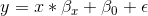

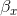值告诉我们，给定 x 中一个单位的变化，y 会发生多大的变化。截距是一个整体偏移量，它告诉我们当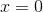时，y 会有多大的值；从我们早期的建模讨论中，您可能会记得，这对于建模过度非常重要。所有数据的大小，即使从未真正达到零。误差项指的是模型一旦被拟合后所剩下的一切。如果我们想知道如何预测 y（我们称之为），那么我们可以删除错误项：

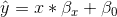

图[14.2](#fig:LinearRegression)显示了应用于研究时间示例的此模型的示例。


图 14.2 研究时间数据的线性回归解用蓝色表示。当 x 变量等于零时，截距值等于 y 变量的预测值；这用虚线黑线表示。β值等于直线的斜率，也就是 x 单位变化的 y 变化量。红色虚线示意性地显示了这一点，它显示了学习时间单单位增加的年级增加程度。

### 14.1.1 回归平均值

回归到平均值的概念 _ 是 Galton 对科学的重要贡献之一，在我们解释实验数据分析结果时，它仍然是理解的关键点。假设我们想研究阅读干预对贫困读者表现的影响。为了验证我们的假设，我们可能会去一所学校，在一些阅读测试中招募那些分布在 25%最底层的人，进行干预，然后检查他们的表现。假设干预实际上没有效果，每个人的阅读分数只是来自正态分布的独立样本。我们可以模拟：_

```r
# create simulated data for regression to the mean example

nstudents <- 100 

readingScores <- data.frame(
  #random normal distribution of scores for test 1
  test1 = rnorm(n = nstudents, mean = 0, sd = 1) * 10 + 100, 
  #random normal distribution of scores for test 2
  test2 = rnorm(n = nstudents, mean = 0, sd = 1) * 10 + 100 
)

# select the students in the bottom 25% on the first test
cutoff <- quantile(readingScores$test1, 0.25)

readingScores <-
  readingScores %>%
  mutate(badTest1 = test1 < cutoff) %>% 
  dplyr::filter(badTest1 == TRUE) %>%
  summarize(
    test1mean = mean(test1),
    test2mean = mean(test2)
  ) %>%
  pander()
```

如果我们看看第一次和第二次考试的平均成绩之间的差异，似乎干预对这些学生有了很大的帮助，因为他们的分数在考试中提高了超过 10 分！然而，我们知道事实上，学生根本没有进步，因为在这两种情况下，分数只是从随机正态分布中选择的。事实上，一些受试者在第一次考试中由于随机的机会得分很低。如果我们只根据第一次考试的分数来选择这些科目，那么在第二次考试中，即使没有培训的效果，他们也会回到整个组的平均水平。这就是为什么我们需要一个未经治疗的对照组（htg0）来解释随时间变化的读数；否则我们很可能会被回归到平均值所欺骗。

### 14.1.2 估算线性回归参数

我们通常使用 _ 线性代数 _ 从数据中估计线性模型的参数，这是应用于向量和矩阵的代数形式。如果你不熟悉线性代数，不用担心——你实际上不需要在这里使用它，因为 R 将为我们做所有的工作。然而，线性代数中的一个简短的偏移可以提供一些关于模型参数如何在实践中估计的见解。

首先，让我们介绍向量和矩阵的概念；您已经在 r 的上下文中遇到过它们，但是我们将在这里回顾它们。矩阵是一组排列在一个正方形或矩形中的数字，这样就有一个或多个 _ 维度 _ 可供矩阵变化。通常在行中放置不同的观察单位（如人），在列中放置不同的变量。让我们从上面获取学习时间数据。我们可以将这些数字排列在一个矩阵中，这个矩阵有八行（每个学生一行）和两列（一列用于学习时间，一列用于成绩）。如果你在想“这听起来像 R 中的数据帧”，你是完全正确的！实际上，数据帧是矩阵的专用版本，我们可以使用`as.matrix()`函数将数据帧转换为矩阵。

```r
df_matrix <- 
  df %>%
  dplyr::select(studyTime, grade) %>%
  as.matrix()
```

我们可以将线性代数中的一般线性模型写成如下：

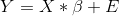

这看起来非常像我们之前使用的方程，除了字母都是大写的，这意味着它们是向量这一事实。

我们知道等级数据进入 Y 矩阵，但是什么进入了矩阵？请记住，在我们最初讨论线性回归时，除了我们感兴趣的独立变量之外，我们还需要添加一个常量，因此我们的矩阵（我们称之为 _ 设计矩阵 _）需要包括两列：一列表示研究时间变量，另一列表示研究时间变量，以及 mn，每个个体具有相同的值（我们通常用所有值填充）。我们可以以图形方式查看结果设计矩阵（参见图[14.3](#fig:GLMmatrix)）。

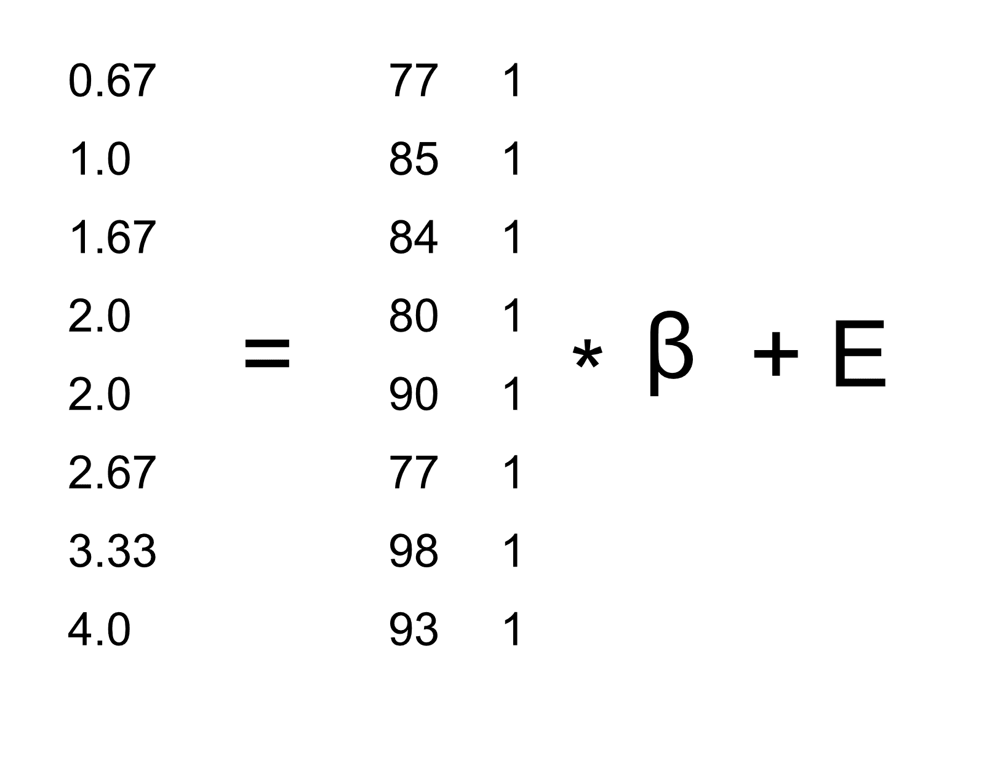

图 14.3 用矩阵代数描述研究时间数据的线性模型。

矩阵乘法规则告诉我们，矩阵的维数必须相互匹配；在这种情况下，设计矩阵的维数为 8（行）x 2（列），Y 变量的维数为 8 x 1。因此，矩阵需要尺寸为 2 x 1，因为一个 8 x 2 矩阵乘以一个 2 x 1 矩阵会得到一个 8 x 1 矩阵（作为匹配的中间尺寸退出）。对矩阵中的两个值的解释是，它们分别乘以研究时间和 1，得出每个个体的估计等级。我们还可以将线性模型视为每个个体的一组单独方程：


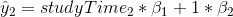

……

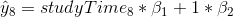

记住，我们的目标是根据已知的和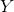值确定的最佳拟合值。这样做的一个简单方法是使用简单代数来求解——这里我们去掉了错误项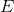，因为它超出了我们的控制范围：

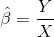

这里的挑战是和现在是矩阵，而不是单个数字——但是线性代数的规则告诉我们如何除以矩阵，这与乘以矩阵的 _ 逆 _ 相同（称为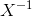）。我们可以在 r 中这样做：

```r
# compute beta estimates using linear algebra

Y <- as.matrix(df$grade) #create Y variable 8 x 1 matrix
X <- matrix(0, nrow = 8, ncol = 2) #create X variable 8 x 2 matrix
X[, 1] <- as.matrix(df$studyTime) #assign studyTime values to first column in X matrix
X[, 2] <- 1 #assign constant of 1 to second column in X matrix

# compute inverse of X using ginv()
# %*% is the R matrix multiplication operator

beta_hat <- ginv(X) %*% Y #multiple the inverse of X by Y
print(beta_hat)
```

```r
##      [,1]
## [1,]  4.3
## [2,] 76.2
```

对于认真使用统计方法感兴趣的人，强烈鼓励他们花一些时间学习线性代数，因为它为几乎所有用于标准统计的工具提供了基础。

### 14.1.3 相关性与回归的关系

相关系数与回归系数有着密切的关系。记住，皮尔逊的相关系数是以协方差的比值和 x 和 y 的标准差的乘积来计算的：

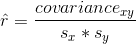

而回归β的计算公式为：

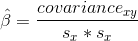

基于这两个方程，我们可以得出和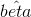之间的关系：

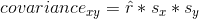

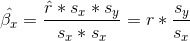

也就是说，回归斜率等于相关值乘以 y 和 x 的标准差之比。这告诉我们的一件事是，当 x 和 y 的标准差相同时（例如，当数据被转换为 z 分数时），则相关估计等于 l 回归斜率估计。

### 14.1.4 回归模型的标准误差

如果我们想对回归参数估计进行推断，那么我们还需要对它们的可变性进行估计。为了计算这一点，我们首先需要计算模型的 _ 残差方差 _ 或 _ 误差方差 _——也就是说，依赖变量中有多少可变性不是由模型解释的。模型残差计算如下：

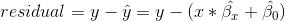

然后我们计算 _ 平方误差之和（sse）_：

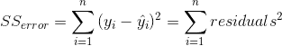

由此我们计算出 _ 的均方误差 _：

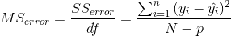

其中，自由度（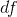）是通过从观测值（）中减去估计参数（本例中为 2 个参数：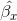和）来确定的。一旦我们有了均方误差，我们就可以将模型的标准误差计算为：


为了得到特定回归参数估计的标准误差，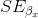，我们需要根据 x 变量平方和的平方根重新调整模型的标准误差：

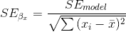

### 14.1.5 回归参数的统计检验

一旦我们得到了参数估计值及其标准误差，我们就可以计算出一个 _t_ 统计数据，告诉我们观察到的参数估计值与无效假设下的某些预期值相比的可能性。在这种情况下，我们将根据无效假设（即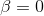）进行测试：

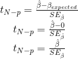

在 R 中，我们不需要手工计算这些值，因为它们由`lm()`函数自动返回给我们：

```r
summary(lmResult)
```

```r
## 
## Call:
## lm(formula = grade ~ studyTime, data = df)
## 
## Residuals:
##     Min      1Q  Median      3Q     Max 
## -10.656  -2.719   0.125   4.703   7.469 
## 
## Coefficients:
##             Estimate Std. Error t value Pr(>|t|)    
## (Intercept)    76.16       5.16   14.76  6.1e-06 ***
## studyTime       4.31       2.14    2.01    0.091 .  
## ---
## Signif. codes:  0 '***' 0.001 '**' 0.01 '*' 0.05 '.' 0.1 ' ' 1
## 
## Residual standard error: 6.4 on 6 degrees of freedom
## Multiple R-squared:  0.403,  Adjusted R-squared:  0.304 
## F-statistic: 4.05 on 1 and 6 DF,  p-value: 0.0907
```

在这种情况下，我们看到截距明显不同于零（这不是很有趣），并且研究时间对成绩的影响微乎其微。

### 14.1.6 模型拟合优度的量化

有时量化模型在整体上与数据的匹配程度是很有用的，而做到这一点的一种方法是询问模型对数据中的可变性有多大的解释。这是使用一个名为的值（也称为 _ 确定系数 _）来量化的。如果只有一个 x 变量，那么只需将相关系数平方即可轻松计算：

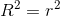

对于我们的研究时间数据，=0.4，这意味着我们已经占了数据方差的 40%。

更一般地说，我们可以将看作是模型所占数据中方差分数的度量，可以通过将方差分解为多个分量来计算：

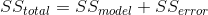

其中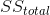是数据的方差（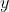），并且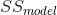和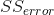如本章前面所示进行计算。利用这个，我们可以计算确定系数为：

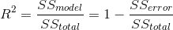

的一个小值告诉我们，即使模型拟合具有统计意义，它也只能解释数据中的少量信息。