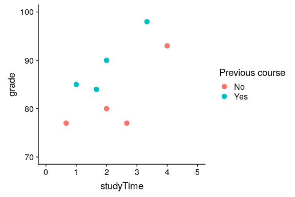
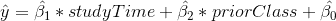
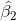

## 14.2 安装更复杂的模型

我们通常希望了解多个变量对某些特定结果的影响，以及它们如何相互关联。在我们学习时间的例子中，假设我们发现一些学生以前参加过关于这个主题的课程。如果我们绘制他们的成绩（见图[14.4](#fig:StudytimeGradesPrior)），我们可以看到，在相同的学习时间内，那些上过一门课的学生比没有上过课的学生表现要好得多。



图 14.4 学习时间和成绩之间的关系，颜色标识每个学生是否上过该主题的课程

我们希望建立一个考虑到这一点的统计模型，我们可以通过扩展我们在上面建立的模型来实现这一点：



为了模拟每个人是否有以前的类，我们使用我们称之为 _ 的伪编码 _ 来创建一个新变量，该变量的值为 1 表示以前有过一个类，否则为零。这意味着，对于以前上过课的人，我们只需将的值添加到他们的预测值中——也就是说，使用虚拟编码只是反映了两组人之间的平均值差异。我们对的估计反映了所有数据点的回归斜率——我们假设回归斜率是相同的，不管以前是否有过类（见图[14.5](#fig:LinearRegressionByPriorClass)）。

```r
# perform linear regression for study time and prior class

# must change priorClass to a factor variable
df$priorClass <- as.factor(df$priorClass)

lmResultTwoVars <- lm(grade ~ studyTime + priorClass, data = df)
summary(lmResultTwoVars)
```

```r
## 
## Call:
## lm(formula = grade ~ studyTime + priorClass, data = df)
## 
## Residuals:
##       1       2       3       4       5       6       7       8 
##  3.5833  0.7500 -3.5833 -0.0833  0.7500 -6.4167  2.0833  2.9167 
## 
## Coefficients:
##             Estimate Std. Error t value Pr(>|t|)    
## (Intercept)    70.08       3.77   18.60  8.3e-06 ***
## studyTime       5.00       1.37    3.66    0.015 *  
## priorClass1     9.17       2.88    3.18    0.024 *  
## ---
## Signif. codes:  0 '***' 0.001 '**' 0.01 '*' 0.05 '.' 0.1 ' ' 1
## 
## Residual standard error: 4 on 5 degrees of freedom
## Multiple R-squared:  0.803,  Adjusted R-squared:  0.724 
## F-statistic: 10.2 on 2 and 5 DF,  p-value: 0.0173
```


图 14.5 研究时间和年级之间的关系，包括作为模型中额外组成部分的先前经验。蓝线表示与学习时间相关的坡度，黑色虚线表示两组之间平均值的差异。