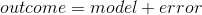
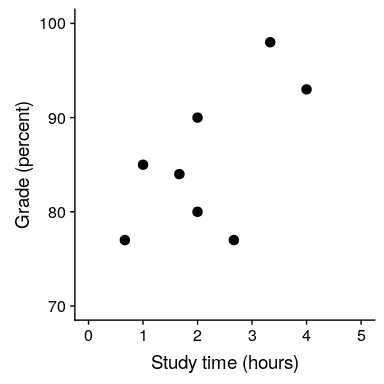

# 14 一般线性模型

请记住，在本书的早期，我们描述了统计的基本模型：



其中，我们的一般目标是找到最大限度地减少错误的模型，并受一些其他约束（例如保持模型相对简单，以便我们可以在特定数据集之外进行归纳）。在本章中，我们将重点介绍这种方法的特殊实现，即 _ 一般线性模型 _（或 GLM）。您已经在前面一章中看到了将模型拟合到数据的一般线性模型，我们在 nhanes 数据集中将高度建模为年龄的函数；在这里，我们将更全面地介绍 GLM 的概念及其许多用途。

在讨论一般线性模型之前，我们先定义两个对我们的讨论很重要的术语：

*   _ 因变量 _：这是我们的模型要解释的结果变量（通常称为 _y_）
*   _ 自变量 _：这是一个我们希望用来解释因变量的变量（通常称为 _x_）。

可能有多个自变量，但对于本课程，我们的分析中只有一个因变量。

一般线性模型是由独立变量的 _ 线性组合 _ 组成的，每个独立变量乘以一个权重（通常称为希腊字母 beta-），确定相对贡献。模型预测的自变量。

作为一个例子，让我们为学习时间和考试成绩之间的关系生成一些模拟数据（参见图[14.1](#fig:StudytimeGrades)）。

```r
# create simulated data for example
set.seed(12345)

# the number of points that having a prior class increases grades
betas <- c(6, 5)

df <-
  tibble(
    studyTime = c(2, 3, 5, 6, 6, 8, 10, 12) / 3,
    priorClass = c(0, 1, 1, 0, 1, 0, 1, 0)
  ) %>%
  mutate(
    grade = 
      studyTime * betas[1] + 
      priorClass * betas[2] + 
      round(rnorm(8, mean = 70, sd = 5))
  )
```



图 14.1 学习时间与成绩的关系

鉴于这些数据，我们可能希望参与三项基本统计活动：

*   _ 描述一下 _：年级和学习时间之间的关系有多强？
*   _ 决定 _：年级和学习时间之间有统计学意义的关系吗？
*   _ 预测 _：给定特定的学习时间，我们期望达到什么级别？

在最后一章中，我们学习了如何使用相关系数来描述两个变量之间的关系，因此我们可以使用它来描述这里的关系，并测试相关性是否具有统计意义：

```r
# compute correlation between grades and study time
corTestResult <- cor.test(df$grade, df$studyTime, alternative = "greater")
corTestResult
```

```r
## 
##  Pearson's product-moment correlation
## 
## data:  df$grade and df$studyTime
## t = 2, df = 6, p-value = 0.05
## alternative hypothesis: true correlation is greater than 0
## 95 percent confidence interval:
##  0.014 1.000
## sample estimates:
##  cor 
## 0.63
```

相关性很高，但由于样本量很小，几乎没有达到统计显著性。